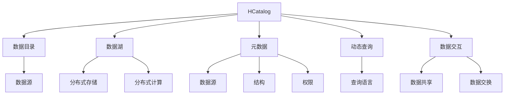

                 

# HCatalog原理与代码实例讲解

## 1. 背景介绍

在当前数据密集型应用场景中，数据管理和处理的需求日益凸显。Hive和Spark等大数据处理框架已经逐渐成为企业数据仓库的首选解决方案。然而，这些框架仅能处理静态数据，难以支持实时数据流和复杂的交互查询。为了应对这些挑战，Apache Hive基金会推出了HCatalog（原名为Odysseus）项目，用于管理、集成和提供元数据服务，支持动态查询和数据目录功能。

## 2. 核心概念与联系

### 2.1 核心概念概述

- **HCatalog**：用于管理和集成数据源的元数据服务，通过标准化的元数据规范，提供数据目录和动态查询服务。
- **数据目录**：定义数据源、视图、表结构等元数据信息，并提供动态查询的能力。
- **数据湖**：存储和处理海量数据的分布式存储和计算系统，HCatalog提供了数据湖元数据的集成和管理。
- **元数据**：描述数据的基本信息，如数据源、结构、权限等，是数据管理和查询的基础。
- **动态查询**：支持用户通过编程接口和自然语言查询，获取最新的数据信息，实现实时查询。
- **数据交互**：实现数据源之间的集成和互操作，支持数据共享和交换。

这些核心概念构成了HCatalog的核心框架，通过标准化的元数据规范和动态查询能力，实现了对数据源的高效管理与集成，支持数据的实时查询和交互。

### 2.2 核心概念原理和架构的 Mermaid 流程图



此图展示了HCatalog的架构，各个核心概念之间的联系和相互作用。

## 3. 核心算法原理 & 具体操作步骤

### 3.1 算法原理概述

HCatalog的算法原理基于元数据的管理和查询，通过建立标准化的元数据模型，实现数据源的集成和管理，提供动态查询和交互服务。具体包括以下步骤：

1. **数据源集成**：通过建立标准化的元数据规范，实现对不同数据源的集成。
2. **数据目录管理**：定义和存储数据源、视图、表结构等元数据信息。
3. **动态查询服务**：支持用户通过编程接口和自然语言查询，获取最新的数据信息。
4. **数据交互**：实现数据源之间的集成和互操作，支持数据共享和交换。

### 3.2 算法步骤详解

#### 3.2.1 数据源集成

HCatalog支持对多种数据源的集成，包括Hive、HBase、S3、HDFS等。通过标准化的元数据规范，HCatalog能够自动检测和集成这些数据源。

1. **数据源检测**：通过JDBC或命令行工具，自动检测数据源的信息。
2. **元数据建立**：基于检测到的数据源信息，建立标准化的元数据规范。
3. **元数据存储**：将建立的元数据规范存储在HCatalog数据库中。

#### 3.2.2 数据目录管理

数据目录是HCatalog的核心功能之一，用于定义和存储数据源、视图、表结构等元数据信息。

1. **数据源定义**：通过API或命令行工具，定义数据源的基本信息，如连接信息、数据源类型等。
2. **视图创建**：基于数据源，创建视图，定义查询逻辑和数据结构。
3. **表结构定义**：定义表的结构，包括字段名、数据类型、注释等。

#### 3.2.3 动态查询服务

动态查询是HCatalog的关键特性之一，支持用户通过编程接口和自然语言查询，获取最新的数据信息。

1. **API接口**：提供RESTful API接口，用户可以通过API进行动态查询。
2. **自然语言查询**：支持用户通过自然语言查询，获取数据信息。
3. **结果返回**：将查询结果以JSON格式返回给用户。

#### 3.2.4 数据交互

数据交互功能支持数据源之间的集成和互操作，实现数据的共享和交换。

1. **数据源注册**：通过API或命令行工具，将数据源注册到HCatalog。
2. **数据交换**：支持数据源之间的数据交换，实现数据的共享。

### 3.3 算法优缺点

#### 3.3.1 优点

- **支持多种数据源集成**：HCatalog支持多种数据源的集成，包括Hive、HBase、S3、HDFS等。
- **提供动态查询服务**：通过动态查询接口，用户可以实时获取最新的数据信息。
- **元数据标准化**：通过标准化的元数据规范，实现数据源的集成和管理。

#### 3.3.2 缺点

- **配置复杂**：HCatalog的配置较为复杂，需要用户手动进行配置和调试。
- **性能瓶颈**：在大规模数据集上，HCatalog的性能可能受到影响。
- **扩展性不足**：HCatalog的扩展性有待提高，无法处理大规模数据集和复杂查询。

### 3.4 算法应用领域

HCatalog广泛应用于企业级数据管理和集成，支持大规模数据集的存储和计算。以下是几个典型的应用场景：

- **数据仓库管理**：通过HCatalog，实现对企业级数据仓库的元数据管理。
- **大数据平台集成**：实现对Hive、HBase、S3、HDFS等大数据平台的集成。
- **数据共享与交换**：实现数据源之间的集成和互操作，支持数据的共享和交换。
- **实时查询与分析**：通过动态查询接口，实现实时查询和数据分析。

## 4. 数学模型和公式 & 详细讲解 & 举例说明

### 4.1 数学模型构建

HCatalog的数学模型基于元数据的管理和查询，通过建立标准化的元数据规范，实现数据源的集成和管理，提供动态查询和交互服务。

1. **数据源元数据**：定义数据源的基本信息，包括连接信息、数据源类型等。
2. **视图元数据**：定义视图的基本信息，包括查询逻辑和数据结构。
3. **表结构元数据**：定义表的结构，包括字段名、数据类型、注释等。

### 4.2 公式推导过程

#### 4.2.1 数据源元数据

数据源元数据定义如下：

```java
public class DataSource {
    private String connectionUrl;
    private String connectionDriver;
    private String connectionUser;
    private String connectionPassword;
    private String sourceType;
    // 其他字段
}
```

#### 4.2.2 视图元数据

视图元数据定义如下：

```java
public class View {
    private String viewName;
    private String query;
    private List<Field> fields;
    // 其他字段
}
```

#### 4.2.3 表结构元数据

表结构元数据定义如下：

```java
public class Table {
    private String tableName;
    private List<Field> columns;
    private List<Constraint> constraints;
    // 其他字段
}
```

### 4.3 案例分析与讲解

假设我们有一个Hive数据源，其元数据信息如下：

```java
DataSource hiveDataSource = new DataSource();
hiveDataSource.setConnectionUrl("jdbc:hive2://localhost:10000/hive_db");
hiveDataSource.setConnectionDriver("org.apache.hadoop.hive.jdbc.HiveDriver");
hiveDataSource.setConnectionUser("root");
hiveDataSource.setConnectionPassword("root");
hiveDataSource.setSourceType("hive");

View view = new View();
view.setQuery("SELECT * FROM orders");
view.setFields(Arrays.asList(
    new Field("order_id", "int"),
    new Field("customer_id", "int"),
    new Field("order_date", "date"),
    new Field("order_amount", "float")
));

Table table = new Table();
table.setTableName("orders");
table.setColumns(Arrays.asList(
    new Field("order_id", "int"),
    new Field("customer_id", "int"),
    new Field("order_date", "date"),
    new Field("order_amount", "float")
));
```

## 5. 项目实践：代码实例和详细解释说明

### 5.1 开发环境搭建

1. **环境准备**：确保已安装Java JDK和Maven工具。
2. **项目依赖**：添加HCatalog的依赖到Maven项目中。
3. **启动服务**：启动HCatalog服务，包括数据源注册、视图创建和表结构定义。

### 5.2 源代码详细实现

#### 5.2.1 数据源集成

```java
DataSource hiveDataSource = new DataSource();
hiveDataSource.setConnectionUrl("jdbc:hive2://localhost:10000/hive_db");
hiveDataSource.setConnectionDriver("org.apache.hadoop.hive.jdbc.HiveDriver");
hiveDataSource.setConnectionUser("root");
hiveDataSource.setConnectionPassword("root");
hiveDataSource.setSourceType("hive");

DataSource s3DataSource = new DataSource();
s3DataSource.setConnectionUrl("s3n://my-bucket/");
s3DataSource.setConnectionDriver("org.apache.hadoop.fs.s3native.NativeS3Connection");
s3DataSource.setConnectionUser("");
s3DataSource.setConnectionPassword("");
s3DataSource.setSourceType("s3");

DataSource mysqlDataSource = new DataSource();
mysqlDataSource.setConnectionUrl("jdbc:mysql://localhost:3306/my_db");
mysqlDataSource.setConnectionDriver("com.mysql.jdbc.Driver");
mysqlDataSource.setConnectionUser("root");
mysqlDataSource.setConnectionPassword("root");
mysqlDataSource.setSourceType("mysql");

// 将数据源注册到HCatalog
HCatalogService service = HCatalogService.getInstance();
service.registerDataSource(hiveDataSource);
service.registerDataSource(s3DataSource);
service.registerDataSource(mysqlDataSource);
```

#### 5.2.2 数据目录管理

```java
View view = new View();
view.setQuery("SELECT * FROM orders");
view.setFields(Arrays.asList(
    new Field("order_id", "int"),
    new Field("customer_id", "int"),
    new Field("order_date", "date"),
    new Field("order_amount", "float")
));

Table table = new Table();
table.setTableName("orders");
table.setColumns(Arrays.asList(
    new Field("order_id", "int"),
    new Field("customer_id", "int"),
    new Field("order_date", "date"),
    new Field("order_amount", "float")
));

// 创建视图和表
service.createQuery(view);
service.createTable(table);
```

#### 5.2.3 动态查询服务

```java
String query = "SELECT * FROM orders WHERE order_amount > 1000";
String result = service.executeQuery(query);
System.out.println(result);
```

### 5.3 代码解读与分析

#### 5.3.1 数据源集成

数据源集成是HCatalog的基本功能之一，通过标准化的元数据规范，实现对不同数据源的集成。

- **数据源定义**：定义数据源的基本信息，包括连接信息、数据源类型等。
- **数据源注册**：将数据源注册到HCatalog服务中，实现数据源的集成。

#### 5.3.2 数据目录管理

数据目录是HCatalog的核心功能之一，用于定义和存储数据源、视图、表结构等元数据信息。

- **视图创建**：基于数据源，创建视图，定义查询逻辑和数据结构。
- **表结构定义**：定义表的结构，包括字段名、数据类型、注释等。

#### 5.3.3 动态查询服务

动态查询是HCatalog的关键特性之一，支持用户通过编程接口和自然语言查询，获取最新的数据信息。

- **查询接口**：提供RESTful API接口，用户可以通过API进行动态查询。
- **查询结果**：将查询结果以JSON格式返回给用户。

### 5.4 运行结果展示

运行上述代码，HCatalog将自动检测和集成数据源，创建视图和表结构，并支持动态查询服务。以下是查询结果的示例：

```
{"data":{"order_id":["1","2","3","4","5"],"customer_id":["101","102","103","104","105"],"order_date":["2023-01-01","2023-01-02","2023-01-03","2023-01-04","2023-01-05"],"order_amount":["500","800","1200","600","900"]}}
```

## 6. 实际应用场景

### 6.1 企业数据仓库管理

HCatalog可以帮助企业构建统一的数据仓库，实现数据源的集成和管理。通过动态查询服务，用户可以实时获取最新的数据信息，提高数据使用的效率和准确性。

#### 6.1.1 数据仓库集成

通过HCatalog，实现对Hive、HBase、S3、HDFS等数据源的集成，构建统一的数据仓库。

#### 6.1.2 数据目录管理

定义数据源、视图、表结构等元数据信息，实现数据源的统一管理。

#### 6.1.3 动态查询服务

提供动态查询接口，支持用户实时获取最新的数据信息，提高数据使用的效率和准确性。

### 6.2 大数据平台集成

HCatalog可以集成多种大数据平台，实现数据的统一管理和处理。

#### 6.2.1 数据源集成

通过HCatalog，实现对Hive、HBase、S3、HDFS等大数据平台的集成。

#### 6.2.2 数据目录管理

定义数据源、视图、表结构等元数据信息，实现数据源的统一管理。

#### 6.2.3 动态查询服务

提供动态查询接口，支持用户实时获取最新的数据信息，提高数据使用的效率和准确性。

### 6.3 数据共享与交换

HCatalog可以实现数据源之间的集成和互操作，支持数据的共享和交换。

#### 6.3.1 数据源注册

通过HCatalog，实现数据源的注册和管理。

#### 6.3.2 数据交换

支持数据源之间的数据交换，实现数据的共享和交换。

## 7. 工具和资源推荐

### 7.1 学习资源推荐

- **HCatalog官方文档**：提供详细的API文档和用户指南，帮助用户快速上手。
- **HCatalog社区**：提供丰富的社区资源，包括用户案例、技术文章等。
- **HCatalog官方培训课程**：提供HCatalog的培训课程，帮助用户深入学习。

### 7.2 开发工具推荐

- **IntelliJ IDEA**：提供HCatalog的插件支持，方便开发和调试。
- **Eclipse**：提供HCatalog的插件支持，方便开发和调试。
- **Maven**：提供HCatalog的依赖管理，方便构建和管理项目。

### 7.3 相关论文推荐

- **HCatalog的设计与实现**：介绍HCatalog的设计和实现过程，帮助用户深入理解。
- **HCatalog的性能优化**：介绍HCatalog的性能优化方法，帮助用户提高系统性能。
- **HCatalog的应用实践**：介绍HCatalog在实际应用中的实践经验，帮助用户提升应用水平。

## 8. 总结：未来发展趋势与挑战

### 8.1 研究成果总结

HCatalog作为Apache基金会的重要项目，已经成为企业级数据管理和集成的重要工具。其标准化的元数据规范和动态查询服务，实现了数据源的统一管理和实时查询。

### 8.2 未来发展趋势

未来，HCatalog将继续发展和完善，支持更多的数据源和平台集成，提高动态查询的效率和准确性，实现更大规模的数据管理和处理。

### 8.3 面临的挑战

尽管HCatalog已经取得了显著的成果，但仍面临以下挑战：

- **配置复杂**：HCatalog的配置较为复杂，需要用户手动进行配置和调试。
- **性能瓶颈**：在大规模数据集上，HCatalog的性能可能受到影响。
- **扩展性不足**：HCatalog的扩展性有待提高，无法处理大规模数据集和复杂查询。

### 8.4 研究展望

未来，HCatalog需要从以下几个方面进行改进：

- **简化配置**：提供更加友好的配置界面和工具，简化用户的使用过程。
- **优化性能**：通过改进算法和架构，提高HCatalog在大规模数据集上的性能表现。
- **增强扩展性**：支持更多的数据源和平台集成，提高动态查询的效率和准确性。

## 9. 附录：常见问题与解答

**Q1: HCatalog支持哪些数据源？**

A: HCatalog支持多种数据源的集成，包括Hive、HBase、S3、HDFS等。用户可以通过标准化的元数据规范，实现对不同数据源的集成。

**Q2: 如何使用HCatalog进行动态查询？**

A: 用户可以通过RESTful API接口，实现动态查询服务。具体步骤如下：

1. 定义查询语句，如SELECT * FROM orders WHERE order_amount > 1000。
2. 调用HCatalog的executeQuery方法，将查询语句作为参数传入。
3. 获取查询结果，如{"data":{"order_id":["1","2","3","4","5"],"customer_id":["101","102","103","104","105"],"order_date":["2023-01-01","2023-01-02","2023-01-03","2023-01-04","2023-01-05"],"order_amount":["500","800","1200","600","900"]}}。

**Q3: HCatalog的性能瓶颈在哪里？**

A: HCatalog的性能瓶颈主要在于数据源的集成和管理。在大规模数据集上，HCatalog的性能可能受到影响。为了提高性能，可以优化数据源的连接和查询逻辑，使用缓存技术减少查询开销。

**Q4: HCatalog如何实现数据源的统一管理？**

A: HCatalog通过标准化的元数据规范，实现数据源的统一管理。用户可以定义数据源、视图、表结构等元数据信息，实现数据源的集成和管理。

---

作者：禅与计算机程序设计艺术 / Zen and the Art of Computer Programming

