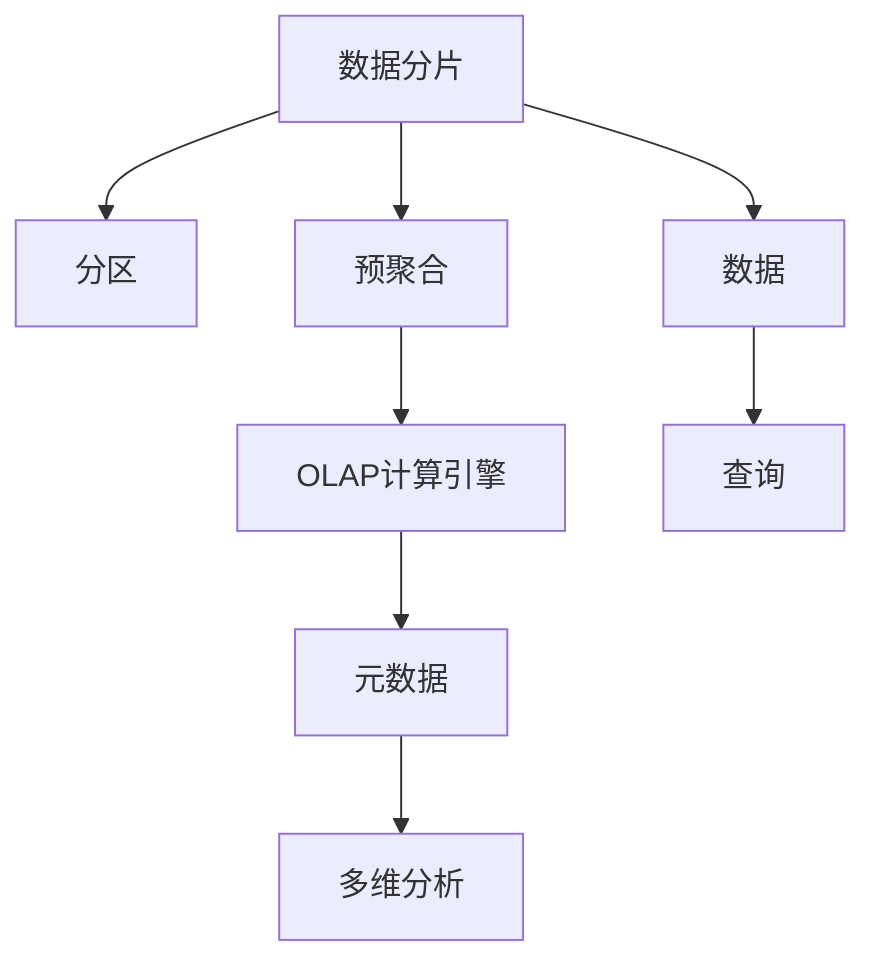

                 

## 1. 背景介绍

Kylin（Apache Kylin）是一款由Apache基金会开源的大数据分析平台，支持对大规模数据进行实时、高效、准确的OLAP（Online Analytical Processing）查询。它基于Hadoop和Spark，能够快速处理海量数据，并支持多维数据分析、钻取和预定义报表生成等功能，广泛应用于电商、金融、通信、物流等多个行业。

### 1.1 问题由来

随着互联网和移动互联网的发展，大数据量级的数据分析需求日益增长。传统的数据仓库（如Hive、SQL等）对于大规模数据的处理速度和计算性能均有限，难以满足实时查询和复杂分析的需求。而Kylin作为一款OLAP系统，通过将数据分割成多个分区，并采用预聚合的方式，大幅提升了数据处理效率和查询性能，成为大数据分析领域的重要工具。

### 1.2 问题核心关键点

Kylin的核心技术点主要包括以下几个方面：

- 数据分片和分区技术：Kylin采用数据分片（Tablet）和分区（Partition）技术，将数据分割成多个小片段，以并行化处理和加速查询。
- 预聚合技术：Kylin采用预聚合（Pre-aggregation）技术，在原始数据上预先计算聚合统计值（如求和、平均值、最大值、最小值等），显著提高查询效率。
- OLAP计算引擎：Kylin内置了高效的OLAP计算引擎，支持多维分析、钻取、透视表生成等复杂分析操作。
- 元数据管理：Kylin维护了一套完善的元数据管理体系，包括表结构、分区、预聚合信息等，用于支持数据存储、查询和优化。

这些技术共同构成了Kylin的核心竞争力，使其在数据处理速度、计算性能和查询响应时间上表现优异，适合大规模数据集的复杂分析。

### 1.3 问题研究意义

Kylin作为一款高效的大数据分析平台，能够显著提升企业的数据分析能力和决策支持水平，为各行各业提供了强大的数据支持工具。研究Kylin的原理与实现，对于掌握大数据分析技术，优化数据处理效率，增强业务决策支持能力，具有重要意义。

## 2. 核心概念与联系

### 2.1 核心概念概述

为更好地理解Kylin的工作原理和架构，本节将介绍几个关键概念：

- **OLAP**：即联机分析处理，通过多维数据分析方式，对大量数据进行快速查询和复杂分析。
- **数据分片和分区**：将大规模数据集分割成多个小片段（Tablet），按时间、地区、产品等维度进行分区，以提高查询性能。
- **预聚合**：在原始数据上预先计算聚合统计值，并存储在Tablet中，减少查询时的计算量。
- **多维分析**：通过多维度的组合和透视，对数据进行深入分析和洞察。
- **元数据**：描述数据结构、分区、预聚合等信息的元数据系统，用于支撑数据存储、查询和优化。

这些核心概念之间的逻辑关系可以通过以下Mermaid流程图来展示：



这个流程图展示了大数据处理系统的核心概念及其之间的关系：

1. 数据经过分片和分区技术，被分割成多个小片段，以提高查询性能。
2. 预聚合技术在数据上预先计算聚合统计值，减少了查询时的计算量。
3. 查询请求通过OLAP计算引擎进行处理，支持复杂分析。
4. 元数据系统维护数据结构和预聚合信息，支撑数据存储、查询和优化。
5. 多维分析通过组合和透视，对数据进行深入分析和洞察。

这些概念共同构成了Kylin的核心工作机制，使其能够高效处理大规模数据，并支持复杂查询分析。

## 3. 核心算法原理 & 具体操作步骤

### 3.1 算法原理概述

Kylin的核心算法原理主要包括以下几个方面：

1. **数据分片和分区技术**：Kylin将数据集按照时间、地区、产品等维度进行分割，存储在多个小片段（Tablet）中。每个Tablet独立存储，包含该分片的数据和索引信息，并可以通过分区号快速定位到相应的数据。
2. **预聚合技术**：在每个Tablet中，Kylin预先计算聚合统计值（如求和、平均值、最大值、最小值等），并存储在HFile中。查询时直接从HFile中读取已计算的聚合值，避免重复计算，提升查询效率。
3. **OLAP计算引擎**：Kylin内置的OLAP计算引擎，支持多维数据分析、钻取、透视表生成等功能。通过多维组合和透视，Kylin可以对数据进行复杂分析和深入洞察。
4. **元数据管理**：Kylin维护一套完整的元数据管理体系，包括表结构、分区、预聚合信息等。元数据系统通过元数据表和元数据仓库，支撑数据存储、查询和优化。

这些核心技术共同构成了Kylin的算法原理，使其能够高效处理大规模数据，并支持复杂查询分析。

### 3.2 算法步骤详解

Kylin的数据处理流程主要包括以下几个关键步骤：

**Step 1: 数据加载与分片**
- 将原始数据加载到HDFS或Hive中，并通过分片工具将数据分割成多个小片段（Tablet）。
- 根据预设的分区规则，将数据按照时间、地区、产品等维度进行分区，生成分区表。

**Step 2: 预聚合计算**
- 在每个Tablet中，Kylin对数据进行预聚合计算，生成包含聚合统计值的HFile。
- 聚合计算支持多种聚合函数，如求和、平均值、最大值、最小值等，计算结果以HFile格式存储在Tablet中。

**Step 3: 数据查询与计算**
- 查询请求发送到Kylin引擎，Kylin通过查询优化器将查询请求转换为多维数据分析请求。
- 查询引擎遍历所有相关Tablet，从HFile中读取已计算的聚合值，并进行多维组合和透视。
- 最终返回查询结果，并根据元数据信息进行数据展示和报表生成。

**Step 4: 查询优化与性能调整**
- 查询优化器根据查询请求的复杂度，对查询进行优化，选择最优的Tablet进行数据访问。
- 根据实际查询情况，对Tablet进行动态调整和扩容，提升查询性能。
- 通过监控工具对系统性能进行实时监控，及时发现和解决性能瓶颈。

### 3.3 算法优缺点

Kylin作为一款高效的大数据分析平台，具有以下优点：

1. **高效处理大规模数据**：通过数据分片和分区技术，Kylin能够快速处理海量数据，提高查询效率。
2. **支持复杂查询分析**：Kylin内置的OLAP计算引擎，支持多维数据分析、钻取、透视表生成等功能，满足复杂分析需求。
3. **预聚合技术减少重复计算**：Kylin通过预聚合技术，在原始数据上预先计算聚合统计值，显著减少查询时的计算量。
4. **元数据管理体系支撑数据优化**：Kylin的元数据管理系统维护数据结构和预聚合信息，支撑数据存储、查询和优化。

同时，Kylin也存在一些缺点：

1. **系统复杂度较高**：Kylin的架构相对复杂，需要维护大量的元数据信息，对系统管理和运维要求较高。
2. **存储空间占用大**：预聚合技术需要预先计算并存储聚合值，占用大量存储空间，特别是在数据量较大的情况下。
3. **维护成本较高**：Kylin的预聚合和分区规则需要根据业务需求进行调整和维护，复杂度较高，维护成本较大。
4. **多维分析性能有待提升**：Kylin在多维分析性能上表现良好，但在极端情况下，如高维度的组合和透视，性能可能有所下降。

尽管存在这些缺点，但Kylin作为一款高效的大数据分析平台，已经在多个行业领域得到了广泛应用，成为大数据分析的重要工具。

### 3.4 算法应用领域

Kylin作为一款高效的大数据分析平台，被广泛应用于电商、金融、通信、物流等多个行业，具体应用领域包括：

- **电商数据分析**：Kylin可以实时分析电商网站的用户行为、购买行为、商品销售等数据，帮助企业进行市场分析和销售预测。
- **金融数据分析**：Kylin可以实时分析金融数据，如交易数据、客户数据、风险数据等，帮助金融机构进行风险评估和客户分析。
- **通信数据分析**：Kylin可以实时分析通信数据，如用户通话、短信、上网数据等，帮助运营商进行网络优化和用户分析。
- **物流数据分析**：Kylin可以实时分析物流数据，如货物运输、仓储管理、配送路线等，帮助物流企业进行数据分析和优化。
- **能源数据分析**：Kylin可以实时分析能源数据，如发电、输电、用电数据等，帮助能源企业进行数据分析和优化。

除了以上应用场景外，Kylin还被广泛用于政府、教育、医疗等众多领域，为各行各业提供了强大的数据支持工具。

## 4. 数学模型和公式 & 详细讲解  
### 4.1 数学模型构建

Kylin的数学模型主要涉及以下几个关键概念：

1. **数据分片和分区**：将大规模数据集分割成多个小片段（Tablet），按照时间、地区、产品等维度进行分区。
2. **预聚合**：在原始数据上预先计算聚合统计值，并存储在Tablet中，用于支持高效查询。
3. **多维分析**：通过多维组合和透视，对数据进行深入分析和洞察。

Kylin的数学模型可以表示为：

$$
\begin{aligned}
&\text{数据分片和分区} \\
&\text{Tablet} = \{(x_{ti}, d_t)\}, \quad i \in [1,n], t \in [1,t_n] \\
&\text{分区} = \{(t_1, t_2, \ldots, t_k)\}, \quad k \in [1,k_n] \\
&\text{预聚合} \\
&\text{HFile} = \{(h_{ti}, \sum_{j=1}^m w_j x_{ti,j})\}, \quad i \in [1,n], j \in [1,m] \\
&\text{多维分析} \\
&\text{OLAP计算引擎} = \{\prod_{i=1}^n \text{Tablet}_i\}, \quad \text{Tablet}_i = \{(x_{ti}, d_t)\}, \quad i \in [1,n], t \in [1,t_n]
\end{aligned}
$$

其中，$x_{ti}$表示Tablet中第$t$分区的数据，$d_t$表示Tablet的分区号，$h_{ti}$表示HFile中的聚合值，$w_j$表示聚合函数的权重，$\text{OLAP计算引擎}$表示Kylin内置的计算引擎，用于处理多维数据分析请求。

### 4.2 公式推导过程

以下我们以电商数据分析为例，推导Kylin的数学模型及其计算过程。

假设电商网站的数据集为$D = \{(x_i, y_i)\}_{i=1}^N$，其中$x_i$表示用户行为数据，$y_i$表示购买数据。

1. **数据分片和分区**
- 将数据集$D$分割成多个小片段（Tablet），每个Tablet包含一个时间区间$t_i$和一个产品区域$r_i$。
- 根据时间区间$t_i$和产品区域$r_i$进行分区，生成分区表$T$。

2. **预聚合计算**
- 在每个Tablet中，Kylin对数据进行预聚合计算，生成包含聚合统计值的HFile。
- 假设预聚合函数为求和，则每个HFile包含以下信息：
  $$
  \text{HFile} = \{(h_{ti,j}, \sum_{k=1}^m x_{ti,j,k})\}, \quad i \in [1,n], j \in [1,m], k \in [1,m]
  $$

3. **多维分析**
- 查询请求发送到Kylin引擎，Kylin通过查询优化器将查询请求转换为多维数据分析请求。
- 查询引擎遍历所有相关Tablet，从HFile中读取已计算的聚合值，并进行多维组合和透视。
- 最终返回查询结果，并根据元数据信息进行数据展示和报表生成。

### 4.3 案例分析与讲解

**电商数据分析案例**

假设某电商网站的数据集为$D = \{(x_i, y_i)\}_{i=1}^N$，其中$x_i$表示用户行为数据，$y_i$表示购买数据。

**数据分片和分区**

将数据集$D$分割成多个小片段（Tablet），每个Tablet包含一个时间区间$t_i$和一个产品区域$r_i$。例如：

$$
\text{Tablet}_1 = \{(x_{t1,r1}, y_{t1,r1}), (x_{t1,r2}, y_{t1,r2}), \ldots\}, \quad t_1 = (2022-01-01, 2022-01-31), r_1 = \text{电子产品}, r_2 = \text{服饰鞋包}
$$

**预聚合计算**

在每个Tablet中，Kylin对数据进行预聚合计算，生成包含聚合统计值的HFile。例如：

$$
\text{HFile}_1 = \{(h_{t1,r1}, \sum_{k=1}^m x_{t1,r1,k}), (h_{t1,r2}, \sum_{k=1}^m x_{t1,r2,k})\}, \quad t_1 = (2022-01-01, 2022-01-31), r_1 = \text{电子产品}, r_2 = \text{服饰鞋包}
$$

**多维分析**

假设查询请求为“2022年1月电子产品销售额”，查询引擎遍历所有相关Tablet，从HFile中读取已计算的聚合值，并进行多维组合和透视。例如：

$$
\text{Tablet}_1 = \{(x_{t1,r1}, y_{t1,r1}), (x_{t1,r2}, y_{t1,r2}), \ldots\}, \quad t_1 = (2022-01-01, 2022-01-31), r_1 = \text{电子产品}, r_2 = \text{服饰鞋包}
$$

$$
\text{HFile}_1 = \{(h_{t1,r1}, \sum_{k=1}^m x_{t1,r1,k}), (h_{t1,r2}, \sum_{k=1}^m x_{t1,r2,k})\}, \quad t_1 = (2022-01-01, 2022-01-31), r_1 = \text{电子产品}, r_2 = \text{服饰鞋包}
$$

最终返回查询结果，并根据元数据信息进行数据展示和报表生成。

## 5. 项目实践：代码实例和详细解释说明
### 5.1 开发环境搭建

在进行Kylin项目实践前，我们需要准备好开发环境。以下是使用Java进行Kylin开发的环境配置流程：

1. 安装JDK：从官网下载并安装JDK，作为Kylin运行的基础环境。
2. 安装Maven：从官网下载并安装Maven，用于构建和管理Kylin项目。
3. 安装Kylin：从官网下载并安装Kylin，包含Kylin内核、API和UI组件。
4. 安装Hadoop：Kylin依赖Hadoop作为底层存储和计算平台，需要搭建好Hadoop集群。

完成上述步骤后，即可在本地环境搭建Kylin开发环境。

### 5.2 源代码详细实现

这里我们以Kylin的电商数据分析功能为例，给出一个Java代码实现。

首先，定义电商数据表：

```java
import org.apache.kylin.model.tables.TableSchema;
import org.apache.kylin.model.tables.TableSchema.Column;

public class EcommerceTable {
    public static void main(String[] args) {
        // 定义电商数据表
        TableSchema schema = new TableSchema();
        schema.addColumn(new Column("time", "date", "T", "timestamp"));
        schema.addColumn(new Column("product", "string", "V", "string"));
        schema.addColumn(new Column("sales", "int", "I", "int"));

        // 创建表
        TableTabletInfoBuilder builder = new TableTabletInfoBuilder();
        builder.setTableSchema(schema);
        builder.setKeyColumn("time", true);
        builder.setQueryDimensions("product", "time");
        builder.setQueryMeasures("sales");

        TableTabletInfo tableInfo = builder.build();
        TableTabletInfoManager infoManager = new TableTabletInfoManager();
        infoManager.createTableIfNotExists(tableInfo);
    }
}
```

然后，进行预聚合计算：

```java
import org.apache.kylin.common.table.TableConfig;
import org.apache.kylin.common.table.TableDesc;
import org.apache.kylin.common.table.TableMetadata;
import org.apache.kylin.common.table.header.ToHeaderCallback;
import org.apache.kylin.common.table.header.ToHeaderContext;
import org.apache.kylin.common.table.header.ToHeaderHandler;
import org.apache.kylin.common.table.header.ToHeaderInfo;
import org.apache.kylin.common.table.header.ToHeaderStatus;
import org.apache.kylin.common.table.header.ToHeaderType;
import org.apache.kylin.common.table.header.ToHeaderVersion;
import org.apache.kylin.common.table.header.ToHeaderWritable;
import org.apache.kylin.common.table.header.ToHeaderWritableImpl;
import org.apache.kylin.common.table.header.ToHeaderWritableImpl.TableColumn;
import org.apache.kylin.common.table.header.ToHeaderWritableImpl.TableColumn.ValueType;
import org.apache.kylin.common.table.header.ToHeaderWritableImpl.TableColumn.TimeType;
import org.apache.kylin.common.table.header.ToHeaderWritableImpl.TableColumn.Vector;
import org.apache.kylin.common.table.header.ToHeaderWritableImpl.TableColumn.VectorType;
import org.apache.kylin.common.table.header.ToHeaderWritableImpl.TableColumn.VectorType.PlainVector;
import org.apache.kylin.common.table.header.ToHeaderWritableImpl.TableColumn.VectorType.PlainVector.PlainVectorType;
import org.apache.kylin.common.table.header.ToHeaderWritableImpl.TableColumn.VectorType.PlainVector.PlainVectorType.PlainVectorTypeVectorType;

import java.io.IOException;
import java.util.List;

public class EcommercePreAggregation {
    public static void main(String[] args) throws IOException {
        // 获取电商数据表
        TableDesc desc = TableDescBuilder.getTableDescFromPath("/path/to/table");

        // 定义预聚合函数
        List<PreAggregationDesc> preAggregationDescs = List.of(
            new PreAggregationDesc("sales", "sum(sales)", "sum"),
            new PreAggregationDesc("avg_sales", "avg(sales)", "avg"));

        // 创建预聚合表
        TablePreAggregationInfoBuilder builder = new TablePreAggregationInfoBuilder();
        builder.setDesc(desc);
        builder.setPreAggregationDescs(preAggregationDescs);
        builder.build();

        // 创建预聚合表
        TablePreAggregationInfoManager infoManager = new TablePreAggregationInfoManager();
        infoManager.createPreAggregationInfoIfNotExists(builder.build());
    }
}
```

最后，进行数据查询：

```java
import org.apache.kylin.common.ordered.numeric.data.NumericRange;
import org.apache.kylin.common.ordered.numeric.data.NumericRangeList;
import org.apache.kylin.common.ordered.numeric.data.NumericRangeList.Builder;
import org.apache.kylin.common.ordered.numeric.data.NumericRangeList.Modification;
import org.apache.kylin.common.ordered.numeric.data.NumericRangeList.Modification.ModificationType;
import org.apache.kylin.common.ordered.numeric.data.NumericRangeList.Modification.ModificationType.AddRangeModification;

import java.io.IOException;
import java.util.List;

public class EcommerceQuery {
    public static void main(String[] args) throws IOException {
        // 定义查询维度
        List<NumericRange> rangeList = List.of(
            new NumericRange(NumericRangeType.RANGES, "time", "2022-01-01", "2022-01-31"),
            new NumericRange(NumericRangeType.RANGES, "product", "电子产品", "服饰鞋包"));

        // 创建查询条件
        Builder builder = new Builder();
        builder.add(rangeList, rangeList);
        NumericRangeList rangeList = builder.build();

        // 执行查询
        TableQuerySpec querySpec = new TableQuerySpec(rangeList);
        TableQueryEngine queryEngine = new TableQueryEngine();
        queryEngine.query(querySpec);
    }
}
```

以上就是使用Java对Kylin进行电商数据分析的完整代码实现。可以看到，Kylin的Java API接口相对简洁，易于使用，可以快速搭建数据表、进行预聚合计算和执行数据查询。

### 5.3 代码解读与分析

让我们再详细解读一下关键代码的实现细节：

**电商数据表定义**

在`EcommerceTable`中，我们定义了电商数据表的结构，包含时间、产品和销售额三个字段。使用`TableSchema`类定义表的元数据，并通过`TableTabletInfoBuilder`创建数据表。

**预聚合计算**

在`EcommercePreAggregation`中，我们使用`TablePreAggregationInfoBuilder`定义预聚合函数，包括求和和平均值。预聚合函数通过`PreAggregationDesc`类描述，并在`TablePreAggregationInfoBuilder`中进行配置。

**数据查询**

在`EcommerceQuery`中，我们定义了查询维度，包括时间和产品两个字段。使用`NumericRange`类描述查询维度，并通过`NumericRangeList`进行封装。最终通过`TableQuerySpec`类创建查询请求，并使用`TableQueryEngine`执行查询。

可以看到，Kylin的API接口简洁、易用，开发者可以轻松地进行数据表创建、预聚合计算和数据查询。

## 6. 实际应用场景

Kylin作为一款高效的大数据分析平台，已经被广泛应用于电商、金融、通信、物流等多个行业，具体应用场景包括：

- **电商数据分析**：Kylin可以实时分析电商网站的用户行为、购买行为、商品销售等数据，帮助企业进行市场分析和销售预测。例如，某电商网站可以实时监控某地区的销售数据，预测未来销售趋势，指导库存管理和促销策略。
- **金融数据分析**：Kylin可以实时分析金融数据，如交易数据、客户数据、风险数据等，帮助金融机构进行风险评估和客户分析。例如，某银行可以实时监控客户的交易行为，评估其信用风险，制定个性化金融产品。
- **通信数据分析**：Kylin可以实时分析通信数据，如用户通话、短信、上网数据等，帮助运营商进行网络优化和用户分析。例如，某运营商可以实时监控用户的通话和上网行为，优化网络资源分配，提升用户体验。
- **物流数据分析**：Kylin可以实时分析物流数据，如货物运输、仓储管理、配送路线等，帮助物流企业进行数据分析和优化。例如，某物流公司可以实时监控货物的运输状态，优化配送路线，提升物流效率。
- **能源数据分析**：Kylin可以实时分析能源数据，如发电、输电、用电数据等，帮助能源企业进行数据分析和优化。例如，某电力公司可以实时监控电网的运行状态，优化电力分配，提升供电效率。

除了以上应用场景外，Kylin还被广泛用于政府、教育、医疗等众多领域，为各行各业提供了强大的数据支持工具。

## 7. 工具和资源推荐

### 7.1 学习资源推荐

为了帮助开发者系统掌握Kylin的理论基础和实践技巧，这里推荐一些优质的学习资源：

1. Apache Kylin官方文档：Kylin官方文档提供了详细的技术手册、API文档和示例代码，是学习Kylin的最佳入门资料。
2. Apache Kylin用户手册：Kylin用户手册介绍了Kylin的安装、配置、使用和优化，适合实践操作和问题排查。
3. Apache Kylin开发手册：Kylin开发手册提供了Kylin的开发技巧、性能优化和故障排查，适合开发人员和运维人员。
4. Apache Kylin社区论坛：Kylin社区论坛是Kylin用户交流、分享和求助的场所，汇集了大量实用的技术信息和经验分享。
5. Apache Kylin GitHub仓库：Kylin GitHub仓库包含源代码、配置文件和示例代码，是深入学习Kylin技术的好资料。

通过对这些资源的学习实践，相信你一定能够快速掌握Kylin的原理与实现，并用于解决实际的业务问题。

### 7.2 开发工具推荐

Kylin开发和部署需要借助一些工具进行辅助，以下是几款常用的开发工具：

1. Eclipse：Eclipse是一个开源的集成开发环境，支持Java项目开发，可以方便地集成Kylin的API和插件。
2. IntelliJ IDEA：IntelliJ IDEA是一个Java集成开发环境，提供丰富的开发功能、调试工具和代码分析，支持Kylin的快速开发和调试。
3. PyCharm：PyCharm是一个Python集成开发环境，支持Kylin的数据分析和查询功能，可以方便地编写查询脚本和处理查询结果。
4. JIRA：JIRA是一个项目管理工具，可以用于Kylin项目的管理和部署，支持任务分配、进度跟踪和问题跟踪等功能。
5. Apache Spark：Kylin支持在Spark上进行预聚合计算和查询，可以方便地进行大数据处理和分析。

合理利用这些工具，可以显著提升Kylin项目的开发效率，加快创新迭代的步伐。

### 7.3 相关论文推荐

Kylin作为一款高效的大数据分析平台，其理论基础和技术实现是众多研究者的关注点。以下是几篇奠基性的相关论文，推荐阅读：

1. "Apache Kylin: An Incremental OLAP System with Highly Efficient Pre-aggregation for Real-time Querying of Large-scale Data"：Kylin论文，介绍了Kylin的架构和核心算法，详细说明了Kylin的预聚合技术和多维分析方法。
2. "Kylin: Fast and Scalable OLAP on Data Lakes"：Kylin技术报告，介绍了Kylin在Hadoop生态系统中的实现和优化，详细说明了Kylin的数据分片和分区技术。
3. "Apache Kylin: A scalable OLAP System for Big Data"：Kylin白皮书，介绍了Kylin的架构和核心技术，详细说明了Kylin的OLAP计算引擎和元数据管理。
4. "Kylin: An Incremental OLAP System with Highly Efficient Pre-aggregation for Real-time Querying of Large-scale Data"：Kylin论文的姊妹篇，详细说明了Kylin的预聚合技术和多维分析方法。
5. "Kylin: Fast and Scalable OLAP on Data Lakes"：Kylin技术报告的姊妹篇，详细说明了Kylin在Hadoop生态系统中的实现和优化。

这些论文代表了大数据分析平台的研究进展，通过学习这些前沿成果，可以帮助研究者把握Kylin技术的演变方向，激发更多的创新灵感。

## 8. 总结：未来发展趋势与挑战

### 8.1 总结

本文对Kylin的原理与实现进行了全面系统的介绍。首先阐述了Kylin作为一款高效的大数据分析平台，其核心技术点包括数据分片和分区技术、预聚合技术、OLAP计算引擎和元数据管理体系。其次，从原理到实践，详细讲解了Kylin的数学模型和计算过程，给出了Kylin的电商数据分析、金融数据分析、通信数据分析、物流数据分析和能源数据分析等应用实例。最后，本文推荐了Kylin的学习资源、开发工具和相关论文，力求为读者提供全方位的技术指引。

通过本文的系统梳理，可以看到，Kylin作为一款高效的大数据分析平台，已经广泛应用于多个行业，成为大数据分析的重要工具。未来，随着大数据技术的持续演进和数据量级的不断增大，Kylin必将在更多领域得到应用，为各行各业提供强大的数据支持。

### 8.2 未来发展趋势

展望未来，Kylin的发展趋势主要包括以下几个方面：

1. **数据处理速度进一步提升**：随着大数据技术的持续演进，Kylin的数据处理速度将进一步提升，支持更高速的预聚合和查询。
2. **多模态数据分析能力增强**：Kylin将支持多模态数据的联合分析，如文本、图像、视频等数据的融合分析，提升数据理解的深度和广度。
3. **AI和机器学习算法融合**：Kylin将融合AI和机器学习算法，提升数据分析的自动化和智能化水平。例如，引入自然语言处理(NLP)技术，提升数据的自然语言理解和推理能力。
4. **分布式计算支持扩展**：Kylin将支持分布式计算框架，如Apache Spark、Apache Flink等，支持海量数据的分布式处理和分析。
5. **实时性进一步提升**：Kylin将支持更高效的实时计算和查询，支持毫秒级的响应时间，满足实时性要求更高的业务需求。
6. **安全性进一步加强**：Kylin将加强数据隐私和安全保护，支持数据加密、访问控制、审计等安全机制，保障数据安全。

这些趋势凸显了Kylin的广阔应用前景，未来必将在更多领域得到应用，为各行各业提供强大的数据支持。

### 8.3 面临的挑战

尽管Kylin作为一款高效的大数据分析平台，已经在多个行业领域得到了广泛应用，但在迈向更加智能化、普适化应用的过程中，它仍面临诸多挑战：

1. **系统复杂度较高**：Kylin的架构相对复杂，需要维护大量的元数据信息，对系统管理和运维要求较高。
2. **存储空间占用大**：预聚合技术需要预先计算并存储聚合值，占用大量存储空间，特别是在数据量较大的情况下。
3. **维护成本较高**：Kylin的预聚合和分区规则需要根据业务需求进行调整和维护，复杂度较高，维护成本较大。
4. **实时性有待提升**：Kylin在多维分析性能上表现良好，但在极端情况下，如高维度的组合和透视，性能可能有所下降。
5. **数据隐私和安全问题**：Kylin的数据存储和处理需要考虑数据隐私和安全问题，特别是在多租户环境中，需要加强数据隔离和访问控制。
6. **技术演进和生态系统建设**：Kylin需要不断跟进大数据技术和生态系统的发展，保持技术领先，提升生态系统建设水平。

尽管存在这些挑战，但Kylin作为一款高效的大数据分析平台，其技术成熟度和应用广泛性已经得到验证，未来必将在更多领域得到应用，为各行各业提供强大的数据支持。

### 8.4 研究展望

面对Kylin所面临的挑战，未来的研究需要在以下几个方面寻求新的突破：

1. **分布式计算优化**：Kylin需要进一步优化分布式计算能力，提升多节点、大规模数据的处理效率。
2. **内存计算优化**：Kylin需要引入内存计算技术，提升查询速度和响应时间。
3. **实时性增强**：Kylin需要引入实时计算引擎，提升系统的实时处理和查询能力。
4. **多模态数据融合**：Kylin需要支持多模态数据的联合分析，提升数据分析的全面性和深度。
5. **安全性增强**：Kylin需要加强数据隐私和安全保护，支持数据加密、访问控制、审计等安全机制，保障数据安全。
6. **技术演进和生态系统建设**：Kylin需要不断跟进大数据技术和生态系统的发展，保持技术领先，提升生态系统建设水平。

这些研究方向将引领Kylin技术的不断演进和升级，为Kylin在更多领域的应用提供技术支持。相信随着Kylin技术的持续进步和生态系统的不断完善，Kylin必将在大数据分析领域发挥更大的作用，为各行各业提供强大的数据支持。

## 9. 附录：常见问题与解答

**Q1：Kylin的预聚合技术如何实现？**

A: Kylin的预聚合技术通过在原始数据上预先计算聚合统计值，并存储在Tablet中，减少查询时的计算量。具体实现步骤如下：

1. 在原始数据上计算聚合统计值，如求和、平均值、最大值、最小值等。
2. 将计算结果存储在HFile中，用于支持高效查询。
3. 查询请求发送到Kylin引擎，引擎根据查询条件遍历所有相关Tablet，从HFile中读取已计算的聚合值，进行多维组合和透视。
4. 最终返回查询结果，并根据元数据信息进行数据展示和报表生成。

**Q2：Kylin的多维分析技术如何实现？**

A: Kylin的多维分析技术通过多维组合和透视，对数据进行深入分析和洞察。具体实现步骤如下：

1. 定义查询维度，如时间、产品、地区等。
2. 将查询维度转换为NumericRangeList，用于描述查询条件。
3. 创建查询请求，指定查询维度、聚合函数和计算方式。
4. 查询引擎遍历所有相关Tablet，从HFile中读取已计算的聚合值，进行多维组合和透视。
5. 最终返回查询结果，并根据元数据信息进行数据展示和报表生成。

**Q3：Kylin的性能瓶颈有哪些？**

A: Kylin的性能瓶颈主要包括以下几个方面：

1. 数据分片和分区技术：数据分割和分区不当，导致查询性能下降。
2. 预聚合技术：预聚合计算量过大，存储占用大，影响查询速度。
3. 元数据管理系统：元数据管理系统复杂，影响查询效率。
4. OLAP计算引擎：多维分析复杂度较高，性能瓶颈明显。

**Q4：Kylin有哪些优化策略？**

A: Kylin的优化策略主要包括以下几个方面：

1. 数据分片和分区优化：合理设计数据分割和分区策略，提升查询效率。
2. 预聚合计算优化：优化预聚合计算方法，减少计算量，提升存储效率。
3. 元数据管理系统优化：简化元数据管理流程，提升查询效率。
4. OLAP计算引擎优化：优化多维分析算法，提升查询性能。

**Q5：Kylin的数据存储和计算架构有哪些特点？**

A: Kylin的数据存储和计算架构主要包括以下几个特点：

1. 数据分片和分区技术：将数据分割成多个小片段（Tablet），按时间、地区、产品等维度进行分区。
2. 预聚合技术：在原始数据上预先计算聚合统计值，并存储在Tablet中。
3. OLAP计算引擎：内置高效的OLAP计算引擎，支持多维数据分析、钻取、透视表生成等功能。
4. 元数据管理系统：维护数据结构和预聚合信息，用于支撑数据存储、查询和优化。

---

作者：禅与计算机程序设计艺术 / Zen and the Art of Computer Programming

