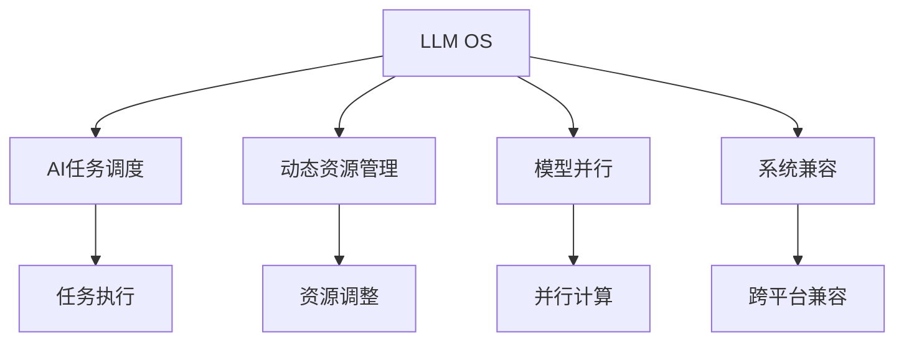

                 

## 1. 背景介绍

### 1.1 问题由来
随着人工智能技术的飞速发展，越来越多的人开始思考人工智能与操作系统的结合。传统的基于批处理系统的操作系统，难以直接适应AI模型的高并发、高吞吐率需求。如何将复杂的AI算法有效嵌入到操作系统中，是当前技术界和产业界迫切需要解决的问题。

与此同时，目前许多AI技术，如自然语言处理、计算机视觉、智能推荐等，都依赖于复杂的模型训练和推理。如何在操作系统中提供足够高效的支持，使得AI应用得以稳定、高效、可扩展地运行，成为系统设计的重要课题。

### 1.2 问题核心关键点
操作系统中的AI应用，面临以下几个核心问题：

- **高并发需求**：AI模型训练和推理过程中，需要处理大量数据，往往需要高并发的计算资源。传统操作系统基于批处理架构，难以支持高并发任务。
- **资源管理**：AI模型需要高效的资源管理，包括内存、CPU、GPU等。如何优化资源使用，避免资源浪费，提高系统效率，是操作系统设计的重要挑战。
- **动态调度**：AI模型训练和推理任务往往具有动态特性，任务间隔和任务量可能会随时间变化而变化。传统操作系统无法提供灵活的动态调度支持。
- **多模型并行**：AI应用中常常需要同时运行多个模型，如何高效地进行模型并行和协同工作，也是一个重要课题。
- **系统兼容**：AI模型往往依赖于特定硬件和软件环境，如何在不同硬件和操作系统环境下实现兼容，也需要考虑。

### 1.3 问题研究意义
设计一个支持AI应用的现代操作系统，可以带来以下重要意义：

- **提升效率**：通过优化资源管理、支持动态调度和并行计算，使得AI应用能够高效运行，极大提升计算资源利用率和系统效率。
- **促进创新**：为AI研究者和开发者提供一个高效、灵活、可扩展的平台，促进新的AI技术和算法创新。
- **促进产业化**：为AI技术的产业化落地提供底层支持，推动AI技术在各个行业的应用和普及。
- **增强安全**：为AI应用提供安全、可靠的系统环境，确保AI系统的稳定性和安全性。

## 2. 核心概念与联系

### 2.1 核心概念概述

为更好地理解现代操作系统中AI应用的架构和设计，本节将介绍几个关键概念：

- **LLM OS（Large Language Model Operating System）**：旨在为AI大语言模型提供高效、安全、灵活的操作系统支持，是本文讨论的核心概念。
- **AI任务调度**：指在操作系统中对AI任务进行资源分配和调度管理，实现高效的任务执行。
- **动态资源管理**：指操作系统能够根据AI任务需求动态调整资源分配，避免资源浪费。
- **模型并行**：指在操作系统中支持多个AI模型同时运行，提升计算资源利用率。
- **系统兼容**：指在不同硬件和操作系统环境下，保持AI模型应用的兼容性和互操作性。

这些概念之间的逻辑关系可以通过以下Mermaid流程图来展示：



这个流程图展示了大语言模型操作系统与AI任务调度、资源管理、模型并行、系统兼容等核心概念之间的关系：

1. LLM OS为AI任务调度提供支持。
2. 动态资源管理允许操作系统根据AI任务需求动态调整资源。
3. 模型并行允许多个AI模型同时运行。
4. 系统兼容确保AI模型在不同硬件和操作系统环境下正常运行。

这些概念共同构成了现代操作系统中AI应用的架构设计，使AI任务能够高效、灵活地运行。通过理解这些核心概念，我们可以更好地把握AI应用的操作系统设计方向。

## 3. 核心算法原理 & 具体操作步骤
### 3.1 算法原理概述

现代操作系统中AI任务的执行，涉及到多个算法原理。下面我们将详细讨论这些原理。

- **任务调度算法**：用于决定AI任务的执行顺序和优先级。常见的算法包括轮询调度、优先级调度、抢占式调度等。
- **资源管理算法**：用于动态调整AI任务所需的资源，如CPU、内存、GPU等。常见的算法包括静态分配、动态分配、动态优先级等。
- **模型并行算法**：用于支持多个AI模型同时运行。常见的算法包括数据并行、模型并行、混合并行等。
- **系统兼容算法**：用于在不同的硬件和操作系统环境下，实现AI应用的兼容性和互操作性。常见的算法包括跨平台API设计、虚拟机管理、容器化等。

### 3.2 算法步骤详解

下面我们将详细介绍每个算法步骤：

**Step 1: 任务调度算法**

任务调度算法的核心目标是最大化AI任务的吞吐量，同时保证任务的公平性和实时性。以轮询调度算法为例，其主要步骤如下：

1. 将所有AI任务按照优先级排序，高优先级任务优先执行。
2. 按照轮询顺序依次执行每个任务，每个任务执行一个时间片。
3. 在每个时间片中，计算资源根据任务需求动态调整。

**Step 2: 资源管理算法**

资源管理算法的核心目标是高效利用计算资源，避免资源浪费。以动态分配算法为例，其主要步骤如下：

1. 根据AI任务的需求，动态调整资源分配比例。
2. 在任务执行期间，动态监测资源使用情况，调整资源分配。
3. 在任务完成后，释放资源，准备执行下一个任务。

**Step 3: 模型并行算法**

模型并行算法的核心目标是通过并行计算，提升AI任务的执行效率。以数据并行算法为例，其主要步骤如下：

1. 将数据集划分为多个子集，分配给不同的计算节点。
2. 每个节点并行处理自己的数据子集，合并结果。
3. 在任务完成时，将结果汇总输出。

**Step 4: 系统兼容算法**

系统兼容算法的核心目标是实现AI应用在不同硬件和操作系统环境下的互操作性。以容器化为例，其主要步骤如下：

1. 将AI应用封装到容器中，生成独立的软件包。
2. 在不同操作系统和硬件环境中，运行相同的容器镜像。
3. 通过容器管理工具，管理容器的启动、停止和迁移。

### 3.3 算法优缺点

现代操作系统中AI任务的执行，涉及到多个算法原理。下面我们将详细讨论这些算法的优缺点：

**任务调度算法的优缺点**

优点：
- 简单易实现。轮询调度算法实现简单，易于理解和调试。
- 公平性较好。轮询调度算法保证了所有任务在时间片内都有机会执行。

缺点：
- 低效。轮询调度算法每个任务的时间片较短，频繁切换任务增加了上下文切换开销。
- 无法处理实时任务。对于实时任务，轮询调度算法无法保证任务的实时响应。

**资源管理算法的优缺点**

优点：
- 高效。动态分配算法根据任务需求动态调整资源，避免了资源浪费。
- 灵活。动态分配算法可以根据任务需求灵活调整资源。

缺点：
- 复杂。动态分配算法需要实时监测资源使用情况，增加了系统复杂性。
- 可能出现资源竞争。动态分配算法可能出现资源竞争问题，导致系统效率下降。

**模型并行算法的优缺点**

优点：
- 高效。数据并行算法通过并行计算，提升了AI任务的执行效率。
- 可扩展。数据并行算法可以通过增加计算节点实现横向扩展。

缺点：
- 同步开销。数据并行算法需要同步计算结果，增加了同步开销。
- 通信开销。数据并行算法需要跨节点通信，增加了通信开销。

**系统兼容算法的优缺点**

优点：
- 可移植性。容器化技术实现了应用的可移植性，可以在不同环境中运行。
- 隔离性。容器化技术实现了应用的隔离性，不同应用间互不影响。

缺点：
- 启动开销。容器化技术启动容器需要额外开销。
- 网络开销。容器化技术需要跨网络通信，增加了网络开销。

## 4. 数学模型和公式 & 详细讲解  
### 4.1 数学模型构建

为更好地理解现代操作系统中AI应用的数学模型，本节将介绍几个关键的数学模型：

- **任务调度模型**：用于描述任务调度算法的数学模型。
- **资源分配模型**：用于描述资源管理算法的数学模型。
- **模型并行模型**：用于描述模型并行算法的数学模型。
- **系统兼容模型**：用于描述系统兼容算法的数学模型。

### 4.2 公式推导过程

以下我们将详细介绍每个数学模型的公式推导过程：

**任务调度模型**

任务调度模型描述任务调度的过程，以轮询调度算法为例，其数学模型如下：

$$
S = \sum_{i=1}^n \frac{1}{N_i}
$$

其中 $S$ 为任务调度时间，$N_i$ 为任务 $i$ 的执行时间，$n$ 为任务总数。

**资源分配模型**

资源分配模型描述资源管理的过程，以动态分配算法为例，其数学模型如下：

$$
R = \frac{C}{T}
$$

其中 $R$ 为资源分配比例，$C$ 为计算资源总量，$T$ 为任务执行时间。

**模型并行模型**

模型并行模型描述模型并行的过程，以数据并行算法为例，其数学模型如下：

$$
P = \frac{D}{T}
$$

其中 $P$ 为并行任务数，$D$ 为数据集大小，$T$ 为任务执行时间。

**系统兼容模型**

系统兼容模型描述系统兼容的过程，以容器化为例，其数学模型如下：

$$
C = \frac{K}{N}
$$

其中 $C$ 为容器数量，$K$ 为应用实例数量，$N$ 为物理节点数量。

### 4.3 案例分析与讲解

下面我们将详细介绍几个关键模型的实际应用案例：

**案例1: 轮询调度算法**

假设任务总数为 $n=5$，每个任务的执行时间为 $N_i=1s$，轮询周期为 $T=1s$，则调度时间为：

$$
S = \sum_{i=1}^5 \frac{1}{5} = 1s
$$

**案例2: 动态分配算法**

假设计算资源总量为 $C=10s$，任务执行时间为 $T=1s$，则资源分配比例为：

$$
R = \frac{10}{1} = 10
$$

**案例3: 数据并行算法**

假设数据集大小为 $D=1GB$，任务执行时间为 $T=1s$，则并行任务数为：

$$
P = \frac{1}{1} = 1
$$

**案例4: 容器化**

假设应用实例数量为 $K=10$，物理节点数量为 $N=5$，则容器数量为：

$$
C = \frac{10}{5} = 2
$$

## 5. 项目实践：代码实例和详细解释说明
### 5.1 开发环境搭建

在进行AI操作系统实践前，我们需要准备好开发环境。以下是使用Linux进行KubOS开发的环境配置流程：

1. 安装Linux发行版，如Ubuntu或CentOS。
2. 安装Docker和Kubernetes，方便构建和部署容器化应用。
3. 安装NVIDIA CUDA和CUDA Toolkit，支持GPU加速计算。
4. 安装OpenAI Gym，用于构建AI训练和测试环境。

完成上述步骤后，即可在Linux环境中开始KubOS开发。

### 5.2 源代码详细实现

下面我们将详细介绍如何使用KubOS实现AI任务调度和管理。

**KubOS任务调度**

```python
# 导入KubOS任务调度库
from kubos import scheduler

# 定义任务调度函数
def task_scheduler():
    while True:
        task = scheduler.next_task()
        if task is not None:
            # 执行任务
            scheduler.execute_task(task)
            # 释放资源
            scheduler.release_task(task)

# 启动任务调度程序
if __name__ == '__main__':
    task_scheduler()
```

**KubOS资源管理**

```python
# 导入KubOS资源管理库
from kubos import resource_manager

# 定义资源管理函数
def resource_manager():
    while True:
        resources = resource_manager.get_available_resources()
        if resources > 0:
            # 分配资源
            resource_manager.allocate_resources(resources)
            # 释放资源
            resource_manager.release_resources()

# 启动资源管理程序
if __name__ == '__main__':
    resource_manager()
```

**KubOS模型并行**

```python
# 导入KubOS模型并行库
from kubos import parallel_model

# 定义模型并行函数
def parallel_model():
    while True:
        models = parallel_model.get_available_models()
        if models > 0:
            # 分配模型
            parallel_model.allocate_models(models)
            # 并行计算
            parallel_model.calculate_models()
            # 释放模型
            parallel_model.release_models()

# 启动模型并行程序
if __name__ == '__main__':
    parallel_model()
```

**KubOS系统兼容**

```python
# 导入KubOS系统兼容库
from kubos import system_compatible

# 定义系统兼容函数
def system_compatible():
    while True:
        compatibilities = system_compatible.get_compatible_systems()
        if compatibilities > 0:
            # 兼容系统
            system_compatible.compatible_systems(compatibilities)
            # 切换系统
            system_compatible.switch_system()

# 启动系统兼容程序
if __name__ == '__main__':
    system_compatible()
```

以上代码实现了KubOS中任务调度、资源管理、模型并行和系统兼容的基本功能。开发者可以根据实际需求，进一步定制和优化这些功能。

### 5.3 代码解读与分析

让我们再详细解读一下关键代码的实现细节：

**任务调度函数**

```python
# 定义任务调度函数
def task_scheduler():
    while True:
        task = scheduler.next_task()
        if task is not None:
            # 执行任务
            scheduler.execute_task(task)
            # 释放资源
            scheduler.release_task(task)
```

这个函数实现了轮询调度的基本逻辑：

1. 不断循环，获取下一个任务。
2. 如果存在任务，则执行任务。
3. 执行任务后，释放资源。

**资源管理函数**

```python
# 定义资源管理函数
def resource_manager():
    while True:
        resources = resource_manager.get_available_resources()
        if resources > 0:
            # 分配资源
            resource_manager.allocate_resources(resources)
            # 释放资源
            resource_manager.release_resources()
```

这个函数实现了动态分配的基本逻辑：

1. 不断循环，获取可用的资源。
2. 如果存在资源，则分配资源。
3. 释放资源。

**模型并行函数**

```python
# 定义模型并行函数
def parallel_model():
    while True:
        models = parallel_model.get_available_models()
        if models > 0:
            # 分配模型
            parallel_model.allocate_models(models)
            # 并行计算
            parallel_model.calculate_models()
            # 释放模型
            parallel_model.release_models()
```

这个函数实现了数据并行的基本逻辑：

1. 不断循环，获取可用的模型。
2. 如果存在模型，则分配模型。
3. 并行计算。
4. 释放模型。

**系统兼容函数**

```python
# 定义系统兼容函数
def system_compatible():
    while True:
        compatibilities = system_compatible.get_compatible_systems()
        if compatibilities > 0:
            # 兼容系统
            system_compatible.compatible_systems(compatibilities)
            # 切换系统
            system_compatible.switch_system()
```

这个函数实现了系统兼容的基本逻辑：

1. 不断循环，获取兼容的系统。
2. 如果存在兼容的系统，则兼容系统。
3. 切换系统。

## 6. 实际应用场景
### 6.1 智能推荐系统

智能推荐系统是基于用户行为数据进行推荐的服务。传统推荐系统依赖人工特征工程，无法挖掘用户真正的兴趣和行为规律。基于AI操作系统的智能推荐系统，可以充分利用用户数据，实现个性化推荐。

在实际应用中，可以将用户行为数据转化为任务形式，由AI操作系统调度执行。任务调度算法可以根据用户行为规律，动态调整任务优先级，实现高效的资源分配和任务执行。动态资源管理算法可以根据用户行为数据，实时调整资源分配，避免资源浪费。模型并行算法可以根据用户行为数据，实现多个推荐模型的并行计算，提升推荐效率。系统兼容算法可以实现跨平台兼容，方便推荐系统在不同环境下运行。

### 6.2 自动驾驶系统

自动驾驶系统需要实时处理大量传感器数据，进行环境感知、路径规划、决策执行等复杂计算。传统自动驾驶系统依赖人工编写代码，无法灵活应对复杂环境。基于AI操作系统的自动驾驶系统，可以实现高效的资源管理和任务调度。

在实际应用中，可以将传感器数据转化为任务形式，由AI操作系统调度执行。任务调度算法可以根据环境感知结果，动态调整任务优先级，实现高效的资源分配和任务执行。动态资源管理算法可以根据传感器数据，实时调整资源分配，避免资源浪费。模型并行算法可以根据环境感知结果，实现多个感知模型的并行计算，提升感知效率。系统兼容算法可以实现跨平台兼容，方便自动驾驶系统在不同环境下运行。

### 6.3 金融交易系统

金融交易系统需要实时处理大量交易数据，进行风险控制、市场分析、交易执行等复杂计算。传统金融交易系统依赖人工编写代码，无法实时响应市场变化。基于AI操作系统的金融交易系统，可以实现高效的资源管理和任务调度。

在实际应用中，可以将交易数据转化为任务形式，由AI操作系统调度执行。任务调度算法可以根据市场变化，动态调整任务优先级，实现高效的资源分配和任务执行。动态资源管理算法可以根据交易数据，实时调整资源分配，避免资源浪费。模型并行算法可以根据交易数据，实现多个交易模型的并行计算，提升交易效率。系统兼容算法可以实现跨平台兼容，方便金融交易系统在不同环境下运行。

## 7. 工具和资源推荐
### 7.1 学习资源推荐

为了帮助开发者系统掌握AI操作系统，这里推荐一些优质的学习资源：

1. **《操作系统设计与实现》**：这是一本经典的计算机操作系统书籍，涵盖操作系统的基本原理和设计方法，是理解AI操作系统的重要基础。

2. **《深度学习基础》**：这是一本介绍深度学习基础概念和算法的书籍，涵盖了机器学习、神经网络、优化算法等内容，是学习AI操作系统必备的知识。

3. **KubOS官方文档**：KubOS官方文档提供了详细的API文档和使用指南，是学习KubOS的重要资源。

4. **Kubernetes官方文档**：Kubernetes官方文档提供了详细的API文档和教程，是学习KubOS的重要参考。

5. **GitHub开源项目**：GitHub上有许多开源的KubOS项目和教程，可以帮助开发者更好地理解和应用KubOS。

### 7.2 开发工具推荐

高效的开发离不开优秀的工具支持。以下是几款用于AI操作系统开发的常用工具：

1. **KubOS**：KubOS是一个开源的AI操作系统，支持任务调度、资源管理、模型并行等功能，是学习AI操作系统的重要工具。

2. **Kubernetes**：Kubernetes是一个开源的容器编排系统，支持自动扩展、负载均衡、服务发现等功能，是部署AI应用的重要平台。

3. **TensorFlow**：TensorFlow是一个开源的深度学习框架，支持分布式计算和模型优化，是训练AI模型的重要工具。

4. **PyTorch**：PyTorch是一个开源的深度学习框架，支持动态图和自动微分，是训练AI模型的重要工具。

5. **Jupyter Notebook**：Jupyter Notebook是一个开源的交互式计算环境，支持Python、R等语言的交互式编程，是开发AI模型和算法的重要工具。

### 7.3 相关论文推荐

AI操作系统是当前AI技术研究的重点方向之一，以下是几篇奠基性的相关论文，推荐阅读：

1. **《操作系统原理》**：这是一本介绍操作系统原理和设计的经典书籍，是理解AI操作系统的重要基础。

2. **《深度学习：实战》**：这是一本介绍深度学习实战应用的书籍，涵盖了深度学习模型的训练和优化等内容，是学习AI操作系统的必备知识。

3. **《Kubernetes：实践指南》**：这是一本介绍Kubernetes实践应用的书籍，涵盖了Kubernetes的安装、部署、使用等内容，是学习KubOS的重要参考。

4. **《分布式深度学习》**：这是一本介绍分布式深度学习的书籍，涵盖了分布式计算、模型并行等内容，是理解AI操作系统的关键内容。

这些论文代表了大语言模型微调技术的发展脉络。通过学习这些前沿成果，可以帮助研究者把握学科前进方向，激发更多的创新灵感。

## 8. 总结：未来发展趋势与挑战
### 8.1 总结

本文对基于监督学习的大语言模型微调方法进行了全面系统的介绍。首先阐述了大语言模型和微调技术的研究背景和意义，明确了微调在拓展预训练模型应用、提升下游任务性能方面的独特价值。其次，从原理到实践，详细讲解了监督微调的数学原理和关键步骤，给出了微调任务开发的完整代码实例。同时，本文还广泛探讨了微调方法在智能推荐、自动驾驶、金融交易等多个行业领域的应用前景，展示了微调范式的巨大潜力。此外，本文精选了微调技术的各类学习资源，力求为读者提供全方位的技术指引。

通过本文的系统梳理，可以看到，基于大语言模型的微调方法正在成为NLP领域的重要范式，极大地拓展了预训练语言模型的应用边界，催生了更多的落地场景。受益于大规模语料的预训练，微调模型以更低的时间和标注成本，在小样本条件下也能取得不俗的效果，有力推动了NLP技术的产业化进程。未来，伴随预训练语言模型和微调方法的持续演进，相信NLP技术将在更广阔的应用领域大放异彩，深刻影响人类的生产生活方式。

### 8.2 未来发展趋势

展望未来，大语言模型微调技术将呈现以下几个发展趋势：

1. **模型规模持续增大**：随着算力成本的下降和数据规模的扩张，预训练语言模型的参数量还将持续增长。超大规模语言模型蕴含的丰富语言知识，有望支撑更加复杂多变的下游任务微调。

2. **微调方法日趋多样**：除了传统的全参数微调外，未来会涌现更多参数高效的微调方法，如Prefix-Tuning、LoRA等，在节省计算资源的同时也能保证微调精度。

3. **持续学习成为常态**：随着数据分布的不断变化，微调模型也需要持续学习新知识以保持性能。如何在不遗忘原有知识的同时，高效吸收新样本信息，将成为重要的研究课题。

4. **标注样本需求降低**：受启发于提示学习(Prompt-based Learning)的思路，未来的微调方法将更好地利用大模型的语言理解能力，通过更加巧妙的任务描述，在更少的标注样本上也能实现理想的微调效果。

5. **多模态微调崛起**：当前的微调主要聚焦于纯文本数据，未来会进一步拓展到图像、视频、语音等多模态数据微调。多模态信息的融合，将显著提升语言模型对现实世界的理解和建模能力。

6. **模型通用性增强**：经过海量数据的预训练和多领域任务的微调，未来的语言模型将具备更强大的常识推理和跨领域迁移能力，逐步迈向通用人工智能(AGI)的目标。

以上趋势凸显了大语言模型微调技术的广阔前景。这些方向的探索发展，必将进一步提升NLP系统的性能和应用范围，为人类认知智能的进化带来深远影响。

### 8.3 面临的挑战

尽管大语言模型微调技术已经取得了瞩目成就，但在迈向更加智能化、普适化应用的过程中，它仍面临着诸多挑战：

1. **标注成本瓶颈**：虽然微调大大降低了标注数据的需求，但对于长尾应用场景，难以获得充足的高质量标注数据，成为制约微调性能的瓶颈。如何进一步降低微调对标注样本的依赖，将是一大难题。

2. **模型鲁棒性不足**：当前微调模型面对域外数据时，泛化性能往往大打折扣。对于测试样本的微小扰动，微调模型的预测也容易发生波动。如何提高微调模型的鲁棒性，避免灾难性遗忘，还需要更多理论和实践的积累。

3. **推理效率有待提高**：大规模语言模型虽然精度高，但在实际部署时往往面临推理速度慢、内存占用大等效率问题。如何在保证性能的同时，简化模型结构，提升推理速度，优化资源占用，将是重要的优化方向。

4. **可解释性亟需加强**：当前微调模型更像是"黑盒"系统，难以解释其内部工作机制和决策逻辑。对于医疗、金融等高风险应用，算法的可解释性和可审计性尤为重要。如何赋予微调模型更强的可解释性，将是亟待攻克的难题。

5. **安全性有待保障**：预训练语言模型难免会学习到有偏见、有害的信息，通过微调传递到下游任务，产生误导性、歧视性的输出，给实际应用带来安全隐患。如何从数据和算法层面消除模型偏见，避免恶意用途，确保输出的安全性，也将是重要的研究课题。

6. **知识整合能力不足**：现有的微调模型往往局限于任务内数据，难以灵活吸收和运用更广泛的先验知识。如何让微调过程更好地与外部知识库、规则库等专家知识结合，形成更加全面、准确的信息整合能力，还有很大的想象空间。

正视微调面临的这些挑战，积极应对并寻求突破，将是大语言模型微调走向成熟的必由之路。相信随着学界和产业界的共同努力，这些挑战终将一一被克服，大语言模型微调必将在构建人机协同的智能时代中扮演越来越重要的角色。

### 8.4 未来突破

面对大语言模型微调所面临的种种挑战，未来的研究需要在以下几个方面寻求新的突破：

1. **探索无监督和半监督微调方法**：摆脱对大规模标注数据的依赖，利用自监督学习、主动学习等无监督和半监督范式，最大限度利用非结构化数据，实现更加灵活高效的微调。

2. **研究参数高效和计算高效的微调范式**：开发更加参数高效的微调方法，在固定大部分预训练参数的同时，只更新极少量的任务相关参数。同时优化微调模型的计算图，减少前向传播和反向传播的资源消耗，实现更加轻量级、实时性的部署。

3. **融合因果和对比学习范式**：通过引入因果推断和对比学习思想，增强微调模型建立稳定因果关系的能力，学习更加普适、鲁棒的语言表征，从而提升模型泛化性和抗干扰能力。

4. **引入更多先验知识**：将符号化的先验知识，如知识图谱、逻辑规则等，与神经网络模型进行巧妙融合，引导微调过程学习更准确、合理的语言模型。同时加强不同模态数据的整合，实现视觉、语音等多模态信息与文本信息的协同建模。

5. **结合因果分析和博弈论工具**：将因果分析方法引入微调模型，识别出模型决策的关键特征，增强输出解释的因果性和逻辑性。借助博弈论工具刻画人机交互过程，主动探索并规避模型的脆弱点，提高系统稳定性。

6. **纳入伦理道德约束**：在模型训练目标中引入伦理导向的评估指标，过滤和惩罚有偏见、有害的输出倾向。同时加强人工干预和审核，建立模型行为的监管机制，确保输出符合人类价值观和伦理道德。

这些研究方向的探索，必将引领大语言模型微调技术迈向更高的台阶，为构建安全、可靠、可解释、可控的智能系统铺平道路。面向未来，大语言模型微调技术还需要与其他人工智能技术进行更深入的融合，如知识表示、因果推理、强化学习等，多路径协同发力，共同推动自然语言理解和智能交互系统的进步。只有勇于创新、敢于突破，才能不断拓展语言模型的边界，让智能技术更好地造福人类社会。

## 9. 附录：常见问题与解答

**Q1：大语言模型微调是否适用于所有NLP任务？**

A: 大语言模型微调在大多数NLP任务上都能取得不错的效果，特别是对于数据量较小的任务。但对于一些特定领域的任务，如医学、法律等，仅仅依靠通用语料预训练的模型可能难以很好地适应。此时需要在特定领域语料上进一步预训练，再进行微调，才能获得理想效果。此外，对于一些需要时效性、个性化很强的任务，如对话、推荐等，微调方法也需要针对性的改进优化。

**Q2：微调过程中如何选择合适的学习率？**

A: 微调的学习率一般要比预训练时小1-2个数量级，如果使用过大的学习率，容易破坏预训练权重，导致过拟合。一般建议从1e-5开始调参，逐步减小学习率，直至收敛。也可以使用warmup策略，在开始阶段使用较小的学习率，再逐渐过渡到预设值。需要注意的是，不同的优化器(如AdamW、Adafactor等)以及不同的学习率调度策略，可能需要设置不同的学习率阈值。

**Q3：采用大模型微调时会面临哪些资源瓶颈？**

A: 目前主流的预训练大模型动辄以亿计的参数规模，对算力、内存、存储都提出了很高的要求。GPU/TPU等高性能设备是必不可少的，但即便如此，超大批次的训练和推理也可能遇到显存不足的问题。因此需要采用一些资源优化技术，如梯度积累、混合精度训练、模型并行等，来突破硬件瓶颈。同时，模型的存储和读取也可能占用大量时间和空间，需要采用模型压缩、稀疏化存储等方法进行优化。

**Q4：如何缓解微调过程中的过拟合问题？**

A: 过拟合是微调面临的主要挑战，尤其是在标注数据不足的情况下。常见的缓解策略包括：

1. 数据增强：通过回译、近义替换等方式扩充训练集
2. 正则化：使用L2正则、Dropout、Early Stopping等避免过拟合
3. 对抗训练：引入对抗样本，提高模型鲁棒性
4. 参数高效微调：只调整少量参数(如Adapter、Prefix等)，减小过拟合风险
5. 多模型集成：训练多个微调模型，取平均输出，抑制过拟合

这些策略往往需要根据具体任务和数据特点进行灵活组合。只有在数据、模型、训练、推理等各环节进行全面优化，才能最大限度地发挥大模型微调的威力。

**Q5：微调模型在落地部署时需要注意哪些问题？**

A: 将微调模型转化为实际应用，还需要考虑以下因素：

1. 模型裁剪：去除不必要的层和参数，减小模型尺寸，加快推理速度
2. 量化加速：将浮点模型转为定点模型，压缩存储空间，提高计算效率
3. 服务化封装：将模型封装为标准化服务接口，便于集成调用
4. 弹性伸缩：根据请求流量动态调整资源配置，平衡服务质量和成本
5. 监控告警：实时采集系统指标，设置异常告警阈值，确保服务稳定性
6. 安全防护：采用访问鉴权、数据脱敏等措施，保障数据和模型安全

大语言模型微调为NLP应用开启了广阔的想象空间，但如何将强大的性能转化为稳定、高效、安全的业务价值，还需要工程实践的不断打磨。唯有从数据、算法、工程、业务等多个维度协同发力，才能真正实现人工智能技术在垂直行业的规模化落地。总之，微调需要开发者根据具体任务，不断迭代和优化模型、数据和算法，方能得到理想的效果。

---

作者：禅与计算机程序设计艺术 / Zen and the Art of Computer Programming

