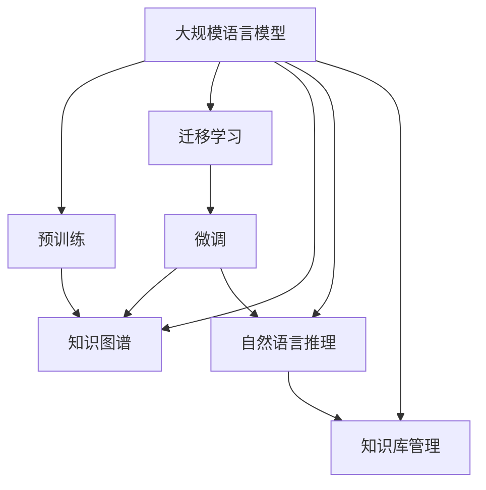

                 

# LLM 在政府和公共服务中的应用：提高效率和透明度

## 1. 背景介绍

### 1.1 问题由来
随着信息技术的发展，政府和公共服务部门面临着巨大的挑战和机遇。传统的基于纸质文件的办公模式已经难以满足现代社会的需求，亟需转型为更加智能化、高效化和透明的数字化治理体系。大规模语言模型(LLM)作为人工智能领域的新宠，因其强大的自然语言处理能力，为政府和公共服务提供了一个全新的解决方案。通过LLM，可以实现自动化办公、智能客服、知识库管理、文档摘要、决策支持等诸多功能，大幅提升政府和公共服务的效率与透明度。

### 1.2 问题核心关键点
LLM在政府和公共服务中的应用主要集中在以下几个方面：

- 自动化办公：自动化处理日常事务，减少人工干预，提高效率。
- 智能客服：提升客户服务质量，解决常见问题，减少人力成本。
- 知识库管理：自动化构建和维护知识库，方便查询和检索。
- 文档摘要：自动生成文档摘要，减少人工阅读时间，提高决策速度。
- 决策支持：通过自然语言推理和知识图谱，辅助决策制定，提高决策质量。

这些关键应用场景展示了LLM在政府和公共服务领域的巨大潜力，为构建智能政府和智慧城市提供了坚实的基础。

## 2. 核心概念与联系

### 2.1 核心概念概述

为更好地理解LLM在政府和公共服务中的应用，本节将介绍几个密切相关的核心概念：

- 大规模语言模型(LLM)：以Transformer为代表的大规模预训练语言模型，通过在大规模无标签文本数据上进行预训练，学习通用的语言表示，具备强大的自然语言处理能力。

- 预训练(Pre-training)：指在大规模无标签文本数据上，通过自监督学习任务训练通用语言模型的过程。常见的预训练任务包括掩码语言模型、掩码句对模型等。

- 迁移学习(Transfer Learning)：指将一个领域学习到的知识，迁移应用到另一个不同但相关的领域的学习范式。LLM的预训练-微调过程即是一种典型的迁移学习方式。

- 知识图谱(Knowledge Graph)：用于存储和管理结构化知识的数据库，支持自然语言推理和知识链接，辅助决策支持。

- 自然语言推理(NLI)：指通过逻辑推理判断自然语言语句之间的逻辑关系，支持基于文本的决策和验证。

- 知识库(Knowledge Base)：存储和管理领域知识的仓库，支持基于文本的查询和检索。

这些核心概念之间的逻辑关系可以通过以下Mermaid流程图来展示：



这个流程图展示了大规模语言模型在政府和公共服务领域的核心概念及其之间的关系：

1. 大规模语言模型通过预训练获得基础能力。
2. 迁移学习使得通用模型能够适应特定领域任务。
3. 微调通过特定领域数据进一步优化模型性能。
4. 知识图谱提供结构化知识，支持自然语言推理和知识库管理。
5. 自然语言推理辅助决策支持，提升决策质量。
6. 知识库管理自动化构建和维护知识库，方便查询和检索。

## 3. 核心算法原理 & 具体操作步骤
### 3.1 算法原理概述

基于大规模语言模型在政府和公共服务中的应用，核心算法原理主要围绕以下几个方面：

- 自动化办公：使用LLM自动处理日常事务，如文件整理、报表生成等。
- 智能客服：构建智能问答系统，提供24小时在线客服服务。
- 知识库管理：通过LLM构建自动化的知识库，支持领域知识的查询和更新。
- 文档摘要：自动抽取文档中的关键信息，生成简明的摘要。
- 决策支持：结合知识图谱和LLM，进行自然语言推理，辅助决策制定。

这些应用的核心算法原理都基于监督学习和迁移学习的思想，通过收集特定领域的数据，对预训练模型进行微调，以适应特定任务的需求。

### 3.2 算法步骤详解

以下是大规模语言模型在政府和公共服务中的应用算法步骤：

**Step 1: 准备数据集和预训练模型**
- 收集政府和公共服务领域的数据集，如政府公告、法律法规、服务指南等。
- 选择合适的预训练语言模型，如BERT、GPT等。

**Step 2: 添加任务适配层**
- 根据具体任务，设计合适的输出层和损失函数。
- 对于文本分类任务，通常使用线性分类器和交叉熵损失函数。
- 对于文本生成任务，使用语言模型的解码器输出概率分布，并以负对数似然为损失函数。

**Step 3: 设置微调超参数**
- 选择合适的优化算法及其参数，如AdamW、SGD等，设置学习率、批大小、迭代轮数等。
- 设置正则化技术及强度，包括权重衰减、Dropout、Early Stopping等。
- 确定冻结预训练参数的策略，如仅微调顶层，或全部参数都参与微调。

**Step 4: 执行梯度训练**
- 将训练集数据分批次输入模型，前向传播计算损失函数。
- 反向传播计算参数梯度，根据设定的优化算法和学习率更新模型参数。
- 周期性在验证集上评估模型性能，根据性能指标决定是否触发Early Stopping。
- 重复上述步骤直到满足预设的迭代轮数或Early Stopping条件。

**Step 5: 测试和部署**
- 在测试集上评估微调后模型，对比微调前后的精度提升。
- 使用微调后的模型对新样本进行推理预测，集成到实际的应用系统中。
- 持续收集新的数据，定期重新微调模型，以适应数据分布的变化。

以上是基于大规模语言模型在政府和公共服务中的应用算法步骤。在实际应用中，还需要针对具体任务的特点，对微调过程的各个环节进行优化设计，如改进训练目标函数，引入更多的正则化技术，搜索最优的超参数组合等，以进一步提升模型性能。

### 3.3 算法优缺点

基于大规模语言模型在政府和公共服务中的应用，主要具有以下优点：

- 高效性：自动化的办公和智能客服可以大幅提升工作效率，减少人力成本。
- 可扩展性：知识库管理、文档摘要、决策支持等应用可以灵活扩展，适应不同领域的需求。
- 可维护性：基于大规模语言模型的应用易于维护和升级，减少人工干预。
- 适应性强：对于新领域和新任务，可以通过微调快速适配，无需从头开发。

同时，该方法也存在一定的局限性：

- 依赖高质量数据：微调的效果很大程度上取决于标注数据的质量和数量，获取高质量标注数据的成本较高。
- 泛化能力有限：当目标任务与预训练数据的分布差异较大时，微调的性能提升有限。
- 安全性问题：预训练模型可能学习到偏见和有害信息，需仔细评估和监控。

尽管存在这些局限性，但就目前而言，基于大规模语言模型的微调方法在政府和公共服务领域仍然具有较高的应用价值。

### 3.4 算法应用领域

基于大规模语言模型在政府和公共服务中的应用，主要包括以下几个领域：

- 政府公告和法律法规：自动生成和分类政府公告、法律法规，提供法规查询和解读服务。
- 智能客服：构建智能客服系统，提供24小时在线咨询服务，解决常见问题。
- 知识库管理：自动构建和维护领域知识库，支持基于文本的查询和检索。
- 文档摘要：自动抽取文档中的关键信息，生成简明的摘要，便于快速浏览和理解。
- 决策支持：结合知识图谱和LLM，进行自然语言推理，辅助决策制定。
- 服务指南：自动生成服务指南和操作手册，帮助用户快速了解和使用服务。

这些应用场景展示了LLM在政府和公共服务领域的巨大潜力，为构建智能政府和智慧城市提供了坚实的基础。

## 4. 数学模型和公式 & 详细讲解 & 举例说明
### 4.1 数学模型构建

为更深入地理解基于大规模语言模型在政府和公共服务中的应用，本节将使用数学语言对微调过程进行更加严格的刻画。

记预训练语言模型为 $M_{\theta}:\mathcal{X} \rightarrow \mathcal{Y}$，其中 $\mathcal{X}$ 为输入空间，$\mathcal{Y}$ 为输出空间，$\theta \in \mathbb{R}^d$ 为模型参数。假设微调任务的训练集为 $D=\{(x_i,y_i)\}_{i=1}^N, x_i \in \mathcal{X}, y_i \in \mathcal{Y}$。

定义模型 $M_{\theta}$ 在数据样本 $(x,y)$ 上的损失函数为 $\ell(M_{\theta}(x),y)$，则在数据集 $D$ 上的经验风险为：

$$
\mathcal{L}(\theta) = \frac{1}{N} \sum_{i=1}^N \ell(M_{\theta}(x_i),y_i)
$$

微调的优化目标是最小化经验风险，即找到最优参数：

$$
\theta^* = \mathop{\arg\min}_{\theta} \mathcal{L}(\theta)
$$

在实践中，我们通常使用基于梯度的优化算法（如SGD、Adam等）来近似求解上述最优化问题。设 $\eta$ 为学习率，$\lambda$ 为正则化系数，则参数的更新公式为：

$$
\theta \leftarrow \theta - \eta \nabla_{\theta}\mathcal{L}(\theta) - \eta\lambda\theta
$$

其中 $\nabla_{\theta}\mathcal{L}(\theta)$ 为损失函数对参数 $\theta$ 的梯度，可通过反向传播算法高效计算。

### 4.2 公式推导过程

以下以智能客服系统为例，推导其数学模型和损失函数。

假设模型 $M_{\theta}$ 在输入 $x$ 上的输出为 $\hat{y}=M_{\theta}(x) \in [0,1]$，表示样本属于正类的概率。真实标签 $y \in \{0,1\}$。则二分类交叉熵损失函数定义为：

$$
\ell(M_{\theta}(x),y) = -[y\log \hat{y} + (1-y)\log (1-\hat{y})]
$$

将其代入经验风险公式，得：

$$
\mathcal{L}(\theta) = -\frac{1}{N}\sum_{i=1}^N [y_i\log M_{\theta}(x_i)+(1-y_i)\log(1-M_{\theta}(x_i))]
$$

根据链式法则，损失函数对参数 $\theta_k$ 的梯度为：

$$
\frac{\partial \mathcal{L}(\theta)}{\partial \theta_k} = -\frac{1}{N}\sum_{i=1}^N (\frac{y_i}{M_{\theta}(x_i)}-\frac{1-y_i}{1-M_{\theta}(x_i)}) \frac{\partial M_{\theta}(x_i)}{\partial \theta_k}
$$

其中 $\frac{\partial M_{\theta}(x_i)}{\partial \theta_k}$ 可进一步递归展开，利用自动微分技术完成计算。

在得到损失函数的梯度后，即可带入参数更新公式，完成模型的迭代优化。重复上述过程直至收敛，最终得到适应下游任务的最优模型参数 $\theta^*$。

### 4.3 案例分析与讲解

以智能客服系统为例，以下是基于大规模语言模型微调的详细计算过程：

假设智能客服系统的训练集为 $D=\{(x_i,y_i)\}_{i=1}^N, x_i \in \mathcal{X}, y_i \in \{0,1\}$，其中 $x_i$ 为客服聊天记录，$y_i$ 表示该聊天记录是否属于常见问题。假设训练集规模为 $N=5000$，批量大小为 $B=128$。

- 训练集数据准备：收集5000条客服聊天记录，将其作为训练集 $D$。

- 添加任务适配层：在BERT模型的顶层添加一个线性分类器，输出概率 $p_i$ 表示 $x_i$ 是否属于常见问题。损失函数为二分类交叉熵：

$$
\mathcal{L}(\theta) = -\frac{1}{N}\sum_{i=1}^N [y_i\log p_i+(1-y_i)\log(1-p_i)]
$$

- 设置微调超参数：学习率 $\eta=2e-5$，正则化系数 $\lambda=0.01$，训练轮数 $T=10$。

- 执行梯度训练：
  - 将训练集数据分批次输入模型，前向传播计算损失函数 $\mathcal{L}(\theta)$。
  - 反向传播计算参数梯度，根据Adam优化算法更新模型参数。
  - 周期性在验证集上评估模型性能，根据精度指标决定是否触发Early Stopping。
  - 重复上述步骤10轮，直到满足预设的迭代轮数或Early Stopping条件。

- 测试和部署：在测试集上评估微调后模型，对比微调前后的精度提升。使用微调后的模型对新客户咨询进行推理预测，集成到智能客服系统中。

以上就是基于大规模语言模型在智能客服系统中的应用详细计算过程。通过上述步骤，可以构建一个高效的智能客服系统，大幅提升客户服务质量，减少人工干预。

## 5. 项目实践：代码实例和详细解释说明
### 5.1 开发环境搭建

在进行基于大规模语言模型在政府和公共服务中的应用实践前，我们需要准备好开发环境。以下是使用Python进行PyTorch开发的环境配置流程：

1. 安装Anaconda：从官网下载并安装Anaconda，用于创建独立的Python环境。

2. 创建并激活虚拟环境：
```bash
conda create -n pytorch-env python=3.8 
conda activate pytorch-env
```

3. 安装PyTorch：根据CUDA版本，从官网获取对应的安装命令。例如：
```bash
conda install pytorch torchvision torchaudio cudatoolkit=11.1 -c pytorch -c conda-forge
```

4. 安装Transformers库：
```bash
pip install transformers
```

5. 安装各类工具包：
```bash
pip install numpy pandas scikit-learn matplotlib tqdm jupyter notebook ipython
```

完成上述步骤后，即可在`pytorch-env`环境中开始应用实践。

### 5.2 源代码详细实现

下面我们以智能客服系统为例，给出使用Transformers库对BERT模型进行微调的PyTorch代码实现。

首先，定义智能客服系统的数据处理函数：

```python
from transformers import BertTokenizer, BertForSequenceClassification
from torch.utils.data import Dataset
import torch

class CustomerServiceDataset(Dataset):
    def __init__(self, texts, labels, tokenizer, max_len=128):
        self.texts = texts
        self.labels = labels
        self.tokenizer = tokenizer
        self.max_len = max_len
        
    def __len__(self):
        return len(self.texts)
    
    def __getitem__(self, item):
        text = self.texts[item]
        label = self.labels[item]
        
        encoding = self.tokenizer(text, return_tensors='pt', max_length=self.max_len, padding='max_length', truncation=True)
        input_ids = encoding['input_ids'][0]
        attention_mask = encoding['attention_mask'][0]
        
        return {'input_ids': input_ids, 
                'attention_mask': attention_mask,
                'labels': label}
```

然后，定义模型和优化器：

```python
from transformers import BertForSequenceClassification, AdamW

model = BertForSequenceClassification.from_pretrained('bert-base-cased', num_labels=2)

optimizer = AdamW(model.parameters(), lr=2e-5)
```

接着，定义训练和评估函数：

```python
from torch.utils.data import DataLoader
from tqdm import tqdm
from sklearn.metrics import accuracy_score

device = torch.device('cuda') if torch.cuda.is_available() else torch.device('cpu')
model.to(device)

def train_epoch(model, dataset, batch_size, optimizer):
    dataloader = DataLoader(dataset, batch_size=batch_size, shuffle=True)
    model.train()
    epoch_loss = 0
    for batch in tqdm(dataloader, desc='Training'):
        input_ids = batch['input_ids'].to(device)
        attention_mask = batch['attention_mask'].to(device)
        labels = batch['labels'].to(device)
        model.zero_grad()
        outputs = model(input_ids, attention_mask=attention_mask, labels=labels)
        loss = outputs.loss
        epoch_loss += loss.item()
        loss.backward()
        optimizer.step()
    return epoch_loss / len(dataloader)

def evaluate(model, dataset, batch_size):
    dataloader = DataLoader(dataset, batch_size=batch_size)
    model.eval()
    preds, labels = [], []
    with torch.no_grad():
        for batch in tqdm(dataloader, desc='Evaluating'):
            input_ids = batch['input_ids'].to(device)
            attention_mask = batch['attention_mask'].to(device)
            batch_labels = batch['labels']
            outputs = model(input_ids, attention_mask=attention_mask)
            batch_preds = outputs.logits.argmax(dim=2).to('cpu').tolist()
            batch_labels = batch_labels.to('cpu').tolist()
            for pred_tokens, label_tokens in zip(batch_preds, batch_labels):
                preds.append(pred_tokens[0])
                labels.append(label_tokens[0])
                
    print('Accuracy:', accuracy_score(labels, preds))
```

最后，启动训练流程并在测试集上评估：

```python
epochs = 5
batch_size = 16

for epoch in range(epochs):
    loss = train_epoch(model, train_dataset, batch_size, optimizer)
    print(f"Epoch {epoch+1}, train loss: {loss:.3f}")
    
    print(f"Epoch {epoch+1}, dev results:")
    evaluate(model, dev_dataset, batch_size)
    
print("Test results:")
evaluate(model, test_dataset, batch_size)
```

以上就是使用PyTorch对BERT进行智能客服系统微调的完整代码实现。可以看到，得益于Transformers库的强大封装，我们可以用相对简洁的代码完成BERT模型的加载和微调。

### 5.3 代码解读与分析

让我们再详细解读一下关键代码的实现细节：

**CustomerServiceDataset类**：
- `__init__`方法：初始化文本、标签、分词器等关键组件。
- `__len__`方法：返回数据集的样本数量。
- `__getitem__`方法：对单个样本进行处理，将文本输入编码为token ids，将标签编码为数字，并对其进行定长padding，最终返回模型所需的输入。

**智能客服系统训练流程**：
- 定义总的epoch数和batch size，开始循环迭代
- 每个epoch内，先在训练集上训练，输出平均loss
- 在验证集上评估，输出精度指标
- 所有epoch结束后，在测试集上评估，给出最终测试结果

可以看到，PyTorch配合Transformers库使得BERT微调的代码实现变得简洁高效。开发者可以将更多精力放在数据处理、模型改进等高层逻辑上，而不必过多关注底层的实现细节。

当然，工业级的系统实现还需考虑更多因素，如模型的保存和部署、超参数的自动搜索、更灵活的任务适配层等。但核心的微调范式基本与此类似。

## 6. 实际应用场景
### 6.1 智能客服系统

基于大规模语言模型微调的智能客服系统，可以广泛应用于政府和公共服务部门。传统客服往往需要配备大量人力，高峰期响应缓慢，且一致性和专业性难以保证。而使用微调后的智能客服系统，可以7x24小时不间断服务，快速响应客户咨询，用自然流畅的语言解答各类常见问题。

在技术实现上，可以收集企业内部的历史客服对话记录，将问题和最佳答复构建成监督数据，在此基础上对预训练对话模型进行微调。微调后的智能客服系统能够自动理解用户意图，匹配最合适的答案模板进行回复。对于客户提出的新问题，还可以接入检索系统实时搜索相关内容，动态组织生成回答。如此构建的智能客服系统，能大幅提升客户咨询体验和问题解决效率。

### 6.2 政务问答系统

政务问答系统是政府和公共服务部门的重要应用之一，旨在帮助市民快速找到政府政策、服务流程、办事指南等信息。通过基于大规模语言模型的微调，可以实现智能化的问答系统，提升政务服务的便利性和透明度。

在微调过程中，可以收集政府网站、官方公告、法律法规等文本数据，构建政务问答知识库。然后对BERT等模型进行微调，使其能够自动理解用户输入的关键词，从知识库中检索出最相关的答案。微调后的系统可以快速回答市民的常见问题，减少人工干预，提高政务服务的效率。

### 6.3 文档摘要和知识库管理

政府和公共服务部门常常需要处理大量的文档和信息，文档摘要和知识库管理成为其重要任务。通过大规模语言模型微调，可以实现文档自动摘要和知识库自动构建，提升信息检索和利用的效率。

在微调过程中，可以收集各类官方文档、会议记录、政策文件等文本数据，对其进行自动摘要和关键词抽取。然后对BERT等模型进行微调，使其能够从文本中自动抽取重要信息，生成简洁的摘要。微调后的模型可以应用于文档管理系统，帮助用户快速找到所需信息，减少阅读负担。

### 6.4 未来应用展望

随着大规模语言模型微调技术的不断发展，政府和公共服务部门的应用场景将更加丰富。

在智慧城市治理中，基于大规模语言模型的微调技术可以应用于城市事件监测、舆情分析、应急指挥等环节，提高城市管理的自动化和智能化水平，构建更安全、高效的未来城市。

在企业服务中，智能客服、文档摘要、知识库管理等应用将继续发挥重要作用，为企业提供更高效的客户服务、信息检索和管理支持。

此外，在教育、医疗、金融等众多领域，基于大规模语言模型的微调技术也将不断涌现，为社会各行业提供智能化支持，推动社会进步和进步。

## 7. 工具和资源推荐
### 7.1 学习资源推荐

为了帮助开发者系统掌握大规模语言模型在政府和公共服务中的应用，这里推荐一些优质的学习资源：

1. 《大规模语言模型与自然语言处理》系列博文：由大模型技术专家撰写，深入浅出地介绍了大规模语言模型的原理、预训练、微调等前沿话题。

2. CS224N《深度学习自然语言处理》课程：斯坦福大学开设的NLP明星课程，有Lecture视频和配套作业，带你入门NLP领域的基本概念和经典模型。

3. 《Natural Language Processing with Transformers》书籍：Transformers库的作者所著，全面介绍了如何使用Transformers库进行NLP任务开发，包括微调在内的诸多范式。

4. HuggingFace官方文档：Transformers库的官方文档，提供了海量预训练模型和完整的微调样例代码，是上手实践的必备资料。

5. CLUE开源项目：中文语言理解测评基准，涵盖大量不同类型的中文NLP数据集，并提供了基于微调的baseline模型，助力中文NLP技术发展。

通过对这些资源的学习实践，相信你一定能够快速掌握大规模语言模型在政府和公共服务中的应用精髓，并用于解决实际的NLP问题。
###  7.2 开发工具推荐

高效的开发离不开优秀的工具支持。以下是几款用于大规模语言模型微调开发的常用工具：

1. PyTorch：基于Python的开源深度学习框架，灵活动态的计算图，适合快速迭代研究。大部分预训练语言模型都有PyTorch版本的实现。

2. TensorFlow：由Google主导开发的开源深度学习框架，生产部署方便，适合大规模工程应用。同样有丰富的预训练语言模型资源。

3. Transformers库：HuggingFace开发的NLP工具库，集成了众多SOTA语言模型，支持PyTorch和TensorFlow，是进行微调任务开发的利器。

4. Weights & Biases：模型训练的实验跟踪工具，可以记录和可视化模型训练过程中的各项指标，方便对比和调优。与主流深度学习框架无缝集成。

5. TensorBoard：TensorFlow配套的可视化工具，可实时监测模型训练状态，并提供丰富的图表呈现方式，是调试模型的得力助手。

6. Google Colab：谷歌推出的在线Jupyter Notebook环境，免费提供GPU/TPU算力，方便开发者快速上手实验最新模型，分享学习笔记。

合理利用这些工具，可以显著提升大规模语言模型微调任务的开发效率，加快创新迭代的步伐。

### 7.3 相关论文推荐

大规模语言模型和微调技术的发展源于学界的持续研究。以下是几篇奠基性的相关论文，推荐阅读：

1. Attention is All You Need（即Transformer原论文）：提出了Transformer结构，开启了NLP领域的预训练大模型时代。

2. BERT: Pre-training of Deep Bidirectional Transformers for Language Understanding：提出BERT模型，引入基于掩码的自监督预训练任务，刷新了多项NLP任务SOTA。

3. Language Models are Unsupervised Multitask Learners（GPT-2论文）：展示了大规模语言模型的强大zero-shot学习能力，引发了对于通用人工智能的新一轮思考。

4. Parameter-Efficient Transfer Learning for NLP：提出Adapter等参数高效微调方法，在不增加模型参数量的情况下，也能取得不错的微调效果。

5. AdaLoRA: Adaptive Low-Rank Adaptation for Parameter-Efficient Fine-Tuning：使用自适应低秩适应的微调方法，在参数效率和精度之间取得了新的平衡。

这些论文代表了大规模语言模型微调技术的发展脉络。通过学习这些前沿成果，可以帮助研究者把握学科前进方向，激发更多的创新灵感。

## 8. 总结：未来发展趋势与挑战
### 8.1 总结

本文对基于大规模语言模型在政府和公共服务中的应用进行了全面系统的介绍。首先阐述了应用背景和意义，明确了智能客服、政务问答、文档摘要、知识库管理、决策支持等应用的重要价值。其次，从原理到实践，详细讲解了大规模语言模型微调的过程，给出了微调任务开发的完整代码实例。同时，本文还广泛探讨了微调方法在智能客服、政务问答、文档摘要等多个政府和公共服务领域的应用前景，展示了微调范式的巨大潜力。此外，本文精选了微调技术的各类学习资源，力求为读者提供全方位的技术指引。

通过本文的系统梳理，可以看到，基于大规模语言模型在政府和公共服务中的应用，已经成为提升服务效率和透明度的重要手段。其强大的自然语言处理能力，使得政府和公共服务部门能够快速适应数字化转型，提升服务水平，改善民生福祉。未来，伴随预训练语言模型和微调方法的持续演进，相信其应用领域将更加广泛，为构建智能政府和智慧城市提供更强有力的技术支撑。

### 8.2 未来发展趋势

展望未来，基于大规模语言模型在政府和公共服务中的应用将呈现以下几个发展趋势：

1. 自动化办公：自动化处理日常事务，减少人工干预，提高效率。

2. 智能客服：构建智能问答系统，提供24小时在线咨询服务，解决常见问题。

3. 知识库管理：自动构建和维护领域知识库，支持基于文本的查询和检索。

4. 文档摘要：自动抽取文档中的关键信息，生成简洁的摘要，便于快速浏览和理解。

5. 决策支持：结合知识图谱和语言模型，进行自然语言推理，辅助决策制定。

这些趋势凸显了大规模语言模型在政府和公共服务领域的应用前景。通过持续优化和创新，LLM有望成为政府和公共服务数字化转型的重要工具，为社会治理提供更智能、高效、透明的服务。

### 8.3 面临的挑战

尽管基于大规模语言模型在政府和公共服务中的应用已经取得了瞩目成就，但在迈向更加智能化、普适化应用的过程中，它仍面临着诸多挑战：

1. 标注成本瓶颈：微调的效果很大程度上取决于标注数据的质量和数量，获取高质量标注数据的成本较高。如何进一步降低微调对标注样本的依赖，将是一大难题。

2. 泛化能力有限：当目标任务与预训练数据的分布差异较大时，微调的性能提升有限。

3. 安全性问题：预训练模型可能学习到偏见和有害信息，需仔细评估和监控。

4. 推理效率有待提高：大规模语言模型虽然精度高，但在实际部署时往往面临推理速度慢、内存占用大等效率问题。

5. 可解释性亟需加强：当前微调模型更像是"黑盒"系统，难以解释其内部工作机制和决策逻辑。对于高风险应用，算法的可解释性和可审计性尤为重要。

6. 模型鲁棒性不足：微调模型面对域外数据时，泛化性能往往大打折扣。对于测试样本的微小扰动，微调模型的预测也容易发生波动。

尽管存在这些挑战，但就目前而言，基于大规模语言模型的微调方法在政府和公共服务领域仍然具有较高的应用价值。

### 8.4 研究展望

未来的研究需要在以下几个方面寻求新的突破：

1. 探索无监督和半监督微调方法。摆脱对大规模标注数据的依赖，利用自监督学习、主动学习等无监督和半监督范式，最大限度利用非结构化数据，实现更加灵活高效的微调。

2. 研究参数高效和计算高效的微调范式。开发更加参数高效的微调方法，在固定大部分预训练参数的同时，只更新极少量的任务相关参数。同时优化微调模型的计算图，减少前向传播和反向传播的资源消耗，实现更加轻量级、实时性的部署。

3. 融合因果和对比学习范式。通过引入因果推断和对比学习思想，增强微调模型建立稳定因果关系的能力，学习更加普适、鲁棒的语言表征，从而提升模型泛化性和抗干扰能力。

4. 引入更多先验知识。将符号化的先验知识，如知识图谱、逻辑规则等，与神经网络模型进行巧妙融合，引导微调过程学习更准确、合理的语言模型。同时加强不同模态数据的整合，实现视觉、语音等多模态信息与文本信息的协同建模。

5. 结合因果分析和博弈论工具。将因果分析方法引入微调模型，识别出模型决策的关键特征，增强输出解释的因果性和逻辑性。借助博弈论工具刻画人机交互过程，主动探索并规避模型的脆弱点，提高系统稳定性。

6. 纳入伦理道德约束。在模型训练目标中引入伦理导向的评估指标，过滤和惩罚有偏见、有害的输出倾向。同时加强人工干预和审核，建立模型行为的监管机制，确保输出符合人类价值观和伦理道德。

这些研究方向的探索，必将引领大规模语言模型在政府和公共服务中的应用技术迈向更高的台阶，为构建智能政府和智慧城市提供更坚实的基础。

## 9. 附录：常见问题与解答

**Q1：大规模语言模型在政府和公共服务中的应用是否需要大量标注数据？**

A: 大规模语言模型在政府和公共服务中的应用，通常可以通过微调来适应特定任务，但标注数据的数量和质量对微调效果有重要影响。对于某些特定任务，如智能客服、政务问答等，可以通过收集历史对话记录和官方文档等无标注数据，利用自监督学习进行预训练，再在少量标注数据上微调。对于其他任务，如文档摘要、知识库管理等，需要更多量的标注数据来保证微调效果。

**Q2：微调过程中如何处理标注数据？**

A: 在微调过程中，标注数据的处理一般包括以下几个步骤：

1. 数据清洗：去除噪声数据和无效标注，确保数据质量。
2. 数据增强：通过同义词替换、近义词替换等方式扩充标注数据，增强模型的泛化能力。
3. 数据划分：将标注数据分为训练集、验证集和测试集，用于模型训练、调参和评估。
4. 数据预处理：将标注数据转换为模型所需的格式，包括分词、编码、padding等。

**Q3：大规模语言模型在政府和公共服务中的应用是否具有隐私风险？**

A: 大规模语言模型在政府和公共服务中的应用，需要特别关注隐私风险。在数据收集和处理过程中，应严格遵循隐私保护法规，确保数据匿名化处理，防止个人信息泄露。在模型训练和推理过程中，也应采用差分隐私等技术，保护用户隐私安全。同时，应建立健全的隐私保护机制，定期进行隐私风险评估和审计。

**Q4：如何评估大规模语言模型在政府和公共服务中的应用效果？**

A: 评估大规模语言模型在政府和公共服务中的应用效果，可以从以下几个方面入手：

1. 精度评估：通过对比微调前后模型的精度变化，评估微调效果。
2. 效率评估：测量模型推理速度、内存占用等指标，评估模型的性能和资源消耗。
3. 用户体验评估：通过用户满意度调查等方式，评估智能客服、政务问答等应用的实际效果。
4. 隐私评估：通过隐私保护机制和隐私风险评估，确保用户隐私安全。

**Q5：大规模语言模型在政府和公共服务中的应用是否存在安全风险？**

A: 大规模语言模型在政府和公共服务中的应用，需要特别关注安全风险。预训练模型可能学习到偏见和有害信息，需仔细评估和监控。在模型训练和推理过程中，也应采用对抗样本生成等技术，增强模型的鲁棒性，防止恶意攻击。同时，应建立健全的安全防护机制，定期进行安全漏洞扫描和修复。

**Q6：如何提升大规模语言模型在政府和公共服务中的应用效果？**

A: 提升大规模语言模型在政府和公共服务中的应用效果，可以从以下几个方面入手：

1. 数据质量提升：提高标注数据的质量，增加数据量，避免数据偏见。
2. 算法优化：优化微调算法，引入更多的正则化技术和参数高效微调方法。
3. 模型结构改进：优化模型结构，减少计算资源消耗，提高推理速度。
4. 隐私保护：建立健全的隐私保护机制，保护用户隐私安全。
5. 安全防护：采用对抗样本生成等技术，增强模型的鲁棒性，防止恶意攻击。

总之，大规模语言模型在政府和公共服务中的应用，需要从数据、算法、模型、隐私、安全等多个维度进行全面优化，方能得到理想的效果。

