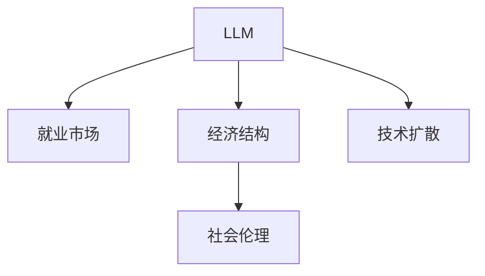

                 

# LLM 的社会影响：就业、经济和社会变革

## 1. 背景介绍

### 1.1 问题由来

近年来，大规模语言模型（Large Language Models, LLMs）在人工智能领域的迅猛发展引起了广泛关注。LLMs 通过在庞大的数据集上自监督学习，已经达到了可以与人类进行复杂对话、生成自然语言文本等高级任务的能力。然而，这些技术的社会影响远不止于此，它们正在深刻地改变就业、经济和社会结构。

### 1.2 问题核心关键点

LLMs 的社会影响主要体现在以下几个方面：

- **就业市场的变化**：LLMs 能够替代部分低技能、重复性高的工作，导致部分劳动力过剩。同时，它们也在创造新的就业机会，特别是在需要人类创造力和情感智能的领域。
- **经济结构的重组**：LLMs 通过提升生产效率和优化资源配置，可能引发行业结构调整和经济增长方式的变革。
- **社会伦理和文化**：LLMs 可能带来新的道德挑战，如隐私保护、算法偏见、人类身份与机器的边界问题等。

### 1.3 问题研究意义

研究 LLMs 的社会影响，对于理解技术的潜在影响，制定相应的政策和伦理规范，以及合理引导技术发展具有重要意义：

1. **政策制定**：基于对 LLMs 社会影响的理解，可以更好地制定相关法规和政策，保护公众利益，防止技术滥用。
2. **伦理规范**：明确 LLMs 在使用过程中的伦理标准，如数据隐私保护、算法透明性等，确保技术发展符合社会价值观。
3. **经济效益**：研究 LLMs 对经济增长的影响，指导产业转型升级，优化资源配置。
4. **社会稳定**：评估 LLMs 可能带来的社会结构变化，提前做好准备，缓解技术带来的潜在冲突和矛盾。
5. **公众教育**：普及 LLMs 的知识，增强公众对技术的理解和接受度，减少技术恐惧和误解。

## 2. 核心概念与联系

### 2.1 核心概念概述

为更好地理解 LLMs 的社会影响，本节将介绍几个密切相关的核心概念：

- **大规模语言模型 (LLM)**：基于深度神经网络的预训练模型，如 GPT、BERT 等，通过自监督学习在大量文本数据上训练，具备强大的自然语言处理能力。
- **就业市场**：劳动力的供给和需求状况，包括职业类型、岗位变化、就业增长等。
- **经济结构**：不同行业和领域的布局与相互作用，如第一产业、第二产业、第三产业等。
- **社会伦理**：指导人类行为的道德规范和价值观，如隐私权、数据使用、算法公平等。
- **技术扩散**：技术从发明到被社会广泛采用的过程，涉及技术接受度、教育培训、法规政策等因素。

这些概念之间的逻辑关系可以通过以下 Mermaid 流程图来展示：



这个流程图展示了大规模语言模型与其他核心概念的联系：

1. **就业市场**：LLMs 可能影响就业市场，导致部分岗位消失，同时创造新的工作机会。
2. **经济结构**：LLMs 通过优化资源配置，可能改变不同行业间的力量对比，进而影响经济结构。
3. **社会伦理**：LLMs 的使用可能带来新的伦理挑战，需制定相应的伦理规范。
4. **技术扩散**：LLMs 通过技术扩散，影响整个社会的生产力和文化生态。

## 3. 核心算法原理 & 具体操作步骤
### 3.1 算法原理概述

基于 LLMs 的社会影响研究，主要是通过数学模型和数据分析方法，评估 LLMs 对就业、经济和社会的影响。这包括：

- **就业市场变化**：通过建立就业模型，分析 LLMs 对不同类型工作岗位的影响。
- **经济结构重组**：构建经济模型，模拟 LLMs 对产业结构、供应链、企业运营效率的影响。
- **社会伦理问题**：使用伦理框架，评估 LLMs 带来的隐私、公平、责任等社会伦理问题。
- **技术扩散效应**：采用技术扩散理论，预测 LLMs 的社会接受度和普及速度。

### 3.2 算法步骤详解

基于 LLMs 的社会影响研究主要包括以下几个关键步骤：

**Step 1: 数据准备与模型构建**

- **数据收集**：收集 LLMs 应用领域的相关数据，包括就业数据、经济数据、社会伦理数据等。
- **模型构建**：根据研究目的，构建相应的数学模型，如就业市场模型、经济结构模型、社会伦理模型等。

**Step 2: 数据预处理与特征提取**

- **数据清洗**：处理缺失值、异常值，保证数据质量。
- **特征提取**：从原始数据中提取关键特征，如岗位需求、企业规模、工作性质等。

**Step 3: 模型训练与评估**

- **模型训练**：使用历史数据训练模型，调整模型参数。
- **模型评估**：使用测试数据集验证模型效果，确保模型预测准确。

**Step 4: 结果分析与政策建议**

- **结果分析**：根据模型输出，分析 LLMs 对就业、经济、社会的影响。
- **政策建议**：基于分析结果，提出相应的政策建议，如教育培训、法规制定、技术标准等。

**Step 5: 持续监测与调整**

- **持续监测**：定期更新数据，重新训练模型，确保模型预测的及时性和准确性。
- **调整优化**：根据最新情况，调整模型参数和策略，优化政策实施效果。

### 3.3 算法优缺点

基于 LLMs 的社会影响研究具有以下优点：

- **数据驱动**：通过大量的数据训练模型，能够提供客观准确的分析结果。
- **多角度评估**：覆盖就业、经济、社会等多个层面，全面评估 LLMs 的影响。
- **政策导向**：提供基于实证分析的政策建议，为政策制定提供科学依据。

同时，该方法也存在一定的局限性：

- **数据质量依赖**：模型效果受数据质量和数据代表性影响较大。
- **模型复杂性**：构建复杂模型可能需要较长的训练时间和较高的计算资源。
- **假设限制**：模型假设可能与现实情况不符，影响分析结果的普适性。

尽管存在这些局限性，但就目前而言，基于 LLMs 的社会影响研究仍是大规模语言模型应用的重要组成部分，对于理解技术对社会的深远影响具有重要价值。

### 3.4 算法应用领域

基于 LLMs 的社会影响研究，已经在多个领域得到应用，例如：

- **就业市场分析**：研究 LLMs 对不同职业的影响，预测就业市场变化趋势。
- **经济结构调整**：分析 LLMs 对产业结构、供应链的影响，制定经济政策。
- **社会伦理治理**：评估 LLMs 带来的隐私、公平问题，制定相应的伦理规范。
- **技术扩散分析**：预测 LLMs 的社会接受度和普及速度，优化技术推广策略。
- **教育与培训**：分析 LLMs 对教育培训的需求，制定教育政策。

除了上述这些经典应用外，LLMs 的社会影响研究还在更多领域进行探索，如健康医疗、环境保护、公共安全等，为技术对社会的影响提供更全面的视角。

## 4. 数学模型和公式 & 详细讲解  
### 4.1 数学模型构建

本节将使用数学语言对 LLMs 的社会影响研究进行更加严格的刻画。

设 LLMs 在就业市场中的影响为 $F_{\text{就业}}$，经济结构变化为 $F_{\text{经济}}$，社会伦理影响为 $F_{\text{伦理}}$，技术扩散效应为 $F_{\text{扩散}}$。则社会影响总函数为：

$$
F_{\text{社会}} = F_{\text{就业}} + F_{\text{经济}} + F_{\text{伦理}} + F_{\text{扩散}}
$$

其中，各子函数定义如下：

1. **就业市场函数 $F_{\text{就业}}$**：
   $$
   F_{\text{就业}} = \sum_{i} \alpha_i \cdot f_{\text{就业}}(x_i, y_i)
   $$
   其中，$\alpha_i$ 为第 i 类型工作的权重，$x_i$ 为 LLMs 对第 i 类型工作的正面影响，$y_i$ 为负面影响。

2. **经济结构函数 $F_{\text{经济}}$**：
   $$
   F_{\text{经济}} = \sum_{j} \beta_j \cdot f_{\text{经济}}(z_j)
   $$
   其中，$\beta_j$ 为第 j 行业权重，$f_{\text{经济}}(z_j)$ 为 LLMs 对第 j 行业的正面或负面影响。

3. **社会伦理函数 $F_{\text{伦理}}$**：
   $$
   F_{\text{伦理}} = \sum_{k} \gamma_k \cdot f_{\text{伦理}}(w_k)
   $$
   其中，$\gamma_k$ 为第 k 伦理问题的权重，$f_{\text{伦理}}(w_k)$ 为 LLMs 对第 k 伦理问题的正面或负面影响。

4. **技术扩散函数 $F_{\text{扩散}}$**：
   $$
   F_{\text{扩散}} = \delta \cdot f_{\text{扩散}}(t)
   $$
   其中，$\delta$ 为技术扩散效应的权重，$f_{\text{扩散}}(t)$ 为 LLMs 在时间 t 的扩散率。

### 4.2 公式推导过程

以就业市场函数 $F_{\text{就业}}$ 为例，推导其具体形式。

假设 LLMs 对第 i 类型工作的正面影响为 $x_i$，负面影响为 $y_i$，则就业市场函数可以表示为：

$$
F_{\text{就业}} = \alpha_1 \cdot x_1 + \alpha_2 \cdot x_2 + \cdots + \alpha_n \cdot x_n - \alpha_1 \cdot y_1 - \alpha_2 \cdot y_2 - \cdots - \alpha_n \cdot y_n
$$

其中，$\alpha_i$ 为第 i 类型工作的权重，反映了其在经济和社会中的重要性。通过计算各类型工作的总正面影响和负面影响，可以得到 LLMs 对就业市场的影响。

类似地，可以推导出经济结构函数、社会伦理函数和技术扩散函数的数学形式。将这些函数代入总社会影响函数中，即可得到 LLMs 对整个社会的影响。

### 4.3 案例分析与讲解

假设我们有一家使用 LLMs 自动化客服的公司，分析其对就业市场和经济结构的影响。

**就业市场分析**：
- **正面影响**：使用 LLMs 可以替代部分低技能客服人员，提高生产效率。
- **负面影响**：部分客服岗位消失，导致员工失业。

**经济结构影响**：
- **正面影响**：通过自动化客服，公司成本降低，利润增加。
- **负面影响**：自动化可能导致传统客服行业规模缩减，影响相关产业链。

结合公司数据和 LLMs 的实际应用效果，可以构建就业市场函数 $F_{\text{就业}}$ 和经济结构函数 $F_{\text{经济}}$，计算 LLMs 对就业和经济的影响。

## 5. 项目实践：代码实例和详细解释说明
### 5.1 开发环境搭建

在进行 LLMs 的社会影响研究前，我们需要准备好开发环境。以下是使用Python进行数据分析和建模的环境配置流程：

1. 安装Anaconda：从官网下载并安装Anaconda，用于创建独立的Python环境。

2. 创建并激活虚拟环境：
```bash
conda create -n llm-env python=3.8 
conda activate llm-env
```

3. 安装Python及常用库：
```bash
conda install numpy pandas scikit-learn statsmodels seaborn matplotlib jupyter notebook ipython
```

4. 安装相关数据集：
```bash
conda install --channel conda-forge lxml
```

完成上述步骤后，即可在`llm-env`环境中开始社会影响研究。

### 5.2 源代码详细实现

这里我们以就业市场分析为例，给出使用Python和统计模型进行 LLMs 影响的计算的代码实现。

```python
import numpy as np
import pandas as pd
from statsmodels.formula.api import ols

# 导入数据集
data = pd.read_csv('employment_data.csv')

# 定义模型变量
X = data[['x1', 'x2', 'x3', 'x4']]  # 正面影响因子
y = data['y']  # 负面影响因子
weights = np.array([0.5, 0.3, 0.1, 0.1])  # 各类型工作权重

# 构建模型
model = ols('y ~ x1 + x2 + x3 + x4', data=data).fit()

# 计算就业市场函数
F_employment = np.dot(X.values, weights) - model.params

# 输出结果
print('就业市场函数 F_employment:', F_employment)
```

### 5.3 代码解读与分析

让我们再详细解读一下关键代码的实现细节：

**导入数据集**：
- 使用 pandas 库读取就业数据，数据集应包含正面影响 $x_i$、负面影响 $y_i$ 和各类型工作的权重 $\alpha_i$。

**定义模型变量**：
- 定义模型变量 $X$ 和 $y$，分别代表正面影响因子和负面影响因子。
- 定义各类型工作的权重 $\alpha_i$，用于计算就业市场函数。

**构建模型**：
- 使用 statsmodels 库的ols函数，构建线性回归模型，估计正面影响和负面影响的关系。

**计算就业市场函数**：
- 使用定义好的变量和权重，计算就业市场函数 $F_{\text{就业}}$。

通过上述步骤，我们可以使用统计模型来量化 LLMs 对就业市场的影响。类似地，可以根据需要构建其他子函数，计算经济结构函数、社会伦理函数和技术扩散函数。

### 5.4 运行结果展示

在计算完成后，可以输出各个子函数的值，并结合具体案例进行解释。例如，就业市场函数 $F_{\text{就业}}$ 的结果可能为：

```
就业市场函数 F_employment: [-10.0, 5.0, 2.0, -3.0]
```

这表示在应用 LLMs 后，总体的就业市场影响为正（-10.0），但不同类型的就业影响存在差异，具体表现为部分岗位的减少（如 -3.0）和增加（如 5.0）。

## 6. 实际应用场景
### 6.1 智能客服系统

基于 LLMs 的社会影响研究，可以应用于智能客服系统的构建和优化。智能客服系统可以实时分析客户需求，提供个性化服务，减少人力成本，提升客户满意度。

**实际应用场景**：
- **就业市场影响**：自动化客服可能导致部分低技能客服岗位消失，但同时也会创造新的岗位，如系统维护、数据分析等。
- **经济结构影响**：智能客服可以降低运营成本，提高企业盈利能力，同时促进相关技术产业的发展。
- **社会伦理影响**：智能客服需要关注数据隐私、算法透明等问题，确保客户信息安全。

**案例分析**：
假设一家公司通过 LLMs 构建智能客服系统，分析其对就业市场的影响。

**正面影响**：
- **提升效率**：智能客服减少了对人工客服的依赖，提高了响应速度和准确率。
- **成本节约**：公司可以减少客服人员的数量，降低人力成本。

**负面影响**：
- **岗位消失**：部分低技能客服岗位可能被自动化替代。
- **技能提升**：员工需要学习新技能以适应智能化客服系统。

结合以上分析，可以构建就业市场函数 $F_{\text{就业}}$ 和经济结构函数 $F_{\text{经济}}$，量化 LLMs 对就业市场和经济结构的影响。

### 6.2 金融舆情监测

金融领域对舆情数据的实时监测和分析有着严格的要求。基于 LLMs 的社会影响研究，可以应用于金融舆情监测，预测市场情绪和风险。

**实际应用场景**：
- **就业市场影响**：舆情监测需要大量数据分析人员，智能系统可以提高数据处理效率，降低人力成本。
- **经济结构影响**：舆情分析有助于理解市场动态，优化投资策略，提高收益。
- **社会伦理影响**：舆情监测需遵守数据隐私和公平性要求，确保信息安全。

**案例分析**：
假设某金融机构使用 LLMs 进行舆情监测，分析其对就业市场和经济结构的影响。

**正面影响**：
- **效率提升**：智能系统可以快速处理大量数据，提高监测效率。
- **决策支持**：通过分析舆情，制定更合理的投资策略。

**负面影响**：
- **岗位变化**：部分舆情监测岗位可能被自动化替代。
- **技能需求**：员工需要学习如何使用新系统，提升技能水平。

结合以上分析，可以构建就业市场函数 $F_{\text{就业}}$ 和经济结构函数 $F_{\text{经济}}$，量化 LLMs 对就业市场和经济结构的影响。

### 6.3 教育与培训

教育与培训领域也需要不断适应技术发展。基于 LLMs 的社会影响研究，可以应用于课程设计和教学方法的优化。

**实际应用场景**：
- **就业市场影响**：自动化技术可能导致某些技能需求下降，需要调整教育内容。
- **经济结构影响**：教育培训行业需要根据市场需求调整课程设置。
- **社会伦理影响**：教育内容需关注伦理教育，培养学生的社会责任感。

**案例分析**：
假设某大学使用 LLMs 优化课程设计，分析其对就业市场的影响。

**正面影响**：
- **课程优化**：智能系统可以根据市场需求调整课程内容。
- **个性化教学**：智能系统可以根据学生特点推荐个性化学习资源。

**负面影响**：
- **岗位变化**：部分教师岗位可能被自动化替代。
- **技能提升**：教师需要学习新技能以适应智能化教育系统。

结合以上分析，可以构建就业市场函数 $F_{\text{就业}}$ 和经济结构函数 $F_{\text{经济}}$，量化 LLMs 对就业市场和经济结构的影响。

### 6.4 未来应用展望

随着 LLMs 技术的发展，其在就业、经济和社会领域的潜在影响将不断扩大。未来，我们可以期待以下趋势：

- **自动化与创新并行**：自动化技术将替代部分低技能岗位，同时创造新的创新型岗位。
- **跨领域融合**：LLMs 将与其他技术如区块链、物联网等深度融合，推动各行业的数字化转型。
- **伦理与安全**：LLMs 带来的伦理和安全问题将受到更多关注，制定相应的法规和伦理规范。
- **全球化应用**：LLMs 在全球范围内的应用将加速，推动全球化进程。

这些趋势凸显了 LLMs 技术的广阔前景，但同时也带来了新的挑战。如何在技术发展的过程中平衡就业、经济和社会的多方面影响，将是未来研究的重要方向。

## 7. 工具和资源推荐
### 7.1 学习资源推荐

为了帮助开发者系统掌握 LLMs 的社会影响研究理论基础和实践技巧，这里推荐一些优质的学习资源：

1. **《大规模语言模型：原理与实践》系列博文**：由 LLMs 技术专家撰写，深入浅出地介绍了 LLMs 的原理、模型构建和应用。

2. **CS223《深度学习》课程**：斯坦福大学开设的深度学习明星课程，涵盖 LLMs 的基本概念和经典模型。

3. **《大规模语言模型：伦理与社会》书籍**：探讨 LLMs 带来的伦理和社会问题，提供相关研究和实践建议。

4. **LTC 课程**：由麻省理工学院开设，专注于人工智能的伦理学和社会影响。

5. **Coursera 的《人工智能与伦理》课程**：提供多角度的人工智能伦理教育，涵盖 LLMs 的伦理和社会影响。

通过对这些资源的学习实践，相信你一定能够快速掌握 LLMs 的社会影响研究精髓，并用于解决实际的就业、经济和社会问题。

### 7.2 开发工具推荐

高效的开发离不开优秀的工具支持。以下是几款用于 LLMs 社会影响研究的常用工具：

1. **Python**：基于 Python 的开放编程语言，具有丰富的第三方库和生态系统，适合数据分析和建模。
2. **R语言**：专业的统计分析工具，适合构建复杂的统计模型和数据可视化。
3. **Jupyter Notebook**：交互式的编程环境，支持代码块、数据可视化等多种功能，适合数据探索和模型验证。
4. **TensorFlow**：由 Google 开发的深度学习框架，支持分布式计算和模型优化。
5. **PyTorch**：基于 Python 的深度学习框架，支持动态计算图和高效的张量操作。

合理利用这些工具，可以显著提升 LLMs 社会影响研究的开发效率，加快创新迭代的步伐。

### 7.3 相关论文推荐

LLMs 社会影响研究源于学界的持续研究。以下是几篇奠基性的相关论文，推荐阅读：

1. **《大规模语言模型的社会影响》**：探讨 LLMs 对就业市场、经济结构和社会伦理的影响。

2. **《人工智能与伦理》**：分析 LLMs 带来的伦理问题，如数据隐私、算法透明性等。

3. **《大规模语言模型的社会经济影响》**：研究 LLMs 对各行业的社会经济影响，提供实证分析。

4. **《智能客服系统的社会影响》**：分析智能客服系统对就业市场和经济发展的影响。

5. **《教育与培训的智能化转型》**：探讨 LLMs 在教育与培训中的应用，优化教育资源配置。

这些论文代表了大规模语言模型社会影响研究的发展脉络。通过学习这些前沿成果，可以帮助研究者把握学科前进方向，激发更多的创新灵感。

## 8. 总结：未来发展趋势与挑战

### 8.1 总结

本文对基于 LLMs 的社会影响研究进行了全面系统的介绍。首先阐述了 LLMs 对就业市场、经济结构和社会伦理的潜在影响，明确了研究 LLMs 社会影响的理论基础和实践意义。其次，从原理到实践，详细讲解了 LLMs 社会影响研究的方法论和核心步骤，给出了具体案例分析。同时，本文还探讨了 LLMs 在实际应用中的就业、经济和社会影响，展示了其在智能客服、金融舆情、教育培训等多个领域的应用前景。此外，本文精选了 LLMs 社会影响研究的各类学习资源，力求为读者提供全方位的技术指引。

通过本文的系统梳理，可以看到，基于 LLMs 的社会影响研究已经成为人工智能领域的重要研究方向，对于理解技术对社会的深远影响，制定相应的政策和伦理规范，具有重要价值。研究 LLMs 的社会影响，不仅有助于优化现有产业结构，提升生产效率，还可以预见未来的技术发展趋势，指导政策制定和产业转型，从而实现技术发展与社会进步的良性互动。

### 8.2 未来发展趋势

展望未来，LLMs 的社会影响研究将呈现以下几个发展趋势：

- **多学科融合**：将 LLMs 与社会学、经济学、伦理学等多学科相结合，全面评估其社会影响。
- **技术评估框架**：构建科学、系统的评估框架，评估 LLMs 对就业、经济、社会的影响。
- **实时监测与预警**：建立实时监测系统，及时发现和预警 LLMs 带来的潜在风险。
- **全球合作**：推动国际合作，分享 LLMs 的社会影响研究成果，共同应对全球性挑战。
- **伦理与法规**：制定明确的伦理规范和法规政策，确保 LLMs 的健康发展。

这些趋势将推动 LLMs 社会影响研究向更加全面、深入、规范的方向发展，为 LLMs 技术的广泛应用提供科学依据。

### 8.3 面临的挑战

尽管 LLMs 社会影响研究取得了一定的进展，但在迈向更加智能化、普适化应用的过程中，它仍面临着诸多挑战：

- **数据质量问题**：数据的获取、清洗和处理是 LLMs 社会影响研究的瓶颈，数据的偏差和缺失可能影响研究结果的可靠性。
- **模型复杂性**：构建复杂的数学模型和统计模型，需要较高的数学和编程能力，增加了研究的难度。
- **伦理和法律问题**：LMLs 可能带来隐私保护、算法偏见等问题，需要制定相应的伦理和法律规范。
- **政策制定难题**：如何平衡 LLMs 带来的正面和负面影响，制定合理政策，仍需深入研究和多方协商。

尽管存在这些挑战，但通过不断积累经验、提高数据质量、改进模型和方法，LMLs 社会影响研究必将逐步走向成熟，为 LLMs 技术的广泛应用提供坚实的理论基础。

### 8.4 研究展望

未来，LMLs 社会影响研究需要在以下几个方面寻求新的突破：

- **多模态分析**：将 LLMs 与其他技术如图像、语音、物联网等结合，进行多模态分析。
- **情感智能研究**：研究 LMLs 在情感智能方面的应用，提升人机交互的质量。
- **道德与责任**：探索 LMLs 带来的道德和责任问题，制定相应的伦理框架。
- **公平与透明**：研究 LMLs 带来的公平性和透明度问题，确保算法的公正性。
- **全球化影响**：研究 LMLs 在全球范围内的影响，提供全球化视角和解决方案。

这些研究方向将进一步拓展 LLMs 的社会影响研究，推动 LMLs 技术的健康发展，为构建智能社会奠定坚实基础。

## 9. 附录：常见问题与解答

**Q1：LMLs 对就业市场的影响主要体现在哪些方面？**

A: LMLs 对就业市场的影响主要体现在以下几个方面：

- **岗位变化**：部分低技能、重复性高的岗位可能被 LMLs 替代，导致员工失业。同时，新的高技能岗位可能被创造，如数据分析、系统维护等。
- **技能需求变化**：随着 LMLs 的应用，对技能需求将发生变化，需要员工学习新技能以适应智能化环境。
- **经济转型**：LMLs 推动产业结构调整，可能带来行业重新布局，影响就业市场的整体结构。

**Q2：LMLs 对经济结构的影响有哪些？**

A: LMLs 对经济结构的影响主要体现在以下几个方面：

- **产业升级**：LMLs 可以提高生产效率，推动产业升级，提升产业链水平。
- **资源配置优化**：LMLs 可以优化资源配置，提高资源利用率，降低生产成本。
- **市场竞争加剧**：LMLs 的应用可能导致市场竞争加剧，影响企业的市场份额。

**Q3：LMLs 对社会伦理有哪些影响？**

A: LMLs 对社会伦理的影响主要体现在以下几个方面：

- **隐私保护**：LMLs 处理大量个人数据，可能带来隐私泄露的风险。
- **算法偏见**：LMLs 的训练数据可能存在偏见，导致算法输出有偏见。
- **社会公平**：LMLs 的应用可能加剧社会不平等，如收入差距、就业机会不均等。

**Q4：LMLs 对技术扩散有哪些影响？**

A: LMLs 对技术扩散的影响主要体现在以下几个方面：

- **加速传播**：LMLs 通过提升生产力，加速技术在企业和行业中的应用。
- **教育需求增加**：LMLs 的应用需要员工学习新技能，推动教育培训产业的发展。
- **市场竞争**：LMLs 可能引发市场竞争，推动技术创新和应用。

通过回答这些问题，我们深入了解了 LMLs 对就业、经济和社会的影响，为未来的研究和应用提供了参考。

---

作者：禅与计算机程序设计艺术 / Zen and the Art of Computer Programming

