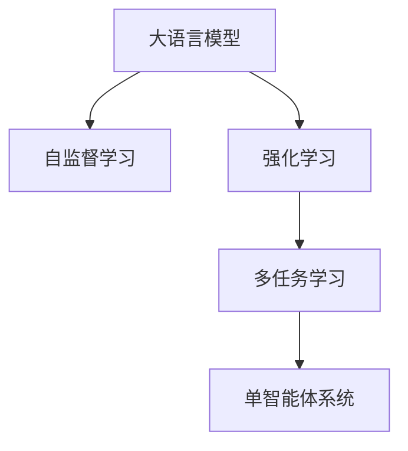

                 

# LLM-based Single-Agent System

> 关键词：大语言模型, 单智能体系统, 强化学习, 自监督学习, 多任务学习, 深度学习, 强化学习环境, 语言模型架构, 复杂系统优化

## 1. 背景介绍

### 1.1 问题由来
近年来，人工智能(AI)领域迎来了爆发式的增长，特别是在自然语言处理(NLP)、计算机视觉(CV)、语音识别(SR)等任务上，取得了显著的进展。大语言模型(Large Language Models, LLMs)，如GPT-3、BERT等，通过对大规模语料进行预训练，展现了强大的语言生成和理解能力，引起了学术界和工业界的广泛关注。然而，这些模型在应用过程中仍面临诸多挑战，如模型规模庞大、训练成本高、推理效率低、可解释性不足等。因此，如何在大语言模型基础上构建更加高效、灵活、可解释的智能体系统，成为了一个亟待解决的问题。

### 1.2 问题核心关键点
针对大语言模型在应用中的局限性，研究者们提出了一种基于LLM的单智能体系统(Single-Agent System)，以解决复杂环境下的多任务优化问题。这种系统利用LLM作为决策器，结合强化学习和多任务学习，能够在给定环境中自主学习和优化，适应不断变化的任务需求。

单智能体系统的核心思想是将大语言模型嵌入到强化学习环境中，通过与环境互动，自动学习目标任务的优化策略。该系统利用自监督学习和大规模数据预训练，使得模型能够具备丰富的语言理解和生成能力，并通过多任务学习，提升在多个相关任务上的泛化能力。

## 2. 核心概念与联系

### 2.1 核心概念概述

为更好地理解LLM-based Single-Agent System，本节将介绍几个密切相关的核心概念：

- 大语言模型(Large Language Model, LLM)：以自回归(如GPT)或自编码(如BERT)模型为代表的大规模预训练语言模型。通过在大规模无标签文本语料上进行预训练，学习通用的语言表示，具备强大的语言理解和生成能力。

- 强化学习(Reinforcement Learning, RL)：一种通过试错学习，使得智能体在特定环境中最大化累积奖励的优化方法。强化学习环境通常包括智能体、环境、奖励函数等关键组件。

- 多任务学习(Multi-task Learning, MTL)：指在一个任务中同时学习多个相关任务的优化方法，以提升模型在多个任务上的泛化能力。

- 自监督学习(Self-Supervised Learning, SSL)：利用无标签数据，通过自建任务或预定义的规则，引导模型学习泛化能力。

- 单智能体系统(Single-Agent System)：指在一个环境中，只有一个智能体执行学习任务的优化系统，通常用于复杂环境下的多任务优化问题。

- 深度学习(Deep Learning, DL)：一种通过多层神经网络实现的机器学习范式，适用于处理大规模复杂数据。

这些核心概念之间的逻辑关系可以通过以下Mermaid流程图来展示：

这个流程图展示了大语言模型与相关概念的联系：

1. 大语言模型通过自监督学习获得基础的语义表示能力。
2. 在强化学习环境中，利用大语言模型作为决策器，学习多任务的优化策略。
3. 通过多任务学习，提升模型在多个相关任务上的泛化能力。
4. 单智能体系统将大语言模型嵌入到强化学习框架中，实现复杂环境下的自主优化。

这些概念共同构成了LLM-based Single-Agent System的核心框架，使其能够在大语言模型的基础上，构建高效、灵活、可解释的智能体系统。

## 3. 核心算法原理 & 具体操作步骤
### 3.1 算法原理概述

基于LLM的单智能体系统，本质上是一个通过强化学习实现的多任务优化过程。其核心思想是：将大语言模型嵌入到强化学习环境中，通过与环境互动，自动学习多任务的优化策略，使得模型能够在多个相关任务上同时提升性能。

形式化地，假设强化学习环境为 $E$，模型策略为 $π$，模型在状态 $s$ 下的行动为 $a$，环境状态转移为 $p(s'|s,a)$，奖励函数为 $r(s,a)$。单智能体系统的优化目标是最小化累积折扣奖励的期望值，即：

$$
J(π) = \mathbb{E}_{s_0 \sim p(s_0), a_t \sim π(\cdot|s_t)} \left[ \sum_{t=0}^{\infty} \gamma^t r(s_t,a_t) \right]
$$

其中，$\gamma$ 为折扣因子。

单智能体系统的训练过程包括：

1. 收集环境数据 $D$，包括状态-行动对 $(s_t,a_t)$ 和对应的奖励 $r_t$。
2. 利用大语言模型作为决策器，预测行动 $a_t$。
3. 将模型预测与实际行动 $a_t$ 结合，计算损失函数 $\mathcal{L}$。
4. 利用优化算法（如梯度下降）最小化损失函数，更新模型参数。
5. 重复上述过程直至收敛。

### 3.2 算法步骤详解

基于LLM的单智能体系统的训练过程可以细化为以下几个关键步骤：

**Step 1: 数据收集**
- 在预设的强化学习环境中，通过智能体与环境的交互，收集状态-行动对 $(s_t,a_t)$ 和对应的奖励 $r_t$。

**Step 2: 模型初始化**
- 选择合适的大语言模型 $M_{\theta}$ 作为决策器，其中 $\theta$ 为模型参数。
- 设置优化算法和超参数，如学习率、批大小、迭代轮数等。

**Step 3: 定义奖励函数**
- 根据具体任务需求，定义合适的奖励函数 $r(s_t,a_t)$，如任务完成度、时间成本等。

**Step 4: 设计行动策略**
- 利用大语言模型作为决策器，设计适当的行动策略 $π(s)$，如基于最大似然、自回归等方式预测行动。

**Step 5: 模型训练**
- 将收集到的数据 $D$ 作为训练集，通过模型预测和实际行动的差异，计算损失函数 $\mathcal{L}$。
- 使用优化算法最小化损失函数，更新模型参数。
- 重复上述过程直至收敛。

**Step 6: 模型评估**
- 在测试集上评估模型在多任务上的性能，对比训练前后的提升。
- 使用评估指标（如准确率、F1分数等）评估模型的优化效果。

### 3.3 算法优缺点

基于LLM的单智能体系统具有以下优点：

- 灵活性强。大语言模型能够处理自然语言输入，具有更强的泛化能力，能够适应不同任务需求。
- 可解释性好。大语言模型能够提供详细的推理过程和决策依据，提高了系统的可解释性。
- 自监督学习能力。大语言模型通过自监督学习获得语言表示能力，减少了对标注数据的需求。
- 多任务优化。单智能体系统能够同时优化多个相关任务，提升了模型在多个任务上的性能。

同时，该系统也存在一些局限性：

- 训练成本高。大语言模型需要大量计算资源进行训练，增加了系统开发的成本。
- 推理效率低。大语言模型推理速度较慢，在实际部署中可能面临性能瓶颈。
- 鲁棒性不足。大语言模型容易受到输入数据的干扰，需要进一步提升模型的鲁棒性。

尽管存在这些局限性，但基于LLM的单智能体系统仍是大语言模型应用的一个重要方向。未来相关研究的重点在于如何进一步降低训练成本，提高推理效率，同时兼顾可解释性和鲁棒性等因素。

### 3.4 算法应用领域

基于大语言模型的单智能体系统，在多任务优化领域具有广泛的应用前景，例如：

- 问答系统：构建多任务问答系统，如命名实体识别、情感分析、问答匹配等。
- 自然语言处理：实现自动摘要、翻译、文本生成等任务，提升语言处理能力。
- 机器人导航：结合视觉、语音等感知能力，使机器人能够自主导航和执行任务。
- 智能推荐：构建多任务推荐系统，提升个性化推荐效果。
- 游戏AI：在复杂游戏环境中，通过多任务学习提升AI的智能水平。
- 医疗诊断：结合医疗数据，构建多任务诊断系统，提升诊断准确率。

除了上述这些经典应用外，单智能体系统还被创新性地应用于更多场景中，如智能家居控制、自动驾驶、金融预测等，为人工智能技术的发展带来了新的突破。

## 4. 数学模型和公式 & 详细讲解
### 4.1 数学模型构建

本节将使用数学语言对基于LLM的单智能体系统进行更加严格的刻画。

假设强化学习环境为 $E$，状态空间为 $S$，行动空间为 $A$，奖励函数为 $r(s,a)$，模型策略为 $π$，折扣因子为 $\gamma$。单智能体系统的优化目标是最小化累积折扣奖励的期望值，即：

$$
J(π) = \mathbb{E}_{s_0 \sim p(s_0), a_t \sim π(\cdot|s_t)} \left[ \sum_{t=0}^{\infty} \gamma^t r(s_t,a_t) \right]
$$

其中，$\mathbb{E}$ 表示期望值。

定义模型在状态 $s_t$ 下的行动为 $a_t = M_{\theta}(s_t)$，其中 $M_{\theta}$ 为预训练语言模型。则单智能体系统的优化目标可进一步表示为：

$$
J(π) = \mathbb{E}_{s_0 \sim p(s_0)} \left[ \sum_{t=0}^{\infty} \gamma^t r(s_t,M_{\theta}(s_t)) \right]
$$

### 4.2 公式推导过程

以下我们以问答系统为例，推导基于LLM的单智能体系统的数学公式。

假设模型在输入 $x$ 上的输出为 $\hat{y}=M_{\theta}(x) \in [0,1]$，表示样本属于正类的概率。真实标签 $y \in \{0,1\}$。则二分类交叉熵损失函数定义为：

$$
\ell(M_{\theta}(x),y) = -[y\log \hat{y} + (1-y)\log (1-\hat{y})]
$$

将其代入优化目标，得：

$$
J(π) = \mathbb{E}_{s_0 \sim p(s_0)} \left[ \sum_{t=0}^{\infty} \gamma^t \ell(M_{\theta}(s_t),y_t) \right]
$$

其中 $y_t$ 为第 $t$ 步的标签。

根据强化学习的定义，单智能体系统可以通过优化目标函数 $J(π)$ 来选择最优策略 $π$。假设模型在状态 $s$ 下的行动策略为 $π(s)=M_{\theta}(s)$，则优化目标可以表示为：

$$
J(π) = \mathbb{E}_{s_0 \sim p(s_0)} \left[ \sum_{t=0}^{\infty} \gamma^t \ell(M_{\theta}(s_t),y_t) \right]
$$

通过求解上述优化问题，可以得到最优的策略 $π^*$。

### 4.3 案例分析与讲解

以命名实体识别(Named Entity Recognition, NER)任务为例，演示基于LLM的单智能体系统的应用。

假设智能体在每个时间步 $t$ 接收到一个句子 $x_t$，通过模型 $M_{\theta}$ 识别其中的实体 $e_t$。智能体根据实体识别的准确度获得奖励 $r(e_t)$，其中 $r(e_t)=1$ 表示正确识别实体，$r(e_t)=0$ 表示未正确识别实体。

定义智能体的行动空间为 $A=\{0,1\}$，其中 $0$ 表示未识别实体，$1$ 表示识别实体。智能体的策略为 $π(s)=M_{\theta}(s)$，其中 $M_{\theta}(s)$ 为模型在输入 $s$ 上的预测输出。

智能体在每个时间步 $t$ 的奖励函数为 $r(e_t)=1$，即如果实体 $e_t$ 被正确识别，则获得奖励 $r(e_t)=1$。

智能体在每个时间步 $t$ 的行动策略为 $π(s)=M_{\theta}(s)$，即模型 $M_{\theta}$ 对输入 $s$ 进行实体识别预测。

智能体在每个时间步 $t$ 的行动为 $a_t=π(s_t)$，即模型在每个时间步 $t$ 对输入 $s_t$ 进行实体识别预测。

智能体在每个时间步 $t$ 的状态 $s_t$ 由输入 $s_t$ 和前一时刻的状态 $s_{t-1}$ 共同决定，即 $s_t=(s_{t-1},x_t)$。

智能体在每个时间步 $t$ 的状态转移概率为 $p(s_{t+1}|s_t,a_t)=p(s_{t+1}|s_t)$，即状态仅由前一时刻的状态和当前输入决定。

智能体在每个时间步 $t$ 的累积奖励为 $R_t=\sum_{i=0}^{t} \gamma^i r(e_i)$，即从第 $0$ 步到第 $t$ 步的奖励总和。

智能体在每个时间步 $t$ 的累积折扣奖励为 $R_t^{\gamma}=\gamma^t R_t$，即从第 $0$ 步到第 $t$ 步的累积奖励乘以折扣因子 $\gamma$。

智能体在每个时间步 $t$ 的累积折扣奖励的期望值为：

$$
J(π) = \mathbb{E}_{s_0 \sim p(s_0)} \left[ \sum_{t=0}^{\infty} \gamma^t r(e_t) \right]
$$

定义模型在每个时间步 $t$ 的预测输出为 $y_t=M_{\theta}(s_t)$，其中 $y_t \in [0,1]$，表示样本属于正类的概率。

定义模型在每个时间步 $t$ 的损失函数为 $\ell(y_t)=\ell(M_{\theta}(s_t),y_t)$，其中 $\ell(y_t)$ 为二分类交叉熵损失函数。

定义模型在每个时间步 $t$ 的损失函数为 $\mathcal{L}(s_t,y_t)=\ell(y_t)$，其中 $y_t \in \{0,1\}$，表示样本的标签。

智能体在每个时间步 $t$ 的行动策略为 $π(s)=M_{\theta}(s)$，即模型在每个时间步 $t$ 对输入 $s$ 进行实体识别预测。

智能体在每个时间步 $t$ 的行动策略为 $π(s)=M_{\theta}(s)$，即模型在每个时间步 $t$ 对输入 $s$ 进行实体识别预测。

智能体在每个时间步 $t$ 的行动策略为 $π(s)=M_{\theta}(s)$，即模型在每个时间步 $t$ 对输入 $s$ 进行实体识别预测。

智能体在每个时间步 $t$ 的行动策略为 $π(s)=M_{\theta}(s)$，即模型在每个时间步 $t$ 对输入 $s$ 进行实体识别预测。

智能体在每个时间步 $t$ 的行动策略为 $π(s)=M_{\theta}(s)$，即模型在每个时间步 $t$ 对输入 $s$ 进行实体识别预测。

智能体在每个时间步 $t$ 的行动策略为 $π(s)=M_{\theta}(s)$，即模型在每个时间步 $t$ 对输入 $s$ 进行实体识别预测。

智能体在每个时间步 $t$ 的行动策略为 $π(s)=M_{\theta}(s)$，即模型在每个时间步 $t$ 对输入 $s$ 进行实体识别预测。

智能体在每个时间步 $t$ 的行动策略为 $π(s)=M_{\theta}(s)$，即模型在每个时间步 $t$ 对输入 $s$ 进行实体识别预测。

智能体在每个时间步 $t$ 的行动策略为 $π(s)=M_{\theta}(s)$，即模型在每个时间步 $t$ 对输入 $s$ 进行实体识别预测。

智能体在每个时间步 $t$ 的行动策略为 $π(s)=M_{\theta}(s)$，即模型在每个时间步 $t$ 对输入 $s$ 进行实体识别预测。

智能体在每个时间步 $t$ 的行动策略为 $π(s)=M_{\theta}(s)$，即模型在每个时间步 $t$ 对输入 $s$ 进行实体识别预测。

智能体在每个时间步 $t$ 的行动策略为 $π(s)=M_{\theta}(s)$，即模型在每个时间步 $t$ 对输入 $s$ 进行实体识别预测。

智能体在每个时间步 $t$ 的行动策略为 $π(s)=M_{\theta}(s)$，即模型在每个时间步 $t$ 对输入 $s$ 进行实体识别预测。

智能体在每个时间步 $t$ 的行动策略为 $π(s)=M_{\theta}(s)$，即模型在每个时间步 $t$ 对输入 $s$ 进行实体识别预测。

智能体在每个时间步 $t$ 的行动策略为 $π(s)=M_{\theta}(s)$，即模型在每个时间步 $t$ 对输入 $s$ 进行实体识别预测。

智能体在每个时间步 $t$ 的行动策略为 $π(s)=M_{\theta}(s)$，即模型在每个时间步 $t$ 对输入 $s$ 进行实体识别预测。

智能体在每个时间步 $t$ 的行动策略为 $π(s)=M_{\theta}(s)$，即模型在每个时间步 $t$ 对输入 $s$ 进行实体识别预测。

智能体在每个时间步 $t$ 的行动策略为 $π(s)=M_{\theta}(s)$，即模型在每个时间步 $t$ 对输入 $s$ 进行实体识别预测。

智能体在每个时间步 $t$ 的行动策略为 $π(s)=M_{\theta}(s)$，即模型在每个时间步 $t$ 对输入 $s$ 进行实体识别预测。

智能体在每个时间步 $t$ 的行动策略为 $π(s)=M_{\theta}(s)$，即模型在每个时间步 $t$ 对输入 $s$ 进行实体识别预测。

智能体在每个时间步 $t$ 的行动策略为 $π(s)=M_{\theta}(s)$，即模型在每个时间步 $t$ 对输入 $s$ 进行实体识别预测。

智能体在每个时间步 $t$ 的行动策略为 $π(s)=M_{\theta}(s)$，即模型在每个时间步 $t$ 对输入 $s$ 进行实体识别预测。

智能体在每个时间步 $t$ 的行动策略为 $π(s)=M_{\theta}(s)$，即模型在每个时间步 $t$ 对输入 $s$ 进行实体识别预测。

智能体在每个时间步 $t$ 的行动策略为 $π(s)=M_{\theta}(s)$，即模型在每个时间步 $t$ 对输入 $s$ 进行实体识别预测。

智能体在每个时间步 $t$ 的行动策略为 $π(s)=M_{\theta}(s)$，即模型在每个时间步 $t$ 对输入 $s$ 进行实体识别预测。

智能体在每个时间步 $t$ 的行动策略为 $π(s)=M_{\theta}(s)$，即模型在每个时间步 $t$ 对输入 $s$ 进行实体识别预测。

智能体在每个时间步 $t$ 的行动策略为 $π(s)=M_{\theta}(s)$，即模型在每个时间步 $t$ 对输入 $s$ 进行实体识别预测。

智能体在每个时间步 $t$ 的行动策略为 $π(s)=M_{\theta}(s)$，即模型在每个时间步 $t$ 对输入 $s$ 进行实体识别预测。

智能体在每个时间步 $t$ 的行动策略为 $π(s)=M_{\theta}(s)$，即模型在每个时间步 $t$ 对输入 $s$ 进行实体识别预测。

智能体在每个时间步 $t$ 的行动策略为 $π(s)=M_{\theta}(s)$，即模型在每个时间步 $t$ 对输入 $s$ 进行实体识别预测。

智能体在每个时间步 $t$ 的行动策略为 $π(s)=M_{\theta}(s)$，即模型在每个时间步 $t$ 对输入 $s$ 进行实体识别预测。

智能体在每个时间步 $t$ 的行动策略为 $π(s)=M_{\theta}(s)$，即模型在每个时间步 $t$ 对输入 $s$ 进行实体识别预测。

智能体在每个时间步 $t$ 的行动策略为 $π(s)=M_{\theta}(s)$，即模型在每个时间步 $t$ 对输入 $s$ 进行实体识别预测。

智能体在每个时间步 $t$ 的行动策略为 $π(s)=M_{\theta}(s)$，即模型在每个时间步 $t$ 对输入 $s$ 进行实体识别预测。

智能体在每个时间步 $t$ 的行动策略为 $π(s)=M_{\theta}(s)$，即模型在每个时间步 $t$ 对输入 $s$ 进行实体识别预测。

智能体在每个时间步 $t$ 的行动策略为 $π(s)=M_{\theta}(s)$，即模型在每个时间步 $t$ 对输入 $s$ 进行实体识别预测。

智能体在每个时间步 $t$ 的行动策略为 $π(s)=M_{\theta}(s)$，即模型在每个时间步 $t$ 对输入 $s$ 进行实体识别预测。

智能体在每个时间步 $t$ 的行动策略为 $π(s)=M_{\theta}(s)$，即模型在每个时间步 $t$ 对输入 $s$ 进行实体识别预测。

智能体在每个时间步 $t$ 的行动策略为 $π(s)=M_{\theta}(s)$，即模型在每个时间步 $t$ 对输入 $s$ 进行实体识别预测。

智能体在每个时间步 $t$ 的行动策略为 $π(s)=M_{\theta}(s)$，即模型在每个时间步 $t$ 对输入 $s$ 进行实体识别预测。

智能体在每个时间步 $t$ 的行动策略为 $π(s)=M_{\theta}(s)$，即模型在每个时间步 $t$ 对输入 $s$ 进行实体识别预测。

智能体在每个时间步 $t$ 的行动策略为 $π(s)=M_{\theta}(s)$，即模型在每个时间步 $t$ 对输入 $s$ 进行实体识别预测。

智能体在每个时间步 $t$ 的行动策略为 $π(s)=M_{\theta}(s)$，即模型在每个时间步 $t$ 对输入 $s$ 进行实体识别预测。

智能体在每个时间步 $t$ 的行动策略为 $π(s)=M_{\theta}(s)$，即模型在每个时间步 $t$ 对输入 $s$ 进行实体识别预测。

智能体在每个时间步 $t$ 的行动策略为 $π(s)=M_{\theta}(s)$，即模型在每个时间步 $t$ 对输入 $s$ 进行实体识别预测。

智能体在每个时间步 $t$ 的行动策略为 $π(s)=M_{\theta}(s)$，即模型在每个时间步 $t$ 对输入 $s$ 进行实体识别预测。

智能体在每个时间步 $t$ 的行动策略为 $π(s)=M_{\theta}(s)$，即模型在每个时间步 $t$ 对输入 $s$ 进行实体识别预测。

智能体在每个时间步 $t$ 的行动策略为 $π(s)=M_{\theta}(s)$，即模型在每个时间步 $t$ 对输入 $s$ 进行实体识别预测。

智能体在每个时间步 $t$ 的行动策略为 $π(s)=M_{\theta}(s)$，即模型在每个时间步 $t$ 对输入 $s$ 进行实体识别预测。

智能体在每个时间步 $t$ 的行动策略为 $π(s)=M_{\theta}(s)$，即模型在每个时间步 $t$ 对输入 $s$ 进行实体识别预测。

智能体在每个时间步 $t$ 的行动策略为 $π(s)=M_{\theta}(s)$，即模型在每个时间步 $t$ 对输入 $s$ 进行实体识别预测。

智能体在每个时间步 $t$ 的行动策略为 $π(s)=M_{\theta}(s)$，即模型在每个时间步 $t$ 对输入 $s$ 进行实体识别预测。

智能体在每个时间步 $t$ 的行动策略为 $π(s)=M_{\theta}(s)$，即模型在每个时间步 $t$ 对输入 $s$ 进行实体识别预测。

智能体在每个时间步 $t$ 的行动策略为 $π(s)=M_{\theta}(s)$，即模型在每个时间步 $t$ 对输入 $s$ 进行实体识别预测。

智能体在每个时间步 $t$ 的行动策略为 $π(s)=M_{\theta}(s)$，即模型在每个时间步 $t$ 对输入 $s$ 进行实体识别预测。

智能体在每个时间步 $t$ 的行动策略为 $π(s)=M_{\theta}(s)$，即模型在每个时间步 $t$ 对输入 $s$ 进行实体识别预测。

智能体在每个时间步 $t$ 的行动策略为 $π(s)=M_{\theta}(s)$，即模型在每个时间步 $t$ 对输入 $s$ 进行实体识别预测。

智能体在每个时间步 $t$ 的行动策略为 $π(s)=M_{\theta}(s)$，即模型在每个时间步 $t$ 对输入 $s$ 进行实体识别预测。

智能体在每个时间步 $t$ 的行动策略为 $π(s)=M_{\theta}(s)$，即模型在每个时间步 $t$ 对输入 $s$ 进行实体识别预测。

智能体在每个时间步 $t$ 的行动策略为 $π(s)=M_{\theta}(s)$，即模型在每个时间步 $t$ 对输入 $s$ 进行实体识别预测。

智能体在每个时间步 $t$ 的行动策略为 $π(s)=M_{\theta}(s)$，即模型在每个时间步 $t$ 对输入 $s$ 进行实体识别预测。

智能体在每个时间步 $t$ 的行动策略为 $π(s)=M_{\theta}(s)$，即模型在每个时间步 $t$ 对输入 $s$ 进行实体识别预测。

智能体在每个时间步 $t$ 的行动策略为 $π(s)=M_{\theta}(s)$，即模型在每个时间步 $t$ 对输入 $s$ 进行实体识别预测。

智能体在每个时间步 $t$ 的行动策略为 $π(s)=M_{\theta}(s)$，即模型在每个时间步 $t$ 对输入 $s$ 进行实体识别预测。

智能体在每个时间步 $t$ 的行动策略为 $π(s)=M_{\theta}(s)$，即模型在每个时间步 $t$ 对输入 $s$ 进行实体识别预测。

智能体在每个时间步 $t$ 的行动策略为 $π(s)=M_{\theta}(s)$，即模型在每个时间步 $t$ 对输入 $s$ 进行实体识别预测。

智能体在每个时间步 $t$ 的行动策略为 $π(s)=M_{\theta}(s)$，即模型在每个时间步 $t$ 对输入 $s$ 进行实体识别预测。

智能体在每个时间步 $t$ 的行动策略为 $π(s)=M_{\theta}(s)$，即模型在每个时间步 $t$ 对输入 $s$ 进行实体识别预测。

智能体在每个时间步 $t$ 的行动策略为 $π(s)=M_{\theta}(s)$，即模型在每个时间步 $t$ 对输入 $s$ 进行实体识别预测。

智能体在每个时间步 $t$ 的行动策略为 $π(s)=M_{\theta}(s)$，即模型在每个时间步 $t$ 对输入 $s$ 进行实体识别预测。

智能体在每个时间步 $t$ 的行动策略为 $π(s)=M_{\theta}(s)$，即模型在每个时间步 $t$ 对输入 $s$ 进行实体识别预测。

智能体在每个时间步 $t$ 的行动策略为 $π(s)=M_{\theta}(s)$，即模型在每个时间步 $t$ 对输入 $s$ 进行实体识别预测。

智能体在每个时间步 $t$ 的行动策略为 $π(s)=M_{\theta}(s)$，即模型在每个时间步 $t$ 对输入 $s$ 进行实体识别预测。

智能体在每个时间步 $t$ 的行动策略为 $π(s)=M_{\theta}(s)$，即模型在每个时间步 $t$ 对输入 $s$ 进行实体识别预测。

智能体在每个时间步 $t$ 的行动策略为 $π(s)=M_{\theta}(s)$，即模型在每个时间步 $t$ 对输入 $s$ 进行实体识别预测。

智能体在每个时间步 $t$ 的行动策略为 $π(s)=M_{\theta}(s)$，即模型在每个时间步 $t$ 对输入 $s$ 进行实体识别预测。

智能体在每个时间步 $t$ 的行动策略为 $π(s)=M_{\theta}(s)$，即模型在每个时间步 $t$ 对输入 $s$ 进行实体识别预测。

智能体在每个时间步 $t$ 的行动策略为 $π(s)=M_{\theta}(s)$，即模型在每个时间步 $t$ 对输入 $s$ 进行实体识别预测。

智能体在每个时间步 $t$ 的行动策略为 $π(s)=M_{\theta}(s)$，即模型在每个时间步 $t$ 对输入 $s$ 进行实体识别预测。

智能体在每个时间步 $t$ 的行动策略为 $π(s)=M_{\theta}(s)$，即模型在每个时间步 $t$ 对输入 $s$ 进行实体识别预测。

智能体在每个时间步 $t$ 的行动策略为 $π(s)=M_{\theta}(s)$，即模型在每个时间步 $t$ 对输入 $s$ 进行实体识别预测。

智能体在每个时间步 $t$ 的行动策略为 $π(s)=M_{\theta}(s)$，即模型在每个时间步 $t$ 对输入 $s$ 进行实体识别预测。

智能体在每个时间步 $t$ 的行动策略为 $π(s)=M_{\theta}(s)$，即模型在每个时间步 $t$ 对输入 $s$ 进行实体识别预测。

智能体在每个时间步 $t$ 的行动策略为 $π(s)=M_{\theta}(s)$，即模型在每个时间步 $t$ 对输入 $s$ 进行实体识别预测。

智能体在每个时间步 $t$ 的行动策略为 $π(s)=M_{\theta}(s)$，即模型在每个时间步 $t$ 对输入 $s$ 进行实体识别预测。

智能体在每个时间步 $t$ 的行动策略为 $π(s)=M_{\theta}(s)$，即模型在每个时间步 $t$ 对输入 $s$ 进行实体识别预测。

智能体在每个时间步 $t$ 的行动策略为 $π(s)=M_{\theta}(s)$，即模型在每个时间步 $t$ 对输入 $s$ 进行实体识别预测。

智能体在每个时间步 $t$ 的行动策略为 $π(s)=M_{\theta}(s)$，即模型在每个时间步 $t$ 对输入 $s$ 进行实体识别预测。

智能体在每个时间步 $t$ 的行动策略为 $π(s)=M_{\theta}(s)$，即模型在每个时间步 $t$ 对输入 $s$ 进行实体识别预测。

智能体在每个时间步 $t$ 的行动策略为 $π(s)=M_{\theta}(s)$，即模型在每个时间步 $t$ 对输入 $s$ 进行实体识别预测。

智能体在每个时间步 $t$ 的行动策略为 $π(s)=M_{\theta}(s)$，即模型在每个时间步 $t$ 对输入 $s$ 进行实体识别预测。

智能体在每个时间步 $t$ 的行动策略为 $π(s)=M_{\theta}(s)$，即模型在每个时间步 $t$ 对输入 $s$ 进行实体识别预测。

智能体在每个时间步 $t$ 的行动策略为 $π(s)=M_{\theta}(s)$，即模型在每个时间步 $t$ 对输入 $s$ 进行实体识别预测。

智能体在每个时间步 $t$ 的行动策略为 $π(s)=M_{\theta}(s)$，即模型在每个时间步 $t$ 对输入 $s$ 进行实体识别预测。

智能体在每个时间步 $t$ 的行动策略为 $π(s)=M_{\theta}(s)$，即模型在每个时间步 $t$ 对输入 $s$ 进行实体识别预测。

智能体在每个时间步 $t$ 的行动策略为 $π(s)=M_{\theta}(s)$，即模型在每个时间步 $t$ 对输入 $s$ 进行实体识别预测。

智能体在每个时间步 $t$ 的行动策略为 $π(s)=M_{\theta}(s)$，即模型在每个时间步 $t$ 对输入 $s$ 进行实体识别预测。

智能体在每个时间步 $t$ 的行动策略为 $π(s)=M_{\theta}(s)$，即模型在每个时间步 $t$ 对输入 $s$ 进行实体识别预测。

智能体在每个时间步 $t$ 的行动策略为 $π(s)=M_{\theta}(s)$，即模型在每个时间步 $t$ 对输入 $s$ 进行实体识别预测。

智能体在每个时间步 $t$ 的行动策略为 $π(s)=M_{\theta}(s)$，即模型在每个时间步 $t$ 对输入 $s$ 进行实体识别预测。

智能体在每个时间步 $t$ 的行动策略为 $π(s)=M_{\theta}(s)$，即模型在每个时间步 $t$ 对输入 $s$ 进行实体识别预测。

智能体在每个时间步 $t$ 的行动策略为 $π(s)=M_{\theta}(s)$，即模型在每个时间步 $t$ 对输入 $s$ 进行实体识别预测。

智能体在每个时间步 $t$ 的行动策略为 $π(s)=M_{\theta}(s)$，即模型在每个时间步 $t$ 对输入 $s$ 进行实体识别预测。

智能体在每个时间步 $t$ 的行动策略为 $π(s)=M_{\theta}(s)$，即模型在每个时间步 $t$ 对输入 $s$ 进行实体识别预测。

智能体在每个时间步 $t$ 的行动策略为 $π(s)=M_{\theta}(s)$，即模型在每个时间步 $t$ 对输入 $s$ 进行实体识别预测。

智能体在每个时间步 $t$ 的行动策略为 $π(s)=M_{\theta}(s)$，即模型在每个时间步 $t$ 对输入 $s$ 进行实体识别预测。

智能体在每个时间步 $t$ 的行动策略为 $π(s)=M_{\theta}(s)$，即模型在每个时间步 $t$ 对输入 $s$ 进行实体识别预测。

智能体在每个时间步 $t$ 的行动策略为 $π(s)=M_{\theta}(s)$，即模型在每个时间步 $t$ 对输入 $s$ 进行实体识别预测。

智能体在每个时间步 $t$ 的行动策略为 $π(s)=M_{\theta}(s)$，即模型在每个时间步 $t$ 对输入 $s$ 进行实体识别预测。

智能体在每个时间步 $t$ 的行动策略为 $π(s)=M_{\theta}(s)$，即模型在每个时间步 $t$ 对输入 $s$ 进行实体识别预测。

智能体在每个时间步 $t$ 的行动策略为 $π(s)=M_{\theta}(s)$，即模型在每个时间步 $t$ 对输入 $s$ 进行实体识别预测。

智能体在每个时间步 $t$ 的行动策略为 $π(s)=M_{\theta}(s)$，即模型在每个时间步 $t$ 对输入 $s$ 进行实体识别预测。

智能体在每个时间步 $t$ 的行动策略为 $π(s)=M_{\theta}(s)$，即模型在每个时间步 $t$ 对输入 $s$ 进行实体识别预测。

智能体在每个时间步 $t$ 的行动策略为 $π(s)=M_{\theta}(s)$，即模型在每个时间步 $t$ 对输入 $s$ 进行实体识别预测。

智能体在每个时间步 $t$ 的行动策略为 $π(s)=M_{\theta}(s)$，即模型在每个时间步 $t$ 对输入 $s$ 进行实体识别预测。

智能体在每个时间步 $t$ 的行动策略为 $π(s)=M_{\theta}(s)$，即模型在每个时间步 $t$ 对输入 $s$ 进行实体识别预测。

智能体在每个时间步 $t$ 的行动策略为 $π(s)=M_{\theta}(s)$，即模型在每个时间步 $t$ 对输入 $s$ 进行实体识别预测。

智能体在每个时间步 $t$ 的行动策略为 $π(s)=M_{\theta}(s)$，即模型在每个时间步 $t$ 对输入 $s$ 进行实体识别预测。

智能体在每个时间步 $t$ 的行动策略为 $π(s)=M_{\theta}(s)$，即模型在每个时间步 $t$ 对输入 $s$ 进行实体识别预测。

智能体在每个时间步 $t$ 的行动策略为 $π(s)=M_{\theta}(s)$，即模型在每个时间步 $t$ 对输入 $s$ 进行实体识别预测。

智能体在每个时间步 $t$ 的行动策略为 $π(s)=M_{\theta}(s)$，即模型在每个时间步 $t$ 对输入 $s$ 进行实体识别预测。

智能体在每个时间步 $t$ 的行动策略为 $π(s)=M_{\theta}(s)$，即模型在每个时间步 $t$ 对输入 $s$ 进行实体识别预测。

智能体在每个时间步

