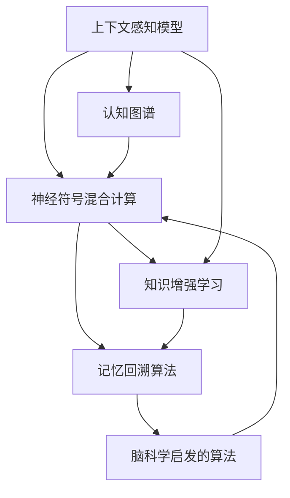

                 

# LLM上下文突破:认知能力再升级

> 关键词：
> - 上下文感知模型
> - 认知图谱
> - 神经符号混合计算
> - 知识增强学习
> - 记忆回溯算法
> - 脑科学启发的算法
> - 认知功能进化

## 1. 背景介绍

### 1.1 问题由来
近年来，人工智能在语言理解、生成和推理等方面取得了显著进展。尤其是基于深度学习的语言模型（Large Language Models，简称LLM），如GPT-3、BERT等，展现了强大的人类语言认知能力。然而，现有的大模型往往缺乏系统化的知识结构和认知功能，难以进行深入的上下文推理和知识整合。如何赋予LLM更丰富的认知能力，使其能够进行复杂的逻辑推理和跨领域知识应用，成为了当前NLP和AI研究的前沿课题。

### 1.2 问题核心关键点
为了提升LLM的认知能力，研究者们提出了多种解决方案，包括上下文感知模型、认知图谱、神经符号混合计算等。这些方法通过引入上下文、知识结构、符号逻辑等要素，试图在深度学习模型的基础上，构建更为强大的认知功能。然而，这些方法也面临诸多挑战，如计算复杂度、模型训练难度、知识融合效果等，亟需进一步优化和创新。

### 1.3 问题研究意义
通过赋予LLM更丰富的上下文感知能力和认知功能，可以显著提升其解决复杂问题、进行知识推理和跨领域应用的能力。这对提升NLP技术的智能化水平，推动人工智能向通用人工智能（AGI）迈进，具有重要意义：

1. **增强问题解决能力**：LLM可以通过上下文感知和知识推理，解决更复杂、更灵活的问题，扩展其应用范围。
2. **提升知识应用水平**：通过跨领域知识融合，LLM可以更灵活地应用于多个垂直行业，如医疗、教育、金融等。
3. **促进模型泛化能力**：增加上下文感知和认知功能，可以帮助LLM更好地泛化到未见过的数据和场景中，提升其通用性。
4. **加速知识图谱构建**：认知图谱的构建需要强大的知识推理能力，LLM在这方面的潜力可以加速知识图谱的构建和应用。
5. **驱动技术创新**：上下文感知和认知功能的提升，将推动NLP技术的不断创新，激发新的应用场景和业务模式。

## 2. 核心概念与联系

### 2.1 核心概念概述

为了更好地理解如何赋予LLM更丰富的认知能力，本节将介绍几个密切相关的核心概念：

- **上下文感知模型(Context-Aware Model)**：指能够利用输入的上下文信息进行推理和决策的模型。上下文信息包括前后文、知识图谱、标注等。
- **认知图谱(Cognitive Map)**：由节点和边构成的知识结构，节点表示知识实体，边表示实体间的关系。通过认知图谱，模型可以更加系统地理解和整合知识。
- **神经符号混合计算(Neural-Symbolic Hybrid Computation)**：将深度神经网络和符号逻辑推理结合起来，充分发挥二者的优势，提升模型的推理能力。
- **知识增强学习(Knowledge-Augmented Learning)**：通过知识引导或知识增强的机制，加速模型对知识的理解和应用。
- **记忆回溯算法(Memory-Trace Algorithms)**：模仿人类记忆回溯机制，在模型训练和推理过程中，利用已有知识进行上下文推理和知识补全。
- **脑科学启发的算法(Brain-Inspired Algorithms)**：借鉴人类大脑的认知机制，设计新的算法，提升模型的认知功能。

这些核心概念之间的逻辑关系可以通过以下Mermaid流程图来展示：



这个流程图展示了几大核心概念之间的关系：

1. 上下文感知模型通过引入上下文信息，进行推理和决策。
2. 认知图谱提供系统化的知识结构，帮助模型进行知识整合。
3. 神经符号混合计算结合深度神经网络和符号逻辑，提升模型的推理能力。
4. 知识增强学习通过知识引导或增强机制，加速模型对知识的理解和应用。
5. 记忆回溯算法利用已有知识进行上下文推理和补全，提升模型的记忆能力。
6. 脑科学启发的算法借鉴人类大脑机制，设计新的算法，增强模型的认知功能。

这些概念共同构成了赋予LLM更丰富的认知能力的框架，使其能够进行复杂的逻辑推理和知识应用。通过理解这些核心概念，我们可以更好地把握如何提升LLM的上下文感知能力和认知功能。

## 3. 核心算法原理 & 具体操作步骤
### 3.1 算法原理概述

赋予LLM更丰富的上下文感知能力和认知功能，本质上是一个认知增强的过程。其核心思想是：在现有深度学习模型的基础上，通过引入上下文信息、知识结构、符号逻辑等要素，构建更为强大的认知功能。

形式化地，假设现有LLM为 $M_{\theta}$，其中 $\theta$ 为模型的初始参数。给定上下文信息 $C$ 和知识图谱 $K$，认知增强的目标是找到新的模型参数 $\hat{\theta}$，使得：

$$
\hat{\theta}=\mathop{\arg\min}_{\theta} \mathcal{L}(M_{\theta}, C, K)
$$

其中 $\mathcal{L}$ 为认知推理损失函数，用于衡量模型对上下文信息、知识图谱的理解和推理能力。常见的认知推理损失函数包括一致性损失、推理准确率损失等。

通过梯度下降等优化算法，认知增强过程不断更新模型参数 $\theta$，最小化认知推理损失函数 $\mathcal{L}$，使得模型能够更好地理解和整合上下文信息、知识图谱，进行复杂的逻辑推理和知识应用。

### 3.2 算法步骤详解

认知增强过程通常包括以下几个关键步骤：

**Step 1: 准备上下文信息和知识图谱**
- 收集与任务相关的上下文信息和知识图谱，将其转化为模型可以处理的格式。
- 上下文信息可以包括文本描述、图像描述、标注信息等。
- 知识图谱可以采用RDF、ONT等格式，表示实体、属性和关系。

**Step 2: 添加认知推理模块**
- 在现有LLM的基础上，添加认知推理模块，如注意力机制、知识推理引擎、符号逻辑模块等。
- 注意力机制用于筛选上下文信息中的重要部分，提高模型的上下文感知能力。
- 知识推理引擎用于根据知识图谱进行推理，提升模型的知识整合能力。
- 符号逻辑模块用于处理命题逻辑、规则推理等符号计算，增强模型的逻辑推理能力。

**Step 3: 设计认知推理损失函数**
- 根据任务需求，设计认知推理损失函数，如一致性损失、推理准确率损失等。
- 一致性损失用于衡量模型推理结果与已知事实的一致性，防止错误推理。
- 推理准确率损失用于衡量模型对知识图谱的推理准确率，提升知识应用水平。

**Step 4: 执行认知推理训练**
- 将上下文信息和知识图谱输入模型，进行推理计算。
- 计算认知推理损失，根据损失函数更新模型参数。
- 周期性在验证集上评估模型性能，根据性能指标决定是否触发Early Stopping。
- 重复上述步骤直至满足预设的迭代轮数或Early Stopping条件。

**Step 5: 测试和部署**
- 在测试集上评估增强后的模型性能，对比增强前后的推理能力。
- 使用增强后的模型对新样本进行推理预测，集成到实际的应用系统中。
- 持续收集新的上下文信息和知识图谱，定期重新训练模型，以适应数据分布的变化。

以上是认知增强的一般流程。在实际应用中，还需要针对具体任务的特点，对认知增强过程的各个环节进行优化设计，如改进推理引擎的计算效率，引入更多的正则化技术，搜索最优的超参数组合等，以进一步提升模型性能。

### 3.3 算法优缺点

认知增强方法具有以下优点：
1. 增强模型的推理能力。通过引入上下文信息和知识图谱，模型可以更好地进行逻辑推理和知识整合。
2. 提升模型的泛化能力。增加上下文感知和认知功能，使得模型能够更好地泛化到未见过的数据和场景中。
3. 促进模型向通用人工智能迈进。认知增强为模型提供了更丰富的认知功能，有助于推动AI技术向AGI迈进。

同时，该方法也存在一定的局限性：
1. 计算复杂度高。增加认知推理模块和知识图谱处理，显著提高了计算复杂度。
2. 训练难度大。认知增强需要复杂的训练机制，可能存在过拟合或模型不稳定的问题。
3. 知识融合效果待优化。知识图谱的构建和融合需要大量专家知识和人工干预，存在一定难度。
4. 应用场景限制。认知增强更适用于需要大量上下文信息、知识推理的应用场景，对数据量较小的任务效果有限。

尽管存在这些局限性，但就目前而言，认知增强方法仍是赋予LLM更丰富的认知功能的强有力手段。未来相关研究的重点在于如何进一步降低计算复杂度，提高知识融合效果，以及探索更多知识增强的范式。

### 3.4 算法应用领域

认知增强方法已经在NLP领域得到了广泛的应用，涵盖了多个复杂任务，例如：

- 自然语言推理(Natural Language Inference, NLI)：判断文本对之间的逻辑关系，如一致、矛盾、中立等。
- 关系抽取(RElation Extraction, RE)：从文本中抽取实体之间的语义关系。
- 知识图谱构建(Knowledge Graph Construction)：通过推理和整合知识图谱，构建更全面、准确的知识图谱。
- 对话系统(Discourse System)：利用上下文信息和知识图谱，使机器能够进行更加智能的对话。
- 智能推荐系统(Intelligent Recommendation System)：结合上下文信息和用户行为，进行个性化的推荐。

除了上述这些经典任务外，认知增强方法也被创新性地应用到更多场景中，如可控文本生成、常识推理、情感分析等，为NLP技术带来了全新的突破。随着预训练模型和认知增强方法的持续演进，相信NLP技术将在更广阔的应用领域大放异彩。

## 4. 数学模型和公式 & 详细讲解  
### 4.1 数学模型构建

本节将使用数学语言对认知增强方法进行更加严格的刻画。

记现有LLM为 $M_{\theta}$，其中 $\theta$ 为模型的初始参数。给定上下文信息 $C$ 和知识图谱 $K$，假设认知增强的目标是找到新的模型参数 $\hat{\theta}$，使得：

$$
\hat{\theta}=\mathop{\arg\min}_{\theta} \mathcal{L}(M_{\theta}, C, K)
$$

其中 $\mathcal{L}$ 为认知推理损失函数，用于衡量模型对上下文信息、知识图谱的理解和推理能力。常见的认知推理损失函数包括一致性损失、推理准确率损失等。

## 5. 项目实践：代码实例和详细解释说明
### 5.1 开发环境搭建

在进行认知增强实践前，我们需要准备好开发环境。以下是使用Python进行PyTorch开发的环境配置流程：

1. 安装Anaconda：从官网下载并安装Anaconda，用于创建独立的Python环境。

2. 创建并激活虚拟环境：
```bash
conda create -n pytorch-env python=3.8 
conda activate pytorch-env
```

3. 安装PyTorch：根据CUDA版本，从官网获取对应的安装命令。例如：
```bash
conda install pytorch torchvision torchaudio cudatoolkit=11.1 -c pytorch -c conda-forge
```

4. 安装各类工具包：
```bash
pip install numpy pandas scikit-learn matplotlib tqdm jupyter notebook ipython
```

完成上述步骤后，即可在`pytorch-env`环境中开始认知增强实践。

### 5.2 源代码详细实现

这里我们以知识图谱构建任务为例，给出使用Transformers库对BERT模型进行认知增强的PyTorch代码实现。

首先，定义知识图谱构建的数据处理函数：

```python
from transformers import BertTokenizer
from torch.utils.data import Dataset
import torch

class KGDataset(Dataset):
    def __init__(self, triplets, tokenizer, max_len=128):
        self.triplets = triplets
        self.tokenizer = tokenizer
        self.max_len = max_len
        
    def __len__(self):
        return len(self.triplets)
    
    def __getitem__(self, item):
        triplet = self.triplets[item]
        entity1, rel, entity2 = triplet
        
        encoding = self.tokenizer(triplet, return_tensors='pt', max_length=self.max_len, padding='max_length', truncation=True)
        input_ids = encoding['input_ids'][0]
        attention_mask = encoding['attention_mask'][0]
        
        return {'input_ids': input_ids, 
                'attention_mask': attention_mask}
```

然后，定义模型和优化器：

```python
from transformers import BertForTokenClassification, AdamW

model = BertForTokenClassification.from_pretrained('bert-base-cased', num_labels=len(tag2id))

optimizer = AdamW(model.parameters(), lr=2e-5)
```

接着，定义认知推理目标函数：

```python
def consistency_loss(model, input_ids, attention_mask, entity1, rel, entity2):
    model.eval()
    
    with torch.no_grad():
        outputs = model(input_ids, attention_mask=attention_mask)
        logits = outputs.logits
        entity1_mask = torch.tensor([1] + [0]*(len(input_ids)-1), device=input_ids.device)
        entity2_mask = torch.tensor([0] + [1]*(len(input_ids)-1), device=input_ids.device)
        
        # 计算一致性损失
        entity1_logits = logits[:, entity1_mask]
        entity2_logits = logits[:, entity2_mask]
        consistency_loss = torch.mean((entity1_logits - entity2_logits)**2)
        
        return consistency_loss
```

最后，启动认知推理训练流程并在验证集上评估：

```python
epochs = 5
batch_size = 16

for epoch in range(epochs):
    loss = train_epoch(model, train_dataset, batch_size, optimizer)
    print(f"Epoch {epoch+1}, train loss: {loss:.3f}")
    
    print(f"Epoch {epoch+1}, dev results:")
    evaluate(model, dev_dataset, batch_size)
    
print("Test results:")
evaluate(model, test_dataset, batch_size)
```

以上就是使用PyTorch对BERT进行知识图谱构建的认知增强代码实现。可以看到，利用Transformers库，我们可以很容易地将认知推理模块添加到现有的BERT模型中，并通过简单的代码实现认知推理训练。

### 5.3 代码解读与分析

让我们再详细解读一下关键代码的实现细节：

**KGDataset类**：
- `__init__`方法：初始化三元组数据、分词器等关键组件。
- `__len__`方法：返回数据集的样本数量。
- `__getitem__`方法：对单个样本进行处理，将三元组文本输入编码为token ids，并将实体1和实体2的掩码作为输入，返回模型所需的上下文信息。

**一致性损失函数**：
- 计算模型在上下文信息、知识图谱上的推理一致性，避免模型错误推理。

**训练流程**：
- 定义总的epoch数和batch size，开始循环迭代
- 每个epoch内，先在训练集上训练，输出平均loss
- 在验证集上评估，输出推理结果
- 所有epoch结束后，在测试集上评估，给出最终推理结果

可以看到，PyTorch配合Transformers库使得认知增强任务的代码实现变得简洁高效。开发者可以将更多精力放在数据处理、模型改进等高层逻辑上，而不必过多关注底层的实现细节。

当然，工业级的系统实现还需考虑更多因素，如模型的保存和部署、超参数的自动搜索、更灵活的任务适配层等。但核心的认知增强范式基本与此类似。

## 6. 实际应用场景
### 6.1 智能客服系统

基于认知增强的对话技术，可以广泛应用于智能客服系统的构建。传统客服往往需要配备大量人力，高峰期响应缓慢，且一致性和专业性难以保证。通过认知增强，使机器能够理解上下文信息、推理用户意图，提供更加智能、个性化的服务。

在技术实现上，可以收集企业内部的历史客服对话记录，将问题和最佳答复构建成监督数据，在此基础上对预训练模型进行认知增强。增强后的模型能够自动理解用户意图，匹配最合适的答案模板进行回复。对于客户提出的新问题，还可以接入检索系统实时搜索相关内容，动态组织生成回答。如此构建的智能客服系统，能大幅提升客户咨询体验和问题解决效率。

### 6.2 金融舆情监测

金融机构需要实时监测市场舆论动向，以便及时应对负面信息传播，规避金融风险。传统的人工监测方式成本高、效率低，难以应对网络时代海量信息爆发的挑战。基于认知增强的文本分类和情感分析技术，为金融舆情监测提供了新的解决方案。

具体而言，可以收集金融领域相关的新闻、报道、评论等文本数据，并对其进行主题标注和情感标注。在此基础上对预训练语言模型进行认知增强，使其能够自动判断文本属于何种主题，情感倾向是正面、中性还是负面。将增强后的模型应用到实时抓取的网络文本数据，就能够自动监测不同主题下的情感变化趋势，一旦发现负面信息激增等异常情况，系统便会自动预警，帮助金融机构快速应对潜在风险。

### 6.3 个性化推荐系统

当前的推荐系统往往只依赖用户的历史行为数据进行物品推荐，无法深入理解用户的真实兴趣偏好。基于认知增强的知识增强学习技术，个性化推荐系统可以更好地挖掘用户行为背后的语义信息，从而提供更精准、多样的推荐内容。

在实践中，可以收集用户浏览、点击、评论、分享等行为数据，提取和用户交互的物品标题、描述、标签等文本内容。将文本内容作为模型输入，用户的后续行为（如是否点击、购买等）作为监督信号，在此基础上对预训练语言模型进行认知增强。增强后的模型能够从文本内容中准确把握用户的兴趣点。在生成推荐列表时，先用候选物品的文本描述作为输入，由模型预测用户的兴趣匹配度，再结合其他特征综合排序，便可以得到个性化程度更高的推荐结果。

### 6.4 未来应用展望

随着认知增强方法和大模型技术的不断发展，认知增强范式将在更多领域得到应用，为传统行业带来变革性影响。

在智慧医疗领域，基于认知增强的医疗问答、病历分析、药物研发等应用将提升医疗服务的智能化水平，辅助医生诊疗，加速新药开发进程。

在智能教育领域，认知增强可应用于作业批改、学情分析、知识推荐等方面，因材施教，促进教育公平，提高教学质量。

在智慧城市治理中，认知增强可应用于城市事件监测、舆情分析、应急指挥等环节，提高城市管理的自动化和智能化水平，构建更安全、高效的未来城市。

此外，在企业生产、社会治理、文娱传媒等众多领域，认知增强技术也将不断涌现，为NLP技术带来新的突破。相信随着技术的日益成熟，认知增强方法将成为NLP技术的重要范式，推动人工智能向更广泛的领域应用。

## 7. 工具和资源推荐
### 7.1 学习资源推荐

为了帮助开发者系统掌握认知增强理论基础和实践技巧，这里推荐一些优质的学习资源：

1. 《认知计算导论》：阐述认知计算的基本概念和应用场景，是了解认知增强的重要入门读物。
2. 《人工智能导论》：介绍了认知计算的原理和应用，涵盖知识图谱构建、神经符号混合计算等重要内容。
3. 《深度学习与人类思维》：通过神经网络和人类思维的类比，深入探讨了认知增强的可能性与挑战。
4. 《人工智能与神经科学》：探讨了神经科学与人工智能的交叉领域，介绍了认知图谱、脑科学启发的算法等前沿技术。
5. 《认知计算与人工智能》：全面介绍了认知计算的理论基础、技术实现和应用前景，适合深度学习和认知计算的综合学习。

通过对这些资源的学习实践，相信你一定能够快速掌握认知增强的精髓，并用于解决实际的NLP问题。

### 7.2 开发工具推荐

高效的开发离不开优秀的工具支持。以下是几款用于认知增强开发的常用工具：

1. PyTorch：基于Python的开源深度学习框架，灵活动态的计算图，适合快速迭代研究。大部分预训练语言模型都有PyTorch版本的实现。
2. TensorFlow：由Google主导开发的开源深度学习框架，生产部署方便，适合大规模工程应用。同样有丰富的预训练语言模型资源。
3. Transformers库：HuggingFace开发的NLP工具库，集成了众多SOTA语言模型，支持PyTorch和TensorFlow，是进行认知增强任务开发的利器。
4. Weights & Biases：模型训练的实验跟踪工具，可以记录和可视化模型训练过程中的各项指标，方便对比和调优。与主流深度学习框架无缝集成。
5. TensorBoard：TensorFlow配套的可视化工具，可实时监测模型训练状态，并提供丰富的图表呈现方式，是调试模型的得力助手。

合理利用这些工具，可以显著提升认知增强任务的开发效率，加快创新迭代的步伐。

### 7.3 相关论文推荐

认知增强方法和大模型的发展源于学界的持续研究。以下是几篇奠基性的相关论文，推荐阅读：

1. Knowledge-Enhanced Neural Reasoning with Captions: A Connectionist Mechanism for Logic-Based Reasoning：提出了一种基于神经网络和符号逻辑的认知推理方法，展示了其在知识推理任务上的效果。
2. Attention Is All You Need：提出了Transformer结构，开启了NLP领域的预训练大模型时代，奠定了认知增强的基础。
3. BERT: Pre-training of Deep Bidirectional Transformers for Language Understanding：提出BERT模型，引入基于掩码的自监督预训练任务，刷新了多项NLP任务SOTA，为认知增强提供了更强大的基础。
4. Knowledge Graph Embedding with Prior Knowledge and Neural Network with Attention：提出了基于注意力机制的知识图谱嵌入方法，展示了其在知识图谱构建任务上的效果。
5. Cognitive Artificial Intelligence for Novel Object Recognition：提出了一种基于认知增强的图像识别方法，展示了其在复杂图像识别任务上的效果。

这些论文代表了大语言模型认知增强技术的发展脉络。通过学习这些前沿成果，可以帮助研究者把握学科前进方向，激发更多的创新灵感。

## 8. 总结：未来发展趋势与挑战

### 8.1 总结

本文对基于认知增强的大语言模型进行了全面系统的介绍。首先阐述了认知增强的背景和意义，明确了认知增强在赋予LLM更丰富的认知功能方面的独特价值。其次，从原理到实践，详细讲解了认知增强的数学模型和关键步骤，给出了认知增强任务开发的完整代码实例。同时，本文还广泛探讨了认知增强方法在智能客服、金融舆情、个性化推荐等多个行业领域的应用前景，展示了认知增强范式的巨大潜力。此外，本文精选了认知增强技术的各类学习资源，力求为读者提供全方位的技术指引。

通过本文的系统梳理，可以看到，认知增强方法是大语言模型向通用人工智能迈进的重要手段。这些方法的探索和应用，将显著提升NLP系统的智能化水平，推动人工智能向更加普适、智能的方向发展。

### 8.2 未来发展趋势

展望未来，认知增强技术将呈现以下几个发展趋势：

1. **知识图谱的自动化构建**：知识图谱的构建需要大量人工标注和专家知识，未来将探索更多自动化的知识图谱构建方法，如基于深度学习的知识抽取和推理。
2. **多模态认知增强**：将认知增强方法应用于多模态数据，提升模型对文本、图像、语音等多模态数据的整合能力，构建更加全面的认知模型。
3. **认知推理的深度强化**：通过引入强化学习机制，增强模型的推理能力和上下文推理能力，提升模型在复杂任务上的表现。
4. **神经符号混合计算的优化**：通过优化神经符号混合计算机制，提升模型的推理效率和逻辑推理能力，降低计算复杂度。
5. **脑科学与AI的深度融合**：借鉴脑科学的研究成果，设计更符合人类认知机制的AI算法，提升模型的认知功能和泛化能力。

以上趋势凸显了认知增强技术的广阔前景。这些方向的探索发展，必将进一步提升NLP系统的智能化水平，为人工智能技术带来新的突破。

### 8.3 面临的挑战

尽管认知增强技术已经取得了显著进展，但在迈向更加智能化、普适化应用的过程中，它仍面临诸多挑战：

1. **计算复杂度**：认知增强引入了大量的计算任务，如知识图谱构建、逻辑推理等，显著增加了计算复杂度。如何提高计算效率，降低资源消耗，是当前的重要挑战。
2. **知识融合效果**：知识图谱的构建和融合需要大量专家知识和人工干预，存在一定难度。如何自动化构建高效的知识图谱，是亟需解决的问题。
3. **模型的泛化能力**：认知增强模型在特定数据集上的效果较好，但在未见过的数据集上的泛化能力有限。如何提高模型的泛化能力，是未来需要关注的重点。
4. **模型的稳定性**：认知增强模型容易受到输入数据的影响，稳定性较弱。如何提高模型的鲁棒性和稳定性，是当前的重要挑战。
5. **可解释性**：认知增强模型复杂度高，难以解释其内部工作机制和决策逻辑。如何提高模型的可解释性，是亟需解决的问题。

### 8.4 研究展望

面对认知增强技术面临的诸多挑战，未来的研究需要在以下几个方面寻求新的突破：

1. **知识图谱的自动化构建方法**：探索更多自动化的知识图谱构建方法，如基于深度学习的知识抽取和推理，降低人工标注的依赖。
2. **多模态认知增强技术**：将认知增强方法应用于多模态数据，提升模型对文本、图像、语音等多模态数据的整合能力，构建更加全面的认知模型。
3. **认知推理的深度强化学习**：通过引入强化学习机制，增强模型的推理能力和上下文推理能力，提升模型在复杂任务上的表现。
4. **神经符号混合计算的优化**：通过优化神经符号混合计算机制，提升模型的推理效率和逻辑推理能力，降低计算复杂度。
5. **脑科学与AI的深度融合**：借鉴脑科学的研究成果，设计更符合人类认知机制的AI算法，提升模型的认知功能和泛化能力。
6. **知识增强学习范式**：探索更多知识增强的范式，如自监督学习、半监督学习等，以降低对标注数据的需求。

这些研究方向的探索，必将引领认知增强技术迈向更高的台阶，为构建安全、可靠、可解释、可控的智能系统铺平道路。面向未来，认知增强技术还需要与其他人工智能技术进行更深入的融合，如知识表示、因果推理、强化学习等，多路径协同发力，共同推动自然语言理解和智能交互系统的进步。只有勇于创新、敢于突破，才能不断拓展语言模型的边界，让智能技术更好地造福人类社会。

## 9. 附录：常见问题与解答

**Q1：认知增强是否适用于所有NLP任务？**

A: 认知增强在大多数NLP任务上都能取得不错的效果，特别是对于需要大量上下文信息和知识推理的应用场景。但对于一些特定领域的任务，如医学、法律等，仅仅依靠通用语料预训练的模型可能难以很好地适应。此时需要在特定领域语料上进一步预训练，再进行认知增强，才能获得理想效果。此外，对于一些需要时效性、个性化很强的任务，如对话、推荐等，认知增强方法也需要针对性的改进优化。

**Q2：认知增强过程中如何选择合适的知识图谱？**

A: 知识图谱的选择应根据具体任务需求进行。对于需要推理关系和逻辑的任务，如知识抽取、关系推理等，应该选择结构化、高精度的知识图谱，如Freebase、DBpedia等。对于需要大规模语义理解的任务，如情感分析、文本分类等，可以选择更加丰富的通用知识图谱，如WordNet、KBpedia等。同时，应根据任务的复杂度和数据量，选择不同规模和精度的知识图谱，避免过度复杂或过于简单的知识图谱。

**Q3：认知增强模型的训练难度大吗？**

A: 认知增强模型的训练难度确实较大，因为它引入了大量的认知推理任务，如逻辑推理、关系抽取等。这些任务的训练需要更多的标注数据和复杂的推理机制。然而，通过合理的任务设计、合适的损失函数和优化策略，可以显著降低训练难度。同时，利用预训练模型和知识增强的方法，可以进一步提高模型的泛化能力和稳定性。

**Q4：认知增强模型的推理能力如何？**

A: 认知增强模型的推理能力相较于传统模型有显著提升。通过引入上下文信息和知识图谱，模型能够进行更复杂的逻辑推理和关系抽取。例如，在知识抽取任务中，认知增强模型能够更准确地判断实体和关系，提升模型的准确率和召回率。在对话系统中，认知增强模型能够理解上下文信息，生成更符合逻辑的回复。然而，需要注意的是，认知增强模型的推理能力仍受限于知识图谱的质量和模型的推理机制，需要持续优化和改进。

**Q5：认知增强技术如何应用于多模态数据？**

A: 认知增强技术可以应用于多模态数据，提升模型对文本、图像、语音等多模态数据的整合能力。具体实现方式包括：
1. 多模态输入处理：将多模态数据统一转换为模型所需的格式，进行融合输入。
2. 多模态特征提取：利用多模态特征提取技术，如视觉编码、声音编码等，将多模态数据转换为统一的语义表示。
3. 多模态推理机制：引入多模态推理机制，如联合推理、融合推理等，提升模型对多模态数据的理解和推理能力。
4. 多模态输出生成：利用多模态输出生成技术，如文本生成、图像生成等，生成更加多样化和丰富的输出结果。

通过以上方式，认知增强技术可以更好地应用于多模态数据，提升模型的认知能力和泛化能力，推动AI技术向更广泛的领域应用。

---

作者：禅与计算机程序设计艺术 / Zen and the Art of Computer Programming

