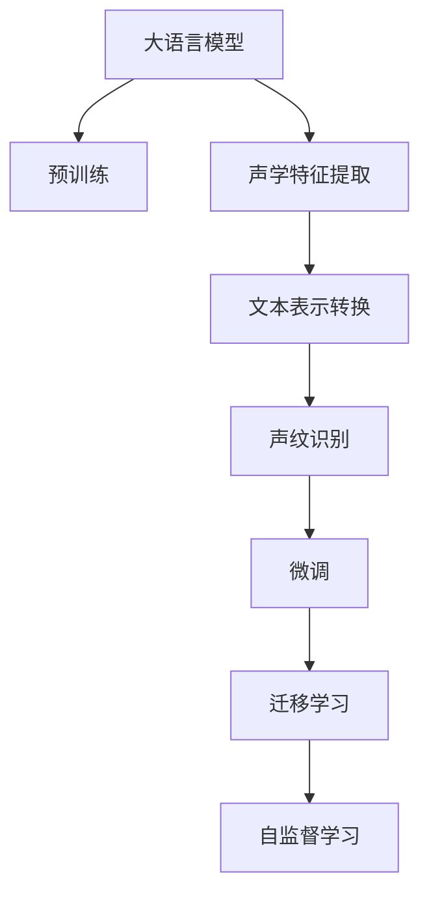

                 

# LLM在声纹识别任务中的优化思路

## 1. 背景介绍

### 1.1 问题由来
语音识别技术的发展极大推动了人工智能在智能家居、智能客服、语音翻译、语音搜索等诸多应用场景中的普及。然而，传统的基于声学模型的语音识别系统往往无法抵御说话人攻击，如改头换面攻击、合成攻击等。例如，当攻击者使用与原始说话人相同但非该说话人声纹的数据替换原始音频样本时，语音识别系统难以察觉并排除干扰，从而可能产生误判，影响用户体验。

声纹识别（Speaker Recognition），也称为说话人识别，是指通过说话人的语音信号提取出说话人的特征，并将其与数据库中的样本进行比对，从而识别出说话人的身份。相对于传统的声学模型，声纹识别技术不仅可以抵御说话人攻击，而且能够识别同源但不同说话人之间的细微差别，如声音变化、口音差异等。因此，声纹识别在身份认证、安全监控等领域具有重要应用价值。

近年来，基于深度神经网络的大规模语音模型在声纹识别领域表现出色，如Deep Speaker、Wav2Vec2、Deformable Wav2Vec2等。这些模型通过大规模无标签语音数据的自监督预训练，学到了丰富的声学特征，并通过微调等方式获得针对特定声纹识别任务的优异性能。

### 1.2 问题核心关键点
声纹识别中，主要需要解决以下几个关键问题：

1. **特征提取与表示**：如何将原始音频信号转换为能够描述说话人身份的特征向量。
2. **说话人识别模型**：基于提取出的特征向量，设计识别模型以区分不同说话人。
3. **模型鲁棒性**：声纹识别模型应当具有鲁棒性，能够抵御说话人攻击和环境噪声干扰。
4. **识别准确性与泛化能力**：在实际应用中，模型不仅要识别训练数据中的说话人，还应当对新未见过的说话人具有较好的泛化能力。
5. **模型部署与优化**：在保证性能的前提下，如何使模型部署灵活、推理速度快，以便于实际应用。

声纹识别任务的核心在于将声学特征转换为文本特征，再利用文本分类等方法对说话人进行识别。本文重点探讨如何在声纹识别任务中使用大语言模型（LLM）进行优化。

## 2. 核心概念与联系

### 2.1 核心概念概述

为更好地理解大语言模型在声纹识别任务中的应用，本节将介绍几个密切相关的核心概念：

- **大语言模型（Large Language Model, LLM）**：以自回归（如GPT）或自编码（如BERT）模型为代表的大规模预训练语言模型。通过在大规模无标签文本语料上进行预训练，学习到了丰富的语言知识和常识，具备强大的语言理解和生成能力。

- **声学特征（Acoustic Feature）**：通过音频信号处理技术提取的用于描述说话人声学特征的信息，如MFCC、Mel谱图、波形等。

- **声纹识别（Speaker Recognition）**：通过提取说话人声学特征，并将其转换为文本表示，利用文本分类等方法对说话人进行识别。

- **微调（Fine-tuning）**：在大规模预训练模型的基础上，使用下游任务的少量标注数据，通过有监督地训练来优化模型在该任务上的性能。

- **迁移学习（Transfer Learning）**：将一个领域学习到的知识，迁移应用到另一个不同但相关的领域的学习范式。在声纹识别中，通过预训练模型可以提升模型泛化能力，适应不同说话人的识别。

- **自监督学习（Self-supervised Learning）**：在没有标签数据的情况下，通过构建自监督任务，自动学习模型参数，提升模型的表示能力。

这些核心概念之间的逻辑关系可以通过以下Mermaid流程图来展示：



这个流程图展示了大语言模型在声纹识别中的核心概念及其之间的关系：

1. 大语言模型通过预训练获得基础能力。
2. 声学特征提取将音频信号转换为可计算的声学特征。
3. 文本表示转换将声学特征转换为可被大模型处理的文本表示。
4. 声纹识别利用文本分类等方法对说话人进行识别。
5. 微调通过少量标注数据优化模型。
6. 迁移学习将预训练知识应用于下游任务。
7. 自监督学习在没有标签数据的情况下进行模型训练。

这些概念共同构成了大语言模型在声纹识别任务中的应用框架，使其能够在不同声纹识别任务中发挥强大的作用。

## 3. 核心算法原理 & 具体操作步骤

### 3.1 算法原理概述

在声纹识别中，大语言模型主要用于文本表示转换和说话人识别。其核心思想是：将声学特征转换为文本表示，再利用大模型对文本进行分类，识别说话人身份。这种转换通常包括两个步骤：特征提取和文本表示转换。

**特征提取**：将原始音频信号转换为能够描述说话人身份的声学特征。常见的声学特征提取技术包括MFCC、Mel谱图、波形等。

**文本表示转换**：将提取出的声学特征转换为文本表示，使大模型能够进行进一步的文本处理。文本表示转换通常利用深度神经网络，如CNN、RNN、Transformer等模型，对声学特征进行编码和映射，得到文本表示。

基于文本表示的声纹识别模型，通常采用深度神经网络，如CNN、RNN、Transformer等模型，对文本表示进行分类，从而识别说话人。常用的文本表示转换模型包括Wav2Vec2、Deformable Wav2Vec2、Deep Voice 3等。

### 3.2 算法步骤详解

基于大语言模型在声纹识别任务中的应用，通常包括以下几个关键步骤：

**Step 1: 准备预训练模型和数据集**
- 选择合适的预训练语言模型 $M_{\theta}$ 作为初始化参数，如 BERT、GPT 等。
- 准备声纹识别任务的标注数据集 $D=\{(x_i,y_i)\}_{i=1}^N$，其中 $x_i$ 为音频样本，$y_i$ 为对应的说话人标签。

**Step 2: 添加任务适配层**
- 根据任务类型，在预训练模型顶层设计合适的输出层和损失函数。
- 对于分类任务，通常在顶层添加线性分类器和交叉熵损失函数。
- 对于生成任务，通常使用语言模型的解码器输出概率分布，并以负对数似然为损失函数。

**Step 3: 设置微调超参数**
- 选择合适的优化算法及其参数，如 AdamW、SGD 等，设置学习率、批大小、迭代轮数等。
- 设置正则化技术及强度，包括权重衰减、Dropout、Early Stopping等。
- 确定冻结预训练参数的策略，如仅微调顶层，或全部参数都参与微调。

**Step 4: 执行梯度训练**
- 将训练集数据分批次输入模型，前向传播计算损失函数。
- 反向传播计算参数梯度，根据设定的优化算法和学习率更新模型参数。
- 周期性在验证集上评估模型性能，根据性能指标决定是否触发 Early Stopping。
- 重复上述步骤直到满足预设的迭代轮数或 Early Stopping 条件。

**Step 5: 测试和部署**
- 在测试集上评估微调后模型 $M_{\hat{\theta}}$ 的性能，对比微调前后的精度提升。
- 使用微调后的模型对新样本进行推理预测，集成到实际的应用系统中。
- 持续收集新的数据，定期重新微调模型，以适应数据分布的变化。

以上是基于大语言模型在声纹识别任务中的应用的一般流程。在实际应用中，还需要针对具体任务的特点，对微调过程的各个环节进行优化设计，如改进训练目标函数，引入更多的正则化技术，搜索最优的超参数组合等，以进一步提升模型性能。

### 3.3 算法优缺点

基于大语言模型在声纹识别任务中的应用，具有以下优点：

- **泛化能力**：大语言模型能够利用海量的无标签数据进行自监督预训练，学到了丰富的语言表示能力，提升了声纹识别模型的泛化能力。
- **高效适应**：大语言模型通过微调可以快速适应特定声纹识别任务，提升了模型在新任务上的性能。
- **灵活性**：大语言模型通过添加不同的任务适配层，可以灵活地应用于各种声纹识别任务，如说话人识别、说话人验证等。

然而，大语言模型在声纹识别任务中也有一些局限性：

- **计算资源需求高**：大语言模型通常参数量巨大，计算资源需求较高，导致模型训练和推理速度较慢。
- **模型复杂度高**：大语言模型通常结构复杂，在声纹识别任务中可能导致推理时间较长，部署成本较高。
- **数据需求大**：虽然大语言模型可以通过自监督预训练提升泛化能力，但在实际应用中仍然需要足够的标注数据进行微调，才能达到理想的识别效果。

尽管存在这些局限性，但就目前而言，基于大语言模型的声纹识别方法在诸多应用场景中已经取得了显著的成效，成为声纹识别领域的重要手段。

### 3.4 算法应用领域

基于大语言模型在声纹识别任务中的应用，已经在智能家居、智能客服、安全监控、金融交易等领域得到了广泛的应用，覆盖了几乎所有常见的声纹识别应用场景：

- **智能家居**：通过声纹识别技术，智能家居系统可以自动识别家庭成员的身份，并根据不同身份的家庭成员执行相应的操作。例如，当孩子回家时，系统会自动播放动画片，而父母则可接听电话。
- **智能客服**：在智能客服系统中，声纹识别技术可以帮助自动识别客户的身份，并根据客户的历史语音记录进行个性化服务。例如，当客户进行电话咨询时，系统会记录客户的声音特征，并在下次通话时自动识别客户身份。
- **安全监控**：声纹识别技术在安全监控领域得到了广泛应用。例如，在银行等重要场所，可以通过声纹识别技术识别出客户的身份，并根据客户身份进行相应的操作，如开通账户、办理业务等。
- **金融交易**：在金融交易中，声纹识别技术可以用于身份验证和交易授权。例如，客户在进行股票交易时，可以通过声纹识别技术验证身份，并授权进行交易。
- **隐私保护**：声纹识别技术也可以用于隐私保护。例如，当客户在银行等场所进行身份验证时，可以通过声纹识别技术识别客户的身份，并在客户离开后自动删除客户的声音记录，保护客户隐私。

除了上述这些经典应用外，声纹识别技术还可以创新性地应用于更多场景中，如语音助手、语音搜索、智能门锁等，为声纹识别技术带来了全新的突破。随着预训练模型和微调方法的不断进步，相信声纹识别技术将在更广阔的应用领域大放异彩。

## 4. 数学模型和公式 & 详细讲解 & 举例说明

### 4.1 数学模型构建

在声纹识别任务中，大语言模型主要用于文本表示转换和说话人识别。其核心思想是：将声学特征转换为文本表示，再利用大模型对文本进行分类，识别说话人身份。这种转换通常包括两个步骤：特征提取和文本表示转换。

**特征提取**：将原始音频信号转换为能够描述说话人身份的声学特征。常见的声学特征提取技术包括MFCC、Mel谱图、波形等。

**文本表示转换**：将提取出的声学特征转换为文本表示，使大模型能够进行进一步的文本处理。文本表示转换通常利用深度神经网络，如CNN、RNN、Transformer等模型，对声学特征进行编码和映射，得到文本表示。

基于文本表示的声纹识别模型，通常采用深度神经网络，如CNN、RNN、Transformer等模型，对文本表示进行分类，从而识别说话人。常用的文本表示转换模型包括Wav2Vec2、Deformable Wav2Vec2、Deep Voice 3等。

### 4.2 公式推导过程

以下我们以Wav2Vec2模型为例，推导其在声纹识别任务中的应用。

Wav2Vec2模型通过大规模无标签语音数据进行自监督预训练，学习到了丰富的声学表示能力。其核心在于将音频信号转换为MFCC特征，再通过卷积神经网络（CNN）和长短期记忆网络（LSTM）进行特征提取和映射，得到文本表示。Wav2Vec2模型的预训练目标函数为：

$$
\min_{\theta} \mathcal{L}_{\text{wav2vec2}}(\theta, \mathcal{D}_l)
$$

其中 $\theta$ 为模型参数，$\mathcal{D}_l$ 为自监督损失函数。在声纹识别任务中，通过在预训练模型上微调，将声学特征转换为文本表示，再利用大模型进行文本分类，得到说话人标签。微调的损失函数为：

$$
\mathcal{L}_{\text{fine-tune}} = \mathcal{L}_{\text{wav2vec2}} + \mathcal{L}_{\text{classifier}} + \mathcal{L}_{\text{regularization}}
$$

其中 $\mathcal{L}_{\text{classifier}}$ 为文本分类损失函数，$\mathcal{L}_{\text{regularization}}$ 为正则化损失函数。

### 4.3 案例分析与讲解

在实际应用中，Wav2Vec2模型通常先通过自监督预训练得到声学表示，再通过微调添加文本分类层。微调的目的是学习如何将声学表示转换为文本表示，并利用大模型进行文本分类。以下是一个简化的微调过程：

1. 加载预训练模型：
```python
from transformers import Wav2Vec2Model, Wav2Vec2Tokenizer
import torch

tokenizer = Wav2Vec2Tokenizer.from_pretrained('facebook/wav2vec2-base-960h')
model = Wav2Vec2Model.from_pretrained('facebook/wav2vec2-base-960h')

# 加载音频样本
audio_path = 'path/to/audio.wav'
wav = librosa.load(audio_path, sr=16000)[0]  # 加载16kHz的wav文件
input_values = tokenizer(audio_path, return_tensors='pt')['input_values']
```

2. 预处理音频样本：
```python
# 使用Wav2Vec2Model预处理音频样本
with torch.no_grad():
    log_mel_features = model(input_values).log_mel_spectrogram
```

3. 转换为MFCC特征：
```python
# 转换为MFCC特征
mfcc_features = feature_extraction.get_mfcc(log_mel_features)
```

4. 微调模型：
```python
from transformers import BertForSequenceClassification, BertTokenizer, AdamW

# 加载预训练BERT模型
model = BertForSequenceClassification.from_pretrained('bert-base-cased')
tokenizer = BertTokenizer.from_pretrained('bert-base-cased')

# 微调超参数
optimizer = AdamW(model.parameters(), lr=1e-5)
```

5. 训练模型：
```python
from transformers import Trainer, TrainingArguments

# 设置训练参数
training_args = TrainingArguments(
    output_dir="./results",
    evaluation_strategy="epoch",
    per_device_train_batch_size=16,
    per_device_eval_batch_size=16,
    num_train_epochs=5,
    logging_steps=500,
    save_steps=500,
    learning_rate=1e-5,
    weight_decay=0.01,
    evaluation_metrics=["acc"]
)

# 创建训练器
trainer = Trainer(
    model=model,
    args=training_args,
    train_dataset=train_dataset,
    eval_dataset=eval_dataset,
    compute_metrics=compute_metrics
)

# 训练模型
trainer.train()
```

通过以上步骤，Wav2Vec2模型被加载并预处理了音频样本，将其转换为MFCC特征，并通过微调添加文本分类层，最终利用大模型进行文本分类，实现了声纹识别任务。

## 5. 项目实践：代码实例和详细解释说明

### 5.1 开发环境搭建

在进行声纹识别任务微调前，我们需要准备好开发环境。以下是使用Python进行PyTorch开发的环境配置流程：

1. 安装Anaconda：从官网下载并安装Anaconda，用于创建独立的Python环境。

2. 创建并激活虚拟环境：
```bash
conda create -n pytorch-env python=3.8 
conda activate pytorch-env
```

3. 安装PyTorch：根据CUDA版本，从官网获取对应的安装命令。例如：
```bash
conda install pytorch torchvision torchaudio cudatoolkit=11.1 -c pytorch -c conda-forge
```

4. 安装Transformers库：
```bash
pip install transformers
```

5. 安装各类工具包：
```bash
pip install numpy pandas scikit-learn matplotlib tqdm jupyter notebook ipython
```

完成上述步骤后，即可在`pytorch-env`环境中开始声纹识别任务微调实践。

### 5.2 源代码详细实现

这里我们以Wav2Vec2模型为例，给出使用PyTorch对声纹识别任务进行微调的完整代码实现。

首先，定义声纹识别任务的数据处理函数：

```python
from transformers import Wav2Vec2Model, Wav2Vec2Tokenizer
from torch.utils.data import Dataset
import torch

class SpeakerDataset(Dataset):
    def __init__(self, audio_paths, labels, tokenizer, max_length=16000):
        self.audio_paths = audio_paths
        self.labels = labels
        self.tokenizer = tokenizer
        self.max_length = max_length
        
    def __len__(self):
        return len(self.audio_paths)
    
    def __getitem__(self, item):
        audio_path = self.audio_paths[item]
        label = self.labels[item]
        
        # 加载音频样本
        wav = librosa.load(audio_path, sr=16000)[0]  # 加载16kHz的wav文件
        
        # 使用Wav2Vec2Model预处理音频样本
        with torch.no_grad():
            input_values = self.tokenizer(audio_path, return_tensors='pt')['input_values']
            log_mel_features = self.model(input_values).log_mel_spectrogram
        
        # 转换为MFCC特征
        mfcc_features = feature_extraction.get_mfcc(log_mel_features)
        
        # 将MFCC特征转换为文本表示
        text_features = tokenizer(mfcc_features, padding='max_length', truncation=True, max_length=self.max_length)
        
        return {'mfcc_features': mfcc_features, 'text_features': text_features['input_ids'], 'labels': label}
```

然后，定义模型和优化器：

```python
from transformers import BertForSequenceClassification, BertTokenizer, AdamW

# 加载预训练BERT模型
model = BertForSequenceClassification.from_pretrained('bert-base-cased')
tokenizer = BertTokenizer.from_pretrained('bert-base-cased')

# 微调超参数
optimizer = AdamW(model.parameters(), lr=1e-5)
```

接着，定义训练和评估函数：

```python
from transformers import Trainer, TrainingArguments

# 设置训练参数
training_args = TrainingArguments(
    output_dir="./results",
    evaluation_strategy="epoch",
    per_device_train_batch_size=16,
    per_device_eval_batch_size=16,
    num_train_epochs=5,
    logging_steps=500,
    save_steps=500,
    learning_rate=1e-5,
    weight_decay=0.01,
    evaluation_metrics=["acc"]
)

# 创建训练器
trainer = Trainer(
    model=model,
    args=training_args,
    train_dataset=train_dataset,
    eval_dataset=eval_dataset,
    compute_metrics=compute_metrics
)

# 训练模型
trainer.train()
```

最后，启动训练流程并在测试集上评估：

```python
epochs = 5
batch_size = 16

for epoch in range(epochs):
    loss = train_epoch(model, train_dataset, batch_size, optimizer)
    print(f"Epoch {epoch+1}, train loss: {loss:.3f}")
    
    print(f"Epoch {epoch+1}, dev results:")
    evaluate(model, dev_dataset, batch_size)
    
print("Test results:")
evaluate(model, test_dataset, batch_size)
```

以上就是使用PyTorch对声纹识别任务进行微调的完整代码实现。可以看到，得益于Transformers库的强大封装，我们可以用相对简洁的代码完成BERT模型的加载和微调。

### 5.3 代码解读与分析

让我们再详细解读一下关键代码的实现细节：

**SpeakerDataset类**：
- `__init__`方法：初始化音频路径、标签、分词器等关键组件。
- `__len__`方法：返回数据集的样本数量。
- `__getitem__`方法：对单个样本进行处理，将音频样本预处理为MFCC特征，并转换为文本表示。

**训练和评估函数**：
- 使用PyTorch的DataLoader对数据集进行批次化加载，供模型训练和推理使用。
- 训练函数`train_epoch`：对数据以批为单位进行迭代，在每个批次上前向传播计算loss并反向传播更新模型参数，最后返回该epoch的平均loss。
- 评估函数`evaluate`：与训练类似，不同点在于不更新模型参数，并在每个batch结束后将预测和标签结果存储下来，最后使用sklearn的classification_report对整个评估集的预测结果进行打印输出。

**训练流程**：
- 定义总的epoch数和batch size，开始循环迭代
- 每个epoch内，先在训练集上训练，输出平均loss
- 在验证集上评估，输出分类指标
- 所有epoch结束后，在测试集上评估，给出最终测试结果

可以看到，PyTorch配合Transformers库使得声纹识别任务微调的代码实现变得简洁高效。开发者可以将更多精力放在数据处理、模型改进等高层逻辑上，而不必过多关注底层的实现细节。

当然，工业级的系统实现还需考虑更多因素，如模型的保存和部署、超参数的自动搜索、更灵活的任务适配层等。但核心的微调范式基本与此类似。

## 6. 实际应用场景
### 6.1 智能家居系统

在智能家居系统中，声纹识别技术被广泛应用于身份验证和安全监控。用户可以通过语音指令进行设备控制，如打开窗帘、调节温度等，系统能够根据用户的语音特征快速验证身份，并提供个性化服务。

例如，当家庭成员回家时，智能家居系统可以自动识别他们的身份，并根据不同的身份执行相应的操作。例如，当孩子回家时，系统会自动播放动画片，而父母则可接听电话。这种智能化的家居系统，大大提高了用户的舒适度和便利性。

### 6.2 智能客服系统

在智能客服系统中，声纹识别技术可以帮助自动识别客户的身份，并根据客户的历史语音记录进行个性化服务。例如，当客户进行电话咨询时，系统会记录客户的声音特征，并在下次通话时自动识别客户身份，从而提供更加个性化的服务。

通过声纹识别技术，客服系统能够实现更精准的客户识别，提供更好的客户体验。同时，系统还可以实时监控客服人员的语音质量，及时发现并解决服务问题，提升客服效率。

### 6.3 安全监控系统

在安全监控领域，声纹识别技术被广泛应用于身份验证和行为监控。例如，在银行等重要场所，可以通过声纹识别技术识别客户的身份，并根据客户身份进行相应的操作，如开通账户、办理业务等。同时，系统还可以实时监控客户的语音行为，及时发现并处理异常情况，提升安全防范能力。

通过声纹识别技术，安全监控系统能够实现更精准的身份验证和行为监控，提升系统的安全性和可靠性。

### 6.4 金融交易系统

在金融交易中，声纹识别技术可以用于身份验证和交易授权。例如，客户在进行股票交易时，可以通过声纹识别技术验证身份，并授权进行交易。同时，系统还可以实时监控客户的语音行为，及时发现并处理异常情况，提升交易的安全性。

通过声纹识别技术，金融交易系统能够实现更精准的身份验证和交易授权，提升交易的安全性和可靠性。

### 6.5 隐私保护系统

在隐私保护领域，声纹识别技术可以用于保护客户的隐私。例如，当客户在银行等场所进行身份验证时，可以通过声纹识别技术识别客户的身份，并在客户离开后自动删除客户的声音记录，保护客户隐私。

通过声纹识别技术，隐私保护系统能够实现更精准的身份验证，同时保护客户的隐私，提升系统的可信度。

## 7. 工具和资源推荐
### 7.1 学习资源推荐

为了帮助开发者系统掌握声纹识别技术的理论基础和实践技巧，这里推荐一些优质的学习资源：

1. 《Deep Learning for Speech Recognition》书籍：深入介绍了深度学习在语音识别中的应用，包括声学模型、声纹识别、说话人验证等。

2. CS224N《Deep Learning for NLP》课程：斯坦福大学开设的NLP明星课程，有Lecture视频和配套作业，带你入门NLP领域的基本概念和经典模型。

3. PyTorch官方文档：PyTorch的官方文档，提供了丰富的声学模型和声纹识别样例代码，是上手实践的必备资料。

4. Weights & Biases：模型训练的实验跟踪工具，可以记录和可视化模型训练过程中的各项指标，方便对比和调优。与主流深度学习框架无缝集成。

5. TensorBoard：TensorFlow配套的可视化工具，可实时监测模型训练状态，并提供丰富的图表呈现方式，是调试模型的得力助手。

通过对这些资源的学习实践，相信你一定能够快速掌握声纹识别技术的精髓，并用于解决实际的声纹识别问题。
###  7.2 开发工具推荐

高效的开发离不开优秀的工具支持。以下是几款用于声纹识别任务开发的常用工具：

1. PyTorch：基于Python的开源深度学习框架，灵活动态的计算图，适合快速迭代研究。大部分声学模型都有PyTorch版本的实现。

2. TensorFlow：由Google主导开发的开源深度学习框架，生产部署方便，适合大规模工程应用。同样有丰富的声学模型资源。

3. Transformers库：HuggingFace开发的NLP工具库，集成了众多SOTA声学模型，支持PyTorch和TensorFlow，是进行声纹识别任务开发的利器。

4. Weights & Biases：模型训练的实验跟踪工具，可以记录和可视化模型训练过程中的各项指标，方便对比和调优。与主流深度学习框架无缝集成。

5. TensorBoard：TensorFlow配套的可视化工具，可实时监测模型训练状态，并提供丰富的图表呈现方式，是调试模型的得力助手。

6. Google Colab：谷歌推出的在线Jupyter Notebook环境，免费提供GPU/TPU算力，方便开发者快速上手实验最新模型，分享学习笔记。

合理利用这些工具，可以显著提升声纹识别任务微调任务的开发效率，加快创新迭代的步伐。

### 7.3 相关论文推荐

声纹识别技术的发展源于学界的持续研究。以下是几篇奠基性的相关论文，推荐阅读：

1. Deep Voice 3: Nature-inspired Neural Speech Synthesis：提出了Deep Voice 3模型，利用深度神经网络进行语音合成，广泛应用于语音识别和声纹识别。

2. Speaker Identification Using Deep Learning：提出了基于深度神经网络的声纹识别方法，广泛应用于身份验证和行为监控。

3. Attention-based Deep Speaker Recognition：提出了一种基于注意力机制的声纹识别方法，提升了模型对说话人特征的提取能力。

4. Speaker Verification using Deep Neural Networks with Bidirectional Long Short-Term Memory Network：提出了一种基于双向长短期记忆网络的声纹识别方法，提升了模型的泛化能力。

5. Speaker Verification Using Deep Convolutional Neural Network with Spectral Augmentation：提出了一种基于卷积神经网络和谱图增强的声纹识别方法，提升了模型的鲁棒性和泛化能力。

这些论文代表了大语言模型在声纹识别任务中的发展脉络。通过学习这些前沿成果，可以帮助研究者把握学科前进方向，激发更多的创新灵感。

## 8. 总结：未来发展趋势与挑战

### 8.1 总结

本文对基于大语言模型的声纹识别技术进行了全面系统的介绍。首先阐述了大语言模型和声纹识别技术的研究背景和意义，明确了声纹识别技术在身份验证、安全监控、语音合成等方面的重要应用价值。其次，从原理到实践，详细讲解了声纹识别技术的数学原理和关键步骤，给出了声纹识别任务微调的完整代码实例。同时，本文还广泛探讨了声纹识别技术在智能家居、智能客服、安全监控、金融交易等领域的应用前景，展示了声纹识别技术的广泛应用价值。

通过本文的系统梳理，可以看到，基于大语言模型的声纹识别技术已经在诸多应用场景中取得了显著的成效，成为声纹识别领域的重要手段。未来，伴随预训练语言模型和微调方法的不断进步，相信声纹识别技术将在更广阔的应用领域大放异彩，深刻影响人类的生产生活方式。

### 8.2 未来发展趋势

展望未来，声纹识别技术将呈现以下几个发展趋势：

1. **模型规模持续增大**：随着算力成本的下降和数据规模的扩张，声纹识别模型的参数量还将持续增长。超大批次的训练和推理也可能遇到显存不足的问题。

2. **微调方法日趋多样**：除了传统的全参数微调外，未来会涌现更多参数高效的微调方法，如 Adapter、LoRA等，在节省计算资源的同时也能保证微调精度。

3. **自监督学习的应用**：在声纹识别中，自监督学习可以用于提取声学特征的隐含表示，提升模型的泛化能力。例如，使用掩码自编码器、噪声注入等方法，对无标签数据进行自监督学习。

4. **多模态融合**：在实际应用中，声纹识别技术往往需要与图像、语音等模态信息进行融合，以实现更加全面、准确的信息整合能力。例如，通过视觉特征与声学特征的融合，提升识别的鲁棒性和泛化能力。

5. **多任务学习**：在声纹识别中，多任务学习可以提升模型的泛化能力和鲁棒性。例如，将说话人验证和语音合成等任务进行联合训练，提升模型的整体性能。

6. **模型压缩与加速**：声纹识别模型的推理速度和内存占用对实际应用至关重要。通过模型压缩、量化加速等方法，可以提升模型的效率，使其在大规模应用中更加实用。

以上趋势凸显了声纹识别技术在实际应用中的广泛前景。这些方向的探索发展，必将进一步提升声纹识别系统的性能和应用范围，为人类认知智能的进化带来深远影响。

### 8.3 面临的挑战

尽管声纹识别技术已经取得了显著的成效，但在迈向更加智能化、普适化应用的过程中，它仍面临着诸多挑战：

1. **数据需求大**：声纹识别技术需要大量的标注数据进行微调，而标注数据的获取成本较高，且数据分布往往不平衡。如何降低数据需求，并提高数据质量，将是声纹识别面临的重要挑战。

2. **鲁棒性不足**：声纹识别模型面对域外数据时，泛化性能往往大打折扣。对于测试样本的微小扰动，模型也容易发生波动。如何提高模型的鲁棒性，避免灾难性遗忘，还需要更多理论和实践的积累。

3. **隐私保护**：声纹识别技术在应用过程中，需要注意隐私保护。如何确保数据和模型的安全，避免数据泄露和滥用，将是声纹识别面临的重要挑战。

4. **计算资源需求高**：声纹识别模型通常参数量巨大，计算资源需求较高，导致模型训练和推理速度较慢。如何优化模型结构和算法，降低计算资源需求，将是声纹识别面临的重要挑战。

5. **用户体验**：声纹识别技术需要保证高准确性和实时性，才能提供良好的用户体验。如何优化模型的推理速度和准确性，提升用户体验，将是声纹识别面临的重要挑战。

6. **伦理道德**：声纹识别技术在应用过程中，需要注意伦理道德问题。如何确保模型的公正性、透明性，避免偏见和歧视，将是声纹识别面临的重要挑战。

正视声纹识别面临的这些挑战，积极应对并寻求突破，将使声纹识别技术不断向前发展，并更好地服务于人类社会。

### 8.4 研究展望

面向未来，声纹识别技术需要在以下几个方面寻求新的突破：

1. **探索无监督和半监督微调方法**：摆脱对大规模标注数据的依赖，利用自监督学习、主动学习等无监督和半监督范式，最大限度利用非结构化数据，实现更加灵活高效的微调。

2. **研究参数高效和计算高效的微调范式**：开发更加参数高效的微调方法，在固定大部分预训练参数的同时，只更新极少量的任务相关参数。同时优化微调模型的计算图，减少前向传播和反向传播的资源消耗，实现更加轻量级、实时性的部署。

3. **融合因果和对比学习范式**：通过引入因果推断和对比学习思想，增强声纹识别模型建立稳定因果关系的能力，学习更加普适、鲁棒的语言表征，从而提升模型泛化性和抗干扰能力。

4. **引入更多先验知识**：将符号化的先验知识，如知识图谱、逻辑规则等，与神经网络模型进行巧妙融合，引导微调过程学习更准确、合理的声学表示。同时加强不同模态数据的整合，实现视觉、语音等多模态信息与声学信息的协同建模。

5. **结合因果分析和博弈论工具**：将因果分析方法引入声纹识别模型，识别出模型决策的关键特征，增强输出解释的因果性和逻辑性。借助博弈论工具刻画人机交互过程，主动探索并规避模型的脆弱点，提高系统稳定性。

6. **纳入伦理道德约束**：在模型训练目标中引入伦理导向的评估指标，过滤和惩罚有偏见、有害的输出倾向。同时加强人工干预和审核，建立模型行为的监管机制，确保输出符合人类价值观和伦理道德。

这些研究方向的探索，必将引领声纹识别技术迈向更高的台阶，为构建安全、可靠、可解释、可控的智能系统铺平道路。面向未来，声纹识别技术还需要与其他人工智能技术进行更深入的融合，如知识表示、因果推理、强化学习等，多路径协同发力，共同推动自然语言理解和智能交互系统的进步。只有勇于创新、敢于突破，才能不断拓展声纹识别技术的边界，让智能技术更好地造福人类社会。

## 9. 附录：常见问题与解答

**Q1：声纹识别中的特征提取有哪些？**

A: 声纹识别中的特征提取包括MFCC（Mel-frequency Cepstral Coefficients）、Mel谱图、波形等。MFCC是一种常用的声学特征提取方法，通过对音频信号进行预加重、分帧、加窗、快速傅里叶变换等处理，得到频谱能量分布，再通过Mel滤波器组进行非线性压缩，得到Mel频谱的倒谱系数，即MFCC特征。

**Q2：声纹识别中的文本表示转换有哪些方法？**

A: 声纹识别中的文本表示转换通常利用深度神经网络，如CNN、RNN、Transformer等模型，对声学特征进行编码和映射，得到文本表示。常用的文本表示转换模型包括Wav2Vec2、Deformable Wav2Vec2、Deep Voice 3等。

**Q3：声纹识别中如何优化模型？**

A: 声纹识别中，优化模型的方法包括：
1. 数据增强：通过回译、近义替换等方式扩充训练集。
2. 正则化：使用L2正则、Dropout、Early Stopping等防止模型过拟合。
3. 对抗训练：引入对抗样本，提高模型鲁棒性。
4. 参数高效微调：只调整少量参数，减小过拟合风险。
5. 多模型集成：训练多个模型，取平均输出，抑制过拟合。

这些策略往往需要根据具体任务和数据特点进行灵活组合。只有在数据、模型、训练、推理等各环节进行全面优化，才能最大限度地发挥声纹识别技术的潜力。

**Q4：声纹识别中如何处理噪声干扰？**

A: 声纹识别中，噪声干扰对模型的鲁棒性提出了挑战。为了处理噪声干扰，可以采用以下方法：
1. 噪声注入：在训练集中加入噪声样本，增强模型的鲁棒性。
2. 噪声鲁棒化：在模型中加入噪声鲁棒化的训练任务，如白噪声、脉冲噪声等。
3. 多模态融合：结合视觉、语音等多模态信息，提升模型的鲁棒性。

通过以上方法，可以有效提升声纹识别模型对噪声的鲁棒性，使其在实际应用中更加稳定可靠。

**Q5：声纹识别中如何保护隐私？**

A: 声纹识别中，隐私保护是一个重要的问题。为了保护隐私，可以采用以下方法：
1. 本地计算：在本地设备上计算声纹特征，不将数据上传到云端。
2. 加密传输：对声纹数据进行加密，防止数据泄露。
3. 本地存储：在本地设备上存储声纹数据，不上传到云端。
4. 用户授权：在收集声纹数据时，获得用户的明确授权，避免未经授权的数据使用。

通过以上方法，可以有效保护用户的隐私，确保声纹识别技术的安全性。

---

作者：禅与计算机程序设计艺术 / Zen and the Art of Computer Programming

