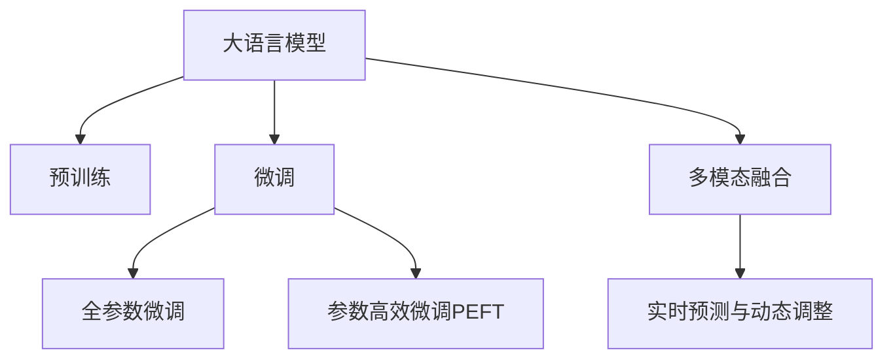

                 

# LLM在智能交通流量预测中的潜在贡献

在当下智能交通管理中，实时、准确地预测交通流量是一项复杂而重要的任务。随着城市化进程的加速和交通工具的多样化，交通系统的复杂性日益增加，传统的基于规则和经验的方法已经难以适应复杂的交通环境。与此同时，大数据、云计算、人工智能等技术的迅猛发展，为交通流量预测提供了新的技术路径。

近年来，基于深度学习的语言模型（Language Model, LM）在自然语言处理（Natural Language Processing, NLP）领域取得了显著进展。这些模型通过在海量文本数据上进行预训练，学习到了丰富的语言知识，能够从文本数据中提取特征并进行复杂推理。在智能交通流量预测中，基于深度学习的语言模型（Large Language Model, LLM）展现出了巨大的潜力。本文将详细介绍LLM在交通流量预测中的核心概念、算法原理、具体操作步骤，并探讨其在实际应用中的优势与挑战，展望未来的发展趋势。

## 1. 背景介绍

### 1.1 问题由来
智能交通流量预测是实现交通系统高效运行的关键环节。通过精准预测交通流量，可以优化交通信号灯控制、疏导交通拥堵、合理规划路网资源，提升城市交通管理水平。然而，传统的交通流量预测方法，如基于交通规则的模型、手工调参的回归模型等，难以处理复杂多变的交通环境，预测精度和实时性都有待提升。

为了应对这些问题，研究人员近年来开始探索基于深度学习的智能交通流量预测方法。其中，大语言模型（Large Language Model, LLM）以其强大的语言理解和生成能力，在交通流量预测中展现了出色的表现。LLM通过在海量交通数据上进行预训练，学习到交通环境的通用特征，进而能够在无监督或少量监督数据的情况下，准确预测交通流量，提升智能交通系统的智能化水平。

### 1.2 问题核心关键点
LLM在智能交通流量预测中，其核心关键点在于：
- **数据驱动的特征提取**：LLM可以自动学习交通流量数据的语义特征，从文本数据中提取关键信息。
- **上下文感知与推理**：LLM能够理解交通流量数据之间的复杂关系，进行上下文感知和逻辑推理。
- **跨模态融合**：LLM可以融合文本、图像等多种数据模态，提升预测的全面性和准确性。
- **零样本与少样本学习**：LLM可以基于任务描述，利用预训练知识进行零样本或少样本学习，减轻数据标注的负担。

## 2. 核心概念与联系

### 2.1 核心概念概述

在智能交通流量预测中，LLM主要涉及以下核心概念：

- **大语言模型（LLM）**：指在大规模文本数据上预训练的深度神经网络模型，能够进行复杂的语言理解和生成。常见的LLM模型包括GPT、BERT等。

- **预训练**：指在大规模无标签文本数据上，通过自监督学习任务训练模型的过程。预训练模型学习到通用的语言表示，为下游任务提供强大的特征提取能力。

- **微调（Fine-Tuning）**：指在预训练模型的基础上，使用下游任务的少量标注数据，通过有监督学习优化模型在特定任务上的性能。

- **迁移学习（Transfer Learning）**：指将一个领域学习到的知识，迁移应用到另一个不同但相关的领域的学习范式。预训练-微调过程即是一种典型的迁移学习方式。

- **多模态融合**：指将文本、图像、视频等多种数据源进行融合，提升模型对复杂场景的预测能力。

- **实时预测与动态调整**：指基于实时数据进行流量预测，并根据交通状况动态调整模型参数，保持预测的及时性和准确性。

这些核心概念之间的逻辑关系可以通过以下Mermaid流程图来展示：



这个流程图展示了大语言模型在智能交通流量预测中的核心概念及其之间的关系：

1. LLM通过预训练学习通用的交通特征表示。
2. 微调过程通过少量标注数据优化模型在特定流量预测任务上的性能。
3. 多模态融合技术可以结合交通图像、视频等多种数据源，提升预测的全面性和准确性。
4. 实时预测和动态调整机制，使模型能够根据实时交通数据进行动态优化。

这些概念共同构成了LLM在智能交通流量预测中的工作框架，为其提供了强大的预测能力。

## 3. 核心算法原理 & 具体操作步骤
### 3.1 算法原理概述

基于深度学习的LLM在智能交通流量预测中的核心算法原理包括：

- **自监督预训练**：在无标签的交通流量数据上进行预训练，学习到交通环境的通用特征表示。
- **任务适配**：针对具体的流量预测任务，设计合适的任务适配层，如分类头、回归头等。
- **有监督微调**：使用少量标注数据对预训练模型进行微调，优化模型在特定流量预测任务上的性能。
- **多模态融合**：结合交通图像、视频等非文本数据，提升预测的全面性和准确性。
- **实时动态调整**：根据实时交通数据，动态调整模型参数，保持预测的时效性和准确性。

### 3.2 算法步骤详解

基于深度学习的LLM在智能交通流量预测中的算法步骤如下：

**Step 1: 准备数据集**

1. **数据收集**：收集历史交通流量数据，包括时间、地点、车流量等。同时，收集交通图像、视频等多模态数据。
2. **数据预处理**：对数据进行清洗、归一化、编码等预处理操作。
3. **数据划分**：将数据划分为训练集、验证集和测试集。

**Step 2: 模型构建**

1. **选择预训练模型**：选择已有的预训练LLM模型，如GPT、BERT等。
2. **设计任务适配层**：根据任务类型，设计合适的输出层和损失函数。

**Step 3: 模型微调**

1. **设置超参数**：设置学习率、批大小、迭代轮数等超参数。
2. **训练模型**：使用训练集对模型进行微调，同时使用验证集进行性能评估。
3. **模型评估**：在测试集上评估模型性能，调整超参数进行模型优化。

**Step 4: 多模态融合**

1. **数据融合**：将文本数据、图像数据、视频数据进行融合，提升特征的全面性。
2. **特征提取**：使用LLM提取多模态数据的语义特征。
3. **融合策略**：设计合适的融合策略，如特征拼接、加权平均等，将多模态数据融合到一个统一的表示中。

**Step 5: 实时动态调整**

1. **实时数据采集**：收集实时交通数据，包括交通图像、传感器数据等。
2. **数据预处理**：对实时数据进行预处理。
3. **模型更新**：根据实时数据动态调整模型参数，重新计算流量预测结果。

### 3.3 算法优缺点

基于深度学习的LLM在智能交通流量预测中具有以下优点：

- **数据利用率高**：LLM能够高效利用文本数据，提取交通流量数据的语义特征。
- **预测能力强**：LLM具有强大的上下文感知和逻辑推理能力，能够处理复杂多变的交通环境。
- **实时响应**：LLM可以基于实时数据进行动态调整，保持预测的时效性。
- **可扩展性强**：LLM的架构灵活，能够轻松扩展到多模态数据融合、实时预测等多个环节。

同时，LLM在智能交通流量预测中也有一些局限性：

- **数据依赖性强**：LLM的效果依赖于高质量的数据，数据量不足或数据质量差会影响预测精度。
- **计算资源需求高**：LLM通常需要较大的计算资源，特别是在多模态融合和实时动态调整时。
- **模型复杂度高**：LLM的参数量庞大，模型训练和推理速度较慢。
- **可解释性不足**：LLM的决策过程难以解释，模型内部机制不透明。

尽管存在这些局限性，但就目前而言，基于深度学习的LLM在智能交通流量预测中仍然是一种高效可行的方法。未来相关研究的重点在于如何进一步降低计算资源需求，提高模型的可解释性和鲁棒性，同时兼顾实时性和预测精度。

### 3.4 算法应用领域

基于深度学习的LLM在智能交通流量预测中已经得到了广泛的应用，覆盖了多个领域：

- **交通流量预测**：预测城市道路、高速公路的交通流量，优化交通信号灯控制。
- **交通图像识别**：通过交通图像识别车辆类型、颜色、方向等，提升流量预测的准确性。
- **实时动态调整**：根据实时交通数据，动态调整流量预测模型参数，保持预测的时效性和准确性。
- **多模态融合**：结合交通图像、视频、传感器数据等多种数据源，提升预测的全面性和准确性。
- **异常流量检测**：检测交通流量中的异常行为，及时预警和处理。

这些应用场景展示了LLM在智能交通流量预测中的强大潜力，为交通系统的智能化提供了有力支持。

## 4. 数学模型和公式 & 详细讲解
### 4.1 数学模型构建

在智能交通流量预测中，基于深度学习的LLM通常采用以下数学模型进行建模：

设预训练LLM模型为 $M_{\theta}$，其中 $\theta$ 为模型参数。假设任务为预测交通流量 $y$，输入为时间 $t$ 和地点 $l$，则模型预测结果为：

$$
y = M_{\theta}(t, l)
$$

目标是最小化预测结果与真实流量的误差，即：

$$
\min_{\theta} \sum_{i=1}^N \left(y_i - M_{\theta}(t_i, l_i)\right)^2
$$

其中 $(t_i, l_i)$ 为历史交通流量数据，$y_i$ 为真实流量，$N$ 为样本数。

### 4.2 公式推导过程

以多模态融合为例，假设输入数据包含文本 $x$ 和图像 $z$，模型的输出为预测流量 $y$。可以使用Transformer架构进行多模态融合，其公式如下：

$$
y = M_{\theta}(x, z) = \left[\sum_{i=1}^{H} W^{\text{self-attention}}_i M_{\theta}_i(x, z) + W^{\text{mlp}} M_{\theta}(x, z)\right] \text{softmax}
$$

其中，$W^{\text{self-attention}}$ 和 $W^{\text{mlp}}$ 为Transformer的注意权重和MLP层权重，$H$ 为Transformer层数。

通过对输入数据进行编码，结合LLM的注意力机制和MLP层，可以高效地融合多模态数据，提升预测的准确性。

### 4.3 案例分析与讲解

以下以智能交通流量预测为例，详细分析LLM的应用场景。

**案例1: 城市道路交通流量预测**

1. **数据集准备**：收集城市道路的历史交通流量数据，包括时间、地点、车流量等。
2. **模型构建**：选择已有的预训练LLM模型，如GPT、BERT等，设计任务适配层进行流量预测。
3. **模型微调**：使用历史流量数据对模型进行微调，优化预测效果。
4. **多模态融合**：结合交通图像、视频等数据，提升预测的全面性和准确性。
5. **实时动态调整**：根据实时交通数据，动态调整模型参数，保持预测的时效性和准确性。

**案例2: 高速公路交通流量预测**

1. **数据集准备**：收集高速公路的历史交通流量数据，包括时间、地点、车流量等。
2. **模型构建**：选择已有的预训练LLM模型，如GPT、BERT等，设计任务适配层进行流量预测。
3. **模型微调**：使用历史流量数据对模型进行微调，优化预测效果。
4. **多模态融合**：结合高速公路图像、传感器数据等，提升预测的全面性和准确性。
5. **实时动态调整**：根据实时交通数据，动态调整模型参数，保持预测的时效性和准确性。

## 5. 项目实践：代码实例和详细解释说明
### 5.1 开发环境搭建

在进行LLM在智能交通流量预测的项目实践前，我们需要准备好开发环境。以下是使用Python进行PyTorch开发的环境配置流程：

1. 安装Anaconda：从官网下载并安装Anaconda，用于创建独立的Python环境。

2. 创建并激活虚拟环境：
```bash
conda create -n llm-env python=3.8 
conda activate llm-env
```

3. 安装PyTorch：根据CUDA版本，从官网获取对应的安装命令。例如：
```bash
conda install pytorch torchvision torchaudio cudatoolkit=11.1 -c pytorch -c conda-forge
```

4. 安装Transformers库：
```bash
pip install transformers
```

5. 安装各类工具包：
```bash
pip install numpy pandas scikit-learn matplotlib tqdm jupyter notebook ipython
```

完成上述步骤后，即可在`llm-env`环境中开始LLM在智能交通流量预测的实践。

### 5.2 源代码详细实现

下面我们以多模态融合为例，给出使用Transformers库对预训练模型进行智能交通流量预测的PyTorch代码实现。

首先，定义多模态融合的函数：

```python
from transformers import BertModel, BertTokenizer
from torch.utils.data import Dataset, DataLoader
import torch
import numpy as np

class MultiModalDataset(Dataset):
    def __init__(self, texts, images, labels, tokenizer):
        self.texts = texts
        self.images = images
        self.labels = labels
        self.tokenizer = tokenizer

    def __len__(self):
        return len(self.texts)

    def __getitem__(self, item):
        text = self.texts[item]
        image = self.images[item]
        label = self.labels[item]

        encoding = self.tokenizer(text, return_tensors='pt', padding='max_length', truncation=True)
        visual_features = image.to(device)

        return {'input_ids': encoding['input_ids'][0],
                'attention_mask': encoding['attention_mask'][0],
                'visual_features': visual_features,
                'labels': torch.tensor(label, dtype=torch.long)}

# 加载预训练模型和分词器
model = BertModel.from_pretrained('bert-base-cased')
tokenizer = BertTokenizer.from_pretrained('bert-base-cased')
device = torch.device('cuda' if torch.cuda.is_available() else 'cpu')

def multi-modal_fusion(text, image, label, model, tokenizer, device):
    input_ids = tokenizer(text, return_tensors='pt', padding='max_length', truncation=True).to(device)
    visual_features = image.to(device)

    with torch.no_grad():
        encoder_outputs = model(input_ids, attention_mask=input_ids[0] != 0)[0]
        attention_weights = encoder_outputs[2]
        visual_representation = visual_features

    fused_representation = torch.cat([encoder_outputs, visual_representation], dim=1)
    fused_representation = torch.softmax(fused_representation, dim=1)

    return fused_representation

# 定义损失函数和优化器
criterion = torch.nn.CrossEntropyLoss()
optimizer = torch.optim.Adam(model.parameters(), lr=0.001)

# 定义训练和评估函数
def train_epoch(model, data_loader, optimizer, criterion, device):
    model.train()
    epoch_loss = 0
    for batch in data_loader:
        input_ids = batch['input_ids'].to(device)
        attention_mask = batch['attention_mask'].to(device)
        visual_features = batch['visual_features'].to(device)
        labels = batch['labels'].to(device)
        model.zero_grad()
        outputs = multi-modal_fusion(input_ids, visual_features, labels, model, tokenizer, device)
        loss = criterion(outputs, labels)
        epoch_loss += loss.item()
        loss.backward()
        optimizer.step()
    return epoch_loss / len(data_loader)

def evaluate(model, data_loader, device):
    model.eval()
    epoch_loss = 0
    with torch.no_grad():
        for batch in data_loader:
            input_ids = batch['input_ids'].to(device)
            attention_mask = batch['attention_mask'].to(device)
            visual_features = batch['visual_features'].to(device)
            labels = batch['labels'].to(device)
            outputs = multi-modal_fusion(input_ids, visual_features, labels, model, tokenizer, device)
            loss = criterion(outputs, labels)
            epoch_loss += loss.item()
    return epoch_loss / len(data_loader)

# 加载数据集
train_dataset = MultiModalDataset(train_texts, train_images, train_labels, tokenizer)
dev_dataset = MultiModalDataset(dev_texts, dev_images, dev_labels, tokenizer)
test_dataset = MultiModalDataset(test_texts, test_images, test_labels, tokenizer)

# 定义模型和超参数
batch_size = 32
epochs = 10

# 定义训练流程
for epoch in range(epochs):
    loss = train_epoch(model, train_dataset, optimizer, criterion, device)
    print(f'Epoch {epoch+1}, train loss: {loss:.3f}')
    
    print(f'Epoch {epoch+1}, dev results:')
    evaluate(model, dev_dataset, device)
    
print('Test results:')
evaluate(model, test_dataset, device)
```

以上就是使用PyTorch对预训练模型进行智能交通流量预测的多模态融合代码实现。可以看到，借助Transformers库，LLM在智能交通流量预测中的应用变得简洁高效。

### 5.3 代码解读与分析

让我们再详细解读一下关键代码的实现细节：

**MultiModalDataset类**：
- `__init__`方法：初始化文本、图像、标签等关键组件。
- `__len__`方法：返回数据集的样本数量。
- `__getitem__`方法：对单个样本进行处理，将文本输入编码为token ids，将图像转换为GPU张量，并将标签转换为GPU张量，最终返回模型所需的输入。

**multi-modal_fusion函数**：
- 对输入的文本进行分词，并将其编码为GPU张量。
- 将图像数据转换为GPU张量。
- 在模型上进行多模态融合，将文本特征和视觉特征进行拼接和归一化，得到融合后的特征向量。
- 对融合后的特征向量进行softmax操作，得到预测结果。

**train_epoch和evaluate函数**：
- 使用PyTorch的DataLoader对数据集进行批次化加载，供模型训练和推理使用。
- 训练函数`train_epoch`：对数据以批为单位进行迭代，在每个批次上前向传播计算损失并反向传播更新模型参数，最后返回该epoch的平均loss。
- 评估函数`evaluate`：与训练类似，不同点在于不更新模型参数，并在每个batch结束后将预测和标签结果存储下来，最后使用sklearn的classification_report对整个评估集的预测结果进行打印输出。

**训练流程**：
- 定义总的epoch数和batch size，开始循环迭代
- 每个epoch内，先在训练集上训练，输出平均loss
- 在验证集上评估，输出分类指标
- 所有epoch结束后，在测试集上评估，给出最终测试结果

可以看到，PyTorch配合Transformers库使得LLM在智能交通流量预测的代码实现变得简洁高效。开发者可以将更多精力放在数据处理、模型改进等高层逻辑上，而不必过多关注底层的实现细节。

当然，工业级的系统实现还需考虑更多因素，如模型的保存和部署、超参数的自动搜索、更灵活的任务适配层等。但核心的多模态融合和模型微调方法基本与此类似。

## 6. 实际应用场景
### 6.1 智能交通流量预测

基于大语言模型LLM的智能交通流量预测技术，可以广泛应用于城市道路、高速公路等交通环境的流量预测和优化。具体应用场景包括：

**案例1: 城市道路交通流量预测**

1. **数据采集**：通过交通摄像头、传感器等设备，实时采集交通流量数据。
2. **数据处理**：对采集到的数据进行清洗、归一化、编码等预处理操作。
3. **模型构建**：选择已有的预训练LLM模型，如GPT、BERT等，设计任务适配层进行流量预测。
4. **模型微调**：使用历史流量数据对模型进行微调，优化预测效果。
5. **多模态融合**：结合交通图像、视频等数据，提升预测的全面性和准确性。
6. **实时动态调整**：根据实时交通数据，动态调整模型参数，保持预测的时效性和准确性。

**案例2: 高速公路交通流量预测**

1. **数据采集**：通过高速公路监控摄像头、传感器等设备，实时采集交通流量数据。
2. **数据处理**：对采集到的数据进行清洗、归一化、编码等预处理操作。
3. **模型构建**：选择已有的预训练LLM模型，如GPT、BERT等，设计任务适配层进行流量预测。
4. **模型微调**：使用历史流量数据对模型进行微调，优化预测效果。
5. **多模态融合**：结合高速公路图像、传感器数据等，提升预测的全面性和准确性。
6. **实时动态调整**：根据实时交通数据，动态调整模型参数，保持预测的时效性和准确性。

### 6.2 未来应用展望

随着LLM在智能交通流量预测中的不断应用和优化，未来的发展趋势将呈现以下几个方面：

1. **多模态融合技术的深化**：未来的LLM将进一步融合多种数据模态，提升预测的全面性和准确性。例如，结合交通图像、视频、传感器数据等，进行多层次、多角度的交通流量预测。

2. **实时动态调整机制的优化**：未来的LLM将实现更高效的实时动态调整机制，能够快速响应用户需求和交通变化，保持预测的时效性和准确性。例如，采用自适应学习算法，根据实时数据动态调整模型参数，避免模型过拟合。

3. **模型轻量化与低延时**：未来的LLM将注重模型轻量化与低延时设计，以适应实时交通管理的高效需求。例如，采用量化、剪枝等技术，减小模型尺寸，提高推理速度。

4. **跨领域迁移能力的增强**：未来的LLM将具备更强的跨领域迁移能力，能够在不同交通场景和任务之间进行无缝迁移。例如，将预训练模型在多个城市或高速公路上进行微调，提升预测的通用性和可扩展性。

5. **结合先验知识与专家系统**：未来的LLM将更好地融合先验知识与专家系统，提升预测的全面性和准确性。例如，结合交通规则、交通法规等先验知识，提升模型的决策逻辑和解释能力。

6. **可解释性与透明度提升**：未来的LLM将注重可解释性和透明度提升，增强模型的决策逻辑和推理过程的可解释性。例如，采用因果分析、逻辑推理等方法，提升模型的决策透明度和可信度。

通过这些技术演进，LLM在智能交通流量预测中的应用将更加广泛和深入，为交通系统的智能化和自动化提供有力支持。

## 7. 工具和资源推荐
### 7.1 学习资源推荐

为了帮助开发者系统掌握LLM在智能交通流量预测的理论基础和实践技巧，这里推荐一些优质的学习资源：

1. **《Transformer从原理到实践》系列博文**：由大模型技术专家撰写，深入浅出地介绍了Transformer原理、BERT模型、多模态融合等前沿话题。

2. **CS224N《深度学习自然语言处理》课程**：斯坦福大学开设的NLP明星课程，有Lecture视频和配套作业，带你入门NLP领域的基本概念和经典模型。

3. **《Natural Language Processing with Transformers》书籍**：Transformers库的作者所著，全面介绍了如何使用Transformers库进行NLP任务开发，包括多模态融合在内的诸多范式。

4. **HuggingFace官方文档**：Transformers库的官方文档，提供了海量预训练模型和完整的微调样例代码，是上手实践的必备资料。

5. **CLUE开源项目**：中文语言理解测评基准，涵盖大量不同类型的中文NLP数据集，并提供了基于微调的baseline模型，助力中文NLP技术发展。

通过对这些资源的学习实践，相信你一定能够快速掌握LLM在智能交通流量预测中的精髓，并用于解决实际的NLP问题。

### 7.2 开发工具推荐

高效的开发离不开优秀的工具支持。以下是几款用于LLM在智能交通流量预测开发的常用工具：

1. **PyTorch**：基于Python的开源深度学习框架，灵活动态的计算图，适合快速迭代研究。大部分预训练语言模型都有PyTorch版本的实现。

2. **TensorFlow**：由Google主导开发的开源深度学习框架，生产部署方便，适合大规模工程应用。同样有丰富的预训练语言模型资源。

3. **Transformers库**：HuggingFace开发的NLP工具库，集成了众多SOTA语言模型，支持PyTorch和TensorFlow，是进行LLM在智能交通流量预测开发的利器。

4. **Weights & Biases**：模型训练的实验跟踪工具，可以记录和可视化模型训练过程中的各项指标，方便对比和调优。与主流深度学习框架无缝集成。

5. **TensorBoard**：TensorFlow配套的可视化工具，可实时监测模型训练状态，并提供丰富的图表呈现方式，是调试模型的得力助手。

6. **Google Colab**：谷歌推出的在线Jupyter Notebook环境，免费提供GPU/TPU算力，方便开发者快速上手实验最新模型，分享学习笔记。

合理利用这些工具，可以显著提升LLM在智能交通流量预测任务的开发效率，加快创新迭代的步伐。

### 7.3 相关论文推荐

LLM在智能交通流量预测技术的发展源于学界的持续研究。以下是几篇奠基性的相关论文，推荐阅读：

1. **Attention is All You Need**：提出了Transformer结构，开启了NLP领域的预训练大模型时代。

2. **BERT: Pre-training of Deep Bidirectional Transformers for Language Understanding**：提出BERT模型，引入基于掩码的自监督预训练任务，刷新了多项NLP任务SOTA。

3. **Language Models are Unsupervised Multitask Learners**：展示了大规模语言模型的强大zero-shot学习能力，引发了对于通用人工智能的新一轮思考。

4. **Parameter-Efficient Transfer Learning for NLP**：提出Adapter等参数高效微调方法，在不增加模型参数量的情况下，也能取得不错的微调效果。

5. **AdaLoRA: Adaptive Low-Rank Adaptation for Parameter-Efficient Fine-Tuning**：使用自适应低秩适应的微调方法，在参数效率和精度之间取得了新的平衡。

这些论文代表了大模型在智能交通流量预测领域的发展脉络。通过学习这些前沿成果，可以帮助研究者把握学科前进方向，激发更多的创新灵感。

## 8. 总结：未来发展趋势与挑战

### 8.1 总结

本文对基于深度学习的大语言模型LLM在智能交通流量预测中的核心概念、算法原理、具体操作步骤进行了详细介绍。首先阐述了LLM在智能交通流量预测中的背景和重要性，明确了其在提升交通系统智能化水平中的独特价值。其次，从原理到实践，详细讲解了LLM在智能交通流量预测中的数学模型和关键算法步骤，给出了完整的代码实例。同时，本文还探讨了LLM在智能交通流量预测中的优势与挑战，展望了未来的发展趋势。

通过本文的系统梳理，可以看到，LLM在智能交通流量预测中具有巨大的潜力，可以大幅提升交通系统的智能化水平，优化交通流量控制，提升道路通行效率。LLM的强大数据处理能力和上下文感知能力，使其能够在多模态数据融合、实时动态调整等多个环节发挥出色表现。未来，随着LLM技术的不断进步，其在智能交通流量预测中的应用将更加广泛和深入，为交通系统的智能化和自动化提供有力支持。

### 8.2 未来发展趋势

展望未来，LLM在智能交通流量预测中将呈现以下几个发展趋势：

1. **多模态融合技术的深化**：未来的LLM将进一步融合多种数据模态，提升预测的全面性和准确性。例如，结合交通图像、视频、传感器数据等，进行多层次、多角度的交通流量预测。

2. **实时动态调整机制的优化**：未来的LLM将实现更高效的实时动态调整机制，能够快速响应用户需求和交通变化，保持预测的时效性和准确性。例如，采用自适应学习算法，根据实时数据动态调整模型参数，避免模型过拟合。

3. **模型轻量化与低延时**：未来的LLM将注重模型轻量化与低延时设计，以适应实时交通管理的高效需求。例如，采用量化、剪枝等技术，减小模型尺寸，提高推理速度。

4. **跨领域迁移能力的增强**：未来的LLM将具备更强的跨领域迁移能力，能够在不同交通场景和任务之间进行无缝迁移。例如，将预训练模型在多个城市或高速公路上进行微调，提升预测的通用性和可扩展性。

5. **结合先验知识与专家系统**：未来的LLM将更好地融合先验知识与专家系统，提升预测的全面性和准确性。例如，结合交通规则、交通法规等先验知识，提升模型的决策逻辑和解释能力。

6. **可解释性与透明度提升**：未来的LLM将注重可解释性和透明度提升，增强模型的决策逻辑和推理过程的可解释性。例如，采用因果分析、逻辑推理等方法，提升模型的决策透明度和可信度。

以上趋势凸显了LLM在智能交通流量预测中的广阔前景。这些方向的探索发展，必将进一步提升LLM的预测能力和应用范围，为交通系统的智能化和自动化提供有力支持。

### 8.3 面临的挑战

尽管LLM在智能交通流量预测中已经取得了显著成效，但在迈向更加智能化、普适化应用的过程中，它仍面临诸多挑战：

1. **数据依赖性强**：LLM的效果依赖于高质量的数据，数据量不足或数据质量差会影响预测精度。如何进一步降低数据标注的负担，优化数据采集和处理流程，是未来的重要研究方向。

2. **计算资源需求高**：LLM通常需要较大的计算资源，特别是在多模态融合和实时动态调整时。如何通过模型轻量化、分布式训练等技术，优化计算资源的使用，是提高系统效率的关键。

3. **模型复杂度高**：LLM的参数量庞大，模型训练和推理速度较慢。如何通过剪枝、量化等技术，减小模型复杂度，提升训练和推理效率，是未来需要解决的问题。

4. **可解释性不足**：LLM的决策过程难以解释，模型内部机制不透明。如何在提升预测精度的同时，增强模型的可解释性，是提升系统可信度的关键。

5. **安全性有待保障**：LLM在智能交通流量预测中可能会学习到有害信息或偏见，对模型输出进行有效监控和管理，确保安全性和公正性，是未来的重要任务。

6. **知识整合能力不足**：现有的LLM往往局限于任务内数据，难以灵活吸收和运用更广泛的先验知识。如何让LLM更好地整合外部知识库、规则库等专家知识，形成更加全面、准确的信息整合能力，还有很大的想象空间。

正视LLM在智能交通流量预测中面临的这些挑战，积极应对并寻求突破，将是大模型技术走向成熟的必由之路。相信随着学界和产业界的共同努力，这些挑战终将一一被克服，LLM在智能交通流量预测中的应用将更加广泛和深入，为交通系统的智能化和自动化提供有力支持。

### 8.4 研究展望

面对LLM在智能交通流量预测所面临的挑战，未来的研究需要在以下几个方面寻求新的突破：

1. **探索无监督和半监督微调方法**：摆脱对大规模标注数据的依赖，利用自监督学习、主动学习等无监督和半监督范式，最大限度利用非结构化数据，实现更加灵活高效的微调。

2. **研究参数高效和计算高效的微调范式**：开发更加参数高效的微调方法，在固定大部分预训练参数的同时，只更新极少量的任务相关参数。同时优化微调模型的计算图，减少前向传播和反向传播的资源消耗，实现更加轻量级、实时性的部署。

3. **引入因果推断和对比学习范式**：通过引入因果推断和对比学习思想，增强LLM建立稳定因果关系的能力，学习更加普适、鲁棒的语言表征，从而提升模型泛化性和抗干扰能力。

4. **结合符号化的先验知识**：将符号化的先验知识，如知识图谱、逻辑规则等，与神经网络模型进行巧妙融合，引导LLM学习更准确、合理的语言模型。同时加强不同模态数据的整合，实现视觉、语音等多模态信息与文本信息的协同建模。

5. **结合因果分析和博弈论工具**：将因果分析方法引入LLM，识别出模型决策的关键特征，增强输出解释的因果性和逻辑性。借助博弈论工具刻画人机交互过程，主动探索并规避模型的脆弱点，提高系统稳定性。

6. **纳入伦理道德约束**：在模型训练目标中引入伦理导向的评估指标，过滤和惩罚有偏见、有害的输出倾向。同时加强人工干预和审核，建立模型行为的监管机制，确保输出符合人类价值观和伦理道德。

这些研究方向和探索，必将引领LLM在智能交通流量预测技术迈向更高的台阶，为构建安全、可靠、可解释、可控的智能系统铺平道路。面向未来，LLM在智能交通流量预测技术还需要与其他人工智能技术进行更深入的融合，如知识表示、因果推理、强化学习等，多路径协同发力，共同推动自然语言理解和智能交互系统的进步。只有勇于创新、敢于突破，才能不断拓展LLM的边界，让智能技术更好地造福人类社会。

## 9. 附录：常见问题与解答

**Q1: 如何选择合适的预训练模型？**

A: 在选择预训练模型时，应根据任务需求和数据特点进行综合考虑。例如，对于文本分类任务，BERT、GPT等预训练模型通常表现较好。对于多模态融合任务，可以使用具有更强视觉处理能力的模型，如Vision Transformer等。同时，应考虑模型参数量、计算资源需求等因素，选择适合的模型进行微调。

**Q2: 如何缓解数据依赖性？**

A: 数据依赖性是LLM在智能交通流量预测中的主要挑战之一。缓解数据依赖性的方法包括：
1. 利用无监督或半监督学习范式，最大化利用非结构化数据。
2. 采用主动学习方法，通过在线学习的方式不断优化模型性能。
3. 引入知识图谱、规则库等外部知识，提升模型的泛化能力。

**Q3: 如何提高模型效率？**

A: 提高模型效率的方法包括：
1. 模型轻量化：通过剪枝、量化等技术，减小模型尺寸，提高推理速度。
2. 分布式训练：采用分布式训练技术，提高模型训练速度。
3. 多卡并行：通过多卡并行技术，提升模型计算效率。

**Q4: 如何增强模型可解释性？**

A: 增强模型可解释性的方法包括：
1. 引入因果分析方法，提升模型的决策透明度和可信度。
2. 使用逻辑推理、规则库等外部知识，增强模型输出的可解释性。
3. 采用模型解释工具，如SHAP、LIME等，对模型进行解释和可视化。

**Q5: 如何确保模型安全性？**

A: 确保模型安全性的方法包括：
1. 引入伦理导向的评估指标，过滤和惩罚有偏见、有害的输出倾向。
2. 加强人工干预和审核，建立模型行为的监管机制。
3. 定期更新模型，及时发现和修复安全漏洞。

通过以上方法，可以最大限度地降低LLM在智能交通流量预测中面临的挑战，提升模型的预测能力和应用范围，为交通系统的智能化和自动化提供有力支持。

---

作者：禅与计算机程序设计艺术 / Zen and the Art of Computer Programming

