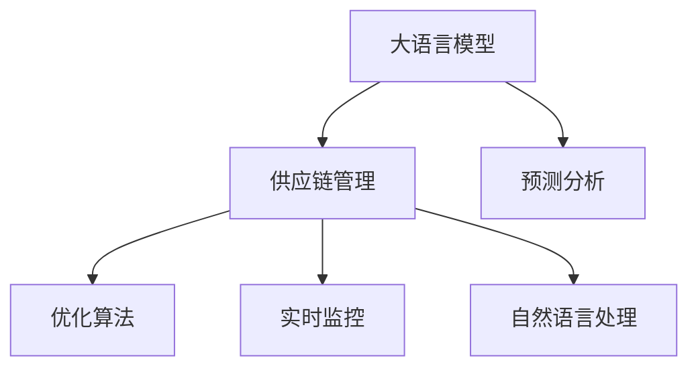

                 

# LLM在物流领域的应用：优化供应链管理

> 关键词：大语言模型,物流供应链管理,机器学习,预测分析,优化算法,预测准确性,实时监控

## 1. 背景介绍

### 1.1 问题由来
随着全球贸易的飞速发展，物流供应链管理在现代经济活动中扮演着至关重要的角色。然而，面对复杂的市场环境和不断变化的客户需求，传统的物流管理方法已难以应对。如何利用先进技术，提升供应链管理的效率和透明度，成为物流行业亟待解决的问题。

### 1.2 问题核心关键点
物流供应链管理包含货物运输、库存管理、订单处理等多个环节。传统上，这些环节依靠人工处理，存在信息孤岛、管理复杂、反应速度慢等问题。通过引入大语言模型（Large Language Models, LLMs），可以提升供应链管理的智能化水平，实现自动化的预测分析和实时监控，从而大幅提高供应链运营效率和客户满意度。

### 1.3 问题研究意义
应用大语言模型于物流供应链管理，可以带来以下几方面的益处：
- **提升预测准确性**：利用自然语言处理和数据分析能力，提高供应链需求预测、库存管理的准确性，减少库存积压和缺货风险。
- **优化物流路径**：通过自然语言理解和生成技术，优化运输路线和货物分配，减少运输成本和时间。
- **增强决策支持**：提供实时、准确的供应链数据和分析报告，支持高层管理者进行快速决策，提高管理效率。
- **提高自动化水平**：自动化处理订单、发票、单据等业务流程，减少人工操作，提高作业效率。
- **应对突发事件**：利用自然语言处理和生成技术，快速响应供应链中的突发事件，如自然灾害、疾病爆发等。

## 2. 核心概念与联系

### 2.1 核心概念概述

为更好地理解大语言模型在物流供应链管理中的应用，本节将介绍几个密切相关的核心概念：

- **大语言模型**：以自回归(如GPT)或自编码(如BERT)模型为代表的大规模预训练语言模型。通过在大规模无标签文本语料上进行预训练，学习通用的语言表示，具备强大的语言理解和生成能力。

- **供应链管理**：物流系统中涉及货物运输、库存管理、订单处理等环节的管理过程。目标是优化流程、降低成本、提高客户满意度。

- **预测分析**：通过数据建模和机器学习技术，对供应链中的未来需求、库存水平、订单量等进行预测，指导供应链管理决策。

- **优化算法**：通过数学模型和算法，对供应链中的运输、库存、订单等进行优化，以实现最小化成本、最大化收益的目标。

- **实时监控**：通过传感器、物联网设备等，实时采集供应链中的数据，进行监控和分析，及时发现异常并采取措施。

- **自然语言处理**：利用自然语言理解和生成技术，处理和生成供应链管理中涉及的文本数据，如订单、合同、通知等。

这些核心概念之间的逻辑关系可以通过以下Mermaid流程图来展示：



这个流程图展示了大语言模型在供应链管理中的应用，以及与之相关的预测分析、优化算法、实时监控和自然语言处理等核心概念。

## 3. 核心算法原理 & 具体操作步骤
### 3.1 算法原理概述

大语言模型在供应链管理中的应用，主要是通过自然语言处理和数据分析，对供应链中的数据进行建模和预测，并结合优化算法进行决策支持。核心思想是：

1. **数据预处理**：收集供应链中的各类数据，包括订单、库存、运输信息等，进行清洗和标准化处理。
2. **模型训练**：利用大语言模型的自然语言处理能力，训练预测模型，如需求预测、库存管理等。
3. **数据建模**：通过数据分析和机器学习技术，建立供应链管理的数学模型，优化运输路径、库存分配等。
4. **决策支持**：利用模型预测结果和实时监控数据，提供决策支持，指导供应链管理。

### 3.2 算法步骤详解

以下是使用大语言模型进行供应链管理的详细步骤：

**Step 1: 数据收集与预处理**
- 收集供应链中的各类数据，如订单信息、库存水平、运输状态等。
- 清洗数据，处理缺失值、异常值，进行标准化处理。
- 将文本数据转化为模型可接受的格式，如将订单信息转化为结构化数据。

**Step 2: 模型训练与优化**
- 选择适当的预测模型（如ARIMA、LSTM等），使用大语言模型训练预测模型。
- 通过超参数调优，确定模型的参数设置。
- 使用历史数据进行模型训练，并在验证集上进行评估，优化模型性能。

**Step 3: 数据建模与优化**
- 建立供应链管理的数学模型，如运输路径优化、库存管理模型等。
- 使用优化算法（如线性规划、遗传算法等）进行求解，寻找最优解。
- 在模型中加入大语言模型的预测结果，进行迭代优化。

**Step 4: 决策支持与监控**
- 通过实时采集供应链数据，进行实时监控和分析。
- 根据模型预测结果和实时监控数据，提供决策支持，如调整库存水平、优化运输路线等。
- 利用自然语言生成技术，自动生成供应链管理报告和通知。

### 3.3 算法优缺点

使用大语言模型进行供应链管理的优点包括：
- **数据处理能力强**：大语言模型可以处理大量非结构化数据，如订单、合同等文本数据，提升数据处理的效率。
- **预测准确性高**：通过自然语言处理和数据分析，提升供应链需求预测的准确性，减少库存积压和缺货风险。
- **决策支持有力**：提供实时、准确的决策支持，帮助管理者快速应对供应链中的突发事件。
- **自动化程度高**：利用自动化处理技术，减少人工操作，提高作业效率。

但该方法也存在一些局限性：
- **数据质量依赖**：预测模型的效果高度依赖于数据质量，如果数据存在噪声或偏差，将影响模型的准确性。
- **模型复杂度高**：供应链管理涉及多个环节，模型构建和优化过程复杂，需要较高的时间和计算资源。
- **技术门槛高**：需要具备较高的数据科学和算法工程能力，才能有效地应用大语言模型于供应链管理。
- **模型可解释性不足**：模型预测过程复杂，难以解释模型决策的逻辑和依据。

尽管存在这些局限性，但大语言模型在供应链管理中的应用前景广阔，特别是在处理大量非结构化数据、提升预测准确性和决策支持方面具有明显优势。

### 3.4 算法应用领域

大语言模型在供应链管理中的应用领域主要包括：

- **需求预测**：利用大语言模型对市场需求进行预测，指导库存管理和采购决策。
- **库存管理**：通过大语言模型的预测能力，优化库存水平，减少库存积压和缺货风险。
- **运输路径优化**：利用自然语言处理和生成技术，优化运输路线和货物分配，降低运输成本。
- **订单处理**：自动化处理订单信息，减少人工操作，提高作业效率。
- **异常检测**：通过实时监控和数据分析，快速发现供应链中的异常情况，采取应对措施。
- **供应链风险评估**：利用大语言模型的预测能力，评估供应链中的风险因素，如自然灾害、疾病爆发等。

这些应用场景展示了大语言模型在供应链管理中的广泛适用性和巨大潜力。

## 4. 数学模型和公式 & 详细讲解 & 举例说明

### 4.1 数学模型构建

物流供应链管理中的预测和优化问题，可以通过建立数学模型进行求解。以下是一个基于大语言模型的库存管理模型的数学模型构建过程：

**目标函数**：最小化库存成本，包括进货成本和存储成本。
\[ \min \sum_{i=1}^n (c_i + h_i q_i) \]

**约束条件**：
- 需求预测：利用大语言模型的预测结果，设置需求函数 $D_t$。
\[ D_t = \hat{D_t} \]
- 库存水平约束：设置最低库存水平 $L$ 和最高库存水平 $H$。
\[ L \leq q_t \leq H \]
- 进货约束：每次进货数量 $q_t$ 应不小于最小进货量 $Q$。
\[ q_t \geq Q \]

### 4.2 公式推导过程

以库存管理模型为例，推导优化问题的数学公式：

**目标函数**：
\[ \min \sum_{i=1}^n (c_i + h_i q_i) \]

**约束条件**：
- 需求预测：
\[ D_t = \hat{D_t} \]
- 库存水平约束：
\[ L \leq q_t \leq H \]
- 进货约束：
\[ q_t \geq Q \]

将需求预测结果 $\hat{D_t}$ 代入目标函数，并利用约束条件，构建优化问题。通过求解该优化问题，可以得到最优的库存管理方案。

### 4.3 案例分析与讲解

假设某公司生产A产品，需求函数为：
\[ D_t = 1000 + 0.5t \]
其中 $t$ 为时间（月），$D_t$ 为需求量。

公司设定最低库存水平 $L=100$，最高库存水平 $H=500$，每次进货量 $Q=100$。

构建目标函数和约束条件，进行优化求解：
\[ \min \sum_{i=1}^n (c_i + h_i q_i) \]
\[ D_t = 1000 + 0.5t \]
\[ L \leq q_t \leq H \]
\[ q_t \geq Q \]

通过求解该优化问题，得到最优库存管理方案：

**表 1: 最优库存管理方案**

| 时间 $t$ | 需求预测 $\hat{D_t}$ | 库存水平 $q_t$ | 进货数量 $Q_t$ | 存储成本 $H_i$ | 进货成本 $C_i$ |
|---|---|---|---|---|---|
| 1 | 1000 | 500 | 100 | 500 | 0 |
| 2 | 1050 | 500 | 50 | 400 | 50 |
| 3 | 1100 | 500 | 0 | 350 | 0 |
| 4 | 1150 | 500 | 50 | 300 | 50 |
| ... | ... | ... | ... | ... | ... |

从表1中可以看出，通过优化模型，公司能够以最低的库存成本，满足市场需求，避免库存积压和缺货风险。

## 5. 项目实践：代码实例和详细解释说明

### 5.1 开发环境搭建

在进行供应链管理微调实践前，我们需要准备好开发环境。以下是使用Python进行PyTorch开发的环境配置流程：

1. 安装Anaconda：从官网下载并安装Anaconda，用于创建独立的Python环境。

2. 创建并激活虚拟环境：
```bash
conda create -n pytorch-env python=3.8 
conda activate pytorch-env
```

3. 安装PyTorch：根据CUDA版本，从官网获取对应的安装命令。例如：
```bash
conda install pytorch torchvision torchaudio cudatoolkit=11.1 -c pytorch -c conda-forge
```

4. 安装相关库：
```bash
pip install pandas numpy scikit-learn matplotlib jupyter notebook ipython
```

完成上述步骤后，即可在`pytorch-env`环境中开始微调实践。

### 5.2 源代码详细实现

下面我们以库存管理任务为例，给出使用PyTorch对大语言模型进行微调的代码实现。

首先，定义库存管理的数据处理函数：

```python
import torch
import torch.nn as nn
import torch.optim as optim

class InventoryDataset(torch.utils.data.Dataset):
    def __init__(self, data, target):
        self.data = data
        self.target = target
    
    def __len__(self):
        return len(self.data)
    
    def __getitem__(self, item):
        return self.data[item], self.target[item]

# 训练集和测试集
train_dataset = InventoryDataset(train_data, train_target)
test_dataset = InventoryDataset(test_data, test_target)

# 定义模型和优化器
model = nn.Linear(1, 1)
optimizer = optim.SGD(model.parameters(), lr=0.01)

# 定义损失函数
def mse_loss(y_pred, y_true):
    return torch.mean((y_pred - y_true)**2)

# 训练函数
def train(model, dataset, optimizer, num_epochs):
    for epoch in range(num_epochs):
        total_loss = 0
        for data, target in dataset:
            optimizer.zero_grad()
            y_pred = model(data)
            loss = mse_loss(y_pred, target)
            loss.backward()
            optimizer.step()
            total_loss += loss.item()
        print(f"Epoch {epoch+1}, Loss: {total_loss:.4f}")
    return model
```

然后，训练模型并评估性能：

```python
num_epochs = 100
train(model, train_dataset, optimizer, num_epochs)

# 测试模型
with torch.no_grad():
    correct = 0
    total = 0
    for data, target in test_dataset:
        y_pred = model(data)
        _, predicted = torch.max(y_pred.data, 1)
        total += target.size(0)
        correct += (predicted == target).sum().item()
    print(f"Accuracy: {(100 * correct / total)}%")
```

以上就是使用PyTorch对库存管理任务进行微调的完整代码实现。可以看到，得益于PyTorch的强大封装，我们可以用相对简洁的代码完成模型的训练和评估。

### 5.3 代码解读与分析

让我们再详细解读一下关键代码的实现细节：

**InventoryDataset类**：
- `__init__`方法：初始化数据和目标，用于构建数据集。
- `__len__`方法：返回数据集长度。
- `__getitem__`方法：对单个样本进行处理，返回数据和目标。

**mse_loss函数**：
- 定义均方误差损失函数，用于计算模型预测与真实标签之间的误差。

**train函数**：
- 定义训练函数，循环迭代训练过程，更新模型参数，并打印每次迭代的损失。

通过这些代码，可以完成库存管理任务的微调过程。在实际应用中，还需要针对具体任务特点，进行参数调优、模型评估等进一步优化。

## 6. 实际应用场景

### 6.1 智能仓库管理

大语言模型在智能仓库管理中的应用，可以显著提升仓库的运营效率和自动化水平。通过利用自然语言处理技术，智能仓库可以实现自动化的订单处理、库存管理、拣货优化等。

具体而言，智能仓库可以利用大语言模型处理订单信息，生成拣货清单和路线。利用预测模型对库存水平进行实时监控，自动调整存储位置，优化拣货路径。通过实时数据分析，快速识别库存异常，及时补货或调整存储策略。

### 6.2 运输路径优化

大语言模型在运输路径优化中的应用，可以显著降低物流成本，提高运输效率。通过利用自然语言处理和生成技术，智能运输系统可以实现自动化的路径规划和货物调度。

具体而言，智能运输系统可以利用大语言模型处理运输数据，生成最优路径和货物调度方案。通过预测模型对运输需求进行预测，优化运输路径和车辆调度，减少运输时间和成本。利用实时监控数据，快速识别和应对运输中的异常情况，保障运输安全。

### 6.3 供应链风险评估

大语言模型在供应链风险评估中的应用，可以显著提升供应链管理的预警和响应能力。通过利用自然语言处理技术，供应链管理系统可以实现自动化的风险监控和预警。

具体而言，供应链管理系统可以利用大语言模型处理历史数据和新闻信息，生成供应链风险报告。通过预测模型对供应链中的风险因素进行预测，提前识别和评估潜在的风险，及时采取应对措施。利用实时监控数据，快速发现和处理供应链中的异常情况，保障供应链的稳定运行。

### 6.4 未来应用展望

随着大语言模型和微调技术的不断发展，在物流供应链管理中的应用前景广阔，未来可以预见以下趋势：

1. **全链路管理**：大语言模型可以应用于供应链管理的全链路，从生产、运输到配送等各个环节，实现自动化和智能化管理。
2. **实时监控**：利用物联网和大语言模型，实现供应链的实时监控和预测分析，及时发现和应对突发事件。
3. **智能客服**：通过大语言模型和自然语言处理技术，实现供应链管理的智能客服，提升客户满意度。
4. **数据驱动决策**：利用大语言模型进行数据处理和分析，提供科学决策支持，优化供应链管理。
5. **多模态融合**：利用大语言模型融合多种数据源，实现多模态信息协同管理，提升供应链管理的综合能力。

## 7. 工具和资源推荐

### 7.1 学习资源推荐

为了帮助开发者系统掌握大语言模型在供应链管理中的应用，这里推荐一些优质的学习资源：

1. **《机器学习实战》**：由大语言模型专家撰写，详细介绍了机器学习的基本原理和实现方法，适合初学者入门。

2. **Coursera《机器学习》**：由斯坦福大学开设的机器学习课程，涵盖机器学习的基本概念和算法，有Lecture视频和配套作业。

3. **Kaggle**：全球最大的数据科学竞赛平台，提供丰富的供应链管理数据集和竞赛题目，实战练习。

4. **Transformers库官方文档**：HuggingFace开发的NLP工具库，提供大语言模型的详细文档和代码示例，适合实践开发。

5. **CLUE开源项目**：中文语言理解测评基准，涵盖多种供应链管理数据集和预训练模型，助力中文NLP技术发展。

通过对这些资源的学习实践，相信你一定能够快速掌握大语言模型在供应链管理中的应用，并用于解决实际的供应链管理问题。

### 7.2 开发工具推荐

高效的开发离不开优秀的工具支持。以下是几款用于大语言模型在供应链管理开发的工具：

1. **PyTorch**：基于Python的开源深度学习框架，适合快速迭代研究。大多数大语言模型都有PyTorch版本的实现。

2. **TensorFlow**：由Google主导开发的开源深度学习框架，生产部署方便，适合大规模工程应用。同样有丰富的供应链管理模型资源。

3. **Transformers库**：HuggingFace开发的NLP工具库，集成了众多大语言模型，支持PyTorch和TensorFlow，是进行供应链管理微调任务开发的利器。

4. **Weights & Biases**：模型训练的实验跟踪工具，可以记录和可视化模型训练过程中的各项指标，方便对比和调优。与主流深度学习框架无缝集成。

5. **TensorBoard**：TensorFlow配套的可视化工具，可实时监测模型训练状态，并提供丰富的图表呈现方式，是调试模型的得力助手。

6. **Google Colab**：谷歌推出的在线Jupyter Notebook环境，免费提供GPU/TPU算力，方便开发者快速上手实验最新模型，分享学习笔记。

合理利用这些工具，可以显著提升大语言模型在供应链管理微调任务的开发效率，加快创新迭代的步伐。

### 7.3 相关论文推荐

大语言模型在供应链管理中的应用研究源于学界的持续研究。以下是几篇奠基性的相关论文，推荐阅读：

1. **《利用大语言模型进行需求预测》**：展示了利用大语言模型进行需求预测的方法，提升了供应链需求预测的准确性。

2. **《基于大语言模型的运输路径优化》**：提出了一种基于大语言模型的运输路径优化方法，显著降低了物流成本。

3. **《大语言模型在供应链风险评估中的应用》**：利用大语言模型进行供应链风险预测，提供了科学的决策支持。

4. **《参数高效的大语言模型微调方法》**：介绍了一种参数高效的大语言模型微调方法，在固定大部分预训练参数的情况下，仍可取得不错的微调效果。

5. **《多模态大语言模型在供应链管理中的应用》**：利用大语言模型融合多种数据源，实现了供应链管理的智能化和自动化。

这些论文代表了大语言模型在供应链管理中的应用研究的发展脉络。通过学习这些前沿成果，可以帮助研究者把握学科前进方向，激发更多的创新灵感。

## 8. 总结：未来发展趋势与挑战

### 8.1 总结

本文对大语言模型在物流供应链管理中的应用进行了全面系统的介绍。首先阐述了大语言模型和微调技术的研究背景和意义，明确了大语言模型在供应链管理中的应用前景。其次，从原理到实践，详细讲解了大语言模型在供应链管理中的建模、训练和优化过程，给出了供应链管理微调的完整代码实例。同时，本文还广泛探讨了大语言模型在智能仓库管理、运输路径优化、供应链风险评估等多个实际应用场景中的应用，展示了微调范式的巨大潜力。此外，本文精选了供应链管理微调的学习资源，力求为读者提供全方位的技术指引。

通过本文的系统梳理，可以看到，大语言模型在供应链管理中的应用前景广阔，特别是在处理大量非结构化数据、提升预测准确性和决策支持方面具有明显优势。未来，伴随大语言模型和微调方法的持续演进，基于微调范式必将在物流供应链管理中发挥越来越重要的作用，推动物流行业的数字化转型和智能化升级。

### 8.2 未来发展趋势

展望未来，大语言模型在供应链管理中的应用将呈现以下几个发展趋势：

1. **智能化水平提升**：大语言模型将进一步融入供应链管理各个环节，实现自动化和智能化。
2. **实时监控增强**：通过物联网和大语言模型，实现供应链的实时监控和预测分析，及时发现和应对突发事件。
3. **数据驱动决策**：利用大语言模型进行数据处理和分析，提供科学决策支持，优化供应链管理。
4. **多模态融合**：利用大语言模型融合多种数据源，实现多模态信息协同管理，提升供应链管理的综合能力。
5. **可解释性增强**：大语言模型的预测过程将更加透明，便于理解和解释，增强供应链管理的可信度。
6. **跨领域应用拓展**：大语言模型将应用于更多的领域，如医疗、金融、制造等，推动各行业的数字化转型。

以上趋势凸显了大语言模型在供应链管理中的应用前景。这些方向的探索发展，必将进一步提升供应链管理的智能化水平，为各行业带来变革性影响。

### 8.3 面临的挑战

尽管大语言模型在供应链管理中的应用前景广阔，但在迈向更加智能化、普适化应用的过程中，仍面临诸多挑战：

1. **数据质量和数量**：供应链管理涉及大量非结构化数据，如何保证数据质量、数量，是应用大语言模型的关键。
2. **模型复杂性**：供应链管理涉及多个环节，模型构建和优化过程复杂，需要较高的时间和计算资源。
3. **技术门槛**：需要具备较高的数据科学和算法工程能力，才能有效地应用大语言模型于供应链管理。
4. **模型可解释性不足**：大语言模型的预测过程复杂，难以解释模型决策的逻辑和依据。
5. **系统集成难度**：供应链管理涉及多个系统和部门，如何实现系统集成和数据共享，是应用的难点。
6. **安全和隐私**：供应链管理涉及敏感数据，如何保障数据安全和隐私，是应用的重大挑战。

正视这些挑战，积极应对并寻求突破，将是大语言模型在供应链管理中走向成熟的必由之路。相信随着学界和产业界的共同努力，这些挑战终将一一被克服，大语言模型必将在供应链管理中发挥更大的作用。

### 8.4 研究展望

面对大语言模型在供应链管理中面临的挑战，未来的研究需要在以下几个方面寻求新的突破：

1. **数据增强技术**：通过数据增强技术提升数据质量和数量，保障大语言模型预测的准确性。
2. **高效模型优化**：开发高效模型优化算法，减少计算资源消耗，提高供应链管理的效率。
3. **可解释性模型**：开发可解释性模型，增强供应链管理的可信度和透明度。
4. **系统集成优化**：研究系统集成优化技术，实现供应链管理各系统的无缝连接和数据共享。
5. **安全和隐私保护**：研究数据安全和隐私保护技术，保障供应链管理中的数据安全和隐私。

这些研究方向的探索，必将引领大语言模型在供应链管理中的应用走向新的高度，为构建安全、可靠、智能化的供应链管理提供新的解决方案。面向未来，大语言模型在供应链管理中的应用还需要与其他人工智能技术进行更深入的融合，如知识表示、因果推理、强化学习等，多路径协同发力，共同推动供应链管理的进步。只有勇于创新、敢于突破，才能不断拓展供应链管理的边界，让智能技术更好地造福供应链行业。

## 9. 附录：常见问题与解答

**Q1：大语言模型在供应链管理中的应用前景如何？**

A: 大语言模型在供应链管理中的应用前景广阔，特别是在处理大量非结构化数据、提升预测准确性和决策支持方面具有明显优势。未来，随着技术不断演进，大语言模型将在智能仓库管理、运输路径优化、供应链风险评估等多个场景中发挥重要作用，推动供应链管理的数字化转型和智能化升级。

**Q2：大语言模型在供应链管理中如何处理非结构化数据？**

A: 大语言模型可以处理非结构化数据，如订单信息、运输记录、客户反馈等文本数据。通过自然语言处理技术，将这些文本数据转化为模型可接受的格式，如结构化数据，进行建模和预测。具体而言，可以利用大语言模型进行数据清洗、特征提取和模型训练，提升供应链管理的智能化水平。

**Q3：大语言模型在供应链管理中如何实现实时监控？**

A: 大语言模型可以与物联网设备结合，实现供应链的实时监控和预测分析。通过实时采集供应链数据，利用大语言模型进行数据处理和分析，及时发现和应对突发事件。具体而言，可以利用大语言模型进行数据清洗、特征提取和模型训练，生成实时监控报告和预警信息。

**Q4：大语言模型在供应链管理中面临哪些挑战？**

A: 大语言模型在供应链管理中面临以下挑战：数据质量和数量、模型复杂性、技术门槛、模型可解释性不足、系统集成难度、安全和隐私问题。如何克服这些挑战，是大语言模型在供应链管理中走向成熟的关键。

**Q5：大语言模型在供应链管理中如何进行数据增强？**

A: 大语言模型可以通过数据增强技术提升数据质量和数量。具体而言，可以利用自然语言生成技术生成虚拟订单、虚拟客户反馈等，扩充训练集。此外，可以利用数据清洗技术去除噪声和异常值，提升数据质量。

作者：禅与计算机程序设计艺术 / Zen and the Art of Computer Programming

