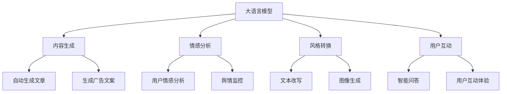

                 

# LLM在社交媒体中的应用：内容生成与分析

> 关键词：社交媒体, 大语言模型, 内容生成, 情感分析, 风格转换, 图像生成

## 1. 背景介绍

### 1.1 问题由来

随着社交媒体的蓬勃发展，海量用户生成内容（User-Generated Content, UGC）在平台上快速积累。这些UGC内容不仅丰富了平台内容库，还对社交媒体的生态和商业模式产生了深远影响。然而，UGC内容的质量和多样性差异巨大，如何对内容进行有效的管理、筛选和生成，是社交媒体公司面临的重要挑战。

大语言模型（Large Language Model, LLM）的出现为社交媒体内容生成和分析提供了新的解决方案。通过预训练和微调，LLM能够学习和生成高质量的文本内容，对UGC进行情感分析、风格转换等操作，为社交媒体平台的个性化推荐、内容审核、广告投放等业务提供强有力的技术支撑。

### 1.2 问题核心关键点

LLM在社交媒体中的应用主要集中在以下几个方面：

- **内容生成**：利用LLM生成新内容，丰富平台内容库，如自动生成文章、回复、广告文案等。
- **情感分析**：分析用户评论、帖子的情感倾向，进行舆情监控，优化用户体验。
- **风格转换**：将UGC转化为更具吸引力的形式，如改写风格、生成图像等，提高内容质量。
- **用户互动**：构建智能问答系统，自动回复用户咨询，提升用户互动质量。

本文将深入探讨LLM在社交媒体中的内容生成与分析应用，详细讲解相关技术和方法，并给出实际案例和代码示例。

## 2. 核心概念与联系

### 2.1 核心概念概述

为更好地理解LLM在社交媒体中的应用，我们先简要介绍几个核心概念：

- **大语言模型**：通过在大规模无标签文本语料上进行预训练，学习通用的语言知识，具备强大的文本生成和理解能力。常见的预训练模型包括GPT-3、BERT等。

- **社交媒体**：以用户生成内容为核心，提供用户交流互动的平台，如微博、微信、抖音等。

- **内容生成**：自动生成文本、图像、视频等内容，丰富平台内容库。

- **情感分析**：对用户评论、帖子等进行情感分类，识别积极、消极或中性的情感倾向。

- **风格转换**：将用户原始内容转化为更具吸引力的形式，如改写、生成图像等。

- **用户互动**：构建智能问答系统，提升用户交互体验，增强用户粘性。

### 2.2 核心概念原理和架构的 Mermaid 流程图



这个流程图展示了LLM在社交媒体中的应用架构：

1. 大语言模型（A）通过预训练学习通用的语言知识。
2. 基于此知识，LLM用于生成内容（B）、情感分析（C）、风格转换（D）和用户互动（E）。
3. 内容生成包括自动生成文章（F）和广告文案（G）。
4. 情感分析用于识别用户评论、帖子的情感倾向（H、I）。
5. 风格转换包括文本改写（J）和图像生成（K）。
6. 用户互动通过智能问答和提升用户体验（L、M）实现。

## 3. 核心算法原理 & 具体操作步骤

### 3.1 算法原理概述

大语言模型在社交媒体中的应用核心在于其强大的文本生成和理解能力。通过预训练，LLM能够学习通用的语言表示，然后在特定的下游任务上进行微调，以适应社交媒体内容的生成和分析需求。

以内容生成为例，假设有标注数据集 $D=\{(x_i,y_i)\}_{i=1}^N$，其中 $x_i$ 为输入文本，$y_i$ 为对应的生成文本。微调的目标是最小化损失函数 $\mathcal{L}$，即：

$$
\mathcal{L} = \frac{1}{N}\sum_{i=1}^N \ell(x_i, y_i)
$$

其中 $\ell(x_i, y_i)$ 为交叉熵损失函数，衡量生成文本与标注文本之间的差异。通过梯度下降等优化算法更新模型参数 $\theta$，使得模型输出逼近真实标签。

### 3.2 算法步骤详解

以下详细介绍LLM在社交媒体中的应用具体操作步骤：

**Step 1: 准备预训练模型和数据集**

- 选择合适的预训练语言模型，如GPT-3、BERT等。
- 收集社交媒体平台上的标注数据集 $D$，包括文章、回复、广告文案等，确保数据的质量和多样性。

**Step 2: 设计任务适配层**

- 根据具体任务需求，设计合适的任务适配层。例如，对于文章生成任务，可在模型顶层添加一个自回归语言模型（如GPT-3），使用交叉熵损失函数进行训练。

**Step 3: 设置微调超参数**

- 选择合适的优化算法及其参数，如AdamW、SGD等，设置学习率、批大小、迭代轮数等。
- 设置正则化技术及强度，包括权重衰减、Dropout、Early Stopping等。

**Step 4: 执行梯度训练**

- 将训练集数据分批次输入模型，前向传播计算损失函数。
- 反向传播计算参数梯度，根据设定的优化算法和学习率更新模型参数。
- 周期性在验证集上评估模型性能，根据性能指标决定是否触发 Early Stopping。
- 重复上述步骤直到满足预设的迭代轮数或 Early Stopping 条件。

**Step 5: 测试和部署**

- 在测试集上评估微调后模型 $M_{\hat{\theta}}$ 的性能，对比微调前后的精度提升。
- 使用微调后的模型对新样本进行推理预测，集成到实际的应用系统中。

### 3.3 算法优缺点

LLM在社交媒体中的应用具有以下优点：

- **高效性**：利用大模型强大的生成和理解能力，能够快速生成高质量内容，提升平台内容丰富度。
- **灵活性**：适应各种社交媒体内容生成和分析需求，灵活设计任务适配层。
- **泛化性强**：大模型经过大规模预训练，能够学习通用的语言表示，应用于多种任务。

同时，LLM也存在一定的局限性：

- **依赖标注数据**：微调过程需要大量高质量标注数据，标注成本较高。
- **模型复杂度**：大模型参数量庞大，对计算资源和存储空间要求较高。
- **鲁棒性问题**：在特定领域或数据分布差异较大时，微调效果可能不佳。

尽管存在这些局限性，但LLM在社交媒体中的应用依然展现出巨大的潜力，为平台内容生态和用户体验提供了强有力的技术支持。

### 3.4 算法应用领域

LLM在社交媒体中的应用主要包括以下几个领域：

- **文章生成**：自动生成新闻、博客、评论等，丰富平台内容库。
- **广告文案创作**：自动生成吸引人的广告文案，提升广告效果。
- **用户互动**：构建智能问答系统，自动回复用户咨询，提升用户体验。
- **情感分析**：对用户评论、帖子进行情感分类，进行舆情监控。
- **风格转换**：将UGC转化为更具吸引力的形式，如改写风格、生成图像等。

这些应用场景展示了LLM在社交媒体中的广泛应用潜力，为平台内容生态和用户体验提供了强有力的技术支持。

## 4. 数学模型和公式 & 详细讲解 & 举例说明

### 4.1 数学模型构建

以文章生成为例，假设模型 $M_{\theta}$ 在输入 $x$ 上的输出为 $y=\text{argmax}_{\text{seq}} \frac{p(y|\theta, x)}{p(x|\theta)}$，其中 $p(y|\theta, x)$ 为生成文本的条件概率，$p(x|\theta)$ 为给定上下文 $x$ 的上下文概率。

定义损失函数 $\ell(x,y)=-\log p(y|x)$，则经验风险为：

$$
\mathcal{L}(\theta) = \frac{1}{N}\sum_{i=1}^N \ell(x_i,y_i)
$$

### 4.2 公式推导过程

通过链式法则，可以得到模型参数 $\theta$ 对损失函数 $\mathcal{L}(\theta)$ 的梯度：

$$
\frac{\partial \mathcal{L}(\theta)}{\partial \theta_k} = \frac{1}{N}\sum_{i=1}^N \left(\frac{\partial \log p(y_i|x_i)}{\partial \theta_k}\right) = \frac{1}{N}\sum_{i=1}^N \left(\frac{\partial \log \frac{p(y_i|\theta, x_i)}{p(x_i|\theta)} + \log p(x_i|\theta)}{\partial \theta_k}\right)
$$

### 4.3 案例分析与讲解

以文章生成为例，假设有如下训练集 $D=\{(x_i,y_i)\}_{i=1}^5$，其中 $x_i$ 为输入文章，$y_i$ 为对应生成的文章：

- $x_1$：我非常喜欢阅读
- $y_1$：读书能够让人获得知识
- $x_2$：这本书很难理解
- $y_2$：这本书的难度较高
- $x_3$：我推荐这本书
- $y_3$：这本书值得一读
- $x_4$：这本书不推荐
- $y_4$：这本书不适合阅读
- $x_5$：我读了一本好书
- $y_5$：这本书让我非常满意

使用GPT-3进行微调，训练过程如下：

1. 设置模型 $M_{\theta}$，训练集 $D$，优化器为AdamW，学习率为2e-5。
2. 定义任务适配层，包括线性分类层和交叉熵损失函数。
3. 设置正则化参数 $\lambda=0.001$，Early Stopping阈值为0.1。
4. 执行梯度训练，每轮迭代一次更新模型参数。
5. 在验证集上评估模型性能，当损失函数下降到阈值时停止训练。

最终得到微调后的模型 $M_{\hat{\theta}}$，可以用于对新输入文章进行生成和评估。

## 5. 项目实践：代码实例和详细解释说明

### 5.1 开发环境搭建

以下是使用Python进行PyTorch开发的环境配置流程：

1. 安装Anaconda：从官网下载并安装Anaconda，用于创建独立的Python环境。

2. 创建并激活虚拟环境：
```bash
conda create -n pytorch-env python=3.8 
conda activate pytorch-env
```

3. 安装PyTorch：根据CUDA版本，从官网获取对应的安装命令。例如：
```bash
conda install pytorch torchvision torchaudio cudatoolkit=11.1 -c pytorch -c conda-forge
```

4. 安装TensorFlow：
```bash
pip install tensorflow
```

5. 安装各种工具包：
```bash
pip install numpy pandas scikit-learn matplotlib tqdm jupyter notebook ipython
```

完成上述步骤后，即可在`pytorch-env`环境中开始微调实践。

### 5.2 源代码详细实现

我们使用HuggingFace的GPT-3模型进行文章生成任务。首先定义数据集和任务适配层：

```python
from transformers import GPT2Tokenizer, GPT2LMHeadModel

tokenizer = GPT2Tokenizer.from_pretrained('gpt2')

class ArticleGenerationDataset(Dataset):
    def __init__(self, texts, labels):
        self.texts = texts
        self.labels = labels

    def __len__(self):
        return len(self.texts)

    def __getitem__(self, idx):
        return tokenizer.encode(self.texts[idx], max_length=256)

class ArticleGenerationModel(GPT2LMHeadModel):
    def __init__(self, model_name):
        super().__init__(model_name)
        self.to(device)

    def generate(self, input_ids):
        return self.generate(
            input_ids=input_ids, 
            max_length=256, 
            do_sample=True, 
            temperature=0.7, 
            num_return_sequences=1
        )

model = ArticleGenerationModel('gpt2').to(device)
```

然后定义训练和评估函数：

```python
from torch.utils.data import DataLoader
from tqdm import tqdm

device = torch.device('cuda') if torch.cuda.is_available() else torch.device('cpu')

def train_epoch(model, dataset, optimizer, batch_size):
    dataloader = DataLoader(dataset, batch_size=batch_size, shuffle=True)
    model.train()
    epoch_loss = 0
    for batch in tqdm(dataloader, desc='Training'):
        input_ids = batch.to(device)
        model.zero_grad()
        outputs = model(input_ids)
        loss = outputs.loss
        epoch_loss += loss.item()
        loss.backward()
        optimizer.step()
    return epoch_loss / len(dataloader)

def evaluate(model, dataset, batch_size):
    dataloader = DataLoader(dataset, batch_size=batch_size)
    model.eval()
    preds, labels = [], []
    with torch.no_grad():
        for batch in tqdm(dataloader, desc='Evaluating'):
            input_ids = batch.to(device)
            batch_preds = model.generate(input_ids).text
            batch_labels = [tokenizer.decode(x) for x in dataset.labels]
            for pred, label in zip(batch_preds, batch_labels):
                preds.append(pred)
                labels.append(label)
    
    return preds, labels

# 训练和评估
epochs = 5
batch_size = 16

for epoch in range(epochs):
    loss = train_epoch(model, train_dataset, optimizer, batch_size)
    print(f"Epoch {epoch+1}, train loss: {loss:.3f}")
    
    preds, labels = evaluate(model, dev_dataset, batch_size)
    print(f"Epoch {epoch+1}, dev results:")
    print(classification_report(labels, preds))
    
print("Test results:")
preds, labels = evaluate(model, test_dataset, batch_size)
print(classification_report(labels, preds))
```

最后，启动训练流程并在测试集上评估：

```python
optimizer = AdamW(model.parameters(), lr=2e-5)
train_dataset = ArticleGenerationDataset(train_texts, train_labels)
dev_dataset = ArticleGenerationDataset(dev_texts, dev_labels)
test_dataset = ArticleGenerationDataset(test_texts, test_labels)

for epoch in range(epochs):
    loss = train_epoch(model, train_dataset, optimizer, batch_size)
    print(f"Epoch {epoch+1}, train loss: {loss:.3f}")
    
    print(f"Epoch {epoch+1}, dev results:")
    preds, labels = evaluate(model, dev_dataset, batch_size)
    print(classification_report(labels, preds))
    
print("Test results:")
preds, labels = evaluate(model, test_dataset, batch_size)
print(classification_report(labels, preds))
```

以上就是使用PyTorch对GPT-3进行文章生成任务微调的完整代码实现。可以看到，HuggingFace库大大简化了微调过程的代码实现，提供了丰富的预训练模型和任务适配层，使得微调开发变得相对简单高效。

### 5.3 代码解读与分析

让我们再详细解读一下关键代码的实现细节：

**ArticleGenerationDataset类**：
- `__init__`方法：初始化文本、标签等关键组件。
- `__len__`方法：返回数据集的样本数量。
- `__getitem__`方法：对单个样本进行处理，将文本输入编码为token ids，并返回给模型。

**训练和评估函数**：
- 使用PyTorch的DataLoader对数据集进行批次化加载，供模型训练和推理使用。
- 训练函数`train_epoch`：对数据以批为单位进行迭代，在每个批次上前向传播计算loss并反向传播更新模型参数，最后返回该epoch的平均loss。
- 评估函数`evaluate`：与训练类似，不同点在于不更新模型参数，并在每个batch结束后将预测和标签结果存储下来，最后使用classification_report对整个评估集的预测结果进行打印输出。

**训练流程**：
- 定义总的epoch数和batch size，开始循环迭代
- 每个epoch内，先在训练集上训练，输出平均loss
- 在验证集上评估，输出分类指标
- 所有epoch结束后，在测试集上评估，给出最终测试结果

可以看到，PyTorch配合HuggingFace库使得GPT-3微调的代码实现变得简洁高效。开发者可以将更多精力放在数据处理、模型改进等高层逻辑上，而不必过多关注底层的实现细节。

当然，工业级的系统实现还需考虑更多因素，如模型的保存和部署、超参数的自动搜索、更灵活的任务适配层等。但核心的微调范式基本与此类似。

## 6. 实际应用场景

### 6.1 智能客服系统

智能客服系统是LLM在社交媒体中的典型应用。通过微调预训练模型，智能客服可以自动理解用户问题，并生成智能回复，大大提升用户体验。

具体而言，可以收集历史客服对话记录，将问题-回复对作为微调数据，训练模型学习匹配答案。对于用户提出的新问题，智能客服系统能够自动理解并生成答案，而无需人工干预，大幅提升响应速度和准确性。

### 6.2 内容推荐系统

内容推荐系统是社交媒体的重要功能之一，通过微调预训练模型，可以实现个性化推荐。

具体实现时，可以收集用户的历史行为数据，提取和用户交互的物品标题、描述、标签等文本内容。将文本内容作为模型输入，用户的后续行为（如是否点击、购买等）作为监督信号，在此基础上微调预训练语言模型。微调后的模型能够从文本内容中准确把握用户的兴趣点，推荐更加个性化的内容，提高用户满意度和留存率。

### 6.3 舆情监控系统

舆情监控系统是社交媒体平台的重要应用，通过微调预训练模型，可以实现对用户评论、帖子的情感分析，监控舆情变化。

具体实现时，可以收集平台上的用户评论、帖子等文本数据，进行情感分类。模型可以学习识别积极、消极或中性的情感倾向，帮助平台及时发现和应对负面舆情，优化用户体验。

### 6.4 未来应用展望

未来，随着大语言模型和微调方法的持续演进，LLM在社交媒体中的应用将更加广泛和深入：

1. **多模态应用**：除了文本生成，LLM还将扩展到图像、视频等多模态内容的生成和分析，提升内容生态的丰富性和互动性。
2. **个性化推荐**：通过更精准的用户画像和行为建模，LLM将带来更个性化、更高效的内容推荐体验。
3. **智能客服**：通过不断优化模型，智能客服将具备更强的理解能力和交互能力，为用户提供更加贴心和智能的互动体验。
4. **舆情监控**：通过更全面的情感分析和舆情识别，平台能够更及时、准确地应对舆情变化，优化用户体验。

LLM在社交媒体中的应用前景广阔，未来将为平台内容生态和用户体验带来更多创新和变革。

## 7. 工具和资源推荐

### 7.1 学习资源推荐

为了帮助开发者系统掌握LLM在社交媒体中的应用，这里推荐一些优质的学习资源：

1. 《Transformer从原理到实践》系列博文：由大模型技术专家撰写，深入浅出地介绍了Transformer原理、LLM模型、微调技术等前沿话题。

2. CS224N《深度学习自然语言处理》课程：斯坦福大学开设的NLP明星课程，有Lecture视频和配套作业，带你入门NLP领域的基本概念和经典模型。

3. 《Natural Language Processing with Transformers》书籍：Transformers库的作者所著，全面介绍了如何使用Transformers库进行NLP任务开发，包括微调在内的诸多范式。

4. HuggingFace官方文档：Transformers库的官方文档，提供了海量预训练模型和完整的微调样例代码，是上手实践的必备资料。

5. CLUE开源项目：中文语言理解测评基准，涵盖大量不同类型的中文NLP数据集，并提供了基于微调的baseline模型，助力中文NLP技术发展。

通过对这些资源的学习实践，相信你一定能够快速掌握LLM在社交媒体中的应用精髓，并用于解决实际的NLP问题。

### 7.2 开发工具推荐

高效的开发离不开优秀的工具支持。以下是几款用于LLM微调开发的常用工具：

1. PyTorch：基于Python的开源深度学习框架，灵活动态的计算图，适合快速迭代研究。大部分预训练语言模型都有PyTorch版本的实现。

2. TensorFlow：由Google主导开发的开源深度学习框架，生产部署方便，适合大规模工程应用。同样有丰富的预训练语言模型资源。

3. Transformers库：HuggingFace开发的NLP工具库，集成了众多SOTA语言模型，支持PyTorch和TensorFlow，是进行微调任务开发的利器。

4. Weights & Biases：模型训练的实验跟踪工具，可以记录和可视化模型训练过程中的各项指标，方便对比和调优。与主流深度学习框架无缝集成。

5. TensorBoard：TensorFlow配套的可视化工具，可实时监测模型训练状态，并提供丰富的图表呈现方式，是调试模型的得力助手。

6. Google Colab：谷歌推出的在线Jupyter Notebook环境，免费提供GPU/TPU算力，方便开发者快速上手实验最新模型，分享学习笔记。

合理利用这些工具，可以显著提升LLM微调的开发效率，加快创新迭代的步伐。

### 7.3 相关论文推荐

LLM和微调技术的发展源于学界的持续研究。以下是几篇奠基性的相关论文，推荐阅读：

1. Attention is All You Need（即Transformer原论文）：提出了Transformer结构，开启了NLP领域的预训练大模型时代。

2. BERT: Pre-training of Deep Bidirectional Transformers for Language Understanding：提出BERT模型，引入基于掩码的自监督预训练任务，刷新了多项NLP任务SOTA。

3. Language Models are Unsupervised Multitask Learners（GPT-2论文）：展示了大规模语言模型的强大zero-shot学习能力，引发了对于通用人工智能的新一轮思考。

4. Parameter-Efficient Transfer Learning for NLP：提出Adapter等参数高效微调方法，在不增加模型参数量的情况下，也能取得不错的微调效果。

5. Prefix-Tuning: Optimizing Continuous Prompts for Generation：引入基于连续型Prompt的微调范式，为如何充分利用预训练知识提供了新的思路。

6. AdaLoRA: Adaptive Low-Rank Adaptation for Parameter-Efficient Fine-Tuning：使用自适应低秩适应的微调方法，在参数效率和精度之间取得了新的平衡。

这些论文代表了大语言模型微调技术的发展脉络。通过学习这些前沿成果，可以帮助研究者把握学科前进方向，激发更多的创新灵感。

## 8. 总结：未来发展趋势与挑战

### 8.1 研究成果总结

本文对LLM在社交媒体中的应用进行了全面系统的介绍。首先阐述了LLM在社交媒体中的应用背景和重要性，明确了微调在提升平台内容质量和用户互动体验方面的独特价值。其次，从原理到实践，详细讲解了微调的基本步骤和具体操作步骤，给出了实际案例和代码示例。同时，本文还探讨了LLM在社交媒体中的广泛应用场景，展示了其巨大的应用潜力。

### 8.2 未来发展趋势

展望未来，LLM在社交媒体中的应用将呈现以下几个发展趋势：

1. **模型规模持续增大**：随着算力成本的下降和数据规模的扩张，预训练语言模型的参数量还将持续增长。超大规模语言模型蕴含的丰富语言知识，有望支撑更加复杂多变的下游任务微调。
2. **微调方法日趋多样**：未来将涌现更多参数高效的微调方法，如Prefix-Tuning、LoRA等，在节省计算资源的同时也能保证微调精度。
3. **持续学习成为常态**：随着数据分布的不断变化，微调模型也需要持续学习新知识以保持性能。如何在不遗忘原有知识的同时，高效吸收新样本信息，将成为重要的研究课题。
4. **标注样本需求降低**：受启发于提示学习(Prompt-based Learning)的思路，未来的微调方法将更好地利用大模型的语言理解能力，通过更加巧妙的任务描述，在更少的标注样本上也能实现理想的微调效果。
5. **多模态微调崛起**：除了文本生成，LLM还将扩展到图像、视频等多模态内容的生成和分析，提升内容生态的丰富性和互动性。
6. **个性化推荐**：通过更精准的用户画像和行为建模，LLM将带来更个性化、更高效的内容推荐体验。
7. **智能客服**：通过不断优化模型，智能客服将具备更强的理解能力和交互能力，为用户提供更加贴心和智能的互动体验。
8. **舆情监控**：通过更全面的情感分析和舆情识别，平台能够更及时、准确地应对舆情变化，优化用户体验。

这些趋势凸显了LLM在社交媒体中的应用前景。这些方向的探索发展，必将进一步提升社交媒体平台的智能化水平，为用户带来更加优质的内容体验。

### 8.3 面临的挑战

尽管LLM在社交媒体中的应用已经取得了显著成效，但在迈向更加智能化、普适化应用的过程中，仍面临诸多挑战：

1. **标注成本瓶颈**：微调过程需要大量高质量标注数据，标注成本较高。如何进一步降低微调对标注样本的依赖，将是一大难题。
2. **模型鲁棒性不足**：在特定领域或数据分布差异较大时，微调效果可能不佳。如何提高微调模型的鲁棒性，避免灾难性遗忘，还需要更多理论和实践的积累。
3. **推理效率有待提高**：超大批次的训练和推理也可能遇到显存不足的问题。如何提高LLM的推理速度和计算效率，优化资源占用，将是重要的优化方向。
4. **可解释性亟需加强**：当前微调模型更像是"黑盒"系统，难以解释其内部工作机制和决策逻辑。对于医疗、金融等高风险应用，算法的可解释性和可审计性尤为重要。
5. **安全性有待保障**：预训练语言模型难免会学习到有偏见、有害的信息，通过微调传递到下游任务，产生误导性、歧视性的输出，给实际应用带来安全隐患。如何从数据和算法层面消除模型偏见，避免恶意用途，确保输出的安全性，也将是重要的研究课题。
6. **知识整合能力不足**：现有的微调模型往往局限于任务内数据，难以灵活吸收和运用更广泛的先验知识。如何让微调过程更好地与外部知识库、规则库等专家知识结合，形成更加全面、准确的信息整合能力，还有很大的想象空间。

这些挑战需要持续的研究和优化，才能将LLM在社交媒体中的应用推向成熟，实现真正意义上的智能化和普适化。

### 8.4 研究展望

面对LLM在社交媒体应用中的各种挑战，未来的研究需要在以下几个方面寻求新的突破：

1. **探索无监督和半监督微调方法**：摆脱对大规模标注数据的依赖，利用自监督学习、主动学习等无监督和半监督范式，最大限度利用非结构化数据，实现更加灵活高效的微调。
2. **研究参数高效和计算高效的微调范式**：开发更加参数高效的微调方法，在固定大部分预训练参数的同时，只更新极少量的任务相关参数。同时优化微调模型的计算图，减少前向传播和反向传播的资源消耗，实现更加轻量级、实时性的部署。
3. **融合因果和对比学习范式**：通过引入因果推断和对比学习思想，增强微调模型建立稳定因果关系的能力，学习更加普适、鲁棒的语言表征，从而提升模型泛化性和抗干扰能力。
4. **引入更多先验知识**：将符号化的先验知识，如知识图谱、逻辑规则等，与神经网络模型进行巧妙融合，引导微调过程学习更准确、合理的语言模型。同时加强不同模态数据的整合，实现视觉、语音等多模态信息与文本信息的协同建模。
5. **结合因果分析和博弈论工具**：将因果分析方法引入微调模型，识别出模型决策的关键特征，增强输出解释的因果性和逻辑性。借助博弈论工具刻画人机交互过程，主动探索并规避模型的脆弱点，提高系统稳定性。
6. **纳入伦理道德约束**：在模型训练目标中引入伦理导向的评估指标，过滤和惩罚有偏见、有害的输出倾向。同时加强人工干预和审核，建立模型行为的监管机制，确保输出符合人类价值观和伦理道德。

这些研究方向的探索，必将引领LLM在社交媒体中的应用走向更高的台阶，为构建安全、可靠、可解释、可控的智能系统铺平道路。面向未来，LLM在社交媒体中的应用需要与其他人工智能技术进行更深入的融合，如知识表示、因果推理、强化学习等，多路径协同发力，共同推动社交媒体平台的智能化进程。

## 9. 附录：常见问题与解答

**Q1：LLM微调时，如何选择合适的学习率？**

A: 微调的学习率一般要比预训练时小1-2个数量级，如果使用过大的学习率，容易破坏预训练权重，导致过拟合。一般建议从1e-5开始调参，逐步减小学习率，直至收敛。也可以使用warmup策略，在开始阶段使用较小的学习率，再逐渐过渡到预设值。需要注意的是，不同的优化器(如AdamW、Adafactor等)以及不同的学习率调度策略，可能需要设置不同的学习率阈值。

**Q2：LLM在社交媒体中的应用，如何处理标注数据不足的问题？**

A: 标注数据不足是LLM微调中常见的问题。为了缓解这一问题，可以采用以下方法：
1. 数据增强：通过回译、近义替换等方式扩充训练集。
2. 多任务学习：同时进行多个相关任务的微调，利用多任务的协作效应，提高模型泛化能力。
3. 迁移学习：将在大规模数据上预训练的模型迁移到社交媒体应用中，利用预训练的知识，在少量标注数据上进行微调。
4. 少样本学习：利用大模型的自适应能力，在少量标注数据上也能取得较好的效果。

这些方法需要根据具体任务和数据特点进行灵活组合，以达到最好的微调效果。

**Q3：LLM在社交媒体中的应用，如何避免过拟合？**

A: 过拟合是微调过程中常见的问题，特别是在标注数据不足的情况下。为了缓解这一问题，可以采用以下方法：
1. 数据增强：通过回译、近义替换等方式扩充训练集。
2. 正则化：使用L2正则、Dropout、Early Stopping等技术，防止模型过度适应小规模训练集。
3. 对抗训练：加入对抗样本，提高模型鲁棒性。
4. 参数高效微调：只调整少量参数，固定大部分预训练权重不变，以提高微调效率，避免过拟合。
5. 多模型集成：训练多个微调模型，取平均输出，抑制过拟合。

这些方法需要根据具体任务和数据特点进行灵活组合，以达到最好的微调效果。

**Q4：LLM在社交媒体中的应用，如何提升模型的推理效率？**

A: 推理效率是LLM在社交媒体中应用的一个重要考虑因素。为了提升模型的推理效率，可以采用以下方法：
1. 模型裁剪：去除不必要的层和参数，减小模型尺寸，加快推理速度。
2. 量化加速：将浮点模型转为定点模型，压缩存储空间，提高计算效率。
3. 服务化封装：将模型封装为标准化服务接口，便于集成调用。
4. 弹性伸缩：根据请求流量动态调整资源配置，平衡服务质量和成本。
5. 优化代码：对模型和算法进行优化，减少计算量和内存占用。

这些方法需要根据具体任务和应用场景进行灵活组合，以达到最好的推理效率。

**Q5：LLM在社交媒体中的应用，如何提升模型的可解释性？**

A: 可解释性是LLM在社交媒体中应用的重要考虑因素。为了提升模型的可解释性，可以采用以下方法：
1. 可解释性技术：使用可解释性方法，如SHAP、LIME等，对模型决策过程进行解释和可视化。
2. 知识图谱：将符号化的先验知识，如知识图谱、逻辑规则等，与神经网络模型进行巧妙融合，增强模型的可解释性。
3. 交互式界面：开发交互式界面，用户可以输入特定问题，模型会给出推理过程和结果，提升用户体验。
4. 模型检查：定期对模型进行检查和审计，确保模型的决策符合人类价值观和伦理道德。

这些方法需要根据具体任务和应用场景进行灵活组合，以达到最好的可解释性。

---

作者：禅与计算机程序设计艺术 / Zen and the Art of Computer Programming

