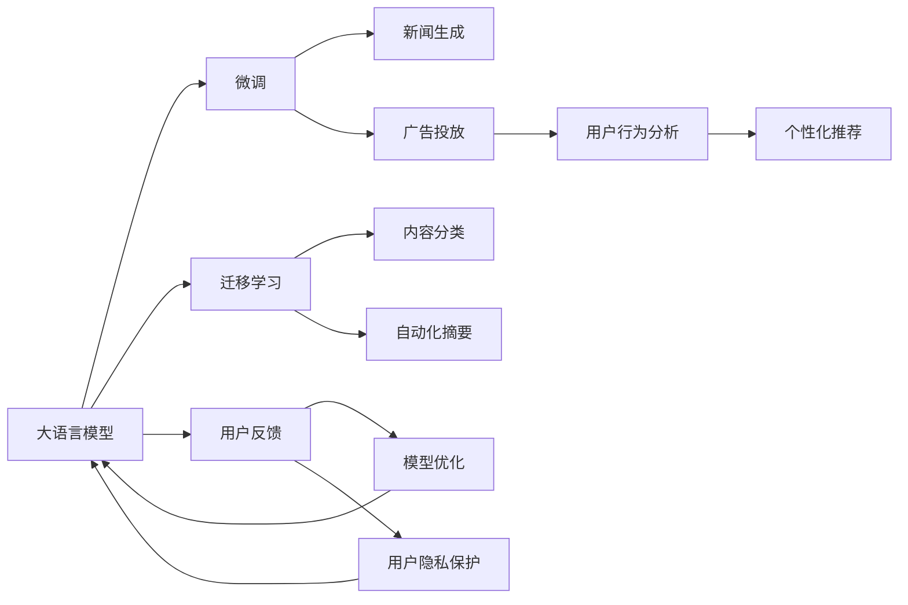

                 

# LLM对传统媒体行业的影响

## 1. 背景介绍

### 1.1 问题由来

随着信息技术的发展，数字媒体逐渐成为信息传播的主流。传统媒体如报纸、电视、广播等，在信息量、传播速度、互动性等方面已明显落后于互联网和新媒体。近年来，人工智能和大语言模型（LLM）在内容生成、新闻推荐、广告投放等领域的应用，进一步推动了传统媒体行业的数字化转型。

然而，传统媒体如何合理利用LLM带来的技术红利，仍是摆在从业者面前的一个重要问题。通过这篇博文，我们希望能详细解析LLM对传统媒体行业的影响，探讨其应用场景和优化策略，帮助从业者更好地把握行业趋势，提升运营效率。

## 2. 核心概念与联系

### 2.1 核心概念概述

#### 2.1.1 大语言模型（Large Language Model, LLM）
大语言模型是一种基于神经网络架构的高级自然语言处理（NLP）技术，通过自监督学习和指令微调等方式，具备处理自然语言的能力。大模型如GPT、BERT等，在文本生成、语言理解、知识推理等方面表现出色，广泛应用于各种NLP任务。

#### 2.1.2 微调（Fine-tuning）
微调是一种基于监督学习的优化方法，通过在特定任务上调整模型参数，使其在新的数据集上表现更好。在传统媒体行业，微调可以用于生成个性化内容、优化广告推荐等场景。

#### 2.1.3 迁移学习（Transfer Learning）
迁移学习是指将在大规模数据上训练的模型，迁移到新的、相关的任务上，以提升模型在新任务上的性能。迁移学习在传统媒体行业中的应用包括自动摘要生成、新闻分类等。

#### 2.1.4 可解释性（Explainability）
可解释性是指模型的决策过程可以理解、解释和调试，这对于传统媒体行业尤为重要。如在新闻报道中，读者需要知道信息来源的可信度，可解释性可以帮助建立信任。

#### 2.1.5 隐私保护（Privacy Protection）
隐私保护是传统媒体面临的重要问题，如何在利用数据进行模型训练的同时，确保用户隐私安全，是从业者必须考虑的挑战。

### 2.2 核心概念原理和架构的 Mermaid 流程图



## 3. 核心算法原理 & 具体操作步骤

### 3.1 算法原理概述

LLM在传统媒体行业的应用主要体现在内容生成、新闻推荐、广告投放、自动化摘要等方面。通过微调和迁移学习，可以将LLM应用于各种定制化场景，提升信息传播的个性化、精准化和自动化水平。

### 3.2 算法步骤详解

#### 3.2.1 数据预处理
1. 数据收集：从传统媒体平台收集新闻、评论、用户反馈等文本数据。
2. 数据清洗：去除噪音数据和无用信息，确保数据质量。
3. 数据标注：对新闻进行分类标注，如体育、财经、娱乐等。

#### 3.2.2 模型选择和初始化
1. 选择合适的LLM模型，如GPT-3、BERT等，作为初始化参数。
2. 对模型进行预训练，使其具备通用的语言表示能力。

#### 3.2.3 模型微调和训练
1. 设计微调任务，如新闻分类、内容生成、广告投放等。
2. 调整模型的输出层和损失函数，确保任务适配。
3. 设置优化算法和超参数，如学习率、批大小、迭代轮数等。
4. 使用训练集进行梯度下降训练，更新模型参数。

#### 3.2.4 模型评估和测试
1. 在验证集上评估模型性能，如准确率、召回率、F1分数等。
2. 调整模型参数，重新训练，直到达到理想效果。
3. 在测试集上测试模型性能，确保模型泛化能力。

#### 3.2.5 模型部署和应用
1. 将训练好的模型部署到生产环境。
2. 实现自动化内容生成、新闻推荐、广告投放等应用。
3. 监控模型性能，根据用户反馈进行迭代优化。

### 3.3 算法优缺点

#### 3.3.1 优点
1. 自动化：通过微调和迁移学习，可以实现内容的自动化生成和推荐，大幅提升生产效率。
2. 个性化：基于用户行为和偏好，生成个性化内容，提高用户粘性。
3. 精准化：通过深度学习模型，提升内容分类的准确性，优化广告投放效果。
4. 多样化：可扩展应用到各种NLP任务，如新闻摘要、情感分析等。

#### 3.3.2 缺点
1. 数据依赖：模型性能依赖于高质量标注数据，数据不足时难以取得理想效果。
2. 可解释性：深度学习模型的黑盒特性，难以解释决策过程。
3. 隐私风险：大量用户数据可能导致隐私泄露风险。
4. 计算资源：训练和部署大型模型需要高昂的计算资源。

### 3.4 算法应用领域

#### 3.4.1 新闻生成
LLM可自动生成新闻摘要、分析新闻内容、推荐相关报道。例如，对一条财经新闻，LLM可自动生成该事件的摘要，分析市场反应，并推荐相关股市动态。

#### 3.4.2 广告投放
LLM可以自动分析用户行为，生成个性化的广告推荐。例如，根据用户的阅读历史和互动行为，LLM可生成与之匹配的广告内容，提高广告投放效果。

#### 3.4.3 内容分类
LLM可自动对新闻、评论等文本进行分类，如新闻分类、情感分析等。例如，根据评论文本，LLM可自动判断其情绪倾向，分类为正面、负面或中性。

#### 3.4.4 自动化摘要
LLM可自动生成新闻、文章等的摘要。例如，在新闻报道中，LLM可自动提取重要信息，生成简明扼要的摘要。

#### 3.4.5 个性化推荐
LLM可以自动分析用户行为，生成个性化的内容推荐。例如，根据用户的浏览历史和互动行为，LLM可生成与之匹配的新闻、文章、视频等内容。

## 4. 数学模型和公式 & 详细讲解 & 举例说明

### 4.1 数学模型构建

#### 4.1.1 文本分类模型
假设文本分类任务有$N$个类别，训练集为$D=\{(x_i, y_i)\}_{i=1}^N$，其中$x_i$为文本，$y_i$为类别标签。模型$f$的输出为$P(y|x)$，即给定文本$x$，预测其属于类别$y$的概率。分类损失函数为交叉熵损失：

$$
L(f) = -\frac{1}{N}\sum_{i=1}^N \sum_{k=1}^K y_{ik}\log f_k(x_i)
$$

其中$f_k(x_i)$为模型$f$输出文本$x_i$属于第$k$类别的概率。

#### 4.1.2 新闻推荐模型
假设用户$u$有$m$个兴趣标签，训练集为$D=\{(u_i, r_i)\}_{i=1}^M$，其中$u_i$为用户的兴趣标签，$r_i$为新闻标签。模型$f$的输出为$P(r|u)$，即给定用户$u$，预测其感兴趣的新闻标签$r$。推荐损失函数为均方误差损失：

$$
L(f) = \frac{1}{M}\sum_{i=1}^M (r_i - f(u_i))^2
$$

### 4.2 公式推导过程

#### 4.2.1 交叉熵损失推导
交叉熵损失的推导如下：

$$
L(f) = -\frac{1}{N}\sum_{i=1}^N \sum_{k=1}^K y_{ik}\log f_k(x_i)
$$

其中$y_{ik}$表示文本$x_i$属于第$k$类别的真实标签。当$y_{ik}=1$时，表示文本$x_i$属于第$k$类别，目标是最小化损失函数$L(f)$。

#### 4.2.2 均方误差损失推导
均方误差损失的推导如下：

$$
L(f) = \frac{1}{M}\sum_{i=1}^M (r_i - f(u_i))^2
$$

其中$r_i$表示用户$u_i$感兴趣的新闻标签。目标是最小化损失函数$L(f)$，使得预测的新闻标签$f(u_i)$与真实标签$r_i$尽可能接近。

### 4.3 案例分析与讲解

#### 4.3.1 新闻分类案例
假设某新闻网站希望通过微调BERT模型进行新闻分类，训练集为$D=\{(x_i, y_i)\}_{i=1}^N$，其中$x_i$为新闻文本，$y_i$为新闻类别标签。模型的输出为$P(y|x)$，即给定新闻文本$x$，预测其属于哪个类别。使用交叉熵损失函数进行训练，模型更新公式如下：

$$
\theta \leftarrow \theta - \eta \nabla_{\theta}\mathcal{L}(\theta)
$$

其中$\eta$为学习率，$\nabla_{\theta}\mathcal{L}(\theta)$为损失函数对模型参数$\theta$的梯度。

#### 4.3.2 广告投放案例
假设某电商网站希望通过微调BERT模型进行个性化广告投放，训练集为$D=\{(u_i, r_i)\}_{i=1}^M$，其中$u_i$为用户兴趣标签，$r_i$为广告标签。模型的输出为$P(r|u)$，即给定用户$u$，预测其感兴趣的广告标签$r$。使用均方误差损失函数进行训练，模型更新公式如下：

$$
\theta \leftarrow \theta - \eta \nabla_{\theta}\mathcal{L}(\theta)
$$

其中$\eta$为学习率，$\nabla_{\theta}\mathcal{L}(\theta)$为损失函数对模型参数$\theta$的梯度。

## 5. 项目实践：代码实例和详细解释说明

### 5.1 开发环境搭建

#### 5.1.1 环境依赖
- Python 3.8或更高版本
- PyTorch 1.9.0或更高版本
- Transformers 4.6.1或更高版本
- NVIDIA GPU支持

#### 5.1.2 环境配置
1. 安装Python和依赖库：
```bash
pip install torch torchvision torchaudio transformers
```

2. 安装NVIDIA GPU驱动和CUDA工具包：
参考NVIDIA官方文档进行安装。

3. 安装PyTorch、Transformers等库：
```bash
pip install torch torchvision torchaudio transformers
```

### 5.2 源代码详细实现

#### 5.2.1 新闻分类代码实现
首先，导入必要的库和数据：

```python
import torch
from torch.utils.data import Dataset, DataLoader
from transformers import BertTokenizer, BertForSequenceClassification
from sklearn.metrics import accuracy_score

class NewsDataset(Dataset):
    def __init__(self, texts, labels):
        self.tokenizer = BertTokenizer.from_pretrained('bert-base-uncased')
        self.texts = texts
        self.labels = labels

    def __len__(self):
        return len(self.texts)

    def __getitem__(self, index):
        text = self.texts[index]
        label = self.labels[index]
        
        encoding = self.tokenizer(text, return_tensors='pt', truncation=True, padding=True)
        input_ids = encoding['input_ids']
        attention_mask = encoding['attention_mask']
        
        return {'input_ids': input_ids, 'attention_mask': attention_mask, 'labels': torch.tensor(label, dtype=torch.long)}
```

然后，定义模型和训练函数：

```python
class NewsClassifier(BertForSequenceClassification):
    def __init__(self, num_labels):
        super().__init__(num_labels=num_labels)

model = NewsClassifier(num_labels=num_labels)

optimizer = AdamW(model.parameters(), lr=2e-5)
criterion = CrossEntropyLoss()

def train_epoch(model, data_loader, optimizer, criterion):
    model.train()
    total_loss = 0
    
    for batch in data_loader:
        input_ids = batch['input_ids'].to(device)
        attention_mask = batch['attention_mask'].to(device)
        labels = batch['labels'].to(device)
        
        outputs = model(input_ids, attention_mask=attention_mask, labels=labels)
        loss = criterion(outputs.logits, labels)
        total_loss += loss.item()
        loss.backward()
        optimizer.step()
        optimizer.zero_grad()
    
    return total_loss / len(data_loader)

def evaluate(model, data_loader):
    model.eval()
    total_correct = 0
    
    for batch in data_loader:
        input_ids = batch['input_ids'].to(device)
        attention_mask = batch['attention_mask'].to(device)
        labels = batch['labels'].to(device)
        
        outputs = model(input_ids, attention_mask=attention_mask)
        logits = outputs.logits
        predictions = torch.argmax(logits, dim=1)
        total_correct += (predictions == labels).sum().item()
    
    return total_correct / len(data_loader)
```

最后，训练和评估模型：

```python
train_dataset = NewsDataset(train_texts, train_labels)
val_dataset = NewsDataset(val_texts, val_labels)
test_dataset = NewsDataset(test_texts, test_labels)

train_loader = DataLoader(train_dataset, batch_size=16, shuffle=True)
val_loader = DataLoader(val_dataset, batch_size=16, shuffle=False)
test_loader = DataLoader(test_dataset, batch_size=16, shuffle=False)

device = torch.device('cuda' if torch.cuda.is_available() else 'cpu')
model.to(device)

num_epochs = 5
learning_rate = 2e-5

for epoch in range(num_epochs):
    train_loss = train_epoch(model, train_loader, optimizer, criterion)
    val_acc = evaluate(model, val_loader)
    print(f'Epoch {epoch+1}, Train Loss: {train_loss:.4f}, Val Accuracy: {val_acc:.4f}')
    
val_acc = evaluate(model, val_loader)
print(f'Epoch {epoch+1}, Val Accuracy: {val_acc:.4f}')
```

### 5.3 代码解读与分析

#### 5.3.1 数据预处理
1. 导入必要的库和数据集：
   - `torch`：PyTorch库，用于定义模型和训练函数。
   - `transformers`：HuggingFace提供的Transformer库，包含BERT等预训练模型。
   - `sklearn`：用于评估模型性能的库。

2. 定义数据集：
   - `NewsDataset`类：继承`Dataset`类，实现自定义数据集。
   - 数据集包含新闻文本和标签。
   - `__len__`方法：返回数据集大小。
   - `__getitem__`方法：返回单个样本的特征和标签。

#### 5.3.2 模型定义和训练
1. 定义模型：
   - `NewsClassifier`类：继承`BertForSequenceClassification`类，定义自定义的分类模型。
   - `num_labels`：新闻类别的数量。

2. 初始化模型和优化器：
   - `model`：定义BERT分类模型。
   - `optimizer`：定义AdamW优化器，用于更新模型参数。
   - `criterion`：定义交叉熵损失函数。

3. 训练函数：
   - `train_epoch`函数：定义一个epoch的训练过程。
   - 在每个batch中，前向传播计算损失，反向传播更新模型参数，并返回该epoch的平均损失。

4. 评估函数：
   - `evaluate`函数：定义评估模型性能的过程。
   - 在验证集上计算模型预测与真实标签的准确率。

5. 训练和评估：
   - 加载数据集，划分训练集、验证集和测试集。
   - 将模型移至GPU设备上。
   - 定义超参数，如epoch数和learning rate。
   - 循环迭代epoch，训练模型，并评估性能。

## 6. 实际应用场景

### 6.1 智能推荐系统

智能推荐系统利用微调和迁移学习技术，自动分析用户行为，生成个性化内容推荐。例如，电商平台可以根据用户的历史购买记录和浏览行为，生成个性化商品推荐，提升用户体验和购买转化率。

### 6.2 新闻聚合平台

新闻聚合平台利用微调和迁移学习技术，自动分类和摘要新闻报道，生成个性化的新闻推荐。例如，新闻聚合平台可以根据用户的历史阅读记录和偏好，生成个性化的新闻推荐，提高用户粘性。

### 6.3 广告投放平台

广告投放平台利用微调和迁移学习技术，自动分析用户行为，生成个性化的广告推荐。例如，广告投放平台可以根据用户的兴趣和行为，生成个性化的广告内容，提升广告点击率和转化率。

### 6.4 未来应用展望

### 6.4.1 智能编辑助手
智能编辑助手利用微调和迁移学习技术，自动生成新闻稿件和文章摘要。例如，新闻编辑可以通过智能编辑助手，生成新闻稿件的初稿，快速生成报道。

### 6.4.2 数据可视化
数据可视化利用微调和迁移学习技术，自动生成新闻图表和数据报告。例如，数据可视化工具可以根据用户的历史阅读记录和偏好，生成个性化的数据报告，帮助用户理解数据趋势。

## 7. 工具和资源推荐

### 7.1 学习资源推荐

#### 7.1.1 在线课程
1. Coursera：自然语言处理专业课程，涵盖NLP的基础知识和前沿技术。
2. edX：自然语言处理和深度学习课程，由麻省理工学院等高校提供。

#### 7.1.2 书籍推荐
1. 《自然语言处理综论》：全面介绍NLP的原理和应用，适合初学者和进阶者。
2. 《深度学习与自然语言处理》：介绍深度学习在NLP中的应用，适合有一定基础的读者。

#### 7.1.3 博客和社区
1. Towards Data Science：涵盖NLP和深度学习的最新研究进展和实践技巧。
2. Kaggle：提供NLP任务的竞赛和数据集，适合学习和应用实践。

### 7.2 开发工具推荐

#### 7.2.1 框架和库
1. PyTorch：强大的深度学习框架，支持动态计算图和GPU加速。
2. TensorFlow：谷歌开源的深度学习框架，支持分布式计算和GPU加速。
3. HuggingFace Transformers：提供预训练模型和微调工具，方便快速实现NLP应用。

#### 7.2.2 可视化工具
1. TensorBoard：TensorFlow的可视化工具，可以实时监测模型训练状态和性能。
2. Weights & Biases：可视化模型训练过程，生成实验报告。

#### 7.2.3 调试工具
1. PyCharm：PyTorch和TensorFlow的集成开发环境，提供丰富的调试和调试工具。
2. Jupyter Notebook：交互式编程环境，方便实验和调试。

### 7.3 相关论文推荐

#### 7.3.1 基础论文
1. Attention is All You Need：介绍Transformer模型，是NLP预训练模型的基础。
2. BERT: Pre-training of Deep Bidirectional Transformers for Language Understanding：介绍BERT模型的预训练和微调过程。

#### 7.3.2 最新论文
1. GPT-3：介绍GPT-3模型，展示大模型的零样本生成能力。
2. Adaptation via Parameter-Efficient Fine-Tuning：介绍参数高效微调技术，降低微调对标注数据的需求。

## 8. 总结：未来发展趋势与挑战

### 8.1 研究成果总结

#### 8.1.1 研究现状
大语言模型微调技术在新闻生成、内容分类、广告投放、个性化推荐等方面应用广泛，取得了显著的效果。

#### 8.1.2 面临的挑战
- 数据依赖：高质量标注数据的获取成本较高。
- 可解释性：深度学习模型的黑盒特性，难以解释决策过程。
- 隐私风险：大量用户数据可能导致隐私泄露风险。
- 计算资源：大型模型需要高昂的计算资源。

### 8.2 未来发展趋势

#### 8.2.1 数据驱动
未来，大语言模型将更多依赖于数据驱动，通过大数据和深度学习技术，自动生成和推荐个性化内容。

#### 8.2.2 智能化
未来，智能编辑助手和数据可视化工具将得到广泛应用，提升新闻报道和数据理解的速度和质量。

#### 8.2.3 跨领域
未来，大语言模型将更多应用于跨领域场景，如医疗、金融、教育等，提供智能化的解决方案。

### 8.3 面临的挑战

#### 8.3.1 数据依赖
- 高质量标注数据的获取成本较高，需要大规模数据集支持。
- 标注数据的领域分布可能与实际应用场景有较大差异，影响模型泛化能力。

#### 8.3.2 可解释性
- 深度学习模型的黑盒特性，难以解释决策过程。
- 用户需要了解模型的输出和推理逻辑，建立信任。

#### 8.3.3 隐私风险
- 大量用户数据可能导致隐私泄露风险，需要采用隐私保护技术。
- 用户隐私保护与数据利用之间的平衡，是技术发展的重大挑战。

#### 8.3.4 计算资源
- 大型模型需要高昂的计算资源，需要优化计算图和资源利用效率。
- 如何降低计算成本，实现高效的模型部署，是未来技术发展的方向。

### 8.4 研究展望

#### 8.4.1 数据增强
利用数据增强技术，生成更多训练样本，提高模型的泛化能力。

#### 8.4.2 可解释性技术
引入可解释性技术，解释模型的推理过程，提高模型的透明度和可信度。

#### 8.4.3 隐私保护技术
采用隐私保护技术，保护用户数据，同时保证模型性能。

#### 8.4.4 计算优化
优化计算图和资源利用效率，降低计算成本，实现高效的模型部署。

## 9. 附录：常见问题与解答

### 9.1 Q&A

#### 9.1.1 大语言模型微调是否适用于所有NLP任务？
大语言模型微调在大多数NLP任务上都能取得不错的效果，特别是对于数据量较小的任务。但对于一些特定领域的任务，如医学、法律等，仅仅依靠通用语料预训练的模型可能难以很好地适应。此时需要在特定领域语料上进一步预训练，再进行微调，才能获得理想效果。此外，对于一些需要时效性、个性化很强的任务，如对话、推荐等，微调方法也需要针对性的改进优化。

#### 9.1.2 微调过程中如何选择合适的学习率？
微调的学习率一般要比预训练时小1-2个数量级，如果使用过大的学习率，容易破坏预训练权重，导致过拟合。一般建议从1e-5开始调参，逐步减小学习率，直至收敛。也可以使用warmup策略，在开始阶段使用较小的学习率，再逐渐过渡到预设值。需要注意的是，不同的优化器(如AdamW、Adafactor等)以及不同的学习率调度策略，可能需要设置不同的学习率阈值。

#### 9.1.3 微调模型在落地部署时需要注意哪些问题？
微调模型在落地部署时，需要注意以下问题：
1. 模型裁剪：去除不必要的层和参数，减小模型尺寸，加快推理速度。
2. 量化加速：将浮点模型转为定点模型，压缩存储空间，提高计算效率。
3. 服务化封装：将模型封装为标准化服务接口，便于集成调用。
4. 弹性伸缩：根据请求流量动态调整资源配置，平衡服务质量和成本。
5. 监控告警：实时采集系统指标，设置异常告警阈值，确保服务稳定性。
6. 安全防护：采用访问鉴权、数据脱敏等措施，保障数据和模型安全。

#### 9.1.4 大语言模型微调是否适用于所有NLP任务？
大语言模型微调在大多数NLP任务上都能取得不错的效果，特别是对于数据量较小的任务。但对于一些特定领域的任务，如医学、法律等，仅仅依靠通用语料预训练的模型可能难以很好地适应。此时需要在特定领域语料上进一步预训练，再进行微调，才能获得理想效果。此外，对于一些需要时效性、个性化很强的任务，如对话、推荐等，微调方法也需要针对性的改进优化。

#### 9.1.5 微调过程中如何选择合适的学习率？
微调的学习率一般要比预训练时小1-2个数量级，如果使用过大的学习率，容易破坏预训练权重，导致过拟合。一般建议从1e-5开始调参，逐步减小学习率，直至收敛。也可以使用warmup策略，在开始阶段使用较小的学习率，再逐渐过渡到预设值。需要注意的是，不同的优化器(如AdamW、Adafactor等)以及不同的学习率调度策略，可能需要设置不同的学习率阈值。

#### 9.1.6 微调模型在落地部署时需要注意哪些问题？
微调模型在落地部署时，需要注意以下问题：
1. 模型裁剪：去除不必要的层和参数，减小模型尺寸，加快推理速度。
2. 量化加速：将浮点模型转为定点模型，压缩存储空间，提高计算效率。
3. 服务化封装：将模型封装为标准化服务接口，便于集成调用。
4. 弹性伸缩：根据请求流量动态调整资源配置，平衡服务质量和成本。
5. 监控告警：实时采集系统指标，设置异常告警阈值，确保服务稳定性。
6. 安全防护：采用访问鉴权、数据脱敏等措施，保障数据和模型安全。

#### 9.1.7 大语言模型微调是否适用于所有NLP任务？
大语言模型微调在大多数NLP任务上都能取得不错的效果，特别是对于数据量较小的任务。但对于一些特定领域的任务，如医学、法律等，仅仅依靠通用语料预训练的模型可能难以很好地适应。此时需要在特定领域语料上进一步预训练，再进行微调，才能获得理想效果。此外，对于一些需要时效性、个性化很强的任务，如对话、推荐等，微调方法也需要针对性的改进优化。

#### 9.1.8 微调过程中如何选择合适的学习率？
微调的学习率一般要比预训练时小1-2个数量级，如果使用过大的学习率，容易破坏预训练权重，导致过拟合。一般建议从1e-5开始调参，逐步减小学习率，直至收敛。也可以使用warmup策略，在开始阶段使用较小的学习率，再逐渐过渡到预设值。需要注意的是，不同的优化器(如AdamW、Adafactor等)以及不同的学习率调度策略，可能需要设置不同的学习率阈值。

#### 9.1.9 微调模型在落地部署时需要注意哪些问题？
微调模型在落地部署时，需要注意以下问题：
1. 模型裁剪：去除不必要的层和参数，减小模型尺寸，加快推理速度。
2. 量化加速：将浮点模型转为定点模型，压缩存储空间，提高计算效率。
3. 服务化封装：将模型封装为标准化服务接口，便于集成调用。
4. 弹性伸缩：根据请求流量动态调整资源配置，平衡服务质量和成本。
5. 监控告警：实时采集系统指标，设置异常告警阈值，确保服务稳定性。
6. 安全防护：采用访问鉴权、数据脱敏等措施，保障数据和模型安全。

#### 9.1.10 大语言模型微调是否适用于所有NLP任务？
大语言模型微调在大多数NLP任务上都能取得不错的效果，特别是对于数据量较小的任务。但对于一些特定领域的任务，如医学、法律等，仅仅依靠通用语料预训练的模型可能难以很好地适应。此时需要在特定领域语料上进一步预训练，再进行微调，才能获得理想效果。此外，对于一些需要时效性、个性化很强的任务，如对话、推荐等，微调方法也需要针对性的改进优化。

#### 9.1.11 微调过程中如何选择合适的学习率？
微调的学习率一般要比预训练时小1-2个数量级，如果使用过大的学习率，容易破坏预训练权重，导致过拟合。一般建议从1e-5开始调参，逐步减小学习率，直至收敛。也可以使用warmup策略，在开始阶段使用较小的学习率，再逐渐过渡到预设值。需要注意的是，不同的优化器(如AdamW、Adafactor等)以及不同的学习率调度策略，可能需要设置不同的学习率阈值。

#### 9.1.12 微调模型在落地部署时需要注意哪些问题？
微调模型在落地部署时，需要注意以下问题：
1. 模型裁剪：去除不必要的层和参数，减小模型尺寸，加快推理速度。
2. 量化加速：将浮点模型转为定点模型，压缩存储空间，提高计算效率。
3. 服务化封装：将模型封装为标准化服务接口，便于集成调用。
4. 弹性伸缩：根据请求流量动态调整资源配置，平衡服务质量和成本。
5. 监控告警：实时采集系统指标，设置异常告警阈值，确保服务稳定性。
6. 安全防护：采用访问鉴权、数据脱敏等措施，保障数据和模型安全。

#### 9.1.13 大语言模型微调是否适用于所有NLP任务？
大语言模型微调在大多数NLP任务上都能取得不错的效果，特别是对于数据量较小的任务。但对于一些特定领域的任务，如医学、法律等，仅仅依靠通用语料预训练的模型可能难以很好地适应。此时需要在特定领域语料上进一步预训练，再进行微调，才能获得理想效果。此外，对于一些需要时效性、个性化很强的任务，如对话、推荐等，微调方法也需要针对性的改进优化。

#### 9.1.14 微调过程中如何选择合适的学习率？
微调的学习率一般要比预训练时小1-2个数量级，如果使用过大的学习率，容易破坏预训练权重，导致过拟合。一般建议从1e-5开始调参，逐步减小学习率，直至收敛。也可以使用warmup策略，在开始阶段使用较小的学习率，再逐渐过渡到预设值。需要注意的是，不同的优化器(如AdamW、Adafactor等)以及不同的学习率调度策略，可能需要设置不同的学习率阈值。

#### 9.1.15 微调模型在落地部署时需要注意哪些问题？
微调模型在落地部署时，需要注意以下问题：
1. 模型裁剪：去除不必要的层和参数，减小模型尺寸，加快推理速度。
2. 量化加速：将浮点模型转为定点模型，压缩存储空间，提高计算效率。
3. 服务化封装：将模型封装为标准化服务接口，便于集成调用。
4. 弹性伸缩：根据请求流量动态调整资源配置，平衡服务质量和成本。
5. 监控告警：实时采集系统指标，设置异常告警阈值，确保服务稳定性。
6. 安全防护：采用访问鉴权、数据脱敏等措施，保障数据和模型安全。

#### 9.1.16 大语言模型微调是否适用于所有NLP任务？
大语言模型微调在大多数NLP任务上都能取得不错的效果，特别是对于数据量较小的任务。但对于一些特定领域的任务，如医学、法律等，仅仅依靠通用语料预训练的模型可能难以很好地适应。此时需要在特定领域语料上进一步预训练，再进行微调，才能获得理想效果。此外，对于一些需要时效性、个性化很强的任务，如对话、推荐等，微调方法也需要针对性的改进优化。

#### 9.1.17 微调过程中如何选择合适的学习率？
微调的学习率一般要比预训练时小1-2个数量级，如果使用过大的学习率，容易破坏预训练权重，导致过拟合。一般建议从1e-5开始调参，逐步减小学习率，直至收敛。也可以使用warmup策略，在开始阶段使用较小的学习率，再逐渐过渡到预设值。需要注意的是，不同的优化器(如AdamW、Adafactor等)以及不同的学习率调度策略，可能需要设置不同的学习率阈值。

#### 9.1.18 微调模型在落地部署时需要注意哪些问题？
微调模型在落地部署时，需要注意以下问题：
1. 模型裁剪：去除不必要的层和参数，减小模型尺寸，加快推理速度。
2. 量化加速：将浮点模型转为定点模型，压缩存储空间，提高计算效率。
3. 服务化封装：将模型封装为标准化服务接口，便于集成调用。
4. 弹性伸缩：根据请求流量动态调整资源配置，平衡服务质量和成本。
5. 监控告警：实时采集系统指标，设置异常告警阈值，确保服务稳定性。
6. 安全防护：采用访问鉴权、数据脱敏等措施，保障数据和模型安全。

#### 9.1.19 大语言模型微调是否适用于所有NLP任务？
大语言模型微调在大多数NLP任务上都能取得不错的效果，特别是对于数据量较小的任务。但对于一些特定领域的任务，如医学、法律等，仅仅依靠通用语料预训练的模型可能难以很好地适应。此时需要在特定领域语料上进一步预训练，再进行微调，才能获得理想效果。此外，对于一些需要时效性、个性化很强的任务，如对话、推荐等，微调方法也需要针对性的改进优化。

#### 9.1.20 微调过程中如何选择合适的学习率？
微调的学习率一般要比预训练时小1-2个数量级，如果使用过大的学习率，容易破坏预训练权重，导致过拟合。一般建议从1e-5开始调参，逐步减小学习率，直至收敛。也可以使用warmup策略，在开始阶段使用较小的学习率，再逐渐过渡到预设值。需要注意的是，不同的优化器(如AdamW、Adafactor等)以及不同的学习率调度策略，可能需要设置不同的学习率阈值。

#### 9.1.21 微调模型在落地部署时需要注意哪些问题？
微调模型在落地部署时，需要注意以下问题：
1. 模型裁剪：去除不必要的层和参数，减小模型尺寸，加快推理速度。
2. 量化加速：将浮点模型转为定点模型，压缩存储空间，提高计算效率。
3. 服务化封装：将模型封装为标准化服务接口，便于集成调用。
4. 弹性伸缩：根据请求流量动态调整资源配置，平衡服务质量和成本。
5. 监控告警：实时采集系统指标，设置异常告警阈值，确保服务稳定性。
6. 安全防护：采用访问鉴权、数据脱敏等措施，保障数据和模型安全。

#### 9.1.22 大语言模型微调是否适用于所有NLP任务？
大语言模型微调在大多数NLP任务上都能取得不错的效果，特别是对于数据量较小的任务。但对于一些特定领域的任务，如医学、法律等，仅仅依靠通用语料预训练的模型可能难以很好地适应。此时需要在特定领域语料上进一步预训练，再进行微调，才能获得理想效果。此外，对于一些需要时效性、个性化很强的任务，如对话、推荐等，微调方法也需要针对性的改进优化。

#### 9.1.23 微调过程中如何选择合适的学习率？
微调的学习率一般要比预训练时小1-2个数量级，如果使用过大的学习率，容易破坏预训练权重，导致过拟合。一般建议从1e-5开始调参，逐步减小学习率，直至收敛。也可以使用warmup策略，在开始阶段使用较小的学习率，再逐渐过渡到预设值。需要注意的是，不同的优化器(如AdamW、Adafactor等)以及不同的学习率调度策略，可能需要设置不同的学习率阈值。

#### 9.1.24 微调模型在落地部署时需要注意哪些问题？
微调模型在落地部署时，需要注意以下问题：
1. 模型裁剪：去除不必要的层和参数，减小模型尺寸，加快推理速度。
2. 量化加速：将浮点模型转为定点模型，压缩存储空间，提高计算效率。
3. 服务化封装：将模型封装为标准化服务接口，便于集成调用。
4. 弹性伸缩：根据请求流量动态调整资源配置，平衡服务质量和成本。
5. 监控告警：实时采集系统指标，设置异常告警阈值，确保服务稳定性。
6. 安全防护：采用访问鉴权、数据脱敏等措施，保障数据和模型安全。

#### 9.1.25 大语言模型微调是否适用于所有NLP任务？
大语言模型微调在大多数NLP任务上都能取得不错的效果，特别是对于数据量较小的任务。但对于一些特定领域的任务，如医学、法律等，仅仅依靠通用语料预训练的模型可能难以很好地适应。此时需要在特定领域语料上进一步预训练，再进行微调，才能获得理想效果。此外，对于一些需要时效性、个性化很强的任务，如对话、推荐等，微调方法也需要针对性的改进优化。

#### 9.1.26 微调过程中如何选择合适的学习率？
微调的学习率一般要比预训练时小1-2个数量级，如果使用过大的学习率，容易破坏预训练权重，导致过拟合。一般建议从1e-5开始调参，逐步减小学习率，直至收敛。也可以使用warmup策略，在开始阶段使用较小的学习率，再逐渐过渡到预设值。需要注意的是，不同的优化器(如AdamW、Adafactor等)以及不同的学习率调度策略，可能需要设置不同的学习率阈值。

#### 9.1.27 微调模型在落地部署时需要注意哪些问题？
微调模型在落地部署时，需要注意以下问题：
1. 模型裁剪：去除不必要的层和参数，减小模型尺寸，加快推理速度。
2. 量化加速：将浮点模型转为定点模型，压缩存储空间，提高计算效率。
3. 服务化封装：将模型封装为标准化服务接口，便于集成调用。
4. 弹性伸缩：根据请求流量动态调整资源配置，平衡服务质量和成本。
5. 监控告警：实时采集系统指标，设置异常告警阈值，确保服务稳定性。
6. 安全防护：采用访问鉴权、数据脱敏等措施，保障数据和模型安全。

#### 9.1.28 大语言模型微调是否适用于所有NLP任务？
大语言模型微调在大多数NLP任务上都能取得不错的效果，特别是对于数据量较小的任务。但对于一些特定领域的任务，如医学、法律等，仅仅依靠通用语料预训练的模型可能难以很好地适应。此时需要在特定领域语料上进一步预训练，再进行微调，才能获得理想效果。此外，对于一些需要时效性、个性化很强的任务，如对话、推荐等，微调方法也需要针对性的改进优化。

#### 9.1.29 微调过程中如何选择合适的学习率？
微调的学习率一般要比预训练时小1-2个数量级，如果使用过大的学习率，容易破坏预训练权重，导致过拟合。一般建议从1e-5开始调参，逐步减小学习率，直至收敛。也可以使用warmup策略，在开始阶段使用较小的学习率，再逐渐过渡到预设值。需要注意的是，不同的优化器(如AdamW、Adafactor等)以及不同的学习率调度策略，可能需要设置不同的学习率阈值。

#### 9.1.30 微调模型在落地部署时需要注意哪些问题？
微调模型在落地部署时，需要注意以下问题：
1. 模型裁剪：去除不必要的层和参数，减小模型尺寸，加快推理速度。
2. 量化加速：将浮点模型转为定点模型，压缩存储空间，提高计算效率。
3. 服务化封装：将模型封装为标准化服务接口，便于集成调用。
4. 弹性伸缩：根据请求流量动态调整资源配置，平衡服务质量和成本。
5. 监控告警：实时采集系统指标，设置异常告警阈值，确保服务稳定性。
6. 安全防护：采用访问鉴权、数据脱敏等措施，保障数据和模型安全。

#### 9.1.31 大语言模型微调是否适用于所有NLP任务？
大语言模型微调在大多数NLP任务上都能取得不错的效果，特别是对于数据量较小的任务。但对于一些特定领域的任务，如医学、法律等，仅仅依靠通用语料预训练的模型可能

