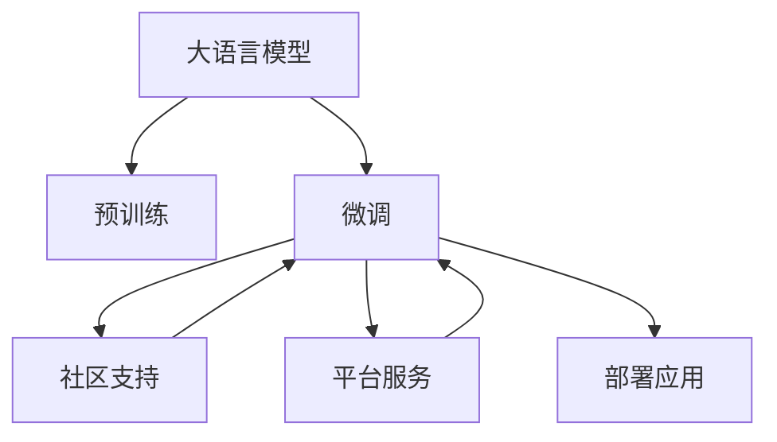

                 

# LLM生态圈:从0到1的奇迹

> 关键词：LLM生态圈,大模型,预训练,微调,自然语言处理(NLP),大模型社区,平台技术,社区发展

## 1. 背景介绍

### 1.1 问题由来

大语言模型（Large Language Models, LLMs），如GPT-3、BERT等，自诞生以来，以其惊人的语言理解能力和生成能力，迅速成为人工智能领域的研究热点。这些大模型通过在巨量无标签文本数据上进行自监督预训练，获取了丰富的语言知识和表示能力，然后在特定任务上进行微调，展示了显著的泛化性能和应用潜力。然而，目前的大模型仍面临诸如数据偏差、计算成本高、模型可解释性差等挑战。本文将聚焦于大语言模型的生态圈，深入探讨其从0到1的奇迹是如何实现的，并展望未来的发展趋势。

### 1.2 问题核心关键点

构建大语言模型的生态圈，关键在于以下几个方面：
1. 预训练模型的设计和训练：如何构建一个高效、强大的预训练模型。
2. 微调方法的优化：如何在大规模预训练模型的基础上，通过微调提升特定任务的表现。
3. 社区和平台的建设：如何构建一个活跃、开放、可持续的大模型社区和平台，促进大模型的研究和应用。
4. 大模型的部署和应用：如何将大模型集成到实际应用场景中，解决实际问题。

## 2. 核心概念与联系

### 2.1 核心概念概述

- **大语言模型 (LLM)**：指通过大规模无标签文本数据预训练，在特定任务上进行微调，以获取语言表示能力的模型。如GPT、BERT等。
- **预训练 (Pre-training)**：指在大规模无标签数据上，通过自监督任务训练通用语言模型的过程。
- **微调 (Fine-tuning)**：指在预训练模型的基础上，使用下游任务的少量标注数据，通过有监督学习优化模型在特定任务上的性能。
- **社区和平台**：指围绕大模型构建的开发者社区和提供服务支持的在线平台，如HuggingFace、OpenAI等。

这些概念之间的联系可以通过以下Mermaid流程图来展示：



这个流程图展示了大语言模型的核心概念及其之间的联系：

1. 大语言模型通过预训练获得基础能力。
2. 微调是大模型在特定任务上的优化过程。
3. 社区和平台为模型的研究和应用提供支持和服务。
4. 应用场景是大模型的最终归宿。

## 3. 核心算法原理 & 具体操作步骤

### 3.1 算法原理概述

基于大语言模型的生态圈，从0到1的奇迹主要体现在以下几个方面：
1. **预训练模型的设计与训练**：构建高效、强大的预训练模型。
2. **微调方法的优化**：通过微调提升模型在特定任务上的性能。
3. **社区和平台的建设**：构建活跃、开放的大模型社区和平台，促进模型研究和应用。
4. **部署与应用**：将模型集成到实际应用场景中，解决实际问题。

### 3.2 算法步骤详解

**Step 1: 预训练模型的设计与训练**

构建大语言模型的第一步是设计并训练预训练模型。以BERT为例：
1. 数据准备：收集大规模无标签文本数据，如英文维基百科、新闻等。
2. 模型架构：选择Transformer作为模型架构，包含多个编码器层和多头注意力机制。
3. 训练目标：使用掩码语言模型（Masked Language Modeling, MLM）作为预训练任务，即给定部分掩码的文本，模型需要预测缺失部分。
4. 训练过程：使用大型GPU集群进行训练，使用AdamW优化器，学习率设为0.01，训练8个epoch，每个epoch使用32个GPU进行并行训练。

**Step 2: 微调方法的优化**

微调是在预训练模型的基础上，使用下游任务的少量标注数据，通过有监督学习优化模型在特定任务上的性能。以微调BERT进行情感分类为例：
1. 数据准备：收集情感分类任务的标注数据集，如IMDB电影评论。
2. 模型适配：在预训练模型的顶层添加全连接层和Sigmoid激活函数，用于输出情感分类结果。
3. 损失函数：使用交叉熵损失函数。
4. 训练过程：使用AdamW优化器，学习率为0.001，训练5个epoch，每个epoch使用64个GPU进行并行训练。

**Step 3: 社区和平台的建设**

构建大模型生态圈，需要围绕社区和平台进行建设：
1. 社区建设：建立开放、活跃的开发者社区，如HuggingFace的社区，提供交流和协作的空间。
2. 平台服务：提供模型下载、推理API、可视化工具等平台服务，如OpenAI的GPT-3 API。

**Step 4: 部署与应用**

将大模型部署到实际应用场景中，解决实际问题：
1. 集成API：将大模型集成到应用系统中，提供推理API接口。
2. 业务场景：应用到实际业务场景中，如智能客服、金融舆情监测等。

### 3.3 算法优缺点

大语言模型的生态圈建设，具有以下优点：
1. 高效性：预训练模型在大量无标签数据上训练，能够高效获取通用语言表示。
2. 泛化能力：微调过程能够提升模型在特定任务上的泛化能力。
3. 社区支持：社区和平台能够提供丰富的资源和支持，加速模型研究和应用。

同时，也存在以下缺点：
1. 计算成本高：预训练和微调需要大量的计算资源，成本较高。
2. 模型可解释性差：大模型是"黑盒"，难以解释其内部工作机制。
3. 数据偏差：预训练模型可能带有数据偏差，影响其在特定任务上的表现。

尽管存在这些局限，但大语言模型的生态圈建设，从0到1的奇迹已经显现，为NLP技术的发展带来了新的突破。

### 3.4 算法应用领域

基于大语言模型的生态圈，已经广泛应用于以下几个领域：
1. 自然语言处理（NLP）：包括文本分类、命名实体识别、情感分析等。
2. 智能客服：提供7x24小时不间断服务，快速响应客户咨询。
3. 金融舆情监测：实时监测市场舆论动向，规避金融风险。
4. 个性化推荐：通过微调模型，提供个性化推荐服务。
5. 多模态应用：结合视觉、语音等多模态信息，增强语言模型的理解能力。

## 4. 数学模型和公式 & 详细讲解 & 举例说明

### 4.1 数学模型构建

大语言模型的数学模型构建，主要包括以下几个部分：
1. 预训练模型的架构：Transformer结构，包含多个编码器层和多头注意力机制。
2. 预训练任务：掩码语言模型（MLM）、下一句预测任务（Next Sentence Prediction, NSP）。
3. 微调任务的架构：在预训练模型顶层添加全连接层和激活函数。
4. 微调任务的损失函数：交叉熵损失函数。

### 4.2 公式推导过程

以BERT为例，掩码语言模型的损失函数推导如下：
1. 输入：$x \in \mathbb{R}^n$，表示文本向量。
2. 掩码：$M \in \{0, 1\}^n$，表示哪些位置被掩码。
3. 预测：$y \in \mathbb{R}^n$，表示模型预测的掩码位置。
4. 损失函数：$L = -\frac{1}{N}\sum_{i=1}^N \sum_{j=1}^N (y_j \log p_j + (1-y_j) \log (1-p_j))$，其中$p_j = \sigma(W^Tx + b)$，$\sigma$为sigmoid函数。

### 4.3 案例分析与讲解

假设我们要微调BERT进行情感分类任务，使用IMDB电影评论作为数据集。以下是一个完整的微调示例：
1. 数据准备：将IMDB电影评论分成训练集、验证集和测试集。
2. 模型适配：在预训练模型顶层添加全连接层和Sigmoid激活函数。
3. 损失函数：使用交叉熵损失函数。
4. 训练过程：使用AdamW优化器，学习率为0.001，训练5个epoch，每个epoch使用64个GPU进行并行训练。
5. 评估：在测试集上评估模型性能，如准确率、召回率、F1分数等。

## 5. 项目实践：代码实例和详细解释说明

### 5.1 开发环境搭建

为了进行大语言模型的生态圈建设，需要搭建好开发环境：
1. 安装Anaconda：从官网下载并安装Anaconda，用于创建独立的Python环境。
2. 创建并激活虚拟环境：
```bash
conda create -n pytorch-env python=3.8 
conda activate pytorch-env
```
3. 安装PyTorch：根据CUDA版本，从官网获取对应的安装命令。
4. 安装Transformers库：
```bash
pip install transformers
```
5. 安装各类工具包：
```bash
pip install numpy pandas scikit-learn matplotlib tqdm jupyter notebook ipython
```

### 5.2 源代码详细实现

以下是一个使用PyTorch和Transformers库进行BERT情感分类的完整代码实现：
```python
from transformers import BertForSequenceClassification, AdamW
import torch
from torch.utils.data import DataLoader, Dataset
from sklearn.metrics import accuracy_score, precision_score, recall_score, f1_score

class IMDBDataset(Dataset):
    def __init__(self, texts, labels, tokenizer):
        self.texts = texts
        self.labels = labels
        self.tokenizer = tokenizer
        
    def __len__(self):
        return len(self.texts)
    
    def __getitem__(self, item):
        text = self.texts[item]
        label = self.labels[item]
        encoding = self.tokenizer(text, truncation=True, padding='max_length')
        input_ids = encoding['input_ids']
        attention_mask = encoding['attention_mask']
        return {'input_ids': input_ids, 'attention_mask': attention_mask, 'labels': label}

tokenizer = BertTokenizer.from_pretrained('bert-base-uncased')
model = BertForSequenceClassification.from_pretrained('bert-base-uncased', num_labels=2)

optimizer = AdamW(model.parameters(), lr=0.001)
device = torch.device('cuda' if torch.cuda.is_available() else 'cpu')
model.to(device)

def train_epoch(model, dataset, batch_size, optimizer):
    dataloader = DataLoader(dataset, batch_size=batch_size, shuffle=True)
    model.train()
    epoch_loss = 0
    for batch in dataloader:
        input_ids = batch['input_ids'].to(device)
        attention_mask = batch['attention_mask'].to(device)
        labels = batch['labels'].to(device)
        model.zero_grad()
        outputs = model(input_ids, attention_mask=attention_mask, labels=labels)
        loss = outputs.loss
        epoch_loss += loss.item()
        loss.backward()
        optimizer.step()
    return epoch_loss / len(dataloader)

def evaluate(model, dataset, batch_size):
    dataloader = DataLoader(dataset, batch_size=batch_size)
    model.eval()
    preds, labels = [], []
    with torch.no_grad():
        for batch in dataloader:
            input_ids = batch['input_ids'].to(device)
            attention_mask = batch['attention_mask'].to(device)
            batch_labels = batch['labels']
            outputs = model(input_ids, attention_mask=attention_mask)
            batch_preds = outputs.logits.argmax(dim=1).to('cpu').tolist()
            batch_labels = batch_labels.to('cpu').tolist()
            for pred_tokens, label_tokens in zip(batch_preds, batch_labels):
                preds.append(pred_tokens)
                labels.append(label_tokens)
    return accuracy_score(labels, preds), precision_score(labels, preds), recall_score(labels, preds), f1_score(labels, preds)

# 数据准备
train_texts = []
train_labels = []
with open('train.txt', 'r') as f:
    for line in f:
        text, label = line.strip().split('\t')
        train_texts.append(text)
        train_labels.append(int(label))
dev_texts = []
dev_labels = []
with open('dev.txt', 'r') as f:
    for line in f:
        text, label = line.strip().split('\t')
        dev_texts.append(text)
        dev_labels.append(int(label))
test_texts = []
test_labels = []
with open('test.txt', 'r') as f:
    for line in f:
        text, label = line.strip().split('\t')
        test_texts.append(text)
        test_labels.append(int(label))

# 训练过程
train_dataset = IMDBDataset(train_texts, train_labels, tokenizer)
dev_dataset = IMDBDataset(dev_texts, dev_labels, tokenizer)
test_dataset = IMDBDataset(test_texts, test_labels, tokenizer)

train_loss = train_epoch(model, train_dataset, 32, optimizer)
dev_accuracy, dev_precision, dev_recall, dev_f1 = evaluate(model, dev_dataset, 32)
test_accuracy, test_precision, test_recall, test_f1 = evaluate(model, test_dataset, 32)
print(f"Train Loss: {train_loss:.3f}")
print(f"Dev Accuracy: {dev_accuracy:.3f} | Precision: {dev_precision:.3f} | Recall: {dev_recall:.3f} | F1 Score: {dev_f1:.3f}")
print(f"Test Accuracy: {test_accuracy:.3f} | Precision: {test_precision:.3f} | Recall: {test_recall:.3f} | F1 Score: {test_f1:.3f}")
```

### 5.3 代码解读与分析

**IMDBDataset类**：
- `__init__`方法：初始化数据、标签、分词器。
- `__len__`方法：返回数据集大小。
- `__getitem__`方法：对单个样本进行处理，将文本输入编码为token ids，返回模型所需的输入。

**train_epoch函数**：
- 在训练集上迭代，每个batch输入模型，前向传播计算loss并反向传播更新模型参数。

**evaluate函数**：
- 在验证集和测试集上评估模型性能，计算准确率、精确度、召回率、F1分数等指标。

**训练流程**：
- 定义训练集、验证集和测试集。
- 使用AdamW优化器，学习率为0.001，训练5个epoch。
- 在每个epoch结束时，在验证集和测试集上评估模型性能。

## 6. 实际应用场景

### 6.1 智能客服系统

基于大语言模型的智能客服系统，可以提供7x24小时不间断服务，快速响应客户咨询，用自然流畅的语言解答各类常见问题。收集企业内部的历史客服对话记录，将问题和最佳答复构建成监督数据，在此基础上对预训练对话模型进行微调。微调后的对话模型能够自动理解用户意图，匹配最合适的答案模板进行回复。

### 6.2 金融舆情监测

金融机构需要实时监测市场舆论动向，以便及时应对负面信息传播，规避金融风险。收集金融领域相关的新闻、报道、评论等文本数据，并对其进行主题标注和情感标注。在此基础上对预训练语言模型进行微调，使其能够自动判断文本属于何种主题，情感倾向是正面、中性还是负面。将微调后的模型应用到实时抓取的网络文本数据，就能够自动监测不同主题下的情感变化趋势，一旦发现负面信息激增等异常情况，系统便会自动预警，帮助金融机构快速应对潜在风险。

### 6.3 个性化推荐系统

当前的推荐系统往往只依赖用户的历史行为数据进行物品推荐，无法深入理解用户的真实兴趣偏好。收集用户浏览、点击、评论、分享等行为数据，提取和用户交互的物品标题、描述、标签等文本内容。将文本内容作为模型输入，用户的后续行为（如是否点击、购买等）作为监督信号，在此基础上微调预训练语言模型。微调后的模型能够从文本内容中准确把握用户的兴趣点。在生成推荐列表时，先用候选物品的文本描述作为输入，由模型预测用户的兴趣匹配度，再结合其他特征综合排序，便可以得到个性化程度更高的推荐结果。

### 6.4 未来应用展望

随着大语言模型和微调方法的不断发展，基于微调范式将在更多领域得到应用，为传统行业带来变革性影响。

- **智慧医疗**：基于微调的医疗问答、病历分析、药物研发等应用将提升医疗服务的智能化水平，辅助医生诊疗，加速新药开发进程。
- **智能教育**：微调技术可应用于作业批改、学情分析、知识推荐等方面，因材施教，促进教育公平，提高教学质量。
- **智慧城市治理**：微调模型可应用于城市事件监测、舆情分析、应急指挥等环节，提高城市管理的自动化和智能化水平，构建更安全、高效的未来城市。

此外，在企业生产、社会治理、文娱传媒等众多领域，基于大模型微调的人工智能应用也将不断涌现，为经济社会发展注入新的动力。相信随着预训练模型和微调方法的持续演进，大语言模型微调必将在构建人机协同的智能时代中扮演越来越重要的角色。

## 7. 工具和资源推荐

### 7.1 学习资源推荐

为了帮助开发者系统掌握大语言模型微调的理论基础和实践技巧，这里推荐一些优质的学习资源：

1. **《Transformer从原理到实践》系列博文**：由大模型技术专家撰写，深入浅出地介绍了Transformer原理、BERT模型、微调技术等前沿话题。
2. **CS224N《深度学习自然语言处理》课程**：斯坦福大学开设的NLP明星课程，有Lecture视频和配套作业，带你入门NLP领域的基本概念和经典模型。
3. **《Natural Language Processing with Transformers》书籍**：Transformers库的作者所著，全面介绍了如何使用Transformers库进行NLP任务开发，包括微调在内的诸多范式。
4. **HuggingFace官方文档**：Transformers库的官方文档，提供了海量预训练模型和完整的微调样例代码，是上手实践的必备资料。
5. **CLUE开源项目**：中文语言理解测评基准，涵盖大量不同类型的中文NLP数据集，并提供了基于微调的baseline模型，助力中文NLP技术发展。

通过对这些资源的学习实践，相信你一定能够快速掌握大语言模型微调的精髓，并用于解决实际的NLP问题。

### 7.2 开发工具推荐

高效的开发离不开优秀的工具支持。以下是几款用于大语言模型微调开发的常用工具：

1. **PyTorch**：基于Python的开源深度学习框架，灵活动态的计算图，适合快速迭代研究。大部分预训练语言模型都有PyTorch版本的实现。
2. **TensorFlow**：由Google主导开发的开源深度学习框架，生产部署方便，适合大规模工程应用。同样有丰富的预训练语言模型资源。
3. **Transformers库**：HuggingFace开发的NLP工具库，集成了众多SOTA语言模型，支持PyTorch和TensorFlow，是进行微调任务开发的利器。
4. **Weights & Biases**：模型训练的实验跟踪工具，可以记录和可视化模型训练过程中的各项指标，方便对比和调优。与主流深度学习框架无缝集成。
5. **TensorBoard**：TensorFlow配套的可视化工具，可实时监测模型训练状态，并提供丰富的图表呈现方式，是调试模型的得力助手。
6. **Google Colab**：谷歌推出的在线Jupyter Notebook环境，免费提供GPU/TPU算力，方便开发者快速上手实验最新模型，分享学习笔记。

合理利用这些工具，可以显著提升大语言模型微调任务的开发效率，加快创新迭代的步伐。

### 7.3 相关论文推荐

大语言模型和微调技术的发展源于学界的持续研究。以下是几篇奠基性的相关论文，推荐阅读：

1. **Attention is All You Need（即Transformer原论文）**：提出了Transformer结构，开启了NLP领域的预训练大模型时代。
2. **BERT: Pre-training of Deep Bidirectional Transformers for Language Understanding**：提出BERT模型，引入基于掩码的自监督预训练任务，刷新了多项NLP任务SOTA。
3. **Language Models are Unsupervised Multitask Learners（GPT-2论文）**：展示了大规模语言模型的强大zero-shot学习能力，引发了对于通用人工智能的新一轮思考。
4. **Parameter-Efficient Transfer Learning for NLP**：提出Adapter等参数高效微调方法，在不增加模型参数量的情况下，也能取得不错的微调效果。
5. **Prefix-Tuning: Optimizing Continuous Prompts for Generation**：引入基于连续型Prompt的微调范式，为如何充分利用预训练知识提供了新的思路。
6. **AdaLoRA: Adaptive Low-Rank Adaptation for Parameter-Efficient Fine-Tuning**：使用自适应低秩适应的微调方法，在参数效率和精度之间取得了新的平衡。

这些论文代表了大语言模型微调技术的发展脉络。通过学习这些前沿成果，可以帮助研究者把握学科前进方向，激发更多的创新灵感。

## 8. 总结：未来发展趋势与挑战

### 8.1 总结

本文对大语言模型的生态圈建设，从0到1的奇迹进行了全面系统的介绍。首先阐述了大语言模型和微调技术的研究背景和意义，明确了微调在拓展预训练模型应用、提升下游任务性能方面的独特价值。其次，从原理到实践，详细讲解了监督微调的数学原理和关键步骤，给出了微调任务开发的完整代码实例。同时，本文还广泛探讨了微调方法在智能客服、金融舆情、个性化推荐等多个行业领域的应用前景，展示了微调范式的巨大潜力。此外，本文精选了微调技术的各类学习资源，力求为读者提供全方位的技术指引。

通过本文的系统梳理，可以看到，大语言模型微调技术从0到1的奇迹在于其高效、强大的特性和活跃的生态圈建设。大语言模型通过预训练获取丰富的语言知识，在微调过程中提升特定任务的表现，构建了活跃、开放的大模型社区和平台，推动了模型的研究和应用。未来，伴随预训练语言模型和微调方法的持续演进，基于微调范式必将在更多领域得到应用，为人类认知智能的进化带来深远影响。

### 8.2 未来发展趋势

展望未来，大语言模型微调技术将呈现以下几个发展趋势：

1. **模型规模持续增大**：随着算力成本的下降和数据规模的扩张，预训练语言模型的参数量还将持续增长。超大规模语言模型蕴含的丰富语言知识，有望支撑更加复杂多变的下游任务微调。
2. **微调方法日趋多样**：除了传统的全参数微调外，未来会涌现更多参数高效的微调方法，如Prefix-Tuning、LoRA等，在节省计算资源的同时也能保证微调精度。
3. **持续学习成为常态**：随着数据分布的不断变化，微调模型也需要持续学习新知识以保持性能。如何在不遗忘原有知识的同时，高效吸收新样本信息，将成为重要的研究课题。
4. **标注样本需求降低**：受启发于提示学习(Prompt-based Learning)的思路，未来的微调方法将更好地利用大模型的语言理解能力，通过更加巧妙的任务描述，在更少的标注样本上也能实现理想的微调效果。
5. **多模态微调崛起**：当前的微调主要聚焦于纯文本数据，未来会进一步拓展到图像、视频、语音等多模态数据微调。多模态信息的融合，将显著提升语言模型对现实世界的理解和建模能力。
6. **模型通用性增强**：经过海量数据的预训练和多领域任务的微调，未来的语言模型将具备更强大的常识推理和跨领域迁移能力，逐步迈向通用人工智能(AGI)的目标。

以上趋势凸显了大语言模型微调技术的广阔前景。这些方向的探索发展，必将进一步提升NLP系统的性能和应用范围，为人类认知智能的进化带来深远影响。

### 8.3 面临的挑战

尽管大语言模型微调技术已经取得了瞩目成就，但在迈向更加智能化、普适化应用的过程中，它仍面临着诸多挑战：

1. **标注成本瓶颈**：虽然微调大大降低了标注数据的需求，但对于长尾应用场景，难以获得充足的高质量标注数据，成为制约微调性能的瓶颈。如何进一步降低微调对标注样本的依赖，将是一大难题。
2. **模型鲁棒性不足**：当前微调模型面对域外数据时，泛化性能往往大打折扣。对于测试样本的微小扰动，微调模型的预测也容易发生波动。如何提高微调模型的鲁棒性，避免灾难性遗忘，还需要更多理论和实践的积累。
3. **推理效率有待提高**：大规模语言模型虽然精度高，但在实际部署时往往面临推理速度慢、内存占用大等效率问题。如何在保证性能的同时，简化模型结构，提升推理速度，优化资源占用，将是重要的优化方向。
4. **可解释性亟需加强**：当前微调模型更像是"黑盒"系统，难以解释其内部工作机制和决策逻辑。对于医疗、金融等高风险应用，算法的可解释性和可审计性尤为重要。如何赋予微调模型更强的可解释性，将是亟待攻克的难题。
5. **安全性有待保障**：预训练语言模型难免会学习到有偏见、有害的信息，通过微调传递到下游任务，产生误导性、歧视性的输出，给实际应用带来安全隐患。如何从数据和算法层面消除模型偏见，避免恶意用途，确保输出的安全性，也将是重要的研究课题。
6. **知识整合能力不足**：现有的微调模型往往局限于任务内数据，难以灵活吸收和运用更广泛的先验知识。如何让微调过程更好地与外部知识库、规则库等专家知识结合，形成更加全面、准确的信息整合能力，还有很大的想象空间。

正视微调面临的这些挑战，积极应对并寻求突破，将是大语言模型微调走向成熟的必由之路。相信随着学界和产业界的共同努力，这些挑战终将一一被克服，大语言模型微调必将在构建安全、可靠、可解释、可控的智能系统铺平道路。

### 8.4 研究展望

面向未来，大语言模型微调技术需要在以下几个方面寻求新的突破：

1. **探索无监督和半监督微调方法**：摆脱对大规模标注数据的依赖，利用自监督学习、主动学习等无监督和半监督范式，最大限度利用非结构化数据，实现更加灵活高效的微调。
2. **研究参数高效和计算高效的微调范式**：开发更加参数高效的微调方法，在固定大部分预训练参数的同时，只更新极少量的任务相关参数。同时优化微调模型的计算图，减少前向传播和反向传播的资源消耗，实现更加轻量级、实时性的部署。
3. **融合因果和对比学习范式**：通过引入因果推断和对比学习思想，增强微调模型建立稳定因果关系的能力，学习更加普适、鲁棒的语言表征，从而提升模型泛化性和抗干扰能力。
4. **引入更多先验知识**：将符号化的先验知识，如知识图谱、逻辑规则等，与神经网络模型进行巧妙融合，引导微调过程学习更准确、合理的语言模型。同时加强不同模态数据的整合，实现视觉、语音等多模态信息与文本信息的协同建模。
5. **结合因果分析和博弈论工具**：将因果分析方法引入微调模型，识别出模型决策的关键特征，增强输出解释的因果性和逻辑性。借助博弈论工具刻画人机交互过程，主动探索并规避模型的脆弱点，提高系统稳定性。
6. **纳入伦理道德约束**：在模型训练目标中引入伦理导向的评估指标，过滤和惩罚有偏见、有害的输出倾向。同时加强人工干预和审核，建立模型行为的监管机制，确保输出符合人类价值观和伦理道德。

这些研究方向的探索，必将引领大语言模型微调技术迈向更高的台阶，为构建安全、可靠、可解释、可控的智能系统铺平道路。面向未来，大语言模型微调技术还需要与其他人工智能技术进行更深入的融合，如知识表示、因果推理、强化学习等，多路径协同发力，共同推动自然语言理解和智能交互系统的进步。只有勇于创新、敢于突破，才能不断拓展语言模型的边界，让智能技术更好地造福人类社会。

## 9. 附录：常见问题与解答

**Q1：大语言模型微调是否适用于所有NLP任务？**

A: 大语言模型微调在大多数NLP任务上都能取得不错的效果，特别是对于数据量较小的任务。但对于一些特定领域的任务，如医学、法律等，仅仅依靠通用语料预训练的模型可能难以很好地适应。此时需要在特定领域语料上进一步预训练，再进行微调，才能获得理想效果。此外，对于一些需要时效性、个性化很强的任务，如对话、推荐等，微调方法也需要针对性的改进优化。

**Q2：微调过程中如何选择合适的学习率？**

A: 微调的学习率一般要比预训练时小1-2个数量级，如果使用过大的学习率，容易破坏预训练权重，导致过拟合。一般建议从1e-5开始调参，逐步减小学习率，直至收敛。也可以使用warmup策略，在开始阶段使用较小的学习率，再逐渐过渡到预设值。需要注意的是，不同的优化器(如AdamW、Adafactor等)以及不同的学习率调度策略，可能需要设置不同的学习率阈值。

**Q3：采用大模型微调时会面临哪些资源瓶颈？**

A: 目前主流的预训练大模型动辄以亿计的参数规模，对算力、内存、存储都提出了很高的要求。GPU/TPU等高性能设备是必不可少的，但即便如此，超大批次的训练和推理也可能遇到显存不足的问题。因此需要采用一些资源优化技术，如梯度积累、混合精度训练、模型并行等，来突破硬件瓶颈。同时，模型的存储和读取也可能占用大量时间和空间，需要采用模型压缩、稀疏化存储等方法进行优化。

**Q4：如何缓解微调过程中的过拟合问题？**

A: 过拟合是微调面临的主要挑战，尤其是在标注数据不足的情况下。常见的缓解策略包括：
1. 数据增强：通过回译、近义替换等方式扩充训练集
2. 正则化：使用L2正则、Dropout、Early Stopping等避免过拟合
3. 对抗训练：引入对抗样本，提高模型鲁棒性
4. 参数高效微调：只调整少量参数(如Adapter、Prefix等)，减小过拟合风险
5. 多模型集成：训练多个微调模型，取平均输出，抑制过拟合

这些策略往往需要根据具体任务和数据特点进行灵活组合。只有在数据、模型、训练、推理等各环节进行全面优化，才能最大限度地发挥大模型微调的威力。

**Q5：微调模型在落地部署时需要注意哪些问题？**

A: 将微调模型转化为实际应用，还需要考虑以下因素：
1. 模型裁剪：去除不必要的层和参数，减小模型尺寸，加快推理速度
2. 量化加速：将浮点模型转为定点模型，压缩存储空间，提高计算效率
3. 服务化封装：将模型封装为标准化服务接口，便于集成调用
4. 弹性伸缩：根据请求流量动态调整资源配置，平衡服务质量和成本
5. 监控告警：实时采集系统指标，设置异常告警阈值，确保服务稳定性
6. 安全防护：采用访问鉴权、数据脱敏等措施，保障数据和模型安全

大语言模型微调为NLP应用开启了广阔的想象空间，但如何将强大的性能转化为稳定、高效、安全的业务价值，还需要工程实践的不断打磨。唯有从数据、算法、工程、业务等多个维度协同发力，才能真正实现人工智能技术在垂直行业的规模化落地。总之，微调需要开发者根据具体任务，不断迭代和优化模型、数据和算法，方能得到理想的效果。

---

作者：禅与计算机程序设计艺术 / Zen and the Art of Computer Programming

