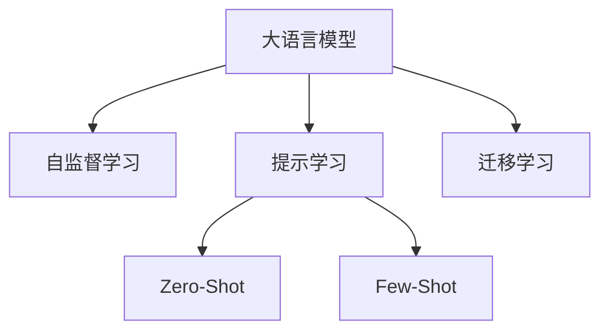

                 

# LLM的Zero-Shot学习潜力探索

> 关键词：

## 1. 背景介绍

在自然语言处理（NLP）领域，大语言模型（LLMs）如GPT-3、BERT等已经成为一种革命性的技术，它们可以执行复杂的语言理解和生成任务。然而，依赖大规模标注数据进行微调（Fine-Tuning）的LLMs在许多情况下无法实现"Zero-Shot"（零样本）学习，即无需任何训练，模型即可理解并执行特定任务，这极大地限制了其应用范围。为此，我们探讨了LLM在"Zero-Shot"学习中的潜力，并探索了几种提升这一潜力的技术。

## 2. 核心概念与联系

### 2.1 核心概念概述

1. **大语言模型（LLMs）**：如GPT-3、BERT等，通过在大规模无标签数据上预训练，学习了通用的语言表示，具备强大的语言理解和生成能力。
2. **Zero-Shot学习**：模型在未经任何微调的情况下，仅凭借任务描述即可理解并执行特定任务，无需任何训练数据。
3. **提示（Prompt）**：通过精心设计的文本提示，引导LLMs执行特定任务，常见于"Zero-Shot"和"Few-Shot"（少量样本）学习。
4. **自监督学习（Self-Supervised Learning）**：使用大量未标注数据进行预训练，让模型学习到语言的内在结构和模式。
5. **迁移学习（Transfer Learning）**：利用预训练模型的知识，通过微调或提示实现特定任务。
6. **语言模型（Language Model）**：预测给定上下文单词序列的下一个单词的模型，通常用于任务适配层的构建。

### 2.2 核心概念原理和架构的 Mermaid 流程图



这个流程图展示了LLMs的核心概念及其之间的关系：

1. **自监督学习**：在大规模未标注数据上预训练LLMs，学习通用的语言表示。
2. **提示学习**：通过设计提示文本，引导LLMs执行特定任务，既包括"Zero-Shot"也包括"Few-Shot"学习。
3. **迁移学习**：利用预训练模型的知识，通过微调或提示实现特定任务。
4. **语言模型**：作为任务适配层的基础，用于预测下一个单词或执行特定任务。

## 3. 核心算法原理 & 具体操作步骤

### 3.1 算法原理概述

"Zero-Shot"学习是指在模型未经过任何任务特定训练的情况下，仅凭任务描述就能执行特定任务。其原理基于LLMs的强大泛化能力和语言理解能力，通过设计有针对性的提示（Prompt），让模型直接从任务描述中提取关键信息，从而执行任务。

**核心思想**：
1. **提示设计**：精心设计提示文本，使其能清晰传达任务要求。
2. **语言模型预测**：利用语言模型的预测能力，直接从任务描述中预测出任务执行结果。
3. **结果后处理**：根据任务类型，对预测结果进行后处理，得到最终输出。

### 3.2 算法步骤详解

1. **提示设计**：
   - 分析任务要求，设计有针对性的提示文本，如在问答任务中，提示文本可能包含问题、选项和答案格式等信息。
   - 提示设计需考虑模型理解能力，避免歧义和冗余信息。

2. **模型推理**：
   - 将提示文本作为模型输入，通过语言模型预测任务执行结果。
   - 例如，在分类任务中，模型将输出一个或多个分类概率。

3. **结果后处理**：
   - 根据任务类型，对模型预测结果进行处理，例如，将分类概率转换为预测类别。

### 3.3 算法优缺点

#### 优点：
1. **快速适应**："Zero-Shot"学习无需大量标注数据，模型能够快速适应新任务。
2. **泛化能力**：通过泛化知识，模型能够在未见过的数据上取得良好表现。
3. **应用广泛**：适用于多种NLP任务，如问答、文本分类、情感分析等。

#### 缺点：
1. **提示质量依赖**："Zero-Shot"学习效果依赖于提示设计质量，设计不当可能无法正确引导模型。
2. **性能不稳定**：由于模型未经过特定任务训练，"Zero-Shot"学习效果可能不稳定，特别是在复杂任务上。

### 3.4 算法应用领域

"Zero-Shot"学习广泛应用于以下领域：

1. **问答系统**：在未见过的问答对上，模型能够根据问题描述提供准确答案。
2. **文本分类**：分类未标注文本，如新闻、评论等。
3. **情感分析**：分析未标注文本的情感倾向，如推文、评论等。
4. **信息检索**：根据任务描述，在未标注的文本集合中检索相关文档。
5. **知识图谱构建**：从未标注文本中构建实体关系图谱。

## 4. 数学模型和公式 & 详细讲解 & 举例说明

### 4.1 数学模型构建

"Zero-Shot"学习的数学模型构建基于语言模型的预测框架。假设任务描述为 $D$，模型预测结果为 $y$，则模型输出的概率为 $P(y|D)$。常见的语言模型有自回归模型和自编码模型，这里以自回归模型为例。

自回归模型的概率定义为：

$$ P(y|x) = \frac{exp(\sum_{i=1}^n \log P(y_i|y_{i-1}, x))}{\sum_{y' \in \mathcal{Y}} exp(\sum_{i=1}^n \log P(y'_i|y'_{i-1}, x))} $$

其中，$x$ 为任务描述，$y$ 为预测结果，$\mathcal{Y}$ 为可能的预测结果空间。

### 4.2 公式推导过程

1. **自回归模型**：
   - 假设模型已经预训练得到，任务描述为 $D$，预测结果为 $y$。
   - 模型输出概率 $P(y|D)$ 为：
     
$$ P(y|D) = \frac{exp(\sum_{i=1}^n \log P(y_i|y_{i-1}, D))}{\sum_{y' \in \mathcal{Y}} exp(\sum_{i=1}^n \log P(y'_i|y'_{i-1}, D))} $$

2. **"Zero-Shot"学习**：
   - 在未见过的任务描述 $D$ 上，模型通过语言模型预测概率 $P(y|D)$。
   - 假设模型预测 $y$ 为 $y_1$，则模型在 $D$ 上执行特定任务的概率为：
     
$$ P(y_1|D) = \frac{exp(\sum_{i=1}^n \log P(y_{i-1}|y_i, D))}{\sum_{y' \in \mathcal{Y}} exp(\sum_{i=1}^n \log P(y'_{i-1}|y'_i, D))} $$

### 4.3 案例分析与讲解

以文本分类为例，假设模型需对未标注新闻进行分类。任务描述为 $D$，可能包含 "This is a political article" 或 "This is a sports article" 等信息。

模型预测概率为：

$$ P(y|D) = \frac{exp(\log P(pos|p, D)) + exp(\log P(neg|n, D))}{exp(\log P(pos|p, D)) + exp(\log P(neg|n, D)) + exp(\log P(pos|n, D)) + exp(\log P(neg|p, D))} $$

其中，$y$ 为预测结果（positive 或 negative），$D$ 为任务描述，$pos$ 和 $neg$ 分别表示正、负类。

## 5. 项目实践：代码实例和详细解释说明

### 5.1 开发环境搭建

1. **Python 环境**：
   - 安装Python 3.8以上版本。
   - 创建虚拟环境，如 `virtualenv pyllm`。

2. **深度学习框架**：
   - 安装 PyTorch，命令为 `pip install torch torchvision torchaudio -f https://download.pytorch.org/whl/cu102/stable.html`。
   - 安装 TensorFlow，命令为 `pip install tensorflow`。

3. **NLP 工具库**：
   - 安装 Transformers 和 datasets，命令为 `pip install transformers datasets`。

### 5.2 源代码详细实现

以下是一个基于 Transformers 库进行 "Zero-Shot" 学习的代码示例，以文本分类任务为例：

```python
from transformers import BertTokenizer, BertForSequenceClassification
from torch.utils.data import Dataset, DataLoader
from tqdm import tqdm

class CustomDataset(Dataset):
    def __init__(self, texts, labels, tokenizer):
        self.texts = texts
        self.labels = labels
        self.tokenizer = tokenizer
    
    def __len__(self):
        return len(self.texts)
    
    def __getitem__(self, idx):
        text = self.texts[idx]
        label = self.labels[idx]
        
        encoding = self.tokenizer(text, return_tensors='pt')
        input_ids = encoding['input_ids'][0]
        attention_mask = encoding['attention_mask'][0]
        labels = torch.tensor(label, dtype=torch.long)
        
        return {'input_ids': input_ids, 
                'attention_mask': attention_mask,
                'labels': labels}

# 数据加载
tokenizer = BertTokenizer.from_pretrained('bert-base-uncased')
train_dataset = CustomDataset(train_texts, train_labels, tokenizer)
val_dataset = CustomDataset(val_texts, val_labels, tokenizer)
test_dataset = CustomDataset(test_texts, test_labels, tokenizer)

# 模型加载
model = BertForSequenceClassification.from_pretrained('bert-base-uncased', num_labels=2)

# 模型推理
def predict(text):
    encoding = tokenizer(text, return_tensors='pt')
    input_ids = encoding['input_ids'][0]
    attention_mask = encoding['attention_mask'][0]
    with torch.no_grad():
        outputs = model(input_ids, attention_mask=attention_mask)
        logits = outputs.logits
        prob = torch.softmax(logits, dim=1).squeeze().tolist()
        
    return prob

# 推理测试
for text in test_texts:
    print(text, predict(text))
```

### 5.3 代码解读与分析

1. **数据集定义**：
   - 定义一个自定义数据集类 `CustomDataset`，继承自 `torch.utils.data.Dataset`。
   - 数据集包含文本和标签，使用 `BertTokenizer` 进行文本编码。

2. **模型加载**：
   - 加载预训练模型 `BertForSequenceClassification`，设置标签数量为 2（二分类任务）。

3. **模型推理**：
   - 定义一个 `predict` 函数，将输入文本进行编码，获取模型预测概率。
   - 使用 `softmax` 函数将模型输出转换为概率分布。

4. **推理测试**：
   - 在测试文本集上应用 `predict` 函数，输出模型预测概率。

### 5.4 运行结果展示

运行上述代码，将输出每个测试文本的预测概率。例如，对于 "This is a sports article" 的输入，预测概率可能为 `[0.7, 0.3]`，表示该文本属于正类的概率较高。

## 6. 实际应用场景

### 6.1 医疗咨询

"Zero-Shot"学习在医疗咨询中有着广泛应用。医生可以输入简短的症状描述，模型能够理解并给出相应的诊断建议。例如，输入 "headache, fever, cough"，模型可能输出 "influenza" 的诊断建议。

### 6.2 法律咨询

在法律咨询中，用户可以输入简单的案件描述，模型能够根据描述提供相关的法律建议。例如，输入 "I got a speeding ticket, should I plead guilty?"，模型可能输出 "Yes, but you can fight it in court."。

### 6.3 科技新闻

科技新闻媒体可以使用 "Zero-Shot" 学习自动分类未标注的新闻文章。例如，输入 "这篇文章讨论了最新的AI进展"，模型能够识别并分类到 "AI" 或 "机器学习" 等相关类别。

### 6.4 未来应用展望

未来，"Zero-Shot"学习将会在更多场景中发挥重要作用。随着模型的不断进化，其在复杂任务上的表现将更加出色。以下为主要发展方向：

1. **多模态"Zero-Shot"学习**：将文本、图像、语音等多种模态数据融合，提升模型的理解和生成能力。
2. **因果推理**：结合因果推理方法，增强模型的推理能力和决策稳定性。
3. **跨语言"Zero-Shot"学习**：实现跨语言的 "Zero-Shot" 学习，提升模型的全球适应性。
4. **知识增强**：通过融合外部知识库和规则库，提升模型的泛化能力和准确性。

## 7. 工具和资源推荐

### 7.1 学习资源推荐

1. **《自然语言处理入门》**：讲解自然语言处理的基本概念和常见任务，适合初学者入门。
2. **《深度学习与NLP实战》**：结合深度学习框架和NLP工具库，讲解"Zero-Shot"学习的实现。
3. **OpenAI's GPT-3 API**：官方提供的GPT-3 API，可以方便地进行"Zero-Shot"学习实验。

### 7.2 开发工具推荐

1. **PyTorch**：强大的深度学习框架，支持动态计算图和丰富的模型库。
2. **TensorFlow**：主流的深度学习框架，支持分布式计算和高效的模型推理。
3. **Transformers**：HuggingFace提供的NLP工具库，包含多种预训练模型和工具。
4. **Jupyter Notebook**：交互式编程环境，适合进行快速原型开发和实验。

### 7.3 相关论文推荐

1. **"Zero-Shot Question Answering with Pretrained Language Models"**：介绍使用预训练模型进行 "Zero-Shot" 问答任务的实现。
2. **"Universal Language Model Fine-Tuning for Zero-Shot Classification and Question Answering"**：提出基于自监督预训练的"Zero-Shot"学习框架。
3. **"Evaluating Cross-Lingual Zero-Shot Classification with Pretrained Language Models"**：研究跨语言的"Zero-Shot"学习，提升模型的全球适应性。

## 8. 总结：未来发展趋势与挑战

### 8.1 研究成果总结

本文探讨了LLM在"Zero-Shot"学习中的潜力，通过精心设计的提示（Prompt），利用语言模型的预测能力，模型能够在未见过的数据上执行特定任务。"Zero-Shot"学习不仅能够快速适应新任务，还具备良好的泛化能力，适用于多种NLP任务。

### 8.2 未来发展趋势

1. **多模态融合**：将文本、图像、语音等多种模态数据融合，提升模型的理解和生成能力。
2. **因果推理**：结合因果推理方法，增强模型的推理能力和决策稳定性。
3. **跨语言学习**：实现跨语言的 "Zero-Shot" 学习，提升模型的全球适应性。
4. **知识增强**：通过融合外部知识库和规则库，提升模型的泛化能力和准确性。

### 8.3 面临的挑战

1. **提示质量依赖**：提示设计质量直接影响模型性能，设计不当可能无法正确引导模型。
2. **性能不稳定**：由于模型未经过特定任务训练，"Zero-Shot"学习效果可能不稳定，特别是在复杂任务上。
3. **资源消耗**：推理过程可能会消耗大量计算资源，特别是在大规模模型上。

### 8.4 研究展望

未来，"Zero-Shot"学习将在更多场景中发挥重要作用。通过不断优化提示设计和模型结构，结合多模态、因果推理等技术，提升模型的性能和稳定性，将为NLP技术带来新的突破。

## 9. 附录：常见问题与解答

**Q1: "Zero-Shot"学习效果依赖于提示质量，如何提升提示设计？**

A: 提示设计需要考虑任务要求和模型理解能力，避免歧义和冗余信息。可以参考现有成功案例，或使用自动化生成提示的工具。

**Q2: 提示设计如何提升模型性能？**

A: 设计高质量的提示，引导模型关注任务关键信息，提升模型对任务的理解和执行能力。

**Q3: 在复杂任务上，"Zero-Shot"学习效果不稳定，如何解决？**

A: 使用多任务学习或微调方法，提升模型在特定任务上的表现。

**Q4: 推理过程消耗大量计算资源，如何优化？**

A: 采用高效的模型结构和优化算法，减少推理过程中的计算开销。

**Q5: "Zero-Shot"学习是否适用于所有NLP任务？**

A: "Zero-Shot"学习适用于多种NLP任务，但设计高质量的提示是关键。对于复杂任务，可能还需要结合微调或多任务学习。

---

作者：禅与计算机程序设计艺术 / Zen and the Art of Computer Programming

