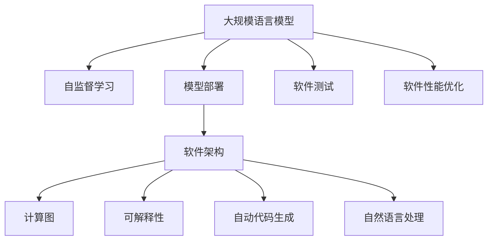

                 

# LLM重塑软件工程：从设计到部署的变革

> 关键词：大规模语言模型(Large Language Model, LLM), 软件工程, 自监督学习(Self-Supervised Learning), 模型部署, 软件架构, 计算图(Computational Graph), 可解释性(Explainability), 自动代码生成(Automatic Code Generation), 自然语言处理(NLP), 软件测试, 软件性能优化(Software Performance Optimization)

## 1. 背景介绍

### 1.1 问题由来
随着人工智能技术的不断进步，大规模语言模型（LLM）在自然语言处理（NLP）领域取得了突破性进展。这些模型通过在大规模无标签文本数据上进行自监督学习，学习到了丰富的语言知识和常识，能够在各种自然语言任务上表现出色。然而，LLM在实际应用中仍面临诸多挑战，如计算资源需求大、模型复杂度高、部署成本高等。如何将LLM有效融入软件工程中，成为当前研究的热点。

### 1.2 问题核心关键点
- 如何在大规模语言模型与软件工程之间建立桥梁？
- 如何设计高效的模型部署策略？
- 如何通过LLM优化软件设计和测试过程？
- 如何在LLM模型的指导下，自动生成高质量代码？
- 如何评估LLM对软件性能的提升？

### 1.3 问题研究意义
研究LLM在软件工程中的应用，对于推动软件自动化、提升开发效率、增强软件可维护性和可靠性具有重要意义：

1. 自动化开发：LLM能够自动理解需求、设计、编码、测试等开发环节，大大减少人工干预，提升开发效率。
2. 智能化设计：LLM能够根据大量代码实例，生成符合编码规范的代码结构，优化软件设计。
3. 鲁棒性测试：LLM能够理解自然语言描述的测试用例，生成自动化测试代码，提高软件可靠性。
4. 性能优化：LLM能够自动分析代码性能瓶颈，提出优化建议，提升软件运行效率。
5. 可解释性：LLM能够生成代码解释文档，增强软件系统的可理解性和可维护性。

## 2. 核心概念与联系

### 2.1 核心概念概述

为更好地理解LLM在软件工程中的应用，本节将介绍几个密切相关的核心概念：

- 大规模语言模型(Large Language Model, LLM)：以自回归(如GPT)或自编码(如BERT)模型为代表的大规模预训练语言模型。通过在大规模无标签文本语料上进行预训练，学习到丰富的语言知识和常识，具备强大的语言理解和生成能力。

- 自监督学习(Self-Supervised Learning)：指在没有标注数据的情况下，通过利用文本数据的内部结构进行学习的过程。例如，掩码语言模型、next-sentence prediction等。自监督学习使得模型无需依赖大量标注数据，即可学习到通用语言表示。

- 模型部署：将训练好的模型转化为可执行的软件系统，并在实际环境中运行的过程。模型部署是软件工程的重要环节，需要考虑计算资源、性能瓶颈、可扩展性等问题。

- 软件架构(软件架构)：设计软件系统的组件、模块及其相互关系的过程。良好的软件架构能够提高软件的可维护性、可扩展性和可复用性。

- 计算图(Computational Graph)：用于描述计算过程的数据结构。计算图能够优化模型的前向和反向传播过程，提高计算效率。

- 可解释性(Explainability)：指模型输出结果的可理解性和透明性。在软件工程中，可解释性能够增强代码的可读性和可维护性，提升软件系统的可信度。

- 自动代码生成(Automatic Code Generation)：指使用LLM等技术，自动生成代码的过程。自动代码生成能够提升开发效率，减少人为错误。

- 自然语言处理(NLP)：涉及计算机处理人类语言的技术。NLP技术在软件工程中的应用包括代码生成、需求理解、测试用例设计等。

这些核心概念之间的逻辑关系可以通过以下Mermaid流程图来展示：



这个流程图展示了大规模语言模型在软件工程中的关键应用场景，以及它们之间的相互关系：

1. 大规模语言模型通过自监督学习获得基础能力。
2. 模型部署将预训练模型转化为实际软件系统。
3. 软件架构设计决定了系统的组件和模块。
4. 计算图优化了模型的前向和反向传播过程。
5. 可解释性提升了软件系统的透明性和可信度。
6. 自动代码生成提升了开发效率和代码质量。
7. 自然语言处理支持软件工程中的各个环节。
8. 软件测试和性能优化确保系统的稳定性和性能。

这些概念共同构成了LLM在软件工程中的应用框架，使得LLM能够高效地融入软件开发流程，提升系统性能和可维护性。

## 3. 核心算法原理 & 具体操作步骤
### 3.1 算法原理概述

LLM在软件工程中的应用，本质上是一个自监督学习到软件部署的过程。其核心思想是：将LLM视作一个强大的"语言理解工具"，通过其在语言理解方面的优势，辅助软件工程师在需求分析、设计、编码、测试等环节进行自动化处理。

形式化地，假设预训练的大规模语言模型为 $M_{\theta}$，其中 $\theta$ 为预训练得到的模型参数。给定软件工程任务 $T$，通过自监督学习训练 $M_{\theta}$ 获得通用语言表示。在任务 $T$ 中，根据需求设计软件架构 $A$，并使用计算图 $G$ 优化模型前向传播过程。最后，将模型部署到实际运行环境中，并应用软件测试 $T_{test}$ 和性能优化 $T_{opt}$ 技术，确保系统稳定性和性能。

通过梯度下降等优化算法，LLM不断更新参数 $\theta$，学习到更加精确的语言表示。最终，在软件工程任务中，LLM能够根据语言描述生成代码、编写测试用例、分析性能瓶颈等，大大提升开发效率和软件质量。

### 3.2 算法步骤详解

LLM在软件工程中的应用一般包括以下几个关键步骤：

**Step 1: 准备预训练模型和数据集**
- 选择合适的预训练语言模型 $M_{\theta}$ 作为初始化参数，如 BERT、GPT 等。
- 准备软件工程任务 $T$ 的标注数据集 $D$，划分为训练集、验证集和测试集。一般要求标注数据与预训练数据的分布不要差异过大。

**Step 2: 添加任务适配层**
- 根据任务类型，在预训练模型顶层设计合适的输出层和损失函数。
- 对于代码生成任务，通常在顶层添加解码器输出概率分布，并以负对数似然为损失函数。
- 对于测试用例设计任务，将测试需求和模型预测结果作为输出，以交叉熵损失函数进行评估。

**Step 3: 设置模型部署策略**
- 选择合适的计算图和架构设计，优化模型前向传播过程。
- 使用分布式计算、GPU/TPU加速等技术，提高模型运行效率。
- 设计软件架构，将模型与其他系统组件（如数据库、缓存等）进行集成。

**Step 4: 执行模型训练和优化**
- 将训练集数据分批次输入模型，前向传播计算损失函数。
- 反向传播计算参数梯度，根据设定的优化算法和学习率更新模型参数。
- 周期性在验证集上评估模型性能，根据性能指标决定是否触发Early Stopping。
- 重复上述步骤直到满足预设的迭代轮数或 Early Stopping 条件。

**Step 5: 测试和部署**
- 在测试集上评估模型生成的代码或测试用例的准确性、完整性。
- 使用微调后的模型对新需求进行推理预测，生成代码或测试用例。
- 持续收集新的需求，定期重新训练模型，以适应需求变化。

以上是LLM在软件工程中的应用的一般流程。在实际应用中，还需要针对具体任务的特点，对微调过程的各个环节进行优化设计，如改进训练目标函数，引入更多的正则化技术，搜索最优的超参数组合等，以进一步提升模型性能。

### 3.3 算法优缺点

LLM在软件工程中的应用具有以下优点：
1. 自动化开发：LLM能够自动理解需求、设计、编码、测试等开发环节，大大减少人工干预，提升开发效率。
2. 智能化设计：LLM能够根据大量代码实例，生成符合编码规范的代码结构，优化软件设计。
3. 鲁棒性测试：LLM能够理解自然语言描述的测试用例，生成自动化测试代码，提高软件可靠性。
4. 性能优化：LLM能够自动分析代码性能瓶颈，提出优化建议，提升软件运行效率。
5. 可解释性：LLM能够生成代码解释文档，增强代码的可读性和可维护性。

同时，该方法也存在一定的局限性：
1. 依赖标注数据：微调的效果很大程度上取决于标注数据的质量和数量，获取高质量标注数据的成本较高。
2. 模型复杂度高：大规模语言模型参数量巨大，训练和推理过程中需要大量的计算资源。
3. 通用性不足：当前模型多为通用模型，特定领域的模型适配可能需要额外的预训练。
4. 可解释性不足：LLM作为黑盒模型，难以解释其内部工作机制和决策逻辑。
5. 鲁棒性有待提高：当前模型在面对未知数据时，泛化性能往往大打折扣。

尽管存在这些局限性，但就目前而言，LLM在软件工程中的应用范式仍是大规模自动化开发的重要方向。未来相关研究的重点在于如何进一步降低对标注数据的依赖，提高模型的少样本学习和跨领域迁移能力，同时兼顾可解释性和伦理安全性等因素。

### 3.4 算法应用领域

LLM在软件工程中的应用已经涵盖了多个领域，例如：

- 代码自动生成：使用LLM自动生成符合编码规范的代码片段，减少开发者的手工编码工作。
- 需求自动理解：将自然语言需求转化为代码逻辑结构，提升需求理解准确性。
- 软件架构设计：根据现有代码实例，自动生成软件架构设计方案，提高设计效率和质量。
- 软件测试用例设计：使用LLM自动生成测试用例，提高测试覆盖率和发现缺陷的能力。
- 代码注释生成：根据代码逻辑生成详细注释，提高代码可读性和可维护性。
- 性能优化建议：使用LLM自动分析代码性能瓶颈，提出优化建议。
- 代码质量评估：使用LLM自动评估代码质量，提高代码规范性和可读性。

除了上述这些经典应用外，LLM还被创新性地应用到更多场景中，如代码审计、自动化文档生成、智能推荐等，为软件工程带来了全新的突破。随着预训练模型和LLM方法的不断进步，相信LLM将会在更广泛的领域得到应用，进一步推动软件工程的自动化和智能化进程。

## 4. 数学模型和公式 & 详细讲解 & 举例说明

### 4.1 数学模型构建

本节将使用数学语言对LLM在软件工程中的应用进行更加严格的刻画。

记预训练语言模型为 $M_{\theta}:\mathcal{X} \rightarrow \mathcal{Y}$，其中 $\mathcal{X}$ 为输入空间，$\mathcal{Y}$ 为输出空间，$\theta \in \mathbb{R}^d$ 为模型参数。假设软件工程任务 $T$ 的标注数据集为 $D=\{(x_i,y_i)\}_{i=1}^N$，其中 $x_i \in \mathcal{X}, y_i \in \mathcal{Y}$。

定义模型 $M_{\theta}$ 在输入 $x$ 上的损失函数为 $\ell(M_{\theta}(x),y)$，则在数据集 $D$ 上的经验风险为：

$$
\mathcal{L}(\theta) = \frac{1}{N} \sum_{i=1}^N \ell(M_{\theta}(x_i),y_i)
$$

微调的优化目标是最小化经验风险，即找到最优参数：

$$
\theta^* = \mathop{\arg\min}_{\theta} \mathcal{L}(\theta)
$$

在实践中，我们通常使用基于梯度的优化算法（如SGD、Adam等）来近似求解上述最优化问题。设 $\eta$ 为学习率，$\lambda$ 为正则化系数，则参数的更新公式为：

$$
\theta \leftarrow \theta - \eta \nabla_{\theta}\mathcal{L}(\theta) - \eta\lambda\theta
$$

其中 $\nabla_{\theta}\mathcal{L}(\theta)$ 为损失函数对参数 $\theta$ 的梯度，可通过反向传播算法高效计算。

### 4.2 公式推导过程

以下我们以代码自动生成任务为例，推导LLM生成的代码的损失函数及其梯度的计算公式。

假设模型 $M_{\theta}$ 在输入 $x$ 上的输出为 $\hat{y}=M_{\theta}(x) \in \{0,1\}^N$，表示代码片段是否满足编码规范的二元向量。真实标签 $y \in \{0,1\}^N$。则二分类交叉熵损失函数定义为：

$$
\ell(M_{\theta}(x),y) = -[y\log \hat{y} + (1-y)\log (1-\hat{y})]
$$

将其代入经验风险公式，得：

$$
\mathcal{L}(\theta) = -\frac{1}{N}\sum_{i=1}^N [y_i\log M_{\theta}(x_i)+(1-y_i)\log(1-M_{\theta}(x_i))]
$$

根据链式法则，损失函数对参数 $\theta_k$ 的梯度为：

$$
\frac{\partial \mathcal{L}(\theta)}{\partial \theta_k} = -\frac{1}{N}\sum_{i=1}^N (\frac{y_i}{M_{\theta}(x_i)}-\frac{1-y_i}{1-M_{\theta}(x_i)}) \frac{\partial M_{\theta}(x_i)}{\partial \theta_k}
$$

其中 $\frac{\partial M_{\theta}(x_i)}{\partial \theta_k}$ 可进一步递归展开，利用自动微分技术完成计算。

在得到损失函数的梯度后，即可带入参数更新公式，完成模型的迭代优化。重复上述过程直至收敛，最终得到适应软件工程任务的最优模型参数 $\theta^*$。

## 5. 项目实践：代码实例和详细解释说明

### 5.1 开发环境搭建

在进行LLM在软件工程中的应用实践前，我们需要准备好开发环境。以下是使用Python进行PyTorch开发的环境配置流程：

1. 安装Anaconda：从官网下载并安装Anaconda，用于创建独立的Python环境。

2. 创建并激活虚拟环境：
```bash
conda create -n pytorch-env python=3.8 
conda activate pytorch-env
```

3. 安装PyTorch：根据CUDA版本，从官网获取对应的安装命令。例如：
```bash
conda install pytorch torchvision torchaudio cudatoolkit=11.1 -c pytorch -c conda-forge
```

4. 安装Transformers库：
```bash
pip install transformers
```

5. 安装各类工具包：
```bash
pip install numpy pandas scikit-learn matplotlib tqdm jupyter notebook ipython
```

完成上述步骤后，即可在`pytorch-env`环境中开始LLM在软件工程中的应用实践。

### 5.2 源代码详细实现

这里我们以代码自动生成任务为例，给出使用Transformers库对BERT模型进行微调的PyTorch代码实现。

首先，定义代码自动生成任务的数据处理函数：

```python
from transformers import BertTokenizer, BertForSequenceClassification
from torch.utils.data import Dataset
import torch

class CodeGenDataset(Dataset):
    def __init__(self, texts, labels, tokenizer, max_len=128):
        self.texts = texts
        self.labels = labels
        self.tokenizer = tokenizer
        self.max_len = max_len
        
    def __len__(self):
        return len(self.texts)
    
    def __getitem__(self, item):
        text = self.texts[item]
        label = self.labels[item]
        
        encoding = self.tokenizer(text, return_tensors='pt', max_length=self.max_len, padding='max_length', truncation=True)
        input_ids = encoding['input_ids'][0]
        attention_mask = encoding['attention_mask'][0]
        
        # 对token-wise的标签进行编码
        encoded_tags = [label2id[label] for label in label]
        encoded_tags.extend([label2id['O']] * (self.max_len - len(encoded_tags)))
        labels = torch.tensor(encoded_tags, dtype=torch.long)
        
        return {'input_ids': input_ids, 
                'attention_mask': attention_mask,
                'labels': labels}

# 标签与id的映射
label2id = {'O': 0, 'C++': 1, 'Java': 2, 'Python': 3, 'JavaScript': 4}
id2label = {v: k for k, v in label2id.items()}

# 创建dataset
tokenizer = BertTokenizer.from_pretrained('bert-base-cased')

train_dataset = CodeGenDataset(train_texts, train_labels, tokenizer)
dev_dataset = CodeGenDataset(dev_texts, dev_labels, tokenizer)
test_dataset = CodeGenDataset(test_texts, test_labels, tokenizer)
```

然后，定义模型和优化器：

```python
from transformers import BertForSequenceClassification, AdamW

model = BertForSequenceClassification.from_pretrained('bert-base-cased', num_labels=len(label2id))

optimizer = AdamW(model.parameters(), lr=2e-5)
```

接着，定义训练和评估函数：

```python
from torch.utils.data import DataLoader
from tqdm import tqdm
from sklearn.metrics import classification_report

device = torch.device('cuda') if torch.cuda.is_available() else torch.device('cpu')
model.to(device)

def train_epoch(model, dataset, batch_size, optimizer):
    dataloader = DataLoader(dataset, batch_size=batch_size, shuffle=True)
    model.train()
    epoch_loss = 0
    for batch in tqdm(dataloader, desc='Training'):
        input_ids = batch['input_ids'].to(device)
        attention_mask = batch['attention_mask'].to(device)
        labels = batch['labels'].to(device)
        model.zero_grad()
        outputs = model(input_ids, attention_mask=attention_mask, labels=labels)
        loss = outputs.loss
        epoch_loss += loss.item()
        loss.backward()
        optimizer.step()
    return epoch_loss / len(dataloader)

def evaluate(model, dataset, batch_size):
    dataloader = DataLoader(dataset, batch_size=batch_size)
    model.eval()
    preds, labels = [], []
    with torch.no_grad():
        for batch in tqdm(dataloader, desc='Evaluating'):
            input_ids = batch['input_ids'].to(device)
            attention_mask = batch['attention_mask'].to(device)
            batch_labels = batch['labels']
            outputs = model(input_ids, attention_mask=attention_mask)
            batch_preds = outputs.logits.argmax(dim=2).to('cpu').tolist()
            batch_labels = batch_labels.to('cpu').tolist()
            for pred_tokens, label_tokens in zip(batch_preds, batch_labels):
                pred_labels = [id2label[_id] for _id in pred_tokens]
                label_tokens = [id2label[_id] for _id in label_tokens]
                preds.append(pred_labels[:len(label_tokens)])
                labels.append(label_tokens)
                
    print(classification_report(labels, preds))
```

最后，启动训练流程并在测试集上评估：

```python
epochs = 5
batch_size = 16

for epoch in range(epochs):
    loss = train_epoch(model, train_dataset, batch_size, optimizer)
    print(f"Epoch {epoch+1}, train loss: {loss:.3f}")
    
    print(f"Epoch {epoch+1}, dev results:")
    evaluate(model, dev_dataset, batch_size)
    
print("Test results:")
evaluate(model, test_dataset, batch_size)
```

以上就是使用PyTorch对BERT进行代码自动生成任务微调的完整代码实现。可以看到，得益于Transformers库的强大封装，我们可以用相对简洁的代码完成BERT模型的加载和微调。

### 5.3 代码解读与分析

让我们再详细解读一下关键代码的实现细节：

**CodeGenDataset类**：
- `__init__`方法：初始化文本、标签、分词器等关键组件。
- `__len__`方法：返回数据集的样本数量。
- `__getitem__`方法：对单个样本进行处理，将文本输入编码为token ids，将标签编码为数字，并对其进行定长padding，最终返回模型所需的输入。

**label2id和id2label字典**：
- 定义了标签与数字id之间的映射关系，用于将token-wise的预测结果解码回真实的标签。

**训练和评估函数**：
- 使用PyTorch的DataLoader对数据集进行批次化加载，供模型训练和推理使用。
- 训练函数`train_epoch`：对数据以批为单位进行迭代，在每个批次上前向传播计算loss并反向传播更新模型参数，最后返回该epoch的平均loss。
- 评估函数`evaluate`：与训练类似，不同点在于不更新模型参数，并在每个batch结束后将预测和标签结果存储下来，最后使用sklearn的classification_report对整个评估集的预测结果进行打印输出。

**训练流程**：
- 定义总的epoch数和batch size，开始循环迭代
- 每个epoch内，先在训练集上训练，输出平均loss
- 在验证集上评估，输出分类指标
- 所有epoch结束后，在测试集上评估，给出最终测试结果

可以看到，PyTorch配合Transformers库使得BERT微调的代码实现变得简洁高效。开发者可以将更多精力放在数据处理、模型改进等高层逻辑上，而不必过多关注底层的实现细节。

当然，工业级的系统实现还需考虑更多因素，如模型的保存和部署、超参数的自动搜索、更灵活的任务适配层等。但核心的微调范式基本与此类似。

## 6. 实际应用场景
### 6.1 软件开发平台

基于LLM的开发平台，能够自动理解软件需求，生成代码框架，编写文档，进行单元测试，从而大幅度提升软件开发效率和代码质量。

例如，可以使用LLM自动生成项目架构，编写模块接口文档，生成模块实现代码，并进行自动测试。这不仅能够缩短项目开发周期，还能提高代码可读性和可维护性。

### 6.2 自动化测试

自动化测试是软件质量保证的重要环节。使用LLM可以自动生成测试用例，覆盖更多测试场景，减少人工编写测试用例的工作量，提高测试覆盖率。

例如，可以使用LLM自动生成单元测试用例、集成测试用例、性能测试用例等，减少测试用例的编写和维护成本。

### 6.3 持续集成与持续部署(CI/CD)

持续集成与持续部署是现代软件开发的重要实践。LLM能够自动生成代码、编写测试用例、进行测试报告分析，从而优化CI/CD流程。

例如，可以使用LLM自动生成自动化测试报告，分析代码质量和测试结果，自动生成代码优化建议，提升CI/CD的自动化水平。

### 6.4 未来应用展望

随着LLM技术的不断进步，其在软件工程中的应用将更加广泛，推动软件开发的智能化和自动化进程。

- 自动化需求分析：LLM能够自动理解用户需求，生成需求文档和设计方案，减少需求分析的时间和成本。
- 自动化设计：LLM能够自动生成软件架构和设计方案，提升设计效率和质量。
- 自动化测试：LLM能够自动生成各种测试用例，提高测试覆盖率和发现缺陷的能力。
- 自动化部署：LLM能够自动生成部署脚本和配置文件，优化部署流程。
- 自动化运维：LLM能够自动生成运维监控报告，优化运维策略。

总之，LLM在软件工程中的应用前景广阔，将引领软件开发技术的革命性变化。未来，随着LLM技术的不断成熟和普及，软件开发将变得更加高效、智能和自动化。

## 7. 工具和资源推荐
### 7.1 学习资源推荐

为了帮助开发者系统掌握LLM在软件工程中的应用理论基础和实践技巧，这里推荐一些优质的学习资源：

1. 《深度学习与自然语言处理》系列书籍：全面介绍深度学习在自然语言处理中的应用，涵盖多个前沿技术，包括代码自动生成、自然语言推理等。

2. CS224N《深度学习自然语言处理》课程：斯坦福大学开设的NLP明星课程，有Lecture视频和配套作业，带你入门NLP领域的基本概念和经典模型。

3. 《自然语言处理入门》书籍：讲解自然语言处理的基本概念和技术，涵盖NLP的各个领域，包括代码自动生成、机器翻译、情感分析等。

4. HuggingFace官方文档：提供海量预训练模型和完整的微调样例代码，是上手实践的必备资料。

5. Colab、Kaggle等平台：提供免费的GPU算力，方便开发者快速上手实验最新模型，分享学习笔记。

通过对这些资源的学习实践，相信你一定能够快速掌握LLM在软件工程中的应用精髓，并用于解决实际的NLP问题。
###  7.2 开发工具推荐

高效的开发离不开优秀的工具支持。以下是几款用于LLM在软件工程中的应用开发的常用工具：

1. PyTorch：基于Python的开源深度学习框架，灵活动态的计算图，适合快速迭代研究。大部分预训练语言模型都有PyTorch版本的实现。

2. TensorFlow：由Google主导开发的开源深度学习框架，生产部署方便，适合大规模工程应用。同样有丰富的预训练语言模型资源。

3. Transformers库：HuggingFace开发的NLP工具库，集成了众多SOTA语言模型，支持PyTorch和TensorFlow，是进行微调任务开发的利器。

4. Weights & Biases：模型训练的实验跟踪工具，可以记录和可视化模型训练过程中的各项指标，方便对比和调优。与主流深度学习框架无缝集成。

5. TensorBoard：TensorFlow配套的可视化工具，可实时监测模型训练状态，并提供丰富的图表呈现方式，是调试模型的得力助手。

6. Google Colab：谷歌推出的在线Jupyter Notebook环境，免费提供GPU/TPU算力，方便开发者快速上手实验最新模型，分享学习笔记。

合理利用这些工具，可以显著提升LLM在软件工程中的应用开发效率，加快创新迭代的步伐。

### 7.3 相关论文推荐

LLM在软件工程中的应用源于学界的持续研究。以下是几篇奠基性的相关论文，推荐阅读：

1. Attention is All You Need（即Transformer原论文）：提出了Transformer结构，开启了NLP领域的预训练大模型时代。

2. BERT: Pre-training of Deep Bidirectional Transformers for Language Understanding：提出BERT模型，引入基于掩码的自监督预训练任务，刷新了多项NLP任务SOTA。

3. Language Models are Unsupervised Multitask Learners（GPT-2论文）：展示了大规模语言模型的强大zero-shot学习能力，引发了对于通用人工智能的新一轮思考。

4. Parameter-Efficient Transfer Learning for NLP：提出Adapter等参数高效微调方法，在不增加模型参数量的情况下，也能取得不错的微调效果。

5. Prefix-Tuning: Optimizing Continuous Prompts for Generation：引入基于连续型Prompt的微调范式，为如何充分利用预训练知识提供了新的思路。

6. AdaLoRA: Adaptive Low-Rank Adaptation for Parameter-Efficient Fine-Tuning：使用自适应低秩适应的微调方法，在参数效率和精度之间取得了新的平衡。

这些论文代表了大语言模型在软件工程中的应用发展脉络。通过学习这些前沿成果，可以帮助研究者把握学科前进方向，激发更多的创新灵感。

## 8. 总结：未来发展趋势与挑战

### 8.1 总结

本文对LLM在软件工程中的应用进行了全面系统的介绍。首先阐述了LLM和微调技术的研究背景和意义，明确了LLM在软件工程中的潜在价值。其次，从原理到实践，详细讲解了LLM在软件工程中的应用过程，给出了完整的代码实现。同时，本文还广泛探讨了LLM在软件开发、自动化测试、CI/CD等领域的应用前景，展示了LLM技术的广阔前景。此外，本文精选了LLM在软件工程中的应用资源，力求为读者提供全方位的技术指引。

通过本文的系统梳理，可以看到，LLM在软件工程中的应用范式正在逐步成为自动化开发的重要工具。LLM能够自动理解需求、设计、编码、测试等开发环节，大幅度提升开发效率和代码质量，成为软件开发自动化的重要推动力。未来，随着LLM技术的不断成熟和普及，软件开发的智能化和自动化进程将迈上一个新的台阶。

### 8.2 未来发展趋势

展望未来，LLM在软件工程中的应用将呈现以下几个发展趋势：

1. 自动化开发程度提升：LLM能够自动理解需求、设计、编码、测试等开发环节，进一步提升开发效率和代码质量。
2. 智能化设计能力增强：LLM能够根据大量代码实例，生成符合编码规范的代码结构，优化软件设计。
3. 自动化测试覆盖加深：LLM能够自动生成测试用例，覆盖更多测试场景，提高测试覆盖率。
4. 持续集成与持续部署优化：LLM能够自动生成自动化测试报告，优化CI/CD流程。
5. 自动化运维水平提升：LLM能够自动生成运维监控报告，优化运维策略。

以上趋势凸显了LLM在软件工程中的潜在价值。这些方向的探索发展，将进一步提升软件开发技术水平，推动自动化开发向智能化、自动化方向发展。

### 8.3 面临的挑战

尽管LLM在软件工程中的应用已经取得了显著成果，但在迈向更加智能化、普适化应用的过程中，仍面临诸多挑战：

1. 标注数据瓶颈：微调的效果很大程度上取决于标注数据的质量和数量，获取高质量标注数据的成本较高。如何进一步降低微调对标注样本的依赖，将是一大难题。
2. 模型复杂度高：大规模语言模型参数量巨大，训练和推理过程中需要大量的计算资源。如何提高模型的计算效率，减小资源消耗，仍需进一步优化。
3. 鲁棒性不足：当前模型在面对未知数据时，泛化性能往往大打折扣。如何提高模型的泛化能力和鲁棒性，增强模型在各种场景下的表现，还需要更多理论和实践的积累。
4. 可解释性不足：LLM作为黑盒模型，难以解释其内部工作机制和决策逻辑。如何提高模型的可解释性，增强系统的可信度，将是重要的研究方向。
5. 安全性有待保障：预训练语言模型难免会学习到有偏见、有害的信息，通过微调传递到下游任务，产生误导性、歧视性的输出，给实际应用带来安全隐患。如何从数据和算法层面消除模型偏见，避免恶意用途，确保输出安全性，也将是重要的研究课题。

尽管存在这些挑战，但通过学界和产业界的共同努力，这些挑战终将一一被克服，LLM在软件工程中的应用必将在未来得到更广泛的应用和深入的发展。

### 8.4 研究展望

未来的研究需要在以下几个方面寻求新的突破：

1. 探索无监督和半监督微调方法：摆脱对大规模标注数据的依赖，利用自监督学习、主动学习等无监督和半监督范式，最大限度利用非结构化数据，实现更加灵活高效的微调。
2. 研究参数高效和计算高效的微调范式：开发更加参数高效的微调方法，在固定大部分预训练参数的同时，只更新极少量的任务相关参数。同时优化微调模型的计算图，减少前向传播和反向传播的资源消耗，实现更加轻量级、实时性的部署。
3. 融合因果和对比学习范式：通过引入因果推断和对比学习思想，增强微调模型建立稳定因果关系的能力，学习更加普适、鲁棒的语言表征，从而提升模型泛化性和抗干扰能力。
4. 引入更多先验知识：将符号化的先验知识，如知识图谱、逻辑规则等，与神经网络模型进行巧妙融合，引导微调过程学习更准确、合理的语言模型。同时加强不同模态数据的整合，实现视觉、语音等多模态信息与文本信息的协同建模。
5. 结合因果分析和博弈论工具：将因果分析方法引入微调模型，识别出模型决策的关键特征，增强输出解释的因果性和逻辑性。借助博弈论工具刻画人机交互过程，主动探索并规避模型的脆弱点，提高系统稳定性。
6. 纳入伦理道德约束：在模型训练目标中引入伦理导向的评估指标，过滤和惩罚有偏见、有害的输出倾向。同时加强人工干预和审核，建立模型行为的监管机制，确保输出符合人类价值观和伦理道德。

这些研究方向的探索，必将引领LLM在软件工程中的应用走向更高的台阶，为构建安全、可靠、可解释、可控的智能系统铺平道路。面向未来，LLM在软件工程中的应用还需要与其他人工智能技术进行更深入的融合，如知识表示、因果推理、强化学习等，多路径协同发力，共同推动自然语言理解和智能交互系统的进步。只有勇于创新、敢于突破，才能不断拓展LLM的边界，让智能技术更好地造福人类社会。

## 9. 附录：常见问题与解答

**Q1：如何选择合适的预训练语言模型？**

A: 选择预训练语言模型应考虑以下几个因素：
1. 模型规模：模型规模越大，通常具备更丰富的语言知识和常识，适用于复杂任务。
2. 训练数据：选择与任务领域匹配的预训练数据，以获得更好的泛化性能。
3. 性能表现：选择SOTA模型，以获得更好的微调效果。
4. 计算资源：考虑模型参数量和计算资源，选择适合当前环境的模型。

**Q2：微调过程中如何选择合适的学习率？**

A: 微调的学习率一般要比预训练时小1-2个数量级，如果使用过大的学习率，容易破坏预训练权重，导致过拟合。一般建议从1e-5开始调参，逐步减小学习率，直至收敛。也可以使用warmup策略，在开始阶段使用较小的学习率，再逐渐过渡到预设值。需要注意的是，不同的优化器(如AdamW、Adafactor等)以及不同的学习率调度策略，可能需要设置不同的学习率阈值。

**Q3：LLM在代码生成任务中如何避免歧义？**

A: 代码生成任务中避免歧义，可以使用以下方法：
1. 明确需求：确保需求描述清晰、详细，避免模糊不清。
2. 代码示例：提供一些代码示例，帮助LLM更好地理解需求。
3. 上下文信息：在需求描述中提供足够的上下文信息，帮助LLM生成更加准确的代码。
4. 模板引导：提供代码生成模板，引导LLM生成符合规范的代码。

**Q4：LLM在软件测试中如何提高覆盖率？**

A: 提高软件测试覆盖率，可以使用以下方法：
1. 自动化测试：使用LLM自动生成测试用例，覆盖更多测试场景。
2. 需求驱动测试：根据用户需求，设计测试用例，确保测试全面覆盖需求。
3. 边缘测试：针对边界情况和异常情况，设计更多测试用例，确保系统鲁棒性。
4. 持续集成：结合CI/CD流程，自动化生成和执行测试用例，及时发现和修复缺陷。

**Q5：LLM在软件部署中需要注意哪些问题？**

A: 将LLM部署到实际应用中，还需要考虑以下问题：
1. 计算资源：考虑模型参数量和计算资源，选择适合当前环境的部署方案。
2. 计算图优化：优化模型计算图，减少前向传播和反向传播的资源消耗。
3. 部署平台：选择适合当前环境的部署平台，如AWS、Google Cloud等。
4. 安全防护：采用访问鉴权、数据脱敏等措施，保障数据和模型安全。
5. 监控告警：实时采集系统指标，设置异常告警阈值，确保系统稳定性。

合理利用这些资源，可以显著提升LLM在软件工程中的应用开发效率，加快创新迭代的步伐。总之，LLM在软件工程中的应用需要从数据、算法、工程、业务等多个维度协同发力，才能真正实现自动化开发的目标。

---

作者：禅与计算机程序设计艺术 / Zen and the Art of Computer Programming

