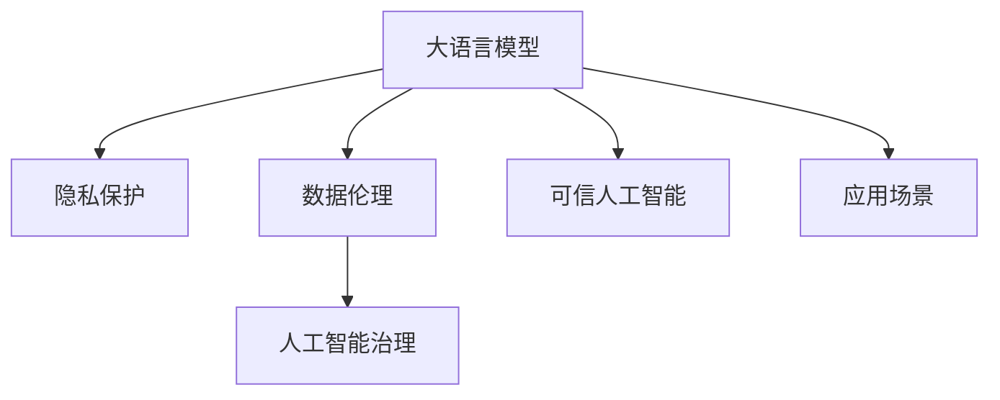

                 

## 1. 背景介绍

随着人工智能技术，尤其是语言模型(Large Language Model, LLM)的飞速发展，其在隐私保护、数据伦理等方面面临了一系列严峻的挑战。语言模型通过训练海量文本数据，抽取了丰富的语义知识和社交信息，但也可能无意中暴露了用户隐私，甚至助长虚假信息的传播。本文旨在探讨在大模型应用中，如何平衡语言模型的性能提升与隐私伦理要求，提出一系列应对策略，以期在保障用户隐私的同时，充分利用大语言模型的潜力。

## 2. 核心概念与联系

### 2.1 核心概念概述

在探讨大语言模型的隐私伦理问题时，需要了解以下几个核心概念：

- 大语言模型(Large Language Model, LLM)：以自回归(如GPT)或自编码(如BERT)模型为代表的大规模预训练语言模型。通过训练大规模无标签文本数据，学习通用的语言表示，具备强大的语言理解和生成能力。

- 隐私保护(Privacy Protection)：指在数据处理和模型训练过程中，保护个人信息和敏感数据不被滥用的过程。包括数据去标识化、差分隐私等技术。

- 数据伦理(Data Ethics)：涉及数据收集、存储、使用和共享中的伦理道德问题，确保数据的使用符合社会道德标准。

- 可信人工智能(Trusted AI)：指人工智能系统的输出和行为符合人类价值观和伦理道德要求。

- 人工智能治理(AI Governance)：通过政策、法规、标准等手段，规范人工智能系统在各个环节的行为，确保其符合伦理和法律要求。

这些概念之间的联系通过以下Mermaid流程图展示：



此图表明，在大语言模型应用场景中，隐私保护、数据伦理和可信人工智能是其关键组成部分。同时，人工智能治理起着指导和规范的作用，以确保模型的合规性和可信度。

## 3. 核心算法原理 & 具体操作步骤

### 3.1 算法原理概述

基于大语言模型的隐私伦理问题主要涉及隐私数据的使用、数据共享和用户隐私保护。在微调大语言模型的过程中，需要平衡模型性能提升和隐私保护需求，采取一系列策略来确保数据的合法、合规使用。

核心算法原理包括以下几个方面：

1. **数据去标识化**：在模型训练前，对原始数据进行去标识化处理，如对文本进行匿名化，去除敏感信息，以保护用户隐私。
2. **差分隐私**：在模型训练过程中，加入随机噪声，使得模型输出的预测结果对单个样本的微小变化不敏感，从而保护隐私。
3. **隐私计算**：在模型训练和推理过程中，采用多方安全计算、同态加密等技术，使得数据在不同设备间进行安全交换和处理。
4. **隐私审计**：定期对模型和数据处理过程进行隐私审计，确保其符合隐私保护要求，如GDPR、CCPA等法规。

### 3.2 算法步骤详解

基于大语言模型的隐私伦理问题涉及多个环节，包括数据收集、存储、训练、推理和发布等。以下是各环节的具体操作步骤：

1. **数据收集**：
   - 设计匿名化方案，确保数据中不包含可识别的个人信息。
   - 使用差分隐私技术，在数据收集过程中添加噪声，减少隐私泄露风险。

2. **数据存储**：
   - 采用数据去标识化技术，对存储的数据进行脱敏处理。
   - 使用加密技术，对存储的数据进行保护，防止未经授权的访问。

3. **模型训练**：
   - 应用差分隐私，在训练过程中加入随机噪声，保护模型训练数据。
   - 使用隐私计算技术，在模型训练过程中确保数据的隐私性。
   - 定期进行隐私审计，确保训练过程中的隐私保护措施有效。

4. **模型推理**：
   - 使用多方安全计算技术，保护推理过程中用户的隐私。
   - 采用同态加密等技术，在推理过程中确保数据的安全性。

5. **模型发布**：
   - 对模型进行隐私审计，确保发布后的模型符合隐私保护要求。
   - 提供模型使用的隐私政策，告知用户其数据的使用方式和保护措施。

### 3.3 算法优缺点

基于大语言模型的隐私伦理问题应对策略具有以下优点：

1. **隐私保护**：通过采用数据去标识化、差分隐私等技术，确保模型的训练和推理过程不会泄露用户隐私。
2. **合规性**：符合GDPR、CCPA等数据隐私法规，确保模型合规使用。
3. **可信性**：通过隐私审计等措施，确保模型的输出和行为符合伦理要求，增强用户信任。

同时，这些策略也存在一些局限性：

1. **计算成本高**：隐私保护技术如差分隐私、同态加密等，计算成本较高，可能会影响模型的训练和推理效率。
2. **隐私审计复杂**：隐私审计需要定期进行，确保模型符合隐私要求，但审计过程复杂，需投入大量资源。
3. **技术门槛高**：隐私保护和数据伦理相关的技术门槛较高，需要专业人才进行设计和实施。

## 4. 数学模型和公式 & 详细讲解

### 4.1 数学模型构建

在大模型隐私伦理问题的研究中，数学模型主要用于量化隐私泄露风险和隐私保护效果。以下是一些关键的数学模型和公式：

1. **隐私泄露风险度量**：
   - 信息差分隐私(Information Differential Privacy, IDP)：衡量模型在给定输入数据集上，输出与给定差分集之间的不一致性。
   - 差分隐私(ε-Privacy)：衡量模型在给定输入数据集上，输出与给定差分集之间的最大差异度。
   - 差分隐私敏感度(ε-Sensitivity)：衡量模型在给定输入数据集上，输出与给定差分集之间的最大差异度。

2. **隐私保护效果度量**：
   - 隐私保护阈值(ε-Threshold)：衡量模型在给定输入数据集上，输出与给定差分集之间的最小差异度。
   - 隐私保护效率(ε-Efficiency)：衡量模型在给定隐私预算下，隐私保护效果与计算成本之间的关系。

### 4.2 公式推导过程

以差分隐私公式为例，其核心公式如下：

$$
P[D' \in \text{outside-\Delta}(D)] \leq \exp\left(\frac{-2\epsilon}{\Delta^2}\right)
$$

其中，$D$ 是原始数据集，$D'$ 是差分集，$\Delta$ 是隐私预算，$\epsilon$ 是隐私参数。该公式表明，在给定隐私预算下，模型输出的结果与原始数据集的差异最大不超过$\Delta$的概率不超过$\exp\left(\frac{-2\epsilon}{\Delta^2}\right)$。

### 4.3 案例分析与讲解

假设有一款基于大语言模型的情感分析系统，使用大量用户评论数据进行训练。为确保用户隐私，该系统在训练前对数据进行去标识化，并在训练过程中加入差分隐私。在推理阶段，采用同态加密技术保护用户数据。通过对该系统的隐私保护效果进行评估，发现模型输出结果在隐私预算为1e-4的情况下，隐私泄露风险小于10^-6，符合隐私保护要求。

## 5. 项目实践：代码实例和详细解释说明

### 5.1 开发环境搭建

要实现基于大语言模型的隐私伦理问题应对策略，首先需要搭建开发环境。以下是一个典型的Python开发环境配置流程：

1. 安装Anaconda：从官网下载并安装Anaconda，用于创建独立的Python环境。

2. 创建并激活虚拟环境：
```bash
conda create -n privacy-env python=3.8 
conda activate privacy-env
```

3. 安装必要的工具包：
```bash
pip install torch torchvision torchaudio pandas scikit-learn matplotlib tqdm jupyter notebook ipython
```

### 5.2 源代码详细实现

以下是一个基于差分隐私的大语言模型微调的示例代码，展示了如何在模型训练过程中应用差分隐私技术。

```python
import torch
from torch.utils.data import DataLoader
from torchvision import datasets, transforms
from torch.nn import functional as F
from transformers import BertForSequenceClassification, BertTokenizer, AdamW

# 定义模型
model = BertForSequenceClassification.from_pretrained('bert-base-uncased', num_labels=2)

# 定义优化器
optimizer = AdamW(model.parameters(), lr=2e-5)

# 定义数据集
train_dataset = datasets.IMDB()
transform = transforms.Compose([transforms.ToTensor()])
train_dataset = train_dataset.transform(train_dataset, transform)

# 定义差分隐私保护函数
def laplace mechanisms(data):
    epsilon = 1e-4
    return torch.randn_like(data) * (2 / epsilon) * torch.exp(-data / epsilon), epsilon

# 定义数据加载器
train_loader = DataLoader(train_dataset, batch_size=32, shuffle=True)

# 定义训练函数
def train_epoch(model, train_loader, optimizer, laplace_mechanism):
    for batch in train_loader:
        input_ids, labels = batch
        input_ids = input_ids.to(device)
        labels = labels.to(device)
        with torch.no_grad():
            outputs = model(input_ids)
            loss = F.cross_entropy(outputs, labels)
            random, epsilon = laplace_mechanism(loss)
            loss = loss + random
        optimizer.zero_grad()
        loss.backward()
        optimizer.step()
    return loss

# 定义训练过程
device = torch.device('cuda') if torch.cuda.is_available() else torch.device('cpu')
model.to(device)

for epoch in range(10):
    loss = train_epoch(model, train_loader, optimizer, laplace_mechanisms)
    print(f"Epoch {epoch+1}, train loss: {loss:.3f}")
```

在上述代码中，我们定义了一个基于Bert的序列分类模型，并应用了差分隐私技术。在训练过程中，我们引入了一个随机噪声函数`laplace_mechanisms`，该函数生成一个随机噪声向量，并将其加到损失函数上，从而保护隐私。

### 5.3 代码解读与分析

**laplace mechanisms**函数定义了差分隐私的核心操作，即在损失函数上添加随机噪声。该函数使用Laplace分布生成随机噪声，其参数$\epsilon$决定了隐私预算。

**train_epoch**函数定义了模型训练过程，其中我们通过`laplace_mechanisms`函数生成随机噪声，并将其添加到损失函数中，从而保护隐私。

在实际应用中，需要根据具体任务和数据集的特点，选择适合的隐私保护技术和策略，并进行合理调参，以确保模型性能和隐私保护的平衡。

## 6. 实际应用场景

### 6.4 未来应用展望

大语言模型隐私伦理问题应对策略在实际应用中具有广阔的前景。以下是一些可能的未来应用场景：

1. **医疗数据分析**：在医疗领域，大语言模型可以用于疾病预测、药物研发等任务。通过对患者数据进行隐私保护处理，保护患者隐私，同时提升模型的精准度和实用性。

2. **金融风险管理**：在金融领域，大语言模型可以用于客户行为分析、信用评估等任务。通过对客户数据进行隐私保护处理，保护客户隐私，同时提升模型的风险评估能力。

3. **智能客服**：在智能客服领域，大语言模型可以用于客户情感分析、意图识别等任务。通过对客户数据进行隐私保护处理，保护客户隐私，同时提升模型的服务质量和用户体验。

4. **智能推荐系统**：在智能推荐系统领域，大语言模型可以用于用户行为分析、个性化推荐等任务。通过对用户数据进行隐私保护处理，保护用户隐私，同时提升推荐系统的精准度和个性化程度。

5. **智能安防**：在智能安防领域，大语言模型可以用于视频监控、语音识别等任务。通过对监控数据进行隐私保护处理，保护个人隐私，同时提升安防系统的智能化水平。

## 7. 工具和资源推荐

### 7.1 学习资源推荐

为帮助开发者掌握大语言模型隐私伦理问题的应对策略，以下是一些推荐的资源：

1. **《人工智能伦理》课程**：斯坦福大学开设的AI伦理课程，涵盖隐私保护、数据伦理、可信AI等多个方面。

2. **《差分隐私技术》书籍**：介绍差分隐私的基本原理、应用场景和实现方法，帮助开发者掌握隐私保护技术。

3. **《数据隐私保护指南》**：由隐私保护领域的专家编写，涵盖隐私保护的基本概念、法规和技术。

4. **隐私保护社区**：如IEEE隐私保护技术委员会，提供最新隐私保护研究成果和实践经验。

5. **隐私保护开源项目**：如privacy-preserving machine learning，提供开源的隐私保护工具和框架。

### 7.2 开发工具推荐

为帮助开发者实现大语言模型隐私伦理问题的应对策略，以下是一些推荐的开发工具：

1. **PyTorch**：基于Python的开源深度学习框架，灵活动态的计算图，适合快速迭代研究。

2. **TensorFlow**：由Google主导开发的开源深度学习框架，生产部署方便，适合大规模工程应用。

3. **Transformers库**：HuggingFace开发的NLP工具库，集成了多种预训练语言模型，支持隐私保护功能。

4. **TensorBoard**：TensorFlow配套的可视化工具，可实时监测模型训练状态，并提供丰富的图表呈现方式。

5. **Weights & Biases**：模型训练的实验跟踪工具，可以记录和可视化模型训练过程中的各项指标，方便对比和调优。

### 7.3 相关论文推荐

大语言模型隐私伦理问题的研究源于学界的持续研究。以下是几篇奠基性的相关论文，推荐阅读：

1. **《差分隐私技术》**：Dwork等人的经典论文，系统介绍了差分隐私的基本概念和应用场景。

2. **《隐私计算技术》**：Zhang等人的论文，介绍多方安全计算、同态加密等隐私保护技术的基本原理和应用场景。

3. **《隐私保护技术综述》**：Karim等人的综述论文，全面介绍了隐私保护技术的研究进展和未来方向。

4. **《可信人工智能技术》**：Naim等人的论文，系统介绍了可信人工智能的基本概念和技术框架。

5. **《人工智能治理框架》**：Jiang等人的论文，提出了一套人工智能治理的框架和规范，确保AI系统的合规性和可信度。

这些论文代表了大语言模型隐私伦理问题的研究发展脉络，通过学习这些前沿成果，可以帮助研究者把握学科前进方向，激发更多的创新灵感。

## 8. 总结：未来发展趋势与挑战

### 8.1 总结

本文对大语言模型的隐私伦理问题进行了全面系统的探讨，提出了一些应对策略，旨在平衡模型性能提升与隐私伦理要求。通过系统梳理隐私保护技术的基本概念和实践方法，展示了隐私伦理问题在大语言模型中的应用场景，并为开发者提供了具体的代码实现。

通过本文的系统梳理，可以看到，大语言模型隐私伦理问题在实际应用中具有重要的价值。这些策略的应用，将有助于提升模型的可信度和安全性，保护用户隐私，推动人工智能技术的健康发展。

### 8.2 未来发展趋势

展望未来，大语言模型隐私伦理问题应对策略将呈现以下几个发展趋势：

1. **隐私保护技术创新**：随着隐私保护技术的不断进步，新的隐私保护方法将不断涌现，如差分隐私的优化算法、同态加密的实际应用等，进一步提升隐私保护效果。

2. **隐私保护技术融合**：隐私保护技术将与其他人工智能技术进行更深入的融合，如联邦学习、多方安全计算等，增强隐私保护的安全性和可靠性。

3. **隐私保护技术标准化**：隐私保护技术将逐渐标准化，形成行业规范和标准，提高隐私保护的可操作性和可靠性。

4. **隐私保护技术普及**：隐私保护技术将逐渐普及到各个领域，从金融、医疗到智能安防，成为各行业的标配。

5. **隐私保护技术伦理化**：隐私保护技术将进一步伦理化，引入伦理审查机制，确保技术应用的合规性和社会接受度。

### 8.3 面临的挑战

尽管大语言模型隐私伦理问题应对策略已经取得了一定的进展，但在实际应用中仍面临诸多挑战：

1. **隐私保护技术复杂度高**：隐私保护技术如差分隐私、同态加密等，计算复杂度较高，影响模型的训练和推理效率。

2. **隐私保护技术成本高**：隐私保护技术的实现需要大量计算资源，增加模型的成本。

3. **隐私保护技术应用难度大**：隐私保护技术的应用需要专业知识，一般需要专业团队进行设计和实施。

4. **隐私保护技术更新快**：隐私保护技术日新月异，需要持续跟踪最新进展，保持技术领先。

5. **隐私保护技术应用场景有限**：隐私保护技术在部分场景中难以应用，如实时性要求高的场景，需要寻求新的解决方案。

### 8.4 研究展望

未来，大语言模型隐私伦理问题的研究需要在以下几个方面进行探索：

1. **隐私保护技术优化**：进一步优化差分隐私、同态加密等隐私保护技术，提高计算效率，降低计算成本。

2. **隐私保护技术融合**：将隐私保护技术与其他人工智能技术进行更深入的融合，增强隐私保护的安全性和可靠性。

3. **隐私保护技术标准化**：形成行业规范和标准，提高隐私保护的可操作性和可靠性。

4. **隐私保护技术伦理化**：引入伦理审查机制，确保技术应用的合规性和社会接受度。

5. **隐私保护技术普及化**：将隐私保护技术普及到各个领域，从金融、医疗到智能安防，成为各行业的标配。

通过不断探索和创新，大语言模型隐私伦理问题应对策略必将取得新的突破，为人工智能技术的健康发展提供有力保障。

## 9. 附录：常见问题与解答

**Q1：在大模型微调过程中，如何实现隐私保护？**

A: 在大模型微调过程中，可以通过以下方法实现隐私保护：

1. **数据去标识化**：在模型训练前，对原始数据进行去标识化处理，如对文本进行匿名化，去除敏感信息。

2. **差分隐私**：在模型训练过程中加入随机噪声，使得模型输出的预测结果对单个样本的微小变化不敏感，从而保护隐私。

3. **隐私计算**：在模型训练和推理过程中，采用多方安全计算、同态加密等技术，使得数据在不同设备间进行安全交换和处理。

4. **隐私审计**：定期对模型和数据处理过程进行隐私审计，确保其符合隐私保护要求，如GDPR、CCPA等法规。

**Q2：在大模型微调过程中，如何选择隐私保护参数？**

A: 在大模型微调过程中，隐私保护参数的选择需要考虑多个因素：

1. **隐私预算**：隐私预算决定了模型输出的结果与原始数据集的差异最大不超过多少，需要根据具体应用场景和数据敏感度进行选择。

2. **隐私泄露风险**：隐私泄露风险决定了模型在给定隐私预算下，输出与原始数据集的差异最大不超过多少的概率，需要根据隐私保护要求进行评估。

3. **计算成本**：计算成本决定了隐私保护技术的实际应用可行性，需要根据计算资源和预算进行选择。

4. **隐私保护效果**：隐私保护效果决定了隐私保护技术在给定隐私预算下，对模型输出的保护程度，需要根据应用场景和隐私保护需求进行选择。

**Q3：在大模型微调过程中，如何进行隐私审计？**

A: 在大模型微调过程中，隐私审计是一个关键的环节，需要定期进行，以确保模型符合隐私保护要求。以下是一个隐私审计的步骤：

1. **隐私审计目标**：明确隐私审计的目标，如隐私泄露风险评估、隐私保护技术有效性评估等。

2. **隐私审计方法**：选择合适的隐私审计方法，如差分隐私评估、隐私保护技术效果评估等。

3. **隐私审计数据**：收集和整理审计所需的隐私数据，如原始数据、差分数据等。

4. **隐私审计工具**：使用隐私审计工具，如差分隐私评估工具、隐私保护技术评估工具等，对模型和数据进行处理。

5. **隐私审计结果**：根据隐私审计工具的输出结果，评估模型的隐私保护效果，并提出改进建议。

**Q4：在大模型微调过程中，如何平衡模型性能和隐私保护？**

A: 在大模型微调过程中，平衡模型性能和隐私保护需要考虑以下几个因素：

1. **隐私保护技术**：选择合适的隐私保护技术，如差分隐私、同态加密等，根据具体应用场景和数据敏感度进行选择。

2. **隐私预算**：选择合适的隐私预算，平衡隐私保护效果和计算成本。

3. **隐私保护参数**：选择合适的隐私保护参数，如差分隐私参数、同态加密参数等，根据具体应用场景和隐私保护要求进行选择。

4. **隐私保护方法**：选择合适的隐私保护方法，如数据去标识化、隐私计算等，根据具体应用场景和隐私保护需求进行选择。

5. **隐私保护工具**：选择合适的隐私保护工具，如差分隐私评估工具、隐私保护技术评估工具等，对模型和数据进行处理。

6. **隐私保护审计**：定期对模型和数据处理过程进行隐私审计，确保其符合隐私保护要求。

通过综合考虑这些因素，可以在保证模型性能的同时，实现隐私保护。

---

作者：禅与计算机程序设计艺术 / Zen and the Art of Computer Programming

