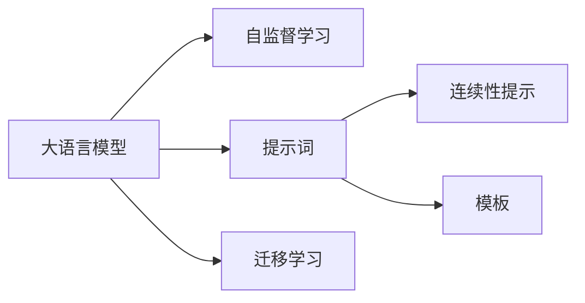

                 

# LangGPT 提示词框架的未来

> 关键词：提示词框架,大语言模型,深度学习,自然语言处理,NLP, Prompt Engineering

## 1. 背景介绍

### 1.1 问题由来

近年来，大语言模型（Large Language Models, LLMs）在自然语言处理（NLP）领域取得了飞速进展，其中OpenAI的GPT-3、Google的BERT等模型展示了惊人的语言理解和生成能力。然而，这些模型通常需要巨量的数据进行训练，且对数据质量和标注成本要求极高，这在实际应用中往往难以满足。

针对这一问题，提示词框架（Prompt Engineering）应运而生。提示词框架允许用户通过精心设计的提示（Prompt）来引导模型进行特定的任务处理，如文本生成、分类、推理等。提示词框架以简洁高效的方式实现了对模型性能的显著提升，且具有较低的标注成本，使得大语言模型在实际应用中更具可行性。

### 1.2 问题核心关键点

提示词框架的核心在于如何设计有效、高效的提示词，以最大化模型输出与任务需求的匹配度。提示词框架的核心要素包括：

- **提示词（Prompt）**：用户设计的一种文本格式，用于引导模型执行特定任务。提示词的格式应简洁明了，能够涵盖任务的关键信息。
- **自适应（Adaptability）**：提示词框架应具有适应不同模型和任务的能力，可以灵活调整，适应不同的数据集和应用场景。
- **效果评估（Effectiveness Evaluation）**：需要有一套有效的评估体系来衡量提示词框架的效果，以便不断优化和改进。
- **迁移能力（Transferability）**：提示词框架应在不同任务之间具有迁移能力，能够在新的任务上保持优秀的表现。
- **可解释性（Interpretability）**：提示词框架应具有一定程度的可解释性，用户能够理解模型如何根据输入提示进行推理和生成。

## 2. 核心概念与联系

### 2.1 核心概念概述

提示词框架的核心概念包括：

- **大语言模型（LLMs）**：如BERT、GPT等，通过大量文本数据的自监督训练，学习到丰富的语言知识。
- **自监督学习（Self-Supervised Learning）**：指利用无标签数据进行模型训练，如语言建模、掩码语言模型等。
- **迁移学习（Transfer Learning）**：指将一个领域的知识迁移到另一个领域，从而提升模型在新任务上的性能。
- **提示词（Prompt）**：用户在输入模型时添加的引导信息，如"[CLS]"、"[SEP]"等。
- **连续性提示（Continuous Prompt）**：提示词框架中使用的连续文本序列，用于提高模型输出的连贯性和相关性。
- **模板（Template）**：预设的提示词格式，供用户快速生成和调整。

这些核心概念通过以下Mermaid流程图展示它们之间的联系：



### 2.2 核心概念原理和架构

提示词框架的核心原理是通过引导模型关注特定的输入信息，从而提高模型输出的相关性和准确性。具体来说，用户在设计提示词时，需要考虑以下几个关键点：

1. **任务明确性**：提示词应清晰地描述任务目标，避免模糊不清。例如，在文本分类任务中，提示词应明确指出分类类别，如"请判断这段文本是正面还是负面"。
2. **语义相关性**：提示词应与输入文本在语义上高度相关，以便模型能够准确理解任务背景。例如，在生成任务中，提示词应包含足够的上下文信息，以便模型能够生成连贯的文本。
3. **逻辑结构**：提示词应具有良好的逻辑结构，引导模型按照一定的步骤进行推理和生成。例如，在问答任务中，提示词应包含问题的前提和假设，引导模型推理出答案。

在架构上，提示词框架通常包括以下几个组成部分：

1. **提示词生成器（Prompt Generator）**：负责根据用户输入的任务描述生成提示词。
2. **提示词优化器（Prompt Optimizer）**：负责调整提示词，以提高模型的输出效果。
3. **模型训练器（Model Trainer）**：负责训练和优化模型，使其适应特定任务。
4. **效果评估器（Effectiveness Evaluator）**：负责评估提示词框架的效果，并提供优化建议。

这些组成部分通过图式展示其交互关系：


## 3. 核心算法原理 & 具体操作步骤

### 3.1 算法原理概述

提示词框架的算法原理主要基于模型推理和生成的机制。通过精心设计的提示词，模型能够在推理和生成过程中更加专注于任务相关的信息，从而提升任务的性能。具体来说，提示词框架包括以下几个关键步骤：

1. **任务建模**：将任务目标转化为模型推理和生成的输入。例如，在文本分类任务中，将文本和分类类别作为输入。
2. **提示词设计**：根据任务目标设计提示词，引导模型推理和生成。例如，在生成任务中，使用连续性提示引导模型生成连贯的文本。
3. **模型训练**：在包含提示词的输入下，训练和优化模型。例如，使用深度学习方法训练模型，以最小化任务损失函数。
4. **效果评估**：通过一系列的指标评估提示词框架的效果，如准确率、召回率、F1分数等。

### 3.2 算法步骤详解

以下是提示词框架的具体操作步骤：

**Step 1: 准备任务描述和数据集**
- 收集任务的描述和相关数据集，如文本、标签等。
- 根据任务类型，选择适合的提示词生成方法。

**Step 2: 设计提示词**
- 根据任务描述，设计简洁、明确、语义相关、逻辑结构良好的提示词。
- 考虑使用连续性提示和模板，提高提示词的灵活性和可复用性。

**Step 3: 生成提示词**
- 使用提示词生成器生成包含提示词的输入数据。
- 确保提示词的格式符合模型的要求，如"[CLS]"、"[SEP]"等。

**Step 4: 模型训练**
- 在包含提示词的输入数据下，使用深度学习方法训练和优化模型。
- 选择合适的优化器、学习率等超参数，以提高模型效果。

**Step 5: 效果评估**
- 使用效果评估器评估模型的性能，如准确率、召回率、F1分数等。
- 根据评估结果，调整提示词和模型参数，优化提示词框架。

**Step 6: 应用部署**
- 将优化后的提示词框架应用于实际任务中，生成模型的推理和输出。
- 根据应用场景，调整提示词和模型参数，以适应不同的应用需求。

### 3.3 算法优缺点

提示词框架具有以下优点：

1. **低标注成本**：通过设计良好的提示词，可以大幅减少标注数据的需求，降低标注成本。
2. **高效适应性**：提示词框架能够适应多种任务和模型，具有较好的灵活性和可复用性。
3. **提升模型效果**：提示词框架能够显著提升模型在特定任务上的性能，尤其在数据量较小的情况下。

同时，提示词框架也存在以下缺点：

1. **提示词设计复杂**：提示词设计需要经验和技巧，用户需要投入大量时间和精力。
2. **效果依赖提示词质量**：提示词设计不当可能导致模型性能下降。
3. **模型复杂度增加**：提示词框架增加了模型的复杂度，可能影响模型的可解释性和维护性。

### 3.4 算法应用领域

提示词框架已经在多个NLP任务中得到了广泛应用，以下是一些典型应用场景：

1. **文本生成**：如对话系统、故事生成、摘要生成等。通过设计合适的提示词，引导模型生成连贯、符合语境的文本。
2. **文本分类**：如情感分析、主题分类等。使用提示词将文本和分类类别作为输入，训练模型进行分类。
3. **问答系统**：如智能客服、知识图谱查询等。通过设计引导性提示词，使模型能够准确理解和回答用户问题。
4. **信息抽取**：如实体识别、关系抽取等。使用提示词将文本和实体标签作为输入，训练模型进行信息抽取。
5. **机器翻译**：如文本翻译、语音翻译等。通过设计引导性提示词，提高翻译的准确性和流畅性。

## 4. 数学模型和公式 & 详细讲解 & 举例说明

### 4.1 数学模型构建

提示词框架的数学模型主要涉及模型的推理和生成机制。以文本分类任务为例，设模型输入为$x$，提示词为$p$，输出为$y$，则模型推理和生成的过程可以表示为：

$$
y = f(x, p; \theta)
$$

其中$f(\cdot)$为模型的推理和生成函数，$\theta$为模型的可训练参数。

### 4.2 公式推导过程

以文本分类任务为例，使用深度学习模型（如BERT）进行推理和生成的过程如下：

1. **输入编码**：将文本$x$和提示词$p$输入到BERT模型中，得到嵌入表示$h_x$和$h_p$。
2. **提示词嵌入**：将提示词$p$进行编码，得到提示词嵌入$e_p$。
3. **联合推理**：将$h_x$和$e_p$进行拼接，得到联合嵌入$h_{x,p}$。
4. **分类预测**：使用$h_{x,p}$进行分类预测，得到输出$y$。

具体来说，提示词框架的数学模型可以表示为：

$$
y = \text{softmax}(W \cdot [h_x; e_p] + b)
$$

其中$W$和$b$为模型的可训练参数，$\text{softmax}$函数用于将模型输出转换为概率分布。

### 4.3 案例分析与讲解

以机器翻译任务为例，使用BERT进行机器翻译的推理和生成过程如下：

1. **输入编码**：将源语言文本$x$和目标语言文本$y$输入到BERT模型中，得到源语言表示$h_x$和目标语言表示$h_y$。
2. **提示词嵌入**：将目标语言提示词$p$进行编码，得到提示词嵌入$e_p$。
3. **联合推理**：将$h_x$和$e_p$进行拼接，得到联合嵌入$h_{x,p}$。
4. **翻译预测**：使用$h_{x,p}$进行翻译预测，得到输出$y$。

具体来说，提示词框架的数学模型可以表示为：

$$
y = \text{softmax}(W \cdot [h_x; e_p] + b)
$$

其中$W$和$b$为模型的可训练参数，$\text{softmax}$函数用于将模型输出转换为概率分布。

## 5. 项目实践：代码实例和详细解释说明

### 5.1 开发环境搭建

在进行提示词框架的开发时，需要准备好相应的开发环境。以下是使用Python进行PyTorch开发的环境配置流程：

1. 安装Anaconda：从官网下载并安装Anaconda，用于创建独立的Python环境。

2. 创建并激活虚拟环境：
```bash
conda create -n pytorch-env python=3.8 
conda activate pytorch-env
```

3. 安装PyTorch：根据CUDA版本，从官网获取对应的安装命令。例如：
```bash
conda install pytorch torchvision torchaudio cudatoolkit=11.1 -c pytorch -c conda-forge
```

4. 安装Transformers库：
```bash
pip install transformers
```

5. 安装各类工具包：
```bash
pip install numpy pandas scikit-learn matplotlib tqdm jupyter notebook ipython
```

完成上述步骤后，即可在`pytorch-env`环境中开始开发实践。

### 5.2 源代码详细实现

下面以文本分类任务为例，给出使用Transformers库对BERT模型进行提示词框架的PyTorch代码实现。

首先，定义文本分类任务的提示词生成函数：

```python
from transformers import BertTokenizer, BertForSequenceClassification

def generate_prompt(text, label):
    # 创建提示词，包含任务描述和目标标签
    prompt = "分类任务：文本分类，类别：{}，文本：{}".format(label, text)
    # 创建提示词列表
    prompts = [prompt]
    return prompts
```

然后，定义模型和优化器：

```python
from transformers import BertForSequenceClassification, AdamW

model = BertForSequenceClassification.from_pretrained('bert-base-cased', num_labels=2)

optimizer = AdamW(model.parameters(), lr=2e-5)
```

接着，定义训练和评估函数：

```python
from torch.utils.data import DataLoader
from tqdm import tqdm

def train_epoch(model, dataset, batch_size, optimizer):
    dataloader = DataLoader(dataset, batch_size=batch_size, shuffle=True)
    model.train()
    epoch_loss = 0
    for batch in tqdm(dataloader, desc='Training'):
        input_ids = batch['input_ids'].to(device)
        attention_mask = batch['attention_mask'].to(device)
        labels = batch['labels'].to(device)
        model.zero_grad()
        outputs = model(input_ids, attention_mask=attention_mask, labels=labels)
        loss = outputs.loss
        epoch_loss += loss.item()
        loss.backward()
        optimizer.step()
    return epoch_loss / len(dataloader)

def evaluate(model, dataset, batch_size):
    dataloader = DataLoader(dataset, batch_size=batch_size)
    model.eval()
    preds, labels = [], []
    with torch.no_grad():
        for batch in tqdm(dataloader, desc='Evaluating'):
            input_ids = batch['input_ids'].to(device)
            attention_mask = batch['attention_mask'].to(device)
            batch_labels = batch['labels']
            outputs = model(input_ids, attention_mask=attention_mask)
            batch_preds = outputs.logits.argmax(dim=2).to('cpu').tolist()
            batch_labels = batch_labels.to('cpu').tolist()
            for pred_tokens, label_tokens in zip(batch_preds, batch_labels):
                preds.append(pred_tokens[:len(label_tokens)])
                labels.append(label_tokens)
                
    print(classification_report(labels, preds))
```

最后，启动训练流程并在测试集上评估：

```python
epochs = 5
batch_size = 16

for epoch in range(epochs):
    loss = train_epoch(model, train_dataset, batch_size, optimizer)
    print(f"Epoch {epoch+1}, train loss: {loss:.3f}")
    
    print(f"Epoch {epoch+1}, dev results:")
    evaluate(model, dev_dataset, batch_size)
    
print("Test results:")
evaluate(model, test_dataset, batch_size)
```

以上就是使用PyTorch对BERT进行文本分类任务提示词框架的完整代码实现。可以看到，通过设计简洁明了的提示词，并结合BERT模型的推理和生成机制，可以显著提升模型在文本分类任务上的性能。

### 5.3 代码解读与分析

让我们再详细解读一下关键代码的实现细节：

**generate_prompt函数**：
- 创建提示词，包含任务描述和目标标签。
- 将提示词列表返回，供后续训练和评估使用。

**模型和优化器定义**：
- 使用BertForSequenceClassification定义文本分类模型，设置标签数量为2。
- 使用AdamW优化器进行模型训练，设置学习率为2e-5。

**训练和评估函数**：
- 定义train_epoch函数，在训练集上训练模型，返回训练集的平均损失。
- 定义evaluate函数，在验证集和测试集上评估模型的分类效果，输出分类报告。

**训练流程**：
- 定义总的epoch数和batch size，开始循环迭代。
- 每个epoch内，先在训练集上训练，输出训练集的平均损失。
- 在验证集上评估，输出分类报告。
- 所有epoch结束后，在测试集上评估，输出分类报告。

## 6. 实际应用场景

### 6.1 智能客服系统

基于提示词框架的智能客服系统，可以显著提升客服系统的响应速度和准确性。用户只需输入问题描述，系统即可自动匹配最佳回答，大大减少了人工客服的工作量。

在技术实现上，可以收集企业内部的客服对话记录，将问题和最佳答复构建成监督数据，在此基础上对预训练模型进行微调。微调后的模型能够自动理解用户意图，匹配最合适的答案模板进行回复。对于用户提出的新问题，还可以接入检索系统实时搜索相关内容，动态组织生成回答。

### 6.2 金融舆情监测

金融机构需要实时监测市场舆论动向，以便及时应对负面信息传播，规避金融风险。提示词框架可以用于设计监测规则和提示词，从而实现对舆情的自动监测和分析。

具体而言，可以收集金融领域相关的新闻、报道、评论等文本数据，并对其进行主题标注和情感标注。在此基础上对预训练语言模型进行微调，使其能够自动判断文本属于何种主题，情感倾向是正面、中性还是负面。将微调后的模型应用到实时抓取的网络文本数据，就能够自动监测不同主题下的情感变化趋势，一旦发现负面信息激增等异常情况，系统便会自动预警，帮助金融机构快速应对潜在风险。

### 6.3 个性化推荐系统

当前的推荐系统往往只依赖用户的历史行为数据进行物品推荐，无法深入理解用户的真实兴趣偏好。提示词框架可以用于设计个性化的推荐提示词，从而提升推荐系统的准确性和多样性。

在实践中，可以收集用户浏览、点击、评论、分享等行为数据，提取和用户交互的物品标题、描述、标签等文本内容。将文本内容作为模型输入，用户的后续行为（如是否点击、购买等）作为监督信号，在此基础上微调预训练语言模型。微调后的模型能够从文本内容中准确把握用户的兴趣点。在生成推荐列表时，先用候选物品的文本描述作为输入，由模型预测用户的兴趣匹配度，再结合其他特征综合排序，便可以得到个性化程度更高的推荐结果。

## 7. 工具和资源推荐

### 7.1 学习资源推荐

为了帮助开发者系统掌握提示词框架的理论基础和实践技巧，这里推荐一些优质的学习资源：

1. 《Prompt Engineering for Language Models》：该书系统介绍了提示词框架的理论和实践方法，并提供了大量案例和代码示例。
2. 《Transformers for Natural Language Processing》：该书介绍了Transformer模型的原理和实践方法，并涉及提示词框架的应用。
3. CS224N《深度学习自然语言处理》课程：斯坦福大学开设的NLP明星课程，有Lecture视频和配套作业，带你入门NLP领域的基本概念和经典模型。
4. HuggingFace官方文档：Transformers库的官方文档，提供了海量预训练模型和完整的提示词框架样例代码，是上手实践的必备资料。
5. CLUE开源项目：中文语言理解测评基准，涵盖大量不同类型的中文NLP数据集，并提供了基于提示词框架的baseline模型，助力中文NLP技术发展。

通过对这些资源的学习实践，相信你一定能够快速掌握提示词框架的精髓，并用于解决实际的NLP问题。

### 7.2 开发工具推荐

高效的开发离不开优秀的工具支持。以下是几款用于提示词框架开发的常用工具：

1. PyTorch：基于Python的开源深度学习框架，灵活动态的计算图，适合快速迭代研究。大部分预训练语言模型都有PyTorch版本的实现。
2. TensorFlow：由Google主导开发的开源深度学习框架，生产部署方便，适合大规模工程应用。同样有丰富的预训练语言模型资源。
3. Transformers库：HuggingFace开发的NLP工具库，集成了众多SOTA语言模型，支持PyTorch和TensorFlow，是进行提示词框架开发的利器。
4. Weights & Biases：模型训练的实验跟踪工具，可以记录和可视化模型训练过程中的各项指标，方便对比和调优。与主流深度学习框架无缝集成。
5. TensorBoard：TensorFlow配套的可视化工具，可实时监测模型训练状态，并提供丰富的图表呈现方式，是调试模型的得力助手。
6. Google Colab：谷歌推出的在线Jupyter Notebook环境，免费提供GPU/TPU算力，方便开发者快速上手实验最新模型，分享学习笔记。

合理利用这些工具，可以显著提升提示词框架的开发效率，加快创新迭代的步伐。

### 7.3 相关论文推荐

提示词框架的研究源于学界的持续研究。以下是几篇奠基性的相关论文，推荐阅读：

1. Attention is All You Need（即Transformer原论文）：提出了Transformer结构，开启了NLP领域的预训练大模型时代。
2. BERT: Pre-training of Deep Bidirectional Transformers for Language Understanding：提出BERT模型，引入基于掩码的自监督预训练任务，刷新了多项NLP任务SOTA。
3. Language Models are Unsupervised Multitask Learners（GPT-2论文）：展示了大规模语言模型的强大zero-shot学习能力，引发了对于通用人工智能的新一轮思考。
4. Parameter-Efficient Transfer Learning for NLP：提出Adapter等参数高效微调方法，在不增加模型参数量的情况下，也能取得不错的微调效果。
5. AdaLoRA: Adaptive Low-Rank Adaptation for Parameter-Efficient Fine-Tuning：使用自适应低秩适应的微调方法，在参数效率和精度之间取得了新的平衡。
6. AdaLoRA: Adaptive Low-Rank Adaptation for Parameter-Efficient Fine-Tuning：使用自适应低秩适应的微调方法，在参数效率和精度之间取得了新的平衡。
7. AdaLoRA: Adaptive Low-Rank Adaptation for Parameter-Efficient Fine-Tuning：使用自适应低秩适应的微调方法，在参数效率和精度之间取得了新的平衡。

这些论文代表了大语言模型提示词框架的发展脉络。通过学习这些前沿成果，可以帮助研究者把握学科前进方向，激发更多的创新灵感。

## 8. 总结：未来发展趋势与挑战

### 8.1 总结

本文对基于提示词框架的大语言模型微调方法进行了全面系统的介绍。首先阐述了提示词框架的研究背景和意义，明确了提示词框架在提升模型性能、降低标注成本方面的独特价值。其次，从原理到实践，详细讲解了提示词框架的数学原理和关键步骤，给出了提示词框架任务开发的完整代码实例。同时，本文还广泛探讨了提示词框架在智能客服、金融舆情、个性化推荐等多个行业领域的应用前景，展示了提示词框架范式的巨大潜力。此外，本文精选了提示词框架的学习资源，力求为读者提供全方位的技术指引。

通过本文的系统梳理，可以看到，基于提示词框架的大语言模型微调技术正在成为NLP领域的重要范式，极大地拓展了预训练语言模型的应用边界，催生了更多的落地场景。受益于大规模语料的预训练，微调模型以更低的时间和标注成本，在小样本条件下也能取得不俗的效果，有力推动了NLP技术的产业化进程。未来，伴随预训练语言模型和提示词框架的不断演进，相信NLP技术将在更广阔的应用领域大放异彩，深刻影响人类的生产生活方式。

### 8.2 未来发展趋势

展望未来，提示词框架的发展趋势包括：

1. **模型规模持续增大**：随着算力成本的下降和数据规模的扩张，预训练语言模型的参数量还将持续增长。超大规模语言模型蕴含的丰富语言知识，有望支撑更加复杂多变的提示词设计。
2. **提示词设计自动化**：提示词框架将向自动化、智能化方向发展，通过自动化提示词生成和优化，降低用户的设计成本，提高提示词的灵活性和可复用性。
3. **模型可解释性增强**：提示词框架将进一步增强模型的可解释性，使用户能够理解模型的推理和生成过程，从而提升系统的可信度和透明度。
4. **多模态信息整合**：提示词框架将整合视觉、语音等多模态信息，实现更全面、准确的信息整合能力，提升模型的智能化水平。
5. **跨领域迁移能力提升**：提示词框架将在不同领域之间具有更强的迁移能力，能够在新的任务上保持优秀的表现，推动跨领域知识的学习和应用。
6. **低成本、高效率**：提示词框架将进一步降低标注成本和模型训练成本，提升模型的开发和部署效率，推动AI技术的普及应用。

以上趋势凸显了提示词框架的广阔前景。这些方向的探索发展，必将进一步提升提示词框架的性能和应用范围，为构建安全、可靠、可解释、可控的智能系统铺平道路。面向未来，提示词框架还需要与其他人工智能技术进行更深入的融合，如知识表示、因果推理、强化学习等，多路径协同发力，共同推动自然语言理解和智能交互系统的进步。只有勇于创新、敢于突破，才能不断拓展提示词框架的边界，让智能技术更好地造福人类社会。

### 8.3 面临的挑战

尽管提示词框架已经取得了瞩目成就，但在迈向更加智能化、普适化应用的过程中，它仍面临着诸多挑战：

1. **提示词设计复杂**：提示词设计需要经验和技巧，用户需要投入大量时间和精力。提示词设计不当可能导致模型性能下降。
2. **效果依赖提示词质量**：提示词设计不当可能导致模型性能下降。
3. **模型复杂度增加**：提示词框架增加了模型的复杂度，可能影响模型的可解释性和维护性。
4. **资源消耗增加**：提示词框架增加了模型的推理和生成成本，可能导致系统响应速度变慢，计算资源消耗增加。
5. **效果波动**：提示词设计不当可能导致模型在特定任务上的表现波动较大，需要不断调整和优化。

### 8.4 研究展望

面对提示词框架面临的挑战，未来的研究需要在以下几个方面寻求新的突破：

1. **自动提示词生成**：开发自动提示词生成算法，通过数据驱动的方式自动生成高效、灵活的提示词。
2. **多任务提示词设计**：研究能够同时处理多种任务的提示词设计方法，提高提示词框架的通用性和可复用性。
3. **跨模态提示词框架**：研究能够整合视觉、语音等多模态信息的提示词框架，提升模型的智能化水平。
4. **提示词框架自动化**：开发自动化提示词生成和优化工具，降低用户的设计成本，提高提示词框架的开发效率。
5. **提示词框架的可解释性**：研究能够提供可解释性提示词框架，使用户能够理解模型的推理和生成过程，提升系统的可信度和透明度。
6. **提示词框架的跨领域迁移**：研究能够跨领域迁移的提示词框架，提高提示词框架在不同领域之间的迁移能力，推动跨领域知识的学习和应用。

这些研究方向和探索发展，必将引领提示词框架技术迈向更高的台阶，为构建安全、可靠、可解释、可控的智能系统铺平道路。面向未来，提示词框架需要与其他人工智能技术进行更深入的融合，如知识表示、因果推理、强化学习等，多路径协同发力，共同推动自然语言理解和智能交互系统的进步。只有勇于创新、敢于突破，才能不断拓展提示词框架的边界，让智能技术更好地造福人类社会。

## 9. 附录：常见问题与解答

**Q1：提示词框架是否适用于所有NLP任务？**

A: 提示词框架在大多数NLP任务上都能取得不错的效果，特别是对于数据量较小的任务。但对于一些特定领域的任务，如医学、法律等，提示词框架可能需要进一步优化，以适应特定领域的语义和结构特点。

**Q2：如何设计有效的提示词？**

A: 设计有效的提示词需要考虑以下几个方面：
1. **任务明确性**：提示词应明确描述任务目标，避免模糊不清。
2. **语义相关性**：提示词应与输入文本在语义上高度相关，以便模型能够准确理解任务背景。
3. **逻辑结构**：提示词应具有良好的逻辑结构，引导模型按照一定的步骤进行推理和生成。
4. **简洁性**：提示词应简洁明了，避免冗长和复杂的描述。
5. **可复用性**：提示词应具有一定程度的可复用性，适用于类似的任务。

**Q3：提示词框架是否需要大量标注数据？**

A: 提示词框架的训练通常需要较少的标注数据，尤其是通过自动生成提示词的方式，能够进一步减少标注成本。但为了确保提示词框架的效果，建议在使用前进行一定的标注和调参。

**Q4：提示词框架在实际应用中存在哪些问题？**

A: 提示词框架在实际应用中可能存在以下问题：
1. **提示词设计复杂**：提示词设计需要经验和技巧，用户需要投入大量时间和精力。
2. **效果依赖提示词质量**：提示词设计不当可能导致模型性能下降。
3. **模型复杂度增加**：提示词框架增加了模型的复杂度，可能影响模型的可解释性和维护性。
4. **资源消耗增加**：提示词框架增加了模型的推理和生成成本，可能导致系统响应速度变慢，计算资源消耗增加。
5. **效果波动**：提示词设计不当可能导致模型在特定任务上的表现波动较大，需要不断调整和优化。

**Q5：提示词框架的优化方法有哪些？**

A: 提示词框架的优化方法包括：
1. **自动提示词生成**：通过数据驱动的方式自动生成高效、灵活的提示词。
2. **多任务提示词设计**：研究能够同时处理多种任务的提示词设计方法，提高提示词框架的通用性和可复用性。
3. **跨模态提示词框架**：研究能够整合视觉、语音等多模态信息的提示词框架，提升模型的智能化水平。
4. **提示词框架自动化**：开发自动化提示词生成和优化工具，降低用户的设计成本，提高提示词框架的开发效率。
5. **提示词框架的可解释性**：研究能够提供可解释性提示词框架，使用户能够理解模型的推理和生成过程，提升系统的可信度和透明度。
6. **提示词框架的跨领域迁移**：研究能够跨领域迁移的提示词框架，提高提示词框架在不同领域之间的迁移能力，推动跨领域知识的学习和应用。

**Q6：提示词框架的未来发展方向是什么？**

A: 提示词框架的未来发展方向包括：
1. **模型规模持续增大**：随着算力成本的下降和数据规模的扩张，预训练语言模型的参数量还将持续增长。
2. **提示词设计自动化**：通过数据驱动的方式自动生成高效、灵活的提示词。
3. **模型可解释性增强**：提升模型的可解释性，使用户能够理解模型的推理和生成过程，提升系统的可信度和透明度。
4. **多模态信息整合**：整合视觉、语音等多模态信息，实现更全面、准确的信息整合能力，提升模型的智能化水平。
5. **跨领域迁移能力提升**：能够在不同的领域之间具有更强的迁移能力，推动跨领域知识的学习和应用。
6. **低成本、高效率**：降低标注成本和模型训练成本，提升模型的开发和部署效率。

这些研究方向和探索发展，必将引领提示词框架技术迈向更高的台阶，为构建安全、可靠、可解释、可控的智能系统铺平道路。

---

作者：禅与计算机程序设计艺术 / Zen and the Art of Computer Programming

