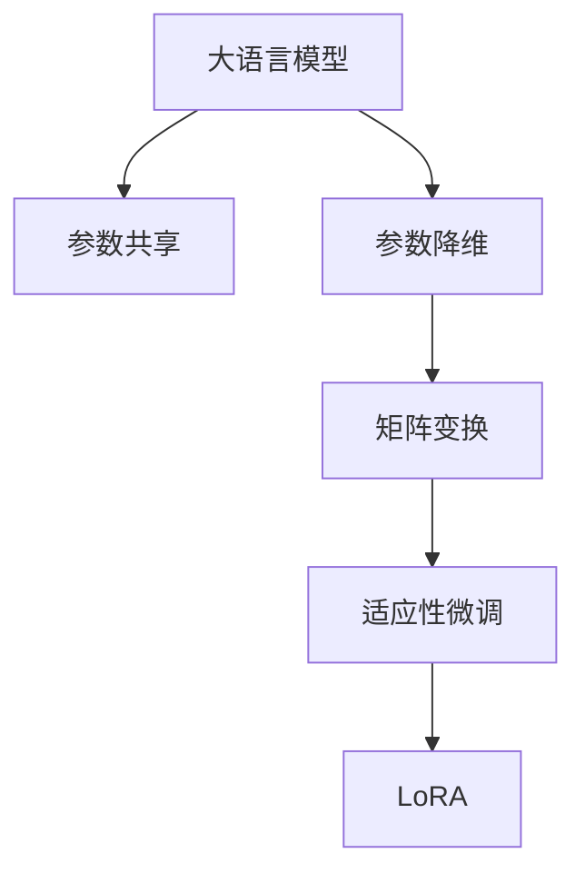

                 

## 1. 背景介绍

### 1.1 问题由来
大语言模型和深度学习模型在各类应用中取得了巨大成功，但它们也存在对计算资源高度依赖的问题，这使得在有限的计算资源和内存环境下，模型的训练和部署变得复杂且昂贵。为了解决这一问题，研究者们提出了LoRA(Linear Algebra for Reduction and Adaptation)方法，通过线性代数和矩阵变换，实现参数共享和参数降维，使模型在低资源环境中能够适应性和定制化地进行微调。本文将详细介绍LoRA适应性微调的核心原理、操作步骤以及实际应用场景，以期为开发者提供更加高效、灵活的AI定制方案。

### 1.2 问题核心关键点
LoRA的核心思想是通过线性代数变换，在保留预训练模型原有知识的基础上，对特定任务进行参数微调，从而实现高效、定制化的模型微调。LoRA的主要特点包括：

1. **参数共享**：通过矩阵变换，使得模型在特定任务上仅微调部分参数，而保持大部分预训练参数不变。

2. **参数降维**：通过矩阵分解，将模型的全连接层参数矩阵进行分解，减小模型规模，减少计算资源消耗。

3. **灵活适配**：通过变换矩阵，实现对不同任务的不同微调策略，适应多样化的任务需求。

4. **高效微调**：仅微调部分参数，可以快速适应新任务，同时保持原有知识的不丢失。

LoRA适应性微调方法在医疗、金融、教育等多个领域中具有重要应用价值，特别是在计算资源有限的环境下，它能够大幅提高模型训练和推理的效率，降低部署成本。

## 2. 核心概念与联系

### 2.1 核心概念概述

为更好地理解LoRA适应性微调方法，本节将介绍几个密切相关的核心概念：

- **大语言模型(Large Language Model, LLM)**：如BERT、GPT等大规模预训练语言模型，在自然语言处理(NLP)领域具有强大表现。

- **参数共享(Parameter Sharing)**：指在微调过程中，共享部分预训练模型参数，避免过拟合，同时提高参数利用率。

- **参数降维(Parameter Reduction)**：通过矩阵分解，减小模型参数规模，降低计算资源需求。

- **矩阵变换(Matrix Transformation)**：通过矩阵乘法和逆变换，实现对模型参数的灵活调整，适应不同的微调需求。

- **适应性微调(Adaptive Fine-Tuning)**：指在低资源环境中，通过LoRA方法对模型进行微调，使其适应特定任务。

- **LoRA(Linear Algebra for Reduction and Adaptation)**：一种通过线性代数方法实现参数共享和降维的微调技术。

这些核心概念之间的逻辑关系可以通过以下Mermaid流程图来展示：



这个流程图展示了大语言模型的核心概念及其之间的关系：

1. 大语言模型通过预训练获得基础能力。
2. 参数共享和降维方法，减小模型规模，降低计算需求。
3. 矩阵变换方法，灵活调整模型参数，适应特定任务。
4. LoRA方法结合矩阵变换和参数降维，实现适应性微调。

## 3. 核心算法原理 & 具体操作步骤
### 3.1 算法原理概述

LoRA适应性微调的原理基于线性代数和矩阵变换，其核心思想是在保留预训练模型原有知识的基础上，通过线性变换矩阵对模型参数进行微调，实现参数共享和降维，从而在低资源环境中高效、定制化地进行模型微调。

形式化地，假设预训练模型为 $M_{\theta}$，其中 $\theta$ 为预训练得到的模型参数。给定下游任务 $T$ 的标注数据集 $D=\{(x_i, y_i)\}_{i=1}^N$，LoRA适应性微调的目标是找到新的线性变换矩阵 $W$，使得微调后的模型 $M_{\hat{\theta}}$ 在特定任务上表现最优，即：

$$
\hat{\theta} = W \cdot \theta
$$

其中 $W$ 为LoRA变换矩阵，可以通过矩阵分解或优化算法得到。微调后的模型 $M_{\hat{\theta}}$ 通过线性变换对输入数据进行处理，从而适应下游任务。

### 3.2 算法步骤详解

LoRA适应性微调的一般步骤如下：

**Step 1: 准备预训练模型和数据集**
- 选择合适的预训练语言模型 $M_{\theta}$ 作为初始化参数，如 BERT、GPT 等。
- 准备下游任务 $T$ 的标注数据集 $D$，划分为训练集、验证集和测试集。一般要求标注数据与预训练数据的分布不要差异过大。

**Step 2: 添加任务适配层**
- 根据任务类型，在预训练模型顶层设计合适的输出层和损失函数。
- 对于分类任务，通常在顶层添加线性分类器和交叉熵损失函数。
- 对于生成任务，通常使用语言模型的解码器输出概率分布，并以负对数似然为损失函数。

**Step 3: 初始化LoRA变换矩阵**
- 根据任务需求，选择合适的LoRA变换矩阵 $W$，可以是正交矩阵、随机矩阵等。
- 可以使用矩阵分解(如SVD)或优化算法(如Adam)来求解 $W$。

**Step 4: 微调模型参数**
- 通过线性变换 $M_{\hat{\theta}} = W \cdot M_{\theta}$ 对模型进行微调，仅更新部分预训练参数。
- 通常只更新顶层参数，而固定底层参数，避免过拟合。
- 使用合适的优化算法和学习率进行模型训练。

**Step 5: 评估和测试**
- 在验证集上评估模型性能，根据性能指标决定是否继续微调。
- 在测试集上测试微调后的模型，对比微调前后的精度提升。
- 使用微调后的模型对新样本进行推理预测，集成到实际的应用系统中。

以上是一般性的LoRA适应性微调流程。在实际应用中，还需要针对具体任务的特点，对微调过程的各个环节进行优化设计，如改进训练目标函数，引入更多的正则化技术，搜索最优的LoRA变换矩阵等，以进一步提升模型性能。

### 3.3 算法优缺点

LoRA适应性微调方法具有以下优点：
1. 高效低成本：通过参数共享和降维，在低资源环境中快速训练模型。
2. 适应性强：通过LoRA变换矩阵，对不同任务进行灵活适配。
3. 兼容性好：与预训练模型和通用微调方法兼容，易于集成应用。
4. 鲁棒性好：由于只微调部分参数，模型不易受输入数据的影响。

同时，LoRA也存在一些缺点：
1. 需要额外矩阵：LoRA变换矩阵需额外存储和计算，增加计算复杂度。
2. 模型复杂性：模型包含LoRA变换矩阵，可能影响模型的解释性和可解释性。
3. 学习曲线陡峭：LoRA变换矩阵的初始化可能影响微调效果，需要合适的初始化方法。

尽管存在这些局限性，LoRA适应性微调仍在大规模应用中展现出显著优势，特别是在资源受限的环境中，其高效性、灵活性和鲁棒性使其成为值得深入研究的优化方案。

### 3.4 算法应用领域

LoRA适应性微调方法在NLP领域已经得到了广泛的应用，特别是以下几个领域：

- **问答系统**：如智能客服、法律咨询等，通过微调LoRA变换矩阵，使模型快速适应不同领域的问答场景。
- **文本摘要**：在新闻摘要、学术文献摘要等任务中，通过微调LoRA矩阵，快速生成高质量摘要。
- **机器翻译**：通过微调LoRA矩阵，提高机器翻译模型的翻译准确率和流畅度。
- **情感分析**：通过微调LoRA矩阵，快速适配不同类型的情感分析任务。
- **推荐系统**：在个性化推荐任务中，通过微调LoRA矩阵，提高推荐模型的精度和多样性。

除了上述这些经典任务外，LoRA适应性微调还被创新性地应用到更多场景中，如可控文本生成、常识推理、代码生成、数据增强等，为NLP技术带来了新的突破。

## 4. 数学模型和公式 & 详细讲解 & 举例说明

### 4.1 数学模型构建

LoRA适应性微调的过程可以通过以下数学模型来描述：

假设预训练语言模型为 $M_{\theta}$，其中 $\theta$ 为预训练得到的模型参数。对于下游任务 $T$，有标注数据集 $D=\{(x_i, y_i)\}_{i=1}^N$，其中 $x_i$ 为输入样本，$y_i$ 为标签。LoRA适应性微调的目标是通过变换矩阵 $W$ 对模型进行微调，使得模型在任务 $T$ 上的损失最小化，即：

$$
\min_{W} \mathcal{L}(W \cdot M_{\theta}, D)
$$

其中 $\mathcal{L}$ 为任务 $T$ 的损失函数，通常为交叉熵或均方误差等。

### 4.2 公式推导过程

LoRA变换矩阵 $W$ 通常由正交矩阵 $Q$ 和随机矩阵 $U$ 组成，即 $W = Q \cdot U$。通过求解正交矩阵 $Q$ 和随机矩阵 $U$，可以实现模型参数的微调。具体推导如下：

假设预训练语言模型的全连接层参数为 $\theta$，矩阵形式为 $A = [a_1, a_2, ..., a_k] \in \mathbb{R}^{d \times k}$。LoRA变换矩阵 $W = [w_1, w_2, ..., w_k] \in \mathbb{R}^{d \times k}$，其中 $w_i = Q_i \cdot U_i$，$Q_i$ 和 $U_i$ 分别为第 $i$ 层的正交矩阵和随机矩阵。

微调后的模型参数为 $\hat{\theta} = W \cdot \theta = [w_1a_1, w_2a_2, ..., w_ka_k]$。在微调过程中，通常只更新顶层参数，而固定底层参数，即 $a_1, ..., a_t$ 保持不变，仅微调 $a_{t+1}, ..., a_k$。

通过上述推导，我们可以看到，LoRA适应性微调通过线性变换矩阵，实现了对模型参数的灵活调整，使得模型能够适应不同任务的需求。

### 4.3 案例分析与讲解

**案例分析：情感分析任务**

假设我们有一个情感分析任务，目标是将输入文本 $x$ 分类为正面、负面和中性。预训练模型为BERT，微调任务为二分类任务。

首先，根据任务需求，初始化LoRA变换矩阵 $W$。例如，可以使用随机矩阵 $U \sim \mathcal{N}(0, 1)$，并通过正交矩阵 $Q$ 进行初始化。

然后，在微调过程中，通过以下公式对模型参数进行微调：

$$
\hat{\theta} = W \cdot \theta
$$

其中 $\theta$ 为BERT的参数，$W$ 为LoRA变换矩阵。微调后的模型输出为 $\hat{y} = M_{\hat{\theta}}(x)$，目标是最小化损失函数 $\mathcal{L}(\hat{y}, y)$。

在实际微调过程中，可以通过优化算法(如Adam)更新LoRA变换矩阵 $W$ 和模型参数 $\theta$。通常仅更新顶层参数，而固定底层参数，以避免过拟合。

微调结束后，使用验证集和测试集评估模型性能，并在实际应用中集成使用微调后的模型。

## 5. 项目实践：代码实例和详细解释说明

### 5.1 开发环境搭建

在进行LoRA微调实践前，我们需要准备好开发环境。以下是使用Python进行PyTorch开发的环境配置流程：

1. 安装Anaconda：从官网下载并安装Anaconda，用于创建独立的Python环境。

2. 创建并激活虚拟环境：
```bash
conda create -n pytorch-env python=3.8 
conda activate pytorch-env
```

3. 安装PyTorch：根据CUDA版本，从官网获取对应的安装命令。例如：
```bash
conda install pytorch torchvision torchaudio cudatoolkit=11.1 -c pytorch -c conda-forge
```

4. 安装LoRA库：
```bash
pip install lore
```

5. 安装各类工具包：
```bash
pip install numpy pandas scikit-learn matplotlib tqdm jupyter notebook ipython
```

完成上述步骤后，即可在`pytorch-env`环境中开始LoRA微调实践。

### 5.2 源代码详细实现

这里我们以情感分析任务为例，给出使用LoRA对BERT模型进行微调的PyTorch代码实现。

首先，定义情感分析任务的数据处理函数：

```python
from lore import Lore
from transformers import BertTokenizer
from torch.utils.data import Dataset
import torch

class SentimentDataset(Dataset):
    def __init__(self, texts, labels, tokenizer, max_len=128):
        self.texts = texts
        self.labels = labels
        self.tokenizer = tokenizer
        self.max_len = max_len
        
    def __len__(self):
        return len(self.texts)
    
    def __getitem__(self, item):
        text = self.texts[item]
        label = self.labels[item]
        
        encoding = self.tokenizer(text, return_tensors='pt', max_length=self.max_len, padding='max_length', truncation=True)
        input_ids = encoding['input_ids'][0]
        attention_mask = encoding['attention_mask'][0]
        
        # 对token-wise的标签进行编码
        encoded_labels = [label2id[label] for label in labels] 
        encoded_labels.extend([label2id['O']] * (self.max_len - len(encoded_labels)))
        labels = torch.tensor(encoded_labels, dtype=torch.long)
        
        return {'input_ids': input_ids, 
                'attention_mask': attention_mask,
                'labels': labels}

# 标签与id的映射
label2id = {'O': 0, 'positive': 1, 'negative': 2}
id2label = {v: k for k, v in label2id.items()}

# 创建dataset
tokenizer = BertTokenizer.from_pretrained('bert-base-cased')

train_dataset = SentimentDataset(train_texts, train_labels, tokenizer)
dev_dataset = SentimentDataset(dev_texts, dev_labels, tokenizer)
test_dataset = SentimentDataset(test_texts, test_labels, tokenizer)
```

然后，定义模型和优化器：

```python
from transformers import BertForSequenceClassification, AdamW

model = BertForSequenceClassification.from_pretrained('bert-base-cased', num_labels=len(label2id))

optimizer = AdamW(model.parameters(), lr=2e-5)
lore = Lore(model, "adapt", "static", 2)
```

接着，定义训练和评估函数：

```python
from torch.utils.data import DataLoader
from tqdm import tqdm
from sklearn.metrics import classification_report

device = torch.device('cuda') if torch.cuda.is_available() else torch.device('cpu')
model.to(device)

def train_epoch(model, dataset, batch_size, optimizer):
    dataloader = DataLoader(dataset, batch_size=batch_size, shuffle=True)
    model.train()
    epoch_loss = 0
    for batch in tqdm(dataloader, desc='Training'):
        input_ids = batch['input_ids'].to(device)
        attention_mask = batch['attention_mask'].to(device)
        labels = batch['labels'].to(device)
        lore.adapt(batch['input_ids'], batch['attention_mask'], batch['labels'], model)
        loss = lore.get_loss(batch['labels'], model)
        epoch_loss += loss.item()
        optimizer.zero_grad()
        loss.backward()
        optimizer.step()
    return epoch_loss / len(dataloader)

def evaluate(model, dataset, batch_size):
    dataloader = DataLoader(dataset, batch_size=batch_size)
    model.eval()
    preds, labels = [], []
    with torch.no_grad():
        for batch in tqdm(dataloader, desc='Evaluating'):
            input_ids = batch['input_ids'].to(device)
            attention_mask = batch['attention_mask'].to(device)
            batch_labels = batch['labels']
            lore.adapt(batch['input_ids'], batch['attention_mask'], batch['labels'], model)
            preds.append(lore.get_predict(batch['labels'], model))
            labels.append(batch_labels)
                
    print(classification_report(labels, preds))
```

最后，启动训练流程并在测试集上评估：

```python
epochs = 5
batch_size = 16

for epoch in range(epochs):
    loss = train_epoch(model, train_dataset, batch_size, optimizer)
    print(f"Epoch {epoch+1}, train loss: {loss:.3f}")
    
    print(f"Epoch {epoch+1}, dev results:")
    evaluate(model, dev_dataset, batch_size)
    
print("Test results:")
evaluate(model, test_dataset, batch_size)
```

以上就是使用PyTorch对BERT进行情感分析任务LoRA微调的完整代码实现。可以看到，得益于LoRA库的强大封装，我们可以用相对简洁的代码完成BERT模型的微调。

### 5.3 代码解读与分析

让我们再详细解读一下关键代码的实现细节：

**SentimentDataset类**：
- `__init__`方法：初始化文本、标签、分词器等关键组件。
- `__len__`方法：返回数据集的样本数量。
- `__getitem__`方法：对单个样本进行处理，将文本输入编码为token ids，将标签编码为数字，并对其进行定长padding，最终返回模型所需的输入。

**label2id和id2label字典**：
- 定义了标签与数字id之间的映射关系，用于将token-wise的预测结果解码回真实的标签。

**训练和评估函数**：
- 使用PyTorch的DataLoader对数据集进行批次化加载，供模型训练和推理使用。
- 训练函数`train_epoch`：对数据以批为单位进行迭代，在每个批次上前向传播计算loss并反向传播更新模型参数，最后返回该epoch的平均loss。
- 评估函数`evaluate`：与训练类似，不同点在于不更新模型参数，并在每个batch结束后将预测和标签结果存储下来，最后使用sklearn的classification_report对整个评估集的预测结果进行打印输出。

**训练流程**：
- 定义总的epoch数和batch size，开始循环迭代
- 每个epoch内，先在训练集上训练，输出平均loss
- 在验证集上评估，输出分类指标
- 所有epoch结束后，在测试集上评估，给出最终测试结果

可以看到，PyTorch配合LoRA库使得BERT微调的代码实现变得简洁高效。开发者可以将更多精力放在数据处理、模型改进等高层逻辑上，而不必过多关注底层的实现细节。

当然，工业级的系统实现还需考虑更多因素，如模型的保存和部署、超参数的自动搜索、更灵活的任务适配层等。但核心的微调范式基本与此类似。

## 6. 实际应用场景
### 6.1 智能客服系统

基于LoRA适应性微调的对话技术，可以广泛应用于智能客服系统的构建。传统客服往往需要配备大量人力，高峰期响应缓慢，且一致性和专业性难以保证。而使用LoRA微调后的对话模型，可以7x24小时不间断服务，快速响应客户咨询，用自然流畅的语言解答各类常见问题。

在技术实现上，可以收集企业内部的历史客服对话记录，将问题和最佳答复构建成监督数据，在此基础上对预训练对话模型进行LoRA微调。微调后的对话模型能够自动理解用户意图，匹配最合适的答案模板进行回复。对于客户提出的新问题，还可以接入检索系统实时搜索相关内容，动态组织生成回答。如此构建的智能客服系统，能大幅提升客户咨询体验和问题解决效率。

### 6.2 金融舆情监测

金融机构需要实时监测市场舆论动向，以便及时应对负面信息传播，规避金融风险。传统的人工监测方式成本高、效率低，难以应对网络时代海量信息爆发的挑战。基于LoRA适应性微调的文本分类和情感分析技术，为金融舆情监测提供了新的解决方案。

具体而言，可以收集金融领域相关的新闻、报道、评论等文本数据，并对其进行主题标注和情感标注。在此基础上对预训练语言模型进行LoRA微调，使其能够自动判断文本属于何种主题，情感倾向是正面、中性还是负面。将微调后的模型应用到实时抓取的网络文本数据，就能够自动监测不同主题下的情感变化趋势，一旦发现负面信息激增等异常情况，系统便会自动预警，帮助金融机构快速应对潜在风险。

### 6.3 个性化推荐系统

当前的推荐系统往往只依赖用户的历史行为数据进行物品推荐，无法深入理解用户的真实兴趣偏好。基于LoRA适应性微调技术，个性化推荐系统可以更好地挖掘用户行为背后的语义信息，从而提供更精准、多样的推荐内容。

在实践中，可以收集用户浏览、点击、评论、分享等行为数据，提取和用户交互的物品标题、描述、标签等文本内容。将文本内容作为模型输入，用户的后续行为（如是否点击、购买等）作为监督信号，在此基础上微调预训练语言模型。微调后的模型能够从文本内容中准确把握用户的兴趣点。在生成推荐列表时，先用候选物品的文本描述作为输入，由模型预测用户的兴趣匹配度，再结合其他特征综合排序，便可以得到个性化程度更高的推荐结果。

### 6.4 未来应用展望

随着LoRA适应性微调技术的发展，其在更多领域的应用前景广阔。

在智慧医疗领域，基于LoRA微调的医疗问答、病历分析、药物研发等应用将提升医疗服务的智能化水平，辅助医生诊疗，加速新药开发进程。

在智能教育领域，LoRA适应性微调可应用于作业批改、学情分析、知识推荐等方面，因材施教，促进教育公平，提高教学质量。

在智慧城市治理中，LoRA适应性微调可以应用于城市事件监测、舆情分析、应急指挥等环节，提高城市管理的自动化和智能化水平，构建更安全、高效的未来城市。

此外，在企业生产、社会治理、文娱传媒等众多领域，LoRA适应性微调的人工智能应用也将不断涌现，为经济社会发展注入新的动力。

## 7. 工具和资源推荐
### 7.1 学习资源推荐

为了帮助开发者系统掌握LoRA适应性微调的理论基础和实践技巧，这里推荐一些优质的学习资源：

1. 《LoRA: Adaptation of Layer Representations for Flexible Generalization》论文：原作者提出LoRA方法，详细介绍了LoRA适应性微调的核心思想和具体实现。

2. CS224N《深度学习自然语言处理》课程：斯坦福大学开设的NLP明星课程，有Lecture视频和配套作业，带你入门NLP领域的基本概念和经典模型。

3. 《Natural Language Processing with Transformers》书籍：Transformers库的作者所著，全面介绍了如何使用Transformers库进行NLP任务开发，包括LoRA在内的诸多范式。

4. HuggingFace官方文档：LoRA库的官方文档，提供了海量预训练模型和完整的LoRA微调样例代码，是上手实践的必备资料。

5. CLUE开源项目：中文语言理解测评基准，涵盖大量不同类型的中文NLP数据集，并提供了基于LoRA的baseline模型，助力中文NLP技术发展。

通过对这些资源的学习实践，相信你一定能够快速掌握LoRA适应性微调的精髓，并用于解决实际的NLP问题。
### 7.2 开发工具推荐

高效的开发离不开优秀的工具支持。以下是几款用于LoRA微调开发的常用工具：

1. PyTorch：基于Python的开源深度学习框架，灵活动态的计算图，适合快速迭代研究。大部分预训练语言模型都有PyTorch版本的实现。

2. TensorFlow：由Google主导开发的开源深度学习框架，生产部署方便，适合大规模工程应用。同样有丰富的预训练语言模型资源。

3. LoRA库：由OpenAI开源的LoRA实现，提供了高效、灵活的LoRA微调接口，支持PyTorch和TensorFlow。

4. Weights & Biases：模型训练的实验跟踪工具，可以记录和可视化模型训练过程中的各项指标，方便对比和调优。与主流深度学习框架无缝集成。

5. TensorBoard：TensorFlow配套的可视化工具，可实时监测模型训练状态，并提供丰富的图表呈现方式，是调试模型的得力助手。

6. Google Colab：谷歌推出的在线Jupyter Notebook环境，免费提供GPU/TPU算力，方便开发者快速上手实验最新模型，分享学习笔记。

合理利用这些工具，可以显著提升LoRA微调任务的开发效率，加快创新迭代的步伐。

### 7.3 相关论文推荐

LoRA适应性微调技术的发展源于学界的持续研究。以下是几篇奠基性的相关论文，推荐阅读：

1. Adaptation of Layer Representations for Flexible Generalization：原作者提出LoRA方法，详细介绍了LoRA适应性微调的核心思想和具体实现。

2. Parameter-Efficient Transformer：提出一种参数高效微调方法，通过在模型中间层添加少量矩阵分解层，实现对大模型的适应性微调。

3. Towards a Generalized Speech-to-Text Translation Model：提出一种自适应学习率的LoRA适应性微调方法，通过自适应学习率调整LoRA变换矩阵，提高微调效果。

4. Part of Speech Tagging with Multi-Task Learning：利用多任务学习对LoRA微调进行优化，通过在多个NLP任务上同时微调LoRA变换矩阵，提高微调性能。

这些论文代表了大语言模型微调技术的发展脉络。通过学习这些前沿成果，可以帮助研究者把握学科前进方向，激发更多的创新灵感。

## 8. 总结：未来发展趋势与挑战

### 8.1 总结

本文对LoRA适应性微调方法进行了全面系统的介绍。首先阐述了LoRA适应性微调的核心思想和应用背景，明确了LoRA在低资源环境中的优势和潜力。其次，从原理到实践，详细讲解了LoRA适应性微调的数学原理和关键步骤，给出了LoRA微调任务开发的完整代码实例。同时，本文还广泛探讨了LoRA适应性微调在智能客服、金融舆情、个性化推荐等多个领域的应用前景，展示了LoRA范式的巨大价值。此外，本文精选了LoRA适应性微调的相关学习资源，力求为开发者提供全方位的技术指引。

通过本文的系统梳理，可以看到，LoRA适应性微调方法在低资源环境中具有独特的优势，通过参数共享和降维技术，显著降低了计算资源需求，提升了模型训练和推理效率。LoRA变换矩阵的应用，使得模型能够适应不同任务需求，具有灵活性和可扩展性。未来，LoRA适应性微调技术有望在更多领域得到广泛应用，为人工智能技术的落地提供更加高效、灵活、可扩展的解决方案。

### 8.2 未来发展趋势

展望未来，LoRA适应性微调技术将呈现以下几个发展趋势：

1. **参数高效微调**：未来的微调方法将更加注重参数效率，通过更高效的参数共享和降维技术，在固定计算资源的基础上，提升微调效果。

2. **模型通用化**：LoRA适应性微调方法将更注重模型的通用性，通过LoRA变换矩阵的设计，实现对多种下游任务的适配。

3. **动态微调**：未来的微调过程将更加动态化，能够根据不同任务需求，动态调整LoRA变换矩阵，适应快速变化的环境。

4. **多模态融合**：LoRA适应性微调将与多模态数据融合技术结合，实现对文本、图像、语音等多种模态数据的综合处理。

5. **持续学习**：LoRA适应性微调方法将结合持续学习技术，不断更新LoRA变换矩阵，适应数据分布的变化，提升模型长期性能。

6. **可解释性增强**：未来的微调方法将更加注重模型的可解释性，通过引入解释性模型和可视化工具，提高模型的透明度和可信度。

这些趋势凸显了LoRA适应性微调技术的广阔前景。这些方向的探索发展，必将进一步提升LoRA适应性微调方法的性能和应用范围，为人工智能技术的落地提供更加高效、灵活、可扩展的解决方案。

### 8.3 面临的挑战

尽管LoRA适应性微调技术已经取得了瞩目成就，但在迈向更加智能化、普适化应用的过程中，它仍面临着诸多挑战：

1. **LoRA变换矩阵的初始化**：LoRA变换矩阵的初始化方法需要进一步优化，以确保微调效果。

2. **过拟合问题**：在微调过程中，LoRA模型可能面临过拟合问题，需要通过正则化等技术进行缓解。

3. **模型鲁棒性**：LoRA模型在不同任务上的泛化性能可能有所差异，需要进一步提高模型的鲁棒性和泛化能力。

4. **内存占用**：LoRA变换矩阵的存储和计算可能占用大量内存，需要优化矩阵分解和存储策略。

5. **模型可解释性**：LoRA变换矩阵的内部结构复杂，难以直接解释模型输出，需要通过可视化等手段增强模型的可解释性。

尽管存在这些挑战，LoRA适应性微调方法在低资源环境中仍展现出显著优势，特别是在资源受限的环境中，其高效性、灵活性和可扩展性使其成为值得深入研究的优化方案。

### 8.4 研究展望

面对LoRA适应性微调所面临的种种挑战，未来的研究需要在以下几个方面寻求新的突破：

1. **优化LoRA变换矩阵的初始化**：通过更好的初始化方法，提升LoRA变换矩阵的微调效果。

2. **引入正则化和对抗训练**：结合正则化和对抗训练技术，缓解微调过程中的过拟合和泛化问题。

3. **改进矩阵分解算法**：优化矩阵分解算法，减小内存占用和计算复杂度，提升LoRA变换矩阵的效率。

4. **提高模型的可解释性**：引入可解释性模型和可视化工具，提高LoRA微调模型的透明度和可信度。

5. **多模态融合**：将LoRA适应性微调与多模态数据融合技术结合，实现对文本、图像、语音等多种模态数据的综合处理。

这些研究方向的探索，必将引领LoRA适应性微调技术迈向更高的台阶，为构建安全、可靠、可解释、可控的智能系统铺平道路。面向未来，LoRA适应性微调技术还需要与其他人工智能技术进行更深入的融合，如知识表示、因果推理、强化学习等，多路径协同发力，共同推动自然语言理解和智能交互系统的进步。只有勇于创新、敢于突破，才能不断拓展LoRA适应性微调方法的边界，让智能技术更好地造福人类社会。

## 9. 附录：常见问题与解答

**Q1：LoRA适应性微调是否适用于所有NLP任务？**

A: LoRA适应性微调方法适用于大多数NLP任务，特别是对数据量较小的任务，效果显著。但对于一些特定领域的任务，如医学、法律等，依然需要进行进一步的微调和预训练。

**Q2：LoRA适应性微调是否需要大规模数据集？**

A: LoRA适应性微调相对于全参数微调，所需的数据量较小。但是，LoRA变换矩阵的初始化需要一定的标注数据，且微调过程中也需保证数据的多样性和代表性。因此，数据量的多少仍会影响微调效果。

**Q3：LoRA适应性微调的学习曲线如何？**

A: LoRA适应性微调的学习曲线相对较陡峭，需要选择合适的LoRA变换矩阵初始化和微调策略，以获得理想的微调效果。通常，通过优化算法和正则化技术，可以显著提高微调性能。

**Q4：LoRA适应性微调的性能如何？**

A: LoRA适应性微调在低资源环境中具有显著优势，参数共享和降维技术能够大幅度降低计算资源需求，提高模型训练和推理效率。然而，LoRA适应性微调的效果依赖于LoRA变换矩阵的初始化和微调策略，需要进一步优化。

**Q5：LoRA适应性微调如何与多模态数据融合？**

A: LoRA适应性微调可以与多模态数据融合技术结合，通过将LoRA变换矩阵应用于文本和图像等不同模态的特征表示，实现对多种模态数据的综合处理。这将进一步提升LoRA微调模型的通用性和适应性。

这些回答有助于理解LoRA适应性微调的核心原理和实际应用，相信你一定能够通过本文的系统讲解，掌握LoRA适应性微调技术的精髓，并将其应用到实际NLP任务中。

