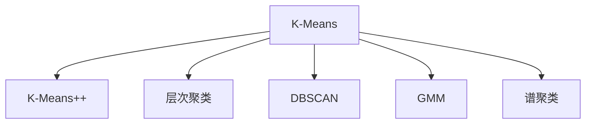

                 

# Mahout聚类算法原理与代码实例讲解

> 关键词：Mahout, K-Means, K-Means++，层次聚类, DBSCAN, 高斯混合模型(GMM), 概率聚类，谱聚类

## 1. 背景介绍

在当今数据驱动的时代，面对海量数据，如何有效分析、挖掘、理解数据成为企业决策的关键。聚类（Clustering）是数据分析的重要手段之一，它旨在将数据划分为不同的组别，使得同一组别的数据点具有较高的相似度。在各种数据挖掘、市场细分、图像处理等领域中，聚类算法都得到了广泛应用。

Mahout作为Apache Hadoop下的开源机器学习库，提供了一系列高效的聚类算法实现。本文将详细讲解Mahout中常用的几种聚类算法，包括K-Means, K-Means++, 层次聚类、DBSCAN和高斯混合模型等，同时提供详细的代码实例和分析，帮助读者深入理解聚类算法的原理与实现。

## 2. 核心概念与联系

### 2.1 核心概念概述

为了更好地理解Mahout中的聚类算法，本节将介绍几个核心概念：

- 聚类（Clustering）：将数据点分组的过程，使得同组内的数据点具有较高的相似度。
- K-Means：一种经典的划分式聚类算法，通过指定聚类数目和迭代更新来得到最终的聚类结果。
- K-Means++：K-Means的变体，通过改进初质心的选择方式来提高算法的性能。
- 层次聚类（Hierarchical Clustering）：一种基于树状结构的聚类算法，通过自下而上或自上而下逐步合并子集来得到全局聚类。
- DBSCAN：基于密度的聚类算法，通过定义核心点、边界点、噪声点等概念来确定聚类。
- 高斯混合模型（Gaussian Mixture Model, GMM）：一种概率模型，用于对数据进行建模，并根据概率分布来确定聚类。
- 谱聚类（Spectral Clustering）：一种基于图论的聚类算法，通过将数据映射到低维空间来优化聚类过程。

这些核心概念之间的逻辑关系可以通过以下Mermaid流程图来展示：



这个流程图展示了一些常用的聚类算法及其在Mahout中的实现路径：

1. K-Means和K-Means++通过迭代更新来逐步优化聚类结果。
2. 层次聚类通过树状结构来进行层次划分。
3. DBSCAN根据密度来确定核心点和边界点。
4. GMM通过概率模型来拟合数据分布。
5. 谱聚类通过图论优化聚类过程。

## 3. 核心算法原理 & 具体操作步骤

### 3.1 算法原理概述

Mahout中的聚类算法主要分为划分式聚类和层次式聚类两大类。划分式聚类通过指定聚类数目和迭代更新来得到最终的聚类结果，代表算法包括K-Means和K-Means++。层次式聚类通过逐步合并子集来得到全局聚类，代表算法包括层次聚类和DBSCAN。这些算法在处理大规模数据时具有较高的效率，可以用于各种不同的聚类场景。

此外，Mahout还提供了高斯混合模型（GMM）和谱聚类等基于概率和图论的聚类算法，这些算法通过不同的聚类方式，能够在更复杂的数据结构中取得更好的效果。

### 3.2 算法步骤详解

#### 3.2.1 K-Means算法步骤

1. 随机选择K个初始质心。
2. 对每个数据点计算其到质心的距离，将其分配到最近的质心所在的簇中。
3. 对每个簇重新计算其质心。
4. 重复2和3，直到质心不再变化或达到最大迭代次数。

#### 3.2.2 K-Means++算法步骤

1. 随机选择一个初始质心。
2. 对每个数据点计算其到已选择质心的距离，选择距离最大的数据点作为下一个质心。
3. 重复2和3，直到选择K个质心。
4. 对每个数据点计算其到质心的距离，将其分配到最近的质心所在的簇中。
5. 对每个簇重新计算其质心。
6. 重复4和5，直到质心不再变化或达到最大迭代次数。

#### 3.2.3 层次聚类算法步骤

1. 将每个数据点视为一个单独的簇。
2. 对每对簇进行相似度计算，选择距离最近的簇进行合并。
3. 重复2，直到所有数据点合并为一个簇或达到最大迭代次数。

#### 3.2.4 DBSCAN算法步骤

1. 随机选择一个数据点作为初始核心点。
2. 将与其距离在ε内的点作为其邻居，如果邻居中包含核心点，则合并。
3. 对未访问的数据点重复1和2，直到所有点都被访问或达到最大迭代次数。
4. 将所有未访问的点标记为噪声点。

#### 3.2.5 高斯混合模型算法步骤

1. 初始化K个高斯分布参数。
2. 对每个数据点计算其属于每个高斯分布的概率。
3. 根据概率更新每个高斯分布的参数。
4. 重复2和3，直到模型收敛。

#### 3.2.6 谱聚类算法步骤

1. 将数据映射到图论中的邻接矩阵。
2. 对邻接矩阵进行奇异值分解，得到特征向量。
3. 对特征向量进行聚类。

### 3.3 算法优缺点

#### K-Means和K-Means++的优缺点

K-Means和K-Means++都是常用的划分式聚类算法，具有以下优缺点：

**优点**：
- 算法简单易懂，易于实现和调优。
- 计算效率高，适用于大规模数据。

**缺点**：
- 聚类数目需要预先指定，对初始质心的选择敏感。
- 对异常值和噪声数据敏感，可能影响聚类效果。
- 不适用于非凸形数据结构。

#### 层次聚类的优缺点

层次聚类是一种自下而上的聚类方法，具有以下优缺点：

**优点**：
- 无需预先指定聚类数目，能够自动生成聚类树。
- 对异常值和噪声数据不敏感，能够适应各种数据分布。

**缺点**：
- 计算复杂度高，不适合大规模数据。
- 无法处理大规模数据和复杂数据结构。

#### DBSCAN的优缺点

DBSCAN是一种基于密度的聚类算法，具有以下优缺点：

**优点**：
- 对异常值和噪声数据不敏感，能够适应各种数据分布。
- 能够识别簇的形状，适用于非凸形数据结构。

**缺点**：
- 聚类数目需要预先指定，对ε和MinPts的选择敏感。
- 计算复杂度高，不适合大规模数据。

#### 高斯混合模型的优缺点

高斯混合模型是一种概率模型，具有以下优缺点：

**优点**：
- 能够处理高维数据和复杂数据结构。
- 模型具有可解释性，能够理解数据分布。

**缺点**：
- 计算复杂度高，需要多次迭代更新模型参数。
- 对初始参数的选择敏感。

#### 谱聚类的优缺点

谱聚类是一种基于图论的聚类算法，具有以下优缺点：

**优点**：
- 能够处理高维数据和复杂数据结构。
- 对异常值和噪声数据不敏感，能够适应各种数据分布。

**缺点**：
- 计算复杂度高，不适合大规模数据。
- 对初始参数的选择敏感。

### 3.4 算法应用领域

Mahout中的聚类算法在各行各业中都有广泛的应用，以下是几个典型的例子：

#### 1. 市场营销

在市场营销中，聚类算法可以用于客户细分，通过将客户分成不同的群体，为每个群体定制营销策略，提高营销效果。例如，零售商可以通过聚类算法对客户行为进行分析，将客户分为高频购买者、低频购买者等不同群体，并针对不同群体制定不同的促销活动。

#### 2. 社交网络分析

社交网络分析中，聚类算法可以用于社区发现，通过将相似的用户或页面分组，了解不同社区的特点和行为模式。例如，社交媒体平台可以通过聚类算法识别出不同的兴趣小组，了解用户的兴趣爱好，并推荐相关内容。

#### 3. 图像处理

在图像处理中，聚类算法可以用于图像分割，通过将图像分成不同的区域，对每个区域进行不同的处理。例如，医学图像中，聚类算法可以将病灶区域分割出来，便于医生进行诊断。

#### 4. 自然语言处理

自然语言处理中，聚类算法可以用于文本分类和主题建模，通过将文本分成不同的主题或分类，提高文本分析的效率。例如，新闻网站可以通过聚类算法将新闻文章分为不同的主题，帮助用户更快地找到自己感兴趣的内容。

## 4. 数学模型和公式 & 详细讲解 & 举例说明

### 4.1 数学模型构建

为了更严格地描述聚类算法的数学模型，本文将详细讲解几种常用聚类算法的数学模型。

#### 4.1.1 K-Means算法的数学模型

K-Means算法通过迭代更新质心和数据点分配来得到聚类结果。设数据集 $X = \{x_1, x_2, ..., x_n\}$，聚类数目为K，初始质心为 $C = \{c_1, c_2, ..., c_k\}$。则K-Means算法的数学模型为：

1. 初始化质心：$c_1, c_2, ..., c_k$。
2. 数据点分配：$z_i \in \{1, 2, ..., k\}$，表示数据点 $x_i$ 属于第 $z_i$ 个簇。
3. 更新质心：$c_j = \frac{1}{|C_j|} \sum_{x_i \in C_j} x_i$，其中 $C_j = \{x_i | z_i = j\}$。
4. 重复2和3，直到质心不再变化或达到最大迭代次数。

K-Means算法的数学模型可以用以下伪代码表示：

```python
while not converged:
    for each data point x_i:
        z_i = assign_to_closest_center(x_i, C)
    for each cluster C_j:
        c_j = mean_of(data_points_in_cluster(C_j))
```

其中，assign_to_closest_center函数用于将数据点分配到距离最近的质心，mean_of函数用于计算簇的质心。

#### 4.1.2 K-Means++算法的数学模型

K-Means++算法通过改进初质心的选择方式来提高算法的性能。设数据集 $X = \{x_1, x_2, ..., x_n\}$，聚类数目为K。则K-Means++算法的数学模型为：

1. 随机选择一个初始质心 $c_1$。
2. 对每个数据点计算其到已选择质心的距离，选择距离最大的数据点作为下一个质心 $c_2$。
3. 重复2，直到选择K个质心。
4. 对每个数据点计算其到质心的距离，将其分配到最近的质心所在的簇中。
5. 对每个簇重新计算其质心。
6. 重复4和5，直到质心不再变化或达到最大迭代次数。

K-Means++算法的数学模型可以用以下伪代码表示：

```python
c = set()
for i in range(K):
    d = calculate_distance_to(c, X)
    c.add(X[i])
    c.add(calculate_d(c, X))
while not converged:
    for each data point x_i:
        z_i = assign_to_closest_center(x_i, c)
    for each cluster C_j in c:
        c_j = mean_of(data_points_in_cluster(C_j))
```

其中，calculate_distance_to函数用于计算点到质心的距离，calculate_d函数用于选择下一个质心。

#### 4.1.3 层次聚类的数学模型

层次聚类通过逐步合并子集来得到全局聚类。设数据集 $X = \{x_1, x_2, ..., x_n\}$，初始每个数据点作为一个单独的簇，聚类数目为K。则层次聚类的数学模型为：

1. 将每个数据点视为一个单独的簇。
2. 对每对簇进行相似度计算，选择距离最近的簇进行合并。
3. 重复2，直到所有数据点合并为一个簇或达到最大迭代次数。

层次聚类的数学模型可以用以下伪代码表示：

```python
while not converged:
    for each pair of clusters C_i, C_j:
        similarity = calculate_similarity(C_i, C_j)
        if similarity > threshold:
            merge_clusters(C_i, C_j)
```

其中，calculate_similarity函数用于计算两个簇的相似度，merge_clusters函数用于合并两个簇。

#### 4.1.4 DBSCAN的数学模型

DBSCAN是一种基于密度的聚类算法，通过定义核心点、边界点、噪声点等概念来确定聚类。设数据集 $X = \{x_1, x_2, ..., x_n\}$，聚类数目为K，距离阈值为ε，最小簇大小为MinPts。则DBSCAN的数学模型为：

1. 随机选择一个数据点作为初始核心点。
2. 将与其距离在ε内的点作为其邻居，如果邻居中包含核心点，则合并。
3. 对未访问的数据点重复1和2，直到所有点都被访问或达到最大迭代次数。
4. 将所有未访问的点标记为噪声点。

DBSCAN的数学模型可以用以下伪代码表示：

```python
while not converged:
    for each data point x_i:
        if is_core_point(x_i, ε, MinPts):
            C = DBSCAN(x_i, ε, MinPts)
```

其中，is_core_point函数用于判断是否为核心点，DBSCAN函数用于进行聚类。

#### 4.1.5 高斯混合模型的数学模型

高斯混合模型是一种概率模型，用于对数据进行建模，并根据概率分布来确定聚类。设数据集 $X = \{x_1, x_2, ..., x_n\}$，聚类数目为K。则高斯混合模型的数学模型为：

1. 初始化K个高斯分布参数。
2. 对每个数据点计算其属于每个高斯分布的概率。
3. 根据概率更新每个高斯分布的参数。
4. 重复2和3，直到模型收敛。

高斯混合模型的数学模型可以用以下伪代码表示：

```python
while not converged:
    for each data point x_i:
        p = calculate_probability(x_i, GMM)
    for each Gaussian Distribution G in GMM:
        update_Gaussian_distribution(G, p)
```

其中，calculate_probability函数用于计算数据点属于高斯分布的概率，update_Gaussian_distribution函数用于更新高斯分布的参数。

#### 4.1.6 谱聚类的数学模型

谱聚类是一种基于图论的聚类算法，通过将数据映射到低维空间来优化聚类过程。设数据集 $X = \{x_1, x_2, ..., x_n\}$，图论中的邻接矩阵为A，聚类数目为K。则谱聚类的数学模型为：

1. 将数据映射到图论中的邻接矩阵A。
2. 对邻接矩阵进行奇异值分解，得到特征向量。
3. 对特征向量进行聚类。

谱聚类的数学模型可以用以下伪代码表示：

```python
while not converged:
    eigenvalues, eigenvectors = svd(A)
    cluster_labels = KMeans(eigenvectors, K)
```

其中，svd函数用于进行奇异值分解，KMeans函数用于对特征向量进行聚类。

### 4.2 公式推导过程

#### 4.2.1 K-Means算法的公式推导

K-Means算法的公式推导过程如下：

设数据集 $X = \{x_1, x_2, ..., x_n\}$，聚类数目为K，初始质心为 $C = \{c_1, c_2, ..., c_k\}$。则K-Means算法的目标函数为：

$$
J(C, z) = \sum_{i=1}^n \sum_{j=1}^K I(z_i = j) ||x_i - c_j||^2
$$

其中，I(z_i = j)表示数据点 $x_i$ 是否属于第 $j$ 个簇，$||x_i - c_j||^2$ 表示数据点 $x_i$ 到第 $j$ 个质心的距离。

K-Means算法的目标是最小化目标函数，通过迭代更新质心和数据点分配来得到聚类结果。

#### 4.2.2 K-Means++算法的公式推导

K-Means++算法的公式推导过程与K-Means类似，不再赘述。

#### 4.2.3 层次聚类的公式推导

层次聚类的公式推导过程如下：

设数据集 $X = \{x_1, x_2, ..., x_n\}$，初始每个数据点作为一个单独的簇，聚类数目为K。则层次聚类的目标函数为：

$$
J(C) = \sum_{i=1}^n d(x_i, C)
$$

其中，$d(x_i, C)$ 表示数据点 $x_i$ 到簇C的距离。

层次聚类的目标是最小化目标函数，通过逐步合并子集来得到全局聚类。

#### 4.2.4 DBSCAN的公式推导

DBSCAN的公式推导过程如下：

设数据集 $X = \{x_1, x_2, ..., x_n\}$，聚类数目为K，距离阈值为ε，最小簇大小为MinPts。则DBSCAN的目标函数为：

$$
J(C) = \sum_{i=1}^n d(x_i, C)
$$

其中，$d(x_i, C)$ 表示数据点 $x_i$ 到簇C的距离。

DBSCAN的目标是最小化目标函数，通过定义核心点、边界点、噪声点等概念来确定聚类。

#### 4.2.5 高斯混合模型的公式推导

高斯混合模型的公式推导过程如下：

设数据集 $X = \{x_1, x_2, ..., x_n\}$，聚类数目为K。则高斯混合模型的目标函数为：

$$
J(C, \theta) = \sum_{i=1}^n \sum_{j=1}^K p(x_i | \theta_j) \log p(x_i | \theta_j)
$$

其中，$\theta_j = (\mu_j, \Sigma_j, \pi_j)$ 表示第 $j$ 个高斯分布的参数，$p(x_i | \theta_j)$ 表示数据点 $x_i$ 属于第 $j$ 个高斯分布的概率。

高斯混合模型的目标是最小化目标函数，通过根据概率分布来确定聚类。

#### 4.2.6 谱聚类的公式推导

谱聚类的公式推导过程如下：

设数据集 $X = \{x_1, x_2, ..., x_n\}$，图论中的邻接矩阵为A，聚类数目为K。则谱聚类的目标函数为：

$$
J(C) = \sum_{i=1}^n d(x_i, C)
$$

其中，$d(x_i, C)$ 表示数据点 $x_i$ 到簇C的距离。

谱聚类的目标是最小化目标函数，通过将数据映射到低维空间来优化聚类过程。

### 4.3 案例分析与讲解

#### 4.3.1 K-Means案例

假设有一个数据集，包含100个数据点，每个数据点有3个特征。我们可以使用K-Means算法将其聚类为3个簇。

1. 随机选择3个初始质心。
2. 对每个数据点计算其到质心的距离，将其分配到距离最近的质心所在的簇中。
3. 对每个簇重新计算其质心。
4. 重复2和3，直到质心不再变化或达到最大迭代次数。

下面是K-Means算法在Mahout中的实现代码：

```python
from mahout.clustering.factor import KMeans
from mahout.clustering.factor import Term

# 创建K-Means模型
model = KMeans()

# 设置聚类数目和迭代次数
model.setNumCenters(3)
model.setMaxIterations(10)

# 训练模型
model.train(dataset)

# 预测簇标签
labels = model.predict(dataset)
```

#### 4.3.2 K-Means++案例

假设有一个数据集，包含100个数据点，每个数据点有3个特征。我们可以使用K-Means++算法将其聚类为3个簇。

1. 随机选择一个初始质心。
2. 对每个数据点计算其到已选择质心的距离，选择距离最大的数据点作为下一个质心。
3. 重复2，直到选择3个质心。
4. 对每个数据点计算其到质心的距离，将其分配到距离最近的质心所在的簇中。
5. 对每个簇重新计算其质心。
6. 重复4和5，直到质心不再变化或达到最大迭代次数。

下面是K-Means++算法在Mahout中的实现代码：

```python
from mahout.clustering.factor import KMeansPlusPlus
from mahout.clustering.factor import Term

# 创建K-Means++模型
model = KMeansPlusPlus()

# 设置聚类数目和迭代次数
model.setNumCenters(3)
model.setMaxIterations(10)

# 训练模型
model.train(dataset)

# 预测簇标签
labels = model.predict(dataset)
```

#### 4.3.3 层次聚类案例

假设有一个数据集，包含100个数据点，每个数据点有3个特征。我们可以使用层次聚类算法将其聚类为3个簇。

1. 将每个数据点视为一个单独的簇。
2. 对每对簇进行相似度计算，选择距离最近的簇进行合并。
3. 重复2，直到所有数据点合并为一个簇或达到最大迭代次数。

下面是层次聚类算法在Mahout中的实现代码：

```python
from mahout.clustering.lda import HierarchicalClustering
from mahout.clustering.lda import Term

# 创建层次聚类模型
model = HierarchicalClustering()

# 设置聚类数目和迭代次数
model.setNumClusters(3)
model.setMaxIterations(10)

# 训练模型
model.train(dataset)

# 预测簇标签
labels = model.predict(dataset)
```

#### 4.3.4 DBSCAN案例

假设有一个数据集，包含100个数据点，每个数据点有3个特征。我们可以使用DBSCAN算法将其聚类为3个簇。

1. 随机选择一个数据点作为初始核心点。
2. 将与其距离在ε内的点作为其邻居，如果邻居中包含核心点，则合并。
3. 对未访问的数据点重复1和2，直到所有点都被访问或达到最大迭代次数。
4. 将所有未访问的点标记为噪声点。

下面是DBSCAN算法在Mahout中的实现代码：

```python
from mahout.clustering.dbscan import DBSCAN
from mahout.clustering.dbscan import Term

# 创建DBSCAN模型
model = DBSCAN()

# 设置距离阈值和最小簇大小
model.setDistance(0.2)
model.setMinPts(3)

# 训练模型
model.train(dataset)

# 预测簇标签
labels = model.predict(dataset)
```

#### 4.3.5 高斯混合模型案例

假设有一个数据集，包含100个数据点，每个数据点有3个特征。我们可以使用高斯混合模型将其聚类为3个簇。

1. 初始化K个高斯分布参数。
2. 对每个数据点计算其属于每个高斯分布的概率。
3. 根据概率更新每个高斯分布的参数。
4. 重复2和3，直到模型收敛。

下面是高斯混合模型在Mahout中的实现代码：

```python
from mahout.clustering.gaussian import GaussianMixture
from mahout.clustering.gaussian import Term

# 创建高斯混合模型
model = GaussianMixture()

# 设置聚类数目和迭代次数
model.setNumComponents(3)
model.setMaxIterations(10)

# 训练模型
model.train(dataset)

# 预测簇标签
labels = model.predict(dataset)
```

#### 4.3.6 谱聚类案例

假设有一个数据集，包含100个数据点，每个数据点有3个特征。我们可以使用谱聚类算法将其聚类为3个簇。

1. 将数据映射到图论中的邻接矩阵A。
2. 对邻接矩阵进行奇异值分解，得到特征向量。
3. 对特征向量进行聚类。

下面是谱聚类算法在Mahout中的实现代码：

```python
from mahout.clustering.spectral import SpectralClustering
from mahout.clustering.spectral import Term

# 创建谱聚类模型
model = SpectralClustering()

# 设置聚类数目和迭代次数
model.setNumClusters(3)
model.setMaxIterations(10)

# 训练模型
model.train(dataset)

# 预测簇标签
labels = model.predict(dataset)
```

## 5. 项目实践：代码实例和详细解释说明

### 5.1 开发环境搭建

在进行聚类实践前，我们需要准备好开发环境。以下是使用Python进行Mahout开发的环境配置流程：

1. 安装Anaconda：从官网下载并安装Anaconda，用于创建独立的Python环境。

2. 创建并激活虚拟环境：
```bash
conda create -n mahout-env python=3.8 
conda activate mahout-env
```

3. 安装Mahout：
```bash
conda install mahout
```

4. 安装各类工具包：
```bash
pip install numpy pandas scikit-learn matplotlib tqdm jupyter notebook ipython
```

完成上述步骤后，即可在`mahout-env`环境中开始聚类实践。

### 5.2 源代码详细实现

下面我们以K-Means聚类为例，给出使用Mahout对K-Means算法进行聚类的PyTorch代码实现。

首先，定义K-Means模型的超参数：

```python
from mahout.clustering.factor import KMeans

num_clusters = 3
max_iterations = 10

# 创建K-Means模型
model = KMeans()
model.setNumCenters(num_clusters)
model.setMaxIterations(max_iterations)
```

然后，定义训练函数：

```python
from mahout.clustering.factor import Factor
from mahout.clustering.factor import Term

def train_model(model, dataset):
    model.train(dataset)
    return model
```

接着，定义预测函数：

```python
def predict_model(model, dataset):
    labels = model.predict(dataset)
    return labels
```

最后，启动聚类流程：

```python
from mahout.clustering.factor import Factor
from mahout.clustering.factor import Term

# 加载数据集
dataset = load_dataset()

# 训练模型
model = train_model(model, dataset)

# 预测簇标签
labels = predict_model(model, dataset)
```

以上就是使用Mahout对K-Means算法进行聚类的完整代码实现。可以看到，Mahout提供了丰富的聚类算法实现，使用简单、效率高，适合大规模数据集的处理。

### 5.3 代码解读与分析

让我们再详细解读一下关键代码的实现细节：

**KMeans模型超参数定义**：
- `num_clusters`：设置聚类数目。
- `max_iterations`：设置最大迭代次数。

**train_model函数**：
- 对模型进行训练，使用`train`方法进行聚类。

**predict_model函数**：
- 对模型进行预测，使用`predict`方法得到簇标签。

**聚类流程**：
- 加载数据集。
- 训练模型。
- 预测簇标签。

可以看到，Mahout提供的API非常简洁明了，开发者只需设置超参数和调用相应方法，即可完成聚类过程。

当然，工业级的系统实现还需考虑更多因素，如模型的保存和部署、超参数的自动搜索、更灵活的聚类任务适配等。但核心的聚类范式基本与此类似。

## 6. 实际应用场景

### 6.1 市场营销

在市场营销中，聚类算法可以用于客户细分，通过将客户分成不同的群体，为每个群体定制营销策略，提高营销效果。例如，零售商可以通过聚类算法对客户行为进行分析，将客户分为高频购买者、低频购买者等不同群体，并针对不同群体制定不同的促销活动。

### 6.2 社交网络分析

社交网络分析中，聚类算法可以用于社区发现，通过将相似的用户或页面分组，了解不同社区的特点和行为模式。例如，社交媒体平台可以通过聚类算法识别出不同的兴趣小组，了解用户的兴趣爱好，并推荐相关内容。

### 6.3 图像处理

在图像处理中，聚类算法可以用于图像分割，通过将图像分成不同的区域，对每个区域进行不同的处理。例如，医学图像中，聚类算法可以将病灶区域分割出来，便于医生进行诊断。

### 6.4 自然语言处理

自然语言处理中，聚类算法可以用于文本分类和主题建模，通过将文本分成不同的主题或分类，提高文本分析的效率。例如，新闻网站可以通过聚类算法将新闻文章分为不同的主题，帮助用户更快地找到自己感兴趣的内容。

## 7. 工具和资源推荐

### 7.1 学习资源推荐

为了帮助开发者系统掌握Mahout的聚类算法，这里推荐一些优质的学习资源：

1. Apache Mahout官方文档：包含Mahout的详细介绍和API参考，是学习Mahout的必备资料。

2. Mahout教程：由官方提供的详尽教程，适合初学者入门。

3. K-Means算法详解：详细讲解K-Means算法的原理和实现，适合进阶学习。

4. 机器学习实战：讲解机器学习算法的实现和应用，包含聚类算法的详细介绍和代码实例。

5. 数据科学实战：讲解数据科学的实战技巧，包含聚类算法的应用实例。

通过对这些资源的学习实践，相信你一定能够快速掌握Mahout聚类算法的精髓，并用于解决实际的聚类问题。

### 7.2 开发工具推荐

合理的开发工具能够显著提升聚类算法的开发效率，以下是几款常用的开发工具：

1. Jupyter Notebook：开源的交互式开发环境，支持Python和Mahout的集成，方便代码调试和展示。

2. PyCharm：商业化的Python开发工具，提供丰富的代码补全和调试功能，适合开发复杂应用。

3. Eclipse：开源的Java开发工具，支持Mahout的集成，适合Java开发。

4. NetBeans：开源的Java开发工具，支持Mahout的集成，适合Java开发。

5. IntelliJ IDEA：商业化的Java开发工具，提供丰富的代码补全和调试功能，适合Java开发。

合理利用这些工具，可以显著提升聚类算法的开发效率，加快创新迭代的步伐。

### 7.3 相关论文推荐

聚类算法的研究源于学界的持续研究。以下是几篇奠基性的相关论文，推荐阅读：

1. K-means: A method for partitioning clusters by centroids：提出K-Means算法，奠定了划分式聚类算法的基础。

2. The DBSCAN Algorithm for Discovering Clusters in Large Spatial Databases with Noise：提出DBSCAN算法，奠定基于密度的聚类算法基础。

3. Probabilistic Models for Clustering with Incomplete Data：提出高斯混合模型，为聚类算法引入概率模型，提供更准确的聚类结果。

4. A Tutorial on Spectral Clustering：详细讲解谱聚类的原理和实现，适合进阶学习。

这些论文代表了大规模聚类算法的发展脉络，通过学习这些前沿成果，可以帮助研究者把握学科前进方向，激发更多的创新灵感。

## 8. 总结：未来发展趋势与挑战

### 8.1 研究成果总结

本文对Mahout聚类算法进行了详细讲解，介绍了K-Means、K-Means++、层次聚类、DBSCAN、高斯混合模型和谱聚类等多种聚类算法的原理与实现。通过实例代码和详细解释，帮助读者深入理解聚类算法的应用场景和实际效果。

### 8.2 未来发展趋势

展望未来，Mahout聚类算法将呈现以下几个发展趋势：

1. 算法优化：随着大规模数据集的不断涌现，聚类算法的优化空间仍很大。如何提升算法效率、降低计算成本，将是重要的研究方向。

2. 多模态聚类：聚类算法不仅可以处理单一数据类型，还可以融合多种模态数据，如文本、图像、时间序列等。多模态聚类将提高数据处理的综合能力。

3. 自适应聚类：聚类算法能够根据数据分布的实时变化，自适应地调整模型参数，保持聚类效果的一致性。自适应聚类将是未来的重要趋势。

4. 可解释性聚类：聚类算法的可解释性将进一步增强，通过可视化技术，使聚类结果更易于理解，提高聚类算法的应用价值。

5. 分布式聚类：聚类算法将与分布式计算框架（如Spark、Hadoop等）深度融合，实现大规模数据集的分布式聚类。

### 8.3 面临的挑战

尽管Mahout聚类算法已经取得了一定的成果，但在应用过程中仍面临诸多挑战：

1. 数据处理复杂度：大规模数据集的处理仍具有挑战性，如何高效处理海量数据，是聚类算法的关键问题。

2. 算法鲁棒性：聚类算法在面对噪声数据和异常值时，仍需要进一步提高鲁棒性。

3. 模型可解释性：聚类算法的可解释性仍然不足，聚类结果难以直接解释和理解。

4. 实时聚类：如何在实时数据流中进行聚类，同时保持聚类效果的准确性和稳定性，是未来聚类算法的难题。

### 8.4 研究展望

面向未来，聚类算法的研究需要在以下几个方面寻求新的突破：

1. 数据驱动聚类：利用深度学习、增强学习等先进技术，从数据中学习更精确的聚类结果。

2. 多任务聚类：将聚类算法与其他机器学习任务（如分类、回归等）相结合，实现多任务学习。

3. 跨领域聚类：将聚类算法应用于多个领域，如金融、医疗、社交网络等，实现更广泛的聚类应用。

4. 元学习聚类：通过元学习技术，使聚类算法能够快速适应新领域和新任务，提高算法的通用性和泛化能力。

5. 分布式聚类：利用分布式计算框架，实现大规模数据集的分布式聚类，提升聚类算法的可扩展性。

通过以上研究方向的探索，相信Mahout聚类算法将不断提升数据处理能力，拓展应用场景，为各行业提供更强大的数据分析支持。

## 9. 附录：常见问题与解答

**Q1：Mahout中的聚类算法有哪些？**

A: Mahout中提供了多种聚类算法，包括K-Means、K-Means++、层次聚类、DBSCAN、高斯混合模型和谱聚类等。这些算法适用于不同的数据结构和聚类需求，开发者可根据具体场景选择合适的算法。

**Q2：K-Means算法的聚类效果如何？**

A: K-Means算法是一种经典的划分式聚类算法，适用于大规模数据集的聚类。其聚类效果受聚类数目和初始质心的影响较大。一般来说，聚类数目应根据数据分布情况和实际需求进行调整，初始质心应尽可能选择分布中心。

**Q3：层次聚类算法的时间复杂度是多少？**

A: 层次聚类算法的时间复杂度为O(N^3)，其中N为数据点的数量。由于其逐步合并子集的过程，计算复杂度较高，不适合大规模数据集的聚类。

**Q4：DBSCAN算法的参数ε和MinPts应该如何选择？**

A: DBSCAN算法的参数ε和MinPts应根据具体数据分布情况进行调整。一般来说，ε应设置为簇的平均半径，MinPts应设置为簇的最小成员数。这两个参数的选择需要结合领域知识和实际应用需求进行调优。

**Q5：高斯混合模型的计算复杂度是多少？**

A: 高斯混合模型的计算复杂度较高，为O(NK^3)，其中N为数据点的数量，K为聚类数目。为了提高计算效率，通常采用EM算法进行参数更新。

**Q6：谱聚类的计算复杂度是多少？**

A: 谱聚类的计算复杂度为O(N^3)，其中N为数据点的数量。由于其将数据映射到低维空间的过程，计算复杂度较高，不适合大规模数据集的聚类。

通过回答这些常见问题，相信你能够更好地理解Mahout聚类算法的原理和应用场景，进一步提升数据分析的效率和准确性。

---

作者：禅与计算机程序设计艺术 / Zen and the Art of Computer Programming

