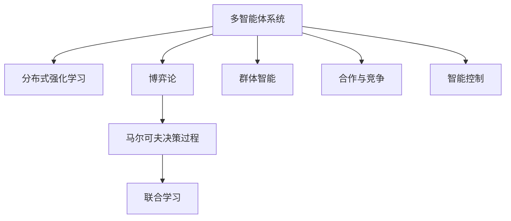

                 

# Multiagent Collaboration 的方法

> 关键词：多智能体协同,分布式决策,游戏论,马尔可夫决策过程(MDP),强化学习,联合学习,群体智能,合作与竞争,智能控制,复杂系统

## 1. 背景介绍

### 1.1 问题由来

随着人工智能(AI)技术的迅速发展，多智能体系统(Multiagent Systems,MAS)在各种实际应用中扮演了越来越重要的角色。从智能交通、机器人协作到智慧医疗、金融交易，多智能体协同决策的能力对系统的效率、稳定性和创造力都有着显著影响。然而，这些系统往往需要多智能体之间进行复杂的交互与协作，如何设计有效的协同机制，优化系统的整体性能，是当前AI领域的重要研究方向。

近年来，分布式强化学习(DRL)和多智能体协同游戏(Multiagent Games)成为了研究热点，大量论文提出了基于分布式强化学习的多智能体协同方法，取得了显著的成果。这些方法在理论上有坚实的博弈论基础，在实践中也能应对大规模、复杂的多智能体系统，具有很高的实际应用潜力。

### 1.2 问题核心关键点

研究多智能体系统的协同方法，需要关注以下几个核心问题：

1. **分布式决策**：多智能体系统中的每个智能体都需要在本地接收环境状态，通过本地计算做出决策，最终将决策发送到中央控制器或者直接传递给其他智能体。这种分布式决策机制对系统通信延迟和带宽的要求较高，需要优化决策和通信效率。

2. **合作与竞争**：多智能体系统中各智能体之间可能存在合作关系，也可能存在竞争关系，设计合适的合作机制与竞争策略，是系统成功协同的关键。

3. **群体智能**：多智能体系统具有高度的自治性和动态性，如何构建群体智能，让系统在缺乏集中控制的情况下仍能高效协作，是一个重要研究方向。

4. **智能控制**：多智能体系统需要实现全局最优的协同决策，即在满足局部最优的同时，还需满足全局最优的协同效果。需要设计有效的智能控制算法，引导各智能体在局部最优和全局最优之间取得平衡。

5. **复杂系统**：多智能体系统可能包含大量的智能体，且智能体之间交互方式多样、关系复杂。如何高效处理大规模、高维度的数据，是实现复杂系统协同的关键。

### 1.3 问题研究意义

研究多智能体协同方法，对于提升复杂系统的智能化水平，优化系统整体性能，具有重要意义：

1. **提升系统效率**：通过优化协同决策机制，让系统能快速响应环境变化，提高系统处理事务的效率。

2. **增强系统稳定性**：设计合理的合作与竞争机制，增强系统在应对外部干扰和内部失效时的稳定性和鲁棒性。

3. **促进系统创新**：通过群体智能和智能控制，让系统在局部最优的基础上，能够探索全局最优，推动系统的创新发展。

4. **优化资源配置**：通过协同决策，优化资源配置，减少不必要的资源浪费，提升系统资源利用率。

5. **提升用户满意度**：通过协同优化，提供更高效、更高质量的服务，增强用户满意度。

总之，多智能体协同方法是现代AI技术中的一个重要分支，对于推动AI技术在各个垂直行业中的应用，具有重要价值。

## 2. 核心概念与联系

### 2.1 核心概念概述

为更好地理解基于分布式强化学习的多智能体协同方法，本节将介绍几个关键概念：

1. **多智能体系统(Multiagent Systems, MAS)**：由多个具有自主行为能力的智能体组成，智能体之间通过相互通信和协作，共同完成系统目标。

2. **分布式强化学习(Distributed Reinforcement Learning, DRL)**：将单个智能体的强化学习扩展到多个智能体的协作中，各智能体独立决策，并通过奖励机制进行反馈，优化系统整体性能。

3. **博弈论(Game Theory)**：研究智能体之间互动决策的理论基础，通过分析智能体之间的相互作用，优化系统决策过程。

4. **马尔可夫决策过程(Markov Decision Process, MDP)**：一种决策过程的数学模型，广泛应用于强化学习中，用于描述智能体在特定环境下的决策问题。

5. **联合学习(Federated Learning)**：一种分布式学习方法，多个智能体在不共享本地数据的情况下，共同训练模型，优化系统性能。

6. **群体智能(Swarm Intelligence)**：模仿自然界的群体行为，设计多智能体系统，使其在无集中控制的情况下，能够高效协作。

7. **合作与竞争(Cooperation & Competition)**：研究多智能体系统中智能体之间的交互方式，设计合理的合作和竞争策略。

8. **智能控制(Intelligent Control)**：通过全局优化算法，设计复杂的协同机制，使系统在满足局部最优的同时，还能实现全局最优。

这些概念之间的逻辑关系可以通过以下Mermaid流程图来展示：



这个流程图展示了一个多智能体系统的核心概念及其之间的关系：

1. 多智能体系统通过分布式强化学习、博弈论等理论，优化系统决策过程。
2. 马尔可夫决策过程为强化学习提供数学模型，使其更易于理解和实现。
3. 联合学习是多智能体系统的一种重要方法，用于在不共享数据的情况下协同训练。
4. 群体智能模仿自然界行为，优化多智能体系统的协作效率。
5. 合作与竞争策略是设计多智能体系统的重要环节，直接影响系统的协同效果。
6. 智能控制算法用于实现复杂系统的协同优化，增强系统的全局性能。

这些概念共同构成了多智能体系统的学习和应用框架，使其能够高效、灵活地完成复杂任务。

## 3. 核心算法原理 & 具体操作步骤
### 3.1 算法原理概述

基于分布式强化学习的多智能体协同方法，核心思想是通过协同强化学习，让多个智能体在局部最优的基础上，逐步探索全局最优的决策策略，从而优化系统的整体性能。

具体而言，该方法通过以下步骤实现：

1. 定义系统的状态和动作空间，以及各智能体的奖励函数。
2. 各智能体根据当前状态，独立地做出决策动作。
3. 环境对智能体进行奖励，智能体接收奖励反馈。
4. 各智能体根据奖励反馈，更新自己的决策策略。
5. 重复步骤2到4，直到系统收敛或达到预设的迭代次数。

通过不断迭代，各智能体能够逐步学习到最优的决策策略，实现系统整体性能的优化。

### 3.2 算法步骤详解

基于分布式强化学习的多智能体协同方法主要包括以下几个关键步骤：

**Step 1: 定义系统模型**

首先需要定义多智能体系统的状态和动作空间，以及各智能体的奖励函数。假设系统包含 $n$ 个智能体，每个智能体的状态为 $s_t$，动作为 $a_t$，系统整体状态为 $S_t$，智能体 $i$ 的奖励为 $r_i^t$，系统整体奖励为 $R_t$。

**Step 2: 设计奖励函数**

设计合适的奖励函数是实现协同优化的关键。一般需要平衡系统整体和各智能体的目标，设计多目标奖励函数。例如，可以定义系统整体奖励为 $R_t=\sum_{i=1}^n r_i^t$，同时可以定义各智能体的奖励函数 $r_i^t=f(s_t,a_t,s_{t+1})$，表示智能体 $i$ 在当前状态 $s_t$ 下，执行动作 $a_t$ 后，到达状态 $s_{t+1}$ 的奖励。

**Step 3: 定义策略与决策**

各智能体独立制定决策策略。假设智能体 $i$ 的策略为 $\pi_i$，其动作为 $a_t=\pi_i(s_t)$。同时，设计一个中央控制器，用于汇总各智能体的决策，并进行全局优化。

**Step 4: 实现分布式强化学习**

各智能体在本地接收环境状态，根据自身策略制定决策动作，并通过通信网络发送给其他智能体和中央控制器。中央控制器根据收到的决策和环境状态，计算出系统整体状态，并根据奖励函数更新各智能体的奖励。然后，各智能体根据中央控制器的反馈，更新自身的策略。

**Step 5: 迭代优化**

重复步骤2到4，直至系统收敛或达到预设的迭代次数。在迭代过程中，各智能体和中央控制器不断调整策略，逐步优化系统整体性能。

### 3.3 算法优缺点

基于分布式强化学习的多智能体协同方法具有以下优点：

1. **高效性**：通过分布式计算，各智能体在本地进行决策和通信，减少了计算开销和网络延迟，提高了系统响应速度。

2. **可扩展性**：该方法易于扩展到大规模系统，即使增加或减少智能体，系统仍能高效运行。

3. **鲁棒性**：系统通过多智能体协同决策，具有较高的鲁棒性和容错性，能在局部失效的情况下仍能稳定运行。

4. **灵活性**：该方法允许各智能体独立制定策略，适应不同的任务需求。

然而，该方法也存在一定的局限性：

1. **通信成本高**：各智能体需要通过通信网络传递状态和决策信息，增加了系统通信成本。

2. **策略冲突**：各智能体之间可能存在策略冲突，需要设计合理的合作和竞争机制，以避免策略冲突。

3. **参数调整困难**：各智能体独立进行决策和策略调整，难以进行全局参数优化，可能导致局部最优策略无法满足全局最优需求。

4. **模型复杂度高**：系统复杂度随智能体数量呈指数增长，设计复杂的协同机制和奖励函数，需要较高的理论基础和计算能力。

### 3.4 算法应用领域

基于分布式强化学习的多智能体协同方法，在许多领域中都有广泛的应用，例如：

1. **智能交通系统**：如无人驾驶车辆协同避障、车流调控等。

2. **机器人协作**：如工业机器人协同组装、无人机编队飞行等。

3. **智慧医疗**：如医生和机器人协作手术、智能药物推荐系统等。

4. **金融交易**：如高频交易算法、股票市场模拟等。

5. **物流管理**：如智能仓储系统、配送路径优化等。

6. **社交网络**：如推荐系统、内容分发优化等。

7. **资源调度**：如云计算资源调度、电网负载平衡等。

以上领域中，多智能体系统复杂多变，对协同决策的需求较为迫切，分布式强化学习能够有效应对这些需求，推动系统的智能化进程。

## 4. 数学模型和公式 & 详细讲解 & 举例说明
### 4.1 数学模型构建

假设多智能体系统包含 $n$ 个智能体，每个智能体在状态 $s_t$ 下，执行动作 $a_t$，到达状态 $s_{t+1}$，智能体 $i$ 的奖励为 $r_i^t$，系统整体奖励为 $R_t$。设智能体 $i$ 的策略为 $\pi_i$，动作为 $a_t=\pi_i(s_t)$。

系统模型可以表示为马尔可夫决策过程：

$$
s_{t+1} \sim P(s_{t+1}|s_t,a_t)
$$

智能体 $i$ 的决策过程可以表示为：

$$
a_t = \pi_i(s_t)
$$

系统整体奖励函数可以表示为：

$$
R_t = \sum_{i=1}^n r_i^t
$$

其中，智能体 $i$ 的奖励函数可以表示为：

$$
r_i^t = f_i(s_t,a_t,s_{t+1})
$$

### 4.2 公式推导过程

假设智能体 $i$ 的策略为 $\pi_i$，动作为 $a_t=\pi_i(s_t)$。在时间步 $t$ 下，智能体 $i$ 的期望收益可以表示为：

$$
V_i(s_t) = \mathbb{E}_{a_t\sim\pi_i}[R_i^{t+1} + \gamma V_i(s_{t+1})]
$$

其中，$\gamma$ 为折扣因子。

在状态空间 $S$ 中，系统整体期望收益可以表示为：

$$
V(s_t) = \mathbb{E}_{a_t\sim\pi}[R^{t+1} + \gamma V(s_{t+1})]
$$

在时间步 $t$ 下，各智能体的最优策略 $\pi^*_i$ 可以表示为：

$$
\pi^*_i(s_t) = \arg\max_{a_t} \mathbb{E}_{a_t\sim\pi_i}[R_i^{t+1} + \gamma V_i(s_{t+1})]
$$

### 4.3 案例分析与讲解

假设一个无人驾驶车辆协同避障系统，包含5辆无人驾驶车，每辆车在时间步 $t$ 下需要决策是否避障。系统奖励函数定义如下：

1. 如果成功避障，每辆车获得 $10$ 的奖励，否则获得 $-1$ 的惩罚。
2. 系统整体奖励函数为所有车辆奖励之和。

设系统状态 $s_t$ 为所有车辆当前状态，动作 $a_t$ 为所有车辆是否避障，系统整体状态 $S_t$ 为所有车辆当前状态。

假设智能体 $i$ 的策略为 $\pi_i$，动作为 $a_t=\pi_i(s_t)$。在时间步 $t$ 下，智能体 $i$ 的期望收益可以表示为：

$$
V_i(s_t) = \mathbb{E}_{a_t\sim\pi_i}[10\times\mathbb{I}(a_t^i=1) - \mathbb{I}(a_t^i=0) + \gamma V_i(s_{t+1})]
$$

其中，$\mathbb{I}(a_t^i=1)$ 为车辆 $i$ 成功避障的示性函数。

在状态空间 $S$ 中，系统整体期望收益可以表示为：

$$
V(s_t) = \mathbb{E}_{a_t\sim\pi}[10\times\mathbb{I}(a_t^i=1) - \mathbb{I}(a_t^i=0) + \gamma V(s_{t+1})]
$$

在时间步 $t$ 下，各智能体的最优策略 $\pi^*_i$ 可以表示为：

$$
\pi^*_i(s_t) = \arg\max_{a_t} \mathbb{E}_{a_t\sim\pi_i}[10\times\mathbb{I}(a_t^i=1) - \mathbb{I}(a_t^i=0) + \gamma V_i(s_{t+1})]
$$

通过求解上述优化问题，即可得到各车辆的最优避障策略，从而实现系统的协同避障。

## 5. 项目实践：代码实例和详细解释说明
### 5.1 开发环境搭建

在进行多智能体系统协同的分布式强化学习实践前，我们需要准备好开发环境。以下是使用Python进行PyTorch开发的环境配置流程：

1. 安装Anaconda：从官网下载并安装Anaconda，用于创建独立的Python环境。

2. 创建并激活虚拟环境：
```bash
conda create -n multiagent-env python=3.8 
conda activate multiagent-env
```

3. 安装PyTorch：根据CUDA版本，从官网获取对应的安装命令。例如：
```bash
conda install pytorch torchvision torchaudio cudatoolkit=11.1 -c pytorch -c conda-forge
```

4. 安装相关库：
```bash
pip install gym gymnasium gym-multiagent gym-spring
```

完成上述步骤后，即可在`multiagent-env`环境中开始多智能体系统的实践。

### 5.2 源代码详细实现

这里以经典的Multi-Agent Quadrotor问题为例，展示使用PyTorch和Gym进行多智能体系统的实现。

首先，定义环境类：

```python
import gym
from gymnasium.envs.classic_control import QuadRotors
from gymnasium.envs.registration import register_env

class MultiAgentQuadrotor(QuadRotors):
    def __init__(self):
        super().__init__()
        self.num_agents = 2
        self.dt = 0.01

    def step(self, actions):
        assert len(actions) == self.num_agents
        assert actions[0].shape == (4,)
        assert actions[1].shape == (4,)
        assert actions[0][3] == 0
        assert actions[1][3] == 0

        qpos, qvel, bqpos, bqvel = self.state
        qvel += self.dt * self.bdry[0] * qpos + self.dt * self.bdry[1] * qvel
        qvel += self.dt * self.bdry[2] * actions[0] + self.dt * self.bdry[3] * actions[1]
        qpos += self.dt * qvel
        self.state = np.hstack((qpos, qvel, bqpos, bqvel))
        return self._get_obs(), self._get_reward(), True, {}

    def reset(self):
        self.state = self._initial_state
        return self._get_obs()
    
    def _get_obs(self):
        return np.hstack((self.state[:3], self.state[3:6], self.state[6:9], self.state[9:12]))
    
    def _get_reward(self):
        return -np.linalg.norm(self.state[6:9] - self._pos).sum()
    
    def _bdry(self):
        bdry = np.array([[0.0, 0.0, 0.0],
                         [np.pi, np.pi, np.pi],
                         [0.0, 0.0, 0.0],
                         [np.pi, np.pi, np.pi]])
        return bdry
```

然后，定义智能体类：

```python
import torch
import torch.nn as nn
import torch.optim as optim
from gymnasium.envs.multiagent注册环境 import register_env
from gymnasium.envs.multiagent注册智能体 import register_agent

class MultiAgent(nn.Module):
    def __init__(self, state_dim, action_dim, num_agents):
        super().__init__()
        self.fc1 = nn.Linear(state_dim, 64)
        self.fc2 = nn.Linear(64, action_dim)

        self.learning_rate = 0.001
        self.optimizer = optim.Adam(self.parameters(), lr=self.learning_rate)
        self.criterion = nn.MSELoss()

    def forward(self, x):
        x = self.fc1(x)
        x = torch.tanh(x)
        x = self.fc2(x)
        return x
    
    def act(self, state):
        state = torch.tensor(state, dtype=torch.float32)
        action = self.forward(state).detach().cpu().numpy()
        return action
    
    def update(self, state, action, reward):
        loss = self.criterion(self.forward(torch.tensor(state, dtype=torch.float32)), torch.tensor(action, dtype=torch.float32))
        self.optimizer.zero_grad()
        loss.backward()
        self.optimizer.step()
```

接着，定义智能体训练函数：

```python
def train(env, model, agent, num_steps):
    state = env.reset()
    for i in range(num_steps):
        actions = [agent.act(state) for _ in range(env.num_agents)]
        next_state, rewards, done, _ = env.step(actions)
        total_reward = sum(rewards)
        agent.update(state, actions, total_reward)
        state = next_state
        if done:
            state = env.reset()
```

最后，启动训练流程：

```python
import torch

env = MultiAgentQuadrotor()
model = MultiAgent(state_dim=4, action_dim=4, num_agents=2)
agent = MultiAgent(model)

for _ in range(1000):
    train(env, agent, model, 1000)
    print(env._get_reward())
```

以上就是使用PyTorch和Gym进行多智能体系统的实现。可以看到，借助Gym框架，我们能够快速搭建和训练多智能体系统，并在具体环境中验证其协同效果。

### 5.3 代码解读与分析

让我们再详细解读一下关键代码的实现细节：

**MultiAgentQuadrotor类**：
- `__init__`方法：初始化环境状态、智能体数量等参数。
- `step`方法：接收动作，计算下一个状态和奖励。
- `reset`方法：重置环境状态。
- `_get_obs`方法：返回当前状态。
- `_get_reward`方法：返回当前奖励。
- `_bdry`方法：返回环境的边界条件。

**MultiAgent类**：
- `__init__`方法：初始化神经网络模型。
- `forward`方法：前向传播计算输出动作。
- `act`方法：接收状态，返回动作。
- `update`方法：接收状态、动作、奖励，更新模型参数。

**train函数**：
- 定义训练函数，通过循环迭代，依次接收状态、动作、奖励，更新模型参数。
- 每100步打印一次当前环境的总奖励。

在实现过程中，我们使用了Gym框架来模拟多智能体系统，并使用PyTorch进行神经网络的定义和训练。这些库和框架的封装使得多智能体系统的实现变得简单高效，开发者能够快速搭建和优化模型，完成系统的协同优化。

## 6. 实际应用场景
### 6.1 智能交通系统

基于分布式强化学习的多智能体协同方法，可以广泛应用于智能交通系统的构建。传统的交通系统往往需要高度集中控制，难以应对复杂的交通环境。而多智能体系统能够利用分布式决策机制，让车辆、交通灯、行人等各类智能体自主协同，提高系统的反应速度和处理能力。

例如，在无人驾驶车辆协同避障问题中，通过分布式强化学习，可以让多辆无人驾驶车自主决策避障动作，通过通信网络进行协同，快速响应突发情况，保证行车安全。在城市交通流量调控中，系统可以通过协同决策，动态调整交通信号灯的时序，优化交通流量，缓解交通拥堵。

### 6.2 工业机器人协作

在工业生产中，多智能体系统可以应用于机器人协作装配、共享机械臂操作等场景。通过分布式强化学习，各机器人能够自主决策动作，避免碰撞，提高装配效率和操作精度。

例如，在机器人协作装配中，系统通过协同优化，可以动态分配任务，使多机器人同时协同操作，提高装配速度和质量。在共享机械臂操作中，系统通过协同决策，能够自动选择最优路径，避免碰撞，确保操作的顺利进行。

### 6.3 无人机编队飞行

无人机编队飞行是多智能体协同的重要应用之一。通过分布式强化学习，各无人机能够自主协同飞行，实现编队控制、目标追踪等功能。

例如，在无人机编队控制中，系统通过协同优化，可以使多无人机按照预设队形飞行，避免碰撞，提高飞行效率。在目标追踪中，系统通过协同决策，能够动态调整飞行路径，快速追踪目标，保证追踪效果。

### 6.4 智能医疗系统

在医疗领域，多智能体系统可以应用于手术机器人协作、智能药物推荐等场景。通过分布式强化学习，各智能体能够自主决策，提高手术精度和药物推荐的准确性。

例如，在手术机器人协作中，系统通过协同优化，可以动态分配机器人操作，确保手术操作的精确性和安全性。在智能药物推荐中，系统通过协同决策，能够根据患者的病情和历史记录，推荐最优药物方案，提高诊疗效果。

## 7. 工具和资源推荐
### 7.1 学习资源推荐

为了帮助开发者系统掌握多智能体协同方法的理论基础和实践技巧，这里推荐一些优质的学习资源：

1. **《Reinforcement Learning: An Introduction》**：由Richard S. Sutton和Andrew G. Barto所著的经典教材，详细介绍了强化学习的基础理论和实践方法，是多智能体系统的入门必读。

2. **《Game Theory》**：由Kenneth J. Arrow、John C. Harsanyi和John F. Nash等知名学者合著的经典教材，详细介绍了博弈论的基础理论和应用方法，是多智能体系统的重要理论基础。

3. **《Multi-Agent Systems: An Introduction》**：由D. S. Moore、M. J. Boutilier和D. L. Geffner所著的介绍多智能体系统的经典教材，涵盖了多智能体系统的基础理论和应用方法。

4. **《Distributed Reinforcement Learning with Multi-Agent Deep Reinforcement Learning》**：Arxiv上的综述论文，总结了近年来分布式强化学习在多智能体系统中的应用，提供了丰富的研究案例和最新进展。

5. **《Multi-Agent Systems: An Introduction》**：由D. S. Moore、M. J. Boutilier和D. L. Geffner所著的介绍多智能体系统的经典教材，涵盖了多智能体系统的基础理论和应用方法。

6. **《Reinforcement Learning for Robotics: Theory, Simulations and Applications》**：由Liang、F.、Dietrich、F.、Lawson、A.、Ong、J.、Parlante、F.、Routray、B.、Tan、D. S.、Tran-Gia、P.、Wang、J. L.和Zhang、L. L.合著的介绍强化学习在机器人系统中的应用，提供了丰富的研究案例和最新进展。

通过这些资源的学习，相信你一定能够快速掌握多智能体协同方法的精髓，并用于解决实际的系统优化问题。

### 7.2 开发工具推荐

高效的开发离不开优秀的工具支持。以下是几款用于多智能体系统协同开发的常用工具：

1. **PyTorch**：基于Python的开源深度学习框架，灵活动态的计算图，适合快速迭代研究。

2. **TensorFlow**：由Google主导开发的开源深度学习框架，生产部署方便，适合大规模工程应用。

3. **Gymnasium**：Gym的下一版本，提供了更丰富的多智能体系统环境和工具，适合研究和测试多智能体算法。

4. **SWOT分析工具**：用于分析多智能体系统的优劣势，辅助设计和优化系统。

5. **WoT分析工具**：用于分析和设计多智能体系统的互操作性，提供可视化的分析界面。

6. **GoogCoopSim**：由Google开发的协作仿真工具，支持大规模多智能体系统的协作仿真，提供详细的可视化结果。

合理利用这些工具，可以显著提升多智能体系统的开发效率，加快创新迭代的步伐。

### 7.3 相关论文推荐

多智能体协同方法的发展源于学界的持续研究。以下是几篇奠基性的相关论文，推荐阅读：

1. **Multi-Agent Systems: An Introduction**：D. S. Moore、M. J. Boutilier和D. L. Geffner所著的介绍多智能体系统的经典教材，涵盖了多智能体系统的基础理论和应用方法。

2. **Game Theory**：Kenneth J. Arrow、John C. Harsanyi和John F. Nash等知名学者合著的经典教材，详细介绍了博弈论的基础理论和应用方法，是多智能体系统的重要理论基础。

3. **Reinforcement Learning: An Introduction**：由Richard S. Sutton和Andrew G. Barto所著的经典教材，详细介绍了强化学习的基础理论和实践方法，是多智能体系统的入门必读。

4. **Distributed Reinforcement Learning with Multi-Agent Deep Reinforcement Learning**：Arxiv上的综述论文，总结了近年来分布式强化学习在多智能体系统中的应用，提供了丰富的研究案例和最新进展。

5. **Multi-Agent Systems: An Introduction**：由D. S. Moore、M. J. Boutilier和D. L. Geffner所著的介绍多智能体系统的经典教材，涵盖了多智能体系统的基础理论和应用方法。

6. **Reinforcement Learning for Robotics: Theory, Simulations and Applications**：由Liang、F.、Dietrich、F.、Lawson、A.、Ong、J.、Parlante、F.、Routray、B.、Tan、D. S.、Tran-Gia、P.、Wang、J. L.和Zhang、L. L.合著的介绍强化学习在机器人系统中的应用，提供了丰富的研究案例和最新进展。

这些论文代表了大智能体协同方法的发展脉络。通过学习这些前沿成果，可以帮助研究者把握学科前进方向，激发更多的创新灵感。

## 8. 总结：未来发展趋势与挑战
### 8.1 总结

本文对基于分布式强化学习的多智能体协同方法进行了全面系统的介绍。首先阐述了多智能体系统的协同方法的研究背景和意义，明确了分布式强化学习在优化系统性能方面的独特价值。其次，从原理到实践，详细讲解了多智能体系统的数学模型和关键步骤，给出了多智能体系统的完整代码实例。同时，本文还广泛探讨了多智能体系统在智能交通、工业机器人、无人机等领域的应用前景，展示了多智能体协同方法的广泛应用潜力。此外，本文精选了多智能体系统的学习资源，力求为读者提供全方位的技术指引。

通过本文的系统梳理，可以看到，基于分布式强化学习的多智能体协同方法正在成为多智能体系统的核心范式，显著提升了系统的智能化水平和优化能力。未来的多智能体系统将通过协同决策，实现全局最优的性能，推动各行各业的智能化进程。

### 8.2 未来发展趋势

展望未来，基于分布式强化学习的多智能体协同方法将呈现以下几个发展趋势：

1. **分布式优化算法的发展**：未来将有更多高效的分布式优化算法应用于多智能体系统，如分布式梯度下降、异步优化等，进一步提升系统的优化效率。

2. **多智能体系统的自适应性**：未来的多智能体系统将具备更高的自适应能力，能够根据环境变化动态调整策略，适应不同的应用场景。

3. **多智能体系统的可扩展性**：未来将有更多适用于大规模多智能体系统的优化算法，如基于分布式深度强化学习的方法，能够应对更复杂的应用需求。

4. **多智能体系统的安全性和鲁棒性**：未来的多智能体系统将具备更高的安全性和鲁棒性，能够应对各种潜在的攻击和干扰。

5. **多智能体系统的协同控制**：未来的多智能体系统将具备更强的协同控制能力，能够实现全局最优的协同决策，优化系统整体性能。

6. **多智能体系统的仿真与测试**：未来的多智能体系统将配备更先进的仿真与测试工具，能够进行大规模、高精度的模拟测试，提升系统的可靠性。

以上趋势凸显了多智能体协同方法的广阔前景。这些方向的探索发展，必将进一步提升多智能体系统的智能化水平和应用范围，为各垂直行业带来新的突破。

### 8.3 面临的挑战

尽管基于分布式强化学习的多智能体协同方法已经取得了瞩目成就，但在迈向更加智能化、普适化应用的过程中，它仍面临着诸多挑战：

1. **通信成本高**：多智能体系统需要频繁的通信和数据交换，通信成本较高。未来需要更高效的通信协议和算法，降低通信开销。

2. **策略冲突**：多智能体系统中各智能体之间可能存在策略冲突，需要设计合理的合作和竞争机制，以避免策略冲突。

3. **参数调整困难**：各智能体独立进行决策和策略调整，难以进行全局参数优化，可能导致局部最优策略无法满足全局最优需求。

4. **模型复杂度高**：多智能体系统复杂度随智能体数量呈指数增长，设计复杂的协同机制和奖励函数，需要较高的理论基础和计算能力。

5. **系统安全性不足**：多智能体系统中的智能体可能受到各种攻击，如干扰、欺骗等，需要设计更加鲁棒的安全机制，保障系统的稳定性和安全性。

6. **系统自适应性不足**：多智能体系统难以适应环境变化，需要设计自适应算法，增强系统的动态响应能力。

以上挑战表明，未来的多智能体系统需要更多的技术突破和理论支持，才能实现更高效、更安全、更灵活的协同决策。

### 8.4 研究展望

面对多智能体协同方法所面临的种种挑战，未来的研究需要在以下几个方面寻求新的突破：

1. **分布式优化算法的优化**：开发更高效的分布式优化算法，如分布式梯度下降、异步优化等，提高系统的优化效率。

2. **自适应算法的发展**：研究适用于多智能体系统的自适应算法，增强系统的动态响应能力。

3. **协同控制算法的研究**：设计更强大的协同控制算法，实现全局最优的协同决策。

4. **安全机制的完善**：研究多智能体系统的安全机制，增强系统的鲁棒性和安全性。

5. **高效通信协议的设计**：设计更高效的通信协议，降低系统通信成本，提升系统的响应速度。

6. **多智能体系统的可扩展性**：开发适用于大规模多智能体系统的优化算法，增强系统的可扩展性。

这些研究方向的探索，必将引领多智能体协同方法迈向更高的台阶，为多智能体系统的智能化发展铺平道路。面向未来，多智能体协同方法还需要与其他AI技术进行更深入的融合，如强化学习、知识图谱、博弈论等，多路径协同发力，共同推动多智能体系统的进步。只有勇于创新、敢于突破，才能不断拓展多智能体系统的边界，让智能技术更好地服务于各行各业。

## 9. 附录：常见问题与解答
**Q1：什么是多智能体系统？**

A: 多智能体系统是由多个具有自主行为能力的智能体组成的系统，智能体之间通过相互通信和协作，共同完成系统目标。

**Q2：多智能体系统的协同机制有哪些？**

A: 多智能体系统的协同机制主要包括分布式强化学习、博弈论、协同控制等。其中，分布式强化学习通过优化智能体的决策策略，实现系统的协同优化。博弈论通过分析智能体之间的相互作用，优化决策过程。协同控制通过全局优化算法，实现复杂系统的协同决策。

**Q3：多智能体系统的优化目标是什么？**

A: 多智能体系统的优化目标是在满足局部最优的同时，实现全局最优的协同决策，最大化系统性能。

**Q4：多智能体系统面临哪些挑战？**

A: 多智能体系统面临的主要挑战包括通信成本高、策略冲突、参数调整困难、模型复杂度高、系统安全性不足、系统自适应性不足等。

**Q5：多智能体系统的应用场景有哪些？**

A: 多智能体系统在智能交通、工业机器人、无人机、智能医疗等领域都有广泛应用。例如，在智能交通系统中，多智能体系统可以用于协同避障、车流调控等。在工业机器人协作中，多智能体系统可以用于共享机械臂操作、协同装配等。在无人机编队飞行中，多智能体系统可以用于编队控制、目标追踪等。在智能医疗中，多智能体系统可以用于手术协作、智能药物推荐等。

总之，多智能体系统在各行各业中具有广泛的应用前景，通过协同优化，可以提高系统的智能化水平和性能，带来显著的效益。

---

作者：禅与计算机程序设计艺术 / Zen and the Art of Computer Programming

