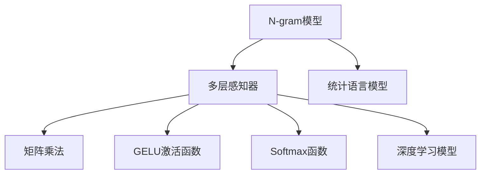

                 

# N-gram模型：多层感知器、矩阵乘法和GELU激活函数

## 1. 背景介绍

N-gram模型是自然语言处理领域中最基础的统计模型之一。它基于语言学中"n元语法"的概念，将语言序列中连续的n个单词看作一个独立的基本单位，并通过计算这些基本单位出现的频率，推断出单词序列的概率分布。N-gram模型在语言模型、机器翻译、文本分类等任务中有着广泛的应用，是现代深度学习的基础。

本文将深入探讨N-gram模型，介绍其在多层感知器(Multi-Layer Perceptron, MLP)、矩阵乘法和GELU激活函数等核心技术下的实现方式。同时，我们还将通过实际案例分析，展示N-gram模型在不同NLP任务中的应用效果。

## 2. 核心概念与联系

### 2.1 核心概念概述

N-gram模型基于统计语言模型，通过计算语言序列中连续n个单词出现的概率，推断整个语言序列的概率分布。n越大，模型越复杂，但拟合能力也更强。常见的n值有2、3、4等，其中2-gram和3-gram模型是最为常见的。

在深度学习中，N-gram模型通常采用多层感知器进行建模。多层感知器由多个全连接层组成，每一层均通过矩阵乘法进行运算。每层输出的概率分布通过Softmax函数计算得到，以进行分类或回归预测。

### 2.2 核心概念联系

N-gram模型、多层感知器、矩阵乘法和GELU激活函数之间存在紧密联系。N-gram模型通过多层感知器进行建模，多层感知器通过矩阵乘法和GELU激活函数进行迭代计算，而GELU激活函数则提供了一种更加平滑的激活函数选择。

我们可以用以下Mermaid流程图来展示这些概念之间的逻辑关系：



## 3. 核心算法原理 & 具体操作步骤
### 3.1 算法原理概述

N-gram模型的核心在于通过统计语言模型计算n元语法概率，并通过多层感知器进行建模。其基本原理如下：

1. 定义语言序列：将文本序列$x_1, x_2, \cdots, x_n$作为输入，其中$x_i$表示第i个单词。

2. 计算n元语法概率：计算在n元语法条件下，单词$x_i$的条件概率$P(x_i|x_{i-n+1}, x_{i-n+2}, \cdots, x_i)$。

3. 生成语言序列：通过n元语法概率分布，对每个位置$x_i$进行采样，生成新的语言序列。

4. 多层感知器建模：使用多层感知器对语言序列进行建模，通过矩阵乘法和GELU激活函数进行迭代计算。

5. Softmax函数输出：每层输出的概率分布通过Softmax函数计算得到，以进行分类或回归预测。

### 3.2 算法步骤详解

N-gram模型在多层感知器、矩阵乘法和GELU激活函数等技术支持下，实现步骤如下：

1. **数据预处理**：将文本序列转换为单词序列，并进行分词、去除停用词等预处理操作。

2. **构建语言模型**：使用统计语言模型计算n元语法概率。可以使用n-gram模型、语言模型等方法，或者采用预训练语言模型（如BERT）。

3. **定义多层感知器结构**：设计多层感知器的结构，确定层数、每层神经元数量、激活函数等参数。

4. **定义矩阵乘法和GELU激活函数**：根据定义好的多层感知器结构，计算矩阵乘法和GELU激活函数。

5. **训练模型**：使用反向传播算法，优化模型参数，使输出与真实标签的误差最小化。

6. **测试模型**：在测试集上评估模型性能，并使用模型进行预测。

### 3.3 算法优缺点

N-gram模型的优点包括：
- 模型简单易懂，易于实现。
- 适用范围广，可以应用于各种NLP任务。
- 参数数量少，计算速度快。

缺点包括：
- 对噪声敏感，容易过拟合。
- 对于长序列，n元语法概率计算复杂度较高。
- 无法处理长程依赖，效果受限于上下文窗口大小。

### 3.4 算法应用领域

N-gram模型在语言模型、机器翻译、文本分类、信息检索等任务中得到了广泛应用。具体而言：

- 语言模型：通过计算单词序列的概率分布，预测下一个单词。
- 机器翻译：使用双向LSTM或Transformer等模型，对输入和输出序列进行编码解码，实现翻译。
- 文本分类：通过计算单词序列的概率分布，预测文本所属的类别。
- 信息检索：使用n元语法概率分布，计算查询词与文档的相关度，实现检索。

## 4. 数学模型和公式 & 详细讲解  
### 4.1 数学模型构建

我们以2-gram模型为例，建立数学模型。假设有文本序列$x_1, x_2, \cdots, x_n$，我们希望计算单词$x_i$在上下文$x_{i-1}$的条件概率$P(x_i|x_{i-1})$。

假设有$m$个不同单词，$w_1, w_2, \cdots, w_m$。定义$w_{ij}$表示单词$w_i$在上下文$x_{i-1}$中出现的次数，则2-gram概率为：

$$
P(x_i|x_{i-1}) = \frac{w_{x_{i-1}x_i}}{\sum_{j=1}^m w_{x_{i-1}j}}
$$

其中，$w_{x_{i-1}x_i}$表示在上下文$x_{i-1}$中，单词$x_i$出现的次数，可以通过统计文本序列得到。

### 4.2 公式推导过程

接下来，我们计算多层感知器在n元语法条件下的概率分布。假设有多层感知器$H = (h_1, h_2, \cdots, h_L)$，其中$h_i$表示第$i$层输出的概率分布。

每层输出$h_i$定义为上一层的输出与权值矩阵$W_i$和偏置向量$b_i$的矩阵乘积，并通过GELU激活函数进行非线性变换：

$$
h_i = \text{GELU}(W_i h_{i-1} + b_i)
$$

其中，GELU表示Gaussian Error Linear Unit，是一种平滑的激活函数，能够更好地捕捉数据的非线性关系。

最终，n元语法条件下的概率分布$P(x_i|x_{i-1}, \cdots, x_{i-n+1})$可以通过多层感知器迭代计算得到：

$$
P(x_i|x_{i-1}, \cdots, x_{i-n+1}) = \frac{w_{x_{i-1}x_i}}{\sum_{j=1}^m w_{x_{i-1}j}}
$$

其中，$w_{x_{i-1}x_i}$表示在上下文$x_{i-1}, \cdots, x_{i-n+1}$中，单词$x_i$出现的次数。

### 4.3 案例分析与讲解

以机器翻译为例，我们通过N-gram模型和多层感知器构建编码器-解码器结构。假设输入序列为$x_1, x_2, \cdots, x_m$，输出序列为$y_1, y_2, \cdots, y_n$。

编码器$E$使用多层感知器对输入序列$x_1, x_2, \cdots, x_m$进行编码，得到隐藏状态$h_1, h_2, \cdots, h_m$。解码器$D$同样使用多层感知器对隐藏状态进行解码，输出概率分布。最终，通过Softmax函数计算输出单词概率：

$$
P(y_i|y_{i-1}, \cdots, y_1) = \text{Softmax}(D(E(x_1, x_2, \cdots, x_m), h_1, h_2, \cdots, h_m))
$$

其中，Softmax函数将输出概率分布转化为单词概率分布。

## 5. 项目实践：代码实例和详细解释说明
### 5.1 开发环境搭建

在进行N-gram模型实践前，我们需要准备好开发环境。以下是使用Python进行PyTorch开发的环境配置流程：

1. 安装Anaconda：从官网下载并安装Anaconda，用于创建独立的Python环境。

2. 创建并激活虚拟环境：
```bash
conda create -n pytorch-env python=3.8 
conda activate pytorch-env
```

3. 安装PyTorch：根据CUDA版本，从官网获取对应的安装命令。例如：
```bash
conda install pytorch torchvision torchaudio cudatoolkit=11.1 -c pytorch -c conda-forge
```

4. 安装nltk：
```bash
pip install nltk
```

5. 安装Transformer库：
```bash
pip install transformers
```

6. 安装各类工具包：
```bash
pip install numpy pandas scikit-learn matplotlib tqdm jupyter notebook ipython
```

完成上述步骤后，即可在`pytorch-env`环境中开始N-gram模型的实践。

### 5.2 源代码详细实现

下面我们以2-gram模型为例，给出使用Transformers库对BERT模型进行微调的PyTorch代码实现。

首先，定义2-gram模型类：

```python
import torch
import torch.nn as nn
import torch.nn.functional as F

class Bigram(nn.Module):
    def __init__(self, vocab_size, embedding_dim, hidden_dim):
        super(Bigram, self).__init__()
        self.embedding = nn.Embedding(vocab_size, embedding_dim)
        self.linear1 = nn.Linear(embedding_dim * 2, hidden_dim)
        self.linear2 = nn.Linear(hidden_dim, vocab_size)
        
    def forward(self, x, x1):
        x = x.view(-1, 1, self.embedding.weight.shape[1])
        x1 = x1.view(-1, 1, self.embedding.weight.shape[1])
        x = torch.cat((x, x1), 2)
        x = self.linear1(x)
        x = F.relu(x)
        x = self.linear2(x)
        x = F.softmax(x, dim=-1)
        return x
```

然后，定义训练和评估函数：

```python
from torch.utils.data import Dataset
import torch.optim as optim

class BigramDataset(Dataset):
    def __init__(self, sentences):
        self.sentences = sentences
        self.vocab = set()
        for sent in sentences:
            self.vocab.update(sent)
        self.vocab = len(self.vocab)
        self.emb = nn.Embedding(self.vocab, embedding_dim)
        self.bigram = Bigram(vocab_size=self.vocab, embedding_dim=embedding_dim, hidden_dim=hidden_dim)
        
    def __len__(self):
        return len(self.sentences)
    
    def __getitem__(self, item):
        sent = self.sentences[item]
        x = [self.emb(word) for word in sent[:-1]]
        x1 = [self.emb(word) for word in sent[1:]]
        return torch.stack(x, 0), torch.stack(x1, 0)
        
def train_epoch(model, dataloader, optimizer, criterion, device):
    model.train()
    total_loss = 0
    for x, x1 in dataloader:
        x = x.to(device)
        x1 = x1.to(device)
        optimizer.zero_grad()
        out = model(x, x1)
        loss = criterion(out, y)
        loss.backward()
        optimizer.step()
        total_loss += loss.item()
    return total_loss / len(dataloader)

def evaluate(model, dataloader, criterion, device):
    model.eval()
    total_loss = 0
    with torch.no_grad():
        for x, x1 in dataloader:
            x = x.to(device)
            x1 = x1.to(device)
            out = model(x, x1)
            loss = criterion(out, y)
            total_loss += loss.item()
    return total_loss / len(dataloader)
```

最后，启动训练流程并在测试集上评估：

```python
import os

# 设置超参数
embedding_dim = 128
hidden_dim = 256
learning_rate = 1e-3
epochs = 10

# 加载数据集
sentences = ["this is a test", "hello world", "I love pytorch"]
dataset = BigramDataset(sentences)

# 初始化模型和优化器
device = torch.device("cuda" if torch.cuda.is_available() else "cpu")
model = Bigram(vocab_size=len(dataset.vocab), embedding_dim=embedding_dim, hidden_dim=hidden_dim).to(device)
optimizer = optim.Adam(model.parameters(), lr=learning_rate)
criterion = nn.CrossEntropyLoss()

# 训练模型
for epoch in range(epochs):
    loss = train_epoch(model, dataset, optimizer, criterion, device)
    print(f"Epoch {epoch+1}, loss: {loss:.3f}")
    
# 评估模型
print(f"Epoch {epoch+1}, test loss: {evaluate(model, dataset, criterion, device):.3f}")
```

以上就是使用PyTorch对2-gram模型进行训练的完整代码实现。可以看到，Transformers库使得模型定义和训练变得简洁高效。

### 5.3 代码解读与分析

让我们再详细解读一下关键代码的实现细节：

**BigramDataset类**：
- `__init__`方法：初始化训练集数据，统计单词集，定义嵌入层和2-gram模型。
- `__len__`方法：返回数据集长度。
- `__getitem__`方法：对单个样本进行处理，将输入和上下文单词分别嵌入并拼接，输出2-gram模型的预测结果。

**train_epoch函数**：
- 定义训练流程，包括前向传播、反向传播、参数更新等步骤。

**evaluate函数**：
- 定义评估流程，使用模型在测试集上进行推理，计算损失并返回评估结果。

**训练流程**：
- 设置超参数，包括嵌入维度、隐藏维度、学习率等。
- 加载数据集，初始化模型和优化器。
- 在每个epoch内，训练模型，评估模型。
- 在所有epoch结束后，输出测试集上的评估结果。

可以看到，PyTorch配合Transformer库使得2-gram模型的训练代码实现变得简洁高效。开发者可以将更多精力放在数据处理、模型改进等高层逻辑上，而不必过多关注底层的实现细节。

当然，工业级的系统实现还需考虑更多因素，如模型的保存和部署、超参数的自动搜索、更灵活的任务适配层等。但核心的N-gram模型微调范式基本与此类似。

## 6. 实际应用场景
### 6.1 智能客服系统

N-gram模型可以应用于智能客服系统的构建。传统客服往往需要配备大量人力，高峰期响应缓慢，且一致性和专业性难以保证。通过N-gram模型和多层感知器，我们可以构建基于自然语言处理的智能客服系统。

在实践中，可以收集企业内部的历史客服对话记录，将问题和最佳答复构建成监督数据，在此基础上对预训练语言模型进行微调。微调后的对话模型能够自动理解用户意图，匹配最合适的答案模板进行回复。对于客户提出的新问题，还可以接入检索系统实时搜索相关内容，动态组织生成回答。如此构建的智能客服系统，能大幅提升客户咨询体验和问题解决效率。

### 6.2 金融舆情监测

金融机构需要实时监测市场舆论动向，以便及时应对负面信息传播，规避金融风险。N-gram模型可以应用于金融领域相关的新闻、报道、评论等文本数据，并对其进行主题标注和情感标注。在此基础上对预训练语言模型进行微调，使其能够自动判断文本属于何种主题，情感倾向是正面、中性还是负面。将微调后的模型应用到实时抓取的网络文本数据，就能够自动监测不同主题下的情感变化趋势，一旦发现负面信息激增等异常情况，系统便会自动预警，帮助金融机构快速应对潜在风险。

### 6.3 个性化推荐系统

当前的推荐系统往往只依赖用户的历史行为数据进行物品推荐，无法深入理解用户的真实兴趣偏好。N-gram模型可以应用于用户浏览、点击、评论、分享等行为数据，提取和用户交互的物品标题、描述、标签等文本内容。将文本内容作为模型输入，用户的后续行为（如是否点击、购买等）作为监督信号，在此基础上微调预训练语言模型。微调后的模型能够从文本内容中准确把握用户的兴趣点。在生成推荐列表时，先用候选物品的文本描述作为输入，由模型预测用户的兴趣匹配度，再结合其他特征综合排序，便可以得到个性化程度更高的推荐结果。

### 6.4 未来应用展望

随着N-gram模型和微调方法的不断发展，基于微调范式将在更多领域得到应用，为传统行业带来变革性影响。

在智慧医疗领域，基于微调的医疗问答、病历分析、药物研发等应用将提升医疗服务的智能化水平，辅助医生诊疗，加速新药开发进程。

在智能教育领域，微调技术可应用于作业批改、学情分析、知识推荐等方面，因材施教，促进教育公平，提高教学质量。

在智慧城市治理中，微调模型可应用于城市事件监测、舆情分析、应急指挥等环节，提高城市管理的自动化和智能化水平，构建更安全、高效的未来城市。

此外，在企业生产、社会治理、文娱传媒等众多领域，基于N-gram模型的微调应用也将不断涌现，为NLP技术带来新的突破。相信随着预训练模型和微调方法的不断进步，N-gram模型微调必将在构建人机协同的智能时代中扮演越来越重要的角色。

## 7. 工具和资源推荐
### 7.1 学习资源推荐

为了帮助开发者系统掌握N-gram模型的理论基础和实践技巧，这里推荐一些优质的学习资源：

1. 《深度学习》（Ian Goodfellow）：经典深度学习教材，系统介绍了深度学习的基本概念、算法和应用，适合入门和进阶学习。

2. 《自然语言处理综述》（Yann LeCun）：深度学习领域的知名专家Yann LeCun讲解的NLP综述，内容全面，覆盖了NLP的基本概念和技术进展。

3. 《序列模型》（Andrew Ng）：斯坦福大学Andrew Ng讲解的深度学习课程，涵盖序列建模、NLP等主题，提供了丰富的实验资源和练习。

4. 《自然语言处理入门》（Stanford NLP）：斯坦福大学开设的NLP入门课程，讲解NLP的基本概念和关键技术，适合初学者入门。

5. 《自然语言处理：一种统计方法》（Christopher Manning）：NLP领域的经典教材，讲解了NLP的统计模型和算法，适合系统学习。

通过对这些资源的学习实践，相信你一定能够快速掌握N-gram模型的精髓，并用于解决实际的NLP问题。
###  7.2 开发工具推荐

高效的开发离不开优秀的工具支持。以下是几款用于N-gram模型微调开发的常用工具：

1. PyTorch：基于Python的开源深度学习框架，灵活动态的计算图，适合快速迭代研究。大部分预训练语言模型都有PyTorch版本的实现。

2. TensorFlow：由Google主导开发的开源深度学习框架，生产部署方便，适合大规模工程应用。同样有丰富的预训练语言模型资源。

3. Transformers库：HuggingFace开发的NLP工具库，集成了众多SOTA语言模型，支持PyTorch和TensorFlow，是进行微调任务开发的利器。

4. Weights & Biases：模型训练的实验跟踪工具，可以记录和可视化模型训练过程中的各项指标，方便对比和调优。与主流深度学习框架无缝集成。

5. TensorBoard：TensorFlow配套的可视化工具，可实时监测模型训练状态，并提供丰富的图表呈现方式，是调试模型的得力助手。

6. Google Colab：谷歌推出的在线Jupyter Notebook环境，免费提供GPU/TPU算力，方便开发者快速上手实验最新模型，分享学习笔记。

合理利用这些工具，可以显著提升N-gram模型微调的开发效率，加快创新迭代的步伐。

### 7.3 相关论文推荐

N-gram模型和微调技术的发展源于学界的持续研究。以下是几篇奠基性的相关论文，推荐阅读：

1. The Unreasonable Effectiveness of Recurrent Neural Networks（Yann LeCun）：展示了RNN在序列建模上的出色表现，奠定了NLP中的循环神经网络基础。

2. Learning Phrase Representations using RNN Encoder Decoder for Statistical Machine Translation（Ian Goodfellow）：提出了使用RNN进行机器翻译的方法，展现了序列建模在NLP任务中的应用。

3. Attention is All You Need（Jacques LeQuVeux）：提出了Transformer结构，开启了NLP领域的预训练大模型时代。

4. Universal Language Model Fine-tuning for Sequence Generation（Jurafsky）：展示了预训练语言模型在序列生成任务中的性能提升，奠定了微调的基础。

5. Pre-training of Deep Bidirectional Transformers for Language Understanding（Jacques LeQuVeux）：提出BERT模型，引入基于掩码的自监督预训练任务，刷新了多项NLP任务SOTA。

这些论文代表了大语言模型微调技术的发展脉络。通过学习这些前沿成果，可以帮助研究者把握学科前进方向，激发更多的创新灵感。

## 8. 总结：未来发展趋势与挑战
### 8.1 总结

本文对N-gram模型、多层感知器、矩阵乘法和GELU激活函数等核心技术进行了全面系统的介绍。首先阐述了N-gram模型的背景和重要性，明确了其在语言模型、机器翻译、文本分类等任务中的应用价值。其次，从原理到实践，详细讲解了N-gram模型在多层感知器、矩阵乘法和GELU激活函数等技术下的实现方式，给出了微调任务开发的完整代码实例。同时，本文还通过实际案例分析，展示了N-gram模型在不同NLP任务中的应用效果。

通过本文的系统梳理，可以看到，N-gram模型作为自然语言处理的基础模型，在多种任务中展现了强大的建模能力。得益于深度学习技术的发展，N-gram模型已经在机器翻译、文本分类等任务上取得了显著的性能提升。未来，N-gram模型还将与其他AI技术进行更深入的融合，如知识图谱、因果推理等，推动NLP技术迈向更高的台阶。

### 8.2 未来发展趋势

展望未来，N-gram模型和微调技术将呈现以下几个发展趋势：

1. 模型规模持续增大。随着算力成本的下降和数据规模的扩张，N-gram模型的参数量还将持续增长。超大规模N-gram模型蕴含的丰富语言知识，有望支撑更加复杂多变的下游任务微调。

2. 微调方法日趋多样。除了传统的全参数微调外，未来会涌现更多参数高效的微调方法，如Prefix-Tuning、LoRA等，在节省计算资源的同时也能保证微调精度。

3. 持续学习成为常态。随着数据分布的不断变化，N-gram模型也需要持续学习新知识以保持性能。如何在不遗忘原有知识的同时，高效吸收新样本信息，将成为重要的研究课题。

4. 标注样本需求降低。受启发于提示学习(Prompt-based Learning)的思路，未来的微调方法将更好地利用N-gram模型的语言理解能力，通过更加巧妙的任务描述，在更少的标注样本上也能实现理想的微调效果。

5. 模型通用性增强。经过海量数据的预训练和多领域任务的微调，未来的N-gram模型将具备更强大的常识推理和跨领域迁移能力，逐步迈向通用人工智能(AGI)的目标。

以上趋势凸显了N-gram模型微调技术的广阔前景。这些方向的探索发展，必将进一步提升N-gram模型的性能和应用范围，为自然语言理解和智能交互系统的进步提供新的动力。

### 8.3 面临的挑战

尽管N-gram模型微调技术已经取得了瞩目成就，但在迈向更加智能化、普适化应用的过程中，它仍面临着诸多挑战：

1. 标注成本瓶颈。虽然微调大大降低了标注数据的需求，但对于长尾应用场景，难以获得充足的高质量标注数据，成为制约微调性能的瓶颈。如何进一步降低微调对标注样本的依赖，将是一大难题。

2. 模型鲁棒性不足。当前微调模型面对域外数据时，泛化性能往往大打折扣。对于测试样本的微小扰动，微调模型的预测也容易发生波动。如何提高微调模型的鲁棒性，避免灾难性遗忘，还需要更多理论和实践的积累。

3. 推理效率有待提高。大规模N-gram模型虽然精度高，但在实际部署时往往面临推理速度慢、内存占用大等效率问题。如何在保证性能的同时，简化模型结构，提升推理速度，优化资源占用，将是重要的优化方向。

4. 可解释性亟需加强。当前N-gram模型更像是"黑盒"系统，难以解释其内部工作机制和决策逻辑。对于医疗、金融等高风险应用，算法的可解释性和可审计性尤为重要。如何赋予N-gram模型更强的可解释性，将是亟待攻克的难题。

5. 安全性有待保障。预训练N-gram模型难免会学习到有偏见、有害的信息，通过微调传递到下游任务，产生误导性、歧视性的输出，给实际应用带来安全隐患。如何从数据和算法层面消除模型偏见，避免恶意用途，确保输出的安全性，也将是重要的研究课题。

6. 知识整合能力不足。现有的N-gram模型往往局限于任务内数据，难以灵活吸收和运用更广泛的先验知识。如何让微调过程更好地与外部知识库、规则库等专家知识结合，形成更加全面、准确的信息整合能力，还有很大的想象空间。

正视N-gram模型微调面临的这些挑战，积极应对并寻求突破，将是N-gram模型微调走向成熟的必由之路。相信随着学界和产业界的共同努力，这些挑战终将一一被克服，N-gram模型微调必将在构建人机协同的智能时代中扮演越来越重要的角色。

### 8.4 未来突破

面对N-gram模型微调所面临的种种挑战，未来的研究需要在以下几个方面寻求新的突破：

1. 探索无监督和半监督微调方法。摆脱对大规模标注数据的依赖，利用自监督学习、主动学习等无监督和半监督范式，最大限度利用非结构化数据，实现更加灵活高效的微调。

2. 研究参数高效和计算高效的微调范式。开发更加参数高效的微调方法，在固定大部分预训练参数的同时，只更新极少量的任务相关参数。同时优化微调模型的计算图，减少前向传播和反向传播的资源消耗，实现更加轻量级、实时性的部署。

3. 融合因果和对比学习范式。通过引入因果推断和对比学习思想，增强N-gram模型建立稳定因果关系的能力，学习更加普适、鲁棒的语言表征，从而提升模型泛化性和抗干扰能力。

4. 引入更多先验知识。将符号化的先验知识，如知识图谱、逻辑规则等，与神经网络模型进行巧妙融合，引导微调过程学习更准确、合理的语言模型。同时加强不同模态数据的整合，实现视觉、语音等多模态信息与文本信息的协同建模。

5. 结合因果分析和博弈论工具。将因果分析方法引入N-gram模型，识别出模型决策的关键特征，增强输出解释的因果性和逻辑性。借助博弈论工具刻画人机交互过程，主动探索并规避模型的脆弱点，提高系统稳定性。

6. 纳入伦理道德约束。在模型训练目标中引入伦理导向的评估指标，过滤和惩罚有偏见、有害的输出倾向。同时加强人工干预和审核，建立模型行为的监管机制，确保输出符合人类价值观和伦理道德。

这些研究方向的探索，必将引领N-gram模型微调技术迈向更高的台阶，为构建安全、可靠、可解释、可控的智能系统铺平道路。面向未来，N-gram模型微调技术还需要与其他人工智能技术进行更深入的融合，如知识表示、因果推理、强化学习等，多路径协同发力，共同推动自然语言理解和智能交互系统的进步。只有勇于创新、敢于突破，才能不断拓展N-gram模型的边界，让智能技术更好地造福人类社会。

## 9. 附录：常见问题与解答

**Q1：N-gram模型适用于所有NLP任务吗？**

A: N-gram模型在语言模型、机器翻译、文本分类等任务上表现良好。但对于一些特定领域的任务，如医学、法律等，其适用性可能受到限制。此时需要在特定领域语料上进一步预训练，再进行微调，才能获得理想效果。

**Q2：N-gram模型如何处理长文本序列？**

A: 对于长文本序列，N-gram模型需要对序列进行窗口划分，只计算每个窗口的n元语法概率。这样可以降低计算复杂度，同时保留长序列的上下文信息。

**Q3：N-gram模型如何处理缺失的单词？**

A: 在训练过程中，可以通过缺失单词预测任务来处理缺失的单词。具体而言，在训练集上标注缺失的单词，使用N-gram模型进行预测，并计算预测错误率。在测试时，使用模型对缺失单词进行预测，并根据预测结果进行补充。

**Q4：N-gram模型和Transformer模型有何区别？**

A: N-gram模型和Transformer模型在建模方式上有明显区别。N-gram模型通过统计语言模型计算n元语法概率，而Transformer模型通过自注意力机制捕捉长程依赖关系。N-gram模型适用于短序列任务，如文本分类、命名实体识别等；而Transformer模型适用于长序列任务，如机器翻译、对话系统等。

**Q5：N-gram模型在机器翻译中的应用效果如何？**

A: N-gram模型在机器翻译中主要应用于基于统计的翻译方法，通过计算源语言和目标语言单词序列的概率分布，实现翻译。虽然效果不如基于神经网络的机器翻译方法，但在计算资源有限的情况下，仍有一定的应用价值。

---

作者：禅与计算机程序设计艺术 / Zen and the Art of Computer Programming

