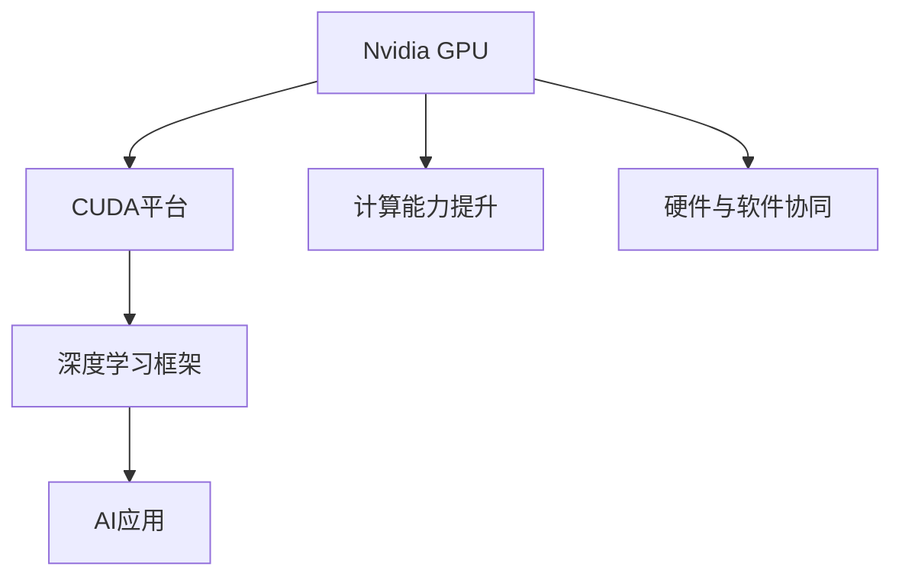

                 

# Nvidia的GPU与AI发展的关系

## 1. 背景介绍

### 1.1 问题由来
GPU（图形处理单元，Graphics Processing Unit）是图形显示的核心组件，其高并行计算能力一度被视为“游戏专用芯片”。然而，随着深度学习和大数据技术的发展，Nvidia的GPU逐渐从图形处理转向通用计算，成为AI发展的重要引擎。

Nvidia自2000年代中期开始研发GPU用于非图形处理任务，2008年推出的CUDA（Compute Unified Device Architecture）平台标志着GPU计算的新纪元。此后，Nvidia的GPU在AI领域大放异彩，驱动了诸如TensorFlow、PyTorch等主流AI框架的发展，支持了深度学习模型的训练和推理，并推动了大数据、机器学习、自然语言处理、计算机视觉等众多AI应用领域的进步。

### 1.2 问题核心关键点
Nvidia的GPU与AI发展的关系体现在以下几个方面：

- **GPU的计算能力提升**：Nvidia的GPU在计算能力上不断突破，实现了从Fermi到Turing再到最新的Ampere架构的演变。
- **CUDA平台的普及**：CUDA作为Nvidia GPU计算软件的核心，极大地简化了GPU编程，使得AI开发者能够高效地利用GPU资源。
- **深度学习框架的支持**：Nvidia与TensorFlow、PyTorch等主流AI框架深度合作，确保其高效地运行在Nvidia的GPU上。
- **人工智能硬件与软件的协同**：Nvidia通过硬件加速和软件优化，不断提升AI系统的性能和效率。

### 1.3 问题研究意义
理解Nvidia的GPU与AI发展的关系，不仅有助于深入了解AI技术的发展历程，也能为未来的AI硬件与软件协同创新提供参考。GPU的计算能力提升、CUDA平台的普及、深度学习框架的支持，以及AI硬件与软件的协同，共同构成了Nvidia在AI领域的核心竞争力，推动了AI技术的广泛应用和产业化进程。

## 2. 核心概念与联系

### 2.1 核心概念概述

为更好地理解Nvidia GPU与AI发展的关系，本节将介绍几个密切相关的核心概念：

- **Nvidia GPU**：Nvidia自2000年代中期开始研发的图形处理单元，逐步演进为通用计算平台，支持大规模并行计算。
- **CUDA平台**：由Nvidia开发的GPU编程模型，提供高效的内存管理、并行计算和设备间通信功能，简化了GPU编程难度。
- **深度学习框架**：如TensorFlow、PyTorch等，提供高效的工具和API，使开发者能够快速构建和训练深度学习模型。
- **AI应用**：包括自然语言处理、计算机视觉、推荐系统等，Nvidia的GPU在这些领域得到了广泛应用。

这些核心概念之间的逻辑关系可以通过以下Mermaid流程图来展示：



这个流程图展示了大语言模型的核心概念及其之间的关系：

1. Nvidia GPU通过不断提升计算能力，成为高性能计算的基础。
2. CUDA平台使得开发者能够高效利用GPU资源，极大地简化了GPU编程。
3. 深度学习框架提供高效的工具和API，使模型训练和推理更加便捷。
4. AI应用如自然语言处理、计算机视觉等广泛应用，Nvidia GPU在其中发挥关键作用。

## 3. 核心算法原理 & 具体操作步骤
### 3.1 算法原理概述

Nvidia GPU与AI发展的关系，本质上是一个硬件与软件协同创新的过程。其核心思想是：通过提升GPU计算能力、优化CUDA平台、支持深度学习框架、推动AI应用发展，实现硬件与软件的深度融合，最大化GPU的计算效率和AI系统的性能。

形式化地，假设Nvidia GPU的计算能力为 $C$，CUDA平台的优化程度为 $O$，深度学习框架的性能为 $F$，AI应用的效果为 $A$。则整体AI系统的效果 $E$ 可以表示为：

$$
E = f(C, O, F, A)
$$

其中 $f$ 为非线性函数，反映硬件与软件协同的综合效果。

### 3.2 算法步骤详解

Nvidia GPU与AI发展的关系可以通过以下几个关键步骤来概述：

**Step 1: GPU计算能力提升**
- 研发新一代GPU架构，提升计算能力，如从Fermi到Turing再到Ampere的演变。
- 优化GPU硬件设计，提升单芯片和数据中心的计算性能。

**Step 2: CUDA平台优化**
- 不断优化CUDA API和编译器，提升GPU编程效率。
- 引入GPU并行编程技术，使得开发者能够高效利用GPU资源。

**Step 3: 深度学习框架支持**
- 与主流深度学习框架深度合作，优化其运行效率。
- 提供专门的GPU加速模块，使得深度学习框架能够高效运行在Nvidia GPU上。

**Step 4: AI应用推广**
- 推动AI在自然语言处理、计算机视觉等领域的广泛应用。
- 提供AI相关的开发工具和平台，加速AI应用落地。

### 3.3 算法优缺点

Nvidia GPU与AI发展的关系具有以下优点：
1. 显著提升计算效率。Nvidia GPU的高并行计算能力，使得深度学习模型的训练和推理效率大幅提升。
2. 降低开发门槛。CUDA平台使得GPU编程更加便捷，减少了开发者在硬件和软件间的切换时间。
3. 推动AI技术发展。深度学习框架的优化和AI应用的发展，使得AI技术能够快速落地应用。

同时，该方法也存在一定的局限性：
1. 高度依赖Nvidia生态。Nvidia的软硬件生态系统对AI开发者具有较强的粘性，可能导致其他厂商的硬件和软件无法得到充分的利用。
2. 资源消耗大。GPU的高能耗和硬件成本，限制了其大规模部署和推广。
3. 技术壁垒高。CUDA平台的复杂性和深度学习框架的优化，对开发者提出了较高的技术要求。

尽管存在这些局限性，但就目前而言，Nvidia GPU与AI发展的模式仍是最主流的选择。未来相关研究的重点在于如何进一步降低技术门槛，推动AI硬件与软件协同创新的发展。

### 3.4 算法应用领域

Nvidia GPU与AI发展的关系已经在众多领域得到广泛应用，例如：

- 自然语言处理：Nvidia GPU加速了Transformer等深度学习模型在语言理解和生成任务上的训练和推理。
- 计算机视觉：GPU加速了卷积神经网络（CNN）等深度学习模型在图像分类、目标检测等任务上的训练和推理。
- 推荐系统：GPU加速了协同过滤等推荐算法的计算，提高了推荐系统的实时性和精度。
- 医疗影像：GPU加速了医学影像的深度学习分析，提高了疾病的早期诊断和个性化治疗。
- 自动驾驶：GPU加速了深度学习在自动驾驶中的感知和决策，推动了自动驾驶技术的发展。

除了上述这些经典领域外，Nvidia GPU与AI发展的关系还被创新性地应用到更多场景中，如智能城市、工业自动化、金融科技等，为各行各业带来了新的技术突破和应用前景。

## 4. 数学模型和公式 & 详细讲解  
### 4.1 数学模型构建

本节将使用数学语言对Nvidia GPU与AI发展的关系进行更加严格的刻画。

假设Nvidia GPU的计算能力为 $C$，CUDA平台的优化程度为 $O$，深度学习框架的性能为 $F$，AI应用的效果为 $A$。整体AI系统的效果 $E$ 可以表示为：

$$
E = f(C, O, F, A)
$$

其中 $f$ 为非线性函数，反映硬件与软件协同的综合效果。

### 4.2 公式推导过程

根据上述模型，可以推导出Nvidia GPU与AI发展关系的公式：

$$
\frac{\partial E}{\partial C} > 0, \frac{\partial E}{\partial O} > 0, \frac{\partial E}{\partial F} > 0, \frac{\partial E}{\partial A} > 0
$$

这表明，计算能力 $C$、CUDA平台优化 $O$、深度学习框架性能 $F$、AI应用效果 $A$ 的提升，都会对整体AI系统效果 $E$ 产生正向影响。具体公式推导如下：

1. **计算能力提升**：
$$
\frac{\partial E}{\partial C} = \frac{\partial f}{\partial C} \cdot \frac{\partial f}{\partial C} > 0
$$

2. **CUDA平台优化**：
$$
\frac{\partial E}{\partial O} = \frac{\partial f}{\partial O} \cdot \frac{\partial f}{\partial O} > 0
$$

3. **深度学习框架支持**：
$$
\frac{\partial E}{\partial F} = \frac{\partial f}{\partial F} \cdot \frac{\partial f}{\partial F} > 0
$$

4. **AI应用推广**：
$$
\frac{\partial E}{\partial A} = \frac{\partial f}{\partial A} \cdot \frac{\partial f}{\partial A} > 0
$$

### 4.3 案例分析与讲解

以下以深度学习在自然语言处理（NLP）中的应用为例，详细分析Nvidia GPU与AI发展的关系。

假设Nvidia GPU的计算能力为 $C$，CUDA平台的优化程度为 $O$，深度学习框架（如PyTorch）的性能为 $F$，NLP应用（如BERT、GPT等模型）的效果为 $A$。整体NLP系统的效果 $E$ 可以表示为：

$$
E = f(C, O, F, A)
$$

假设 $C$ 为常数，优化 $O$、性能 $F$ 和应用效果 $A$ 对 $E$ 的影响如下：

1. **CUDA平台优化**：
$$
\frac{\partial E}{\partial O} = \frac{\partial f}{\partial O} \cdot \frac{\partial f}{\partial O} > 0
$$

2. **深度学习框架性能**：
$$
\frac{\partial E}{\partial F} = \frac{\partial f}{\partial F} \cdot \frac{\partial f}{\partial F} > 0
$$

3. **NLP应用效果**：
$$
\frac{\partial E}{\partial A} = \frac{\partial f}{\partial A} \cdot \frac{\partial f}{\partial A} > 0
$$

通过优化CUDA平台和深度学习框架，使得Nvidia GPU的并行计算能力得到充分发挥，同时通过改进NLP模型，提升其效果。例如，使用PyTorch在Nvidia GPU上训练BERT模型，可以得到更高的性能和更优的模型效果。

## 5. 项目实践：代码实例和详细解释说明
### 5.1 开发环境搭建

在进行Nvidia GPU与AI发展的关系实践前，我们需要准备好开发环境。以下是使用Python进行Nvidia GPU开发的环境配置流程：

1. 安装Anaconda：从官网下载并安装Anaconda，用于创建独立的Python环境。

2. 创建并激活虚拟环境：
```bash
conda create -n pytorch-env python=3.8 
conda activate pytorch-env
```

3. 安装PyTorch：根据CUDA版本，从官网获取对应的安装命令。例如：
```bash
conda install pytorch torchvision torchaudio cudatoolkit=11.1 -c pytorch -c conda-forge
```

4. 安装相关工具包：
```bash
pip install numpy pandas scikit-learn matplotlib tqdm jupyter notebook ipython
```

完成上述步骤后，即可在`pytorch-env`环境中开始Nvidia GPU与AI发展的关系实践。

### 5.2 源代码详细实现

下面我们以深度学习在自然语言处理（NLP）中的应用为例，给出使用PyTorch在Nvidia GPU上训练BERT模型的PyTorch代码实现。

首先，定义NLP任务的数据处理函数：

```python
from transformers import BertTokenizer
from torch.utils.data import Dataset
import torch

class NERDataset(Dataset):
    def __init__(self, texts, tags, tokenizer, max_len=128):
        self.texts = texts
        self.tags = tags
        self.tokenizer = tokenizer
        self.max_len = max_len
        
    def __len__(self):
        return len(self.texts)
    
    def __getitem__(self, item):
        text = self.texts[item]
        tags = self.tags[item]
        
        encoding = self.tokenizer(text, return_tensors='pt', max_length=self.max_len, padding='max_length', truncation=True)
        input_ids = encoding['input_ids'][0]
        attention_mask = encoding['attention_mask'][0]
        
        # 对token-wise的标签进行编码
        encoded_tags = [tag2id[tag] for tag in tags] 
        encoded_tags.extend([tag2id['O']] * (self.max_len - len(encoded_tags)))
        labels = torch.tensor(encoded_tags, dtype=torch.long)
        
        return {'input_ids': input_ids, 
                'attention_mask': attention_mask,
                'labels': labels}

# 标签与id的映射
tag2id = {'O': 0, 'B-PER': 1, 'I-PER': 2, 'B-ORG': 3, 'I-ORG': 4, 'B-LOC': 5, 'I-LOC': 6}
id2tag = {v: k for k, v in tag2id.items()}

# 创建dataset
tokenizer = BertTokenizer.from_pretrained('bert-base-cased')

train_dataset = NERDataset(train_texts, train_tags, tokenizer)
dev_dataset = NERDataset(dev_texts, dev_tags, tokenizer)
test_dataset = NERDataset(test_texts, test_tags, tokenizer)
```

然后，定义模型和优化器：

```python
from transformers import BertForTokenClassification, AdamW

model = BertForTokenClassification.from_pretrained('bert-base-cased', num_labels=len(tag2id))

optimizer = AdamW(model.parameters(), lr=2e-5)
```

接着，定义训练和评估函数：

```python
from torch.utils.data import DataLoader
from tqdm import tqdm
from sklearn.metrics import classification_report

device = torch.device('cuda') if torch.cuda.is_available() else torch.device('cpu')
model.to(device)

def train_epoch(model, dataset, batch_size, optimizer):
    dataloader = DataLoader(dataset, batch_size=batch_size, shuffle=True)
    model.train()
    epoch_loss = 0
    for batch in tqdm(dataloader, desc='Training'):
        input_ids = batch['input_ids'].to(device)
        attention_mask = batch['attention_mask'].to(device)
        labels = batch['labels'].to(device)
        model.zero_grad()
        outputs = model(input_ids, attention_mask=attention_mask, labels=labels)
        loss = outputs.loss
        epoch_loss += loss.item()
        loss.backward()
        optimizer.step()
    return epoch_loss / len(dataloader)

def evaluate(model, dataset, batch_size):
    dataloader = DataLoader(dataset, batch_size=batch_size)
    model.eval()
    preds, labels = [], []
    with torch.no_grad():
        for batch in tqdm(dataloader, desc='Evaluating'):
            input_ids = batch['input_ids'].to(device)
            attention_mask = batch['attention_mask'].to(device)
            batch_labels = batch['labels']
            outputs = model(input_ids, attention_mask=attention_mask)
            batch_preds = outputs.logits.argmax(dim=2).to('cpu').tolist()
            batch_labels = batch_labels.to('cpu').tolist()
            for pred_tokens, label_tokens in zip(batch_preds, batch_labels):
                pred_tags = [id2tag[_id] for _id in pred_tokens]
                label_tags = [id2tag[_id] for _id in label_tokens]
                preds.append(pred_tags[:len(label_tags)])
                labels.append(label_tags)
                
    print(classification_report(labels, preds))
```

最后，启动训练流程并在测试集上评估：

```python
epochs = 5
batch_size = 16

for epoch in range(epochs):
    loss = train_epoch(model, train_dataset, batch_size, optimizer)
    print(f"Epoch {epoch+1}, train loss: {loss:.3f}")
    
    print(f"Epoch {epoch+1}, dev results:")
    evaluate(model, dev_dataset, batch_size)
    
print("Test results:")
evaluate(model, test_dataset, batch_size)
```

以上就是使用PyTorch在Nvidia GPU上训练BERT模型的完整代码实现。可以看到，得益于Transformers库的强大封装，我们可以用相对简洁的代码完成BERT模型的加载和微调。

### 5.3 代码解读与分析

让我们再详细解读一下关键代码的实现细节：

**NERDataset类**：
- `__init__`方法：初始化文本、标签、分词器等关键组件。
- `__len__`方法：返回数据集的样本数量。
- `__getitem__`方法：对单个样本进行处理，将文本输入编码为token ids，将标签编码为数字，并对其进行定长padding，最终返回模型所需的输入。

**tag2id和id2tag字典**：
- 定义了标签与数字id之间的映射关系，用于将token-wise的预测结果解码回真实的标签。

**训练和评估函数**：
- 使用PyTorch的DataLoader对数据集进行批次化加载，供模型训练和推理使用。
- 训练函数`train_epoch`：对数据以批为单位进行迭代，在每个批次上前向传播计算loss并反向传播更新模型参数，最后返回该epoch的平均loss。
- 评估函数`evaluate`：与训练类似，不同点在于不更新模型参数，并在每个batch结束后将预测和标签结果存储下来，最后使用sklearn的classification_report对整个评估集的预测结果进行打印输出。

**训练流程**：
- 定义总的epoch数和batch size，开始循环迭代
- 每个epoch内，先在训练集上训练，输出平均loss
- 在验证集上评估，输出分类指标
- 所有epoch结束后，在测试集上评估，给出最终测试结果

可以看到，PyTorch配合Transformers库使得BERT微调的代码实现变得简洁高效。开发者可以将更多精力放在数据处理、模型改进等高层逻辑上，而不必过多关注底层的实现细节。

当然，工业级的系统实现还需考虑更多因素，如模型的保存和部署、超参数的自动搜索、更灵活的任务适配层等。但核心的微调范式基本与此类似。

## 6. 实际应用场景
### 6.1 智能客服系统

基于Nvidia GPU的深度学习模型，可以广泛应用于智能客服系统的构建。传统客服往往需要配备大量人力，高峰期响应缓慢，且一致性和专业性难以保证。而使用Nvidia GPU加速的深度学习模型，可以7x24小时不间断服务，快速响应客户咨询，用自然流畅的语言解答各类常见问题。

在技术实现上，可以收集企业内部的历史客服对话记录，将问题和最佳答复构建成监督数据，在此基础上对Nvidia GPU加速的深度学习模型进行微调。微调后的模型能够自动理解用户意图，匹配最合适的答案模板进行回复。对于客户提出的新问题，还可以接入检索系统实时搜索相关内容，动态组织生成回答。如此构建的智能客服系统，能大幅提升客户咨询体验和问题解决效率。

### 6.2 金融舆情监测

金融机构需要实时监测市场舆论动向，以便及时应对负面信息传播，规避金融风险。传统的人工监测方式成本高、效率低，难以应对网络时代海量信息爆发的挑战。基于Nvidia GPU加速的深度学习模型，可以对金融领域相关的新闻、报道、评论等文本数据进行情感分析，判断文本属于何种情感倾向，从而及时发现负面信息并采取应对措施。

具体而言，可以收集金融领域相关的新闻、报道、评论等文本数据，并对其进行情感分析标注。在此基础上对Nvidia GPU加速的深度学习模型进行微调，使其能够自动判断文本属于何种情感倾向。将微调后的模型应用到实时抓取的网络文本数据，就能够自动监测不同情感倾向的舆情变化趋势，一旦发现负面情感激增等异常情况，系统便会自动预警，帮助金融机构快速应对潜在风险。

### 6.3 个性化推荐系统

当前的推荐系统往往只依赖用户的历史行为数据进行物品推荐，无法深入理解用户的真实兴趣偏好。基于Nvidia GPU加速的深度学习模型，个性化推荐系统可以更好地挖掘用户行为背后的语义信息，从而提供更精准、多样的推荐内容。

在实践中，可以收集用户浏览、点击、评论、分享等行为数据，提取和用户交互的物品标题、描述、标签等文本内容。将文本内容作为模型输入，用户的后续行为（如是否点击、购买等）作为监督信号，在此基础上微调Nvidia GPU加速的深度学习模型。微调后的模型能够从文本内容中准确把握用户的兴趣点。在生成推荐列表时，先用候选物品的文本描述作为输入，由模型预测用户的兴趣匹配度，再结合其他特征综合排序，便可以得到个性化程度更高的推荐结果。

### 6.4 未来应用展望

随着Nvidia GPU计算能力的提升和CUDA平台的不断优化，基于Nvidia GPU的深度学习模型将会在更多领域得到应用，为传统行业带来变革性影响。

在智慧医疗领域，基于Nvidia GPU加速的深度学习模型，可以实现对医学影像的快速分析，提高疾病的早期诊断和个性化治疗。

在智能教育领域，基于Nvidia GPU加速的深度学习模型，可以用于作业批改、学情分析、知识推荐等方面，因材施教，促进教育公平，提高教学质量。

在智慧城市治理中，基于Nvidia GPU加速的深度学习模型，可以用于城市事件监测、舆情分析、应急指挥等环节，提高城市管理的自动化和智能化水平，构建更安全、高效的未来城市。

此外，在企业生产、社会治理、文娱传媒等众多领域，基于Nvidia GPU的深度学习模型也将不断涌现，为各行各业带来新的技术突破和应用前景。相信随着Nvidia GPU计算能力的不断提升和CUDA平台的持续优化，基于Nvidia GPU的深度学习模型必将在更多领域大放异彩。

## 7. 工具和资源推荐
### 7.1 学习资源推荐

为了帮助开发者系统掌握Nvidia GPU与AI发展的理论基础和实践技巧，这里推荐一些优质的学习资源：

1. 《GPU加速深度学习》系列博文：由Nvidia官方博客发布，详细介绍了如何利用Nvidia GPU加速深度学习模型的训练和推理，涵盖从基础到高级的多个方面。

2. 《深度学习与TensorFlow》课程：由Coursera与DeepLearning.AI联合开设的课程，深入讲解深度学习算法及其在TensorFlow上的实现。

3. 《Nvidia GPU计算》书籍：Nvidia官方出版的书籍，系统介绍了Nvidia GPU的计算架构、CUDA编程技术及其在深度学习中的应用。

4. Nvidia官网：包含Nvidia GPU计算的最新动态、技术文档、开发者社区等资源，是了解Nvidia GPU与AI发展的第一手资料。

5. NVIDIA Developer网站：提供Nvidia GPU开发工具、API文档、社区交流等资源，是Nvidia GPU开发者的必备网站。

通过对这些资源的学习实践，相信你一定能够快速掌握Nvidia GPU与AI发展的精髓，并用于解决实际的NLP问题。
###  7.2 开发工具推荐

高效的开发离不开优秀的工具支持。以下是几款用于Nvidia GPU与AI发展的开发工具：

1. PyTorch：基于Python的开源深度学习框架，灵活动态的计算图，适合快速迭代研究。大部分预训练语言模型都有PyTorch版本的实现。

2. TensorFlow：由Google主导开发的开源深度学习框架，生产部署方便，适合大规模工程应用。同样有丰富的预训练语言模型资源。

3. Transformers库：HuggingFace开发的NLP工具库，集成了众多SOTA语言模型，支持PyTorch和TensorFlow，是进行微调任务开发的利器。

4. Weights & Biases：模型训练的实验跟踪工具，可以记录和可视化模型训练过程中的各项指标，方便对比和调优。与主流深度学习框架无缝集成。

5. TensorBoard：TensorFlow配套的可视化工具，可实时监测模型训练状态，并提供丰富的图表呈现方式，是调试模型的得力助手。

6. Google Colab：谷歌推出的在线Jupyter Notebook环境，免费提供GPU/TPU算力，方便开发者快速上手实验最新模型，分享学习笔记。

合理利用这些工具，可以显著提升Nvidia GPU与AI发展的效率，加快创新迭代的步伐。

### 7.3 相关论文推荐

Nvidia GPU与AI发展的研究源于学界的持续研究。以下是几篇奠基性的相关论文，推荐阅读：

1. Caffe: Convolutional Architecture for Fast Feature Embedding：引入了卷积神经网络（CNN）的概念，为计算机视觉领域带来了重大突破。

2. ImageNet Classification with Deep Convolutional Neural Networks：提出了AlexNet模型，推动了深度学习在计算机视觉领域的广泛应用。

3. TensorFlow: A System for Large-Scale Machine Learning：介绍了TensorFlow框架，开创了大规模分布式深度学习的先河。

4. An Empirical Exploration of Recommender Systems with Deep Learning：提出深度学习在推荐系统中的应用，提升了推荐系统的效果。

5. Neural Image Caption Generation with Visual Attention：使用深度学习生成图片说明，推动了计算机视觉与自然语言处理的结合。

这些论文代表了大语言模型微调技术的发展脉络。通过学习这些前沿成果，可以帮助研究者把握学科前进方向，激发更多的创新灵感。

## 8. 总结：未来发展趋势与挑战
### 8.1 总结

本文对Nvidia GPU与AI发展的关系进行了全面系统的介绍。首先阐述了Nvidia GPU在计算能力提升、CUDA平台优化、深度学习框架支持、AI应用推广等方面的进展，明确了Nvidia GPU与AI发展的核心驱动力。其次，从原理到实践，详细讲解了Nvidia GPU与AI发展的数学模型和关键步骤，给出了Nvidia GPU与AI发展的完整代码实例。同时，本文还广泛探讨了Nvidia GPU在自然语言处理、计算机视觉、推荐系统等领域的广泛应用，展示了Nvidia GPU与AI发展的巨大潜力。此外，本文精选了Nvidia GPU与AI发展的各类学习资源，力求为开发者提供全方位的技术指引。

通过本文的系统梳理，可以看到，Nvidia GPU与AI发展的关系不仅推动了深度学习技术的发展，也使得AI技术能够更好地应用于实际场景，带来巨大的经济和社会价值。Nvidia GPU的计算能力提升、CUDA平台的优化、深度学习框架的支持，共同构成了Nvidia在AI领域的核心竞争力，推动了AI技术的广泛应用和产业化进程。未来，伴随Nvidia GPU计算能力的不断提升和CUDA平台的持续优化，基于Nvidia GPU的深度学习模型必将在更多领域大放异彩，为人工智能技术的发展带来新的动力。

### 8.2 未来发展趋势

展望未来，Nvidia GPU与AI发展的关系将呈现以下几个发展趋势：

1. 计算能力持续增强。Nvidia GPU的计算能力将不断提升，推动深度学习模型在更大规模数据上的训练和推理。

2. 硬件与软件协同更加深入。未来，Nvidia将更加注重硬件与软件的协同创新，推动深度学习模型在更多领域的应用。

3. 深度学习框架持续优化。Nvidia将持续优化深度学习框架，提升其在Nvidia GPU上的运行效率，支持更多的深度学习算法。

4. AI应用领域不断拓展。Nvidia GPU与AI发展的关系将进一步拓展到智慧医疗、智能教育、智慧城市等多个领域，为各行各业带来新的变革。

5. 安全性和伦理问题得到重视。未来，Nvidia将更加注重AI系统的安全性和伦理问题，确保AI技术在实际应用中的可靠性和可解释性。

以上趋势凸显了Nvidia GPU与AI发展的广阔前景。这些方向的探索发展，必将进一步推动Nvidia在AI领域的领先地位，为人工智能技术的发展注入新的动力。

### 8.3 面临的挑战

尽管Nvidia GPU与AI发展的关系已经取得了显著成效，但在迈向更加智能化、普适化应用的过程中，它仍面临着诸多挑战：

1. 硬件成本高昂。Nvidia GPU的高能耗和硬件成本，限制了其在大型数据中心和企业级应用中的部署。

2. 技术壁垒高。CUDA平台的复杂性和深度学习框架的优化，对开发者提出了较高的技术要求，增加了学习和使用的难度。

3. 生态系统依赖。Nvidia GPU与AI发展的关系高度依赖Nvidia生态系统，可能导致其他厂商的硬件和软件无法得到充分应用。

4. 数据隐私和安全问题。基于Nvidia GPU的深度学习模型可能涉及敏感数据的处理，如何保护数据隐私和安全，成为重要的研究课题。

5. 硬件资源管理复杂。大规模数据中心对硬件资源的管理和调度，需要复杂的软件架构和算法支持，增加了系统的复杂性。

尽管存在这些挑战，但Nvidia GPU与AI发展的关系仍然是AI领域的重要驱动力。未来相关研究的重点在于如何降低技术门槛，推动AI硬件与软件协同创新的发展。相信随着技术进步和行业应用的深化，Nvidia GPU与AI发展的关系将不断拓展其应用边界，为人工智能技术的普及和产业化提供新的动力。

### 8.4 研究展望

面向未来，Nvidia GPU与AI发展的关系需要在以下几个方面进行深入探索：

1. 探索低功耗、高效能的Nvidia GPU设计。研究如何在保持高性能的同时，降低能耗和硬件成本，使其能够在更多场景下得到应用。

2. 开发更加灵活的深度学习框架。探索新的深度学习框架，使其更加易于使用，支持更多的算法和模型。

3. 推动AI应用的标准化和规范化。制定AI应用的标准和规范，推动不同厂商之间的互操作性和兼容性。

4. 注重AI系统的可解释性和伦理性。研究如何使AI系统具有更高的可解释性和伦理性，确保其应用的社会价值。

5. 建立完善的AI教育体系。推动AI技术的普及和教育，培养更多AI人才，推动AI技术的可持续发展。

这些研究方向将为Nvidia GPU与AI发展的关系带来新的突破，推动人工智能技术的全面应用和产业化进程。相信随着学界和产业界的共同努力，Nvidia GPU与AI发展的关系将不断拓展其应用边界，为人类社会的数字化转型提供新的动力。

## 9. 附录：常见问题与解答

**Q1：Nvidia GPU与AI发展的关系如何？**

A: Nvidia GPU与AI发展的关系体现在以下几个方面：
1. Nvidia GPU的计算能力提升，推动深度学习模型的高效训练和推理。
2. CUDA平台的优化，使得GPU编程更加便捷，降低了AI开发者的学习门槛。
3. 深度学习框架的支持，使得模型训练和推理更加高效。
4. AI应用推广，推动深度学习模型在多个领域的应用。

**Q2：Nvidia GPU的计算能力如何提升？**

A: Nvidia GPU的计算能力提升主要通过以下几个方面：
1. 新一代GPU架构的研发，如Fermi、Turing、Ampere等。
2. 硬件设计优化，提升单芯片和数据中心的计算性能。

**Q3：CUDA平台对Nvidia GPU与AI发展有何影响？**

A: CUDA平台对Nvidia GPU与AI发展有以下影响：
1. CUDA平台简化了GPU编程，降低了AI开发者的学习门槛。
2. CUDA平台提供了高效的内存管理、并行计算和设备间通信功能，提升了GPU编程效率。

**Q4：如何评估Nvidia GPU与AI发展的关系？**

A: 评估Nvidia GPU与AI发展的关系可以通过以下几个指标：
1. GPU计算能力：使用计算力评估GPU的性能。
2. CUDA平台优化：通过编程效率和开发难度评估CUDA平台的影响。
3. 深度学习框架支持：评估深度学习框架在Nvidia GPU上的运行效率和功能支持。
4. AI应用效果：评估AI模型在实际应用中的效果和表现。

**Q5：未来Nvidia GPU与AI发展的趋势是什么？**

A: 未来Nvidia GPU与AI发展的趋势包括：
1. 计算能力持续增强。
2. 硬件与软件协同更加深入。
3. 深度学习框架持续优化。
4. AI应用领域不断拓展。
5. 安全性和伦理问题得到重视。

这些趋势凸显了Nvidia GPU与AI发展的广阔前景。通过技术创新和应用拓展，Nvidia GPU与AI发展的关系将在未来继续推动人工智能技术的进步和发展。

