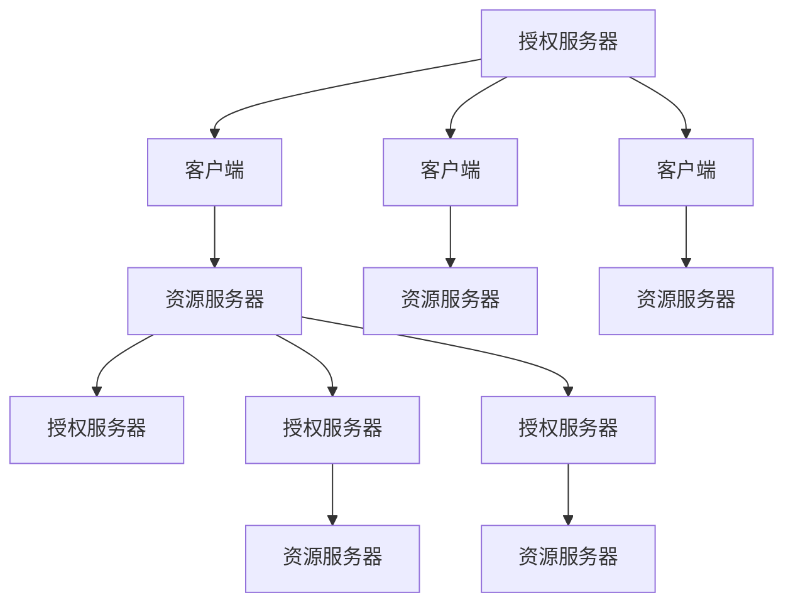

                 

# OAuth 2.0 的优点和实现

> 关键词：OAuth 2.0, 认证授权, 开放标准, 安全性, 灵活性

## 1. 背景介绍

随着互联网和移动互联网的迅猛发展，用户在不同应用间频繁切换账户，如何安全、便捷地实现用户认证和授权，成为了一个亟待解决的难题。传统的用户名和密码认证方式虽然简单易用，但在安全性、便捷性和跨平台性方面存在诸多不足。而OAuth 2.0作为一项广泛采用的开放标准，凭借其高度安全性、广泛兼容性和卓越灵活性，成为了解决这一难题的利器。

### 1.1 问题由来

在Web 2.0时代，用户账户的安全性、便捷性和跨平台性问题凸显。传统的用户名和密码认证方式存在以下局限：

- **安全性不足**：用户需记住多个密码，且在不同网站上使用相同的密码，一旦泄露将暴露所有账户。
- **便捷性不佳**：每次登录需手动输入用户名和密码，无法实现一键登录。
- **跨平台性差**：各网站使用的认证协议和API接口各不相同，用户难以在多个应用间共享账户。

为此，OAuth 2.0应运而生，以全新的认证授权方式，解决了上述问题。

### 1.2 问题核心关键点

OAuth 2.0的核心思想是“用户授权、第三方访问”，主要包括以下几个关键点：

1. **用户授权**：用户通过授权方式将第三方应用接入，允许其访问特定资源。
2. **授权服务器**：用于认证和管理用户的授权请求。
3. **资源服务器**：存储和提供被授权访问的资源。
4. **客户端**：第三方应用，通过授权服务器获得用户授权，访问资源服务器上的资源。

这种设计既保证了用户账户的安全，又极大提升了跨平台认证的便捷性和灵活性。

## 2. 核心概念与联系

### 2.1 核心概念概述

为更好地理解OAuth 2.0，本节将介绍几个关键概念及其联系：

- **授权码模式(Authorization Code)**
- **密码模式(Password Grant)**
- **隐式模式(Implicit Grant)**
- **客户端凭据模式(Client Credentials Grant)**
- **简化模式(Simplified Grant)**
- **声明式授权(Identity Token)**
- **OAuth 2.0 实体**：包括授权服务器、资源服务器、客户端等。

这些概念之间的关系可以通过以下Mermaid流程图来展示：



这个流程图展示了OAuth 2.0的核心流程：

1. 客户端向授权服务器发起授权请求，获取授权码。
2. 资源服务器向授权服务器申请访问令牌。
3. 授权服务器通过用户授权，向客户端提供访问令牌。
4. 客户端持访问令牌，访问资源服务器上的资源。

### 2.2 核心概念原理和架构

OAuth 2.0架构由三部分组成：

- **授权服务器**：负责管理用户认证和授权请求，生成访问令牌。
- **资源服务器**：存储和提供被授权访问的资源。
- **客户端**：第三方应用，通过授权服务器获得用户授权，访问资源服务器上的资源。

其核心流程包括以下几个步骤：

1. **客户端获取授权码**：客户端通过授权服务器获取授权码。
2. **授权服务器获取用户授权**：授权服务器要求用户授权，生成授权码。
3. **客户端获取访问令牌**：客户端向授权服务器提交授权码，换取访问令牌。
4. **客户端访问资源**：客户端持访问令牌访问资源服务器上的资源。

OAuth 2.0的核心设计理念是“用户授权、第三方访问”，通过分权机制，将用户授权和第三方访问分离开来，从而保证了用户账户的安全性。

## 3. 核心算法原理 & 具体操作步骤

### 3.1 算法原理概述

OAuth 2.0的核心原理是“分权机制”，即用户授权和第三方访问分离。具体而言，授权服务器负责管理用户认证和授权请求，资源服务器负责存储和提供被授权访问的资源，客户端通过授权服务器获得用户授权，访问资源服务器上的资源。

### 3.2 算法步骤详解

OAuth 2.0的核心步骤包括：

1. **客户端获取授权码**：客户端通过授权服务器获取授权码。
2. **授权服务器获取用户授权**：授权服务器要求用户授权，生成授权码。
3. **客户端获取访问令牌**：客户端向授权服务器提交授权码，换取访问令牌。
4. **客户端访问资源**：客户端持访问令牌访问资源服务器上的资源。

这些步骤将用户授权和第三方访问分离开来，确保了用户账户的安全性。

### 3.3 算法优缺点

OAuth 2.0具有以下优点：

1. **高度安全性**：通过分权机制，将用户授权和第三方访问分离，确保了用户账户的安全性。
2. **广泛兼容性**：广泛支持主流操作系统和编程语言，易于集成到各类应用中。
3. **卓越灵活性**：支持多种授权模式，根据具体场景灵活选择。

同时，OAuth 2.0也存在一些局限：

1. **认证复杂性**：涉及多个实体，流程复杂，易于出错。
2. **需要额外管理**：授权码、访问令牌等需额外管理和维护，增加了系统负担。
3. **难以调试**：一旦出现问题，难以快速定位和修复。

### 3.4 算法应用领域

OAuth 2.0广泛应用于各类Web和移动应用中，包括社交网络、电子商务、在线支付、云服务等。其核心优势在于，通过高度安全性、广泛兼容性和卓越灵活性，为各应用提供了可靠的认证授权解决方案。

## 4. 数学模型和公式 & 详细讲解

### 4.1 数学模型构建

OAuth 2.0的核心流程涉及多个实体和交互，可以用数学模型来表示：

设授权服务器为A，资源服务器为R，客户端为C，用户为U，令牌为T。

1. **授权码模式**：
   - **客户端获取授权码**：$C \rightarrow A$，请求授权码。
   - **授权服务器获取用户授权**：$A \rightarrow U$，获取用户授权。
   - **客户端获取访问令牌**：$C \rightarrow A$，交换授权码。
   - **客户端访问资源**：$C \rightarrow R$，使用访问令牌。

2. **密码模式**：
   - **客户端获取访问令牌**：$C \rightarrow A$，直接使用密码。
   - **客户端访问资源**：$C \rightarrow R$，使用访问令牌。

3. **隐式模式**：
   - **客户端获取访问令牌**：$C \rightarrow R$，直接获取令牌。

4. **客户端凭据模式**：
   - **客户端获取访问令牌**：$C \rightarrow A$，使用客户端凭据。

5. **简化模式**：
   - **客户端获取访问令牌**：$C \rightarrow A$，简化流程。

6. **声明式授权**：
   - **客户端访问资源**：$C \rightarrow R$，直接使用声明式授权。

### 4.2 公式推导过程

以授权码模式为例，推导其主要公式：

设客户端ID为$client\_id$，客户端密钥为$client\_secret$，授权码为$code$，访问令牌为$access\_token$，刷新令牌为$refresh\_token$，有效期为$expiry$。

1. **客户端获取授权码**：
   - $A \rightarrow C$：请求授权。
   - $C \rightarrow A$：请求授权码。
   - $A \rightarrow C$：返回授权码。

2. **客户端获取访问令牌**：
   - $C \rightarrow A$：交换授权码。
   - $A \rightarrow C$：返回访问令牌和刷新令牌。

3. **客户端访问资源**：
   - $C \rightarrow R$：使用访问令牌。

### 4.3 案例分析与讲解

以社交网络为例，分析OAuth 2.0的应用场景：

1. **用户授权**：用户通过社交网络平台，授权第三方应用访问其个人资料和朋友圈。
2. **授权服务器**：社交网络平台作为授权服务器，管理用户的授权请求。
3. **资源服务器**：社交网络平台存储用户个人资料和朋友圈，作为资源服务器。
4. **客户端**：第三方应用，通过社交网络平台获得用户授权，访问用户个人资料和朋友圈。

此案例展示了OAuth 2.0的核心思想，即通过授权服务器和资源服务器，实现用户授权和第三方访问的分权机制，确保了用户账户的安全性。

## 5. 项目实践：代码实例和详细解释说明

### 5.1 开发环境搭建

OAuth 2.0的开发环境包括授权服务器、资源服务器和客户端，一般使用Python和Flask框架实现。以下是搭建开发环境的步骤：

1. **安装Python和Flask**：
   ```bash
   sudo apt-get install python3-pip
   pip install flask
   ```

2. **安装OAuth 2.0库**：
   ```bash
   pip install Flask-OAuthlib
   ```

### 5.2 源代码详细实现

以下是一个简单的OAuth 2.0授权服务器和客户端的Python实现：

**授权服务器代码**：

```python
from flask import Flask, request
from flask_oauthlib.client import OAuth

app = Flask(__name__)
app.config['OAUTH_LIB_CLIENT_ID'] = 'your_client_id'
app.config['OAUTH_LIB_CLIENT_SECRET'] = 'your_client_secret'
app.config['OAUTH_LIB_REDIRECT_URI'] = 'http://localhost:5000/authorization/callback'
oauth = OAuth(app)

resource_server = oauth.remote_app(
    'ResourceServer',
    consumer_key='your_resource_server_key',
    consumer_secret='your_resource_server_secret',
    request_token_params=None,
    base_url='http://your_resource_server:5000/',
    request_token_url=None,
    access_token_url='http://your_resource_server:5000/oauth/access_token',
    authorize_url='http://your_resource_server:5000/oauth/authorize',
)

@app.route('/authorization/authorize')
def authorize():
    return resource_server.authorize(callback=oauth.authorized_handler(accept_redirect=True))

@app.route('/authorization/callback')
def callback():
    oauth授权(accept_redirect=True)
    return 'ok'

if __name__ == '__main__':
    app.run(debug=True)
```

**客户端代码**：

```python
from flask import Flask, request
from flask_oauthlib.client import OAuth

app = Flask(__name__)
app.config['OAUTH_LIB_CLIENT_ID'] = 'your_client_id'
app.config['OAUTH_LIB_CLIENT_SECRET'] = 'your_client_secret'
app.config['OAUTH_LIB_REDIRECT_URI'] = 'http://localhost:5000/authorization/callback'
oauth = OAuth(app)

resource_server = oauth.remote_app(
    'ResourceServer',
    consumer_key='your_resource_server_key',
    consumer_secret='your_resource_server_secret',
    request_token_params=None,
    base_url='http://your_resource_server:5000/',
    request_token_url=None,
    access_token_url='http://your_resource_server:5000/oauth/access_token',
    authorize_url='http://your_resource_server:5000/oauth/authorize',
)

@app.route('/oauth/authorize')
def authorize():
    return resource_server.authorize(callback=oauth.authorized_handler(accept_redirect=True))

@app.route('/oauth/callback')
def callback():
    oauth授权(accept_redirect=True)
    return 'ok'

if __name__ == '__main__':
    app.run(debug=True)
```

### 5.3 代码解读与分析

**授权服务器代码**：

1. **Flask框架**：使用Flask框架搭建Web服务。
2. **OAuthlib库**：使用OAuthlib库实现OAuth 2.0授权。
3. **授权码模式**：实现授权码模式，获取授权码并授权第三方应用访问资源。

**客户端代码**：

1. **Flask框架**：使用Flask框架搭建Web服务。
2. **OAuthlib库**：使用OAuthlib库实现OAuth 2.0授权。
3. **授权码模式**：实现授权码模式，获取授权码并授权第三方应用访问资源。

### 5.4 运行结果展示

运行上述代码后，授权服务器和客户端分别启动，用户可以通过授权服务器进行授权，并访问资源服务器上的资源。

## 6. 实际应用场景

OAuth 2.0广泛应用于各类Web和移动应用中，包括社交网络、电子商务、在线支付、云服务等。以下是几个实际应用场景：

### 6.1 社交网络平台

社交网络平台作为授权服务器，管理用户的授权请求，允许用户授权第三方应用访问其个人资料和朋友圈。用户可以自由选择授权哪些应用，保证了账户的安全性。

### 6.2 电子商务网站

电子商务网站作为资源服务器，存储和提供商品信息、购物车等资源。用户通过授权第三方应用，如电商App，访问和购买商品，实现了无缝的用户体验。

### 6.3 在线支付平台

在线支付平台作为授权服务器，管理用户的支付授权请求，允许用户授权第三方应用访问其支付信息。用户可以自由选择授权哪些应用，确保了支付信息的安全性。

### 6.4 云服务平台

云服务平台作为授权服务器，管理用户的访问授权请求，允许用户授权第三方应用访问其云资源。用户可以自由选择授权哪些应用，保证了云资源的安全性。

## 7. 工具和资源推荐

### 7.1 学习资源推荐

为了帮助开发者系统掌握OAuth 2.0的理论基础和实践技巧，这里推荐一些优质的学习资源：

1. **OAuth 2.0官方文档**：OAuth 2.0官方网站提供了详细的技术文档和实现指南，是学习OAuth 2.0的不二之选。

2. **Flask-OAuthlib官方文档**：Flask-OAuthlib官方文档详细介绍了OAuth 2.0的实现方法，适合Flask用户学习。

3. **《OAuth 2.0权威指南》书籍**：这本书系统介绍了OAuth 2.0的理论和实践，适合深入学习和参考。

4. **《OAuth 2.0实战指南》书籍**：这本书提供了OAuth 2.0的实战案例和最佳实践，适合动手实践和调试。

5. **OAuth 2.0标准规范**：了解OAuth 2.0的标准规范，有助于深入理解其核心原理和流程。

通过对这些资源的学习实践，相信你一定能够快速掌握OAuth 2.0的精髓，并用于解决实际的认证授权问题。

### 7.2 开发工具推荐

OAuth 2.0的开发工具包括Flask、OAuthlib等，以下是几个常用工具：

1. **Flask框架**：轻量级的Web框架，易于搭建和扩展，适合OAuth 2.0的实现。
2. **OAuthlib库**：OAuth 2.0的官方库，提供了丰富的授权模式和实现方法。
3. **Python**：OAuth 2.0的实现语言，广泛支持各类Web和移动应用。

合理利用这些工具，可以显著提升OAuth 2.0的开发效率，加快创新迭代的步伐。

### 7.3 相关论文推荐

OAuth 2.0作为一项广泛采用的开放标准，其研究论文众多。以下是几篇奠基性的相关论文，推荐阅读：

1. **OAuth 2.0原论文**：OAuth 2.0的最初设计文档，详细介绍了OAuth 2.0的核心原理和流程。

2. **OAuth 2.0安全性和隐私性**：研究OAuth 2.0的安全性和隐私性问题，提出改进方案。

3. **OAuth 2.0扩展和演化**：探讨OAuth 2.0的扩展和演化，提出新的授权模式和实现方法。

这些论文代表了大规模认证授权技术的发展脉络，通过学习这些前沿成果，可以帮助研究者把握学科前进方向，激发更多的创新灵感。

## 8. 总结：未来发展趋势与挑战

### 8.1 总结

OAuth 2.0作为一种广泛采用的开放标准，凭借其高度安全性、广泛兼容性和卓越灵活性，已经成为各类Web和移动应用中的重要认证授权解决方案。本文从原理、步骤、优缺点、应用场景等多个角度，详细介绍了OAuth 2.0的核心思想和实现方法。

通过本文的系统梳理，可以看到，OAuth 2.0为各类应用提供了可靠的认证授权解决方案，极大提升了用户账户的安全性、便捷性和跨平台性。未来，伴随认证授权技术的发展，OAuth 2.0必将在更多场景下发挥重要作用，成为构建安全、可靠、灵活的Web和移动应用的重要基础。

### 8.2 未来发展趋势

OAuth 2.0的未来发展趋势包括以下几个方向：

1. **更加严格的安全性**：随着互联网威胁的不断增加，OAuth 2.0将不断加强安全性，采用更加严格的加密和验证措施。
2. **更高的可扩展性**：OAuth 2.0将不断扩展其功能，支持更多的授权模式和应用场景。
3. **更加智能的授权**：结合AI和大数据分析技术，OAuth 2.0将实现更加智能的授权，基于用户行为和偏好，动态调整授权策略。
4. **更好的用户体验**：OAuth 2.0将不断优化用户界面和交互体验，提升用户的授权和管理效率。
5. **更加广泛的兼容性**：OAuth 2.0将支持更多操作系统和编程语言，实现更广泛的兼容性和互通性。

以上趋势展示了OAuth 2.0未来的广阔前景，相信在学界和产业界的共同努力下，OAuth 2.0必将成为认证授权领域的领导者，为各类应用提供更加安全、便捷、灵活的认证授权解决方案。

### 8.3 面临的挑战

尽管OAuth 2.0已经取得了显著成就，但在迈向更加智能化、普适化应用的过程中，仍面临以下挑战：

1. **安全性不足**：OAuth 2.0在安全性方面仍存在漏洞，如中间人攻击、重放攻击等，需要不断加强安全性。
2. **授权复杂性**：OAuth 2.0涉及多个实体和交互，流程复杂，容易出现错误，需要不断简化和优化。
3. **性能瓶颈**：OAuth 2.0在处理大规模用户和应用时，可能出现性能瓶颈，需要优化算法和架构。
4. **用户体验不佳**：OAuth 2.0的用户体验仍有提升空间，需要优化授权流程和用户界面。
5. **扩展性不足**：OAuth 2.0的扩展性有待加强，支持更多的应用场景和需求。

解决这些挑战，需要学界和产业界的共同努力，不断进行技术创新和优化。

### 8.4 研究展望

未来，OAuth 2.0的研究方向将包括以下几个方面：

1. **安全性增强**：进一步加强OAuth 2.0的安全性，采用更加严格的加密和验证措施。
2. **智能授权**：结合AI和大数据分析技术，实现更加智能的授权，基于用户行为和偏好，动态调整授权策略。
3. **用户体验优化**：不断优化用户界面和交互体验，提升用户的授权和管理效率。
4. **性能优化**：优化OAuth 2.0的算法和架构，提升其处理大规模用户和应用的能力。
5. **扩展性增强**：进一步增强OAuth 2.0的扩展性，支持更多的应用场景和需求。

这些研究方向将引领OAuth 2.0的发展，使其在认证授权领域发挥更大的作用，为各类应用提供更加安全、便捷、灵活的认证授权解决方案。

## 9. 附录：常见问题与解答

**Q1：OAuth 2.0的授权码模式和隐式模式有什么区别？**

A: 授权码模式和隐式模式是OAuth 2.0的两种授权方式，主要区别在于：

- 授权码模式需要用户授权，生成授权码，然后再通过授权码换取访问令牌。
- 隐式模式不需要用户授权，直接获取访问令牌。

授权码模式更安全，适用于Web应用和移动应用，而隐式模式更简洁，适用于无状态应用和移动应用。

**Q2：OAuth 2.0的客户端凭据模式和声明式授权有什么区别？**

A: 客户端凭据模式和声明式授权是OAuth 2.0的两种授权方式，主要区别在于：

- 客户端凭据模式需要客户端向授权服务器提供凭据，获取访问令牌。
- 声明式授权不需要客户端向授权服务器提供凭据，直接使用声明式授权。

客户端凭据模式适用于需要高安全性的应用场景，如银行、医疗等，而声明式授权适用于轻量级应用场景，如社交网络、博客等。

**Q3：OAuth 2.0的优缺点是什么？**

A: OAuth 2.0具有以下优点：

1. 高度安全性：通过分权机制，将用户授权和第三方访问分离，确保了用户账户的安全性。
2. 广泛兼容性：广泛支持主流操作系统和编程语言，易于集成到各类应用中。
3. 卓越灵活性：支持多种授权模式，根据具体场景灵活选择。

同时，OAuth 2.0也存在以下局限：

1. 认证复杂性：涉及多个实体，流程复杂，易于出错。
2. 需要额外管理：授权码、访问令牌等需额外管理和维护，增加了系统负担。
3. 难以调试：一旦出现问题，难以快速定位和修复。

**Q4：如何实现OAuth 2.0授权服务器和客户端的交互？**

A: 实现OAuth 2.0授权服务器和客户端的交互，需要遵循OAuth 2.0的核心流程，具体步骤如下：

1. 客户端向授权服务器发起授权请求，获取授权码。
2. 授权服务器要求用户授权，生成授权码。
3. 客户端向授权服务器提交授权码，换取访问令牌。
4. 客户端持访问令牌访问资源服务器上的资源。

在实现过程中，需要合理利用OAuth库和Web框架，确保流程的正确性和安全性。

**Q5：OAuth 2.0的授权模式有哪些？**

A: OAuth 2.0的授权模式包括：

1. 授权码模式：通过授权码获取访问令牌。
2. 密码模式：直接使用密码获取访问令牌。
3. 隐式模式：直接获取访问令牌。
4. 客户端凭据模式：通过客户端凭据获取访问令牌。
5. 简化模式：简化授权流程，直接获取访问令牌。
6. 声明式授权：直接使用声明式授权。

根据具体场景，选择合适的授权模式，可以提升授权流程的效率和安全性。

---

作者：禅与计算机程序设计艺术 / Zen and the Art of Computer Programming

