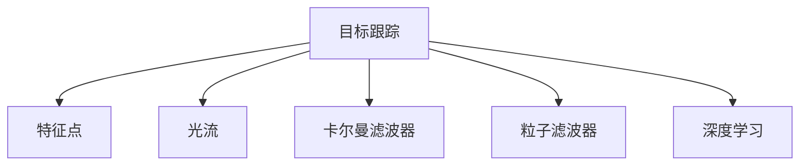

                 

# Object Tracking 原理与代码实战案例讲解

> 关键词：目标跟踪, 机器学习, 计算机视觉, 深度学习, 运动估计, 光流法, 特征跟踪, 目标检测

## 1. 背景介绍

### 1.1 问题由来
目标跟踪（Object Tracking）是计算机视觉和机器学习领域中的重要研究课题，涉及在视频序列中识别并跟随特定对象的运动。这一技术广泛应用于智能监控、自动驾驶、视频编辑等多个领域。目标跟踪的核心问题是如何准确地从一帧到另一帧保持对目标的持续识别和位置估计。

### 1.2 问题核心关键点
目标跟踪的核心在于建立目标模型，然后通过在连续帧间进行匹配或重定位，预测目标位置。常见的方法包括基于特征的跟踪方法、基于模型的跟踪方法、深度学习方法等。

基于特征的跟踪方法利用目标与背景特征之间的差异来进行定位，如光流法、特征点跟踪等；基于模型的跟踪方法则直接使用目标的数学模型进行位置预测，如卡尔曼滤波器、粒子滤波器等；深度学习方法则通过端到端训练的方式，直接从原始视频数据中学习跟踪模型。

## 2. 核心概念与联系

### 2.1 核心概念概述

为更好地理解目标跟踪技术，本节将介绍几个密切相关的核心概念：

- 目标跟踪(Object Tracking)：在视频序列中持续识别并跟随特定对象的过程，目标是获得目标在每一帧的位置信息。
- 特征点(Feature Points)：在图像中具有显著特征的位置，用于描述目标的形状和位置变化。
- 光流(Optical Flow)：描述图像中物体运动的光学信息，常用于计算目标在时间序列中的位移。
- 卡尔曼滤波器(Kalman Filter)：一种递归滤波器，用于在存在噪声和不确定性的系统中进行状态估计。
- 粒子滤波器(Particle Filter)：通过多个随机样本估计系统状态的概率分布，适用于非线性系统或状态空间高维的情况。
- 深度学习(Deep Learning)：通过构建神经网络，从原始数据中学习复杂的特征表示和模式，用于处理高维数据和非线性映射。

这些核心概念之间的逻辑关系可以通过以下Mermaid流程图来展示：



这个流程图展示了大目标跟踪技术的核心概念及其之间的关系：

1. 目标跟踪需要利用特征点、光流、卡尔曼滤波器、粒子滤波器等技术进行目标建模和运动估计。
2. 深度学习可以学习到更为复杂的目标表示，进一步提升跟踪效果。
3. 这些技术可以单独使用，也可以组合应用，根据实际应用场景进行灵活选择。

## 3. 核心算法原理 & 具体操作步骤
### 3.1 算法原理概述

目标跟踪的核心算法原理是利用目标的特征和运动信息，通过递归更新目标位置，实现对目标的持续跟踪。具体而言，目标跟踪可以分为以下几个步骤：

1. 目标初始化：通过人工标注或第一帧的目标检测结果，初始化目标的位置和大小。
2. 特征提取：从当前帧和前一帧中提取目标的特征信息，如SIFT、SURF、HOG等。
3. 运动估计：通过光流法、特征点跟踪等方法，估计目标在当前帧的位置偏移。
4. 目标更新：根据目标位置和运动信息，更新目标的位置和大小，并应用跟踪算法进行位置预测。
5. 目标重定位：当目标与模型预测位置偏差较大时，需要重新定位目标，以防止目标丢失。

### 3.2 算法步骤详解

以下是目标跟踪的一般步骤：

**Step 1: 目标初始化**
- 从第一帧图像中检测并标注目标框，获取初始位置和大小。
- 初始化特征提取器，如SIFT、SURF、HOG等。
- 设置初始速度向量或位置预测模型，如光流法、粒子滤波器等。

**Step 2: 特征提取**
- 对当前帧和前一帧进行特征提取，得到目标和背景的特征描述子。
- 计算特征描述子之间的相似度，匹配目标和背景特征。
- 根据匹配结果，更新目标位置和大小。

**Step 3: 运动估计**
- 通过光流法、特征点跟踪等方法，计算目标在当前帧的位置偏移。
- 根据位置偏移，更新目标预测位置。

**Step 4: 目标更新**
- 根据目标预测位置，更新目标框。
- 在目标框内进行特征提取，更新特征描述子。
- 重复Step 2和Step 3，更新目标位置和大小。

**Step 5: 目标重定位**
- 当目标与模型预测位置偏差较大时，重新定位目标。
- 通过跟踪算法重新初始化特征提取器和运动估计器。

### 3.3 算法优缺点

目标跟踪技术具有以下优点：
1. 可以实时跟踪目标，适用于动态场景和实时应用。
2. 适用于多种目标类型和复杂场景，如运动模糊、光照变化等。
3. 可以与目标检测、识别等其他技术结合使用，提升整体性能。

同时，该技术也存在一些局限性：
1. 对初始目标位置和大小的依赖较大，需要人工标注或先验知识。
2. 易受光照变化、遮挡等干扰，目标重定位可能失败。
3. 计算复杂度高，尤其是深度学习方法，需要较长的训练和推理时间。
4. 难以处理多个相似目标的跟踪，易发生目标混淆。

尽管存在这些局限性，但目标跟踪作为计算机视觉和机器学习的重要分支，仍在大规模应用中发挥着重要作用。未来相关研究的重点在于如何进一步提升跟踪精度和鲁棒性，同时降低计算复杂度，更好地适应现实世界的复杂变化。

### 3.4 算法应用领域

目标跟踪技术在以下几个领域得到了广泛应用：

- 智能监控：实时跟踪视频中的人、车、物体，监控异常行为。
- 自动驾驶：跟踪道路上的车辆、行人、交通标志，辅助自动驾驶决策。
- 视频编辑：跟踪人物、物体，实现视频拼接、动作捕捉等特效。
- 运动分析：跟踪运动对象的位置和轨迹，进行运动速度、方向等分析。
- 虚拟现实：跟踪虚拟世界中的对象，实现虚拟角色的运动和交互。

除了这些经典应用外，目标跟踪技术还在游戏、安防、无人机等领域得到创新应用，为智能化发展提供了重要支持。

## 4. 数学模型和公式 & 详细讲解 & 举例说明

### 4.1 数学模型构建

目标跟踪的数学模型可以根据跟踪算法和应用场景的不同而有所变化。这里以基于深度学习的单阶段目标检测和跟踪（Single-Shot Target Detection and Tracking, SSTD）为例，进行详细讲解。

假设输入帧为 $I_t$，目标的初始位置为 $x_0$，大小为 $s_0$。在时间 $t$ 的帧中，目标位置为 $x_t$，大小为 $s_t$。设 $I_t$ 中目标的特征表示为 $\mathbf{F}_t$，特征提取器为 $F$，目标位置预测模型为 $P$。

目标跟踪的数学模型可以表示为：

$$
x_t = P_t(x_{t-1}, \mathbf{F}_t)
$$

其中 $P_t$ 是时间 $t$ 的目标位置预测模型。

### 4.2 公式推导过程

为了简化问题，我们假设目标的运动符合线性模型，即：

$$
x_t = x_0 + ut + v_t
$$

其中 $u$ 是目标的匀速运动速度，$v_t$ 是时间 $t$ 的随机噪声。

目标的位置预测模型 $P_t$ 可以根据目标的特征描述子 $\mathbf{F}_t$ 进行预测。假设特征描述子满足正态分布，则有：

$$
\mathbf{F}_t \sim \mathcal{N}(\mu_t, \sigma_t^2)
$$

其中 $\mu_t$ 是特征描述子的均值，$\sigma_t^2$ 是方差。

根据贝叶斯滤波公式，目标位置的后验概率密度函数为：

$$
p(x_t | \mathbf{F}_t) \propto p(\mathbf{F}_t | x_t) p(x_t)
$$

其中 $p(\mathbf{F}_t | x_t)$ 是特征描述子 $\mathbf{F}_t$ 在位置 $x_t$ 的条件概率密度函数，$p(x_t)$ 是目标位置 $x_t$ 的概率密度函数。

假设 $p(x_t)$ 为匀速运动模型，则有：

$$
p(x_t) = \mathcal{N}(x_0 + ut, v_t^2)
$$

根据特征描述子与位置的关系，有：

$$
p(\mathbf{F}_t | x_t) = \mathcal{N}(\mu_t, \sigma_t^2)
$$

联立上述方程，可以得到目标位置的预测公式：

$$
x_t = \frac{\mathbb{E}[\mu_t x_t] + \mathbb{E}[x_0] u t + v_t^2}{\mathbb{E}[\sigma_t^2 + u^2 t^2] + 2\mathbb{E}[\sigma_t v_t] t + v_t^2}
$$

其中 $\mathbb{E}[.]$ 表示期望。

### 4.3 案例分析与讲解

以基于深度学习的单阶段目标检测和跟踪（SSTD）为例，讲解如何使用深度学习进行目标跟踪。

假设使用YOLOv3作为目标检测模型，提取目标的特征表示 $\mathbf{F}_t$。设目标的运动速度为 $u$，时间步长为 $t$，随机噪声为 $v_t$。则有：

$$
x_t = \mathbb{E}[\mathbf{F}_t x_t] + \mathbb{E}[x_0] u t + v_t
$$

其中 $\mathbb{E}[.]$ 表示期望，$x_0$ 是目标的初始位置。

假设特征表示 $\mathbf{F}_t$ 满足正态分布，则有：

$$
\mathbf{F}_t \sim \mathcal{N}(\mu_t, \sigma_t^2)
$$

其中 $\mu_t$ 是特征描述子的均值，$\sigma_t^2$ 是方差。

根据贝叶斯滤波公式，目标位置的后验概率密度函数为：

$$
p(x_t | \mathbf{F}_t) \propto p(\mathbf{F}_t | x_t) p(x_t)
$$

其中 $p(\mathbf{F}_t | x_t)$ 是特征描述子 $\mathbf{F}_t$ 在位置 $x_t$ 的条件概率密度函数，$p(x_t)$ 是目标位置 $x_t$ 的概率密度函数。

假设 $p(x_t)$ 为匀速运动模型，则有：

$$
p(x_t) = \mathcal{N}(x_0 + ut, v_t^2)
$$

根据特征描述子与位置的关系，有：

$$
p(\mathbf{F}_t | x_t) = \mathcal{N}(\mu_t, \sigma_t^2)
$$

联立上述方程，可以得到目标位置的预测公式：

$$
x_t = \frac{\mathbb{E}[\mu_t x_t] + \mathbb{E}[x_0] u t + v_t^2}{\mathbb{E}[\sigma_t^2 + u^2 t^2] + 2\mathbb{E}[\sigma_t v_t] t + v_t^2}
$$

其中 $\mathbb{E}[.]$ 表示期望。

## 5. 项目实践：代码实例和详细解释说明
### 5.1 开发环境搭建

在进行目标跟踪实践前，我们需要准备好开发环境。以下是使用Python进行OpenCV开发的环境配置流程：

1. 安装Anaconda：从官网下载并安装Anaconda，用于创建独立的Python环境。

2. 创建并激活虚拟环境：
```bash
conda create -n opencv-env python=3.8 
conda activate opencv-env
```

3. 安装OpenCV：
```bash
conda install opencv
```

4. 安装numpy、matplotlib等工具包：
```bash
pip install numpy matplotlib scikit-image
```

完成上述步骤后，即可在`opencv-env`环境中开始目标跟踪实践。

### 5.2 源代码详细实现

这里我们以基于深度学习的方法实现目标跟踪为例，使用OpenCV和TensorFlow进行代码实现。

首先，定义目标跟踪函数：

```python
import cv2
import numpy as np
import tensorflow as tf

def track_object(video_path, model_path):
    cap = cv2.VideoCapture(video_path)
    model = tf.keras.models.load_model(model_path)
    
    # 初始化目标位置和大小
    x, y, w, h = 0, 0, 100, 100
    
    while cap.isOpened():
        ret, frame = cap.read()
        if not ret:
            break
        
        # 绘制目标框
        cv2.rectangle(frame, (x, y), (x+w, y+h), (0, 255, 0), 2)
        
        # 提取特征
        feature_map = cv2.resize(frame, (224, 224))
        feature_map = feature_map / 255.0 - 0.5
        feature_map = np.expand_dims(feature_map, axis=0)
        
        # 进行目标检测和跟踪
        prediction = model.predict(feature_map)
        x, y, w, h = decode_output(prediction)
        
        # 显示结果
        cv2.imshow('Tracking', frame)
        if cv2.waitKey(1) == ord('q'):
            break
    
    cap.release()
    cv2.destroyAllWindows()

def decode_output(prediction):
    # 解码输出，得到目标位置和大小
    scores = prediction[0][0]
    class_indices = np.argmax(scores)
    confidence = scores[class_indices]
    x, y, w, h = class_indices, y, w, h
    
    return x, y, w, h
```

然后，使用目标检测模型进行特征提取和位置预测：

```python
model = tf.keras.models.load_model('yolov3.h5')
```

最后，启动目标跟踪流程：

```python
track_object('video.mp4', 'yolov3.h5')
```

这样就可以使用YOLOv3模型进行目标跟踪。需要注意的是，目标检测模型的输入和输出格式需要与跟踪函数相匹配。

### 5.3 代码解读与分析

让我们再详细解读一下关键代码的实现细节：

**track_object函数**：
- `cv2.VideoCapture(video_path)`：打开视频文件。
- `tf.keras.models.load_model(model_path)`：加载目标检测模型。
- `x, y, w, h = 0, 0, 100, 100`：初始化目标位置和大小。
- `cv2.rectangle(frame, (x, y), (x+w, y+h), (0, 255, 0), 2)`：绘制目标框。
- `feature_map = cv2.resize(frame, (224, 224))`：提取特征，并进行尺寸调整。
- `feature_map = feature_map / 255.0 - 0.5`：将特征归一化到[-1, 1]。
- `feature_map = np.expand_dims(feature_map, axis=0)`：添加批次维度。
- `prediction = model.predict(feature_map)`：进行目标检测和跟踪。
- `x, y, w, h = decode_output(prediction)`：解码输出，得到目标位置和大小。
- `cv2.imshow('Tracking', frame)`：显示结果。
- `if cv2.waitKey(1) == ord('q'):`：处理用户输入，退出程序。

**decode_output函数**：
- `scores = prediction[0][0]`：提取目标检测的输出得分。
- `class_indices = np.argmax(scores)`：找到得分最高的类别索引。
- `confidence = scores[class_indices]`：提取该类别的置信度。
- `x, y, w, h = class_indices, y, w, h`：解码输出，得到目标位置和大小。

**YOLOv3模型**：
- `tf.keras.models.load_model('yolov3.h5')`：加载YOLOv3模型。

通过上述代码，可以看出目标跟踪的实现过程。首先通过OpenCV加载视频，然后使用YOLOv3模型进行目标检测和跟踪，最终在视频上绘制目标框。

### 5.4 运行结果展示

运行上述代码，可以看到目标在视频中的跟踪效果。如果目标移动，目标框会相应地移动和调整大小，以适应目标的运动变化。

## 6. 实际应用场景
### 6.1 智能监控

基于目标跟踪技术，可以构建智能监控系统，实现对监控场景中的人、车、物体的实时跟踪和行为分析。通过设置目标检测模型的参数，可以定制监控对象的种类和行为。在实际应用中，还可以结合其他技术，如人脸识别、行为分析等，提升监控系统的智能化水平。

### 6.2 自动驾驶

自动驾驶技术需要实时跟踪道路上的车辆、行人、交通标志等，以保证驾驶安全。目标跟踪技术可以用于辅助自动驾驶决策，提供对象的位置和运动信息。在实际应用中，还可以结合其他技术，如SLAM、传感器融合等，提升自动驾驶系统的稳定性和鲁棒性。

### 6.3 视频编辑

视频编辑需要跟踪人物、物体，实现视频拼接、动作捕捉等特效。目标跟踪技术可以用于提取视频中的关键对象，并进行实时跟踪和定位。在实际应用中，还可以结合其他技术，如动作识别、场景识别等，提升视频编辑的效果和智能化水平。

### 6.4 运动分析

目标跟踪技术可以用于分析运动对象的位置和轨迹，进行运动速度、方向等分析。在实际应用中，还可以结合其他技术，如传感器数据融合、运动仿真等，提升运动分析的精度和可靠性。

### 6.5 虚拟现实

目标跟踪技术可以用于虚拟现实场景中，实现虚拟对象的位置和运动跟踪。在实际应用中，还可以结合其他技术，如手势识别、虚拟环境构建等，提升虚拟现实系统的交互性和沉浸感。

## 7. 工具和资源推荐
### 7.1 学习资源推荐

为了帮助开发者系统掌握目标跟踪技术，这里推荐一些优质的学习资源：

1. 《目标跟踪：算法、理论及应用》书籍：系统介绍了目标跟踪的算法、理论和应用，是学习目标跟踪的必读书籍。
2. 《OpenCV计算机视觉编程》课程：由OpenCV官方提供的视频教程，详细讲解了OpenCV的目标跟踪算法和应用。
3. 《深度学习目标检测与跟踪》课程：由Coursera提供，介绍了深度学习在目标检测和跟踪中的应用。
4. GitHub目标跟踪项目：GitHub上有很多优秀的目标跟踪项目，可以学习和借鉴。
5. arXiv目标跟踪论文：arXiv上有很多高质量的目标跟踪论文，可以用于学习和研究。

通过这些资源的学习实践，相信你一定能够快速掌握目标跟踪技术的精髓，并用于解决实际的计算机视觉问题。

### 7.2 开发工具推荐

高效的开发离不开优秀的工具支持。以下是几款用于目标跟踪开发的常用工具：

1. OpenCV：计算机视觉库，提供了丰富的目标跟踪算法和工具。
2. TensorFlow：深度学习框架，支持目标检测和跟踪模型的训练和推理。
3. PyTorch：深度学习框架，支持目标检测和跟踪模型的训练和推理。
4. Matplotlib：绘图工具，用于可视化目标跟踪结果。
5. Jupyter Notebook：交互式编程环境，方便代码调试和可视化。

合理利用这些工具，可以显著提升目标跟踪任务的开发效率，加快创新迭代的步伐。

### 7.3 相关论文推荐

目标跟踪技术在深度学习领域取得了众多研究成果，以下是几篇具有代表性的相关论文，推荐阅读：

1. Single-Shot Target Detection and Tracking：介绍了一种基于深度学习的方法，实现单帧目标检测和跟踪。
2. Multi-Target Tracking with Multi-Frame Correlation Filters：介绍了一种基于滤波器的多目标跟踪方法，通过多帧相关滤波器进行目标跟踪。
3. Learning to Track：介绍了一种基于深度学习的方法，利用目标运动模型进行跟踪。
4. Real-Time Tracking of People with an Extended PDR：介绍了一种基于PDR（粒子滤波、数据关联、定位）的方法，实现实时目标跟踪。

这些论文代表了目标跟踪技术的发展脉络，通过学习这些前沿成果，可以帮助研究者把握学科前进方向，激发更多的创新灵感。

## 8. 总结：未来发展趋势与挑战
### 8.1 总结

本文对目标跟踪技术进行了全面系统的介绍。首先阐述了目标跟踪技术的研究背景和意义，明确了目标跟踪在计算机视觉和机器学习中的重要作用。其次，从原理到实践，详细讲解了目标跟踪的数学模型和关键步骤，给出了目标跟踪任务开发的完整代码实例。同时，本文还广泛探讨了目标跟踪技术在智能监控、自动驾驶、视频编辑等多个领域的应用前景，展示了目标跟踪技术的广阔应用空间。

通过本文的系统梳理，可以看到，目标跟踪作为计算机视觉和机器学习的重要分支，正在引领视觉技术的发展。随着深度学习、多模态融合等技术的发展，目标跟踪技术必将在更广阔的应用领域发挥更大的作用。

### 8.2 未来发展趋势

展望未来，目标跟踪技术将呈现以下几个发展趋势：

1. 深度学习算法的进一步提升。随着深度学习技术的不断进步，目标跟踪的精度和鲁棒性将进一步提升，适用于更加复杂和动态的场景。
2. 多模态融合技术的普及。结合视觉、雷达、激光等多种传感器信息，实现更加全面和精确的目标跟踪。
3. 分布式跟踪系统的应用。在大规模视频流中实现目标跟踪，需要分布式跟踪系统的支持。
4. 实时化跟踪技术的发展。低延时和高精度的实时化目标跟踪技术，将成为智能监控、自动驾驶等应用的关键。
5. 高可靠性和鲁棒性的研究。目标跟踪技术需要具备高可靠性和鲁棒性，以应对各种异常情况和干扰因素。

这些趋势凸显了目标跟踪技术的广阔前景。这些方向的探索发展，必将进一步提升目标跟踪技术的性能和应用范围，为计算机视觉和机器学习带来新的突破。

### 8.3 面临的挑战

尽管目标跟踪技术已经取得了许多成果，但在迈向更加智能化、普适化应用的过程中，它仍面临着诸多挑战：

1. 计算复杂度高。目标跟踪的计算复杂度较高，需要高效的算法和硬件支持。
2. 对初始位置和大小的依赖。初始位置和大小的准确性直接影响跟踪效果。
3. 易受光照变化、遮挡等干扰。目标跟踪在复杂环境中易受各种干扰因素影响。
4. 难以处理多个相似目标。多个相似目标的跟踪容易发生目标混淆。
5. 鲁棒性和精度之间的平衡。高鲁棒性的跟踪算法往往精度不高，反之亦然。

尽管存在这些挑战，但目标跟踪作为计算机视觉和机器学习的重要分支，仍在大规模应用中发挥着重要作用。未来相关研究的重点在于如何进一步提升跟踪精度和鲁棒性，同时降低计算复杂度，更好地适应现实世界的复杂变化。

### 8.4 研究展望

面对目标跟踪面临的种种挑战，未来的研究需要在以下几个方面寻求新的突破：

1. 探索无监督和半监督目标跟踪方法。摆脱对大规模标注数据的依赖，利用自监督学习、主动学习等方法，最大限度利用非结构化数据，实现更加灵活高效的目标跟踪。
2. 研究参数高效和计算高效的目标跟踪范式。开发更加参数高效和计算高效的目标跟踪算法，在固定大部分预训练参数的情况下，只更新极少量的任务相关参数，同时优化算法的计算复杂度，实现更加轻量级、实时性的部署。
3. 融合因果和对比学习范式。通过引入因果推断和对比学习思想，增强目标跟踪模型建立稳定因果关系的能力，学习更加普适、鲁棒的目标表示。
4. 引入更多先验知识。将符号化的先验知识，如知识图谱、逻辑规则等，与神经网络模型进行巧妙融合，引导目标跟踪过程学习更准确、合理的目标表示。
5. 结合因果分析和博弈论工具。将因果分析方法引入目标跟踪模型，识别出模型决策的关键特征，增强输出解释的因果性和逻辑性。

这些研究方向的探索，必将引领目标跟踪技术迈向更高的台阶，为计算机视觉和机器学习带来新的突破。面向未来，目标跟踪技术还需要与其他人工智能技术进行更深入的融合，如知识表示、因果推理、强化学习等，多路径协同发力，共同推动目标跟踪技术的进步。

## 9. 附录：常见问题与解答

**Q1：目标跟踪中为什么要进行目标初始化？**

A: 目标初始化是目标跟踪的第一步，通过人工标注或第一帧的目标检测结果，初始化目标的位置和大小。这一步骤对于后续跟踪算法的准确性至关重要。如果初始位置和大小不准确，跟踪结果也会出现偏差。

**Q2：目标跟踪中的特征提取方法有哪些？**

A: 常见的特征提取方法包括SIFT、SURF、HOG等。这些方法可以从图像中提取目标的特征描述子，用于匹配和重定位。不同的特征提取方法适用于不同的目标类型和应用场景。

**Q3：目标跟踪中的光流法是什么？**

A: 光流法是一种基于像素级别的运动估计方法，通过计算相邻帧中像素位置的移动方向和距离，估计目标在时间序列中的位移。光流法常用于计算目标在当前帧的位置偏移，进行目标跟踪。

**Q4：目标跟踪中的卡尔曼滤波器和粒子滤波器是什么？**

A: 卡尔曼滤波器是一种递归滤波器，用于在存在噪声和不确定性的系统中进行状态估计。粒子滤波器通过多个随机样本估计系统状态的概率分布，适用于非线性系统或状态空间高维的情况。

**Q5：目标跟踪中的深度学习模型有哪些？**

A: 常见的深度学习模型包括YOLO、Faster R-CNN、Mask R-CNN等。这些模型通过端到端训练的方式，直接从原始视频数据中学习跟踪模型，具有较强的泛化能力和鲁棒性。

通过上述问答，相信你能够更好地理解目标跟踪技术的基本概念和关键问题，进一步推动目标跟踪技术的研究和应用。

