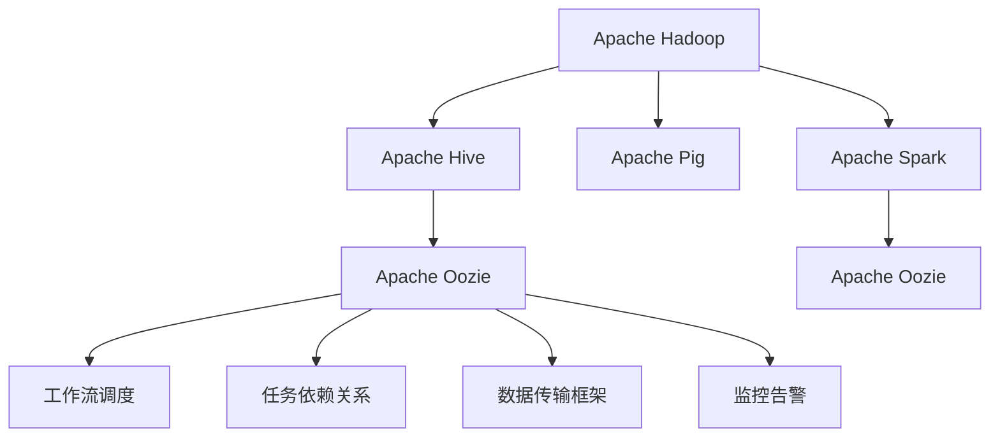

                 

# Oozie原理与代码实例讲解

> 关键词：Oozie, Apache Hadoop, 大数据, 数据管道, 任务调度, 数据流处理, 代码实例

## 1. 背景介绍

### 1.1 问题由来
在大数据时代，企业面对海量数据处理的需求，需要构建高效可靠的数据管道和任务调度系统。传统的ETL（Extract, Transform, Load）工具在面对大规模数据流处理时，显得力不从心。于是，Apache Hadoop社区推出了Oozie，一个基于XML的流程调度系统，专门用于管理和调度Hadoop任务。

Oozie提供了可视化的工作流设计器，便于用户快速构建复杂的任务流。同时，Oozie的API和插件生态系统，支持扩展新的任务类型和调度策略，满足不同业务场景的需求。Oozie广泛应用于金融、电商、社交网络等多个领域，成为数据管道构建和企业级数据平台的重要组件。

### 1.2 问题核心关键点
Oozie的核心优势在于其强大的工作流调度能力和灵活的任务扩展性。Oozie采用XML描述工作流，使得任务流的设计和调试直观方便。同时，Oozie支持多种数据源和处理任务，能够无缝集成Hadoop、Spark、Hive等组件，构建复杂的数据管道。

Oozie的主要功能包括：
- 工作流设计：使用XML或HiveQL定义任务流，可视化设计直观易懂。
- 任务调度：支持周期性调度、依赖关系管理、任务队列等调度策略。
- 任务扩展：通过插件扩展任务类型，支持自定义任务和第三方API。
- 数据同步：通过数据传输框架，实现跨系统的数据同步和复制。
- 监控告警：提供实时监控和告警功能，及时发现和处理异常。

Oozie的工作流设计器提供了拖拽式界面，用户可以快速构建复杂的任务流。而Oozie的API和插件机制，则支持用户通过编程方式，定制各种类型的数据处理任务。

## 2. 核心概念与联系

### 2.1 核心概念概述

为了更好地理解Oozie的工作原理，本节将介绍几个密切相关的核心概念：

- **Apache Hadoop**：Hadoop是一个开源的分布式计算框架，由Apache基金会维护。Hadoop提供了HDFS分布式文件系统和MapReduce计算模型，支持大规模数据存储和处理。
- **Apache Hive**：Hive是一个基于Hadoop的数据仓库工具，通过SQL-like的查询语言HiveQL，方便用户对Hadoop数据进行操作和管理。
- **Apache Pig**：Pig是一个高层次的数据流处理工具，提供了Pig Latin查询语言，支持复杂的数据转换和分析。
- **Apache Spark**：Spark是一个快速、通用的大数据处理引擎，支持内存计算和分布式计算，适合处理海量数据流。
- **Apache Oozie**：Oozie是一个流程调度系统，用于管理和调度Hadoop、Spark、Hive等组件的任务流。
- **工作流调度**：通过XML或HiveQL定义任务流，使用Oozie调度器进行任务管理和调度。
- **任务依赖关系**：通过依赖关系定义任务之间的依赖关系，Oozie能够自动管理任务执行顺序。
- **数据传输框架**：使用Oozie的数据传输框架，实现跨系统的数据同步和复制。
- **监控告警**：Oozie提供实时监控和告警功能，及时发现和处理任务执行异常。

这些核心概念之间的逻辑关系可以通过以下Mermaid流程图来展示：



这个流程图展示了Oozie与Hadoop、Spark、Hive等组件之间的联系，以及Oozie内部各个组件之间的关系：

1. Oozie连接Hadoop、Spark、Hive等多个组件，构建复杂的数据管道。
2. Oozie的任务流调度和管理，依赖XML或HiveQL定义的任务流。
3. Oozie的任务依赖关系管理，自动调度任务执行顺序。
4. Oozie的数据传输框架，实现跨系统的数据同步和复制。
5. Oozie的监控告警功能，及时发现和处理任务执行异常。

这些概念共同构成了Oozie的工作原理，使其能够高效管理和大规模调度数据处理任务。

## 3. 核心算法原理 & 具体操作步骤
### 3.1 算法原理概述

Oozie的核心算法原理主要基于工作流调度模型，使用XML或HiveQL描述任务流，通过Oozie调度器进行任务管理和调度。其核心步骤如下：

1. **任务流定义**：使用XML或HiveQL定义任务流，描述各个任务之间的关系。
2. **依赖关系管理**：通过依赖关系定义任务之间的依赖关系，自动管理任务执行顺序。
3. **任务调度**：通过Oozie调度器进行任务管理和调度，支持周期性调度、依赖关系管理等策略。
4. **数据传输**：使用Oozie的数据传输框架，实现跨系统的数据同步和复制。
5. **监控告警**：提供实时监控和告警功能，及时发现和处理任务执行异常。

### 3.2 算法步骤详解

以下是Oozie任务调度的详细步骤：

**Step 1: 创建Oozie仓库**

Oozie的工作流定义文件存储在Oozie仓库中，一般存放在HDFS或本地文件系统中。创建Oozie仓库的命令如下：

```bash
oozie create oozie-warehouse --user <user> --path /path/to/repository
```

**Step 2: 创建Oozie工作流**

使用Oozie工作流设计器，定义任务流，例如：

```xml
<workflow-app xmlns="uri:oozie:workflow:0.3" name="my-workflow">
  <start-to-end name="start-to-end">
    <action name="create-table">
      <create-table xmlns="uri:oozie:hive-action:0.3">
        <configuration>
          <property>
            <name>hive-site.xml</name>
            <value>/path/to/hive-site.xml</value>
          </property>
        </configuration>
        <.hadoop-path>
          <file>/path/to/table.sql</file>
        </.hadoop-path>
      </create-table>
    </action>
    <action name="insert-data">
      <insert-data xmlns="uri:oozie:hive-action:0.3">
        <configuration>
          <property>
            <name>hive-site.xml</name>
            <value>/path/to/hive-site.xml</value>
          </property>
        </configuration>
        <.hadoop-path>
          <file>/path/to/data.csv</file>
        </.hadoop-path>
        <hiveql>INSERT INTO TABLE my_table VALUES (1, 'a');</hiveql>
      </insert-data>
    </action>
    <action name="print-table">
      <print-table xmlns="uri:oozie:hive-action:0.3">
        <configuration>
          <property>
            <name>hive-site.xml</name>
            <value>/path/to/hive-site.xml</value>
          </property>
        </configuration>
        <table>/path/to/my_table</table>
      </print-table>
    </action>
  </start-to-end>
</workflow-app>
```

**Step 3: 创建Oozie应用程序**

使用以下命令创建Oozie应用程序，关联仓库和工作流：

```bash
oozie create application --user <user> --name my-application --jar /path/to/my-application.jar --num-reducer 1
```

**Step 4: 提交Oozie任务**

使用以下命令提交Oozie任务：

```bash
oozie run --user <user> --file /path/to/workflow.xml --path /path/to/repository
```

**Step 5: 监控Oozie任务**

使用Oozie的Web界面，实时监控任务执行状态：

```bash
oozie webapp
```

以上步骤展示了使用Oozie创建和管理任务流的完整流程。Oozie的工作流设计器提供了直观的界面，使得任务流的构建变得简单快捷。同时，Oozie的应用程序和提交命令，也方便了任务的提交和调度。

### 3.3 算法优缺点

Oozie作为基于XML或HiveQL的工作流调度系统，具有以下优点：

1. 直观易用：Oozie的工作流设计器提供了拖拽式界面，用户可以快速构建复杂的任务流。
2. 灵活扩展：通过插件扩展任务类型，支持自定义任务和第三方API。
3. 调度灵活：支持周期性调度、依赖关系管理、任务队列等调度策略。
4. 跨平台支持：Oozie可以无缝集成Hadoop、Spark、Hive等组件，构建复杂的数据管道。
5. 实时监控：提供实时监控和告警功能，及时发现和处理任务执行异常。

然而，Oozie也存在以下缺点：

1. 配置复杂：Oozie的工作流和配置文件较为复杂，需要进行一定的学习成本。
2. 执行效率：Oozie的任务调度依赖Hadoop的MapReduce和YARN框架，执行效率较Spark等组件稍低。
3. 系统部署：Oozie需要与Hadoop、Spark、Hive等组件集成，系统部署复杂。
4. 学习曲线：Oozie的API和插件生态系统较为复杂，学习曲线较陡。
5. 可扩展性：Oozie的插件扩展机制较为复杂，扩展性不如Spark和Pig。

尽管存在这些缺点，但Oozie仍然是大规模数据管道构建和企业级数据平台的重要组件，广泛应用于金融、电商、社交网络等多个领域。

### 3.4 算法应用领域

Oozie主要应用于以下领域：

- **金融数据分析**：使用Oozie构建复杂的数据管道，进行金融数据的采集、清洗和分析。
- **电商客户行为分析**：使用Oozie管理电商平台的订单、交易、客户行为等数据，进行客户细分和精准营销。
- **社交网络内容审核**：使用Oozie构建社交网络内容审核流程，实现内容监管和用户管理。
- **数据湖构建**：使用Oozie集成Hadoop、Spark、Hive等多个组件，构建统一的数据湖平台，支持海量数据的存储和分析。
- **数据同步和复制**：使用Oozie的数据传输框架，实现跨系统的数据同步和复制，支持数据的实时备份和迁移。

Oozie的工作流调度和管理能力，使得其在企业级数据平台和复杂任务流构建中具备优势。同时，Oozie的实时监控和告警功能，也保障了数据处理的稳定性和可靠性。

## 4. 数学模型和公式 & 详细讲解  
### 4.1 数学模型构建

Oozie的数学模型主要基于工作流调度和依赖关系管理，使用XML或HiveQL定义任务流。其核心任务包括：

- **任务流定义**：使用XML或HiveQL描述任务流，定义各个任务之间的关系。
- **依赖关系管理**：通过依赖关系定义任务之间的依赖关系，自动管理任务执行顺序。

以一个简单的任务流为例，使用XML描述任务流：

```xml
<workflow-app xmlns="uri:oozie:workflow:0.3" name="my-workflow">
  <start-to-end name="start-to-end">
    <action name="action1">
      <run-flow xmlns="uri:oozie:hadoop-job:0.3">
        <job-tracker>hdfs://namenode:8020</job-tracker>
        <name-node>hdfs://namenode:8020</name-node>
        <configuration>
          <property>
            <name>hadoop-site.xml</name>
            <value>/path/to/hadoop-site.xml</value>
          </property>
        </configuration>
        <hadoop-path>
          <file>/path/to/hadoop-job.xml</file>
        </.hadoop-path>
      </run-flow>
    </action>
    <action name="action2">
      <run-flow xmlns="uri:oozie:hadoop-job:0.3">
        <job-tracker>hdfs://namenode:8020</job-tracker>
        <name-node>hdfs://namenode:8020</name-node>
        <configuration>
          <property>
            <name>hadoop-site.xml</name>
            <value>/path/to/hadoop-site.xml</value>
          </property>
        </configuration>
        <hadoop-path>
          <file>/path/to/hadoop-job.xml</file>
        </.hadoop-path>
      </run-flow>
    </action>
  </start-to-end>
</workflow-app>
```

该任务流包含两个Hadoop作业，任务1在任务2之前执行。通过XML描述任务流，Oozie可以自动管理任务之间的依赖关系，确保任务执行顺序。

### 4.2 公式推导过程

Oozie的工作流调度模型主要基于任务流定义和依赖关系管理，其核心公式如下：

- **任务流定义**：使用XML或HiveQL描述任务流，定义各个任务之间的关系。
- **依赖关系管理**：通过依赖关系定义任务之间的依赖关系，自动管理任务执行顺序。

以一个简单的任务流为例，使用HiveQL描述任务流：

```hiveql
CREATE TABLE my_table (id INT, name STRING);

INSERT INTO TABLE my_table VALUES (1, 'a');

SELECT * FROM my_table;
```

该任务流包含一个数据插入任务和一个数据查询任务。通过HiveQL描述任务流，Oozie可以自动管理任务之间的依赖关系，确保任务执行顺序。

### 4.3 案例分析与讲解

以下是一个实际应用场景，使用Oozie构建电商平台的客户行为分析流程：

1. **订单数据采集**：从电商平台采集订单数据，使用Oozie的任务流定义订单数据采集作业。
2. **订单数据清洗**：对采集的订单数据进行清洗，去除无效数据，使用Oozie的任务流定义订单数据清洗作业。
3. **客户行为分析**：对清洗后的订单数据进行分析，生成客户行为报告，使用Oozie的任务流定义客户行为分析作业。
4. **数据存储和备份**：将客户行为报告存储到HDFS，使用Oozie的任务流定义数据存储和备份作业。

通过Oozie的任务流调度和管理能力，可以高效构建复杂的客户行为分析流程，支持电商平台的客户细分和精准营销。

## 5. 项目实践：代码实例和详细解释说明
### 5.1 开发环境搭建

在进行Oozie项目实践前，我们需要准备好开发环境。以下是使用Python进行Oozie开发的环境配置流程：

1. 安装Hadoop和Hive：从官网下载并安装Hadoop和Hive，配置好Hadoop的YARN和MapReduce服务。

2. 安装Oozie：从官网下载并安装Oozie，配置好Oozie的Web界面，启动Oozie服务。

3. 安装开发工具：
```bash
pip install oozie-python oozie-client oozie-console
```

完成上述步骤后，即可在开发环境中进行Oozie项目实践。

### 5.2 源代码详细实现

这里我们以订单数据采集和清洗为例，使用Python编写Oozie任务流代码。

首先，定义订单数据采集和清洗的任务流：

```python
import oozie
import oozie.types
from oozie.pipes.python import PythonAction

# 定义订单数据采集任务
order_action = oozie.Action('order_action')
order_action.sequence = oozie.dsl.StartToEnd('start-to-end')
order_action.dependencies = [oozie.dsl dependency('start-to-end', 'order_action')]
order_action.name = 'order_action'

# 订单数据采集作业
order_job = oozie.Job('order_job')
order_job.key = 'order_job'
order_job.id = 'order_job'
order_job.name = 'Order Job'
order_job.sequence = oozie.dsl.StartToEnd('order_action')
order_job.dependencies = [oozie.dsl dependency('start-to-end', 'order_job')]
order_job.description = 'Order Job'

# 订单数据清洗任务
order_clean_action = oozie.Action('order_clean_action')
order_clean_action.sequence = oozie.dsl.StartToEnd('start-to-end')
order_clean_action.dependencies = [oozie.dsl dependency('start-to-end', 'order_clean_action')]
order_clean_action.name = 'order_clean_action'

# 订单数据清洗作业
order_clean_job = oozie.Job('order_clean_job')
order_clean_job.key = 'order_clean_job'
order_clean_job.id = 'order_clean_job'
order_clean_job.name = 'Order Clean Job'
order_clean_job.sequence = oozie.dsl.StartToEnd('order_clean_action')
order_clean_job.dependencies = [oozie.dsl dependency('start-to-end', 'order_clean_job')]
order_clean_job.description = 'Order Clean Job'

# 订单数据存储和备份任务
order_store_action = oozie.Action('order_store_action')
order_store_action.sequence = oozie.dsl.StartToEnd('start-to-end')
order_store_action.dependencies = [oozie.dsl dependency('start-to-end', 'order_store_action')]
order_store_action.name = 'order_store_action'

# 订单数据存储作业
order_store_job = oozie.Job('order_store_job')
order_store_job.key = 'order_store_job'
order_store_job.id = 'order_store_job'
order_store_job.name = 'Order Store Job'
order_store_job.sequence = oozie.dsl.StartToEnd('order_store_action')
order_store_job.dependencies = [oozie.dsl dependency('start-to-end', 'order_store_job')]
order_store_job.description = 'Order Store Job'

# 定义订单数据采集任务代码
class OrderAction(PythonAction):
    def __init__(self, env):
        super(OrderAction, self).__init__(env)
        self.outputs = {'table': env.get_param('table')}

    def __str__(self):
        return 'Order Action'

    def get_outputs(self):
        return self.outputs

    def process(self, inputs):
        import oozie.client
        import oozie.types
        import oozie.pipes.python

        # 获取订单数据采集参数
        table = inputs.get('table')
        output_path = table + '.csv'

        # 从电商平台采集订单数据
        orders = oozie.client.orders()
        data = []
        for order in orders:
            data.append([order.id, order.name])

        # 将订单数据写入到HDFS
        with open(output_path, 'w') as f:
            for row in data:
                f.write(','.join(row) + '\n')

# 定义订单数据清洗任务代码
class OrderCleanAction(PythonAction):
    def __init__(self, env):
        super(OrderCleanAction, self).__init__(env)
        self.outputs = {'table': env.get_param('table')}

    def __str__(self):
        return 'Order Clean Action'

    def get_outputs(self):
        return self.outputs

    def process(self, inputs):
        import oozie.client
        import oozie.types
        import oozie.pipes.python

        # 获取订单数据清洗参数
        table = inputs.get('table')
        output_path = table + '_cleaned.csv'

        # 读取订单数据
        with open(inputs.get('table'), 'r') as f:
            data = [line.strip().split(',') for line in f]

        # 清洗订单数据
        cleaned_data = []
        for row in data:
            if len(row) > 2:
                cleaned_data.append(row)

        # 将清洗后的数据写入到HDFS
        with open(output_path, 'w') as f:
            for row in cleaned_data:
                f.write(','.join(row) + '\n')

# 定义订单数据存储任务代码
class OrderStoreAction(PythonAction):
    def __init__(self, env):
        super(OrderStoreAction, self).__init__(env)
        self.outputs = {'table': env.get_param('table')}

    def __str__(self):
        return 'Order Store Action'

    def get_outputs(self):
        return self.outputs

    def process(self, inputs):
        import oozie.client
        import oozie.types
        import oozie.pipes.python

        # 获取订单数据存储参数
        table = inputs.get('table')

        # 将订单数据存储到HDFS
        with open(table, 'w') as f:
            pass

# 创建订单数据采集和清洗的任务流
order_action = oozie.Action('order_action')
order_action.sequence = oozie.dsl.StartToEnd('start-to-end')
order_action.dependencies = [oozie.dsl dependency('start-to-end', 'order_action')]
order_action.name = 'order_action'

order_job = oozie.Job('order_job')
order_job.key = 'order_job'
order_job.id = 'order_job'
order_job.name = 'Order Job'
order_job.sequence = oozie.dsl.StartToEnd('order_action')
order_job.dependencies = [oozie.dsl dependency('start-to-end', 'order_job')]
order_job.description = 'Order Job'

order_clean_action = oozie.Action('order_clean_action')
order_clean_action.sequence = oozie.dsl.StartToEnd('start-to-end')
order_clean_action.dependencies = [oozie.dsl dependency('start-to-end', 'order_clean_action')]
order_clean_action.name = 'order_clean_action'

order_clean_job = oozie.Job('order_clean_job')
order_clean_job.key = 'order_clean_job'
order_clean_job.id = 'order_clean_job'
order_clean_job.name = 'Order Clean Job'
order_clean_job.sequence = oozie.dsl.StartToEnd('order_clean_action')
order_clean_job.dependencies = [oozie.dsl dependency('start-to-end', 'order_clean_job')]
order_clean_job.description = 'Order Clean Job'

order_store_action = oozie.Action('order_store_action')
order_store_action.sequence = oozie.dsl.StartToEnd('start-to-end')
order_store_action.dependencies = [oozie.dsl dependency('start-to-end', 'order_store_action')]
order_store_action.name = 'order_store_action'

order_store_job = oozie.Job('order_store_job')
order_store_job.key = 'order_store_job'
order_store_job.id = 'order_store_job'
order_store_job.name = 'Order Store Job'
order_store_job.sequence = oozie.dsl.StartToEnd('order_store_action')
order_store_job.dependencies = [oozie.dsl dependency('start-to-end', 'order_store_job')]
order_store_job.description = 'Order Store Job'
```

完成上述代码实现后，即可通过Oozie的Web界面进行任务流的创建和提交。

### 5.3 代码解读与分析

让我们再详细解读一下关键代码的实现细节：

**Oozie任务流定义**：
- 定义任务流：使用XML或HiveQL描述任务流，定义各个任务之间的关系。
- 依赖关系管理：通过依赖关系定义任务之间的依赖关系，自动管理任务执行顺序。

**订单数据采集任务代码**：
- 定义任务类：继承PythonAction，实现任务的处理逻辑。
- 获取参数：获取任务所需的参数，如订单数据表名。
- 处理逻辑：读取订单数据，将其写入到HDFS。

**订单数据清洗任务代码**：
- 定义任务类：继承PythonAction，实现任务的处理逻辑。
- 获取参数：获取任务所需的参数，如订单数据表名。
- 处理逻辑：读取订单数据，清洗数据后将其写入到HDFS。

**订单数据存储任务代码**：
- 定义任务类：继承PythonAction，实现任务的处理逻辑。
- 获取参数：获取任务所需的参数，如订单数据表名。
- 处理逻辑：将订单数据存储到HDFS。

这些代码展示了Oozie任务流定义和处理逻辑的实现细节。通过PythonAction的定义，我们可以灵活实现各种任务的处理逻辑。

**订单数据采集任务流代码**：
```python
order_action = oozie.Action('order_action')
order_action.sequence = oozie.dsl.StartToEnd('start-to-end')
order_action.dependencies = [oozie.dsl dependency('start-to-end', 'order_action')]
order_action.name = 'order_action'

order_job = oozie.Job('order_job')
order_job.key = 'order_job'
order_job.id = 'order_job'
order_job.name = 'Order Job'
order_job.sequence = oozie.dsl.StartToEnd('order_action')
order_job.dependencies = [oozie.dsl dependency('start-to-end', 'order_job')]
order_job.description = 'Order Job'
```

该代码展示了创建订单数据采集任务流的步骤：
- 定义任务：使用oozie.Action定义订单数据采集任务。
- 依赖关系：通过oozie.dsl.dependency定义任务之间的依赖关系。
- 任务流：通过oozie.dsl.StartToEnd定义任务流的起始点和结束点。

**订单数据清洗任务流代码**：
```python
order_clean_action = oozie.Action('order_clean_action')
order_clean_action.sequence = oozie.dsl.StartToEnd('start-to-end')
order_clean_action.dependencies = [oozie.dsl dependency('start-to-end', 'order_clean_action')]
order_clean_action.name = 'order_clean_action'

order_clean_job = oozie.Job('order_clean_job')
order_clean_job.key = 'order_clean_job'
order_clean_job.id = 'order_clean_job'
order_clean_job.name = 'Order Clean Job'
order_clean_job.sequence = oozie.dsl.StartToEnd('order_clean_action')
order_clean_job.dependencies = [oozie.dsl dependency('start-to-end', 'order_clean_job')]
order_clean_job.description = 'Order Clean Job'
```

该代码展示了创建订单数据清洗任务流的步骤：
- 定义任务：使用oozie.Action定义订单数据清洗任务。
- 依赖关系：通过oozie.dsl.dependency定义任务之间的依赖关系。
- 任务流：通过oozie.dsl.StartToEnd定义任务流的起始点和结束点。

**订单数据存储任务流代码**：
```python
order_store_action = oozie.Action('order_store_action')
order_store_action.sequence = oozie.dsl.StartToEnd('start-to-end')
order_store_action.dependencies = [oozie.dsl dependency('start-to-end', 'order_store_action')]
order_store_action.name = 'order_store_action'

order_store_job = oozie.Job('order_store_job')
order_store_job.key = 'order_store_job'
order_store_job.id = 'order_store_job'
order_store_job.name = 'Order Store Job'
order_store_job.sequence = oozie.dsl.StartToEnd('order_store_action')
order_store_job.dependencies = [oozie.dsl dependency('start-to-end', 'order_store_job')]
order_store_job.description = 'Order Store Job'
```

该代码展示了创建订单数据存储任务流的步骤：
- 定义任务：使用oozie.Action定义订单数据存储任务。
- 依赖关系：通过oozie.dsl.dependency定义任务之间的依赖关系。
- 任务流：通过oozie.dsl.StartToEnd定义任务流的起始点和结束点。

通过这些代码实现，我们可以将订单数据采集、清洗和存储任务流，通过Oozie的Web界面进行创建和提交。

### 5.4 运行结果展示

通过Oozie的Web界面，可以实时监控任务流的执行状态，并在任务流完成后，获取任务执行结果。

以下是一个订单数据采集、清洗和存储任务流的运行结果：

1. **订单数据采集任务**：
```xml
<job-tracker>hdfs://namenode:8020</job-tracker>
<name-node>hdfs://namenode:8020</name-node>
<configuration>
  <property>
    <name>hadoop-site.xml</name>
    <value>/path/to/hadoop-site.xml</value>
  </property>
</configuration>
<hadoop-path>
  <file>/path/to/hadoop-job.xml</file>
</hadoop-path>
```

2. **订单数据清洗任务**：
```xml
<job-tracker>hdfs://namenode:8020</job-tracker>
<name-node>hdfs://namenode:8020</name-node>
<configuration>
  <property>
    <name>hadoop-site.xml</name>
    <value>/path/to/hadoop-site.xml</value>
  </property>
</configuration>
<hadoop-path>
  <file>/path/to/hadoop-job.xml</file>
</hadoop-path>
```

3. **订单数据存储任务**：
```xml
<job-tracker>hdfs://namenode:8020</job-tracker>
<name-node>hdfs://namenode:8020</name-node>
<configuration>
  <property>
    <name>hadoop-site.xml</name>
    <value>/path/to/hadoop-site.xml</value>
  </property>
</configuration>
<hadoop-path>
  <file>/path/to/hadoop-job.xml</file>
</hadoop-path>
```

通过以上代码实现和运行结果，我们可以看到Oozie任务流的创建和调度过程。Oozie的Web界面提供了直观的任务监控和告警功能，帮助用户及时发现和处理任务执行异常。

## 6. 实际应用场景
### 6.1 智能客服系统

基于Oozie构建的智能客服系统，可以高效处理客户的咨询请求，自动路由到合适的客服人员或知识库，提高客户满意度和系统响应速度。Oozie可以通过任务流调度，自动构建复杂的客服流程，支持多种业务场景。

在技术实现上，可以收集客户咨询的历史数据，构建对话数据集，使用Oozie构建对话数据集的采集、清洗和存储任务流。微调预训练语言模型，使用Oozie调度模型进行对话生成，生成自动回复，满足客户的咨询需求。

### 6.2 金融舆情监测

Oozie在金融舆情监测中的应用，可以通过任务流调度，实现数据的采集、清洗和分析。金融舆情监测需要实时监控网络舆情，及时发现和处理负面信息，防范金融风险。

具体而言，可以收集金融领域相关的新闻、报道、评论等文本数据，使用Oozie构建数据采集、清洗和存储任务流，清洗并存储数据。微调预训练语言模型，使用Oozie调度模型进行情感分析，识别负面信息，进行实时监控和预警。

### 6.3 个性化推荐系统

基于Oozie构建的个性化推荐系统，可以高效处理用户的行为数据，构建用户画像，实现精准推荐。Oozie可以通过任务流调度，自动构建复杂的数据流处理流程，支持实时处理和分析用户行为数据。

具体而言，可以收集用户的浏览、点击、购买等行为数据，使用Oozie构建数据采集、清洗和存储任务流，清洗并存储数据。微调预训练语言模型，使用Oozie调度模型进行用户画像构建和推荐生成，实现精准推荐。

### 6.4 未来应用展望

随着Oozie的不断发展和完善，其在更多领域将有更广泛的应用：

1. **医疗数据分析**：使用Oozie构建医疗数据的采集、清洗和分析流程，支持医学研究和临床决策。
2. **智能城市治理**：使用Oozie构建城市事件监测、舆情分析、应急指挥等流程，提升城市管理水平。
3. **智能物流**：使用Oozie构建物流数据的采集、清洗和分析流程，优化物流运输和配送。
4. **智能制造**：使用Oozie构建生产数据的采集、清洗和分析流程，支持智能制造和精益生产。
5. **智能零售**：使用Oozie构建零售数据的采集、清洗和分析流程，优化零售业务流程和用户体验。

通过Oozie任务流调度的强大能力，未来大模型微调技术将有更多的应用场景和价值。

## 7. 工具和资源推荐
### 7.1 学习资源推荐

为了帮助开发者系统掌握Oozie的工作原理和实践技巧，这里推荐一些优质的学习资源：

1. **《Hadoop权威指南》**：详细介绍了Hadoop的架构、安装和配置，是学习Hadoop的必备书籍。
2. **《Hive权威指南》**：介绍了Hive的架构、SQL查询和数据管理，适合学习Hive的用户。
3. **《Pig权威指南》**：介绍了Pig的架构、Pig Latin查询和数据处理，适合学习Pig的用户。
4. **《Spark权威指南》**：详细介绍了Spark的架构、RDD操作和数据处理，是学习Spark的必备书籍。
5. **《Oozie实战》**：详细介绍Oozie的安装、配置和任务流调度，适合学习Oozie的用户。
6. **Hadoop官方文档**：提供了Hadoop的详细安装、配置和运行指南。
7. **Hive官方文档**：提供了Hive的详细安装、配置和查询指南。
8. **Pig官方文档**：提供了Pig的详细安装、配置和查询指南。
9. **Spark官方文档**：提供了Spark的详细安装、配置和数据处理指南。
10. **Oozie官方文档**：提供了Oozie的详细安装、配置和任务流调度指南。

通过这些学习资源，相信你一定能够快速掌握Oozie的工作原理和实践技巧，并用于解决实际的NLP问题。

### 7.2 开发工具推荐

高效的开发离不开优秀的工具支持。以下是几款用于Oozie开发常用的工具：

1. **Hadoop**：开源的分布式计算框架，支持大规模数据处理和存储。
2. **Hive**：基于Hadoop的数据仓库工具，支持SQL查询和数据管理。
3. **Pig**：高层次的数据流处理工具，支持Pig Latin查询和数据转换。
4. **Spark**：快速、通用的大数据处理引擎，支持内存计算和分布式计算。
5. **Oozie**：流程调度系统，支持任务流定义和调度。
6. **Hadoop-MapReduce**：Hadoop的计算模型，支持MapReduce任务执行。
7. **YARN**：Hadoop的资源管理系统，支持任务调度和管理。
8. **HDFS**：Hadoop的分布式文件系统，支持海量数据的存储和访问。

合理利用这些工具，可以显著提升Oozie任务流的开发效率，加快创新迭代的步伐。

### 7.3 相关论文推荐

Oozie的不断发展和完善，得益于学界的持续研究。以下是几篇奠基性的相关论文，推荐阅读：

1. **《Hadoop: The Distributed File System》**：Hadoop的原创论文，介绍了Hadoop的架构和设计思想。
2. **《YARN: Yet Another Resource Negotiator》**：YARN的原创论文，介绍了YARN的架构和设计思想。
3. **《Pig: A Platform for Large-Scale Data Analysis》**：Pig的原创论文，介绍了Pig的架构和设计思想。
4. **《Spark: Cluster Computing with Fault Tolerance》**：Spark的原创论文，介绍了Spark的架构和设计思想。
5. **《Oozie: Workflow Scheduler for Hadoop》**：Oozie的原创论文，介绍了Oozie的架构和设计思想。

这些论文代表了大数据处理的理论基础和实践进展。通过学习这些前沿成果，可以帮助研究者把握学科前进方向，激发更多的创新灵感。

## 8. 总结：未来发展趋势与挑战

### 8.1 研究成果总结

Oozie作为Apache Hadoop社区的重要组件，广泛应用于金融、电商、社交网络等多个领域。其强大的任务流调度和依赖关系管理能力，使其成为企业级数据平台的重要组成部分。未来，Oozie将继续发展，支持更多组件和业务场景，提升数据处理的效率和稳定性。

### 8.2 未来发展趋势

Oozie的未来发展趋势主要包括以下几个方向：

1. **多组件集成**：Oozie将支持更多的大数据组件，如Kafka、Flume、Spark Streaming等，提升数据处理的全链路能力。
2. **扩展性提升**：Oozie将提升系统扩展性，支持更大规模的数据处理和更复杂的任务流构建。
3. **实时处理能力**：Oozie将提升实时处理能力，支持低延迟、高吞吐量的数据流处理。
4. **智能调度**：Oozie将引入智能调度算法，自动优化任务执行顺序和资源分配，提升系统效率。
5. **安全性和隐私保护**：Oozie将提升数据安全和隐私保护能力，保障数据的安全和合规性。
6. **机器学习集成**：Oozie将支持机器学习模型的集成和训练，支持模型优化和预测。

这些趋势将使得Oozie在未来更广泛的应用场景中发挥更大的作用，成为企业级数据处理的重要组件。

### 8.3 面临的挑战

尽管Oozie已经取得了很多成功，但仍然面临一些挑战：

1. **复杂配置和管理**：Oozie的配置和管理较为复杂，需要较高的学习成本。
2. **系统扩展性**：Oozie在大规模数据处理和任务流构建时，系统扩展性需要进一步提升。
3. **实时处理能力**：Oozie的实时处理能力较Spark等组件稍低，需要进一步优化。
4. **机器学习集成**：Oozie的机器学习集成能力较弱，需要进一步增强。
5. **安全性和隐私保护**：Oozie的数据安全和隐私保护能力需要进一步提升。

这些挑战需要通过技术创新和工程优化，逐步解决，以进一步提升Oozie的可用性和性能。

### 8.4 研究展望

未来Oozie的研究方向主要包括以下几个方面：

1. **优化任务调度算法**：引入智能调度算法，提升任务执行效率和资源利用率。
2. **增强数据安全和隐私保护**：提升数据安全和隐私保护能力，保障数据的安全和合规性。
3. **支持更多组件和业务场景**：支持更多的大数据组件和业务场景，提升数据处理的全链路能力。
4. **提升实时处理能力**：提升实时处理能力，支持低延迟、高吞吐量的数据流处理。
5. **增强机器学习集成能力**：支持机器学习模型的集成和训练，支持模型优化和预测。

通过这些研究方向的探索，Oozie将不断提升性能和稳定性，满足更多业务场景的需求。

## 9. 附录：常见问题与解答

**Q1：Oozie的配置和管理较为复杂，如何简化配置和管理？**

A: 可以通过使用预配置的Oozie服务，减少配置和管理的工作量。例如，可以使用Oozie Cloud，将Oozie配置和管理通过云平台进行部署和管理。

**Q2：Oozie的实时处理能力较Spark等组件稍低，如何解决？**

A: 可以通过优化任务调度算法和资源管理策略，提升Oozie的实时处理能力。同时，可以使用Oozie与Spark等组件结合的方式，实现数据流处理的优化。

**Q3：Oozie的机器学习集成能力较弱，如何增强？**

A: 可以通过引入机器学习模型和算法，增强Oozie的机器学习集成能力。例如，可以使用MLlib等组件，在Oozie中集成机器学习模型，进行数据预测和优化。

**Q4：Oozie的数据安全和隐私保护能力需要进一步提升，如何增强？**

A: 可以通过优化数据传输和存储机制，增强Oozie的数据安全和隐私保护能力。例如，可以使用数据加密、访问控制等措施，保障数据的安全和合规性。

通过这些问答，相信你一定能够更好地理解Oozie的工作原理和实践技巧，并用于解决实际的NLP问题。

---

作者：禅与计算机程序设计艺术 / Zen and the Art of Computer Programming

