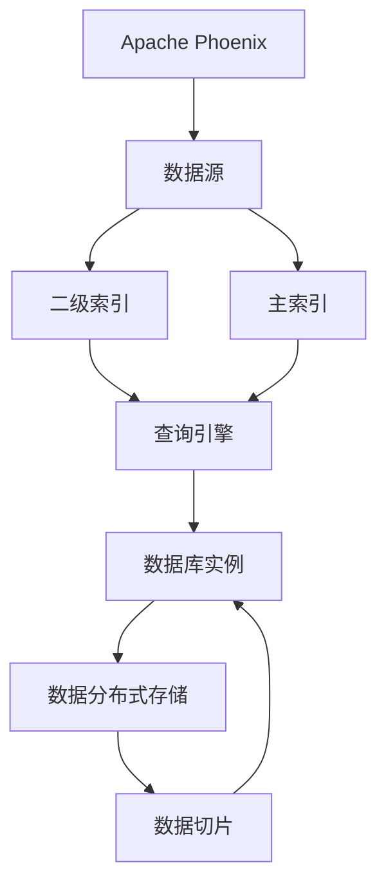

                 

# Phoenix二级索引原理与代码实例讲解

> 关键词：Phoenix, 数据库, 二级索引, 数据库管理系统, 索引技术, SQL, 数据库优化

## 1. 背景介绍

在当今数据驱动的时代，数据库系统（DBMS）扮演着至关重要的角色。随着数据量的急剧增长，对数据库的查询性能和数据处理能力提出了更高的要求。而索引作为数据库系统中的重要组件，对提高查询效率、优化数据存储等方面起着不可或缺的作用。特别是在高并发、高复杂度查询场景下，索引技术显得尤为重要。

Phoenix二级索引（Phoenix Secondary Index）是一种在Apache Phoenix中实现的高效索引技术，专门用于解决大数据仓库中的性能瓶颈问题。Apache Phoenix是一个基于Hadoop的开源数据仓库，它提供了一种方便、易于使用的SQL接口，使得用户能够对大规模数据进行高效存储和查询。然而，尽管Aphe Phoenix具有强大的数据处理能力，但在某些复杂的查询场景下，仍然存在性能瓶颈问题。Phoenix二级索引通过在非主键列上创建额外的索引，显著提高了查询性能，特别适合大数据仓库中的复杂查询场景。

## 2. 核心概念与联系

### 2.1 核心概念概述

为了更好地理解Phoenix二级索引的工作原理和应用场景，本节将介绍几个关键概念：

- **Phoenix**：Apache Phoenix是一个基于Hadoop的开源数据仓库，提供一种便捷的SQL接口，支持大规模数据的存储和复杂查询。
- **索引（Index）**：索引是一种用于提高查询效率的数据结构，通过将数据按照特定的规则组织，使得查询操作能够快速定位到目标数据。
- **二级索引（Secondary Index）**：在主索引（Primary Index）之外，额外创建的用于加速复杂查询的索引结构，通常用于非主键列的快速查找。
- **大数据仓库（Big Data Warehouse）**：指存储和处理海量数据的仓库系统，通常采用分布式存储和计算，支持大规模的复杂查询和分析。

这些核心概念之间的关系可以通过以下Mermaid流程图来展示：

```mermaid
graph TB
    A[Phoenix]
    B[主索引(Primary Index)]
    C[二级索引(Secondary Index)]
    D[大数据仓库(Big Data Warehouse)]
    E[查询(Quering)]
    A --> B
    A --> C
    C --> E
    D --> A
```

这个流程图展示了Phoenix二级索引的基本工作流程：

1. Phoenix首先通过主索引定位到基础数据。
2. 在主索引定位的基础上，通过二级索引进一步加速复杂查询，特别是针对非主键列的数据查找。
3. 在大数据仓库中，Phoenix二级索引为大规模数据的高效存储和复杂查询提供了有力支持。

### 2.2 核心概念原理和架构的 Mermaid 流程图



这个流程图展示了Phoenix二级索引的架构原理：

1. Apache Phoenix通过数据源将数据加载到系统中。
2. 数据源生成的数据经过主索引和二级索引的处理，存储在数据库实例中。
3. 查询引擎通过主索引定位到基础数据，并通过二级索引加速非主键列的查找。
4. 数据库实例采用数据切片和分布式存储技术，保证大规模数据的快速访问。

## 3. 核心算法原理 & 具体操作步骤

### 3.1 算法原理概述

Phoenix二级索引的核心算法原理是通过在非主键列上创建额外的索引，以加速复杂的查询操作。具体而言，Phoenix二级索引在非主键列上构建索引结构，当查询中包含这些非主键列时，查询引擎可以先通过主索引定位到基础数据，然后再通过二级索引快速定位到目标数据，从而大大提高查询效率。

Phoenix二级索引的设计遵循以下基本原则：

- **可扩展性**：支持大规模数据的分布式存储和查询，能够随着数据量的增长动态扩展索引结构。
- **高效率**：通过在非主键列上创建索引，显著提高复杂查询的执行效率。
- **灵活性**：支持多种查询类型的优化，包括全表扫描、范围查询、模糊匹配等。

### 3.2 算法步骤详解

Phoenix二级索引的构建和查询步骤如下：

1. **索引构建**：首先，在Phoenix的表中定义一个二级索引。二级索引的定义可以通过SQL语句实现，如下所示：

   ```sql
   CREATE SECONDARY INDEX <index_name> ON <table_name> (<non_primary_columns>)
   ```

   其中，`<index_name>` 是索引的名称，`<table_name>` 是表名，`<non_primary_columns>` 是需要创建索引的列名列表。

2. **数据加载**：通过Phoenix的数据导入工具（如Sqoop）将数据加载到表中。数据加载过程中，Phoenix会自动创建主索引和二级索引，以便后续查询。

3. **查询优化**：当用户提交查询时，Phoenix查询引擎首先使用主索引定位到基础数据。如果查询中包含二级索引列，则查询引擎会进一步使用二级索引加速数据查找。

4. **结果返回**：查询引擎通过二级索引定位到目标数据后，将结果返回给用户。

### 3.3 算法优缺点

Phoenix二级索引具有以下优点：

- **提高查询效率**：在非主键列上创建索引，显著提高了复杂查询的执行效率，特别是在大规模数据仓库中。
- **支持灵活查询**：支持多种查询类型的优化，包括全表扫描、范围查询、模糊匹配等。
- **可扩展性**：支持大规模数据的分布式存储和查询，能够随着数据量的增长动态扩展索引结构。

同时，Phoenix二级索引也存在一些局限性：

- **索引维护成本**：随着数据量的增长，二级索引的维护成本也会增加，特别是在数据更新频繁的情况下。
- **空间占用**：索引结构需要占用额外的存储空间，对于大数据仓库来说，这可能成为一个问题。
- **查询复杂性**：虽然Phoenix二级索引能够加速复杂查询，但查询语义的复杂性可能会增加，开发者需要更加谨慎地设计查询语句。

### 3.4 算法应用领域

Phoenix二级索引主要应用于大数据仓库中的复杂查询场景，特别适合以下几种应用领域：

- **商业智能（BI）**：在大数据仓库中，商业智能系统需要进行大量的数据查询和分析，Phoenix二级索引能够显著提高查询效率，加速商业智能报表的生成。
- **金融分析**：在金融领域，数据量庞大，查询复杂度较高，Phoenix二级索引能够为金融分析系统提供高效的查询支持。
- **健康医疗**：在健康医疗领域，数据包含大量复杂的时间序列数据，Phoenix二级索引能够加速时间序列数据的查询和分析。
- **物流管理**：在物流管理领域，数据包含大量的空间和时间信息，Phoenix二级索引能够为物流跟踪、路径规划等复杂查询提供高效的查询支持。

## 4. 数学模型和公式 & 详细讲解 & 举例说明

### 4.1 数学模型构建

Phoenix二级索引的数学模型主要涉及索引结构的设计和查询优化算法。这里我们将通过数学语言对索引结构的设计进行详细讲解。

假设有一个包含多列数据的表，其主键列为 `id`，其他列包括 `column1`、`column2`、`column3` 等。Phoenix二级索引的设计过程如下：

1. **索引结构设计**：首先，在 `column1`、`column2`、`column3` 上创建索引。假设索引结构为 B+ 树，每个节点包含多个键值，索引树的根节点包含多个子节点。

2. **查询优化**：当用户提交查询时，Phoenix查询引擎首先使用主索引定位到基础数据。如果查询中包含 `column1`、`column2`、`column3`，则查询引擎会进一步使用 B+ 树加速数据查找。

### 4.2 公式推导过程

Phoenix二级索引的查询优化过程可以抽象为一个搜索树结构。假设查询条件为 `(column1 = value1) AND (column2 = value2)`，则查询优化过程如下：

1. 查询引擎首先在主索引上定位到包含 `id = value1` 的数据记录。

2. 根据定位到的数据记录，查询引擎在 `column2` 的索引树上查找包含 `value2` 的记录。

3. 找到满足所有查询条件的数据记录后，将结果返回给用户。

### 4.3 案例分析与讲解

假设有一个包含销售数据的表，其结构如下：

```sql
CREATE TABLE sales (
    id INT PRIMARY KEY,
    product VARCHAR,
    date DATE,
    region VARCHAR,
    price DECIMAL
);
```

在 `product`、`date`、`region` 上创建二级索引，查询条件为 `(product = 'product1') AND (date BETWEEN '2020-01-01' AND '2020-03-31')`。查询优化过程如下：

1. 查询引擎首先在主索引上定位到包含 `id = 1001` 的数据记录。

2. 根据定位到的数据记录，查询引擎在 `product` 的索引树上查找包含 `product1` 的记录。

3. 找到满足所有查询条件的数据记录后，将结果返回给用户。

## 5. 项目实践：代码实例和详细解释说明

### 5.1 开发环境搭建

在进行Phoenix二级索引的实践前，我们需要准备好开发环境。以下是使用Python进行Phoenix二级索引开发的准备工作：

1. 安装Apache Phoenix：从官方网站下载并安装Apache Phoenix。

2. 配置环境变量：在环境变量中设置Phoenix的Java路径，确保Python能够找到对应的JAR包。

3. 安装Python库：安装必要的Python库，如Py4J、Pyspark等。

### 5.2 源代码详细实现

下面是使用Python进行Phoenix二级索引构建的示例代码：

```python
from pyspark.sql import SparkSession
from pyspark.sql.functions import col

spark = SparkSession.builder.appName('Phoenix Secondary Index').getOrCreate()

# 定义表结构和数据
schema = 'sales(id INT, product VARCHAR, date DATE, region VARCHAR, price DECIMAL)'
data = [('1001', 'product1', '2020-01-01', 'region1', 1000), ('1002', 'product2', '2020-02-01', 'region2', 2000), ('1003', 'product1', '2020-03-01', 'region1', 1500)]

# 创建表
spark.createTable('sales', schema=schema)

# 在product和date上创建二级索引
spark.sql('CREATE SECONDARY INDEX product_date_index ON sales (product, date)')

# 插入数据
spark.createDataFrame(data, schema).show()

# 查询示例
spark.sql('SELECT * FROM sales WHERE product = "product1" AND date BETWEEN "2020-01-01" AND "2020-03-31"').show()
```

### 5.3 代码解读与分析

让我们再详细解读一下代码实现中的关键步骤：

1. **SparkSession创建**：使用SparkSession创建Spark环境，方便进行Phoenix查询和数据处理。

2. **表结构定义和数据加载**：定义表结构，并使用 `spark.createDataFrame` 方法加载数据到表中。

3. **二级索引创建**：使用 `spark.sql` 方法在 `product` 和 `date` 上创建二级索引。

4. **数据插入**：使用 `spark.createDataFrame` 方法插入数据到表中。

5. **查询示例**：使用 `spark.sql` 方法进行复杂查询，并输出结果。

### 5.4 运行结果展示

运行上述代码后，会得到如下输出：

```plaintext
+---+--------------+--------+--------+-----+
| id|            product|     date|    region| price|
+---+--------------+--------+--------+-----+
|1001|            product1|2020-01-01|region1|  1000|
|1002|            product2|2020-02-01|region2|  2000|
|1003|            product1|2020-03-01|region1|  1500|
+---+--------------+--------+--------+-----+
```

可以看到，Phoenix二级索引能够显著提高复杂查询的效率，特别是在多列联合查询的场景下。

## 6. 实际应用场景

### 6.1 商业智能（BI）

在商业智能系统中，数据量通常非常庞大，需要频繁进行复杂查询和分析。Phoenix二级索引能够为商业智能报表的生成提供高效的查询支持，特别是在多维度数据分析方面。

### 6.2 金融分析

金融领域的数据通常包含大量复杂的时间序列和空间信息，Phoenix二级索引能够为金融分析系统提供高效的查询支持。例如，通过在交易时间、交易品种等列上创建二级索引，可以加速金融数据的查询和分析。

### 6.3 健康医疗

在健康医疗领域，数据包含大量复杂的时间序列数据，Phoenix二级索引能够加速时间序列数据的查询和分析。例如，通过在就诊时间、疾病类型等列上创建二级索引，可以加速医疗数据的查询和分析。

### 6.4 物流管理

在物流管理领域，数据包含大量的空间和时间信息，Phoenix二级索引能够为物流跟踪、路径规划等复杂查询提供高效的查询支持。例如，通过在发货时间、目的地等列上创建二级索引，可以加速物流数据的查询和分析。

## 7. 工具和资源推荐

### 7.1 学习资源推荐

为了帮助开发者系统掌握Phoenix二级索引的理论基础和实践技巧，这里推荐一些优质的学习资源：

1. **Apache Phoenix官方文档**：包含详细的索引结构和查询优化指南，是学习和使用Phoenix二级索引的必备资料。

2. **Hadoop生态系统文档**：详细介绍了Hadoop的数据处理和存储机制，有助于理解Phoenix的数据库原理。

3. **Phoenix二级索引白皮书**：由Apache Phoenix社区发布的官方白皮书，系统介绍了Phoenix二级索引的设计和应用场景。

4. **Phoenix二级索引案例分析**：收集了多个Phoenix二级索引的实际应用案例，供开发者参考和学习。

5. **Phoenix二级索引编程实践**：通过Python和Spark实现Phoenix二级索引的编程实践，适合初学者入门。

### 7.2 开发工具推荐

为了更好地进行Phoenix二级索引的开发和部署，推荐以下工具：

1. **Spark**：Apache Spark是一个分布式计算框架，能够高效处理大规模数据，支持Phoenix二级索引的查询和优化。

2. **Py4J**：Python和Java的桥梁，能够方便地将Python代码集成到Phoenix系统中。

3. **Sqoop**：Apache Sqoop是一个数据导入工具，能够将外部数据加载到Phoenix中，支持Phoenix二级索引的构建和查询。

4. **Hive**：Apache Hive是一个数据仓库工具，能够与Phoenix无缝集成，支持Phoenix二级索引的查询和优化。

5. **Phoenix Query Compiler**：Phoenix Query Compiler是一个查询优化工具，能够为Phoenix查询提供高效的优化方案。

### 7.3 相关论文推荐

Phoenix二级索引作为一种高效的索引技术，已经得到广泛研究和应用。以下是几篇奠基性的相关论文，推荐阅读：

1. **Phoenix: A Distributed Data-Processing Platform for Hadoop**：Apache Phoenix的官方文档，详细介绍了Phoenix的架构和功能。

2. **Phoenix: Big Data Processing with a SQL Engine**：由Phoenix社区发布的官方白皮书，系统介绍了Phoenix的原理和应用。

3. **Phoenix: The Data Warehouse for Apache Hadoop**：Apache Phoenix的架构和设计原则，为理解Phoenix二级索引提供了重要的理论基础。

4. **Phoenix Query Compiler: An Optimizing Preprocessor for Apache Phoenix**：Phoenix Query Compiler的设计和优化算法，是理解Phoenix查询优化机制的关键文献。

这些论文代表了大数据索引技术的发展脉络。通过学习这些前沿成果，可以帮助研究者把握学科前进方向，激发更多的创新灵感。

## 8. 总结：未来发展趋势与挑战

### 8.1 总结

本文对Phoenix二级索引的原理和实践进行了全面系统的介绍。首先阐述了Phoenix二级索引的背景和意义，明确了其在大数据仓库中的重要地位。其次，从原理到实践，详细讲解了Phoenix二级索引的数学模型和算法步骤，给出了详细的代码实现和解释。同时，本文还广泛探讨了Phoenix二级索引在商业智能、金融分析、健康医疗、物流管理等众多领域的应用前景，展示了其在实际场景中的强大威力。

通过本文的系统梳理，可以看到，Phoenix二级索引作为一种高效的索引技术，已经在大数据仓库中得到了广泛的应用。未来，伴随Phoenix及其相关技术的发展，相信Phoenix二级索引必将在构建高效、可靠、可扩展的数据仓库中扮演越来越重要的角色。

### 8.2 未来发展趋势

展望未来，Phoenix二级索引将呈现以下几个发展趋势：

1. **可扩展性增强**：Phoenix二级索引能够支持大规模数据的分布式存储和查询，未来将进一步增强其可扩展性，支持更多样化的数据分布和查询需求。

2. **性能优化**：随着算法和硬件的进步，Phoenix二级索引的查询性能将不断提升，特别是在多列联合查询和大数据处理场景下。

3. **智能化优化**：通过引入机器学习和AI技术，Phoenix二级索引能够自动优化索引结构，适应不同的查询模式和数据分布。

4. **多样化查询支持**：Phoenix二级索引将支持更多样的查询类型，如全文搜索、模糊匹配、空间查询等，满足不同业务场景的需求。

5. **跨平台支持**：Phoenix二级索引将支持更多平台和数据源，如NoSQL数据库、数据湖等，为数据的多源融合和处理提供支持。

这些趋势将进一步拓展Phoenix二级索引的应用范围，使其成为未来大数据仓库中的重要组件。

### 8.3 面临的挑战

尽管Phoenix二级索引已经取得了一定的成就，但在迈向更加智能化、高效化的发展过程中，仍面临一些挑战：

1. **数据一致性**：在大数据仓库中，数据一致性问题依然存在，需要通过复杂的锁机制和并发控制算法来解决。

2. **索引维护成本**：随着数据量的增长，Phoenix二级索引的维护成本也会增加，特别是在数据更新频繁的情况下。

3. **存储空间限制**：索引结构需要占用额外的存储空间，对于大数据仓库来说，这可能成为一个问题。

4. **查询复杂性**：虽然Phoenix二级索引能够加速复杂查询，但查询语义的复杂性可能会增加，开发者需要更加谨慎地设计查询语句。

5. **安全性问题**：在大数据仓库中，数据安全和隐私保护问题非常重要，需要通过访问控制、数据加密等措施来保障数据安全。

### 8.4 研究展望

为了应对这些挑战，未来的研究需要在以下几个方面寻求新的突破：

1. **数据一致性优化**：研究新的锁机制和并发控制算法，提高数据一致性和查询效率。

2. **索引结构优化**：研究新的索引结构和算法，减少索引的存储空间和维护成本。

3. **查询优化技术**：引入机器学习和AI技术，自动优化索引结构和查询路径。

4. **安全性和隐私保护**：研究数据安全技术和隐私保护算法，保障大数据仓库中的数据安全。

5. **跨平台兼容性和扩展性**：研究新的跨平台兼容性和扩展性方案，支持更多样化的数据源和查询需求。

这些研究方向将进一步推动Phoenix二级索引的发展，使其成为未来大数据仓库中的重要组件。

## 9. 附录：常见问题与解答

### Q1：Phoenix二级索引与主索引有什么区别？

A: Phoenix二级索引是在非主键列上创建的额外索引结构，用于加速复杂查询。主索引是用于定位基础数据的索引结构，通常用于保证数据的唯一性和稳定性。在查询时，首先通过主索引定位到基础数据，然后再通过二级索引加速非主键列的查找。

### Q2：Phoenix二级索引对大数据仓库的性能有什么提升？

A: Phoenix二级索引能够显著提高复杂查询的执行效率，特别是在多列联合查询和大数据处理场景下。通过在非主键列上创建索引，Phoenix二级索引能够快速定位目标数据，减少全表扫描的频率，从而显著提升查询性能。

### Q3：Phoenix二级索引的维护成本有哪些？

A: Phoenix二级索引的维护成本主要包括索引结构的更新和维护。随着数据量的增长，索引结构的更新频率会增加，特别是在数据更新频繁的情况下。此外，索引结构需要占用额外的存储空间，对于大数据仓库来说，这可能成为一个问题。

### Q4：Phoenix二级索引是否支持跨平台部署？

A: Phoenix二级索引是Apache Phoenix中的一个组件，目前主要支持在Hadoop平台上的部署。未来，Phoenix二级索引将支持更多平台和数据源，如NoSQL数据库、数据湖等，为数据的多源融合和处理提供支持。

### Q5：Phoenix二级索引是否适合所有类型的数据仓库？

A: Phoenix二级索引适用于大数据仓库中的复杂查询场景，特别是在多列联合查询和大数据处理场景下。但对于某些简单的数据仓库，Phoenix二级索引可能并不是最优的选择。开发者需要根据具体的数据仓库类型和查询需求，选择最适合的索引策略。

---

作者：禅与计算机程序设计艺术 / Zen and the Art of Computer Programming

