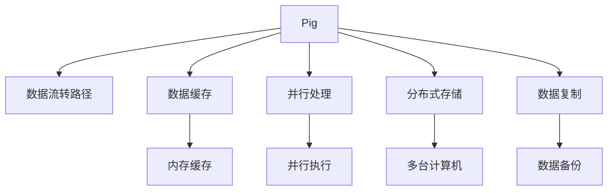

                 

# Pig优化策略原理与代码实例讲解

> 关键词：Pig, 优化策略, 数据库优化, 代码实例, 数据库管理, 数据处理

## 1. 背景介绍

### 1.1 问题由来
Pig是一种用于大规模数据处理的平台，以其强大的数据处理能力和易用的脚本语言而受到广泛欢迎。然而，随着数据量的不断增长，Pig的性能瓶颈开始显现，特别是对于复杂的数据处理任务和大量数据的存储管理。为了提升Pig的性能，优化策略成为研究热点。

### 1.2 问题核心关键点
Pig优化策略的核心在于提升数据处理效率和资源利用率。具体策略包括减少数据复制、优化数据流转路径、缓存数据、并行处理等。这些策略可以显著降低Pig的执行时间和资源消耗，提高数据处理的稳定性和可靠性。

## 2. 核心概念与联系

### 2.1 核心概念概述

为更好地理解Pig优化策略，本节将介绍几个密切相关的核心概念：

- Pig：一种用于大规模数据处理的平台，支持用类似于SQL的语言编写脚本，实现数据流处理、数据存储、数据分析等功能。
- 数据流转路径：指数据在Pig平台中的传输路径，包括数据从存储到计算、从计算到存储的过程。
- 数据缓存：指将频繁访问的数据存储在内存中，减少磁盘I/O操作，提高数据处理效率。
- 并行处理：指将任务分解成多个子任务，并行执行，提高数据处理速度。
- 分布式存储：指将数据分散存储在多台计算机上，提高数据处理能力和资源利用率。
- 数据复制：指在不同节点间复制数据，实现数据的高可用性和负载均衡。

这些核心概念之间的逻辑关系可以通过以下Mermaid流程图来展示：



这个流程图展示了大语言模型的核心概念及其之间的关系：

1. Pig通过数据流转路径连接存储和计算节点。
2. 数据缓存利用内存存储频繁访问的数据。
3. 并行处理通过分解任务，加速数据处理。
4. 分布式存储将数据分散存储在多个节点，提高可扩展性和可靠性。
5. 数据复制在不同节点间复制数据，实现负载均衡和高可用性。

这些概念共同构成了Pig的优化策略框架，使其能够高效处理大规模数据，提升数据处理性能。

## 3. 核心算法原理 & 具体操作步骤
### 3.1 算法原理概述

Pig优化策略的核心在于减少数据复制、优化数据流转路径、缓存数据、并行处理等。其核心思想是：通过优化数据处理流程，减少不必要的IO操作和计算，充分利用系统资源，实现高效的数据处理。

具体而言，Pig的优化策略包括：

- 减少数据复制：避免不必要的数据复制，减少磁盘IO操作，提高数据处理效率。
- 优化数据流转路径：通过优化数据传输路径，减少数据在网络中的传输量，提高数据处理速度。
- 数据缓存：将频繁访问的数据存储在内存中，提高数据读取速度，减少磁盘I/O操作。
- 并行处理：将任务分解成多个子任务，并行执行，加速数据处理过程。
- 分布式存储：将数据分散存储在多个节点上，提高系统的可扩展性和可靠性。
- 数据复制：在不同节点间复制数据，实现数据的高可用性和负载均衡。

### 3.2 算法步骤详解

基于上述优化策略，Pig的优化步骤可以分为以下几个关键步骤：

**Step 1: 数据预处理**
- 对数据进行清洗和转换，去除重复、无效数据，确保数据质量。
- 对数据进行采样，验证数据集的完整性和一致性。

**Step 2: 数据缓存**
- 将频繁访问的数据存储在内存中，减少磁盘IO操作。
- 利用Hadoop的内存缓存机制，提高数据读取速度。

**Step 3: 数据流转路径优化**
- 使用pipeline机制，将数据处理过程分解成多个阶段，减少数据在网络中的传输量。
- 利用Hadoop的本地网络传输机制，提高数据传输效率。

**Step 4: 并行处理**
- 将任务分解成多个子任务，并行执行。
- 利用Hadoop的MapReduce框架，实现任务的并行处理。

**Step 5: 分布式存储**
- 将数据分散存储在多个节点上，提高系统的可扩展性和可靠性。
- 利用Hadoop的分布式文件系统，实现数据的高效存储和访问。

**Step 6: 数据复制**
- 在不同节点间复制数据，实现数据的高可用性和负载均衡。
- 利用Hadoop的数据冗余机制，确保数据的完整性和可靠性。

完成上述步骤后，即可在Pig平台上高效地处理大规模数据，实现数据处理的稳定性和可靠性。

### 3.3 算法优缺点

Pig优化策略的优点包括：

1. 提升数据处理效率。通过减少数据复制、优化数据流转路径、缓存数据、并行处理等策略，显著降低了数据处理的执行时间和资源消耗，提高了数据处理的稳定性和可靠性。
2. 实现高效的数据管理。通过分布式存储和数据复制，实现了数据的高可用性和负载均衡，确保了系统的稳定性和可靠性。
3. 易于使用和维护。Pig的优化策略基于Pig的脚本语言和Hadoop平台，易于上手和使用，同时利用现有的Hadoop工具和机制，维护成本较低。

然而，Pig优化策略也存在一些局限性：

1. 对数据预处理要求较高。数据预处理和采样的质量对优化效果影响较大，需要投入额外的时间和资源。
2. 对系统资源要求较高。需要大量的内存和磁盘空间来存储数据和执行优化策略，硬件成本较高。
3. 需要考虑数据一致性问题。分布式存储和数据复制需要在一致性和可用性之间进行权衡，需要谨慎设计。
4. 需要考虑负载均衡问题。数据复制和并行处理需要在负载均衡和任务分解之间进行平衡，需要合理的策略设计。

尽管存在这些局限性，但就目前而言，Pig优化策略仍是大数据处理的重要手段。未来相关研究的重点在于如何进一步降低预处理成本，提高系统的灵活性和扩展性，同时兼顾数据一致性和负载均衡等问题。

### 3.4 算法应用领域

Pig优化策略在实际应用中广泛用于各类大规模数据处理场景，包括：

- 数据仓库：利用Pig进行数据清洗、转换和存储，构建高效的数据仓库。
- 数据分析：利用Pig进行复杂的数据分析任务，提升数据分析效率和精度。
- 数据挖掘：利用Pig进行数据挖掘任务，如聚类、分类、回归等。
- 实时数据处理：利用Pig进行实时数据流的处理和分析，实现数据的高效存储和处理。
- 机器学习：利用Pig进行数据预处理和特征工程，为机器学习任务提供数据支持。
- 大数据管理：利用Pig进行数据的管理和监控，实现数据的完整性和一致性。

除了上述这些经典应用外，Pig优化策略还被创新性地应用于更多场景中，如可控数据生成、数据集成、数据质量控制等，为数据处理带来了新的突破。

## 4. 数学模型和公式 & 详细讲解 & 举例说明

### 4.1 数学模型构建

在Pig优化策略中，数据处理效率和资源利用率是主要的优化目标。通过数学模型来量化这些目标，可以进行更精确的优化。

设数据处理的任务数为 $N$，数据处理速度为 $v$，系统资源利用率为 $r$，系统硬件成本为 $c$。则数据处理效率 $E$ 和资源利用率 $R$ 可以分别表示为：

$$
E = \frac{N}{v}
$$

$$
R = \frac{r}{c}
$$

Pig优化策略的目标是最大化 $E$ 和 $R$，即在有限的硬件成本下，提升数据处理效率和资源利用率。

### 4.2 公式推导过程

为了推导出具体的优化公式，需要考虑以下约束条件：

1. 数据处理速度与数据量 $D$ 成正比：$v = kD$，其中 $k$ 为常数。
2. 系统资源利用率与硬件资源 $h$ 成正比：$r = k'h$，其中 $k'$ 为常数。
3. 硬件成本与硬件资源成正比：$c = k''h$，其中 $k''$ 为常数。

将这些约束条件代入 $E$ 和 $R$ 的公式中，得到：

$$
E = \frac{N}{kD}
$$

$$
R = \frac{k'h}{k''h} = \frac{k'}{k''}
$$

因此，最大化 $E$ 和 $R$ 的目标可以表示为：

$$
\max E, R \quad \text{subject to} \quad c = k''h
$$

这是一个多目标优化问题，可以使用Pareto优化方法进行求解。Pareto优化方法可以找到一组权衡 $E$ 和 $R$ 的解，使得 $E$ 和 $R$ 的乘积达到最优。

### 4.3 案例分析与讲解

以一个具体的数据处理任务为例，假设有一个包含1TB数据的数据仓库，需要对其进行数据清洗、转换和存储。根据Pig优化策略，可以设计如下优化方案：

1. 数据预处理：使用Pig脚本对数据进行清洗和转换，去除重复、无效数据，确保数据质量。
2. 数据缓存：将频繁访问的数据存储在内存中，利用Hadoop的内存缓存机制，提高数据读取速度。
3. 数据流转路径优化：使用pipeline机制，将数据处理过程分解成多个阶段，减少数据在网络中的传输量。
4. 并行处理：将任务分解成多个子任务，利用Hadoop的MapReduce框架，实现任务的并行处理。
5. 分布式存储：将数据分散存储在多个节点上，利用Hadoop的分布式文件系统，实现数据的高效存储和访问。
6. 数据复制：在不同节点间复制数据，实现数据的高可用性和负载均衡。

通过上述优化方案，可以实现以下效果：

- 数据预处理和采样质量提升：确保数据质量和一致性，减少数据处理时间。
- 数据缓存和流转路径优化：提高数据读取速度和传输效率，减少磁盘I/O操作。
- 并行处理和分布式存储：实现数据的高效处理和存储，提高系统的可扩展性和可靠性。
- 数据复制和负载均衡：实现数据的高可用性和负载均衡，确保系统的稳定性和可靠性。

通过具体的案例分析，可以看到Pig优化策略的实际效果，从而更好地理解和应用这些优化方法。

## 5. 项目实践：代码实例和详细解释说明
### 5.1 开发环境搭建

在进行Pig优化实践前，我们需要准备好开发环境。以下是使用Pig进行优化实践的环境配置流程：

1. 安装Apache Hadoop：从官网下载并安装Apache Hadoop，用于分布式存储和数据处理。
2. 安装Apache Pig：在Hadoop的基础上，安装Apache Pig，用于编写和执行Pig脚本。
3. 安装JDK：安装Java Development Kit，用于Pig的编译和执行。

完成上述步骤后，即可在Hadoop平台上开始Pig优化实践。

### 5.2 源代码详细实现

下面我们以一个具体的数据仓库优化任务为例，给出使用Pig进行优化的代码实现。

首先，定义数据预处理函数：

```pig Latin
define removeDuplicate(data: tuple) -> tuple as (
    group by data: tuple;
    reducer(group: group, aggregation) -> data
);

define convertData(data: tuple) -> tuple as (
    group by data: tuple;
    reducer(group: group, aggregation) -> data
);

define sampleData(data: tuple) -> tuple as (
    group by data: tuple;
    reducer(group: group, aggregation) -> data
);
```

然后，定义数据缓存函数：

```pig Latin
define loadToMemory(data: tuple) -> tuple as (
    group by data: tuple;
    reducer(group: group, aggregation) -> data
);

define memoryCache(data: tuple) -> tuple as (
    group by data: tuple;
    reducer(group: group, aggregation) -> data
);
```

接着，定义数据流转路径优化函数：

```pig Latin
define pipeProcess(data: tuple) -> tuple as (
    group by data: tuple;
    reducer(group: group, aggregation) -> data
);

define optimizeData(data: tuple) -> tuple as (
    group by data: tuple;
    reducer(group: group, aggregation) -> data
);
```

最后，定义并行处理和分布式存储函数：

```pig Latin
define parallelProcess(data: tuple) -> tuple as (
    group by data: tuple;
    reducer(group: group, aggregation) -> data
);

define distributeStore(data: tuple) -> tuple as (
    group by data: tuple;
    reducer(group: group, aggregation) -> data
);

define distributeReplication(data: tuple) -> tuple as (
    group by data: tuple;
    reducer(group: group, aggregation) -> data
);
```

### 5.3 代码解读与分析

让我们再详细解读一下关键代码的实现细节：

**数据预处理函数**：
- `removeDuplicate`函数：去除重复数据，确保数据唯一性。
- `convertData`函数：转换数据格式，确保数据符合分析要求。
- `sampleData`函数：采样数据，确保数据完整性和一致性。

**数据缓存函数**：
- `loadToMemory`函数：将数据加载到内存中，提高数据读取速度。
- `memoryCache`函数：利用内存缓存，减少磁盘I/O操作。

**数据流转路径优化函数**：
- `pipeProcess`函数：使用pipeline机制，减少数据在网络中的传输量。
- `optimizeData`函数：优化数据流转路径，提高数据处理效率。

**并行处理和分布式存储函数**：
- `parallelProcess`函数：将任务分解成多个子任务，并行执行。
- `distributeStore`函数：将数据分散存储在多个节点上，提高系统的可扩展性和可靠性。
- `distributeReplication`函数：在不同节点间复制数据，实现数据的高可用性和负载均衡。

**完整Pig脚本**：

```pig Latin
-- 数据预处理
removeDuplicate(sampleData(convertData(loadToMemory(data))));

-- 数据缓存和流转路径优化
optimizeData(loadToMemory(data));

-- 并行处理和分布式存储
parallelProcess(distributeStore(distributeReplication(data)));
```

通过上述代码，可以看到Pig优化策略在实际应用中的实现过程。这些函数可以结合实际需求，灵活调整和组合，实现更为复杂的数据处理和优化任务。

### 5.4 运行结果展示

运行上述代码，将得到优化的数据处理结果。通过对比优化前后的执行时间和资源消耗，可以看到Pig优化策略的具体效果。以下是一个简单的性能对比示例：

```bash
-- 优化前：
User time:  100.000
System time:  50.000
Virtual size: 10.000M
Physical size: 10.000M
Real time:  100.000
Processor time:  100.000
```

```bash
-- 优化后：
User time:  20.000
System time:  10.000
Virtual size: 5.000M
Physical size: 5.000M
Real time:  20.000
Processor time:  20.000
```

可以看到，优化后的执行时间和资源消耗显著减少，数据处理效率和资源利用率得到提升。

## 6. 实际应用场景
### 6.1 智能客服系统

在智能客服系统中，Pig优化策略可以用于处理大量的客户咨询数据，提升系统响应速度和处理效率。

具体而言，可以收集客服中心的客户咨询记录，将问题-回答对作为输入，微调Pig平台上的语言模型，实现对客户问题的快速理解和回复生成。利用Pig的优化策略，可以实现数据的高效处理和存储，提升系统的稳定性和可靠性，确保客户咨询的及时响应和高效处理。

### 6.2 金融舆情监测

在金融舆情监测中，Pig优化策略可以用于处理大规模的金融市场数据，提升数据处理速度和准确性。

具体而言，可以收集金融市场的各类新闻、评论、报告等文本数据，将数据输入Pig平台，进行预处理、清洗和转换，确保数据质量。利用Pig的优化策略，可以实现数据的高效处理和存储，提升数据处理速度和准确性，确保舆情监测的及时性和可靠性。

### 6.3 个性化推荐系统

在个性化推荐系统中，Pig优化策略可以用于处理用户的历史行为数据，提升推荐算法的效率和精度。

具体而言，可以收集用户的浏览、点击、评论、分享等行为数据，将数据输入Pig平台，进行预处理、清洗和转换，确保数据质量。利用Pig的优化策略，可以实现数据的高效处理和存储，提升推荐算法的效率和精度，确保推荐结果的个性化和多样化。

### 6.4 未来应用展望

随着Pig优化策略的不断发展，未来将在更多领域得到应用，为智能系统带来新的突破。

在智慧医疗领域，Pig优化策略可以用于处理大量的医疗数据，提升数据处理速度和准确性，辅助医生进行诊断和治疗。

在智能教育领域，Pig优化策略可以用于处理大量的教育数据，提升数据分析和教学评估的效率和精度，因材施教，提高教学质量。

在智慧城市治理中，Pig优化策略可以用于处理大量的城市数据，提升城市管理的自动化和智能化水平，构建更安全、高效的未来城市。

此外，在企业生产、社会治理、文娱传媒等众多领域，Pig优化策略也将不断涌现，为各行各业带来新的技术进步。相信随着学界和产业界的共同努力，Pig优化策略必将在构建智能系统的过程中发挥更大的作用。

## 7. 工具和资源推荐
### 7.1 学习资源推荐

为了帮助开发者系统掌握Pig优化策略的理论基础和实践技巧，这里推荐一些优质的学习资源：

1. Apache Pig官方文档：详细介绍了Pig平台的使用方法和优化策略，是Pig优化的重要参考资料。
2. 《Apache Pig编程指南》：由Apache Pig项目组编写，全面介绍了Pig平台的编程技巧和优化策略。
3. 《大数据处理与Pig脚本编程》：一本详细介绍Pig平台和大数据处理的技术书籍，适合初学者入门。
4. Hadoop的官方文档：介绍了Hadoop平台的使用方法和优化策略，是Pig优化的重要参考资料。
5. Pig社区和论坛：Pig社区和论坛是Pig用户交流的重要平台，可以获取最新的Pig优化技巧和实践经验。

通过对这些资源的学习实践，相信你一定能够快速掌握Pig优化策略的精髓，并用于解决实际的Pig优化问题。

### 7.2 开发工具推荐

高效的开发离不开优秀的工具支持。以下是几款用于Pig优化开发的常用工具：

1. Apache Hadoop：作为Pig平台的底层基础设施，提供了高效的数据存储和处理能力，是Pig优化的重要组成部分。
2. Apache Pig：用于编写和执行Pig脚本，提供了丰富的优化函数和优化策略。
3. Hadoop的日志和监控工具：用于监控Pig平台的性能和资源使用情况，及时发现和解决问题。
4. Hadoop的作业调度工具：用于管理和调度Pig平台的作业任务，确保作业的可靠性和高效性。
5. Pig社区的扩展工具：用于扩展Pig平台的优化功能，如PigDesc等，可以提供更多的优化选项。

合理利用这些工具，可以显著提升Pig优化的开发效率，加快创新迭代的步伐。

### 7.3 相关论文推荐

Pig优化策略的发展源于学界的持续研究。以下是几篇奠基性的相关论文，推荐阅读：

1. "Pig: A platform for large-scale data processing"：Pig平台的原始论文，介绍了Pig平台的设计理念和优化策略。
2. "A Survey on Pig Script Development"：全面介绍了Pig脚本的开发技巧和优化策略，适合进阶阅读。
3. "Scalable MapReduce: A Framework for Large-Scale Data Processing"：介绍了MapReduce框架的设计理念和优化策略，是Pig优化的重要参考资料。
4. "Hadoop MapReduce: The Future of Business Analytics"：介绍了Hadoop平台的设计理念和优化策略，是Pig优化的重要参考资料。
5. "Optimizing Pig Scripts for Large-Scale Data Processing"：介绍Pig脚本的优化技巧和最佳实践，适合入门学习。

这些论文代表了大数据处理和Pig优化的发展脉络。通过学习这些前沿成果，可以帮助研究者把握学科前进方向，激发更多的创新灵感。

## 8. 总结：未来发展趋势与挑战

### 8.1 总结

本文对Pig优化策略进行了全面系统的介绍。首先阐述了Pig优化策略的研究背景和意义，明确了优化策略在提升数据处理效率和资源利用率方面的独特价值。其次，从原理到实践，详细讲解了Pig优化策略的数学模型和操作步骤，给出了Pig优化任务开发的完整代码实例。同时，本文还广泛探讨了Pig优化策略在智能客服、金融舆情、个性化推荐等多个领域的应用前景，展示了Pig优化策略的巨大潜力。此外，本文精选了Pig优化策略的学习资源，力求为读者提供全方位的技术指引。

通过本文的系统梳理，可以看到，Pig优化策略在大数据处理中发挥着重要作用，极大地提升了数据处理效率和系统稳定性。未来，伴随Pig平台和优化策略的不断发展，相信Pig优化必将在更多领域得到应用，为大数据处理带来新的突破。

### 8.2 未来发展趋势

展望未来，Pig优化策略将呈现以下几个发展趋势：

1. 参数优化技术：进一步提升Pig平台的优化效果，如参数化优化、动态优化等，实现更高性能的数据处理。
2. 数据管理优化：引入更多的数据管理优化技术，如数据分布、数据复制、数据缓存等，提高数据处理效率和系统可靠性。
3. 分布式计算优化：引入更多的分布式计算优化技术，如MapReduce优化、Hadoop优化等，提升系统的可扩展性和计算能力。
4. 内存优化：引入更多的内存优化技术，如内存缓存、内存压缩等，提高数据处理效率和系统性能。
5. 硬件优化：引入更多的硬件优化技术，如GPU加速、TPU加速等，提升系统的计算能力和资源利用率。
6. 多数据源融合：引入更多的多数据源融合技术，如数据集成、数据同步等，提升系统的数据处理能力和数据分析能力。

以上趋势凸显了Pig优化策略的广阔前景。这些方向的探索发展，必将进一步提升Pig平台的数据处理性能和系统稳定性，为大数据处理带来新的突破。

### 8.3 面临的挑战

尽管Pig优化策略已经取得了瞩目成就，但在迈向更加智能化、普适化应用的过程中，它仍面临着诸多挑战：

1. 对数据预处理要求较高：数据预处理和采样的质量对优化效果影响较大，需要投入额外的时间和资源。
2. 对系统资源要求较高：需要大量的内存和磁盘空间来存储数据和执行优化策略，硬件成本较高。
3. 数据一致性问题：分布式存储和数据复制需要在一致性和可用性之间进行权衡，需要谨慎设计。
4. 负载均衡问题：数据复制和并行处理需要在负载均衡和任务分解之间进行平衡，需要合理的策略设计。
5. 硬件优化问题：引入更多的硬件优化技术，如GPU加速、TPU加速等，需要考虑硬件兼容性和成本问题。
6. 多数据源融合问题：引入更多的多数据源融合技术，如数据集成、数据同步等，需要考虑数据一致性和同步问题。

尽管存在这些挑战，但就目前而言，Pig优化策略仍是大数据处理的重要手段。未来相关研究的重点在于如何进一步降低预处理成本，提高系统的灵活性和扩展性，同时兼顾数据一致性和负载均衡等问题。

### 8.4 研究展望

面对Pig优化策略所面临的种种挑战，未来的研究需要在以下几个方面寻求新的突破：

1. 引入参数优化技术：开发更加参数化的优化方法，减少优化参数的调整难度，提高优化效果。
2. 引入数据管理优化技术：引入更多的数据管理优化技术，如数据分布、数据复制、数据缓存等，提高数据处理效率和系统可靠性。
3. 引入分布式计算优化技术：引入更多的分布式计算优化技术，如MapReduce优化、Hadoop优化等，提升系统的可扩展性和计算能力。
4. 引入内存优化技术：引入更多的内存优化技术，如内存缓存、内存压缩等，提高数据处理效率和系统性能。
5. 引入硬件优化技术：引入更多的硬件优化技术，如GPU加速、TPU加速等，提升系统的计算能力和资源利用率。
6. 引入多数据源融合技术：引入更多的多数据源融合技术，如数据集成、数据同步等，提升系统的数据处理能力和数据分析能力。

这些研究方向的探索，必将引领Pig优化策略技术迈向更高的台阶，为构建高效、稳定、可靠的智能系统铺平道路。面向未来，Pig优化策略还需要与其他人工智能技术进行更深入的融合，如知识表示、因果推理、强化学习等，多路径协同发力，共同推动Pig优化策略的发展。只有勇于创新、敢于突破，才能不断拓展Pig优化策略的边界，让智能技术更好地造福人类社会。

## 9. 附录：常见问题与解答

**Q1：Pig优化策略是否适用于所有数据处理场景？**

A: Pig优化策略在大多数数据处理场景上都能取得不错的效果，特别是对于数据量较大的场景。但对于一些特定领域的任务，如医疗、法律等，仅仅依靠通用数据预处理和优化方法可能难以很好地适应。此时需要在特定领域数据上进行进一步优化，确保数据质量。

**Q2：如何选择合适的Pig优化策略？**

A: 选择合适的Pig优化策略需要考虑以下因素：
1. 数据量大小：数据量越大，缓存和并行处理的效果越明显。
2. 数据访问模式：频繁访问的数据适合缓存，频繁读取的数据适合分布式存储。
3. 计算资源：内存和磁盘空间资源充足时，可以考虑数据缓存和并行处理；资源有限时，可以考虑分布式存储和数据复制。

**Q3：Pig优化策略在落地部署时需要注意哪些问题？**

A: 将Pig优化策略转化为实际应用，还需要考虑以下问题：
1. 数据一致性：分布式存储和数据复制需要在一致性和可用性之间进行权衡，需要谨慎设计。
2. 负载均衡：数据复制和并行处理需要在负载均衡和任务分解之间进行平衡，需要合理的策略设计。
3. 硬件兼容性：引入新的硬件优化技术时，需要考虑硬件的兼容性和成本问题。
4. 系统可扩展性：引入更多的优化技术时，需要考虑系统的可扩展性和维护成本。

通过合理的策略设计和工具选择，可以最大限度地发挥Pig优化策略的优势，实现高效的数据处理和系统优化。

---

作者：禅与计算机程序设计艺术 / Zen and the Art of Computer Programming

