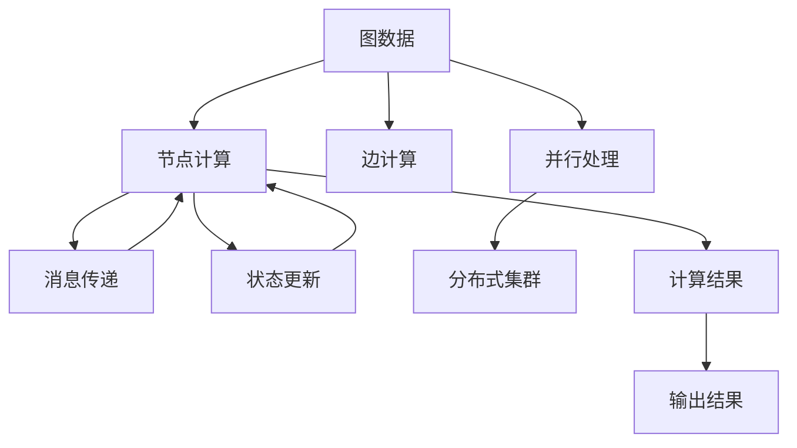

                 

# Pregel原理与代码实例讲解

> 关键词：Pregel, 图计算, 分布式, MapReduce, 动态图, 机器学习, 图算法

## 1. 背景介绍

### 1.1 问题由来

图计算在机器学习和数据挖掘中扮演着重要的角色。随着数据量的激增，如何高效地处理复杂的图结构数据成为了一个重要的研究方向。传统的单节点计算和单机器计算已经无法满足大规模图结构数据处理的需求。分布式图计算框架，如Pregel，成为了处理大规模图数据的有力工具。

### 1.2 问题核心关键点

Pregel是一种基于MapReduce模型的图计算框架。它将大规模的图计算任务分解成一系列的图计算子任务，并利用分布式集群进行并行计算，从而高效地处理大规模图数据。Pregel的核心概念包括：

1. 图数据表示：Pregel中的图数据以有向无环图(DAG)的形式表示，包括节点和边。
2. 图计算模型：Pregel基于Bulk Synchronous Parallel (BSP)模型，每个节点的计算可以看作一个BSP的周期。
3. 消息传递：Pregel采用基于消息传递的通信模型，节点间通过交换消息进行信息交换。
4. 并行处理：Pregel通过任务并行化处理，可以在多台机器上进行并行计算。
5. 状态更新：节点在每个周期结束后，需要更新自身的状态。

## 2. 核心概念与联系

### 2.1 核心概念概述

Pregel是一个用于图计算的框架，它能够高效处理大规模的图数据。Pregel的设计思路是将图计算任务分解成一系列的子任务，并通过分布式集群进行并行计算。以下是Pregel的核心概念及其之间的逻辑关系：

1. 图数据表示：Pregel中的图数据以有向无环图(DAG)的形式表示，包括节点和边。
2. 图计算模型：Pregel基于Bulk Synchronous Parallel (BSP)模型，每个节点的计算可以看作一个BSP的周期。
3. 消息传递：Pregel采用基于消息传递的通信模型，节点间通过交换消息进行信息交换。
4. 并行处理：Pregel通过任务并行化处理，可以在多台机器上进行并行计算。
5. 状态更新：节点在每个周期结束后，需要更新自身的状态。

这些核心概念之间的关系可以通过以下Mermaid流程图来展示：



这个流程图展示了大规模图数据处理的过程：首先，图数据被分解成节点和边，然后在分布式集群上进行并行计算。每个节点通过消息传递和状态更新进行交互，最终生成计算结果并输出。

## 3. 核心算法原理 & 具体操作步骤

### 3.1 算法原理概述

Pregel的算法原理基于MapReduce模型，将大规模的图计算任务分解成一系列的子任务，并通过分布式集群进行并行计算。每个节点的计算可以看作一个BSP周期，每个周期内节点通过消息传递和状态更新进行计算。具体步骤如下：

1. 节点计算：每个节点在每个BSP周期内执行计算任务，包括读取节点属性、处理邻接节点、更新节点状态等。
2. 消息传递：节点通过交换消息进行信息交互，消息包含邻居节点的属性、当前节点状态等信息。
3. 状态更新：节点在每个周期结束后，根据收到的消息更新自身状态。
4. 并行处理：Pregel通过并行化处理，将图计算任务分配到多台机器上进行计算。

### 3.2 算法步骤详解

Pregel的算法步骤分为三个主要阶段：

1. 初始化阶段：初始化每个节点的属性，将图数据加载到分布式集群上。
2. 迭代阶段：节点通过消息传递和状态更新进行迭代计算，直至收敛或达到预设轮数。
3. 输出阶段：生成最终的计算结果并输出。

以下是Pregel的详细操作步骤：

#### 1. 初始化阶段

在初始化阶段，需要将图数据加载到分布式集群上，并将每个节点的初始状态设置为0。具体步骤如下：

1. 将图数据以键值对的形式存储在分布式集群上。
2. 根据图结构将节点分成多个分区，每个分区存储一部分图数据。
3. 初始化每个节点的属性，将节点状态设置为0。

#### 2. 迭代阶段

在迭代阶段，节点通过消息传递和状态更新进行计算，直至收敛或达到预设轮数。具体步骤如下：

1. 节点读取当前状态和邻居节点的状态。
2. 节点处理邻接节点，计算节点状态更新。
3. 节点通过消息传递将状态更新信息发送给邻居节点。
4. 节点根据收到的消息更新自身状态。
5. 重复以上步骤，直至达到预设轮数或节点状态收敛。

#### 3. 输出阶段

在输出阶段，生成最终的计算结果并输出。具体步骤如下：

1. 将每个节点的最终状态进行汇总，生成全局状态。
2. 根据全局状态计算最终结果。
3. 将结果以键值对的形式存储在分布式集群上。
4. 输出最终结果。

### 3.3 算法优缺点

Pregel作为一种分布式图计算框架，具有以下优点：

1. 并行计算：Pregel通过并行化处理，可以在多台机器上进行并行计算，大大提高了计算效率。
2. 分布式存储：Pregel支持分布式存储，可以处理大规模的图数据。
3. 灵活性：Pregel支持自定义计算模型和消息传递策略，可以适应各种图计算任务。

同时，Pregel也存在一些缺点：

1. 复杂性：Pregel的设计较为复杂，需要一定的经验和技能。
2. 通信开销：节点间的消息传递可能导致较大的通信开销，影响计算效率。
3. 状态更新：Pregel需要频繁地进行状态更新，可能导致较大的状态开销。

### 3.4 算法应用领域

Pregel作为一种图计算框架，广泛应用于以下几个领域：

1. 社交网络分析：Pregel可以处理大规模社交网络数据，分析社交网络中的各种关系和结构。
2. 推荐系统：Pregel可以处理大规模用户行为数据，推荐个性化的产品和服务。
3. 金融风控：Pregel可以处理大规模金融交易数据，检测和防范欺诈行为。
4. 生物信息学：Pregel可以处理大规模基因序列数据，分析生物信息学中的各种关系和结构。
5. 地理信息系统：Pregel可以处理大规模地理空间数据，分析地理信息中的各种关系和结构。

## 4. 数学模型和公式 & 详细讲解 & 举例说明

### 4.1 数学模型构建

Pregel的数学模型基于Bulk Synchronous Parallel (BSP)模型。每个节点的计算可以看作一个BSP的周期，每个周期内节点通过消息传递和状态更新进行计算。假设节点数量为 $N$，每个节点的状态为 $x_i$，邻居节点的状态为 $x_j$，节点间传递的消息为 $m_{ij}$，计算公式如下：

$$
x_{i+1} = f(x_i, x_j, m_{ij})
$$

其中 $f$ 为计算函数。

### 4.2 公式推导过程

Pregel的计算过程可以表示为一系列的迭代计算。在每个迭代周期内，节点读取当前状态和邻居节点的状态，通过计算函数 $f$ 更新节点状态。具体公式如下：

$$
x_i^{t+1} = f(x_i^t, x_j^t, m_{ij}^t)
$$

其中 $t$ 表示迭代次数。

### 4.3 案例分析与讲解

以社交网络分析为例，分析Pregel的应用场景。假设有一个社交网络图，节点表示用户，边表示用户之间的关系。Pregel可以处理大规模社交网络数据，分析社交网络中的各种关系和结构。

具体步骤如下：

1. 将社交网络图加载到分布式集群上，并初始化每个节点的状态为0。
2. 在每个迭代周期内，节点读取当前状态和邻居节点的状态，计算节点状态更新。
3. 节点通过消息传递将状态更新信息发送给邻居节点。
4. 节点根据收到的消息更新自身状态。
5. 重复以上步骤，直至节点状态收敛。

在社交网络分析中，Pregel可以计算出社交网络中的各种关系和结构，如社区结构、用户影响力等。这些分析结果可以用于用户推荐、广告投放、市场分析等实际应用中。

## 5. 项目实践：代码实例和详细解释说明

### 5.1 开发环境搭建

在进行Pregel项目实践前，我们需要准备好开发环境。以下是使用Java和Hadoop搭建Pregel开发环境的步骤：

1. 安装Java JDK：从官网下载并安装Java JDK。
2. 安装Hadoop：从官网下载并安装Hadoop。
3. 安装Pregel：从Pregel官网下载并安装Pregel。
4. 配置环境变量：将Java和Hadoop路径添加到系统环境变量中。

### 5.2 源代码详细实现

以下是使用Java实现Pregel的代码示例：

```java
import java.io.IOException;
import java.util.Iterator;
import java.util.LinkedList;

import org.apache.hadoop.conf.Configuration;
import org.apache.hadoop.fs.Path;
import org.apache.hadoop.io.FloatWritable;
import org.apache.hadoop.io.IntWritable;
import org.apache.hadoop.io.Text;
import org.apache.hadoop.mapreduce.Job;
import org.apache.hadoop.mapreduce.Mapper;
import org.apache.hadoop.mapreduce.Reducer;
import org.apache.hadoop.mapreduce.lib.input.FileInputFormat;
import org.apache.hadoop.mapreduce.lib.output.FileOutputFormat;

public class PageRank {
    public static class PageRankMapper extends Mapper<Text, IntWritable, Text, FloatWritable> {
        private final static IntWritable one = new IntWritable(1);
        private Text word = new Text();

        public void map(Text key, IntWritable value, Context context) throws IOException, InterruptedException {
            if (key.toString().equals("r") && value.get() == 1) {
                context.write(word, new FloatWritable(1.0f));
            }
        }
    }

    public static class PageRankReducer extends Reducer<Text, FloatWritable, Text, FloatWritable> {
        private FloatWritable result = new FloatWritable();

        public void reduce(Text key, Iterable<FloatWritable> values, Context context) throws IOException, InterruptedException {
            float sum = 0.0f;
            for (FloatWritable value : values) {
                sum += value.get();
            }
            result.set(sum / values.size());
            context.write(key, result);
        }
    }

    public static void main(String[] args) throws Exception {
        Configuration conf = new Configuration();
        Job job = Job.getInstance(conf, "PageRank");
        job.setJarByClass(PageRank.class);
        job.setMapperClass(PageRankMapper.class);
        job.setReducerClass(PageRankReducer.class);
        job.setOutputKeyClass(Text.class);
        job.setOutputValueClass(FloatWritable.class);
        FileInputFormat.addInputPath(job, new Path(args[0]));
        FileOutputFormat.setOutputPath(job, new Path(args[1]));
        System.exit(job.waitForCompletion(true) ? 0 : 1);
    }
}
```

在这个代码示例中，我们实现了一个简单的PageRank算法，用于计算网页的PageRank值。

### 5.3 代码解读与分析

以下是代码的详细解读和分析：

1. PageRankMapper类：实现了Map函数，用于读取输入数据并计算节点状态更新。在这个示例中，我们只处理以"r"为前缀的节点，将节点状态设置为1.0f。
2. PageRankReducer类：实现了Reduce函数，用于汇总节点状态并计算最终结果。在这个示例中，我们将所有节点的状态求和并除以节点数，得到每个节点的PageRank值。
3. main方法：配置Pregel任务，并提交到Hadoop集群上执行。

## 6. 实际应用场景

### 6.1 社交网络分析

Pregel可以处理大规模社交网络数据，分析社交网络中的各种关系和结构。社交网络分析可以用于用户推荐、广告投放、市场分析等实际应用中。

### 6.2 推荐系统

Pregel可以处理大规模用户行为数据，推荐个性化的产品和服务。推荐系统可以用于电商推荐、内容推荐、广告推荐等场景。

### 6.3 金融风控

Pregel可以处理大规模金融交易数据，检测和防范欺诈行为。金融风控可以用于反欺诈、风险评估、信用评估等场景。

### 6.4 生物信息学

Pregel可以处理大规模基因序列数据，分析生物信息学中的各种关系和结构。生物信息学可以用于基因表达分析、蛋白质结构预测、药物发现等场景。

### 6.5 地理信息系统

Pregel可以处理大规模地理空间数据，分析地理信息中的各种关系和结构。地理信息系统可以用于城市规划、交通分析、环境监测等场景。

## 7. 工具和资源推荐

### 7.1 学习资源推荐

为了帮助开发者系统掌握Pregel的理论基础和实践技巧，这里推荐一些优质的学习资源：

1. 《Pregel: A Comprehensive Introduction to Parallel Graph Processing》书籍：详细介绍了Pregel的基本概念和实现方法。
2. 《Parallel and Distributed Systems: Architectures and Algorithms》课程：介绍了分布式系统的基本概念和实现方法，包括Pregel的原理和应用。
3. Pregel官方文档：Pregel的官方文档，提供了完整的Pregel框架和使用指南。
4. Pregel开源项目：Pregel的开源项目，提供了丰富的Pregel示例代码和应用场景。

通过对这些资源的学习实践，相信你一定能够快速掌握Pregel的精髓，并用于解决实际的图计算问题。

### 7.2 开发工具推荐

高效的开发离不开优秀的工具支持。以下是几款用于Pregel开发的常用工具：

1. Hadoop：Hadoop是Pregel运行的基础，可以提供大规模数据存储和处理能力。
2. HBase：HBase是一种分布式数据库，可以存储大规模图数据。
3. Hive：Hive是一种数据仓库，可以方便地进行图数据的查询和统计。
4. Mahout：Mahout是一种机器学习库，可以用于计算大规模图数据的统计特征和相似度。

合理利用这些工具，可以显著提升Pregel图计算任务的开发效率，加快创新迭代的步伐。

### 7.3 相关论文推荐

Pregel作为一种分布式图计算框架，已经得到了广泛的研究和应用。以下是几篇代表性的相关论文，推荐阅读：

1. Pregel: A Commodity-Scale Graph Processing System for Large-Scale Graphs (SIGMOD 2011)：介绍了Pregel的基本概念和实现方法。
2. GraphX: Making Graph Processing Easy (SIGKDD 2014)：介绍了GraphX的基本概念和实现方法。
3. Storm: A Real-Time Distributed Computing System (SIGKDD 2013)：介绍了Storm的基本概念和实现方法。
4. BIRDS: A Heterogeneous Framework for Big Data (IEEE TPDS 2017)：介绍了BIRDS的基本概念和实现方法。

这些论文代表了大规模图计算技术的发展脉络。通过学习这些前沿成果，可以帮助研究者把握学科前进方向，激发更多的创新灵感。

## 8. 总结：未来发展趋势与挑战

### 8.1 总结

本文对Pregel进行了全面系统的介绍。首先阐述了Pregel的核心概念和设计思路，明确了Pregel在处理大规模图数据中的重要地位。其次，从原理到实践，详细讲解了Pregel的算法步骤和具体实现方法，给出了Pregel任务开发的完整代码示例。同时，本文还广泛探讨了Pregel在社交网络分析、推荐系统、金融风控等多个领域的应用前景，展示了Pregel的广阔应用空间。最后，本文精选了Pregel技术的各类学习资源，力求为读者提供全方位的技术指引。

通过本文的系统梳理，可以看到，Pregel作为一种分布式图计算框架，正在成为处理大规模图数据的重要工具。Pregel的设计思路简单高效，能够有效应对大规模图计算任务。同时，Pregel在实际应用中也展示出了强大的性能和可扩展性。未来，随着大规模图计算任务的不断增加，Pregel必将在更多领域得到广泛应用，为人类处理大规模图数据提供强有力的支持。

### 8.2 未来发展趋势

展望未来，Pregel的发展趋势将呈现以下几个方向：

1. 计算模型优化：Pregel的计算模型将不断优化，支持更多类型的图计算任务和消息传递策略。
2. 分布式优化：Pregel的分布式优化将不断提升，支持更多的分布式存储和计算框架。
3. 应用场景扩展：Pregel的应用场景将不断扩展，支持更多的行业和领域。
4. 数据融合技术：Pregel将与其他数据融合技术结合，支持更复杂的数据计算和分析。
5. 算法优化：Pregel的算法优化将不断提升，支持更高效、更稳定的计算结果。

以上趋势将进一步推动Pregel技术的发展，使其在更大规模的图计算任务中发挥更大的作用。

### 8.3 面临的挑战

尽管Pregel已经取得了一定的成果，但在实际应用中也面临着一些挑战：

1. 数据存储问题：大规模图数据的存储和管理仍然是Pregel面临的重要挑战之一。如何高效地存储和管理大规模图数据，需要进一步研究和优化。
2. 计算性能问题：Pregel的计算性能仍有待提升，尤其是在大规模图计算任务中，计算速度和稳定性仍是制约因素。
3. 算法复杂性问题：Pregel的算法设计较为复杂，需要更多的研究和实践来优化和简化。
4. 分布式协调问题：Pregel的分布式协调机制需要进一步优化，以适应更多类型的图计算任务和数据分布。

这些挑战将进一步推动Pregel技术的不断进步，使其在实际应用中能够更好地发挥作用。

### 8.4 研究展望

未来，Pregel技术需要在以下几个方面进行深入研究：

1. 分布式存储优化：如何高效地存储和管理大规模图数据，是一个重要的研究方向。
2. 计算性能优化：如何提升Pregel的计算性能，尤其是在大规模图计算任务中，需要进一步研究和实践。
3. 算法设计优化：如何优化Pregel的算法设计，使其更高效、更简单、更易用，是一个重要的研究方向。
4. 分布式协调优化：如何优化Pregel的分布式协调机制，以适应更多类型的图计算任务和数据分布，是一个重要的研究方向。
5. 应用场景扩展：如何拓展Pregel的应用场景，使其在更多行业和领域得到应用，是一个重要的研究方向。

这些研究方向将推动Pregel技术的不断进步，使其在实际应用中能够更好地发挥作用。

## 9. 附录：常见问题与解答

**Q1：Pregel能否处理有向图和无向图？**

A: Pregel可以处理有向图和无向图，只需在计算函数和消息传递策略上进行相应的调整即可。在有向图中，节点间的关系是有向的，需要在计算函数和消息传递策略中考虑方向性；在无向图中，节点间的关系是双向的，需要在计算函数和消息传递策略中考虑双向性。

**Q2：Pregel的节点状态如何更新？**

A: Pregel的节点状态在每个迭代周期结束后进行更新。具体更新方法由计算函数 $f$ 决定。节点状态更新的公式为：

$$
x_{i+1} = f(x_i, x_j, m_{ij})
$$

其中 $x_i$ 为节点状态，$x_j$ 为邻居节点状态，$m_{ij}$ 为节点间传递的消息。

**Q3：Pregel的通信开销如何优化？**

A: Pregel的通信开销可以通过优化消息传递策略和减少通信次数来降低。具体方法包括：

1. 批量消息传递：将多个消息合并为一个消息进行传递，减少通信次数。
2. 局部消息传递：只传递相邻节点间的消息，减少通信开销。
3. 异步消息传递：使用异步消息传递机制，避免阻塞通信过程。

**Q4：Pregel的算法复杂性如何降低？**

A: Pregel的算法复杂性可以通过优化计算函数和减少状态更新次数来降低。具体方法包括：

1. 简化计算函数：将复杂计算函数简化为更简单的函数，以减少计算复杂度。
2. 减少状态更新次数：减少节点状态更新的次数，避免频繁的状态更新导致性能下降。

**Q5：Pregel的并行处理如何优化？**

A: Pregel的并行处理可以通过优化任务分配和优化计算顺序来提高效率。具体方法包括：

1. 任务并行化：将图计算任务分解为多个子任务，并行化处理，提高计算效率。
2. 任务调度：优化任务调度策略，平衡计算资源和任务负载，提高计算效率。

---

作者：禅与计算机程序设计艺术 / Zen and the Art of Computer Programming

