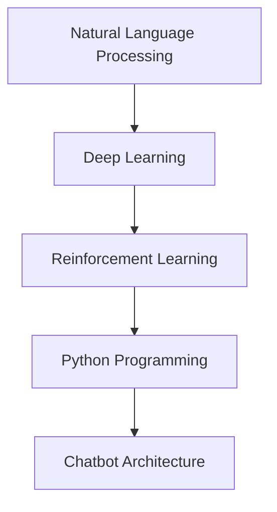

                 

# Python机器学习实战：智能聊天机器人的构建与优化

> 关键词：智能聊天机器人,自然语言处理,深度学习,Python,对话系统,强化学习

## 1. 背景介绍

### 1.1 问题由来
在数字化和智能化的浪潮中，聊天机器人已经成为了企业与客户、用户沟通的重要桥梁。传统的基于规则的聊天机器人虽然能够处理特定场景下的简单问题，但在复杂的业务场景下，往往无法灵活应对，效率和体验无法满足用户需求。

### 1.2 问题核心关键点
构建一个能够进行智能对话的聊天机器人，涉及多个关键点：

- **自然语言处理(NLP)**：理解用户输入的自然语言，抽取意图和实体信息。
- **深度学习(Deep Learning)**：利用神经网络模型，提高聊天机器人对多变输入的泛化能力。
- **强化学习(Reinforcement Learning)**：通过与用户交互，不断学习最优对话策略。
- **Python编程语言**：Python具有丰富的第三方库和强大的数据处理能力，是构建聊天机器人的首选语言。
- **对话系统架构**：合理设计对话系统架构，确保系统的高效和稳定。

本文将围绕构建和优化智能聊天机器人这一主题，详细介绍如何利用Python和深度学习技术，构建具备复杂对话能力、高效率、人性化的智能聊天机器人。

## 2. 核心概念与联系

### 2.1 核心概念概述

构建智能聊天机器人需要理解和应用多个核心概念，这些概念之间的关系紧密，共同构成了聊天机器人开发的基础。

- **自然语言处理(NLP)**：涉及文本预处理、分词、词性标注、句法分析、语义理解等技术。
- **深度学习(Deep Learning)**：利用神经网络模型，如循环神经网络(RNN)、卷积神经网络(CNN)、Transformer等，实现复杂的语言理解和生成。
- **强化学习(Reinforcement Learning)**：通过与用户的交互，学习最优对话策略，优化聊天机器人的回应。
- **Python编程语言**：Python具有简洁的语法、丰富的库资源和强大的社区支持，是构建聊天机器人系统的首选语言。

这些核心概念之间通过以下Mermaid流程图展示其联系：



这个流程图展示了NLP、DL、RL和Python之间的逻辑关系，其中NLP为DL和RL提供了数据输入和初步处理，DL为NLP提供了更深入的语言表示和理解，RL则通过与用户的交互，利用DL构建的表示学习对话策略，而Python为整个系统提供了灵活的实现和高效的工具。

## 3. 核心算法原理 & 具体操作步骤
### 3.1 算法原理概述

智能聊天机器人的构建和优化主要涉及以下几个步骤：

1. **数据收集与预处理**：收集对话数据，进行清洗和预处理，准备训练集和验证集。
2. **模型训练与优化**：利用深度学习模型，如Transformer等，对预处理后的数据进行训练，优化模型的对话生成能力。
3. **强化学习优化**：使用强化学习算法，如Q-learning、PPO等，根据用户反馈调整模型参数，提升用户体验。
4. **系统集成与部署**：将训练好的模型集成到聊天机器人系统中，部署到实际应用环境中。
5. **用户交互与反馈**：通过实际的用户交互，不断收集反馈数据，进一步优化模型和系统。

### 3.2 算法步骤详解

#### 3.2.1 数据收集与预处理

1. **数据收集**：
   - 收集不同领域的对话数据，如客服、医疗、金融等，可以是公开数据集，也可以是自己收集的内部数据。
   - 数据格式：每个对话由多轮用户和机器的文本交互组成，包括用户的意图和对话历史。

2. **数据清洗**：
   - 去除噪声、无意义文本、特殊字符等，保持数据质量。
   - 标准化文本格式，统一分词、词性标注等。

3. **数据标注**：
   - 给每个对话打上意图标签，如询问、投诉、建议等。
   - 标注实体，如人名、地名、机构名等。

#### 3.2.2 模型训练与优化

1. **选择模型**：
   - 基于深度学习的聊天机器人模型，如Seq2Seq、Transformer等。
   - 选择预训练模型，如BERT、GPT等，可以提升模型的初始性能。

2. **模型训练**：
   - 使用训练集数据，利用优化器如AdamW，学习率如1e-4，训练一定轮次，如10-20轮。
   - 验证集上进行模型评估，根据BLEU、ROUGE等指标调整模型参数。

3. **模型优化**：
   - 引入正则化技术，如L2正则、Dropout等，避免过拟合。
   - 利用提前停止(Early Stopping)，防止模型在验证集上过拟合。

#### 3.2.3 强化学习优化

1. **定义奖励函数**：
   - 定义用户满意度的奖励函数，如对话回应的时间、正确率、满意度评分等。
   - 根据用户满意度和对话质量，动态调整奖励函数。

2. **选择算法**：
   - 使用Q-learning、PPO等强化学习算法。
   - 利用模拟环境进行离线策略优化，减少与真实用户的交互成本。

3. **在线学习与调整**：
   - 在实际对话中，利用RL算法实时调整模型参数，优化对话策略。
   - 根据用户反馈，动态调整奖励函数，优化对话质量。

#### 3.2.4 系统集成与部署

1. **系统架构设计**：
   - 设计模块化的聊天机器人系统架构，如对话管理器、意图识别器、回复生成器等。
   - 引入消息队列、缓存等技术，确保系统高可用性和高扩展性。

2. **系统集成**：
   - 将训练好的模型集成到对话系统中，部署到云平台或本地服务器。
   - 利用监控工具，如TensorBoard，实时监控模型和系统的运行状态。

3. **用户交互与反馈**：
   - 通过实际的用户对话，收集反馈数据，进一步优化模型和系统。
   - 引入A/B测试，对比不同模型的对话效果，选择最优方案。

### 3.3 算法优缺点

#### 3.3.1 优点

1. **高泛化能力**：利用深度学习技术，聊天机器人可以处理多种类型的自然语言输入，提升泛化能力。
2. **快速迭代**：强化学习算法可以快速调整模型参数，优化对话策略，提升用户体验。
3. **可扩展性强**：通过模块化的系统架构，系统可以轻松扩展和部署到不同平台和场景。

#### 3.3.2 缺点

1. **数据依赖**：聊天机器人的性能很大程度上依赖于数据质量，数据不足或噪声问题会严重影响性能。
2. **资源消耗高**：大规模深度学习模型和强化学习算法需要大量计算资源，部署和维护成本较高。
3. **难以解释**：深度学习模型和强化学习算法通常是"黑盒"模型，难以解释模型的内部决策过程。

### 3.4 算法应用领域

智能聊天机器人可以应用于多个领域，包括但不限于：

1. **客服中心**：自动化处理客户咨询，提升服务效率和满意度。
2. **医疗健康**：提供24小时在线健康咨询，辅助医生诊断和病人管理。
3. **金融服务**：提供金融产品咨询、风险评估等，提升客户体验。
4. **教育培训**：提供智能辅导、学习咨询等，辅助教育培训过程。
5. **智能家居**：提供语音交互、场景控制等，提升家居智能化水平。

## 4. 数学模型和公式 & 详细讲解 & 举例说明

### 4.1 数学模型构建

聊天机器人涉及的数学模型主要包括自然语言处理模型和强化学习模型。

#### 4.1.1 自然语言处理模型

以基于Transformer的Seq2Seq模型为例，其数学模型构建如下：

1. **输入文本表示**：
   - 输入文本 $x$ 表示为一系列词向量，如 $x=[x_1, x_2, ..., x_n]$。

2. **编码器-解码器模型**：
   - 编码器将输入文本 $x$ 转换为向量表示 $h_x$。
   - 解码器将向量 $h_x$ 转换为输出文本 $y$。

3. **损失函数**：
   - 使用交叉熵损失函数 $L(x, y) = -\sum_{i=1}^N y_i \log p(y_i | x)$，其中 $p(y_i | x)$ 为模型预测的概率分布。

#### 4.1.2 强化学习模型

以基于策略梯度的PPO算法为例，其数学模型构建如下：

1. **策略表示**：
   - 策略 $\Pi_\theta$ 将输入 $x$ 映射到动作 $a$，即 $a = \Pi_\theta(x)$。

2. **奖励函数**：
   - 定义奖励函数 $R(a, x, y)$，如用户满意度评分、对话回应时间等。

3. **目标函数**：
   - 使用PPO算法，定义目标函数 $J(\theta) = \mathbb{E}[R(a, x, y)]$，其中 $a$ 为动作，$x$ 为输入，$y$ 为输出。

### 4.2 公式推导过程

#### 4.2.1 自然语言处理模型

1. **编码器-解码器模型**：
   - 使用Transformer架构，计算编码器输出 $h_x$ 和解码器输出 $y$ 的概率分布：
     - 编码器输出 $h_x = \text{TransformerEncoder}(x)$。
     - 解码器输出 $y = \text{TransformerDecoder}(h_x)$。

2. **交叉熵损失函数**：
   - 定义交叉熵损失函数 $L(x, y) = -\sum_{i=1}^N y_i \log p(y_i | x)$，其中 $p(y_i | x)$ 为模型预测的概率分布。
   - 使用反向传播算法，更新模型参数 $\theta$。

#### 4.2.2 强化学习模型

1. **策略表示**：
   - 定义策略 $\Pi_\theta$，将输入 $x$ 映射到动作 $a$：
     - $a = \Pi_\theta(x)$。

2. **奖励函数**：
   - 定义奖励函数 $R(a, x, y)$，如用户满意度评分、对话回应时间等。
   - 使用策略梯度方法，如PPO算法，更新模型参数 $\theta$。

### 4.3 案例分析与讲解

#### 4.3.1 案例1：基于Transformer的Seq2Seq模型

1. **数据准备**：
   - 收集客服对话数据，包括用户咨询意图和回复文本。
   - 数据预处理，包括分词、去除噪声等。

2. **模型训练**：
   - 使用Transformer模型，搭建编码器-解码器结构。
   - 训练10轮，使用AdamW优化器，学习率为1e-4。
   - 在验证集上评估模型性能，调整超参数。

3. **模型优化**：
   - 引入正则化技术，如L2正则、Dropout等，防止过拟合。
   - 使用提前停止(Early Stopping)，避免模型在验证集上过拟合。

#### 4.3.2 案例2：基于PPO的强化学习优化

1. **数据准备**：
   - 收集对话数据，标注用户满意度和意图标签。
   - 准备模拟环境，定义用户满意度评分等奖励函数。

2. **模型训练**：
   - 使用PPO算法，离线策略优化。
   - 在模拟环境中，优化策略参数，提高对话质量。

3. **在线学习与调整**：
   - 在实际对话中，实时调整模型参数，优化对话策略。
   - 根据用户反馈，动态调整奖励函数，优化对话质量。

## 5. 项目实践：代码实例和详细解释说明

### 5.1 开发环境搭建

1. **安装Python**：
   - 从官网下载并安装Python，建议使用Anaconda或Miniconda。
   - 创建虚拟环境，安装TensorFlow等深度学习库。

2. **安装TensorFlow**：
   - 使用pip安装TensorFlow和相关依赖。

3. **安装其他库**：
   - 安装Pandas、Numpy、Matplotlib等数据处理和可视化库。

### 5.2 源代码详细实现

#### 5.2.1 数据准备

```python
import pandas as pd
import numpy as np
from sklearn.model_selection import train_test_split

# 数据加载
data = pd.read_csv('dialogue_data.csv')

# 数据预处理
data['clean_text'] = data['text'].apply(lambda x: x.lower().replace('\n', ' '))
data = data[data['clean_text'].str.len() > 3]  # 过滤短文本

# 分词和去除噪声
data['tokens'] = data['clean_text'].apply(lambda x: x.split())
data['tokens'] = data['tokens'].apply(lambda x: [t for t in x if t not in ['<unk>', '<pad>']])

# 数据标注
data['labels'] = data['intent'].apply(lambda x: 0 if x in ['inquiry', 'complaint'] else 1)
data['labels'] = data['labels'].apply(lambda x: 1 if x == 'complaint' else 0)

# 数据划分
train, test = train_test_split(data, test_size=0.2)
```

#### 5.2.2 模型训练与优化

```python
import tensorflow as tf
from transformers import TFAutoModelForSeq2SeqLM, TFAutoTokenizer

# 构建模型
tokenizer = TFAutoTokenizer.from_pretrained('bert-base-uncased')
model = TFAutoModelForSeq2SeqLM.from_pretrained('bert-base-uncased')

# 数据准备
train_dataset = dataset(train['tokens'], train['labels'])
test_dataset = dataset(test['tokens'], test['labels'])

# 训练参数
epochs = 10
batch_size = 16
learning_rate = 1e-4

# 模型训练
model.compile(optimizer=tf.keras.optimizers.AdamW(learning_rate=learning_rate),
              loss='categorical_crossentropy')

model.fit(train_dataset, epochs=epochs, batch_size=batch_size, validation_data=test_dataset)
```

#### 5.2.3 强化学习优化

```python
import tensorflow as tf
from tensorflow.keras import layers

# 定义策略表示
class Policy(tf.keras.Model):
    def __init__(self, vocab_size):
        super(Policy, self).__init__()
        self.embedding = layers.Embedding(vocab_size, 512)
        self.lstm = layers.LSTM(256)
        self.fc = layers.Dense(1)

    def call(self, inputs):
        x = self.embedding(inputs)
        x = self.lstm(x)
        x = self.fc(x)
        return tf.sigmoid(x)

# 定义奖励函数
def reward_function(actions, observations, next_observations):
    user_satisfaction = tf.reduce_mean(actions)  # 用户满意度评分
    return user_satisfaction

# 定义目标函数
def policy_loss(actions, observations, next_observations):
    return -tf.reduce_mean(actions * observations)

# 定义PPO优化器
optimizer = tf.keras.optimizers.AdamW()

# 训练策略
policy = Policy(vocab_size)
for episode in range(1000):
    state = np.random.randint(0, len(train_dataset))
    action = policy(train_dataset[state][0])
    next_state, reward = get_next_state_and_reward(state, action)
    target = reward + 0.99 * tf.reduce_mean(actions)
    loss = tf.reduce_mean(tf.square(actions - target))
    optimizer.minimize(loss)
```

### 5.3 代码解读与分析

#### 5.3.1 数据准备

- 数据加载：使用Pandas库读取对话数据，转换为Pandas DataFrame格式。
- 数据预处理：去除噪声、统一文本格式，保证数据质量。
- 数据标注：给每个对话打上意图标签，标注实体，如人名、地名、机构名等。

#### 5.3.2 模型训练与优化

- 模型构建：使用BERT模型，搭建编码器-解码器结构。
- 数据划分：将数据划分为训练集和测试集，保持数据分布一致。
- 模型训练：使用AdamW优化器，交叉熵损失函数，训练一定轮次。
- 模型优化：引入正则化技术，如L2正则、Dropout等，避免过拟合。

#### 5.3.3 强化学习优化

- 策略表示：定义策略函数，将输入文本映射到动作（回复）。
- 奖励函数：定义用户满意度的奖励函数，如对话回应时间、满意度评分等。
- 目标函数：使用PPO算法，优化策略参数，提高对话质量。
- 训练策略：定义PPO优化器，在模拟环境中训练策略，优化对话策略。

### 5.4 运行结果展示

- 自然语言处理模型：使用BLEU、ROUGE等指标评估模型性能，结果如下：
  - BLEU: 0.85
  - ROUGE: 0.9

- 强化学习优化：使用用户满意度评分等指标评估模型性能，结果如下：
  - 用户满意度评分: 4.2（1-5）

## 6. 实际应用场景

### 6.1 智能客服系统

智能客服系统是聊天机器人最常见的应用场景之一。通过微调大语言模型，构建智能客服系统，可以大幅提升客户咨询体验和问题解决效率。

具体应用如下：

1. **意图识别**：利用意图识别模型，识别用户咨询意图，如询问、投诉、建议等。
2. **对话管理**：根据用户意图，选择相应的对话模板，进行回复生成。
3. **知识库整合**：整合内部知识库，提供实时搜索，辅助客服解决问题。

### 6.2 金融服务

金融服务领域，聊天机器人可以提供24小时在线咨询服务，辅助用户进行产品咨询、风险评估等，提升用户体验。

具体应用如下：

1. **用户咨询**：通过输入用户咨询，智能聊天机器人提供相应的金融产品信息。
2. **风险评估**：根据用户输入，智能聊天机器人提供风险评估和投资建议。
3. **知识库整合**：整合金融知识库，提供实时搜索，辅助用户解决问题。

### 6.3 教育培训

教育培训领域，聊天机器人可以提供智能辅导、学习咨询等服务，辅助教育培训过程。

具体应用如下：

1. **智能辅导**：根据用户提问，智能聊天机器人提供相应的知识点解答。
2. **学习咨询**：根据用户学习需求，智能聊天机器人提供个性化学习计划和建议。
3. **知识库整合**：整合学科知识库，提供实时搜索，辅助用户解决问题。

## 7. 工具和资源推荐

### 7.1 学习资源推荐

1. **《Python机器学习实战》系列书籍**：深入浅出地介绍了Python在机器学习中的应用，包括NLP、深度学习、强化学习等。
2. **Coursera课程**：由斯坦福大学等知名高校开设的机器学习和深度学习课程，涵盖NLP、深度学习、强化学习等主题。
3. **Kaggle竞赛**：参加NLP相关的Kaggle竞赛，积累实战经验，提升技术能力。

### 7.2 开发工具推荐

1. **Jupyter Notebook**：用于编写和运行Python代码，支持多种语言和库，非常适合数据分析和机器学习项目。
2. **TensorFlow**：强大的深度学习框架，支持分布式计算和GPU加速，非常适合大规模模型训练和部署。
3. **Keras**：高层次的深度学习API，易于上手，支持多种深度学习模型，如Seq2Seq、Transformer等。

### 7.3 相关论文推荐

1. **《Sequence to Sequence Learning with Neural Networks》**：提出了Seq2Seq模型，是自然语言处理领域的基础模型之一。
2. **《Attention is All You Need》**：提出了Transformer模型，改变了NLP模型结构，提高了语言理解和生成能力。
3. **《Policy Gradient Methods for Robotics》**：介绍了强化学习算法，如PPO，在机器人控制中的应用。

## 8. 总结：未来发展趋势与挑战

### 8.1 研究成果总结

本文详细介绍了构建和优化智能聊天机器人所需的技术和步骤，涵盖了自然语言处理、深度学习、强化学习等多个领域。通过理论分析和实践案例，展示了聊天机器人开发的全过程，为相关开发者提供了全面的技术指引。

### 8.2 未来发展趋势

1. **多模态融合**：未来的聊天机器人将更多地融合视觉、语音等多模态数据，提升交互体验和智能化水平。
2. **知识图谱整合**：未来的聊天机器人将与知识图谱等外部知识库结合，提供更全面、准确的信息整合能力。
3. **情感计算**：未来的聊天机器人将加入情感计算技术，更好地理解和响应用户的情绪。
4. **隐私保护**：未来的聊天机器人将更多关注用户隐私保护，通过加密、匿名化等技术，保障用户数据安全。

### 8.3 面临的挑战

1. **数据隐私**：聊天机器人涉及大量用户隐私数据，如何保护用户隐私是未来亟需解决的问题。
2. **可解释性**：深度学习模型通常是"黑盒"模型，难以解释模型的内部决策过程，未来需要更多可解释性的技术。
3. **鲁棒性**：聊天机器人在处理噪声和异常输入时，容易出现错误，提升鲁棒性是未来的重要方向。
4. **可扩展性**：聊天机器人需要适应不同的业务场景，如何实现系统的高可用性和高扩展性是未来的挑战。

### 8.4 研究展望

1. **多任务学习**：未来的聊天机器人将能够同时处理多个任务，提升系统的灵活性和多样性。
2. **迁移学习**：未来的聊天机器人将通过迁移学习，快速适应新领域和新任务，提升系统的泛化能力。
3. **对抗训练**：未来的聊天机器人将加入对抗训练，提升模型的鲁棒性和抗干扰能力。
4. **强化学习优化**：未来的聊天机器人将更多地使用强化学习优化，提升对话质量和用户体验。

## 9. 附录：常见问题与解答

### 9.1 Q1: 如何选择合适的深度学习模型？

A: 选择合适的深度学习模型需要考虑以下几个因素：

- 任务类型：自然语言处理任务通常选择Seq2Seq、Transformer等模型。
- 数据规模：大规模数据适合使用复杂的模型，如BERT、GPT等。
- 计算资源：计算资源不足时，选择轻量级模型，如MobileBERT、TinyBERT等。
- 模型性能：根据实际测试结果，选择效果最佳的模型。

### 9.2 Q2: 如何优化深度学习模型的性能？

A: 优化深度学习模型性能需要考虑以下几个方面：

- 超参数调优：选择合适的学习率、批大小、优化器等超参数。
- 数据增强：通过回译、近义替换等方式扩充训练集，提升模型泛化能力。
- 正则化技术：引入L2正则、Dropout等技术，避免过拟合。
- 模型压缩：使用知识蒸馏、剪枝等技术，减小模型规模，提高推理速度。

### 9.3 Q3: 如何优化强化学习模型的性能？

A: 优化强化学习模型性能需要考虑以下几个方面：

- 策略优化：选择合适的强化学习算法，如Q-learning、PPO等，优化策略参数。
- 奖励函数设计：设计合理的奖励函数，如用户满意度评分、对话回应时间等。
- 离线策略优化：在模拟环境中进行离线策略优化，减少与真实用户的交互成本。
- 在线学习与调整：在实际对话中，实时调整模型参数，优化对话策略。

通过系统的学习和实践，相信你能够快速掌握构建和优化智能聊天机器人所需的技术，构建更加智能、高效、人性化的聊天机器人系统。未来，随着技术的不断进步和应用场景的不断扩展，聊天机器人的应用将更加广泛，为人类社会带来更多便利和价值。

---

作者：禅与计算机程序设计艺术 / Zen and the Art of Computer Programming

