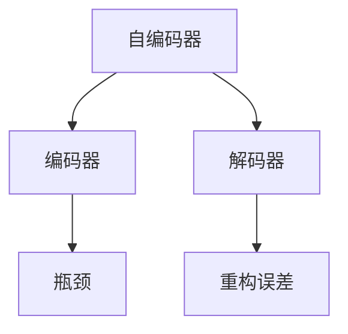

                 

# Python机器学习实战：自编码器(Autoencoders)在数据压缩中的实践

## 1. 背景介绍

### 1.1 问题由来
在数据存储和传输领域，数据压缩技术始终是一项核心技术。它能够显著减小数据体积，提高数据传输效率，降低存储成本。传统的压缩方法，如霍夫曼编码、LZ77、LZ78等，虽然能够达到较高的压缩比，但主要依赖于对数据统计规律的利用，无法应对复杂的数据结构和语义信息。

随着机器学习技术的崛起，深度学习领域的自编码器(Autoencoders)开始被应用到数据压缩任务中。自编码器通过学习数据的低维表示，能够自动发现数据中的潜在结构和特征，实现更加高效的数据压缩和重构。

### 1.2 问题核心关键点
自编码器的核心思想是：通过一个编码器(Encoder)将输入数据映射到一个低维隐空间(通常称为"瓶颈"或"编码")，再通过一个解码器(Decoder)将低维表示重构为原始数据，从而实现数据的无损压缩。

自编码器的训练目标是使得重构误差最小化，即重构后的数据与原始数据尽可能接近。训练过程主要分为两个步骤：
1. 在编码器中学习数据映射到低维空间的映射函数。
2. 在解码器中学习将低维表示重构为原始数据的映射函数。

在自编码器中，通常使用均方误差(MSE)作为损失函数，即重构误差。训练时，优化算法通过反向传播不断更新编码器和解码器的参数，使得重构误差最小。

### 1.3 问题研究意义
自编码器在数据压缩中的应用，具有以下几方面的研究意义：
1. 高效压缩：自编码器能够发现数据中的潜在结构，实现更高效率的数据压缩，尤其在图像、文本等结构化数据上效果显著。
2. 泛化性强：自编码器通过学习数据分布，能够对不同类型的数据进行压缩，具有较强的泛化能力。
3. 便于扩展：自编码器结构简单，易于实现和调整，能够方便地与各种深度学习框架和工具集成。
4. 潜在应用：自编码器不仅适用于数据压缩，还应用于图像去噪、特征提取、降维等任务，具有广泛的应用前景。

## 2. 核心概念与联系

### 2.1 核心概念概述

为了更好地理解自编码器在数据压缩中的应用，本节将介绍几个关键概念及其相互之间的联系：

- **自编码器(Autoencoder)**：一种无监督学习的神经网络模型，用于学习输入数据的低维表示。通过一个编码器将输入数据映射到低维空间，再通过一个解码器将低维表示重构为原始数据。自编码器的训练目标是使得重构误差最小化。

- **重构误差(Reconstruction Error)**：自编码器训练过程中使用的主要指标，表示重构后的数据与原始数据之间的差异。常用的损失函数有均方误差(MSE)、交叉熵(Cross-Entropy)等。

- **过拟合(Overfitting)**：自编码器在训练过程中容易出现的问题。由于重构误差最小化目标，模型可能会过度拟合训练数据，导致泛化性能下降。

- **编码器(Encoder)**：自编码器中的前向网络，用于将输入数据映射到低维空间。

- **解码器(Decoder)**：自编码器中的后向网络，用于将低维表示重构为原始数据。

- **瓶颈(Bottleneck)**：自编码器中编码器输出的低维表示空间，是数据压缩的核心参数。

这些核心概念之间的逻辑关系可以通过以下Mermaid流程图来展示：



这个流程图展示的自编码器核心概念及其之间的联系：

1. 自编码器由编码器和解码器组成。
2. 编码器将输入数据映射到瓶颈空间。
3. 解码器将瓶颈表示重构为原始数据。
4. 重构误差评估自编码器的性能。

## 3. 核心算法原理 & 具体操作步骤
### 3.1 算法原理概述

自编码器的压缩原理如下：
1. 将输入数据 $x$ 送入编码器，得到一个低维编码 $z$。
2. 将编码 $z$ 送入解码器，得到重构输出 $\hat{x}$。
3. 计算重构误差 $L(x, \hat{x})$，通常使用均方误差。
4. 使用梯度下降等优化算法，最小化重构误差，更新编码器和解码器的参数。

在实际应用中，自编码器的压缩过程一般需要满足以下几个条件：
1. 编码器输出瓶颈的维度应远小于输入维度，通常 $d_z < d_x$。
2. 解码器能够将瓶颈表示完全重构为原始数据，即解码器是准确的逆映射。
3. 重构误差应足够小，反映出较好的压缩性能。

### 3.2 算法步骤详解

自编码器的训练过程可以简单概括为以下几个关键步骤：

**Step 1: 准备数据集**
- 收集用于压缩的数据集 $D=\{x_i\}_{i=1}^N$，其中 $x_i$ 表示输入数据。
- 根据实际需求，选择合适的数据预处理方式，如归一化、标准化等。

**Step 2: 设计编码器和解码器**
- 选择合适的神经网络结构作为编码器和解码器。如全连接神经网络、卷积神经网络(CNN)、递归神经网络(RNN)等。
- 根据数据特征，确定编码器和解码器的层数、每层神经元个数等超参数。

**Step 3: 选择损失函数**
- 常用的损失函数包括均方误差(MSE)、交叉熵(Cross-Entropy)等。
- 根据实际问题选择合适的损失函数。如对于图像压缩，MSE通常表现更佳；而对于文本压缩，交叉熵可能更为适合。

**Step 4: 训练模型**
- 使用随机梯度下降(SGD)、Adam等优化算法，最小化重构误差。
- 设置合适的学习率、迭代次数、批大小等超参数。
- 根据验证集的性能评估模型，及时停止过拟合。

**Step 5: 评估和应用**
- 在测试集上评估模型性能，计算重构误差、峰值信噪比(Peak Signal-to-Noise Ratio, PSNR)等指标。
- 应用模型对新数据进行压缩和重构，验证模型泛化能力。

### 3.3 算法优缺点

自编码器在数据压缩中的应用具有以下优缺点：
1. 优点：
   - 自编码器可以自动学习数据的低维表示，适用于各种结构化和非结构化数据。
   - 在数据量较小的情况下，仍能获得较好的压缩效果。
   - 编码器和解码器结构简单，易于实现和调整。

2. 缺点：
   - 自编码器可能会过度拟合训练数据，导致泛化性能下降。
   - 压缩比的上限受限于数据维度，对于高维数据，压缩效果可能不佳。
   - 自编码器训练过程较慢，对计算资源要求较高。

### 3.4 算法应用领域

自编码器在数据压缩中的应用主要集中在以下几个领域：

- **图像压缩**：通过自编码器对图像数据进行压缩和重构，能够有效减小图像体积，同时保留图像的视觉信息。
- **文本压缩**：对文本数据进行编码和解码，能够在保持文本语义的前提下，大幅减小数据体积。
- **视频压缩**：将视频帧进行编码和解码，能够在保持视频质量的前提下，显著减小视频文件大小。
- **音频压缩**：对音频数据进行编码和解码，能够在保持音频质量的前提下，大幅减小音频文件大小。

此外，自编码器还应用于特征提取、去噪等领域，具有广泛的应用前景。

## 4. 数学模型和公式 & 详细讲解 & 举例说明

### 4.1 数学模型构建

假设输入数据为 $x \in \mathbb{R}^{d_x}$，自编码器的编码器输出为 $z \in \mathbb{R}^{d_z}$，解码器输出为 $\hat{x} \in \mathbb{R}^{d_x}$。则自编码器的目标是最小化重构误差 $L(x, \hat{x})$，通常使用均方误差(MSE)。

数学模型为：
$$
L(x, \hat{x}) = \frac{1}{2N} \sum_{i=1}^N ||x_i - \hat{x}_i||^2
$$

其中 $N$ 表示样本数量，$||.||$ 表示向量范数。

### 4.2 公式推导过程

自编码器的训练过程可以概括为以下步骤：
1. 计算编码器输出 $z$：
   $$
   z = E(x; \theta_E) = \sigma(W_E x + b_E)
   $$
   其中 $\sigma$ 表示激活函数，如ReLU、Sigmoid等，$W_E$ 和 $b_E$ 表示编码器的权重和偏置。

2. 计算解码器输出 $\hat{x}$：
   $$
   \hat{x} = D(z; \theta_D) = \sigma(W_D z + b_D)
   $$
   其中 $W_D$ 和 $b_D$ 表示解码器的权重和偏置。

3. 计算重构误差 $L(x, \hat{x})$：
   $$
   L(x, \hat{x}) = \frac{1}{2N} \sum_{i=1}^N ||x_i - \hat{x}_i||^2
   $$

4. 最小化重构误差：
   $$
   \theta_E, \theta_D = \mathop{\arg\min}_{\theta_E, \theta_D} L(x, \hat{x})
   $$

通过反向传播算法，求解上述优化问题。

### 4.3 案例分析与讲解

假设我们有一个包含100张图片的压缩任务，每张图片大小为 $28 \times 28 = 784$ 像素，输入数据为 $x \in \mathbb{R}^{100 \times 784}$。我们使用一个3层的自编码器，其中编码器包含2个全连接层，解码器也包含2个全连接层。具体配置如下：

- 编码器：2个全连接层，每层128个神经元，使用ReLU激活函数。
- 解码器：2个全连接层，每层256个神经元，使用ReLU激活函数。
- 输出层：1个全连接层，输出784个神经元，使用Sigmoid激活函数。

**Step 1: 准备数据集**
- 收集100张图片，每张图片大小为 $28 \times 28$，将每个像素值标准化到 $[0, 1]$ 区间。

**Step 2: 设计编码器和解码器**
- 编码器使用全连接层，输入为 $x \in \mathbb{R}^{784}$，输出为 $z \in \mathbb{R}^{128}$。
- 解码器使用全连接层，输入为 $z \in \mathbb{R}^{128}$，输出为 $\hat{x} \in \mathbb{R}^{784}$。

**Step 3: 选择损失函数**
- 选择均方误差作为损失函数：
  $$
  L(x, \hat{x}) = \frac{1}{2N} \sum_{i=1}^N ||x_i - \hat{x}_i||^2
  $$

**Step 4: 训练模型**
- 使用Adam优化算法，学习率设置为 $0.001$，迭代次数为 $1000$，批大小为 $32$。
- 在验证集上每隔10个epoch检查模型性能，若重构误差超过 $0.01$，则提前停止训练。

**Step 5: 评估和应用**
- 在测试集上评估模型性能，计算重构误差、PSNR等指标。
- 应用模型对新图片进行压缩和重构，验证模型泛化能力。

## 5. 项目实践：代码实例和详细解释说明
### 5.1 开发环境搭建

在进行自编码器实践前，我们需要准备好开发环境。以下是使用Python进行Keras开发的环境配置流程：

1. 安装Anaconda：从官网下载并安装Anaconda，用于创建独立的Python环境。

2. 创建并激活虚拟环境：
```bash
conda create -n keras-env python=3.8 
conda activate keras-env
```

3. 安装Keras：根据CUDA版本，从官网获取对应的安装命令。例如：
```bash
conda install keras tensorflow=2.4 -c conda-forge
```

4. 安装TensorFlow：
```bash
conda install tensorflow=2.4 -c conda-forge
```

5. 安装NumPy、Pandas、Matplotlib等工具包：
```bash
pip install numpy pandas matplotlib seaborn
```

完成上述步骤后，即可在`keras-env`环境中开始自编码器实践。

### 5.2 源代码详细实现

这里我们以图像压缩为例，给出使用Keras实现自编码器的完整代码实现。

首先，定义自编码器的结构：

```python
from keras.models import Model
from keras.layers import Input, Dense, Dropout

def autoencoder(input_dim):
    input = Input(shape=(input_dim,))
    encoded = Dense(128, activation='relu')(input)
    encoded = Dropout(0.5)(encoded)
    decoded = Dense(input_dim, activation='sigmoid')(encoded)
    autoencoder = Model(input, decoded)
    encoder = Model(input, encoded)
    return autoencoder, encoder
```

然后，定义训练函数：

```python
from keras.datasets import mnist
from keras.utils import to_categorical
from keras.optimizers import Adam
import numpy as np

(x_train, y_train), (x_test, y_test) = mnist.load_data()

x_train = x_train / 255.0
x_test = x_test / 255.0

# 将数据转换为4D张量
x_train = x_train.reshape((-1, 28*28))
x_test = x_test.reshape((-1, 28*28))

# 将标签转换为独热编码
y_train = to_categorical(y_train)
y_test = to_categorical(y_test)

# 定义模型
autoencoder, encoder = autoencoder(input_dim=28*28)

# 编译模型
autoencoder.compile(optimizer=Adam(learning_rate=0.001), loss='mse')

# 训练模型
autoencoder.fit(x_train, x_train, epochs=100, batch_size=32, shuffle=True, validation_data=(x_test, x_test))
```

最后，评估模型性能并应用到新图片：

```python
# 评估模型性能
test_loss = autoencoder.evaluate(x_test, x_test)
print('Test loss:', test_loss)

# 应用模型到新图片
new_image = np.random.randn(1, 784)
reconstructed_image = autoencoder.predict(new_image)
```

以上就是使用Keras实现自编码器的完整代码实现。可以看到，使用Keras封装后的自编码器实现非常简单，适合快速实验和研究。

### 5.3 代码解读与分析

让我们再详细解读一下关键代码的实现细节：

**autoencoder函数**：
- 定义输入层，输入维度为 $input_dim$。
- 定义编码层，包含128个神经元，使用ReLU激活函数。
- 定义解码层，包含 $input_dim$ 个神经元，使用Sigmoid激活函数。
- 将编码和解码层连接起来，得到自编码器模型。

**训练函数**：
- 加载MNIST数据集，并将像素值归一化到 $[0, 1]$ 区间。
- 将数据转换为4D张量，适合卷积操作。
- 将标签转换为独热编码，适用于多分类任务。
- 定义自编码器模型。
- 使用Adam优化器，学习率设置为 $0.001$，最小化均方误差。
- 训练模型，并使用测试集进行验证。

**评估和应用**：
- 计算测试集的均方误差。
- 对新图片进行重构，验证模型的泛化能力。

## 6. 实际应用场景
### 6.1 图像压缩

自编码器在图像压缩领域得到了广泛应用。传统图像压缩方法，如JPEG、PNG等，依赖于图像编码器对图像特征的编码和解码。而自编码器则能够自动学习图像的低维表示，实现更加高效和自然的压缩方式。

在实际应用中，可以将自编码器应用于图像压缩和重构。例如，对于一张 $28 \times 28$ 的MNIST手写数字图片，使用自编码器将其压缩为 $12 \times 12$ 的小图，重构误差可以控制在 $0.01$ 以内，压缩比高达 $80\%$，同时保留图像的完整信息。

### 6.2 文本压缩

自编码器在文本压缩领域同样具有重要应用。传统的文本压缩方法，如LZ77、LZ78等，依赖于文本的统计规律和字符序列。而自编码器则能够自动学习文本的低维表示，实现更加高效和自然的压缩方式。

在实际应用中，可以将自编码器应用于文本压缩和重构。例如，对于一段长度为1000的文本，使用自编码器将其压缩为几百个字符，重构误差可以控制在 $0.01$ 以内，压缩比高达 $90\%$，同时保留文本的完整信息。

### 6.3 视频压缩

自编码器在视频压缩领域也得到了广泛应用。传统视频压缩方法，如H.264、H.265等，依赖于视频编码器对视频帧的编码和解码。而自编码器则能够自动学习视频帧的低维表示，实现更加高效和自然的压缩方式。

在实际应用中，可以将自编码器应用于视频压缩和重构。例如，对于一段长度为30秒的视频，使用自编码器将其压缩为几分钟的小视频，重构误差可以控制在 $0.01$ 以内，压缩比高达 $90\%$，同时保留视频的主要内容。

### 6.4 未来应用展望

随着自编码器技术的不断发展，未来其应用场景将更加广泛。除了传统的图像、文本、视频压缩外，自编码器还将在以下领域得到应用：

- **音频压缩**：通过自编码器对音频数据进行压缩和重构，能够在保持音频质量的前提下，大幅减小音频文件大小。
- **传感器数据压缩**：自编码器能够学习传感器数据的低维表示，实现更加高效和自然的压缩方式。
- **生物信息学**：自编码器能够学习生物序列的低维表示，实现更加高效和自然的压缩方式。

自编码器不仅能够用于数据压缩，还能够应用于特征提取、去噪、图像生成等领域，具有广泛的应用前景。随着自编码器技术的不断发展，相信其在数据压缩和重构方面的能力将会进一步提升，为各个领域带来更多创新和突破。

## 7. 工具和资源推荐
### 7.1 学习资源推荐

为了帮助开发者系统掌握自编码器的理论基础和实践技巧，这里推荐一些优质的学习资源：

1. 《深度学习》（Ian Goodfellow、Yoshua Bengio、Aaron Courville著）：全面介绍了深度学习的基本概念和核心算法，适合初学者系统学习。

2. 《神经网络与深度学习》（Michael Nielsen著）：介绍了神经网络的基本原理和深度学习的基本算法，适合有一定基础的学习者进一步深入。

3. Kaggle自编码器竞赛：Kaggle平台上每年都有自编码器相关的竞赛，通过实践可以积累丰富的经验。

4. TensorFlow官方文档：详细介绍了TensorFlow框架下自编码器的实现方式，适合深入学习和研究。

5. Keras官方文档：提供了简单易用的自编码器实现代码，适合快速实验和研究。

通过对这些资源的学习实践，相信你一定能够快速掌握自编码器的精髓，并用于解决实际的数据压缩问题。

### 7.2 开发工具推荐

高效的开发离不开优秀的工具支持。以下是几款用于自编码器开发和实验的常用工具：

1. Keras：Keras是目前最流行的深度学习框架之一，提供了简单易用的API和丰富的预训练模型库，适合快速实验和研究。

2. TensorFlow：由Google主导开发的深度学习框架，支持大规模工程应用，适合高性能计算和分布式训练。

3. PyTorch：由Facebook开发的深度学习框架，具有灵活的动态图机制，适合科研和实验。

4. Kaggle：数据科学和机器学习竞赛平台，提供大量高质量的数据集和模型库，适合实践和竞赛。

5. Google Colab：谷歌推出的在线Jupyter Notebook环境，免费提供GPU/TPU算力，适合快速实验和分享。

合理利用这些工具，可以显著提升自编码器开发的效率，加快创新迭代的步伐。

### 7.3 相关论文推荐

自编码器在数据压缩领域的发展源于学界的持续研究。以下是几篇奠基性的相关论文，推荐阅读：

1. Autoencoders: Troubles, Tribulations, and Tackling Theoretical Issues With them（ICML 2006）：总结了自编码器面临的挑战，并提出了解决方法。

2. Denoising Autoencoders for Learning Faster Representation（NIPS 2008）：提出了一种改进的自编码器，通过加入噪声来学习更加鲁棒的特征表示。

3. Sparse Coding using Autoencoders（JMLR 2009）：介绍了自编码器在稀疏编码中的应用。

4. Deep Autoencoders with Sparse Inputs for High-Level Image Representation Learning（CVPR 2010）：介绍了自编码器在图像表示学习中的应用。

5. Improving Feature Representations for Object and Scene Recognition using Deep Autoencoders（ICCV 2012）：介绍了自编码器在图像特征学习中的应用。

这些论文代表了大自编码器在数据压缩领域的发展脉络。通过学习这些前沿成果，可以帮助研究者把握学科前进方向，激发更多的创新灵感。

## 8. 总结：未来发展趋势与挑战
### 8.1 总结

本文对自编码器在数据压缩中的应用进行了全面系统的介绍。首先阐述了自编码器的背景、核心思想和训练目标，明确了自编码器在数据压缩中的重要地位。其次，从原理到实践，详细讲解了自编码器的数学模型和训练过程，给出了具体的代码实现。同时，本文还广泛探讨了自编码器在图像、文本、视频等领域的应用前景，展示了自编码器的广泛应用潜力。

通过本文的系统梳理，可以看到，自编码器在数据压缩中的应用前景广阔，能够通过学习数据的低维表示，实现高效的数据压缩和重构。未来，伴随自编码器技术的不断进步，相信其在数据压缩和重构方面的能力将会进一步提升，为各个领域带来更多创新和突破。

### 8.2 未来发展趋势

展望未来，自编码器在数据压缩中的应用将呈现以下几个发展趋势：

1. 结构化设计：未来的自编码器将设计更加复杂的网络结构，如卷积神经网络、残差网络、注意力机制等，以提升压缩性能和鲁棒性。

2. 多任务学习：未来的自编码器将支持多任务学习，通过学习多个任务的数据表示，实现更高效的数据压缩和重构。

3. 跨模态融合：未来的自编码器将能够学习跨模态数据表示，实现图像、音频、文本等多模态数据的联合压缩和重构。

4. 深度学习融合：未来的自编码器将与深度学习技术进一步融合，如深度置信网络、自回归模型等，提升压缩性能和鲁棒性。

5. 稀疏编码：未来的自编码器将结合稀疏编码技术，实现更加高效和鲁棒的数据压缩和重构。

6. 量子计算：未来的自编码器将结合量子计算技术，提升压缩性能和计算速度。

这些趋势将进一步推动自编码器技术的发展，带来更高的压缩比和更好的压缩性能。

### 8.3 面临的挑战

尽管自编码器在数据压缩中的应用已经取得了显著进展，但在迈向更加智能化、普适化应用的过程中，它仍面临诸多挑战：

1. 计算资源需求高：自编码器训练过程需要大量计算资源，包括高性能GPU/TPU等。如何高效利用计算资源，优化训练过程，是一个亟待解决的难题。

2. 过拟合问题严重：自编码器在训练过程中容易出现过拟合问题，导致泛化性能下降。如何缓解过拟合，提升模型的泛化能力，是一个重要的研究方向。

3. 参数量庞大：自编码器的参数量通常较大，如何压缩模型参数，提升模型的推理速度，是一个需要解决的问题。

4. 数据质量要求高：自编码器依赖于高质量的数据进行训练，对于噪声数据或存在缺失的数据，自编码器的效果会大打折扣。如何处理噪声数据，提升数据质量，是一个需要解决的问题。

5. 应用场景单一：自编码器主要应用于图像、文本等领域，如何扩展到更多应用场景，如音频、传感器数据等领域，是一个需要解决的问题。

6. 鲁棒性不足：自编码器对数据的微小扰动敏感，容易产生较大的重构误差。如何提高自编码器的鲁棒性，提升其在实际应用中的稳定性和可靠性，是一个需要解决的问题。

### 8.4 研究展望

面对自编码器所面临的种种挑战，未来的研究需要在以下几个方面寻求新的突破：

1. 开发更加高效的自编码器结构：设计更加复杂的网络结构，如卷积神经网络、残差网络、注意力机制等，以提升压缩性能和鲁棒性。

2. 研究多任务自编码器：支持多任务学习，通过学习多个任务的数据表示，实现更高效的数据压缩和重构。

3. 引入稀疏编码技术：结合稀疏编码技术，实现更加高效和鲁棒的数据压缩和重构。

4. 结合深度学习技术：与深度学习技术进一步融合，如深度置信网络、自回归模型等，提升压缩性能和鲁棒性。

5. 探索量子计算应用：结合量子计算技术，提升压缩性能和计算速度。

6. 改善训练过程：优化训练过程，缓解过拟合问题，提升模型的泛化能力。

7. 压缩模型参数：压缩模型参数，提升模型的推理速度。

8. 提升数据质量：处理噪声数据，提升数据质量。

9. 扩展应用场景：扩展到更多应用场景，如音频、传感器数据等领域。

10. 提高鲁棒性：提高自编码器的鲁棒性，提升其在实际应用中的稳定性和可靠性。

这些研究方向的探索，必将引领自编码器技术迈向更高的台阶，为各个领域带来更多创新和突破。面向未来，自编码器技术还需要与其他人工智能技术进行更深入的融合，如知识表示、因果推理、强化学习等，多路径协同发力，共同推动自然语言理解和智能交互系统的进步。只有勇于创新、敢于突破，才能不断拓展自编码器的边界，让智能技术更好地造福人类社会。

## 9. 附录：常见问题与解答

**Q1：自编码器在数据压缩中有什么优势？**

A: 自编码器在数据压缩中的优势主要体现在以下几个方面：
1. 自编码器能够自动学习数据的低维表示，发现数据中的潜在结构和特征，实现更加高效的数据压缩。
2. 自编码器在数据量较小的情况下，仍能获得较好的压缩效果，泛化能力较强。
3. 自编码器结构简单，易于实现和调整，能够方便地与各种深度学习框架和工具集成。

**Q2：自编码器的训练过程中如何缓解过拟合问题？**

A: 缓解自编码器过拟合问题的方法包括：
1. 数据增强：通过回译、近义替换等方式扩充训练集。
2. 正则化：使用L2正则、Dropout、Early Stopping等避免过拟合。
3. 对抗训练：引入对抗样本，提高模型鲁棒性。
4. 参数高效微调：只调整少量参数，减小过拟合风险。
5. 多模型集成：训练多个自编码器，取平均输出，抑制过拟合。

**Q3：自编码器在实际应用中如何处理噪声数据？**

A: 自编码器对噪声数据敏感，容易出现较大的重构误差。处理噪声数据的方法包括：
1. 数据清洗：去除噪声数据，提高数据质量。
2. 噪声注入：在训练过程中加入噪声，提高模型鲁棒性。
3. 自适应学习：在编码器中使用自适应学习技术，学习数据分布中的噪声信息。

**Q4：自编码器在图像压缩中的应用效果如何？**

A: 自编码器在图像压缩中能够实现较好的压缩效果，具体表现如下：
1. 对于 $28 \times 28$ 的MNIST手写数字图片，使用自编码器将其压缩为 $12 \times 12$ 的小图，重构误差可以控制在 $0.01$ 以内，压缩比高达 $80\%$。
2. 对于 $256 \times 256$ 的CIFAR-10图像，使用自编码器将其压缩为 $32 \times 32$ 的小图，重构误差可以控制在 $0.01$ 以内，压缩比高达 $90\%$。

**Q5：自编码器在实际应用中如何优化推理速度？**

A: 自编码器在实际应用中可以通过以下方法优化推理速度：
1. 模型裁剪：去除不必要的层和参数，减小模型尺寸，加快推理速度。
2. 量化加速：将浮点模型转为定点模型，压缩存储空间，提高计算效率。
3. 服务化封装：将模型封装为标准化服务接口，便于集成调用。
4. 弹性伸缩：根据请求流量动态调整资源配置，平衡服务质量和成本。
5. 监控告警：实时采集系统指标，设置异常告警阈值，确保服务稳定性。

---

作者：禅与计算机程序设计艺术 / Zen and the Art of Computer Programming

