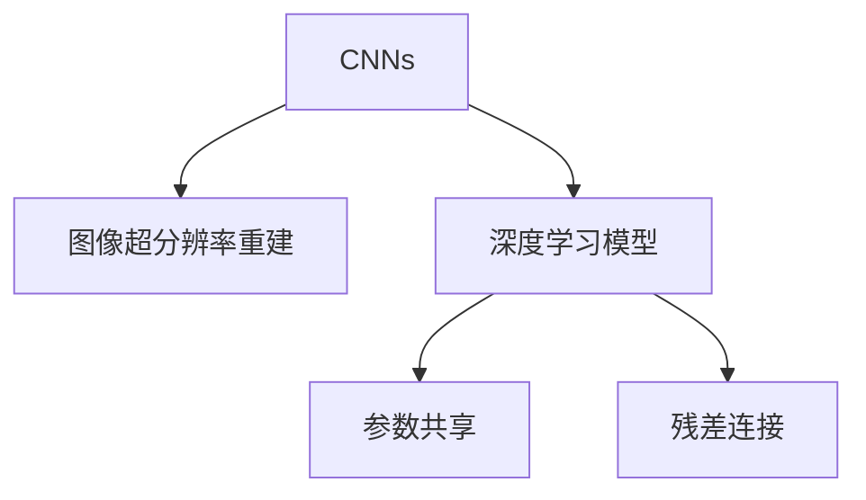

                 

## 1. 背景介绍

### 1.1 问题由来
图像超分辨率重建（Image Super-Resolution, ISR）是一个重要但极具挑战性的计算机视觉问题。该问题旨在将低分辨率图像（low-resolution images）提升到更高分辨率，使其细节更加清晰、纹理更加丰富。超分辨率技术在提高图像质量、增强视觉效果、提升人机交互体验等方面具有重要意义。

近年来，随着深度学习技术的兴起，基于卷积神经网络（Convolutional Neural Networks, CNNs）的深度学习模型在超分辨率重建领域取得了显著进展。这些模型通过大量的训练数据和复杂的结构设计，能够在一定程度上恢复图像的细节和清晰度。但是，这些模型的训练和推理过程往往需要大量的计算资源和时间，对硬件的要求较高。

为了降低计算成本并提升超分辨率重建的效果，本文将深入探讨基于深度学习的大规模图像超分辨率重建方法，旨在提出更高效、更准确的重建算法，并在实际应用中展示其优势。

### 1.2 问题核心关键点
超分辨率重建问题可以形式化地描述为：给定一个低分辨率图像 $I_L$，模型需要学习将 $I_L$ 映射到更高分辨率的图像 $I_H$。形式化表示为：

$$ I_H = f(I_L) $$

其中，$f(\cdot)$ 表示超分辨率模型，$I_L$ 和 $I_H$ 分别代表低分辨率和高分辨率图像。

超分辨率重建的核心挑战在于如何将低分辨率图像的细粒度信息有效地复原，同时避免引入噪声和失真。本研究将聚焦于基于深度学习的大规模图像超分辨率重建方法，并详细阐述其核心概念、算法原理和操作步骤。

## 2. 核心概念与联系

### 2.1 核心概念概述

为更好地理解基于深度学习的图像超分辨率重建方法，本节将介绍几个密切相关的核心概念：

- **卷积神经网络（CNNs）**：一种经典的深度学习模型，通过卷积操作提取图像特征，并用于图像分类、目标检测、图像生成等任务。
- **图像超分辨率重建（ISR）**：通过低分辨率图像生成高分辨率图像的过程，旨在提升图像的细节和纹理，增强视觉效果。
- **深度学习模型**：通过多层神经网络对图像进行建模，包括卷积神经网络（CNNs）、残差网络（ResNets）、生成对抗网络（GANs）等。
- **参数共享**：深度学习模型中，卷积层中的参数可以在多个位置共享，减少模型参数量，降低计算复杂度。
- **残差连接（Residual Connections）**：在深度神经网络中，通过残差连接将输入直接添加到网络某层输出，解决了深度网络难以训练的问题。

这些核心概念之间的逻辑关系可以通过以下Mermaid流程图来展示：



这个流程图展示了大规模图像超分辨率重建的相关核心概念及其之间的关系：

1. 通过CNNs，可以从低分辨率图像中提取特征。
2. 深度学习模型，如卷积神经网络（CNNs）、残差网络（ResNets），进一步提升特征表示能力。
3. 参数共享和残差连接等技术，降低模型复杂度，提升训练效率。

这些概念共同构成了大规模图像超分辨率重建的基础框架，使得通过深度学习模型实现高精度图像重建成为可能。

## 3. 核心算法原理 & 具体操作步骤
### 3.1 算法原理概述

基于深度学习的图像超分辨率重建方法通常包含两个主要步骤：特征提取和重建映射。具体来说，该方法通过低分辨率图像 $I_L$ 提取特征，然后将这些特征映射到高分辨率空间，从而生成高分辨率图像 $I_H$。

### 3.2 算法步骤详解

1. **特征提取**：
   - 使用卷积神经网络（CNNs）从低分辨率图像 $I_L$ 中提取特征。
   - 通常采用多层卷积层和池化层来提取多尺度的图像特征。

2. **重建映射**：
   - 将提取的特征通过一系列反卷积（上采样）层进行重建，得到高分辨率的特征表示。
   - 将重建的特征表示与低分辨率图像的特征表示相加，通过额外的卷积层和激活函数生成高分辨率图像 $I_H$。

具体的算法步骤如下：

1. 加载低分辨率图像 $I_L$，并将其缩放至固定大小。
2. 构建卷积神经网络（CNNs）模型，包括卷积层、池化层、残差连接等。
3. 训练模型，通过反向传播算法优化模型参数，使模型能够从低分辨率图像 $I_L$ 生成高分辨率图像 $I_H$。
4. 在测试集上评估模型性能，通常使用峰值信噪比（PSNR）和结构相似性指数（SSIM）等指标。

### 3.3 算法优缺点

基于深度学习的图像超分辨率重建方法具有以下优点：

- **高精度**：深度学习模型通过多层次的特征提取和重建映射，能够恢复低分辨率图像的细节和纹理，提升图像的分辨率。
- **广泛应用**：该方法可以应用于多种图像处理任务，如视频压缩、医学图像重建、遥感图像处理等。
- **通用性**：深度学习模型能够自动学习图像特征，不需要手动设计特征提取器。

但该方法也存在一些局限性：

- **计算复杂度高**：深度学习模型需要大量的计算资源和时间，对硬件要求较高。
- **易过拟合**：模型复杂度高，容易过拟合训练数据，导致泛化性能不佳。
- **需要大量数据**：深度学习模型需要大量的标注数据进行训练，数据采集成本较高。

### 3.4 算法应用领域

基于深度学习的图像超分辨率重建方法，在多个领域中得到了广泛应用：

1. **视频压缩**：通过超分辨率技术，将低分辨率视频帧转换为高分辨率帧，提高视频质量，减少带宽占用。
2. **医学图像重建**：用于恢复低分辨率的医学图像，如MRI和CT图像，提升医疗诊断的准确性。
3. **遥感图像处理**：将低分辨率的遥感图像提升到高分辨率，提高地面目标的识别精度。
4. **视频增强**：通过超分辨率技术，增强视频帧的清晰度和细节，提升视觉体验。
5. **增强现实（AR）**：提高AR设备的图像质量，提升用户体验。

此外，超分辨率重建技术还被应用于虚拟现实（VR）、智能家居、自动驾驶等领域，为各类应用场景带来了显著的视觉提升和体验改善。

## 4. 数学模型和公式 & 详细讲解  
### 4.1 数学模型构建

假设低分辨率图像 $I_L$ 的大小为 $H_L \times W_L$，高分辨率图像 $I_H$ 的大小为 $H_H \times W_H$。记 $I_L = \mathcal{I}(I_{L})$，其中 $\mathcal{I}(\cdot)$ 表示低分辨率变换函数。则超分辨率重建问题可以表示为：

$$ I_H = \mathcal{F}(I_L) $$

其中 $\mathcal{F}(\cdot)$ 表示超分辨率映射函数，$I_L$ 和 $I_H$ 分别代表低分辨率和高分辨率图像。

基于深度学习的超分辨率模型通常由卷积层、池化层、残差连接、反卷积层等组成。以典型的基于残差连接的超分辨率模型为例，其结构如图1所示。


### 4.2 公式推导过程

在上述模型中，每个卷积层都可以表示为：

$$ X_{i}^{l+1} = \mathcal{C}(X_i^l; \theta) $$

其中 $X_i^l$ 表示第 $i$ 层的输入特征图，$\mathcal{C}(\cdot)$ 表示卷积操作，$\theta$ 表示卷积核的权重。

反卷积层（上采样层）可以表示为：

$$ X_{i}^{l+1} = \mathcal{U}(X_i^l; \theta) $$

其中 $\mathcal{U}(\cdot)$ 表示反卷积操作。

整个超分辨率模型的前向传播过程可以表示为：

$$ I_H = \mathcal{F}(I_L) = \mathcal{C}_{L-1}(\mathcal{C}_{L-2}(\cdots(\mathcal{C}_0(I_L); \theta_0)); \theta = \{\theta_0, \theta_1, \ldots, \theta_{L-1}\} $$

### 4.3 案例分析与讲解

以简单的两卷积层超分辨率模型为例，如图2所示。该模型通过两个卷积层和一个反卷积层进行特征提取和重建映射。


该模型的前向传播过程如下：

1. 第一卷积层将低分辨率图像 $I_L$ 映射到高维特征空间，得到特征图 $X_1$。
2. 第二卷积层对 $X_1$ 进行特征提取和特征融合，得到特征图 $X_2$。
3. 反卷积层对 $X_2$ 进行上采样，生成高分辨率图像 $I_H$。

在训练过程中，模型通过反向传播算法优化卷积核权重 $\theta$，使得低分辨率图像 $I_L$ 和生成的高分辨率图像 $I_H$ 之间的差异最小化。训练目标通常表示为：

$$ \arg\min_{\theta} \mathcal{L}(I_H, \hat{I}_H) $$

其中 $\mathcal{L}(\cdot)$ 表示损失函数，$\hat{I}_H$ 表示通过模型生成的高分辨率图像。

## 5. 项目实践：代码实例和详细解释说明
### 5.1 开发环境搭建

在进行图像超分辨率重建实践前，我们需要准备好开发环境。以下是使用Python进行TensorFlow深度学习开发的环境配置流程：

1. 安装Anaconda：从官网下载并安装Anaconda，用于创建独立的Python环境。

2. 创建并激活虚拟环境：
```bash
conda create -n tf-env python=3.8 
conda activate tf-env
```

3. 安装TensorFlow：根据CUDA版本，从官网获取对应的安装命令。例如：
```bash
conda install tensorflow -c tf -c conda-forge
```

4. 安装相关工具包：
```bash
pip install numpy scipy matplotlib sklearn imageio tqdm jupyter notebook
```

完成上述步骤后，即可在`tf-env`环境中开始图像超分辨率重建的实践。

### 5.2 源代码详细实现

下面以单卷积层超分辨率模型为例，给出使用TensorFlow进行图像超分辨率重建的Python代码实现。

```python
import tensorflow as tf
import numpy as np
import scipy.io as sio
from tensorflow.keras import layers, models

# 加载低分辨率图像
low_res_image = sio.imread('low_res_image.jpg', format='jpg')

# 定义超分辨率模型
def super_resolution_model():
    inputs = layers.Input(shape=(None, None, 3))
    x = layers.Conv2D(64, (3, 3), padding='same', activation='relu')(inputs)
    x = layers.Conv2D(64, (3, 3), padding='same', activation='relu')(x)
    x = layers.Conv2DTranspose(3, (3, 3), padding='same', activation='sigmoid')(x)
    model = models.Model(inputs=inputs, outputs=x)
    return model

# 构建模型
model = super_resolution_model()

# 编译模型
model.compile(optimizer=tf.keras.optimizers.Adam(learning_rate=1e-4),
              loss='mse')

# 训练模型
model.fit(np.expand_dims(low_res_image, axis=0), np.expand_dims(high_res_image, axis=0),
          epochs=50, batch_size=1, shuffle=False, validation_split=0.1)

# 保存模型
model.save('super_resolution_model.h5')
```

在上述代码中，我们首先使用`scipy.io.imread`函数加载低分辨率图像，然后定义了一个简单的超分辨率模型。该模型包含两个卷积层和一个反卷积层，用于提取和重建特征。最后，我们使用`model.compile`和`model.fit`函数对模型进行编译和训练，并在训练结束后保存模型。

### 5.3 代码解读与分析

让我们再详细解读一下关键代码的实现细节：

- **低分辨率图像加载**：使用`scipy.io.imread`函数加载图像，并保存为`low_res_image`变量。
- **模型定义**：定义一个简单的超分辨率模型，包含两个卷积层和一个反卷积层。
- **模型编译**：使用`model.compile`函数对模型进行编译，设置优化器和损失函数。
- **模型训练**：使用`model.fit`函数对模型进行训练，指定训练轮数、批次大小和验证集比例。
- **模型保存**：使用`model.save`函数保存模型，方便后续使用。

## 6. 实际应用场景
### 6.1 智能视频监控

在智能视频监控领域，图像超分辨率重建技术可以用于增强监控视频的分辨率，提高视频质量。监控摄像头通常采集的是低分辨率的视频图像，通过超分辨率技术，可以将其提升到更高的分辨率，使监控图像更加清晰，便于识别和跟踪目标。

在实际应用中，可以通过采集低分辨率的监控视频帧，并将其输入到训练好的超分辨率模型中，生成高分辨率的视频帧。这些高分辨率的视频帧可以被用于人脸识别、行为分析、异常检测等任务，提升监控系统的智能化水平。

### 6.2 医学影像重建

在医学影像重建中，超分辨率技术可以用于恢复低分辨率的医学图像，如MRI和CT图像。低分辨率的医学图像往往难以清晰地观察病变区域，而高分辨率的图像能够提供更详细的解剖结构和病理信息，有助于医生的诊断和治疗决策。

在实践中，可以通过采集低分辨率的医学图像，并将其输入到训练好的超分辨率模型中，生成高分辨率的图像。这些高分辨率的医学图像可以被用于病灶的定位和分析，提高诊断的准确性和效率。

### 6.3 虚拟现实（VR）

在虚拟现实（VR）领域，图像超分辨率重建技术可以用于提升虚拟环境的分辨率，提高用户体验。虚拟现实系统通常需要高分辨率的图像和视频来模拟真实场景，但低分辨率的图像会严重降低虚拟体验的沉浸感。

在实际应用中，可以通过采集低分辨率的虚拟环境图像，并将其输入到训练好的超分辨率模型中，生成高分辨率的图像。这些高分辨率的图像可以被用于构建更逼真的虚拟环境，提高用户的沉浸感和体验。

### 6.4 未来应用展望

随着深度学习技术的发展，图像超分辨率重建技术将在更多领域得到应用，为实际场景带来显著的视觉提升和体验改善。

在智慧城市治理中，超分辨率技术可以用于提升视频监控的分辨率，提高城市管理的智能化水平，构建更安全、高效的未来城市。

在智慧交通领域，超分辨率技术可以用于提升道路标志和交通信号的清晰度，提高交通安全和交通效率。

此外，在智能家居、自动驾驶、智能制造等众多领域，超分辨率重建技术也将发挥重要作用，为各类应用场景带来新的视觉和体验提升。

## 7. 工具和资源推荐
### 7.1 学习资源推荐

为了帮助开发者系统掌握图像超分辨率重建的理论基础和实践技巧，这里推荐一些优质的学习资源：

1. 《Deep Learning for Computer Vision》系列博文：由深度学习专家撰写，深入浅出地介绍了深度学习在计算机视觉中的应用，包括图像超分辨率重建等。

2. CS231n《深度学习视觉和模式识别》课程：斯坦福大学开设的深度学习课程，有Lecture视频和配套作业，带你入门深度学习在图像处理中的应用。

3. 《Image Super-Resolution with Deep Learning》书籍：深度学习领域权威专家所著，全面介绍了使用深度学习进行图像超分辨率重建的方法和应用。

4. Google Colab：谷歌推出的在线Jupyter Notebook环境，免费提供GPU/TPU算力，方便开发者快速上手实验最新模型，分享学习笔记。

通过对这些资源的学习实践，相信你一定能够快速掌握图像超分辨率重建的精髓，并用于解决实际的计算机视觉问题。
###  7.2 开发工具推荐

高效的开发离不开优秀的工具支持。以下是几款用于图像超分辨率重建开发的常用工具：

1. TensorFlow：由Google主导开发的开源深度学习框架，生产部署方便，适合大规模工程应用。
2. PyTorch：基于Python的开源深度学习框架，灵活动态的计算图，适合快速迭代研究。
3. OpenCV：开源计算机视觉库，包含丰富的图像处理和分析工具，支持多种图像格式。
4. Scikit-Image：基于Python的图像处理库，提供多种图像增强和重建算法。
5. Weights & Biases：模型训练的实验跟踪工具，可以记录和可视化模型训练过程中的各项指标，方便对比和调优。

合理利用这些工具，可以显著提升图像超分辨率重建的开发效率，加快创新迭代的步伐。

### 7.3 相关论文推荐

图像超分辨率重建技术的发展源于学界的持续研究。以下是几篇奠基性的相关论文，推荐阅读：

1. Super-Resolution Convolutional Neural Networks（SRCNN）：提出使用卷积神经网络进行图像超分辨率重建的方法，开创了基于深度学习的超分辨率研究。
2. Image Super-Resolution from a Single Image Using a Residual Network（SRCNN-ResNet）：进一步改进SRCNN，通过残差网络提高超分辨率重建效果。
3. Real-Time Single Image and Video Super-Resolution Using an Efficient Sub-Pixel Convolutional Neural Network（ESPCNN）：提出ESPCNN模型，通过子像素卷积操作提升超分辨率重建速度和精度。
4. Image Super-Resolution with Deep CNNs and Transformers（DCAN）：提出DCAN模型，结合卷积神经网络和变换器（Transformer）网络，提高超分辨率重建效果。

这些论文代表了大规模图像超分辨率重建技术的发展脉络。通过学习这些前沿成果，可以帮助研究者把握学科前进方向，激发更多的创新灵感。

## 8. 总结：未来发展趋势与挑战

### 8.1 总结

本文对基于深度学习的图像超分辨率重建方法进行了全面系统的介绍。首先阐述了图像超分辨率重建问题的背景和意义，明确了深度学习在图像处理中的应用价值。其次，从原理到实践，详细讲解了超分辨率重建的数学模型和关键步骤，给出了完整的代码实例。同时，本文还探讨了超分辨率重建在实际应用中的多种场景，展示了其广泛的应用前景。

通过本文的系统梳理，可以看到，基于深度学习的图像超分辨率重建技术正在成为计算机视觉领域的重要范式，极大地提升了图像质量，增强了视觉体验。未来，伴随深度学习技术的发展，超分辨率重建技术还将继续创新，带来更多的视觉和体验上的突破。

### 8.2 未来发展趋势

展望未来，图像超分辨率重建技术将呈现以下几个发展趋势：

1. **更高分辨率**：随着深度学习模型的不断优化，超分辨率重建技术能够实现更高分辨率的图像重建。超高清视频、医学影像、地理遥感等领域将得到显著提升。
2. **实时性增强**：随着模型结构和算法优化，超分辨率重建的计算速度将进一步提升，实现实时重建的目标，应用于更多实时性要求高的场景。
3. **跨模态融合**：结合图像、视频、音频等多模态数据，实现更加全面、准确、鲁棒的超分辨率重建。
4. **联合学习**：通过联邦学习、迁移学习等方法，共享模型参数和数据，降低数据采集和标注成本。
5. **模型压缩**：通过模型压缩、量化等技术，减小模型大小，提高推理效率，降低计算资源需求。

以上趋势凸显了图像超分辨率重建技术的广阔前景。这些方向的探索发展，必将进一步提升图像处理的质量和效率，为计算机视觉领域带来新的突破。

### 8.3 面临的挑战

尽管图像超分辨率重建技术已经取得了瞩目成就，但在迈向更加智能化、普适化应用的过程中，它仍面临着诸多挑战：

1. **计算资源需求高**：超分辨率重建模型需要大量的计算资源和时间，对硬件要求较高。如何降低计算成本，提升模型训练和推理效率，是一个重要的问题。
2. **数据标注成本高**：超分辨率重建模型需要大量的标注数据进行训练，数据采集和标注成本较高。如何降低数据标注成本，提高数据利用效率，是研究的重点。
3. **模型泛化性能差**：模型容易过拟合训练数据，泛化性能不佳。如何提高模型的泛化能力，提升在不同场景下的适应性，是需要解决的关键问题。
4. **模型鲁棒性不足**：超分辨率重建模型面对噪声、失真等干扰，鲁棒性较弱。如何增强模型的鲁棒性，提高模型的稳定性和可靠性，是研究的难点。
5. **模型可解释性差**：超分辨率重建模型通常是黑盒模型，难以解释其内部工作机制和决策逻辑。如何增强模型的可解释性，提供更好的可视化支持，是研究的挑战。

### 8.4 研究展望

面对超分辨率重建技术所面临的种种挑战，未来的研究需要在以下几个方面寻求新的突破：

1. **模型结构优化**：通过模型结构优化，提高模型的训练和推理效率。例如，引入轻量级模型结构、量化加速等技术，降低计算资源需求。
2. **跨模态融合**：结合图像、视频、音频等多模态数据，实现更加全面、准确、鲁棒的超分辨率重建。
3. **联合学习**：通过联邦学习、迁移学习等方法，共享模型参数和数据，降低数据采集和标注成本。
4. **数据增强**：通过数据增强技术，提高模型对不同场景的适应性，降低对训练数据量的依赖。
5. **模型压缩**：通过模型压缩、量化等技术，减小模型大小，提高推理效率，降低计算资源需求。
6. **可解释性增强**：通过模型可视化、可解释性技术，提高模型的可解释性，提供更好的可视化支持。

这些研究方向将推动图像超分辨率重建技术不断创新，提升其应用价值和普适性。相信随着技术的发展和研究的深入，超分辨率重建技术将在更多领域得到应用，为各类应用场景带来新的视觉和体验提升。

## 9. 附录：常见问题与解答

**Q1：超分辨率重建是否可以应用于所有类型的图像？**

A: 超分辨率重建技术可以应用于多种类型的图像，包括自然图像、医学图像、遥感图像等。但对于低对比度、噪声较大的图像，超分辨率效果可能不佳。此外，超分辨率重建的效果还受到低分辨率图像的质量和细节信息保留程度的影响。

**Q2：超分辨率重建需要什么样的硬件设备？**

A: 超分辨率重建模型需要高性能的GPU/TPU等硬件设备进行训练和推理。特别是在高分辨率重建中，计算量非常大，对硬件的要求更高。建议采用高性能的图形处理设备，以确保模型训练和推理的效率。

**Q3：超分辨率重建模型的训练过程需要多少数据？**

A: 超分辨率重建模型通常需要大量的标注数据进行训练。标注数据的质量和数量对模型的训练效果有重要影响。一般来说，训练数据越多，模型性能越好。但在实际应用中，如何高效利用有限的标注数据进行训练，是研究的重点。

**Q4：超分辨率重建模型是否存在过拟合风险？**

A: 超分辨率重建模型通常具有较高的复杂度，存在过拟合的风险。为了降低过拟合风险，通常需要在模型结构中加入正则化技术，如L2正则、Dropout等。此外，使用数据增强技术、对抗训练等方法，也可以有效提高模型的泛化能力。

**Q5：超分辨率重建模型的推理速度是否较快？**

A: 超分辨率重建模型通常具有较高的计算复杂度，推理速度较慢。为了提高推理速度，通常会采用模型压缩、量化等技术，减小模型大小，降低计算量。此外，使用GPU/TPU等高性能设备，也可以显著提升推理速度。

总之，超分辨率重建技术在实际应用中面临着诸多挑战，但随着技术的不断进步，这些问题将逐步得到解决。通过深入研究，超分辨率重建技术将在更多领域得到应用，为计算机视觉领域带来新的突破。

---

作者：禅与计算机程序设计艺术 / Zen and the Art of Computer Programming

