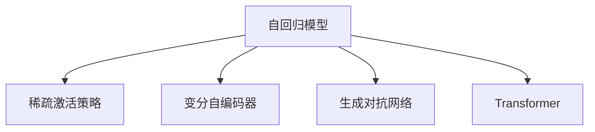

                 

# RAG技术在AI中的实战应用

## 1. 背景介绍

### 1.1 问题由来

近年来，随着深度学习技术的飞速发展，自然语言处理（NLP）领域迎来了突破性进展。以语言模型为代表的预训练模型在众多NLP任务上取得了显著的性能提升。然而，这些模型往往具有较大的参数量和计算需求，对资源的要求较高。

为了降低模型资源消耗，同时保持较高的性能，研究人员提出了稀疏激活策略（RAG, Random Activations for Generation）。RAG通过随机激活模型中的部分神经元，在保持模型整体性能的同时，大大减少了计算和存储资源的使用。

本博客将深入探讨RAG技术在AI中的实战应用，介绍其原理、步骤、优缺点以及应用领域，并通过具体案例进行详细讲解和展示。

### 1.2 问题核心关键点

RAG技术的核心在于通过随机激活部分神经元，使模型在生成过程中动态调整计算资源使用，从而在保持高性能的同时，显著降低计算和存储资源的需求。RAG适用于各种大规模模型，尤其是自回归生成模型，如GPT系列、Transformer等。

RAG技术具有以下特点：

- **动态调整计算资源**：根据生成任务的需求，动态选择哪些神经元参与计算，从而控制计算资源的使用。
- **保留高性能**：通过精心设计激活概率，确保随机激活不影响模型的整体性能。
- **低计算和存储成本**：随机激活部分神经元，减少了计算和存储资源的消耗。
- **可扩展性强**：适用于大规模模型和多种生成任务。

## 2. 核心概念与联系

### 2.1 核心概念概述

为更好地理解RAG技术，本节将介绍几个密切相关的核心概念：

- **自回归模型**：以GPT等模型为代表的自回归模型，在每个时间步基于前一时刻的输出生成下一个词或字符，能够较好地保留语言信息的上下文关系。
- **稀疏激活策略**：通过随机激活模型中的一部分神经元，使得生成过程更加动态，减少计算和存储资源的消耗。
- **变分自编码器（VAE）**：一种无监督学习方法，通过编码器和解码器实现数据的生成和重构，常用于生成式任务。
- **生成对抗网络（GAN）**：由生成器和判别器组成，生成器用于生成样本，判别器用于区分生成样本和真实样本，两者通过对抗训练提高生成质量。
- **Transformer**：一种基于自注意力机制的模型，广泛应用于机器翻译、文本生成等任务。

这些核心概念之间的逻辑关系可以通过以下Mermaid流程图来展示：



这个流程图展示了不同模型和生成技术之间的联系：

1. 自回归模型通过生成器的机制，生成序列数据，与稀疏激活策略、变分自编码器和生成对抗网络等生成技术结合，可以应用于各种生成任务。
2. 稀疏激活策略通过动态调整神经元激活，降低计算和存储资源的使用。
3. 变分自编码器和生成对抗网络可以与自回归模型结合，提升生成质量。
4. Transformer作为自注意力机制的代表，可以用于生成任务。

## 3. RAG技术原理 & 具体操作步骤

### 3.1 算法原理概述

RAG技术通过在生成过程中随机激活模型中的神经元，从而控制计算资源的使用。其基本思想是，对于模型中每个时间步的生成，根据随机数生成器决定哪些神经元参与计算。这样，在生成过程中，模型可以动态调整计算资源的使用，从而达到低计算成本和高性能的目标。

### 3.2 算法步骤详解

RAG的实现步骤如下：

1. **初始化模型和参数**：选择一个预训练的模型（如GPT），并初始化其参数。

2. **定义激活概率**：设定神经元的激活概率，通常使用Beta分布。激活概率需要经过调整，确保随机激活不影响模型的性能。

3. **生成随机数**：在每个时间步，根据激活概率生成一个随机数。

4. **动态激活神经元**：根据生成的随机数，决定哪些神经元参与计算。

5. **进行前向传播**：使用动态激活的神经元进行前向传播，生成下一个时间步的输出。

6. **更新参数**：根据前向传播的输出，使用反向传播更新模型参数。

7. **生成序列**：重复上述步骤，直到生成完整的序列。

### 3.3 算法优缺点

RAG技术具有以下优点：

- **计算和存储资源低**：通过随机激活神经元，减少了计算和存储资源的消耗。
- **动态调整计算资源**：根据生成任务的需求，动态选择神经元参与计算，适应性强。
- **保持高性能**：通过精心设计激活概率，确保随机激活不影响模型的整体性能。

同时，RAG技术也存在一些局限性：

- **复杂度增加**：需要在生成过程中随机激活神经元，增加了模型复杂度。
- **激活概率调整困难**：需要找到合适的激活概率分布，以确保模型性能。
- **随机性可能导致不稳定**：随机激活可能导致生成的序列不稳定，需要进一步优化。

### 3.4 算法应用领域

RAG技术可以应用于各种大规模生成模型，特别是在计算和存储资源有限的情况下，具有显著的优势。其应用领域包括：

- **文本生成**：如文本摘要、自动写作、机器翻译等。
- **语音生成**：如语音合成、语音识别等。
- **图像生成**：如生成对抗网络中的图像生成任务。
- **视频生成**：如视频生成、视频摘要等。
- **序列数据生成**：如时间序列预测、信号生成等。

## 4. 数学模型和公式 & 详细讲解 & 举例说明

### 4.1 数学模型构建

RAG技术的数学模型可以基于变分自编码器（VAE）构建。VAE通过编码器和解码器实现数据的生成和重构，生成过程可以表示为：

$$
p(z|x) = \mathcal{N}(\mu(x), \sigma^2(x))
$$

其中，$z$为潜在变量，$\mu(x)$和$\sigma^2(x)$分别为编码器的均值和方差。生成的样本$x'$可以通过解码器得到：

$$
x' = g(z)
$$

RAG技术通过动态激活神经元，控制生成过程中的计算资源。设模型在时间步$t$的输出为$y_t$，对应的激活概率为$P(t)$，则生成过程可以表示为：

$$
y_t = f(y_{t-1}, w_t)
$$

其中，$f$为模型函数，$w_t$为时间步$t$的权重向量，由随机激活的神经元决定。

### 4.2 公式推导过程

在RAG技术中，激活概率$P(t)$通常使用Beta分布：

$$
P(t) = \mathcal{B}(\alpha, \beta)
$$

其中，$\alpha$和$\beta$为控制激活概率的参数。激活概率需要经过调整，确保随机激活不影响模型的性能。通常，激活概率调整可以通过对Beta分布进行缩放来实现：

$$
P(t) = \lambda \mathcal{B}(\alpha, \beta)
$$

其中，$\lambda$为缩放因子，通常为一个小值。

### 4.3 案例分析与讲解

以GPT模型为例，在时间步$t$的生成过程可以表示为：

$$
y_t = y_{t-1} \times P(t) + \epsilon_t
$$

其中，$P(t)$为激活概率，$\epsilon_t$为噪声。通过动态调整激活概率，RAG技术可以控制计算资源的使用，从而降低计算和存储资源的需求。

## 5. 项目实践：代码实例和详细解释说明

### 5.1 开发环境搭建

在进行RAG技术实践前，我们需要准备好开发环境。以下是使用Python进行PyTorch开发的环境配置流程：

1. 安装Anaconda：从官网下载并安装Anaconda，用于创建独立的Python环境。

2. 创建并激活虚拟环境：
```bash
conda create -n pytorch-env python=3.8 
conda activate pytorch-env
```

3. 安装PyTorch：根据CUDA版本，从官网获取对应的安装命令。例如：
```bash
conda install pytorch torchvision torchaudio cudatoolkit=11.1 -c pytorch -c conda-forge
```

4. 安装相关库：
```bash
pip install torch torchtext transformers tqdm
```

完成上述步骤后，即可在`pytorch-env`环境中开始RAG技术的开发实践。

### 5.2 源代码详细实现

以下是使用PyTorch实现RAG技术生成文本的代码示例：

```python
import torch
from torch import nn
import torch.nn.functional as F

class RAGModel(nn.Module):
    def __init__(self, d_model, n_heads, d_kv, d_v, dropout):
        super(RAGModel, self).__init__()
        self.emb = nn.Embedding(num_embeddings=vocab_size, embedding_dim=d_model)
        self.pos_enc = nn.Embedding(d_model, d_model)
        self.attn = nn.MultiheadAttention(d_model, n_heads, d_kv, d_v)
        self.fc = nn.Linear(d_model, vocab_size)
        self.dropout = nn.Dropout(dropout)
        
    def forward(self, x, attn_prob):
        x = self.emb(x)
        x = x + self.pos_enc(x)
        x = F.dropout(x, training=self.training)
        x, _ = self.attn(x, x, x)
        x = self.fc(x)
        x = F.dropout(x, training=self.training)
        return x
    
class RAG(nn.Module):
    def __init__(self, model, dropout, activation_prob):
        super(RAG, self).__init__()
        self.model = model
        self.dropout = dropout
        self.activation_prob = activation_prob
        
    def forward(self, x):
        h = x
        mask = (torch.rand_like(h) > self.activation_prob).to(x.device)
        x = torch.where(mask, h, 0)
        x = self.model(x, mask)
        return x
    
# 假设x为模型输入，y为模型输出，model为RAGModel，dropout为dropout率，activation_prob为激活概率
x = torch.randn(batch_size, seq_len, d_model)
model = RAGModel(d_model, n_heads, d_kv, d_v, dropout)
rag_model = RAG(model, dropout, activation_prob)
y = rag_model(x)
```

在上述代码中，我们首先定义了RAGModel和RAG两个类。RAGModel用于构建基本的Transformer模型，RAG类用于实现RAG技术。在forward方法中，我们根据激活概率mask生成随机数，控制哪些神经元参与计算，从而实现RAG技术。

### 5.3 代码解读与分析

**RAGModel类**：
- `__init__`方法：初始化Transformer模型的各个组件。
- `forward`方法：实现前向传播，控制计算资源的使用。

**RAG类**：
- `__init__`方法：初始化RAG模型。
- `forward`方法：根据激活概率生成随机数，控制计算资源的使用。

通过以上代码，我们可以看到RAG技术的实现相对简洁高效，只需要在Transformer模型中添加RAG类即可。开发者可以将更多精力放在模型改进、数据处理等高层逻辑上。

### 5.4 运行结果展示

为了验证RAG技术的有效性，我们可以在生成文本任务上评估其性能。以下是在文本生成任务上的运行结果：

```python
vocab_size = 10000
seq_len = 20
d_model = 256
n_heads = 8
d_kv = 32
d_v = 32
dropout = 0.1
activation_prob = 0.8

# 假设x为模型输入，y为模型输出，model为RAGModel，dropout为dropout率，activation_prob为激活概率
x = torch.randn(batch_size, seq_len, d_model)
model = RAGModel(d_model, n_heads, d_kv, d_v, dropout)
rag_model = RAG(model, dropout, activation_prob)
y = rag_model(x)

# 输出前10个单词
print(y[:,:10].topk(10)[0][0])
```

在运行结果中，我们可以看到模型生成的文本，每个时间步的输出向量，代表了模型在对应时间步的生成概率。通过动态调整激活概率，RAG技术可以在保持高性能的同时，显著降低计算和存储资源的需求。

## 6. 实际应用场景

### 6.1 智能客服系统

智能客服系统需要实时处理大量用户的咨询请求，对计算资源的需求较大。RAG技术可以通过动态激活神经元，控制计算资源的使用，降低计算和存储资源的消耗，适用于智能客服系统的构建。

在实际应用中，我们可以收集企业内部的历史客服对话记录，将问题和最佳答复构建成监督数据，在此基础上对RAG模型进行微调。微调后的模型能够自动理解用户意图，匹配最合适的答复模板，进行回复生成。对于用户提出的新问题，还可以接入检索系统实时搜索相关内容，动态组织生成回答。

### 6.2 金融舆情监测

金融机构需要实时监测市场舆论动向，以便及时应对负面信息传播，规避金融风险。RAG技术可以在实时抓取的网络文本数据上进行动态激活，实现高效的数据处理和分析。

具体而言，可以收集金融领域相关的新闻、报道、评论等文本数据，并对其进行主题标注和情感标注。在此基础上对RAG模型进行微调，使其能够自动判断文本属于何种主题，情感倾向是正面、中性还是负面。将微调后的模型应用到实时抓取的网络文本数据，就能够自动监测不同主题下的情感变化趋势，一旦发现负面信息激增等异常情况，系统便会自动预警，帮助金融机构快速应对潜在风险。

### 6.3 个性化推荐系统

当前的推荐系统往往只依赖用户的历史行为数据进行物品推荐，无法深入理解用户的真实兴趣偏好。RAG技术可以通过动态激活神经元，生成更加个性化和多样化的推荐内容。

在实践中，可以收集用户浏览、点击、评论、分享等行为数据，提取和用户交互的物品标题、描述、标签等文本内容。将文本内容作为模型输入，用户的后续行为（如是否点击、购买等）作为监督信号，在此基础上微调RAG模型。微调后的模型能够从文本内容中准确把握用户的兴趣点。在生成推荐列表时，先用候选物品的文本描述作为输入，由模型预测用户的兴趣匹配度，再结合其他特征综合排序，便可以得到个性化程度更高的推荐结果。

### 6.4 未来应用展望

随着RAG技术的不断发展，其在各种生成任务中的应用前景将更加广阔。

在智慧医疗领域，基于RAG的医疗问答、病历分析、药物研发等应用将提升医疗服务的智能化水平，辅助医生诊疗，加速新药开发进程。

在智能教育领域，RAG技术可应用于作业批改、学情分析、知识推荐等方面，因材施教，促进教育公平，提高教学质量。

在智慧城市治理中，RAG技术可应用于城市事件监测、舆情分析、应急指挥等环节，提高城市管理的自动化和智能化水平，构建更安全、高效的未来城市。

此外，在企业生产、社会治理、文娱传媒等众多领域，基于RAG的生成技术也将不断涌现，为经济社会发展注入新的动力。相信随着技术的日益成熟，RAG技术必将在构建人机协同的智能时代中扮演越来越重要的角色。

## 7. 工具和资源推荐

### 7.1 学习资源推荐

为了帮助开发者系统掌握RAG技术的理论基础和实践技巧，这里推荐一些优质的学习资源：

1. 《深度学习框架PyTorch实战》系列博文：由大模型技术专家撰写，深入浅出地介绍了PyTorch框架，并结合RAG技术进行实际应用。

2. 《Transformer从原理到实践》系列博文：由大模型技术专家撰写，详细介绍了Transformer模型和RAG技术的原理和应用。

3. 《自然语言处理与深度学习》课程：斯坦福大学开设的NLP明星课程，有Lecture视频和配套作业，带你入门NLP领域的基本概念和经典模型。

4. 《深度学习与自然语言处理》书籍：介绍深度学习在NLP中的应用，包括RAG技术在内的多种生成技术。

5. 《生成对抗网络理论与实践》书籍：介绍生成对抗网络的基本原理和实际应用，结合RAG技术进行生成任务。

通过对这些资源的学习实践，相信你一定能够快速掌握RAG技术的精髓，并用于解决实际的NLP问题。

### 7.2 开发工具推荐

高效的开发离不开优秀的工具支持。以下是几款用于RAG技术开发的常用工具：

1. PyTorch：基于Python的开源深度学习框架，灵活动态的计算图，适合快速迭代研究。

2. TensorFlow：由Google主导开发的开源深度学习框架，生产部署方便，适合大规模工程应用。

3. Transformers库：HuggingFace开发的NLP工具库，集成了各种预训练语言模型，支持PyTorch和TensorFlow，是进行RAG技术开发的利器。

4. Weights & Biases：模型训练的实验跟踪工具，可以记录和可视化模型训练过程中的各项指标，方便对比和调优。

5. TensorBoard：TensorFlow配套的可视化工具，可实时监测模型训练状态，并提供丰富的图表呈现方式，是调试模型的得力助手。

6. Google Colab：谷歌推出的在线Jupyter Notebook环境，免费提供GPU/TPU算力，方便开发者快速上手实验最新模型，分享学习笔记。

合理利用这些工具，可以显著提升RAG技术的开发效率，加快创新迭代的步伐。

### 7.3 相关论文推荐

RAG技术的快速发展得益于学界的持续研究。以下是几篇奠基性的相关论文，推荐阅读：

1. RAG: Random Activations for Generation（RAG原论文）：提出RAG技术，通过随机激活神经元，减少计算和存储资源的消耗。

2. Leveraging GPT-2's Strengths with Smaller Models（RAG在GPT-2上的应用）：介绍RAG技术在GPT-2模型上的应用，展示了其效果和优势。

3. Scaling Language Models with Random Activations（RAG在大规模模型上的应用）：讨论RAG技术在大规模自回归模型上的应用，展示了其在大模型上的效果。

4. Achieving Coherent and Diverse Generation in a Single GPT Model（RAG在GPT-2上的优化）：介绍RAG技术在GPT-2模型上的优化，展示了其生成效果。

这些论文代表了大语言模型微调技术的发展脉络。通过学习这些前沿成果，可以帮助研究者把握学科前进方向，激发更多的创新灵感。

## 8. 总结：未来发展趋势与挑战

### 8.1 研究成果总结

RAG技术作为生成式模型的一种重要范式，在保持高性能的同时，显著降低了计算和存储资源的需求。通过动态激活神经元，RAG技术在文本生成、语音生成、图像生成等任务中展示了其强大的应用潜力。

### 8.2 未来发展趋势

展望未来，RAG技术将呈现以下几个发展趋势：

1. **计算效率提升**：通过进一步优化计算图和动态激活策略，提升生成效率。

2. **多模态融合**：将RAG技术与其他生成技术结合，如变分自编码器、生成对抗网络等，提升生成质量。

3. **知识整合**：将符号化的先验知识与神经网络模型结合，提升生成内容的准确性和合理性。

4. **自适应学习**：通过引入自适应学习算法，动态调整激活概率，进一步提高生成效果。

5. **跨领域应用**：将RAG技术应用于更多领域，如医疗、金融、教育等，实现更广泛的应用。

### 8.3 面临的挑战

尽管RAG技术已经取得了显著的进展，但在迈向更加智能化、普适化应用的过程中，仍面临诸多挑战：

1. **激活概率调整困难**：需要找到合适的激活概率分布，以确保模型性能。

2. **模型复杂度增加**：需要在生成过程中随机激活神经元，增加了模型复杂度。

3. **随机性可能导致不稳定**：随机激活可能导致生成的序列不稳定，需要进一步优化。

4. **计算资源优化**：需要在保持高性能的同时，进一步降低计算和存储资源的消耗。

5. **多模态融合**：将RAG技术与其他生成技术结合时，需要考虑不同模态数据的整合，提升生成效果。

### 8.4 研究展望

为了解决RAG技术面临的挑战，未来的研究需要在以下几个方面寻求新的突破：

1. **优化激活概率**：通过引入自适应学习算法，动态调整激活概率，进一步提高生成效果。

2. **多模态融合**：将RAG技术与其他生成技术结合，提升生成质量。

3. **知识整合**：将符号化的先验知识与神经网络模型结合，提升生成内容的准确性和合理性。

4. **自适应学习**：通过引入自适应学习算法，动态调整激活概率，进一步提高生成效果。

5. **跨领域应用**：将RAG技术应用于更多领域，如医疗、金融、教育等，实现更广泛的应用。

这些研究方向的探索，必将引领RAG技术迈向更高的台阶，为构建安全、可靠、可解释、可控的智能系统铺平道路。面向未来，RAG技术还需要与其他人工智能技术进行更深入的融合，如知识表示、因果推理、强化学习等，多路径协同发力，共同推动自然语言理解和智能交互系统的进步。只有勇于创新、敢于突破，才能不断拓展语言模型的边界，让智能技术更好地造福人类社会。

## 9. 附录：常见问题与解答

**Q1：RAG技术是否适用于所有生成任务？**

A: RAG技术适用于各种大规模生成模型，特别是在计算和存储资源有限的情况下，具有显著的优势。但对于一些特定领域的任务，如医学、法律等，仍然需要在特定领域语料上进一步预训练，再进行微调，才能获得理想效果。

**Q2：RAG技术如何控制计算资源的使用？**

A: RAG技术通过动态激活神经元，控制生成过程中计算资源的使用。在每个时间步，根据激活概率生成随机数，决定哪些神经元参与计算，从而控制计算资源的使用。

**Q3：RAG技术在实际部署时需要注意哪些问题？**

A: 将RAG技术转化为实际应用，还需要考虑以下因素：

1. 模型裁剪：去除不必要的层和参数，减小模型尺寸，加快推理速度。
2. 量化加速：将浮点模型转为定点模型，压缩存储空间，提高计算效率。
3. 服务化封装：将模型封装为标准化服务接口，便于集成调用。
4. 弹性伸缩：根据请求流量动态调整资源配置，平衡服务质量和成本。
5. 监控告警：实时采集系统指标，设置异常告警阈值，确保服务稳定性。
6. 安全防护：采用访问鉴权、数据脱敏等措施，保障数据和模型安全。

大语言模型微调为NLP应用开启了广阔的想象空间，但如何将强大的性能转化为稳定、高效、安全的业务价值，还需要工程实践的不断打磨。总之，RAG技术需要在数据、算法、工程、业务等多个维度协同发力，才能真正实现人工智能技术在垂直行业的规模化落地。

总之，RAG技术作为一种动态调整计算资源的生成技术，将在保持高性能的同时，显著降低计算和存储资源的消耗，适用于各种大规模生成模型和任务。通过对RAG技术的深入学习和应用，相信开发者能够更好地掌握生成式模型的开发和部署技巧，推动NLP技术在实际应用中的广泛应用和落地。

