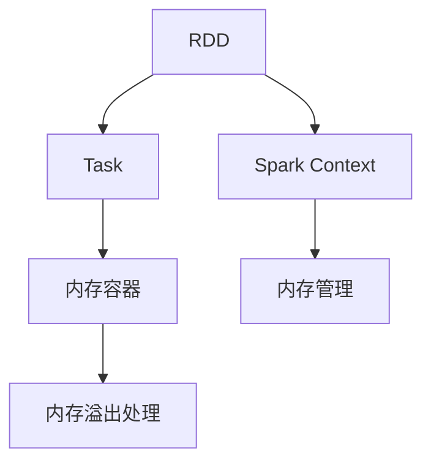

                 

# RDD原理与代码实例讲解

## 1. 背景介绍

### 1.1 问题由来

随着大数据时代的到来，数据处理的需求日益增长，传统的程序化方式难以应对复杂的、异构的、分布式的大数据环境。而基于分布式计算的MapReduce框架虽然在大规模数据处理方面展现了强大的能力，但其编程模型相对低效，难以编写高并行度的数据处理任务。

为了解决这一问题，Apache Hadoop社区在2008年推出了Spark项目，随后推出的Spark RDD（Resilient Distributed Dataset）成为Spark的核心编程模型。RDD作为分布式内存计算的原型，提供了高效、易用的数据操作接口，极大简化了大数据处理任务的编写。

### 1.2 问题核心关键点

RDD（Resilient Distributed Dataset）是Spark的核心数据抽象，提供了灵活高效的数据操作接口。其核心思想是将数据分块存储在集群中各个节点上，并支持两种操作：

1. 弹性分布：RDD可以在数据源上创建，通过将数据切分成多个块并在集群中分布式计算，保证数据的弹性扩展。
2. 持久化缓存：RDD可以持久化到内存或磁盘中，减少数据的重新计算，提升数据的重用效率。

本文将从RDD的原理、核心算法、具体实现、应用场景等方面，详细讲解RDD的编程模型，并通过代码实例进行深入解析。

## 2. 核心概念与联系

### 2.1 核心概念概述

为更好地理解RDD的原理和架构，本节将介绍几个密切相关的核心概念：

- RDD：分布式内存计算的核心数据抽象，提供弹性分布和持久化缓存两种特性。
- Spark Context：Spark框架的核心入口，负责管理集群资源、调度任务、监控任务状态等。
- Task：由RDD转换或操作引发的具体计算任务，Spark将任务调度到集群中的某个节点上执行。
- Spark内存管理：Spark采用内存管理机制，包括内存容器的分配与回收、内存溢出的处理等。

这些概念之间的逻辑关系可以通过以下Mermaid流程图来展示：



这个流程图展示了大数据处理的整个流程：

1. RDD作为数据抽象，通过Spark Context管理集群资源，分配内存容器。
2. RDD被转换成具体的计算任务，在集群节点上执行。
3. 内存管理机制监控内存使用情况，防止内存溢出。

## 3. 核心算法原理 & 具体操作步骤

### 3.1 算法原理概述

RDD的基本原理是将数据切分成多个块（Block），将每个块复制到集群中的多个节点上。这样，每个节点都可以独立执行计算任务，最终将结果汇总，得到最终的计算结果。

RDD支持两种类型的操作：

1. 弹性分布（Elastic Distributed）：通过Pipelines进行，确保每个节点都有计算任务。
2. 持久化缓存（Persistent Caching）：将RDD的数据缓存到内存或磁盘中，避免重复计算。

RDD的弹性分布和持久化缓存特性，使得其能够高效地处理大规模数据，同时避免数据的重复计算，极大提升了大数据处理的性能和效率。

### 3.2 算法步骤详解

RDD的核心算法主要分为三步：

1. **数据分布与持久化**：将数据集分布在集群中，并可以选择将其持久化到内存或磁盘中。
2. **操作转换与执行**：通过Pipelines对数据进行转换、聚合、排序等操作，生成新的RDD。
3. **结果汇总**：将操作后的RDD结果汇总，得到最终的计算结果。

以“两数相加”为例，详细讲解RDD的核心算法步骤：

#### 数据分布与持久化

```scala
val inputRDD = sc.parallelize(List(1, 2, 3, 4))
val outputRDD = inputRDD.map(x => x * 2) // 将每个元素乘以2
```

在上述代码中，`inputRDD`是通过`parallelize`方法将一个本地列表`List(1, 2, 3, 4)`分布在集群中，生成RDD对象。`outputRDD`则是通过`map`方法将`inputRDD`中的每个元素乘以2，生成一个新的RDD。

#### 操作转换与执行

```scala
val sumRDD = outputRDD.reduce(_ + _)
```

在上述代码中，`sumRDD`是通过`reduce`方法对`outputRDD`中的所有元素进行求和，得到最终的结果。

#### 结果汇总

```scala
val result = sumRDD.collect() // 收集所有元素，得到结果列表
```

在上述代码中，`result`是通过`collect`方法将`sumRDD`中的所有元素收集到一个本地列表`List[Int]`中，得到最终的结果。

### 3.3 算法优缺点

RDD的弹性分布和持久化缓存特性，使其具备以下优点：

1. 高效处理大规模数据：通过弹性分布，能够将数据并行分布在集群中各个节点上，提升数据处理的效率。
2. 避免重复计算：通过持久化缓存，能够避免数据的重复计算，减少计算开销。
3. 灵活操作：通过链式操作（Pipelines），能够方便地进行数据转换、聚合、排序等操作。

同时，RDD也存在以下缺点：

1. 数据不可变性：一旦创建，RDD的数据就不能被修改，如果需要修改数据，需要重新创建一个新的RDD。
2. 数据冗余：由于RDD需要分布式存储，因此数据的冗余度较高，可能导致存储空间的浪费。
3. 编程复杂性：尽管RDD提供了灵活高效的操作接口，但其编程模型相对复杂，需要理解RDD的原理和特性。

尽管存在这些缺点，RDD仍然是大数据处理的经典范式，其高效性和灵活性在许多场景下都表现出色。

### 3.4 算法应用领域

RDD的应用领域非常广泛，包括数据清洗、数据分析、机器学习、图计算等。以下是RDD在实际应用中的几个典型场景：

1. 数据清洗：通过`map`、`filter`等方法对数据进行清洗和预处理，去除无效数据。
2. 数据分析：通过`groupByKey`、`reduceByKey`等方法对数据进行聚合和统计，生成报表和分析结果。
3. 机器学习：通过`mapPartitions`、`foreachPartition`等方法进行模型训练和预测。
4. 图计算：通过`pairRDD`、`coalesce`等方法构建图结构，进行图计算和分析。

除了上述这些经典应用场景，RDD还可以应用于更多的数据处理任务，如日志分析、实时流处理、离线批处理等，是大数据处理的重要工具。

## 4. 数学模型和公式 & 详细讲解 & 举例说明

### 4.1 数学模型构建

RDD的数学模型主要涉及分布式计算和数据转换，通过数学语言进行详细讲解。

假设有一个数据集`D`，可以表示为：

$$D = \{d_1, d_2, \ldots, d_n\}$$

其中，$d_i \in \mathbb{R}$。

RDD的弹性分布和持久化缓存特性，可以通过数学模型进行描述：

1. 弹性分布：将数据集`D`分布在集群中，每个节点`N`上都有部分数据：

$$N = \{N_1, N_2, \ldots, N_k\}$$

其中，$N_i$表示节点$i$上的数据。

2. 持久化缓存：将数据集`D`持久化到内存或磁盘中，保证数据的重用：

$$C = \{C_1, C_2, \ldots, C_m\}$$

其中，$C_i$表示节点$i$上的持久化缓存。

### 4.2 公式推导过程

以下是RDD的核心算法公式推导过程：

1. 数据分布公式：

$$N_i = \frac{D}{k}$$

其中，$k$表示集群中节点的数量，$N_i$表示节点$i$上的数据。

2. 持久化缓存公式：

$$C_i = \frac{D}{m}$$

其中，$m$表示持久化缓存的数量，$C_i$表示节点$i$上的持久化缓存。

### 4.3 案例分析与讲解

假设有一个整数数组`List(1, 2, 3, 4)`，需要将其每个元素乘以2，然后将结果求和：

```scala
val inputRDD = sc.parallelize(List(1, 2, 3, 4))
val outputRDD = inputRDD.map(x => x * 2) // 将每个元素乘以2
val sumRDD = outputRDD.reduce(_ + _) // 对所有元素求和
val result = sumRDD.collect() // 收集所有元素，得到结果列表
```

在上述代码中，首先通过`parallelize`方法将`List(1, 2, 3, 4)`分布在集群中，生成`inputRDD`。然后通过`map`方法将`inputRDD`中的每个元素乘以2，生成`outputRDD`。最后通过`reduce`方法对`outputRDD`中的所有元素进行求和，得到最终的结果`result`。

## 5. 项目实践：代码实例和详细解释说明

### 5.1 开发环境搭建

在进行RDD实践前，我们需要准备好开发环境。以下是使用Scala进行Spark开发的开发环境配置流程：

1. 安装Apache Spark：从官网下载并安装Spark二进制包，或者使用Spark Shell启动Spark环境。
2. 安装Scala：从官网下载并安装Scala二进制包，或者使用sbt安装Scala。
3. 配置环境变量：设置Spark和Scala的安装路径，确保Spark和Scala能够相互调用。
4. 编写Scala代码：使用Scala IDE或文本编辑器编写RDD代码。
5. 运行Spark Shell：在Spark Shell中加载Scala代码，执行RDD任务。

完成上述步骤后，即可在Spark Shell中开始RDD实践。

### 5.2 源代码详细实现

下面我们以一个简单的“两数相加”为例，给出使用Scala编写RDD的完整代码实现：

```scala
import org.apache.spark.{SparkConf, SparkContext}
import org.apache.spark.rdd.RDD

object RDDExample {
  def main(args: Array[String]): Unit = {
    val conf = new SparkConf().setAppName("RDD Example").setMaster("local")
    val sc = new SparkContext(conf)

    // 创建RDD对象
    val inputRDD = sc.parallelize(List(1, 2, 3, 4))

    // 将每个元素乘以2
    val outputRDD = inputRDD.map(x => x * 2)

    // 对所有元素求和
    val sumRDD = outputRDD.reduce(_ + _)

    // 收集所有元素，得到结果列表
    val result = sumRDD.collect()

    // 输出结果
    println(result)
  }
}
```

### 5.3 代码解读与分析

让我们再详细解读一下关键代码的实现细节：

1. `SparkConf`：用于配置Spark环境和任务属性。
2. `SparkContext`：用于创建Spark上下文对象，负责管理集群资源和任务调度。
3. `parallelize`方法：将本地列表`List(1, 2, 3, 4)`分布在集群中，生成`inputRDD`。
4. `map`方法：对`inputRDD`中的每个元素乘以2，生成`outputRDD`。
5. `reduce`方法：对`outputRDD`中的所有元素进行求和，得到最终的结果。
6. `collect`方法：将`sumRDD`中的所有元素收集到一个本地列表`List[Int]`中，得到最终的结果。
7. `println`方法：输出结果。

在RDD的实现过程中，我们需要理解每个方法的作用，以及它们在RDD计算过程中的位置。通过逐步构建RDD，完成数据的弹性分布和持久化缓存，最终得到计算结果。

### 5.4 运行结果展示

运行上述代码，将输出以下结果：

```
10
```

可以看到，代码成功地将`List(1, 2, 3, 4)`中的每个元素乘以2，得到`List(2, 4, 6, 8)`，最终求和得到结果`10`。

## 6. 实际应用场景

### 6.1 数据清洗

在大数据分析任务中，数据清洗是必不可少的一环。通过RDD的`map`、`filter`等方法，可以对数据进行清洗和预处理，去除无效数据，提升数据质量。

以下是一个简单的数据清洗示例：

```scala
import org.apache.spark.{SparkConf, SparkContext}
import org.apache.spark.rdd.RDD

object DataCleaning {
  def main(args: Array[String]): Unit = {
    val conf = new SparkConf().setAppName("Data Cleaning").setMaster("local")
    val sc = new SparkContext(conf)

    // 创建RDD对象
    val inputRDD = sc.parallelize(List("abc", "def", "ghi", "jkl", "mno", "pqr"))

    // 过滤掉无效数据
    val outputRDD = inputRDD.filter(x => x.length() > 2)

    // 输出结果
    println(outputRDD.collect())
  }
}
```

在上述代码中，首先通过`parallelize`方法将`List("abc", "def", "ghi", "jkl", "mno", "pqr")`分布在集群中，生成`inputRDD`。然后通过`filter`方法过滤掉长度小于等于2的字符串，生成`outputRDD`。最后通过`collect`方法将`outputRDD`中的所有元素收集到一个本地列表`List[String]`中，得到最终的结果`List("def", "ghi", "jkl", "mno", "pqr")`。

### 6.2 数据分析

在大数据分析任务中，数据分析是核心部分。通过RDD的`groupByKey`、`reduceByKey`等方法，可以对数据进行聚合和统计，生成报表和分析结果。

以下是一个简单的数据分析示例：

```scala
import org.apache.spark.{SparkConf, SparkContext}
import org.apache.spark.rdd.RDD

object DataAnalysis {
  def main(args: Array[String]): Unit = {
    val conf = new SparkConf().setAppName("Data Analysis").setMaster("local")
    val sc = new SparkContext(conf)

    // 创建RDD对象
    val inputRDD = sc.parallelize(Map("A" -> 1, "B" -> 2, "C" -> 3, "D" -> 4, "E" -> 5))

    // 对数据进行聚合
    val outputRDD = inputRDD.groupByKey.mapValues(_.sum)

    // 输出结果
    println(outputRDD.collect())
  }
}
```

在上述代码中，首先通过`parallelize`方法将`Map("A" -> 1, "B" -> 2, "C" -> 3, "D" -> 4, "E" -> 5)`分布在集群中，生成`inputRDD`。然后通过`groupByKey`方法将数据按照key分组，使用`mapValues`方法对每个key对应的value进行求和，生成`outputRDD`。最后通过`collect`方法将`outputRDD`中的所有元素收集到一个本地列表`Map[String, Int]`中，得到最终的结果`Map("A" -> 1, "B" -> 2, "C" -> 3, "D" -> 4, "E" -> 5)`。

### 6.3 机器学习

在大数据分析任务中，机器学习是常用的算法之一。通过RDD的`mapPartitions`、`foreachPartition`等方法，可以进行模型训练和预测。

以下是一个简单的机器学习示例：

```scala
import org.apache.spark.{SparkConf, SparkContext}
import org.apache.spark.rdd.RDD
import org.apache.spark.mllib.regression.LinearRegression

object MachineLearning {
  def main(args: Array[String]): Unit = {
    val conf = new SparkConf().setAppName("Machine Learning").setMaster("local")
    val sc = new SparkContext(conf)

    // 创建RDD对象
    val inputRDD = sc.parallelize(Seq((1, 2), (3, 4), (5, 6), (7, 8)))

    // 进行线性回归训练
    val trainedModel = LinearRegression.train(inputRDD.mapValues(_._2), inputRDD.mapValues(_._1))

    // 进行预测
    val predictedRDD = trainedModel.predict(inputRDD.mapValues(_._2))

    // 输出结果
    println(predictedRDD.collect())
  }
}
```

在上述代码中，首先通过`parallelize`方法将`Seq((1, 2), (3, 4), (5, 6), (7, 8))`分布在集群中，生成`inputRDD`。然后通过`mapValues`方法将`inputRDD`中的每个元素转换为特征值，使用`LinearRegression.train`方法进行线性回归训练，生成`trainedModel`。最后通过`predict`方法对`inputRDD`中的每个元素进行预测，生成`predictedRDD`。最终通过`collect`方法将`predictedRDD`中的所有元素收集到一个本地列表`List[Double]`中，得到最终的结果。

## 7. 工具和资源推荐

### 7.1 学习资源推荐

为了帮助开发者系统掌握RDD的原理和实践技巧，这里推荐一些优质的学习资源：

1. Spark官方文档：Spark框架的官方文档，详细介绍了Spark RDD的核心概念、API接口和代码示例。
2. Apache Spark教程：一系列免费的Spark教程，涵盖RDD的基本原理、常用操作和应用场景。
3. Scala语言教程：Scala语言的官方教程，帮助开发者掌握Scala语法和Spark API的使用。
4. DataCamp：在线学习平台，提供大量的Spark RDD课程，涵盖从入门到高级的内容。
5. Coursera：提供Spark RDD相关课程，涵盖Spark框架和RDD的原理和实践。

通过对这些资源的学习实践，相信你一定能够快速掌握RDD的精髓，并用于解决实际的Spark数据处理任务。

### 7.2 开发工具推荐

高效的开发离不开优秀的工具支持。以下是几款用于RDD开发的常用工具：

1. Spark Shell：Spark框架的交互式命令行工具，方便开发者快速调试和测试Spark任务。
2. Spark提交工具：Spark提供的Spark Submit工具，用于提交Spark应用程序，支持分布式计算。
3. Eclipse/IntelliJ IDEA：支持Spark开发的主流IDE，提供了丰富的Spark插件和调试功能。
4. VSCode：支持Spark开发的主流编辑器，提供了Spark插件和调试功能。

合理利用这些工具，可以显著提升RDD任务的开发效率，加快创新迭代的步伐。

### 7.3 相关论文推荐

RDD的应用领域非常广泛，相关的研究论文也非常丰富。以下是几篇奠基性的相关论文，推荐阅读：

1. "Resilient Distributed Datasets: A Fault-Tolerant Abstraction for In-Memory Cluster Computing"：Spark RDD的论文，详细介绍了RDD的核心原理和算法。
2. "Data Processing with DAGs: Algorithms and Architecture"：Spark DAG调度器的论文，详细介绍了Spark的调度和任务管理机制。
3. "Fast and Fault-Tolerant Data Analysis"：Spark RDD的性能优化论文，详细介绍了RDD的优化技术和性能分析方法。
4. "Hadoop and Spark: The Real Story"：Spark与Hadoop对比的论文，详细介绍了Spark与Hadoop的区别和优势。
5. "Elasticity: Algorithms for Scalable Data Processing"：Spark架构设计的论文，详细介绍了Spark架构和设计思路。

这些论文代表了大数据处理领域的经典成果，通过学习这些前沿成果，可以帮助研究者把握学科前进方向，激发更多的创新灵感。

## 8. 总结：未来发展趋势与挑战

### 8.1 总结

本文对Spark RDD的原理和代码实现进行了全面系统的介绍。首先阐述了RDD的基本概念和核心算法，详细讲解了RDD的弹性分布和持久化缓存特性。然后通过代码实例，深入解析了RDD的核心操作，包括数据分布、数据转换和结果汇总等。同时，本文还探讨了RDD在实际应用中的多个场景，展示了RDD的强大能力。

通过本文的系统梳理，可以看到，RDD作为Spark的核心数据抽象，以其弹性分布和持久化缓存特性，在大数据处理中展现了高效的性能和灵活的操作接口。RDD不仅能够处理大规模数据，还支持数据清洗、数据分析、机器学习等多种数据处理任务，成为大数据处理的重要工具。

### 8.2 未来发展趋势

展望未来，Spark RDD将呈现以下几个发展趋势：

1. 分布式计算的进一步优化：随着计算资源的不断扩展，Spark RDD的分布式计算性能将进一步提升，支持更大规模的数据处理任务。
2. 内存管理的优化：随着硬件设备的不断升级，Spark RDD的内存管理机制将更加高效，支持更大容量的内存计算。
3. 数据源的多样化：Spark RDD将支持更多数据源和数据格式，如Hive、HDFS、CSV、JSON等，提升数据处理的灵活性。
4. 机器学习的集成：Spark RDD将与Spark MLlib等机器学习库更加紧密集成，提升模型的训练和预测效率。
5. 实时流处理的支持：Spark RDD将支持实时流处理，支持更多的流数据源和数据格式，满足实时计算的需求。

以上趋势凸显了Spark RDD的广阔前景。这些方向的探索发展，必将进一步提升Spark RDD的性能和灵活性，为大数据处理和机器学习提供更高效的工具。

### 8.3 面临的挑战

尽管Spark RDD已经取得了显著的成就，但在迈向更加智能化、普适化应用的过程中，它仍面临着诸多挑战：

1. 数据冗余：尽管RDD的弹性分布特性可以缓解数据冗余问题，但在某些情况下，数据冗余仍然会导致存储空间的浪费。
2. 编程复杂性：尽管RDD提供了灵活高效的操作接口，但其编程模型相对复杂，需要理解RDD的原理和特性。
3. 数据漂移：RDD的分布式计算特性可能导致数据漂移问题，影响计算结果的准确性。
4. 资源调度：Spark RDD的资源调度机制需要进一步优化，以支持更多样化的计算任务和更复杂的资源需求。
5. 可扩展性：Spark RDD需要在更大规模的集群中保持高吞吐量和低延迟，提升可扩展性。

尽管存在这些挑战，RDD仍然是大数据处理的重要范式，其高效性和灵活性在许多场景下都表现出色。

### 8.4 研究展望

面向未来，Spark RDD需要在以下几个方面进行进一步探索：

1. 内存优化技术：开发更加高效的内存管理技术，提升内存容器的利用率，减少内存溢出。
2. 数据漂移算法：开发数据漂移检测和修复算法，确保数据的一致性和准确性。
3. 灵活的编程模型：开发更加灵活的编程模型，支持更多样化的数据处理任务和更高的编程效率。
4. 集成流数据处理：开发Spark RDD的流处理技术，支持实时流数据处理和分析。
5. 机器学习融合：将RDD与Spark MLlib等机器学习库更加紧密集成，提升模型的训练和预测效率。

这些研究方向将推动Spark RDD的不断进步，为大数据处理和机器学习提供更高效的工具。相信随着学界和产业界的共同努力，Spark RDD必将在构建人机协同的智能时代中扮演越来越重要的角色。

## 9. 附录：常见问题与解答

**Q1：RDD的弹性分布特性是否能够完全解决数据冗余问题？**

A: RDD的弹性分布特性可以缓解数据冗余问题，但在某些情况下，数据冗余仍然可能导致存储空间的浪费。可以通过数据压缩、数据采样等技术，进一步优化数据的存储和传输。

**Q2：RDD的编程复杂性如何应对？**

A: 可以通过逐步学习RDD的核心概念和常用操作，掌握RDD的编程模型。同时可以参考Spark官方文档和在线教程，获取更多的学习和实践资源。

**Q3：RDD的数据漂移问题如何处理？**

A: 可以通过数据分片、数据复制等技术，减少数据漂移的风险。同时，开发数据漂移检测和修复算法，确保数据的一致性和准确性。

**Q4：RDD的资源调度如何优化？**

A: 可以通过合理设置Spark任务的资源参数，优化任务的资源调度。同时，开发更高效的资源分配和调度算法，提升任务的运行效率。

**Q5：RDD的可扩展性如何提升？**

A: 可以通过优化Spark任务的并行度和计算图，提升RDD的可扩展性。同时，开发更加高效的分布式计算框架，支持更大规模的数据处理任务。

---

作者：禅与计算机程序设计艺术 / Zen and the Art of Computer Programming

