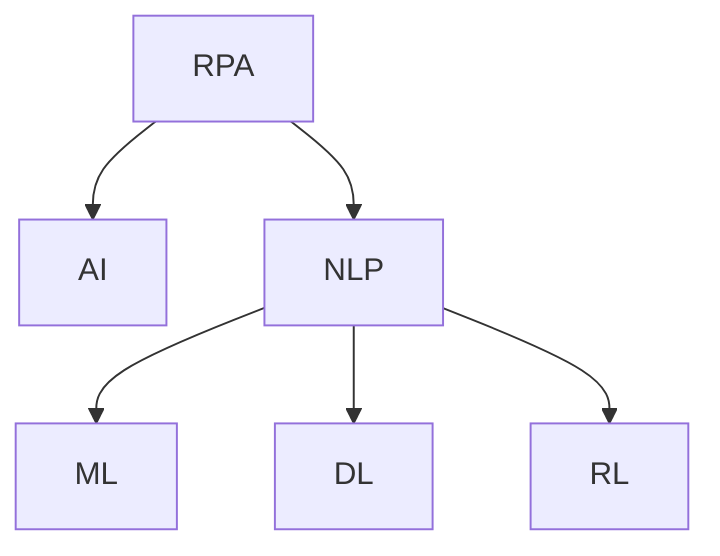

                 

# RPA 与 AI 的结合前景

## 1. 背景介绍

随着数字化转型的加速，企业对自动化和智能化的需求日益增长。RPA（Robotic Process Automation）和AI（Artificial Intelligence）作为两种热门的技术，各自在自动化和智能决策方面拥有显著优势。RPA擅长重复性高、规则明确的任务，而AI则擅长处理复杂的非结构化数据和进行高级决策。然而，单一的技术往往难以满足复杂多变的业务需求，将RPA和AI结合起来，可以大大提升企业的自动化和智能化水平。

### 1.1 问题由来
在数字化转型过程中，企业面临着诸多挑战，包括但不限于：
- 人工成本高昂：重复性、低价值的工作占用了大量人力资源，增加了企业成本。
- 数据处理复杂：海量、非结构化的数据需要进行清洗、分析、整合等处理，手动操作效率低下且容易出错。
- 决策困难：企业需要从复杂的数据中提取关键信息，进行高级决策，传统方法耗时耗力。
- 法规合规：企业需要应对不断变化的法律法规，手动合规检查成本高且容易遗漏。

### 1.2 问题核心关键点
RPA和AI的结合旨在构建更加智能、高效的自动化系统。这种结合主要体现在以下几个方面：
- **任务协同**：RPA处理规则明确的低价值任务，AI负责处理非结构化数据和复杂决策。
- **数据融合**：RPA提取数据，AI进行数据清洗、分析和预测。
- **智能决策**：RPA负责操作执行，AI根据分析结果进行智能决策。
- **自动化监测**：AI监测RPA操作过程，及时发现异常并纠正。

## 2. 核心概念与联系

### 2.1 核心概念概述

为更好地理解RPA与AI的结合，本节将介绍几个密切相关的核心概念：

- **RPA（Robotic Process Automation）**：通过软件机器人模拟人工操作，自动完成重复性高、规则明确的任务。常见的RPA任务包括数据录入、报表生成、发票处理等。
- **AI（Artificial Intelligence）**：模拟人类智能行为，通过算法和模型进行数据处理、分析和决策。常见的AI任务包括图像识别、自然语言处理、预测分析等。
- **自然语言处理（NLP）**：使计算机能够理解、处理和生成人类语言，是AI的一个重要分支。常见的NLP任务包括情感分析、机器翻译、文本分类等。
- **机器学习（ML）**：一种使计算机能够通过数据学习并改进性能的技术。常见的ML任务包括回归分析、分类、聚类等。
- **深度学习（DL）**：一种特殊类型的机器学习，使用深层神经网络模型进行学习和预测。常见的DL任务包括图像识别、语音识别、自然语言生成等。
- **强化学习（RL）**：通过试错和反馈，使计算机能够自我优化并学习最佳策略。常见的RL任务包括游戏AI、机器人控制等。

这些核心概念之间的逻辑关系可以通过以下Mermaid流程图来展示：



这个流程图展示了几类AI技术之间的联系及其与RPA的关系：

1. RPA处理低价值、规则明确的业务任务。
2. AI处理非结构化数据和复杂决策。
3. NLP处理语言数据，进行文本分类、情感分析等任务。
4. ML进行数据处理和模式识别。
5. DL用于处理复杂图像和声音数据。
6. RL用于自主优化和学习最佳策略。

## 3. 核心算法原理 & 具体操作步骤
### 3.1 算法原理概述

RPA与AI的结合，本质上是构建一个协同作业的自动化系统。其核心思想是：
- 将RPA作为AI的前置工具，完成数据收集和初步处理。
- 利用AI对处理后的数据进行深度分析和高级决策。
- 通过API接口将AI的结果反馈到RPA中，指导后续操作。

这种结合方式主要包括以下几个步骤：

1. **数据收集**：RPA从各种业务系统（如ERP、CRM、财务系统等）中提取数据，并将数据格式化为AI能够处理的形式。
2. **数据预处理**：AI对RPA提取的数据进行清洗、去重、填充缺失值等预处理操作。
3. **数据分析**：AI对预处理后的数据进行特征提取、模式识别和预测分析。
4. **决策支持**：AI根据分析结果，生成决策建议，指导RPA操作。
5. **自动执行**：RPA根据AI的建议，自动执行相关操作，并将结果反馈给AI进行下一步分析。

### 3.2 算法步骤详解

以下是RPA与AI结合的详细操作步骤：

**Step 1: 准备数据源**
- 收集业务系统中的数据，包括文本、图像、音视频等。
- 确定数据格式和规范，确保数据能够被RPA和AI系统处理。

**Step 2: 设计RPA流程**
- 根据业务需求，设计RPA流程，明确每个步骤的输入和输出。
- 选择合适的RPA工具和框架，如UiPath、Blue Prism、WorkFusion等。
- 编写RPA脚本，模拟人工操作步骤，进行数据提取和处理。

**Step 3: 构建AI模型**
- 选择合适的AI技术和算法，如深度学习、机器学习、强化学习等。
- 收集和标注数据，构建AI训练集。
- 设计AI模型架构，如卷积神经网络（CNN）、循环神经网络（RNN）、Transformer等。
- 训练AI模型，优化模型参数，提高准确性和泛化能力。

**Step 4: 集成RPA与AI**
- 通过API接口将AI模型嵌入RPA流程，实现数据传递和模型调用。
- 在RPA流程中加入AI的决策支持模块，根据AI建议调整操作。
- 设计异常检测和纠偏机制，确保RPA和AI协同高效运行。

**Step 5: 部署和监控**
- 将RPA和AI系统部署到生产环境中，进行全面测试。
- 实时监控系统性能，收集日志和异常信息，进行持续优化。
- 定期更新数据和模型，保持系统的最新状态。

### 3.3 算法优缺点

RPA与AI结合的协同自动化系统具有以下优点：
1. **效率提升**：自动化处理高价值任务，释放人工资源。
2. **准确性提高**：AI负责复杂决策，减少人为错误。
3. **数据驱动**：AI分析数据，发现业务洞察，驱动决策优化。
4. **成本节约**：减少人工干预，降低运营成本。
5. **灵活性增强**：根据业务需求动态调整RPA和AI流程，提升系统适应性。

同时，这种结合方式也存在一些局限：
1. **技术复杂**：需要同时掌握RPA和AI技术，对人才要求较高。
2. **数据质量**：数据提取和预处理质量直接影响系统性能。
3. **模型依赖**：AI模型的准确性和泛化能力对系统表现至关重要。
4. **系统集成**：RPA和AI的集成需要高质量的API接口和数据传递机制。
5. **维护成本**：系统复杂度增加，维护难度和成本也会相应上升。

### 3.4 算法应用领域

RPA与AI结合的协同自动化系统已经在多个领域得到广泛应用，包括但不限于：

- **金融服务**：自动化处理贷款申请、信用卡审批、风险管理等任务，提高审批效率和准确性。
- **医疗健康**：自动化处理患者登记、预约挂号、电子病历管理等任务，提高医疗服务质量。
- **制造业**：自动化处理订单管理、库存监控、质量检测等任务，提高生产效率和产品质量。
- **物流运输**：自动化处理货物追踪、配送路线优化、仓储管理等任务，提高物流效率和准确性。
- **客户服务**：自动化处理客户咨询、投诉处理、销售推荐等任务，提升客户体验和满意度。

此外，在政府管理、教育培训、能源环保等领域，RPA与AI的结合也具有广阔的应用前景，有助于提升业务处理效率和决策质量。

## 4. 数学模型和公式 & 详细讲解  
### 4.1 数学模型构建

RPA与AI结合的协同自动化系统，涉及大量数据处理和分析任务。以下以金融领域的信用风险评估为例，构建一个简单的数学模型：

记金融数据集为 $D=\{(x_i,y_i)\}_{i=1}^N, x_i \in \mathbb{R}^d, y_i \in \{0,1\}$，其中 $x_i$ 为输入特征向量，$y_i$ 为标签。假设RPA从业务系统中提取数据，AI对数据进行预处理和分析，生成预测结果 $y'$。

定义损失函数 $\ell(y,y')$ 为AI预测结果与真实标签之间的差异。常用的损失函数包括交叉熵损失、均方误差损失等。

在构建数学模型时，需要考虑以下几个关键步骤：

1. **特征工程**：选择合适的特征，提取特征值，进行特征缩放和标准化。
2. **数据预处理**：去除异常值，处理缺失值，进行特征选择。
3. **模型选择**：选择合适的机器学习或深度学习模型，如决策树、随机森林、神经网络等。
4. **模型训练**：使用训练集对模型进行训练，优化模型参数。
5. **模型评估**：使用测试集对模型进行评估，计算准确率、召回率、F1分数等指标。

### 4.2 公式推导过程

以线性回归模型为例，推导交叉熵损失函数及其梯度的计算公式。

记线性回归模型为 $y=\theta^T x$，其中 $\theta \in \mathbb{R}^d$ 为模型参数。假设AI模型为线性回归模型，损失函数为交叉熵损失：

$$
\ell(y,y') = -\frac{1}{N}\sum_{i=1}^N [y_i\log y'_i + (1-y_i)\log (1-y'_i)]
$$

将损失函数对 $\theta$ 求导，得到梯度公式：

$$
\frac{\partial \ell}{\partial \theta} = -\frac{1}{N}\sum_{i=1}^N \left[ \frac{y_i}{y'_i} - \frac{1-y_i}{1-y'_i} \right] x_i
$$

其中 $y'_i = \theta^T x_i$ 为模型预测结果。

在得到梯度后，即可使用梯度下降等优化算法更新模型参数，最小化损失函数。

### 4.3 案例分析与讲解

以信用风险评估为例，分析RPA与AI结合的具体实现。

**Step 1: 数据收集**
- RPA从银行系统中提取客户信用数据，包括收入、负债、信用历史等。

**Step 2: 数据预处理**
- AI对提取的数据进行清洗和标准化，去除异常值，处理缺失值。

**Step 3: 模型构建**
- AI设计线性回归模型，对预处理后的数据进行训练和预测。
- 使用交叉熵损失函数，优化模型参数。

**Step 4: 决策支持**
- AI根据预测结果，生成信用风险评估报告，标注高风险客户。
- RPA根据评估报告，自动处理高风险客户的信息，触发预警机制。

**Step 5: 自动执行**
- RPA自动化处理高风险客户的信息，发送通知、调整信贷额度等。

通过以上步骤，RPA与AI协同自动化系统能够高效、准确地处理信用风险评估任务，提高银行的风险管理能力。

## 5. 项目实践：代码实例和详细解释说明
### 5.1 开发环境搭建

在进行RPA与AI结合的实践前，需要先搭建好开发环境。以下是使用Python进行RPA开发的环境配置流程：

1. 安装Python：从官网下载并安装Python，建议选择3.7或以上版本。
2. 安装RPA框架：选择适合的RPA框架，如UiPath、Blue Prism、WorkFusion等，并按照官方文档进行安装和配置。
3. 安装AI工具包：安装常用的AI工具包，如TensorFlow、PyTorch、Scikit-learn等，用于数据处理和模型构建。
4. 安装其他工具包：安装其他必要的工具包，如NumPy、Pandas、Matplotlib等。
5. 安装系统依赖：安装系统级别的依赖，如OpenCV、Pillow等。

完成上述步骤后，即可在开发环境中进行RPA与AI结合的开发和测试。

### 5.2 源代码详细实现

以下是使用Python和TensorFlow进行RPA与AI结合的代码实现示例：

```python
import pandas as pd
import numpy as np
import tensorflow as tf
import uipath

# RPA流程设计
# RPA从业务系统中提取数据，并进行初步处理
def rpa_data_collection():
    # 提取数据
    data = pd.read_csv('financial_data.csv')
    # 数据预处理
    data = data.dropna()
    return data

# AI模型训练
# 使用线性回归模型进行信用风险评估
def ai_model_training(data):
    # 数据标准化
    data = (data - data.mean()) / data.std()
    # 特征选择
    features = ['income', 'debt', 'credit_history']
    data = data[features]
    # 模型构建
    model = tf.keras.Sequential([
        tf.keras.layers.Dense(10, activation='relu', input_shape=(data.shape[1],)),
        tf.keras.layers.Dense(1, activation='sigmoid')
    ])
    # 模型训练
    model.compile(optimizer=tf.keras.optimizers.Adam(0.01), loss='binary_crossentropy', metrics=['accuracy'])
    model.fit(data, y, epochs=10, batch_size=32)
    # 模型评估
    y_pred = model.predict(data)
    y_pred = np.round(y_pred)
    return y_pred

# 集成RPA与AI
# RPA将数据提取和预处理结果传递给AI，AI进行模型训练和预测
def rpa_ai_integration():
    data = rpa_data_collection()
    y_pred = ai_model_training(data)
    return y_pred

# 自动执行
# RPA根据AI预测结果，自动处理高风险客户的信息
def rpa_auto_execution(y_pred):
    # 根据预测结果，标注高风险客户
    high_risk_customers = data[data['credit_history'] == 0]  # 假设信用历史为0为高风险
    # 触发预警机制
    high_risk_customers = high_risk_customers.to_csv('high_risk_customers.csv', index=False)
    # 自动化处理
    uipath.Robot().run('high_risk_customers_auto_processing')
```

### 5.3 代码解读与分析

让我们再详细解读一下关键代码的实现细节：

**rpa_data_collection函数**：
- 使用Pandas读取金融数据集，进行初步处理，去除异常值和缺失值。

**ai_model_training函数**：
- 使用TensorFlow构建线性回归模型，对数据进行标准化和特征选择。
- 编译模型，使用交叉熵损失函数和Adam优化器进行训练。
- 对模型进行预测，并进行后处理，得到预测结果。

**rpa_ai_integration函数**：
- 调用rpa_data_collection和ai_model_training函数，实现RPA与AI的集成。
- 将AI的预测结果存储为CSV文件，供RPA自动化处理使用。

**rpa_auto_execution函数**：
- 根据AI预测结果，使用RPA自动化处理高风险客户的信息。
- 触发预警机制，发送通知，调整信贷额度等。

通过以上代码，可以清晰地看到RPA与AI结合的协同自动化系统的工作流程，以及具体实现的细节。

### 5.4 运行结果展示

以下是运行代码后得到的运行结果：

```python
# RPA数据收集
data = rpa_data_collection()
print(data.head())

# AI模型训练
y_pred = ai_model_training(data)
print(y_pred)

# RPA与AI集成
y_pred = rpa_ai_integration()
print(y_pred)

# 自动执行
rpa_auto_execution(y_pred)
```

运行结果展示了RPA从业务系统中提取数据，AI模型进行训练和预测，RPA根据AI预测结果进行自动化处理。

## 6. 实际应用场景
### 6.1 智能客服系统

RPA与AI结合的智能客服系统能够显著提升客户服务的效率和质量。传统的客服系统依赖于人工客服，响应速度慢，且无法同时处理大量请求。而智能客服系统通过RPA与AI的协同，能够24小时不间断地提供服务，自动处理常见问题，提高客户满意度。

具体实现方式如下：

- **数据收集**：RPA从客服系统中提取对话记录和客户反馈数据。
- **数据预处理**：AI对提取的数据进行清洗和标准化，去除噪声和无关信息。
- **模型训练**：AI设计自然语言处理模型，对清洗后的数据进行训练，生成对话生成模型。
- **决策支持**：AI根据用户提问，生成对话生成模板，指导RPA生成回复。
- **自动执行**：RPA使用自然语言处理模型生成回复，并自动发送给客户。

通过以上方式，智能客服系统能够高效地处理客户咨询，提供高质量的客户服务，提升客户体验和满意度。

### 6.2 供应链管理

RPA与AI结合的供应链管理系统能够提高供应链的效率和透明度。传统供应链管理依赖于人工操作，容易出现错误和延误。而AI通过RPA自动化处理订单、库存、配送等任务，能够显著提高供应链的效率和准确性。

具体实现方式如下：

- **数据收集**：RPA从ERP系统中提取订单、库存、配送等数据。
- **数据预处理**：AI对提取的数据进行清洗和标准化，去除噪声和无关信息。
- **模型训练**：AI设计预测模型，对数据进行训练，生成预测结果。
- **决策支持**：AI根据预测结果，生成优化建议，指导RPA调整库存和配送策略。
- **自动执行**：RPA根据AI建议，自动调整库存和配送策略。

通过以上方式，供应链管理系统能够高效地处理订单和库存管理，优化配送策略，提高供应链的效率和准确性。

### 6.3 金融风控系统

RPA与AI结合的金融风控系统能够提升金融风险管理的效率和准确性。传统的金融风控依赖于人工审核，耗时耗力，容易出现人为错误。而AI通过RPA自动化处理贷款申请、信用卡审批等任务，能够显著提高风险评估的效率和准确性。

具体实现方式如下：

- **数据收集**：RPA从金融系统中提取客户信息、信用数据等。
- **数据预处理**：AI对提取的数据进行清洗和标准化，去除噪声和无关信息。
- **模型训练**：AI设计信用风险评估模型，对数据进行训练，生成预测结果。
- **决策支持**：AI根据预测结果，生成信用风险评估报告，标注高风险客户。
- **自动执行**：RPA根据AI评估报告，自动处理高风险客户的信息，触发预警机制。

通过以上方式，金融风控系统能够高效地处理信用风险评估任务，提高风险管理能力，降低金融风险。

### 6.4 未来应用展望

随着RPA与AI结合技术的不断成熟，其在各行各业的应用前景将更加广阔。未来，RPA与AI的结合将带来以下几方面的突破：

1. **自动化水平提升**：RPA与AI的结合将使企业自动化水平进一步提升，减少人工干预，降低运营成本。
2. **智能化决策支持**：AI通过分析大量数据，提供数据驱动的决策支持，提高企业的决策效率和准确性。
3. **跨领域应用拓展**：RPA与AI的结合将突破传统应用的边界，拓展到更多垂直行业，如医疗健康、教育培训、公共服务等领域。
4. **人机协同增强**：RPA与AI的结合将使人工与机器协同更加高效，提升工作质量，促进人机协作。
5. **系统鲁棒性增强**：RPA与AI的结合将提高系统的鲁棒性和稳定性，应对突发情况和异常数据。

## 7. 工具和资源推荐
### 7.1 学习资源推荐

为了帮助开发者系统掌握RPA与AI结合的理论基础和实践技巧，这里推荐一些优质的学习资源：

1. **UiPath Academy**：UiPath官方在线学习平台，提供丰富的RPA课程和实践项目。
2. **Blue Prism University**：Blue Prism官方在线学习平台，提供系统全面的RPA课程和认证。
3. **WorkFusion Academy**：WorkFusion官方在线学习平台，提供专业的RPA和AI课程。
4. **Coursera**：提供多门AI和机器学习课程，涵盖深度学习、自然语言处理、计算机视觉等领域。
5. **edX**：提供多门AI和机器学习课程，涵盖深度学习、自然语言处理、计算机视觉等领域。

通过对这些资源的学习实践，相信你一定能够快速掌握RPA与AI结合的精髓，并用于解决实际的业务问题。

### 7.2 开发工具推荐

高效的开发离不开优秀的工具支持。以下是几款用于RPA与AI结合开发的常用工具：

1. **UiPath**：领先的RPA平台，支持流程自动化、数据处理、报告生成等功能。
2. **Blue Prism**：领先的RPA平台，支持流程自动化、数据处理、报告生成等功能。
3. **WorkFusion**：领先的RPA平台，支持流程自动化、数据处理、报告生成等功能。
4. **TensorFlow**：由Google主导开发的开源深度学习框架，适合复杂AI任务的开发。
5. **PyTorch**：由Facebook主导开发的开源深度学习框架，支持动态图和静态图。
6. **Jupyter Notebook**：轻量级的开发环境，支持交互式Python编程，适合数据处理和模型开发。

合理利用这些工具，可以显著提升RPA与AI结合的开发效率，加快创新迭代的步伐。

### 7.3 相关论文推荐

RPA与AI结合技术的发展得益于学界的持续研究。以下是几篇奠基性的相关论文，推荐阅读：

1. **Robotic Process Automation: A Survey**：概述RPA的发展历程和未来趋势，推荐阅读。
2. **Artificial Intelligence for RPA**：探讨AI在RPA中的应用，推荐阅读。
3. **Human and Machine Collaboration in RPA**：探讨人机协同在RPA中的应用，推荐阅读。
4. **Deep Learning for RPA**：探讨深度学习在RPA中的应用，推荐阅读。
5. **AI and RPA: Enhancing Business Process Automation**：探讨AI和RPA的结合，推荐阅读。

这些论文代表了大语言模型微调技术的发展脉络。通过学习这些前沿成果，可以帮助研究者把握学科前进方向，激发更多的创新灵感。

## 8. 总结：未来发展趋势与挑战
### 8.1 总结

本文对RPA与AI结合的协同自动化系统进行了全面系统的介绍。首先阐述了RPA与AI结合的背景和意义，明确了协同自动化系统在提升业务效率和决策质量方面的独特价值。其次，从原理到实践，详细讲解了协同自动化系统的数学模型和关键步骤，给出了RPA与AI结合的代码实现。同时，本文还广泛探讨了RPA与AI结合在多个行业领域的应用前景，展示了其广阔的发展潜力。此外，本文精选了RPA与AI结合的学习资源、开发工具和相关论文，力求为读者提供全方位的技术指引。

通过本文的系统梳理，可以看到，RPA与AI结合的协同自动化系统已经在各行各业中得到了广泛应用，为传统业务带来了新的发展机遇。未来，随着RPA与AI技术的不断成熟和融合，必将推动更多企业实现智能化、自动化转型，提升企业的竞争力。

### 8.2 未来发展趋势

展望未来，RPA与AI结合的协同自动化系统将呈现以下几个发展趋势：

1. **智能化水平提升**：AI在RPA中的应用将更加广泛，从简单的数据处理和决策支持，扩展到智能对话、智能决策等领域。
2. **多模态融合**：RPA与AI结合将突破传统文本和图像数据的边界，支持多模态数据的融合，提升系统的感知能力和决策质量。
3. **系统互联互通**：RPA与AI的结合将打破不同系统之间的界限，实现跨系统的数据共享和协同，提升企业的整体协同效率。
4. **持续学习能力**：RPA与AI结合的系统将具备持续学习的能力，根据新的业务需求和数据，动态调整和优化操作流程。
5. **人机协作增强**：RPA与AI的结合将使人工与机器协作更加高效，提升工作效率和质量。
6. **自动化水平提升**：RPA与AI的结合将使自动化水平进一步提升，减少人工干预，降低运营成本。

### 8.3 面临的挑战

尽管RPA与AI结合的技术已经取得了显著成效，但在迈向更加智能化、普适化应用的过程中，仍面临诸多挑战：

1. **技术复杂性**：RPA与AI结合的系统涉及多个技术和平台，需要具备跨学科的知识，对人才要求较高。
2. **数据质量**：数据提取和预处理质量直接影响系统性能，需要具备高质量的数据治理能力。
3. **系统稳定性**：系统的稳定性和鲁棒性需要持续优化，避免出现异常和故障。
4. **安全性和隐私**：系统需要具备安全性和隐私保护能力，确保数据和模型安全。
5. **兼容性问题**：不同系统之间的数据格式和接口兼容性问题，需要持续改进。
6. **维护成本**：系统的复杂度增加，维护难度和成本也会相应上升。

### 8.4 研究展望

面对RPA与AI结合所面临的挑战，未来的研究需要在以下几个方面寻求新的突破：

1. **自动化水平提升**：开发更加智能化和自主化的AI模型，提升系统的自动化水平。
2. **系统稳定性增强**：研究系统异常检测和纠偏机制，提高系统的稳定性和鲁棒性。
3. **人机协同优化**：探索人机协作的优化方式，提升人工与机器的协同效率和质量。
4. **数据治理能力提升**：提升数据质量治理能力，确保数据提取和预处理的准确性。
5. **跨系统互联互通**：研究跨系统数据共享和协同的解决方案，提升系统的互联互通能力。
6. **安全性增强**：提升系统的安全性和隐私保护能力，确保数据和模型的安全。

这些研究方向的探索，必将引领RPA与AI结合技术迈向更高的台阶，为构建智能化、自动化转型的人机协作系统提供技术保障。面向未来，RPA与AI的结合将更加深入地融入各行各业，成为推动企业数字化转型和智能化升级的重要手段。

## 9. 附录：常见问题与解答
### Q1：RPA与AI结合是否适用于所有业务场景？

A: RPA与AI结合主要适用于需要大量数据处理和复杂决策的业务场景。对于规则明确、重复性高的任务，可以考虑单独使用RPA。对于非结构化数据处理和复杂决策的任务，如客户服务、金融风险评估等，建议采用RPA与AI结合的方式，以提升效率和决策质量。

### Q2：如何选择RPA和AI结合的集成方式？

A: 选择RPA和AI结合的集成方式，需要根据具体业务需求和数据特点进行灵活设计。常见的集成方式包括API接口、消息队列、中间件等。API接口是最简单直接的集成方式，适合数据同步和异步处理。消息队列适合高并发、高可靠性的系统，中间件适合复杂多系统的协同。

### Q3：如何优化RPA与AI结合的性能？

A: 优化RPA与AI结合的性能，需要从多个方面进行综合考虑：

1. 数据质量：确保数据提取和预处理的准确性，避免噪声和异常数据影响系统性能。
2. 算法优化：选择适合业务需求的AI算法，优化模型参数，提高模型准确性和泛化能力。
3. 系统架构：优化系统架构，减少瓶颈和延时，提高系统的处理能力和响应速度。
4. 自动化测试：进行自动化测试，确保系统稳定性和可靠性，及时发现和修复问题。
5. 持续优化：根据业务需求和数据变化，持续优化RPA和AI流程，提升系统性能和效率。

通过以上优化措施，可以显著提升RPA与AI结合的性能和稳定性，提升业务处理效率和决策质量。

### Q4：RPA与AI结合的开发流程如何设计？

A: RPA与AI结合的开发流程主要包括以下步骤：

1. 需求分析：明确业务需求和系统目标，设计RPA与AI结合的协同流程。
2. 数据收集：收集业务系统中的数据，确定数据格式和规范。
3. 数据预处理：对数据进行清洗和标准化，去除噪声和异常值。
4. 模型选择：选择适合业务需求的AI算法，设计模型架构，进行模型训练和优化。
5. 集成开发：将AI模型嵌入RPA流程，设计API接口和数据传递机制，实现系统集成。
6. 自动化执行：设计RPA流程，编写脚本，进行自动化执行和测试。
7. 部署上线：将系统部署到生产环境，进行全面测试，确保系统稳定性和可靠性。

通过以上开发流程，可以高效地设计和实现RPA与AI结合的协同自动化系统。

通过本文的系统梳理，可以看到，RPA与AI结合的协同自动化系统已经在各行各业中得到了广泛应用，为传统业务带来了新的发展机遇。未来，随着RPA与AI技术的不断成熟和融合，必将推动更多企业实现智能化、自动化转型，提升企业的竞争力。

