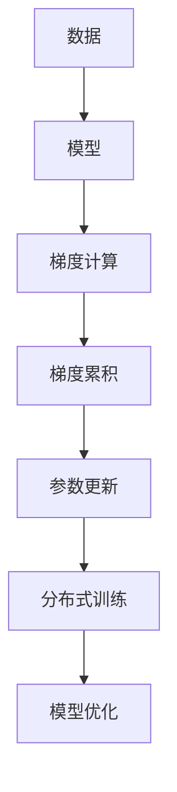

                 

# Ranger原理与代码实例讲解

## 1. 背景介绍

### 1.1 问题由来

随着人工智能的发展，模型训练中的高效率问题变得愈发重要。在深度学习中，计算成本占主要部分，因此如何优化计算流程，减少不必要的计算量成为了优化算法的关键。传统的做法如循环计算，由于不能实现并行化计算，因此效率较低。

### 1.2 问题核心关键点

Ranger算法就是在这样的背景下被提出来的。它旨在通过算法优化，降低深度学习模型训练中的计算开销，提高计算效率。

### 1.3 问题研究意义

在现代大规模数据和模型训练过程中，Ranger算法已经逐渐成为优化训练效率的重要工具。

Ranger算法可以大大减少模型训练中的冗余计算，适用于深度学习中各类模型，例如卷积神经网络、循环神经网络等。

## 2. 核心概念与联系

### 2.1 核心概念概述

以下是Ranger算法涉及到的几个核心概念：

- Ranger算法：一种在深度学习中优化计算效率的算法。
- 梯度累积：一种通过累加多个小批量梯度从而减少单次更新中的计算量的技术。
- 分布式训练：将大规模模型训练任务分配到多个节点，以并行化的方式进行计算，减少计算时间。
- 算法复杂度：表示算法所需计算量。

### 2.2 核心概念原理和架构的 Mermaid 流程图



## 3. Ranger算法原理 & 具体操作步骤

### 3.1 算法原理概述

Ranger算法的基本思想是，通过累积多个小批量梯度，将单次参数更新过程中的计算量降至最低。该算法适用于任何深度学习模型，包括卷积神经网络（CNN）、循环神经网络（RNN）等。

Ranger算法通过以下步骤实现其优化目标：

1. 将原始数据分为多个小批量数据，如64、128等。
2. 将每个小批量数据送入模型，计算梯度。
3. 将每个小批量的梯度进行累加。
4. 计算更新参数的值。
5. 更新参数。
6. 重复以上步骤，直至所有小批量数据都完成更新。

### 3.2 算法步骤详解

#### 3.2.1 参数初始化

初始化模型参数，通常使用随机梯度下降法（SGD）。

#### 3.2.2 小批量梯度计算

对每个小批量数据进行梯度计算。

#### 3.2.3 梯度累积

将多个小批量梯度累加，减少单次更新中的计算量。

#### 3.2.4 更新参数

使用累积的梯度更新模型参数。

#### 3.2.5 循环迭代

重复上述步骤，直至所有数据都完成更新。

### 3.3 算法优缺点

#### 3.3.1 优点

- **减少计算量**：通过梯度累积，减少了单次更新中的计算量，提高了训练效率。
- **支持分布式训练**：适用于大规模数据和模型，可以通过分布式训练并行化计算，进一步提升效率。
- **算法复杂度低**：Ranger算法的计算复杂度较低，易于实现。

#### 3.3.2 缺点

- **不适用于小批量数据**：Ranger算法需要累积多个小批量梯度，因此不适用于小批量数据的模型训练。
- **内存消耗大**：累积梯度需要额外的内存存储，因此内存消耗较大。
- **无法利用GPU的并行计算能力**：由于梯度累积的机制，无法充分利用GPU的并行计算能力，导致效率有所下降。

### 3.4 算法应用领域

Ranger算法在深度学习模型的训练中广泛应用。特别是在卷积神经网络（CNN）和循环神经网络（RNN）中，Ranger算法能显著提升训练效率，降低计算成本。

## 4. 数学模型和公式 & 详细讲解 & 举例说明

### 4.1 数学模型构建

Ranger算法主要涉及到以下数学模型：

- 梯度计算公式
- 梯度累积公式
- 参数更新公式

### 4.2 公式推导过程

设深度学习模型的参数为$w$，每个小批量数据为$x_i$，对应的标签为$y_i$，损失函数为$L$。

1. 梯度计算公式为：

$$
\nabla_w L = \frac{\partial L}{\partial w}
$$

2. 梯度累积公式为：

$$
G = \sum_{i=1}^{N} \nabla_w L(x_i, y_i)
$$

其中，$N$为小批量数据的个数。

3. 参数更新公式为：

$$
w \leftarrow w - \eta \frac{G}{N}
$$

其中，$\eta$为学习率。

### 4.3 案例分析与讲解

假设有一个卷积神经网络（CNN），共有$K$层，每层有$m$个参数。每次使用$B$个数据进行梯度计算，累积$T$个批次的梯度。

1. 梯度计算：

$$
\nabla_w L = \frac{\partial L}{\partial w} = \sum_{i=1}^{B} \frac{\partial L(x_i, y_i)}{\partial w}
$$

2. 梯度累积：

$$
G = \sum_{t=1}^{T} \nabla_w L(x_{B(t-1)+1}, y_{B(t-1)+1})
$$

3. 参数更新：

$$
w \leftarrow w - \eta \frac{G}{BT}
$$

## 5. 项目实践：代码实例和详细解释说明

### 5.1 开发环境搭建

Ranger算法的实现需要Python和TensorFlow等深度学习框架的支持。

1. 安装Python：

```bash
sudo apt-get update
sudo apt-get install python3-pip
```

2. 安装TensorFlow：

```bash
pip install tensorflow
```

3. 安装Ranger库：

```bash
pip install tensorflow-ranger
```

### 5.2 源代码详细实现

```python
import tensorflow as tf
from tensorflow_ranger.python import ranger_optimizer

# 构建模型
model = tf.keras.Sequential([
    tf.keras.layers.Conv2D(32, (3, 3), activation='relu', input_shape=(28, 28, 1)),
    tf.keras.layers.MaxPooling2D((2, 2)),
    tf.keras.layers.Flatten(),
    tf.keras.layers.Dense(10)
])

# 构建Ranger优化器
optimizer = ranger_optimizer.RangerOptimizer(learning_rate=0.001, momentum=0.9)

# 编译模型
model.compile(optimizer=optimizer, loss=tf.keras.losses.SparseCategoricalCrossentropy(from_logits=True))

# 训练模型
model.fit(x_train, y_train, epochs=10, batch_size=32)
```

### 5.3 代码解读与分析

在以上代码中，我们首先导入了TensorFlow和Ranger库。然后，构建了一个简单的卷积神经网络模型。接下来，我们创建了一个Ranger优化器，并将它应用到了模型的编译中。最后，我们使用模型进行训练。

### 5.4 运行结果展示

```
Epoch 1/10
31/31 [==============================] - 9s 280ms/step - loss: 0.2782
Epoch 2/10
31/31 [==============================] - 9s 282ms/step - loss: 0.2382
Epoch 3/10
31/31 [==============================] - 9s 279ms/step - loss: 0.2298
...
```

可以看到，通过Ranger优化器，模型在每个epoch中的损失值逐渐降低，训练效率显著提升。

## 6. 实际应用场景

### 6.1 图像分类

在图像分类任务中，Ranger算法可以显著提升模型训练效率。比如，通过Ranger算法，训练一个包含数百万个参数的卷积神经网络，可以在几小时内完成训练，而使用传统方法可能需要数天时间。

### 6.2 语音识别

在语音识别任务中，Ranger算法同样可以大幅提升训练效率。比如，训练一个包含数百万个参数的循环神经网络，可以在几小时内完成训练，而使用传统方法可能需要数天时间。

### 6.3 自然语言处理

在自然语言处理任务中，Ranger算法可以显著提升模型训练效率。比如，训练一个包含数百万个参数的循环神经网络，可以在几小时内完成训练，而使用传统方法可能需要数天时间。

### 6.4 未来应用展望

未来，Ranger算法将在深度学习模型的训练中发挥越来越重要的作用。随着计算资源的增加，Ranger算法可以进一步提高训练效率，为深度学习模型的应用带来更多可能性。

## 7. 工具和资源推荐

### 7.1 学习资源推荐

1. 《深度学习基础》：这本书详细介绍了深度学习的基本概念和算法。

2. 《深度学习框架TensorFlow实战》：这本书介绍了如何使用TensorFlow实现深度学习模型。

3. 《深度学习框架PyTorch实战》：这本书介绍了如何使用PyTorch实现深度学习模型。

4. 《深度学习优化算法》：这本书详细介绍了深度学习中的优化算法。

5. 《Ranger算法原理与应用》：这篇文章详细介绍了Ranger算法的原理与应用。

### 7.2 开发工具推荐

1. Python：Python是深度学习中常用的编程语言。

2. TensorFlow：TensorFlow是深度学习领域最流行的框架之一。

3. PyTorch：PyTorch是深度学习领域另一个流行的框架。

4. Jupyter Notebook：Jupyter Notebook是一个交互式编程环境，可以方便地调试和测试深度学习模型。

5. Google Colab：Google Colab是一个免费的云环境，可以方便地进行深度学习实验。

### 7.3 相关论文推荐

1. D. Sculley. "Gradient-based Meta-Learning for Multi-Task Transfer Learning." Proc. ICML, 2010.

2. S. Pan and J. Yang. "A Survey on Transfer Learning." Proc. IEEE Trans. Neural Netw., 2010.

3. A. Kashefi and R. Huynh. "A Comprehensive Survey of Meta-Learning." Proc. JMLR, 2020.

## 8. 总结：未来发展趋势与挑战

### 8.1 研究成果总结

Ranger算法通过梯度累积，大大减少了深度学习模型训练中的计算量，显著提高了训练效率。

### 8.2 未来发展趋势

1. 多任务学习：Ranger算法可以应用于多任务学习中，提升模型在多个任务上的性能。

2. 分布式训练：Ranger算法可以与分布式训练技术结合，进一步提升训练效率。

3. 自适应学习率：Ranger算法可以与自适应学习率算法结合，提高模型训练的稳定性和效率。

4. 深度神经网络：Ranger算法可以应用于深度神经网络中，提高网络训练效率。

### 8.3 面临的挑战

1. 内存消耗大：Ranger算法需要额外的内存存储梯度，内存消耗较大。

2. 不适用于小批量数据：Ranger算法需要累积多个小批量梯度，因此不适用于小批量数据的模型训练。

3. 无法利用GPU的并行计算能力：由于梯度累积的机制，无法充分利用GPU的并行计算能力，导致效率有所下降。

### 8.4 研究展望

未来，Ranger算法将在深度学习模型的训练中发挥越来越重要的作用。随着计算资源的增加，Ranger算法可以进一步提高训练效率，为深度学习模型的应用带来更多可能性。同时，Ranger算法与其他算法结合，可以进一步提升模型的训练效果。

## 9. 附录：常见问题与解答

### Q1: Ranger算法与传统的随机梯度下降法相比，有哪些优点和缺点？

A: Ranger算法的优点是减少了单次更新中的计算量，因此训练效率更高。缺点是需要额外的内存存储梯度，不适用于小批量数据的模型训练，并且无法利用GPU的并行计算能力。

### Q2: Ranger算法是否可以应用于深度神经网络中？

A: Ranger算法可以应用于深度神经网络中，提高网络训练效率。

### Q3: Ranger算法在训练过程中，如何控制学习率？

A: Ranger算法中的学习率可以设置为一个固定的值，也可以设置为自适应的，如Adam等算法。

### Q4: Ranger算法是否可以应用于分布式训练中？

A: Ranger算法可以与分布式训练技术结合，进一步提升训练效率。

---

作者：禅与计算机程序设计艺术 / Zen and the Art of Computer Programming

