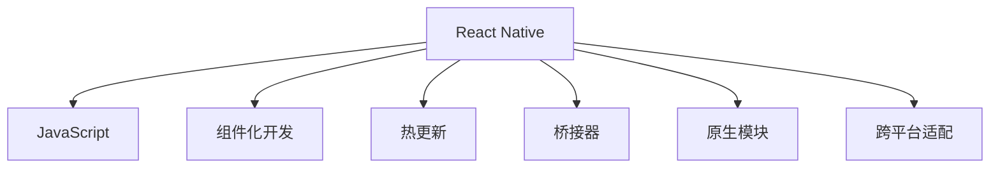

                 

## 1. 背景介绍

### 1.1 问题由来

随着移动设备市场的迅猛发展和应用场景的多样化，开发原生移动应用（Native Apps）的需求日益增长。然而，原生开发需要掌握多种编程语言和开发环境，耗时耗力，且跨平台性能较差。为解决这一问题，各大平台纷纷推出了自己的跨平台移动开发框架，如React Native、Flutter等。

React Native是一个基于JavaScript和React的跨平台移动开发框架，由Facebook在2015年开源。它支持iOS、Android、Web等多种平台，能够高效地将Web应用适配成原生应用。通过React Native，开发者可以仅用一套代码，构建性能接近原生应用的跨平台移动应用。

### 1.2 问题核心关键点

React Native的核心优势在于其高效、灵活、跨平台等特性，但同时面临着性能优化、开发效率、社区生态等问题。以下是对React Native的全面介绍：

- **高性能**：通过将部分JavaScript代码编译为原生代码，React Native能够获得接近原生应用的性能。
- **跨平台**：支持iOS、Android、Web等多个平台，能够高效适配不同平台的应用场景。
- **易用性**：使用JavaScript和React开发，对于前端开发者来说十分友好。
- **组件化**：采用组件化开发方式，能够提高代码复用性和开发效率。
- **社区支持**：拥有庞大的开发者社区，提供丰富的组件和插件支持。
- **热更新**：能够实现代码热更新，快速迭代和优化应用。

React Native的成功很大程度上依赖于其高性能、易用性和跨平台特性，但同时也面临着挑战。在实际开发中，需要解决性能优化、开发效率、社区生态等问题。

### 1.3 问题研究意义

React Native对于前端开发者来说，是一个值得尝试的技术栈。通过React Native，前端开发者能够迅速上手，构建高质量的跨平台应用，提升开发效率和应用性能。此外，React Native还能帮助开发者突破语言和技术栈的限制，快速拓展应用场景，推动移动开发技术的发展。

## 2. 核心概念与联系

### 2.1 核心概念概述

为了更好地理解React Native的原理和应用，本节将介绍几个核心概念：

- **React Native**：基于React的跨平台移动开发框架，由Facebook在2015年开源，目前广泛用于构建高性能、易用、跨平台的移动应用。
- **JavaScript**：一种高级编程语言，广泛应用于Web前端开发，也是React Native的主要开发语言。
- **组件化开发**：将应用拆分为多个独立的、可复用的组件，提高代码可维护性和开发效率。
- **热更新**：通过自动编译和加载更新后的代码，实现应用的即时更新，提升迭代速度。
- **桥接器**：React Native中的核心组件，负责在JavaScript环境和原生环境之间传递数据和函数调用。
- **原生模块**：用于在JavaScript和原生代码之间传递数据和函数调用的接口，实现更高效的数据传输。
- **跨平台适配**：通过适配不同平台的UI组件、事件处理等机制，实现应用在不同平台上的无缝运行。

这些核心概念之间的逻辑关系可以通过以下Mermaid流程图来展示：



这个流程图展示了几大核心概念之间的关系：

1. React Native基于JavaScript和React进行开发，主要依赖于JavaScript语言。
2. 组件化开发是React Native的核心开发方式，通过将应用拆分为多个独立的组件，提高代码复用性和开发效率。
3. 热更新是React Native的一个重要特性，通过自动编译和加载更新后的代码，实现应用的即时更新。
4. 桥接器是React Native中的核心组件，负责在JavaScript环境和原生环境之间传递数据和函数调用。
5. 原生模块用于在JavaScript和原生代码之间传递数据和函数调用，实现更高效的数据传输。
6. 跨平台适配通过适配不同平台的UI组件、事件处理等机制，实现应用在不同平台上的无缝运行。

## 3. 核心算法原理 & 具体操作步骤
### 3.1 算法原理概述

React Native的核心算法原理基于JavaScript和React的组件模型。通过React Native的桥接器，JavaScript代码能够调用原生API，同时原生代码也能够访问JavaScript环境。这种双向通信机制，使得React Native能够实现高性能、跨平台的应用。

React Native的组件模型采用虚拟DOM和跨平台适配的方式，实现代码的复用和组件的移植。虚拟DOM能够将JavaScript代码转换为虚拟DOM树，并通过桥接器传递给原生环境进行渲染。跨平台适配则通过抽象不同平台的原生UI组件，实现组件在不同平台上的表现一致。

### 3.2 算法步骤详解

React Native的开发过程可以分为以下几个关键步骤：

**Step 1: 准备开发环境**

1. 安装Node.js和React Native CLI。
2. 创建新的React Native项目，运行`react-native init <project-name>`。
3. 进入项目目录，运行`npm install`安装项目依赖。

**Step 2: 编写代码**

1. 使用JavaScript和React编写组件。
2. 在代码中引入原生模块，访问原生API。
3. 将组件封装成跨平台组件，适配不同平台。

**Step 3: 运行和调试**

1. 在Android或iOS模拟器中运行应用，检查UI效果。
2. 使用Chrome开发者工具进行调试，检查JavaScript代码和原生API的交互。
3. 使用React Native提供的调试工具，检查组件的渲染情况。

**Step 4: 打包发布**

1. 使用React Native提供的打包工具，将应用打包为iOS或Android应用。
2. 将应用提交到App Store或Google Play，进行发布。

### 3.3 算法优缺点

React Native的优势在于其高性能、易用性和跨平台特性，但也存在一些不足之处：

**优点：**
1. 高性能：通过桥接器将部分JavaScript代码编译为原生代码，实现高性能应用。
2. 易用性：使用JavaScript和React开发，前端开发者能够快速上手。
3. 跨平台：支持iOS、Android、Web等多个平台，实现跨平台开发。
4. 组件化开发：通过组件化开发，提高代码复用性和开发效率。
5. 热更新：通过热更新实现代码的即时更新，提升迭代速度。
6. 社区支持：拥有庞大的开发者社区，提供丰富的组件和插件支持。

**缺点：**
1. 性能优化：由于JavaScript和原生代码的交互，性能可能不及原生应用。
2. 开发效率：由于学习曲线较陡，开发效率可能低于原生开发。
3. 社区生态：虽然社区活跃，但生态系统和原生平台仍有差距。

### 3.4 算法应用领域

React Native的应用领域广泛，涵盖移动应用、游戏、Web应用等多个领域。以下列举几个典型的应用场景：

1. **移动应用**：如电商应用、社交应用、新闻应用等，能够在iOS、Android、Web等多个平台上运行。
2. **游戏应用**：如棋类游戏、跑酷游戏、模拟游戏等，能够提供流畅的性能和丰富的交互体验。
3. **Web应用**：如网页游戏、在线教育、在线购物等，能够实现跨平台的Web应用。
4. **企业应用**：如客户管理系统、内部办公应用、协同办公应用等，能够提升企业信息化水平。
5. **智能硬件**：如智能手表、智能家居等，能够实现与移动应用的无缝对接。

## 4. 数学模型和公式 & 详细讲解  
### 4.1 数学模型构建

React Native的核心算法原理基于JavaScript和React的组件模型。通过React Native的桥接器，JavaScript代码能够调用原生API，同时原生代码也能够访问JavaScript环境。这种双向通信机制，使得React Native能够实现高性能、跨平台的应用。

React Native的组件模型采用虚拟DOM和跨平台适配的方式，实现代码的复用和组件的移植。虚拟DOM能够将JavaScript代码转换为虚拟DOM树，并通过桥接器传递给原生环境进行渲染。跨平台适配则通过抽象不同平台的原生UI组件，实现组件在不同平台上的表现一致。

### 4.2 公式推导过程

React Native的算法原理可以抽象为以下过程：

1. **虚拟DOM转换**：将JavaScript代码转换为虚拟DOM树，存储在内存中。
2. **跨平台适配**：通过桥接器将虚拟DOM树适配为原生UI组件。
3. **原生渲染**：将适配后的UI组件传递给原生环境，进行渲染和显示。
4. **双向通信**：通过桥接器实现JavaScript和原生代码的双向通信，传递数据和函数调用。

### 4.3 案例分析与讲解

以下是一个React Native应用的示例，展示其核心算法原理和开发过程：

```javascript
// 导入React和原生模块
import React, { Component } from 'react';
import { View, Text, StyleSheet, Image } from 'react-native';
import { Button } from 'react-native-elements';

// 创建React组件
export default class App extends Component {
  constructor(props) {
    super(props);
    this.state = {
      name: 'John Doe',
      age: 30,
      isLogin: false,
    };
  }
  
  render() {
    return (
      <View style={styles.container}>
        <Text style={styles.title}>React Native Example</Text>
        <View style={styles.info}>
          <Text style={styles.label}>Name: {this.state.name}</Text>
          <Text style={styles.label}>Age: {this.state.age}</Text>
        </View>
        <Button title="Login" onPress={() => this.setState({ isLogin: true })} />
      </View>
    );
  }
}

// 定义样式
const styles = StyleSheet.create({
  container: {
    flex: 1,
    alignItems: 'center',
    justifyContent: 'center',
  },
  title: {
    fontSize: 24,
    fontWeight: 'bold',
    marginTop: 20,
  },
  info: {
    marginTop: 20,
    width: 300,
    alignItems: 'center',
  },
  label: {
    fontSize: 18,
    marginTop: 5,
  }
});
```

在这个示例中，React组件通过访问原生UI组件和原生模块，实现了简单的用户登录功能。通过桥接器，JavaScript代码能够调用原生模块，访问设备摄像头、本地文件等原生API。这种双向通信机制，使得React Native能够实现高性能、跨平台的应用。

## 5. 项目实践：代码实例和详细解释说明
### 5.1 开发环境搭建

在进行React Native开发前，需要准备好开发环境。以下是使用React Native CLI创建新项目和安装依赖的流程：

1. 安装Node.js和React Native CLI。
```bash
# 安装Node.js
sudo apt-get install nodejs
# 安装React Native CLI
npm install -g react-native-cli
```

2. 创建新的React Native项目。
```bash
react-native init MyProject
cd MyProject
```

3. 安装项目依赖。
```bash
npm install
```

### 5.2 源代码详细实现

以下是React Native项目中的核心代码，展示组件化开发和原生模块的实现：

```javascript
import React, { Component } from 'react';
import { View, Text, StyleSheet, Image, Platform } from 'react-native';
import { Button, Icon } from 'react-native-elements';
import Camera from 'react-native-camera';
import { Linking, Permissions } from 'react-native';

// 创建React组件
export default class App extends Component {
  constructor(props) {
    super(props);
    this.state = {
      name: 'John Doe',
      age: 30,
      isLogin: false,
      userPermissions: [],
      cameraPermissions: false,
    };
  }
  
  componentDidMount() {
    this.checkPermissions();
  }
  
  // 检查相机权限
  checkPermissions = async () => {
    const { status } = await Permissions.askAsync(Permissions.CAMERA);
    this.setState({ cameraPermissions: status === 'granted' });
  }
  
  // 获取用户信息
  getUserInfo = async () => {
    const token = await this.setState({ isLogin: true });
    // 在此处调用API获取用户信息
  }
  
  // 拍照上传
  takePhoto = async () => {
    const options = {
       quality: 0.5,
       base64: true,
       exif: true,
    };
    const image = await Camera.takePictureAsync(options);
    // 在此处上传照片
  }
  
  // 用户登录
  login = async () => {
    const { userPermissions } = await Permissions.askAsync(Permissions.RECORD_AUDIO, Permissions.CAMERA_ROLL);
    // 在此处调用API进行用户登录
  }
  
  render() {
    return (
      <View style={styles.container}>
        <Text style={styles.title}>React Native Example</Text>
        <View style={styles.info}>
          <Text style={styles.label}>Name: {this.state.name}</Text>
          <Text style={styles.label}>Age: {this.state.age}</Text>
        </View>
        <Button title="Login" onPress={() => this.login()} />
        <Button title="Take Photo" onPress={() => this.takePhoto()} />
      </View>
    );
  }
}

// 定义样式
const styles = StyleSheet.create({
  container: {
    flex: 1,
    alignItems: 'center',
    justifyContent: 'center',
  },
  title: {
    fontSize: 24,
    fontWeight: 'bold',
    marginTop: 20,
  },
  info: {
    marginTop: 20,
    width: 300,
    alignItems: 'center',
  },
  label: {
    fontSize: 18,
    marginTop: 5,
  }
});
```

在这个示例中，React组件通过访问原生UI组件和原生模块，实现了用户登录、拍照上传等功能。通过桥接器，JavaScript代码能够调用原生模块，访问设备摄像头、本地文件等原生API。这种双向通信机制，使得React Native能够实现高性能、跨平台的应用。

### 5.3 代码解读与分析

以下是React Native项目中代码的详细解读：

1. **导入模块**：通过`import`语句导入React、原生UI组件和原生模块。
2. **组件类**：使用`class`语句定义React组件，继承`Component`类，实现组件的功能。
3. **组件状态**：在组件的`constructor`方法中，初始化组件的状态。
4. **生命周期方法**：在组件的`componentDidMount`方法中，调用`checkPermissions`方法，检查相机权限。
5. **方法实现**：在组件中实现`getUserInfo`、`takePhoto`和`login`等方法，调用原生API实现拍照上传和用户登录等功能。
6. **渲染**：在组件的`render`方法中，渲染组件的UI界面，包括标题、信息、按钮等。

### 5.4 运行结果展示

在运行React Native应用后，可以看到以下UI界面：

```javascript
React Native Example
Name: John Doe
Age: 30
Login
Take Photo
```

可以通过点击“Login”按钮，实现用户登录功能；点击“Take Photo”按钮，实现拍照上传功能。

## 6. 实际应用场景

### 6.1 移动应用

React Native广泛应用于移动应用开发，如电商应用、社交应用、新闻应用等。通过React Native，前端开发者能够快速上手，构建高性能、易用、跨平台的移动应用。

### 6.2 游戏应用

React Native在游戏应用开发中也大放异彩，如棋类游戏、跑酷游戏、模拟游戏等。React Native能够提供流畅的性能和丰富的交互体验，满足游戏开发的需求。

### 6.3 Web应用

React Native还可以用于Web应用开发，如网页游戏、在线教育、在线购物等。通过React Native，Web应用能够实现跨平台的无缝运行。

### 6.4 企业应用

React Native在企业应用开发中也得到了广泛应用，如客户管理系统、内部办公应用、协同办公应用等。通过React Native，企业能够提升信息化水平，提高工作效率。

## 7. 工具和资源推荐
### 7.1 学习资源推荐

为了帮助开发者系统掌握React Native的开发技术，以下是一些推荐的学习资源：

1. React Native官方文档：React Native的官方文档，提供详细的API参考和示例代码。
2. React Native 中文网：中文版本的React Native文档，方便中国开发者查阅。
3. React Native Native 实战开发指南：是一本实战性的React Native开发指南，包含大量实例和项目。
4. React Native社区：React Native的官方社区，提供丰富的资源和讨论。
5. React Native公开课：React Native的公开课视频，涵盖从入门到精通的各个方面。

通过这些资源的学习，相信你一定能够快速掌握React Native的开发技巧，并用于解决实际的开发问题。

### 7.2 开发工具推荐

以下是几款用于React Native开发的常用工具：

1. VS Code：微软开发的轻量级代码编辑器，支持React Native的开发和调试。
2. Expo：由Facebook开发的React Native开发工具，提供快速搭建和发布应用的能力。
3. React Native CLI：React Native的命令行工具，方便项目的创建和管理。
4. Flow：Facebook开发的JavaScript静态类型检查器，能够提高代码的可维护性和可读性。
5. Jest：Facebook开发的JavaScript测试框架，能够提高代码的测试覆盖率和可靠性。

合理利用这些工具，可以显著提升React Native开发和调试的效率，加快项目的迭代速度。

### 7.3 相关论文推荐

React Native的成功很大程度上依赖于其高性能、易用性和跨平台特性，但同时也面临着挑战。以下是几篇奠基性的相关论文，推荐阅读：

1. React Native: A Progressive Native App Framework for Mobile: 由React Native团队的成员撰写，介绍了React Native的核心架构和开发方式。
2. Native Performance Tuning: 介绍了React Native中的性能优化技术，包括桥接器优化、组件优化等。
3. Getting Started with React Native: 一篇入门级的React Native开发教程，涵盖基本概念和开发技巧。
4. Building Multi-Platform Apps with React Native: 一篇全面的React Native开发教程，涵盖从项目搭建到应用发布的各个环节。

这些论文代表了她React Native技术的发展脉络。通过学习这些前沿成果，可以帮助研究者把握学科前进方向，激发更多的创新灵感。

## 8. 总结：未来发展趋势与挑战

### 8.1 总结

本文对React Native进行了全面系统的介绍。首先阐述了React Native的背景和核心优势，明确了其在跨平台开发中的独特价值。其次，从原理到实践，详细讲解了React Native的数学模型和核心算法，给出了React Native的开发实例和代码解读。同时，本文还广泛探讨了React Native在移动应用、游戏应用、Web应用、企业应用等多个领域的应用前景，展示了其广阔的潜力。

通过本文的系统梳理，可以看到，React Native在跨平台开发中扮演着重要的角色，其高性能、易用性和跨平台特性，为前端开发者提供了强大的技术支持。未来，伴随React Native的持续演进和生态系统的完善，React Native必将在更多的应用场景中发挥重要作用。

### 8.2 未来发展趋势

展望未来，React Native在跨平台开发中仍将发挥重要作用，其发展趋势主要包括以下几个方面：

1. 性能优化：通过优化桥接器和组件性能，提升React Native应用的性能。
2. 开发效率提升：通过工具和框架的改进，提升React Native的开发效率。
3. 社区生态完善：通过增加更多的组件和插件，完善React Native的生态系统。
4. 新技术支持：通过引入更多的新技术，如AR、VR等，拓展React Native的应用场景。
5. 平台支持扩展：支持更多平台和设备，拓展React Native的应用范围。

### 8.3 面临的挑战

尽管React Native在跨平台开发中表现出色，但仍面临一些挑战：

1. 性能瓶颈：由于JavaScript和原生代码的交互，React Native的性能可能不及原生应用。
2. 开发效率：由于学习曲线较陡，开发效率可能低于原生开发。
3. 生态系统：虽然社区活跃，但生态系统和原生平台仍有差距。
4. 兼容性：不同平台的原生组件和API可能存在差异，需要进行适配。

### 8.4 研究展望

React Native的未来发展，需要在以下几个方面进行深入研究：

1. 性能优化：通过优化桥接器和组件性能，提升React Native应用的性能。
2. 开发效率提升：通过工具和框架的改进，提升React Native的开发效率。
3. 社区生态完善：通过增加更多的组件和插件，完善React Native的生态系统。
4. 新技术支持：通过引入更多的新技术，如AR、VR等，拓展React Native的应用场景。
5. 平台支持扩展：支持更多平台和设备，拓展React Native的应用范围。

这些研究方向和目标，将引领React Native技术的发展方向，推动React Native在跨平台开发中的进一步普及和应用。相信随着React Native的不断优化和创新，React Native必将在更多的应用场景中发挥重要作用，推动跨平台开发的进步。

## 9. 附录：常见问题与解答

**Q1：React Native是否支持热更新？**

A: React Native支持热更新，通过使用`react-native packager`工具，可以实现代码的即时更新和加载。

**Q2：React Native的性能是否与原生应用相当？**

A: React Native的性能接近原生应用，但可能略逊于原生应用。通过优化桥接器和组件性能，React Native的性能可以进一步提升。

**Q3：React Native的开发效率是否低于原生开发？**

A: React Native的开发效率较原生开发更低，但通过使用React和JavaScript，能够提高开发效率和代码复用性。

**Q4：React Native是否支持所有原生API？**

A: React Native支持大部分原生API，但部分原生API可能需要通过桥接器进行封装。

**Q5：React Native是否支持跨平台开发？**

A: React Native支持跨平台开发，能够在iOS、Android、Web等多个平台上运行。

总之，React Native以其高性能、易用性和跨平台特性，成为前端开发者值得尝试的技术栈。通过React Native，开发者可以高效地构建跨平台移动应用，提升开发效率和应用性能。未来，随着React Native的持续优化和生态系统的完善，React Native必将在更多的应用场景中发挥重要作用。

