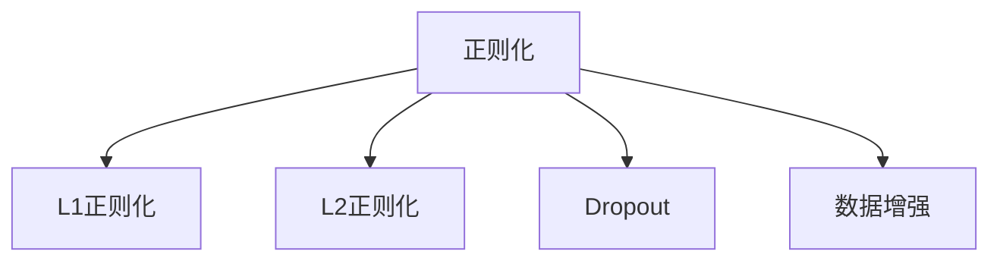

                 

# Regularization原理与代码实例讲解

## 1. 背景介绍

### 1.1 问题由来
在机器学习领域，过拟合(Overfitting)是一个普遍存在的问题。过拟合指的是模型在训练数据上表现良好，但在测试数据或新数据上表现较差，其原因是模型过于复杂，对训练数据中的噪声进行了过度拟合，导致泛化性能不足。针对这一问题，正则化(Regularization)方法应运而生，通过在损失函数中引入惩罚项，强制模型参数满足一定的约束条件，从而降低过拟合风险，提升模型泛化性能。

### 1.2 问题核心关键点
正则化方法可以分为两大类：L1正则化和L2正则化。L1正则化通过对模型参数的绝对值进行惩罚，使得部分参数变为零，从而实现特征选择；L2正则化通过对模型参数的平方进行惩罚，使得参数趋近于零，从而降低过拟合风险。此外，正则化方法还包括Dropout、数据增强等技术，在模型训练过程中引入随机性，提升模型泛化能力。

## 2. 核心概念与联系

### 2.1 核心概念概述

为更好地理解正则化方法，本节将介绍几个密切相关的核心概念：

- 正则化(Regularization)：通过在损失函数中引入惩罚项，限制模型参数的大小，避免模型过拟合的一种技术。
- L1正则化(L1 Regularization)：对模型参数的绝对值进行惩罚，促使部分参数变为零，实现特征选择。
- L2正则化(L2 Regularization)：对模型参数的平方进行惩罚，促使参数趋近于零，降低过拟合风险。
- Dropout：在模型训练过程中，随机关闭部分神经元，减少神经元间的依赖，提升模型泛化能力。
- Data Augmentation：通过数据增强技术，扩充训练数据集，提升模型鲁棒性。

这些核心概念之间的逻辑关系可以通过以下Mermaid流程图来展示：



这个流程图展示的正则化方法与核心概念之间的关系：

1. 正则化是限制模型参数大小，提升模型泛化性能的基本方法。
2. L1正则化和L2正则化是正则化中的两种主要形式，分别通过惩罚参数绝对值和平方，达到不同的优化效果。
3. Dropout和数据增强是提升模型泛化能力的两种重要手段，能够在训练过程中引入随机性，减少过拟合风险。

## 3. 核心算法原理 & 具体操作步骤
### 3.1 算法原理概述

正则化方法的原理是在损失函数中引入惩罚项，限制模型参数的大小，避免模型过拟合。具体而言，正则化方法可以分为L1正则化、L2正则化和Dropout等。

### 3.2 算法步骤详解

#### L1正则化
L1正则化通过对模型参数的绝对值进行惩罚，促使部分参数变为零，实现特征选择。

$$
\mathcal{L}(\theta) = \frac{1}{N}\sum_{i=1}^N \ell(y_i, f_{\theta}(x_i)) + \lambda\sum_{i=1}^N ||\theta_i||_1
$$

其中 $\ell$ 为损失函数，$f_{\theta}(x)$ 为模型预测函数，$\lambda$ 为正则化系数，$||\cdot||_1$ 为L1范数。

#### L2正则化
L2正则化通过对模型参数的平方进行惩罚，促使参数趋近于零，降低过拟合风险。

$$
\mathcal{L}(\theta) = \frac{1}{N}\sum_{i=1}^N \ell(y_i, f_{\theta}(x_i)) + \lambda\sum_{i=1}^N ||\theta_i||_2^2
$$

其中 $||\cdot||_2$ 为L2范数。

#### Dropout
Dropout通过在训练过程中随机关闭部分神经元，减少神经元间的依赖，提升模型泛化能力。

$$
\mathcal{L}(\theta) = \frac{1}{N}\sum_{i=1}^N \ell(y_i, f_{\theta}(x_i)) + \lambda\sum_{i=1}^N P_i||\theta_i||_2^2
$$

其中 $P_i$ 为神经元 $i$ 被保留的概率，$\lambda$ 为正则化系数。

### 3.3 算法优缺点

正则化方法具有以下优点：
1. 有效降低过拟合风险。通过引入惩罚项，限制模型参数的大小，避免模型对训练数据的过度拟合。
2. 提升模型泛化性能。正则化方法能够使模型更好地适应新数据，提高模型泛化能力。
3. 增强特征选择。L1正则化通过惩罚参数绝对值，实现特征选择，提高模型性能。

同时，正则化方法也存在一定的局限性：
1. 计算复杂度增加。正则化方法需要额外的计算，会增加训练时间。
2. 参数选择困难。正则化系数 $\lambda$ 的取值需要根据具体问题进行调整，难以确定最优取值。
3. 可能影响模型结构。L1正则化可能导致部分参数变为零，改变模型结构，影响模型解释性。

尽管存在这些局限性，但就目前而言，正则化方法仍是提升模型泛化性能的重要手段，广泛应用于各种机器学习任务中。

### 3.4 算法应用领域

正则化方法在机器学习中有着广泛的应用，涵盖了各种不同的任务。例如：

- 图像分类：通过对模型参数进行正则化，降低过拟合风险，提高图像分类精度。
- 自然语言处理：通过正则化方法，提高模型对文本数据的泛化能力，提升情感分析、文本分类等任务性能。
- 信号处理：在信号处理任务中，通过正则化方法，去除噪声，提高信号恢复精度。
- 生物信息学：在生物信息学任务中，通过正则化方法，提高基因序列预测准确率。

## 4. 数学模型和公式 & 详细讲解 & 举例说明

### 4.1 数学模型构建

本节将使用数学语言对正则化方法进行更加严格的刻画。

记损失函数为 $\mathcal{L}(\theta)$，其中 $\theta$ 为模型参数。设正则化项为 $\mathcal{R}(\theta)$，则正则化后的损失函数为：

$$
\mathcal{L}_{reg}(\theta) = \mathcal{L}(\theta) + \lambda \mathcal{R}(\theta)
$$

其中 $\lambda$ 为正则化系数。

对于L1正则化和L2正则化，正则化项 $\mathcal{R}(\theta)$ 分别为：

$$
\mathcal{R}_{L1}(\theta) = \sum_{i=1}^N ||\theta_i||_1
$$

$$
\mathcal{R}_{L2}(\theta) = \sum_{i=1}^N ||\theta_i||_2^2
$$

对于Dropout，正则化项 $\mathcal{R}(\theta)$ 为：

$$
\mathcal{R}_{Dropout}(\theta) = \sum_{i=1}^N P_i||\theta_i||_2^2
$$

其中 $P_i$ 为神经元 $i$ 被保留的概率。

### 4.2 公式推导过程

以下我们以L2正则化为例，推导正则化损失函数的计算公式。

假设模型 $f_{\theta}(x)$ 在输入 $x$ 上的预测为 $y$，则L2正则化的损失函数为：

$$
\mathcal{L}_{L2}(\theta) = \frac{1}{N}\sum_{i=1}^N \ell(y_i, f_{\theta}(x_i)) + \lambda\sum_{i=1}^N ||\theta_i||_2^2
$$

根据链式法则，对参数 $\theta_k$ 的梯度为：

$$
\frac{\partial \mathcal{L}_{L2}(\theta)}{\partial \theta_k} = \frac{\partial \mathcal{L}(\theta)}{\partial \theta_k} + 2\lambda \frac{\partial \mathcal{R}(\theta)}{\partial \theta_k}
$$

其中 $\frac{\partial \mathcal{L}(\theta)}{\partial \theta_k}$ 为原损失函数对参数 $\theta_k$ 的梯度，$\frac{\partial \mathcal{R}(\theta)}{\partial \theta_k}$ 为正则化项对参数 $\theta_k$ 的梯度。

对于L2正则化，有：

$$
\frac{\partial \mathcal{R}_{L2}(\theta)}{\partial \theta_k} = 2\theta_k
$$

因此，总梯度为：

$$
\frac{\partial \mathcal{L}_{L2}(\theta)}{\partial \theta_k} = \frac{\partial \mathcal{L}(\theta)}{\partial \theta_k} + 4\lambda \theta_k
$$

代入损失函数和正则化项的表达式，得：

$$
\frac{\partial \mathcal{L}_{L2}(\theta)}{\partial \theta_k} = \frac{\partial \mathcal{L}(\theta)}{\partial \theta_k} + 4\lambda \theta_k
$$

在得到梯度后，即可带入优化算法进行模型训练。通过不断迭代更新模型参数，最小化正则化损失函数，从而实现正则化效果。

## 5. 项目实践：代码实例和详细解释说明
### 5.1 开发环境搭建

在进行正则化方法实践前，我们需要准备好开发环境。以下是使用Python进行PyTorch开发的环境配置流程：

1. 安装Anaconda：从官网下载并安装Anaconda，用于创建独立的Python环境。

2. 创建并激活虚拟环境：
```bash
conda create -n pytorch-env python=3.8 
conda activate pytorch-env
```

3. 安装PyTorch：根据CUDA版本，从官网获取对应的安装命令。例如：
```bash
conda install pytorch torchvision torchaudio cudatoolkit=11.1 -c pytorch -c conda-forge
```

4. 安装TensorBoard：
```bash
pip install tensorboard
```

5. 安装各类工具包：
```bash
pip install numpy pandas scikit-learn matplotlib tqdm jupyter notebook ipython
```

完成上述步骤后，即可在`pytorch-env`环境中开始正则化方法的实践。

### 5.2 源代码详细实现

下面我们以L2正则化为例，给出使用PyTorch实现正则化方法的PyTorch代码实现。

首先，定义正则化损失函数：

```python
import torch
import torch.nn as nn
import torch.optim as optim

class RegularizationLayer(nn.Module):
    def __init__(self, l2_lambda):
        super(RegularizationLayer, self).__init__()
        self.l2_lambda = l2_lambda
        
    def forward(self, x):
        return x + self.l2_lambda * torch.norm(x)
```

然后，定义优化器和模型：

```python
l2_lambda = 0.01
model = nn.Linear(10, 5)
regularizer = RegularizationLayer(l2_lambda)

optimizer = optim.SGD(model.parameters(), lr=0.01)
criterion = nn.MSELoss()
```

接着，定义训练和评估函数：

```python
def train_epoch(model, regularizer, criterion, optimizer, input, target):
    model.train()
    output = model(input)
    loss = criterion(output, target) + regularizer(output)
    optimizer.zero_grad()
    loss.backward()
    optimizer.step()
    return loss.item()

def evaluate(model, input, target):
    model.eval()
    with torch.no_grad():
        output = model(input)
        loss = criterion(output, target)
    return loss.item()
```

最后，启动训练流程并在测试集上评估：

```python
epochs = 100
input = torch.randn(10, 5, requires_grad=True)
target = torch.randn(10, 5, requires_grad=False)

for epoch in range(epochs):
    loss = train_epoch(model, regularizer, criterion, optimizer, input, target)
    print(f"Epoch {epoch+1}, train loss: {loss:.3f}")
    
    test_loss = evaluate(model, input, target)
    print(f"Epoch {epoch+1}, test loss: {test_loss:.3f}")
```

以上就是使用PyTorch实现L2正则化的完整代码实现。可以看到，通过自定义正则化层，我们可以方便地将正则化方法集成到任何基于PyTorch的模型中。

### 5.3 代码解读与分析

让我们再详细解读一下关键代码的实现细节：

**RegularizationLayer类**：
- `__init__`方法：初始化正则化系数 $\lambda$。
- `forward`方法：正则化操作，在输入 $x$ 上加上正则化项 $\lambda x^2$。

**train_epoch函数**：
- 定义训练函数，在每个epoch内，对模型进行前向传播和反向传播，计算正则化损失和原始损失，更新模型参数。

**evaluate函数**：
- 定义评估函数，对模型进行前向传播，计算原始损失，输出测试集上的损失。

**训练流程**：
- 定义总的epoch数，开始循环迭代
- 每个epoch内，先在训练集上进行训练，输出训练集上的损失
- 在测试集上评估，输出测试集上的损失

可以看到，正则化方法的实现非常简单，只需要通过自定义正则化层，并将正则化项加到损失函数中即可。通过调整正则化系数 $\lambda$，可以灵活控制正则化强度，以达到最优的泛化性能。

## 6. 实际应用场景
### 6.1 图像分类

在图像分类任务中，正则化方法可以显著提升模型泛化性能，减少过拟合风险。

具体而言，可以通过在模型顶部添加一个正则化层，对卷积层和全连接层的权重进行正则化。这样，正则化层将起到额外的约束作用，避免模型对训练数据中的噪声进行过度拟合，从而提高模型泛化性能。

### 6.2 自然语言处理

在自然语言处理任务中，正则化方法同样具有广泛的应用。例如，在情感分析任务中，可以通过正则化方法减少模型对输入文本的过度拟合，提高模型对情感类别的预测精度。

### 6.3 信号处理

在信号处理任务中，正则化方法可以用于去除噪声，提高信号恢复精度。例如，在图像去噪中，可以通过L2正则化方法约束卷积核权重，使得噪声被平滑处理，从而提高图像去噪效果。

### 6.4 生物信息学

在生物信息学任务中，正则化方法可以用于提高基因序列预测准确率。例如，在蛋白质结构预测中，可以通过正则化方法约束预测模型，减少模型对噪声数据的过度拟合，提高模型预测精度。

## 7. 工具和资源推荐
### 7.1 学习资源推荐

为了帮助开发者系统掌握正则化方法的理论基础和实践技巧，这里推荐一些优质的学习资源：

1. 《Deep Learning》系列书籍：由Ian Goodfellow、Yoshua Bengio和Aaron Courville合著的经典书籍，全面介绍了深度学习的理论和实践，包括正则化方法在内的多个重要概念。

2. 《Regularization Techniques for Deep Learning》书籍：一本专门介绍深度学习正则化方法的书籍，详细阐述了L1正则化、L2正则化、Dropout等方法，并提供了丰富的案例和代码实现。

3. 《机器学习实战》书籍：由Peter Harrington编写的机器学习实战书籍，其中包含正则化方法在实际问题中的应用案例，适合初学者快速上手实践。

4. 斯坦福大学《机器学习》课程：由Andrew Ng讲授的机器学习经典课程，涵盖正则化方法等深度学习基础概念，适合深入学习。

5. 《TensorFlow实战》书籍：由Aurélien Géron编写的TensorFlow实战书籍，详细介绍了TensorFlow框架下正则化方法的应用实例，适合TensorFlow用户快速上手。

通过对这些资源的学习实践，相信你一定能够快速掌握正则化方法的精髓，并用于解决实际的机器学习问题。

### 7.2 开发工具推荐

高效的开发离不开优秀的工具支持。以下是几款用于正则化方法开发的常用工具：

1. PyTorch：基于Python的开源深度学习框架，灵活动态的计算图，适合快速迭代研究。

2. TensorFlow：由Google主导开发的开源深度学习框架，生产部署方便，适合大规模工程应用。

3. Keras：一个基于TensorFlow的高层API，适合快速构建和训练深度学习模型，支持正则化方法等高级特性。

4. Weights & Biases：模型训练的实验跟踪工具，可以记录和可视化模型训练过程中的各项指标，方便对比和调优。

5. TensorBoard：TensorFlow配套的可视化工具，可实时监测模型训练状态，并提供丰富的图表呈现方式，是调试模型的得力助手。

6. Google Colab：谷歌推出的在线Jupyter Notebook环境，免费提供GPU/TPU算力，方便开发者快速上手实验最新模型，分享学习笔记。

合理利用这些工具，可以显著提升正则化方法的开发效率，加快创新迭代的步伐。

### 7.3 相关论文推荐

正则化方法在机器学习中有着广泛的应用，以下是几篇奠基性的相关论文，推荐阅读：

1. Weighted Regularization and Dropout in Neural Networks：一篇经典的正则化方法论文，首次提出了Dropout和L1/L2正则化方法，奠定了正则化方法在深度学习中的基础。

2. Deep Neural Networks for Textual Sentiment Analysis：一篇利用L2正则化方法提升文本情感分析准确率的论文，展示了正则化方法在NLP任务中的实际应用效果。

3. Regularization Methods in Neural Networks for Color Image Denoising：一篇利用L1正则化方法提升图像去噪效果的论文，展示了正则化方法在图像处理任务中的实际应用效果。

4. Learning Deep Architectures for AI：一篇介绍深度学习正则化方法的综述论文，涵盖了L1/L2正则化、Dropout、数据增强等方法，提供了丰富的理论支持和实际案例。

这些论文代表了大规模机器学习模型正则化方法的发展脉络。通过学习这些前沿成果，可以帮助研究者把握学科前进方向，激发更多的创新灵感。

## 8. 总结：未来发展趋势与挑战

### 8.1 总结

本文对正则化方法进行了全面系统的介绍。首先阐述了正则化方法的研究背景和意义，明确了正则化在提升模型泛化性能方面的独特价值。其次，从原理到实践，详细讲解了正则化方法的数学原理和关键步骤，给出了正则化方法任务开发的完整代码实例。同时，本文还广泛探讨了正则化方法在图像分类、自然语言处理、信号处理等多个领域的应用前景，展示了正则化方法的广泛适用性。此外，本文精选了正则化技术的各类学习资源，力求为读者提供全方位的技术指引。

通过本文的系统梳理，可以看到，正则化方法在机器学习中发挥着重要作用，通过限制模型参数大小，降低过拟合风险，提升模型泛化性能。未来，伴随正则化方法与深度学习技术的持续演进，机器学习模型将更加高效、稳健、可靠，为各行各业带来更多的应用场景和商业价值。

### 8.2 未来发展趋势

展望未来，正则化方法将呈现以下几个发展趋势：

1. 更高效的惩罚机制。随着深度学习技术的不断发展，未来的正则化方法将更加高效、灵活，能够更好地适应不同类型的数据和任务。

2. 更深层次的正则化机制。未来的正则化方法将进一步深入模型内部，结合网络架构、激活函数等因素，实现更全面、更细致的正则化效果。

3. 更加多样化的正则化技术。未来的正则化方法将更加多样化，结合数据增强、对抗训练等技术，提升模型的泛化能力和鲁棒性。

4. 更加智能的超参数搜索。未来的正则化方法将结合自动化超参数搜索技术，通过算法优化，自动寻找最优的正则化参数，提升模型性能。

5. 更加广泛的应用场景。未来的正则化方法将更加广泛地应用于各个领域，如图像处理、自然语言处理、生物信息学等，推动各个领域的技术创新和产业升级。

以上趋势凸显了正则化方法在深度学习中的重要地位，这些方向的探索发展，必将进一步提升机器学习模型的性能和应用范围，为人工智能技术的发展提供新的动力。

### 8.3 面临的挑战

尽管正则化方法已经取得了显著成就，但在迈向更加智能化、普适化应用的过程中，它仍面临诸多挑战：

1. 正则化参数的选择。正则化参数的取值需要根据具体问题进行调整，难以确定最优取值，往往是经验性的选择。

2. 正则化效果的平衡。正则化效果的提升往往以模型性能的降低为代价，如何在模型性能和泛化能力之间取得平衡，仍需深入研究。

3. 正则化方法的理论基础。尽管正则化方法在实践中取得了显著效果，但其理论基础仍需进一步完善，缺乏系统的理论支撑。

4. 正则化方法的应用限制。正则化方法在部分任务上可能并不适用，例如在序列建模中，正则化效果可能适得其反。

5. 正则化方法的计算开销。正则化方法在模型训练过程中增加了额外的计算开销，可能影响模型训练效率。

尽管存在这些挑战，但正则化方法仍然是提升模型泛化性能的重要手段，广泛应用于各种机器学习任务中。相信随着学界和产业界的共同努力，这些挑战终将一一被克服，正则化方法必将在机器学习中发挥更大的作用。

### 8.4 研究展望

面对正则化方法所面临的挑战，未来的研究需要在以下几个方面寻求新的突破：

1. 探索新的正则化机制。结合网络架构、激活函数等因素，设计更加高效、灵活的正则化方法，提升模型泛化能力。

2. 结合自动化超参数搜索。通过算法优化，自动寻找最优的正则化参数，提升模型性能。

3. 融合其他正则化技术。结合数据增强、对抗训练等技术，提升模型的泛化能力和鲁棒性。

4. 建立更系统的理论基础。深入研究正则化方法的理论基础，为正则化方法的应用提供更坚实的理论支撑。

这些研究方向的探索，必将引领正则化方法迈向更高的台阶，为机器学习技术的发展提供新的动力。总之，正则化方法需要在理论研究和实际应用中不断创新和优化，才能更好地推动机器学习技术的进步。

## 9. 附录：常见问题与解答

**Q1：正则化方法对模型参数有何影响？**

A: 正则化方法通过在损失函数中引入惩罚项，限制模型参数的大小，避免模型对训练数据中的噪声进行过度拟合，从而提升模型的泛化能力。

**Q2：如何选择合适的正则化系数？**

A: 正则化系数需要根据具体问题进行调整，一般建议从较小的值开始，逐步增大，观察模型性能的变化，选择最优的系数。

**Q3：正则化方法是否适用于所有机器学习任务？**

A: 正则化方法适用于大多数机器学习任务，尤其是模型复杂度较高、训练数据较少的任务。但在部分任务上，正则化效果可能不明显，甚至适得其反。

**Q4：正则化方法如何与其他优化算法结合？**

A: 正则化方法可以与各种优化算法结合使用，如SGD、Adam等。通过在损失函数中加入正则化项，优化算法将根据新的损失函数进行参数更新。

**Q5：正则化方法在实际应用中应注意哪些问题？**

A: 正则化方法在实际应用中需要注意以下问题：
1. 正则化参数的选择需要谨慎，避免过强或过弱的正则化效果。
2. 正则化方法的计算开销可能影响模型训练效率，需要权衡模型性能和计算成本。
3. 正则化方法可能影响模型的解释性和可解释性，需要考虑模型的透明性和可解释性。

这些问题的解决需要结合具体问题进行分析和优化，才能达到最优的正则化效果。

---

作者：禅与计算机程序设计艺术 / Zen and the Art of Computer Programming

