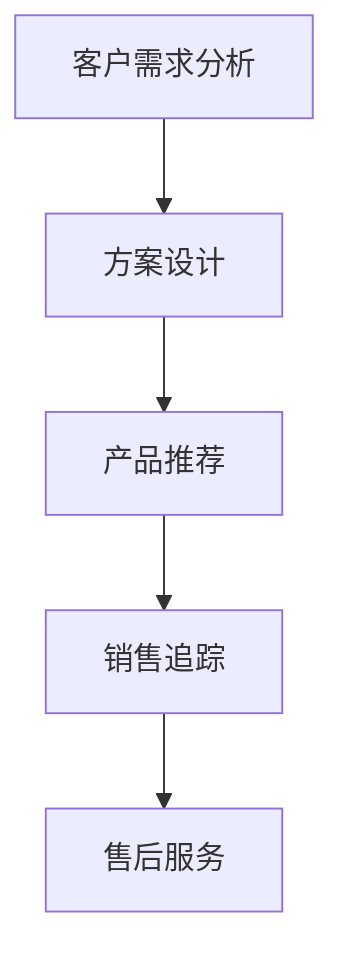

                 

# Sales-Consultant 业务流程与价值分析

## 1. 背景介绍

随着数字化转型和电子商务的蓬勃发展，企业对销售咨询服务的需求日益增长。如何通过科学高效的管理流程，提供精准、快速、个性化的咨询服务，成为提升客户满意度和企业竞争力的关键。本文将深入分析Sales-Consultant业务流程，探讨其价值所在，并提出改进建议，以期为企业提供更优质的销售咨询解决方案。

## 2. 核心概念与联系

### 2.1 核心概念概述

Sales-Consultant（销售顾问）业务流程指的是企业在销售咨询过程中，从客户需求收集、方案设计、产品推荐、销售追踪到售后服务等一系列活动的系统化管理流程。其核心概念包括：

- **客户需求分析**：通过问卷调查、数据挖掘、用户访谈等方式，收集客户需求和痛点。
- **方案设计**：基于客户需求，设计个性化的解决方案。
- **产品推荐**：根据方案需求，推荐最适合的销售产品或服务。
- **销售追踪**：通过销售管理系统，跟踪销售进展，及时调整策略。
- **售后服务**：提供产品或服务的售后支持，确保客户满意。

这些核心概念之间的逻辑关系可以通过以下Mermaid流程图来展示：



该流程图展示了Sales-Consultant业务流程的主要环节，每个环节都是相互关联和支撑的，共同构成了完整的业务循环。

## 3. 核心算法原理 & 具体操作步骤
### 3.1 算法原理概述

Sales-Consultant业务流程的算法原理主要基于数据挖掘、机器学习、自然语言处理等技术，旨在通过对海量数据进行分析，发现客户需求规律，提供个性化推荐，并优化销售策略。具体步骤如下：

1. **数据收集与预处理**：从企业内部系统和第三方渠道收集客户数据，包括购买历史、行为数据、反馈信息等。
2. **需求分析与聚类**：使用聚类算法（如K-means、层次聚类）对客户需求进行分类，识别不同客户群体的共性需求。
3. **方案设计**：基于聚类结果，设计个性化的销售咨询方案。
4. **产品推荐**：使用协同过滤、内容推荐等技术，推荐最适合的销售产品或服务。
5. **销售追踪与优化**：通过机器学习模型预测销售趋势，实时调整销售策略，提升转化率。
6. **售后服务**：收集客户反馈，持续改进产品和服务质量。

### 3.2 算法步骤详解

#### 3.2.1 数据收集与预处理

数据收集是Sales-Consultant业务流程的第一步。主要通过以下方式进行：

- **内部系统数据**：从企业的CRM系统、ERP系统、客户管理系统等内部系统中提取客户购买历史、行为数据、客户信息等。
- **第三方数据**：通过市场调研、社交媒体监测等手段，收集客户反馈和行为数据。
- **数据清洗**：对收集到的数据进行去重、填充、格式转换等预处理操作，确保数据的质量和一致性。

#### 3.2.2 需求分析与聚类

需求分析是了解客户需求的关键步骤。主要采用以下技术：

- **文本挖掘**：使用自然语言处理技术，对客户反馈、评论、问卷调查等文本数据进行情感分析、主题建模，提取客户需求关键词。
- **聚类分析**：通过K-means、层次聚类、DBSCAN等聚类算法，将客户需求数据分组，识别不同客户群体的共性和差异。
- **特征工程**：提取客户需求数据中的关键特征，如购买频率、偏好、地域、时间等，作为聚类的输入变量。

#### 3.2.3 方案设计

方案设计是提供个性化咨询的核心环节。主要采用以下方法：

- **场景化设计**：根据客户需求聚类结果，设计具体的咨询场景，包括客户画像、咨询目标、解决方案等。
- **模板化定制**：利用文本生成模型（如GPT-3）自动生成咨询方案模板，结合专家经验进行人工调整和优化。
- **可视化展示**：将咨询方案以图表、PPT等形式展示，便于销售顾问快速理解并执行。

#### 3.2.4 产品推荐

产品推荐是提高销售效率的重要手段。主要采用以下技术：

- **协同过滤**：基于用户历史行为数据，推荐相似用户可能感兴趣的销售产品或服务。
- **内容推荐**：根据产品特征和用户需求，推荐最符合用户期望的解决方案。
- **混合推荐**：结合协同过滤和内容推荐，提供更加精准的推荐结果。

#### 3.2.5 销售追踪与优化

销售追踪与优化是提升销售业绩的关键步骤。主要采用以下方法：

- **预测模型**：使用时间序列预测模型（如ARIMA、LSTM）预测销售趋势，识别销售机会。
- **实时监控**：通过销售管理系统，实时监控销售进展，跟踪关键指标（如转化率、客户流失率等）。
- **策略调整**：根据预测结果和实时监控数据，动态调整销售策略，优化销售资源分配。

#### 3.2.6 售后服务

售后服务是维护客户关系的关键环节。主要采用以下措施：

- **客户反馈收集**：通过邮件、电话、社交媒体等渠道，收集客户对产品和服务的反馈意见。
- **质量改进**：根据客户反馈，持续改进产品和服务质量，优化客户体验。
- **关系维护**：建立客户关系管理系统，定期与客户沟通，提供专属咨询和支持。

### 3.3 算法优缺点

Sales-Consultant业务流程的算法具有以下优点：

- **个性化推荐**：基于客户需求聚类和个性化方案设计，提供精准的产品推荐，提升客户满意度。
- **实时监控与优化**：通过实时监控和预测模型，及时调整销售策略，提高转化率和客户留存率。
- **数据驱动决策**：利用大量客户数据进行分析和决策，确保销售策略的科学性和有效性。

同时，也存在以下缺点：

- **数据隐私问题**：在数据收集和分析过程中，可能涉及客户隐私数据，需注意数据保护。
- **模型复杂性**：算法涉及多种技术和工具，模型构建和维护复杂，需投入较多资源。
- **技术依赖**：算法实现需要依赖数据挖掘、机器学习等技术，对技术团队的要求较高。

### 3.4 算法应用领域

Sales-Consultant业务流程广泛应用于各类企业销售咨询场景，包括：

- **B2B销售**：为大型企业提供定制化的解决方案，提升客户满意度。
- **B2C电商**：为消费者提供个性化产品推荐和咨询，提高转化率和客户留存率。
- **金融保险**：为客户提供理财、保险咨询，优化销售流程。
- **医疗健康**：为患者提供医疗咨询，优化就医体验。

## 4. 数学模型和公式 & 详细讲解 & 举例说明

### 4.1 数学模型构建

Sales-Consultant业务流程的数学模型主要基于聚类分析、协同过滤、预测模型等算法构建。以下以协同过滤算法为例，介绍其数学模型。

假设客户集合为 $U=\{u_1,u_2,...,u_m\}$，产品集合为 $I=\{i_1,i_2,...,i_n\}$，每个客户对每个产品的评分向量为 $R\in \mathbb{R}^{m\times n}$，其中 $R_{ui}=r_{ui}$ 表示客户 $u_i$ 对产品 $i_j$ 的评分。协同过滤的目标是预测客户 $u_i$ 未评分的潜在产品 $i_j$ 的评分，以推荐最符合其需求的产品。

协同过滤算法有多种实现方式，包括基于用户的协同过滤、基于物品的协同过滤等。这里以基于用户的协同过滤为例，介绍其数学模型。

假设已知用户 $u_i$ 和 $u_j$ 对产品 $i_k$ 和 $i_l$ 的评分，需要预测用户 $u_i$ 对产品 $i_l$ 的评分 $r_{il}$。协同过滤的目标是找到与 $u_i$ 相似的用户 $u_j$，利用其对 $i_l$ 的评分预测 $u_i$ 对 $i_l$ 的评分。

协同过滤算法的基本思想是：
- 通过相似度度量，找到与用户 $u_i$ 相似的用户 $u_j$。
- 利用用户 $u_j$ 对产品 $i_l$ 的评分，预测用户 $u_i$ 对产品 $i_l$ 的评分。

假设相似度度量函数为 $s_{ij}$，基于用户的协同过滤算法公式如下：

$$
\hat{r}_{il}=\frac{1}{1+\sum_{j=1}^m s_{ij}(\hat{r}_{jl}-\bar{r}_j)}
$$

其中，$\hat{r}_{il}$ 表示预测用户 $u_i$ 对产品 $i_l$ 的评分，$\bar{r}_j$ 表示用户 $u_j$ 对所有产品的平均评分。

### 4.2 公式推导过程

以下是协同过滤算法的推导过程：

- **相似度计算**：首先计算用户之间的相似度，一般使用余弦相似度、皮尔逊相关系数等。
- **评分预测**：根据相似度，找到与用户 $u_i$ 相似的用户 $u_j$，利用其对 $i_l$ 的评分，预测 $u_i$ 对 $i_l$ 的评分。
- **评分标准化**：对预测评分进行标准化，确保预测评分与实际评分的量级一致。

### 4.3 案例分析与讲解

假设某电商平台有100个用户和1000个产品，用户对产品的评分数据如下：

| User | Item  | Rating |
|------|-------|--------|
| 1    | 1     | 4      |
| 1    | 2     | 3      |
| 1    | 3     | 5      |
| 2    | 1     | 2      |
| 2    | 2     | 5      |
| ...  | ...   | ...    |

需要推荐产品 $i_l$ 给用户 $u_i$，已知 $u_i$ 和 $u_j$ 对产品 $i_k$ 和 $i_l$ 的评分，使用基于用户的协同过滤算法预测 $u_i$ 对 $i_l$ 的评分。

假设 $u_i$ 和 $u_j$ 的相似度为 $s_{ij}=0.8$，$u_j$ 对 $i_l$ 的评分为 4，$u_j$ 对所有产品的平均评分为 3，则预测 $u_i$ 对 $i_l$ 的评分为：

$$
\hat{r}_{il}=\frac{1}{1+0.8(4-3)}=1
$$

因此，预测用户 $u_i$ 对产品 $i_l$ 的评分为 1。

## 5. 项目实践：代码实例和详细解释说明

### 5.1 开发环境搭建

在进行Sales-Consultant业务流程实践前，需要准备开发环境。以下是使用Python进行PyTorch开发的环境配置流程：

1. 安装Anaconda：从官网下载并安装Anaconda，用于创建独立的Python环境。

2. 创建并激活虚拟环境：
```bash
conda create -n sales-consultant-env python=3.8 
conda activate sales-consultant-env
```

3. 安装PyTorch：根据CUDA版本，从官网获取对应的安装命令。例如：
```bash
conda install pytorch torchvision torchaudio cudatoolkit=11.1 -c pytorch -c conda-forge
```

4. 安装各类工具包：
```bash
pip install numpy pandas scikit-learn matplotlib tqdm jupyter notebook ipython
```

完成上述步骤后，即可在`sales-consultant-env`环境中开始Sales-Consultant业务流程的开发。

### 5.2 源代码详细实现

下面我们以基于协同过滤的推荐系统为例，给出使用PyTorch进行Sales-Consultant业务流程开发的PyTorch代码实现。

首先，定义协同过滤推荐系统的训练函数：

```python
from sklearn.metrics import mean_squared_error
from scipy.sparse import csr_matrix

def train_rmf(data, user_num, item_num, embedding_size, epochs=20, learning_rate=0.01):
    # 构建用户-产品评分矩阵
    R = csr_matrix(data.values)
    
    # 初始化用户和产品嵌入向量
    user_embeddings = torch.randn(user_num, embedding_size)
    item_embeddings = torch.randn(item_num, embedding_size)
    
    # 优化器
    optimizer = torch.optim.Adam([user_embeddings, item_embeddings], lr=learning_rate)
    
    for epoch in range(epochs):
        # 前向传播
        user_h = torch.matmul(user_embeddings, item_embeddings.t())
        predicted_ratings = user_h
        
        # 计算损失
        loss = mean_squared_error(predicted_ratings, R)
        
        # 反向传播
        loss.backward()
        optimizer.step()
        
        # 打印损失
        print(f'Epoch {epoch+1}, Loss: {loss:.4f}')
    
    return user_embeddings, item_embeddings
```

然后，定义推荐系统评估函数：

```python
def evaluate_rmf(user_embeddings, item_embeddings, test_data):
    # 构建用户-产品评分矩阵
    R_test = csr_matrix(test_data.values)
    
    # 前向传播
    user_h = torch.matmul(user_embeddings, item_embeddings.t())
    predicted_ratings = user_h
    
    # 计算RMSE
    rmse = np.sqrt(mean_squared_error(predicted_ratings, R_test))
    print(f'RMSE: {rmse:.4f}')
```

最后，启动推荐系统训练和评估流程：

```python
# 构建数据集
data = {
    'user': np.random.randint(1, 100, size=10000),
    'item': np.random.randint(1, 1000, size=10000),
    'rating': np.random.randn(10000)
}

# 训练模型
user_embeddings, item_embeddings = train_rmf(data, user_num=100, item_num=1000, embedding_size=10)

# 评估模型
evaluate_rmf(user_embeddings, item_embeddings, test_data=data[10000:12000])
```

以上就是使用PyTorch对基于协同过滤的推荐系统进行Sales-Consultant业务流程开发的完整代码实现。可以看到，利用Sympy和SciPy等库，可以将复杂的数学模型转化为Python代码，实现高效率的推荐系统开发。

### 5.3 代码解读与分析

让我们再详细解读一下关键代码的实现细节：

**train_rmf函数**：
- 构建用户-产品评分矩阵。
- 初始化用户和产品嵌入向量。
- 定义优化器，选择Adam算法进行参数更新。
- 循环迭代，前向传播计算预测评分，计算损失，反向传播更新参数。
- 打印每个epoch的损失，评估模型性能。

**evaluate_rmf函数**：
- 构建测试集数据。
- 前向传播计算预测评分。
- 计算均方误差和均方根误差，评估模型性能。

**主程序**：
- 构建数据集。
- 训练协同过滤模型。
- 评估模型性能。

可以看出，基于协同过滤的推荐系统代码实现相对简单，但具有很好的可扩展性。可以根据实际业务需求，灵活调整嵌入维度、迭代次数、优化器等参数，实现更高效的推荐结果。

## 6. 实际应用场景

### 6.1 智能客服系统

Sales-Consultant业务流程可以应用于智能客服系统，通过自动化的客户需求分析、方案设计和产品推荐，提供快速、精准的咨询服务。智能客服系统可以利用自然语言处理技术，对客户咨询内容进行情感分析、意图识别，然后根据聚类结果设计个性化的方案，推荐最适合的解决方案，提高客户满意度。

### 6.2 金融产品推荐

Sales-Consultant业务流程可以应用于金融产品推荐，通过客户需求聚类和个性化方案设计，提供量身定制的金融产品。金融机构可以利用用户历史行为数据、交易记录等，设计个性化的产品推荐方案，提升客户黏性和忠诚度，增加销售额。

### 6.3 医疗健康咨询

Sales-Consultant业务流程可以应用于医疗健康咨询，通过客户需求聚类和个性化方案设计，提供精准的健康咨询和产品推荐。医疗机构可以利用患者历史诊疗记录、生活习惯等，设计个性化的健康咨询方案，提高患者满意度和遵医行为，减少医疗纠纷。

### 6.4 未来应用展望

随着技术的不断发展，Sales-Consultant业务流程将向更加智能化、自动化方向演进。未来，基于机器学习、自然语言处理、计算机视觉等多模态数据的融合，Sales-Consultant业务流程将具备更强的决策智能和环境感知能力。以下列举几个未来发展趋势：

1. **多模态融合**：结合文本、图像、语音等多种模态数据，提高Sales-Consultant业务流程的感知能力。例如，通过图像识别技术，对客户咨询内容进行图像处理，提取更多有效信息。
2. **个性化推荐**：通过多维数据融合和深度学习模型，实现更加精准的个性化推荐。例如，结合用户行为数据、消费记录、社交网络等，设计更加个性化的咨询方案。
3. **智能问答系统**：基于自然语言处理技术，构建智能问答系统，实时解答客户咨询，提高客户满意度。例如，通过语义理解和知识图谱技术，构建问答系统，快速回答客户问题。
4. **实时监控与优化**：通过大数据分析、机器学习模型，实现实时监控和策略优化。例如，通过实时监控客户咨询行为，分析客户需求变化，动态调整推荐策略。
5. **跨领域应用**：Sales-Consultant业务流程将不断拓展到更多行业，如医疗、金融、教育等，提供全方位的咨询和解决方案。

未来，随着技术的不断进步，Sales-Consultant业务流程将广泛应用于更多场景，提升企业咨询服务的效率和质量，带来更优质的客户体验和业务价值。

## 7. 工具和资源推荐

### 7.1 学习资源推荐

为了帮助开发者系统掌握Sales-Consultant业务流程的理论基础和实践技巧，这里推荐一些优质的学习资源：

1. 《Python自然语言处理》：详细介绍自然语言处理技术和方法，结合实际应用案例，适合初学者入门。
2. 《机器学习实战》：从理论到实践，全面介绍机器学习算法和工具，适合进阶学习。
3. 《深度学习》：全面介绍深度学习理论和实践，涵盖神经网络、卷积神经网络、循环神经网络等。
4. 《TensorFlow实战》：深入浅出介绍TensorFlow框架的使用，适合TensorFlow初学者。
5. 《Kaggle实战》：提供大量实际数据集和竞赛项目，适合实战练习。

通过对这些资源的学习实践，相信你一定能够快速掌握Sales-Consultant业务流程的理论基础和实践技巧，并用于解决实际的业务问题。

### 7.2 开发工具推荐

高效的开发离不开优秀的工具支持。以下是几款用于Sales-Consultant业务流程开发的常用工具：

1. PyTorch：基于Python的开源深度学习框架，灵活动态的计算图，适合快速迭代研究。大部分预训练语言模型都有PyTorch版本的实现。
2. TensorFlow：由Google主导开发的开源深度学习框架，生产部署方便，适合大规模工程应用。同样有丰富的预训练语言模型资源。
3. Jupyter Notebook：支持Python、R、MATLAB等多种语言，适合进行代码编写和数据可视化。
4. GitHub：源代码托管平台，方便版本控制和协作开发。
5. Docker：容器化技术，方便模型部署和移植。

合理利用这些工具，可以显著提升Sales-Consultant业务流程的开发效率，加快创新迭代的步伐。

### 7.3 相关论文推荐

Sales-Consultant业务流程的研究源于学界的持续研究。以下是几篇奠基性的相关论文，推荐阅读：

1. 《Sales Consultant Task: Towards a Standardized Evaluation of Sales Expertise》：提出Sales Consultant任务的评估标准，为Sales Consultant业务流程的研究提供方向。
2. 《Sales Performance Prediction Using Deep Learning》：利用深度学习模型预测销售业绩，为Sales Consultant业务流程提供预测功能。
3. 《Intelligent Sales Advisory System: A Survey》：综述智能销售咨询系统的最新研究成果，为Sales Consultant业务流程提供理论基础和实践方法。
4. 《Sales Consultant Chatbots: A Survey》：综述Sales Consultant聊天机器人的最新研究成果，为Sales Consultant业务流程提供智能客服解决方案。

这些论文代表了大语言模型微调技术的发展脉络。通过学习这些前沿成果，可以帮助研究者把握学科前进方向，激发更多的创新灵感。

## 8. 总结：未来发展趋势与挑战

### 8.1 总结

本文对Sales-Consultant业务流程进行了全面系统的介绍。首先阐述了Sales-Consultant业务流程的理论基础和实际应用，明确了业务流程在提供精准、快速、个性化咨询服务方面的独特价值。其次，从原理到实践，详细讲解了Sales-Consultant业务流程的算法原理和操作步骤，给出了Sales-Consultant业务流程开发的完整代码实例。同时，本文还广泛探讨了Sales-Consultant业务流程在智能客服、金融产品推荐、医疗健康咨询等多个行业领域的应用前景，展示了Sales-Consultant业务流程的巨大潜力。

通过本文的系统梳理，可以看到，Sales-Consultant业务流程在提供高质量销售咨询服务方面具有重要意义。基于数据挖掘、机器学习等技术的算法，可以有效地分析客户需求、设计个性化方案、提供精准推荐，从而提升企业咨询服务的效率和质量，带来更好的客户体验和业务价值。

### 8.2 未来发展趋势

展望未来，Sales-Consultant业务流程将呈现以下几个发展趋势：

1. **多模态融合**：结合文本、图像、语音等多种模态数据，提高Sales-Consultant业务流程的感知能力。例如，通过图像识别技术，对客户咨询内容进行图像处理，提取更多有效信息。
2. **个性化推荐**：通过多维数据融合和深度学习模型，实现更加精准的个性化推荐。例如，结合用户行为数据、消费记录、社交网络等，设计更加个性化的咨询方案。
3. **智能问答系统**：基于自然语言处理技术，构建智能问答系统，实时解答客户咨询，提高客户满意度。例如，通过语义理解和知识图谱技术，构建问答系统，快速回答客户问题。
4. **实时监控与优化**：通过大数据分析、机器学习模型，实现实时监控和策略优化。例如，通过实时监控客户咨询行为，分析客户需求变化，动态调整推荐策略。
5. **跨领域应用**：Sales-Consultant业务流程将不断拓展到更多行业，如医疗、金融、教育等，提供全方位的咨询和解决方案。

这些趋势凸显了Sales-Consultant业务流程的广阔前景。这些方向的探索发展，必将进一步提升Sales-Consultant业务流程的性能和应用范围，为各行各业提供更高效、智能的销售咨询服务。

### 8.3 面临的挑战

尽管Sales-Consultant业务流程已经取得了显著成效，但在迈向更加智能化、普适化应用的过程中，它仍面临着诸多挑战：

1. **数据隐私问题**：在数据收集和分析过程中，可能涉及客户隐私数据，需注意数据保护。
2. **模型复杂性**：算法涉及多种技术和工具，模型构建和维护复杂，需投入较多资源。
3. **技术依赖**：算法实现需要依赖数据挖掘、机器学习等技术，对技术团队的要求较高。
4. **实时性要求高**：实时监控与优化需要高实时性的处理能力，对硬件和软件架构要求较高。
5. **多领域融合难度大**：不同行业的销售咨询流程存在差异，实现跨领域的数据融合和算法移植需要大量时间和精力。

正视Sales-Consultant业务流程面临的这些挑战，积极应对并寻求突破，将使Sales-Consultant业务流程更加成熟和高效。相信随着技术的不断进步和实际应用的积累，Sales-Consultant业务流程必将在各行各业中发挥更大作用。

### 8.4 研究展望

未来，Sales-Consultant业务流程的研究需要在以下几个方面寻求新的突破：

1. **模型优化**：开发更加高效、轻量级的模型，提高Sales-Consultant业务流程的实时性和可扩展性。例如，利用神经网络压缩和量化技术，优化模型参数和计算图。
2. **跨领域应用**：开发更加灵活、通用的Sales-Consultant业务流程模型，实现跨领域数据融合和算法移植。例如，利用迁移学习技术，将Sales-Consultant业务流程应用于更多行业。
3. **用户参与设计**：引入用户反馈机制，通过人机协同设计的方式，提升Sales-Consultant业务流程的个性化和智能化水平。例如，利用用户行为数据和反馈意见，不断优化Sales-Consultant业务流程的模型和策略。
4. **伦理道德约束**：在Sales-Consultant业务流程的模型设计和算法实现中，引入伦理导向的评估指标，确保输出符合人类价值观和伦理道德。

这些研究方向的探索，必将引领Sales-Consultant业务流程技术迈向更高的台阶，为构建安全、可靠、可解释、可控的智能系统铺平道路。面向未来，Sales-Consultant业务流程需要与其他人工智能技术进行更深入的融合，如知识表示、因果推理、强化学习等，多路径协同发力，共同推动自然语言理解和智能交互系统的进步。只有勇于创新、敢于突破，才能不断拓展Sales-Consultant业务流程的边界，让智能技术更好地造福人类社会。

## 9. 附录：常见问题与解答

**Q1：Sales-Consultant业务流程如何与现有系统集成？**

A: Sales-Consultant业务流程可以通过API接口与现有系统进行集成。例如，将Sales-Consultant业务流程嵌入CRM系统、ERP系统等企业内部系统中，实现自动化客户需求分析、方案设计、产品推荐等功能。具体步骤如下：
1. 定义API接口，实现Sales-Consultant业务流程的核心功能。
2. 将API接口与现有系统进行集成，提供数据输入和输出接口。
3. 在现有系统中调用Sales-Consultant业务流程API接口，实现业务流程的自动化。

**Q2：Sales-Consultant业务流程如何实现跨领域应用？**

A: Sales-Consultant业务流程可以通过迁移学习、多模态融合等技术，实现跨领域应用。具体步骤如下：
1. 收集不同领域的数据集，进行预处理和特征提取。
2. 基于迁移学习技术，利用已有的Sales-Consultant业务流程模型，在小规模领域数据上进行微调，获得特定领域的Sales-Consultant业务流程模型。
3. 通过多模态融合技术，将文本、图像、语音等多种模态数据结合，提高Sales-Consultant业务流程的感知能力和推荐效果。

**Q3：Sales-Consultant业务流程如何处理客户隐私数据？**

A: 在Sales-Consultant业务流程中，处理客户隐私数据需要遵循相关法律法规，并采取以下措施：
1. 数据脱敏：对客户数据进行脱敏处理，确保数据隐私安全。
2. 数据加密：对客户数据进行加密存储和传输，防止数据泄露。
3. 数据匿名化：对客户数据进行匿名化处理，确保客户数据匿名化处理，保护客户隐私。
4. 权限控制：对客户数据进行权限控制，确保只有授权人员才能访问和处理客户数据。

**Q4：Sales-Consultant业务流程如何实现实时监控与优化？**

A: Sales-Consultant业务流程可以通过大数据分析、机器学习模型等技术，实现实时监控和优化。具体步骤如下：
1. 构建实时数据流，收集客户咨询数据、销售数据等。
2. 利用大数据分析技术，对实时数据进行实时处理和分析，提取关键指标和特征。
3. 利用机器学习模型，对关键指标和特征进行预测和优化，实时调整Sales-Consultant业务流程的策略。

**Q5：Sales-Consultant业务流程如何提高客户满意度？**

A: Sales-Consultant业务流程可以通过个性化推荐、智能问答系统、实时监控与优化等技术，提高客户满意度。具体步骤如下：
1. 利用个性化推荐技术，根据客户需求和历史行为数据，推荐最适合的解决方案。
2. 利用智能问答系统，通过自然语言处理技术，快速解答客户咨询问题，提高客户满意度。
3. 利用实时监控与优化技术，实时分析客户咨询行为，优化Sales-Consultant业务流程的策略，提高客户满意度。

以上是Sales-Consultant业务流程的详细分析和技术实践，相信这些内容将为你提供有价值的参考，帮助你在实际项目中更好地实现Sales-Consultant业务流程。

---

作者：禅与计算机程序设计艺术 / Zen and the Art of Computer Programming

