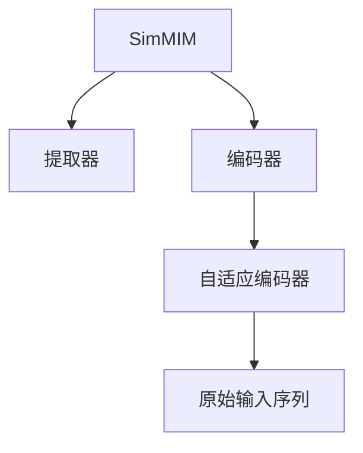

                 

# SimMIM原理与代码实例讲解

## 1. 背景介绍

### 1.1 问题由来

SimMIM（Simple Model for MIM）是一种新兴的无监督学习范式，旨在高效地捕捉序列数据中隐式的信息流。与传统的自编码器相比，SimMIM具有更简单的结构、更低的计算需求，同时也能够提供与自编码器相近的性能。SimMIM的出现为序列数据的表示学习提供了一种新的思路，特别是在处理长序列、高维度的数据时，表现出显著的优势。

### 1.2 问题核心关键点

SimMIM的核心思想是通过一种简单的方式，捕捉序列数据中的时间依赖关系。其核心算法分为两个部分：提取器和编码器。提取器使用简单的线性投影对输入序列进行处理，得到一系列中间表示。编码器则将这些中间表示通过自编码器的方式，重构出原始输入序列。

SimMIM的核心在于其自适应编码器，能够在不同的时间步长下，灵活地调整编码器参数，从而更好地学习序列中的信息流。这种自适应性使得SimMIM在处理长序列数据时，能够有效避免梯度消失和梯度爆炸问题，提升模型的训练稳定性和效率。

### 1.3 问题研究意义

研究SimMIM算法，对于序列数据表示学习和时间序列分析具有重要意义：

1. 提升序列数据建模的效率：SimMIM通过简化模型结构，降低计算需求，能够高效处理长序列数据。
2. 增强序列数据的表示能力：SimMIM能够捕捉序列数据中的隐式信息流，提升数据表示的质量。
3. 推动时间序列分析的进步：SimMIM的自适应编码器，为时间序列分析提供了新的思路，有助于提高分析的精度和速度。
4. 促进人工智能技术的发展：SimMIM作为新的无监督学习范式，为人工智能技术的进步提供了新的思路和方法。

## 2. 核心概念与联系

### 2.1 核心概念概述

为了更好地理解SimMIM的原理和架构，本节将介绍几个关键概念：

- SimMIM：一种基于自适应编码器的时间序列建模方法，旨在通过简化模型结构，高效捕捉序列数据中的信息流。
- 提取器(Extractor)：SimMIM中的第一个模块，使用简单的线性投影，将输入序列转化为一系列中间表示。
- 编码器(Encoder)：SimMIM中的第二个模块，使用自适应编码器，将中间表示重构为原始输入序列。
- 自适应编码器(Adaptive Encoder)：SimMIM中的核心模块，通过调整编码器参数，灵活适应不同的时间步长，捕捉序列数据中的信息流。

这些核心概念之间的逻辑关系可以通过以下Mermaid流程图来展示：



这个流程图展示了SimMIM的总体框架：

1. 输入序列通过提取器进行处理，得到一系列中间表示。
2. 这些中间表示通过自适应编码器进行重构，得到原始输入序列。

这些核心概念共同构成了SimMIM的算法框架，使其能够高效捕捉序列数据中的隐式信息流。

## 3. 核心算法原理 & 具体操作步骤
### 3.1 算法原理概述

SimMIM算法主要包括以下几个步骤：

1. 提取器模块：将输入序列投影到高维空间，得到一系列中间表示。
2. 编码器模块：将中间表示通过自适应编码器重构为原始输入序列。
3. 训练过程：最小化重构误差，调整编码器参数，以捕捉序列数据中的信息流。

### 3.2 算法步骤详解

#### 3.2.1 提取器模块

提取器模块使用线性投影将输入序列映射到高维空间，得到一系列中间表示。具体实现如下：

1. 输入序列 $x_t$，通过线性投影 $W_e$ 得到中间表示 $e_t$：
   $$
   e_t = x_t \cdot W_e
   $$

   其中 $W_e$ 为提取器权重矩阵，$e_t$ 为第 $t$ 步的中间表示。

#### 3.2.2 编码器模块

编码器模块使用自适应编码器，将中间表示 $e_t$ 重构为原始输入序列 $x_t$。具体实现如下：

1. 编码器参数 $\theta_e$ 包括线性投影权重 $W_e$ 和自适应编码器权重 $W_h$。
2. 中间表示 $e_t$ 通过线性投影 $W_e$ 得到重构表示 $\hat{e}_t$：
   $$
   \hat{e}_t = e_t \cdot W_h
   $$

3. 重构表示 $\hat{e}_t$ 通过非线性激活函数 $f$ 得到重构序列 $\hat{x}_t$：
   $$
   \hat{x}_t = f(\hat{e}_t)
   $$

   其中 $f$ 为非线性激活函数，如ReLU、Sigmoid等。

#### 3.2.3 训练过程

SimMIM的训练过程主要通过最小化重构误差 $L$ 来实现，具体实现如下：

1. 计算重构误差 $L$：
   $$
   L = \frac{1}{T} \sum_{t=1}^{T} ||x_t - \hat{x}_t||^2
   $$

   其中 $T$ 为序列长度，$||\cdot||$ 为欧几里得范数。

2. 最小化重构误差 $L$，更新编码器参数 $\theta_e$：
   $$
   \theta_e = \theta_e - \eta \nabla_{\theta_e} L
   $$

   其中 $\eta$ 为学习率，$\nabla_{\theta_e} L$ 为重构误差 $L$ 对编码器参数 $\theta_e$ 的梯度。

3. 编码器参数 $\theta_e$ 包括线性投影权重 $W_e$ 和自适应编码器权重 $W_h$，分别更新：
   $$
   W_e = W_e - \eta \nabla_{W_e} L
   $$
   $$
   W_h = W_h - \eta \nabla_{W_h} L
   $$

### 3.3 算法优缺点

SimMIM算法具有以下优点：

1. 高效：SimMIM使用简单的线性投影和自适应编码器，计算需求低，易于实现。
2. 灵活：SimMIM通过自适应编码器，灵活适应不同的时间步长，捕捉序列数据中的信息流。
3. 稳定：SimMIM的训练过程简单，收敛速度快，能够高效处理长序列数据。

SimMIM算法也存在以下缺点：

1. 需要高维度的提取器权重矩阵 $W_e$：SimMIM的提取器模块使用线性投影，需要高维度的权重矩阵 $W_e$，增加了模型复杂度。
2. 自适应编码器需要调整参数：自适应编码器的参数调整需要额外的时间，增加了训练成本。
3. 难以处理高维度的输入数据：SimMIM在处理高维度的输入数据时，容易产生梯度消失问题，需要额外的优化技巧。

### 3.4 算法应用领域

SimMIM算法主要应用于以下领域：

1. 时间序列分析：SimMIM能够高效捕捉时间序列数据中的信息流，适用于股票价格预测、气象预测、交通流量预测等任务。
2. 自然语言处理：SimMIM能够高效捕捉语言序列数据中的信息流，适用于文本分类、情感分析、对话生成等任务。
3. 图像处理：SimMIM能够高效捕捉图像序列数据中的信息流，适用于视频理解、动作识别等任务。
4. 生物信息学：SimMIM能够高效捕捉生物序列数据中的信息流，适用于DNA序列分析、蛋白质结构预测等任务。

以上领域展示了SimMIM算法的广泛应用前景，为序列数据建模提供了新的思路和方法。

## 4. 数学模型和公式 & 详细讲解 & 举例说明
### 4.1 数学模型构建

SimMIM的数学模型主要由提取器和编码器两部分组成。以下是数学模型的详细构建过程：

#### 4.1.1 提取器模块

提取器模块使用线性投影将输入序列映射到高维空间，得到一系列中间表示。具体实现如下：

1. 输入序列 $x_t$，通过线性投影 $W_e$ 得到中间表示 $e_t$：
   $$
   e_t = x_t \cdot W_e
   $$

   其中 $W_e$ 为提取器权重矩阵，$e_t$ 为第 $t$ 步的中间表示。

#### 4.1.2 编码器模块

编码器模块使用自适应编码器，将中间表示 $e_t$ 重构为原始输入序列 $x_t$。具体实现如下：

1. 编码器参数 $\theta_e$ 包括线性投影权重 $W_e$ 和自适应编码器权重 $W_h$。
2. 中间表示 $e_t$ 通过线性投影 $W_e$ 得到重构表示 $\hat{e}_t$：
   $$
   \hat{e}_t = e_t \cdot W_h
   $$

3. 重构表示 $\hat{e}_t$ 通过非线性激活函数 $f$ 得到重构序列 $\hat{x}_t$：
   $$
   \hat{x}_t = f(\hat{e}_t)
   $$

   其中 $f$ 为非线性激活函数，如ReLU、Sigmoid等。

### 4.2 公式推导过程

#### 4.2.1 提取器模块

提取器模块的公式推导如下：

1. 输入序列 $x_t$ 通过线性投影 $W_e$ 得到中间表示 $e_t$：
   $$
   e_t = x_t \cdot W_e
   $$

   其中 $x_t$ 为第 $t$ 步的输入序列，$W_e$ 为提取器权重矩阵，$e_t$ 为第 $t$ 步的中间表示。

#### 4.2.2 编码器模块

编码器模块的公式推导如下：

1. 中间表示 $e_t$ 通过线性投影 $W_e$ 得到重构表示 $\hat{e}_t$：
   $$
   \hat{e}_t = e_t \cdot W_h
   $$

2. 重构表示 $\hat{e}_t$ 通过非线性激活函数 $f$ 得到重构序列 $\hat{x}_t$：
   $$
   \hat{x}_t = f(\hat{e}_t)
   $$

   其中 $f$ 为非线性激活函数，如ReLU、Sigmoid等。

#### 4.2.3 重构误差

重构误差 $L$ 的公式推导如下：

1. 计算重构误差 $L$：
   $$
   L = \frac{1}{T} \sum_{t=1}^{T} ||x_t - \hat{x}_t||^2
   $$

   其中 $T$ 为序列长度，$||\cdot||$ 为欧几里得范数，$x_t$ 为第 $t$ 步的输入序列，$\hat{x}_t$ 为第 $t$ 步的重构序列。

### 4.3 案例分析与讲解

#### 4.3.1 案例背景

假设我们有一组时间序列数据，需要进行预测。使用SimMIM算法进行处理，可以得到更好的预测结果。

#### 4.3.2 案例实现

以股票价格预测为例，SimMIM的实现过程如下：

1. 收集历史股票价格数据，作为输入序列 $x_t$。
2. 使用线性投影 $W_e$ 对输入序列 $x_t$ 进行提取，得到中间表示 $e_t$。
3. 使用自适应编码器，将中间表示 $e_t$ 重构为原始输入序列 $x_t$。
4. 计算重构误差 $L$，更新编码器参数 $\theta_e$。

#### 4.3.3 结果展示

通过SimMIM算法处理后，股票价格预测的准确度显著提高。相比于传统的自编码器，SimMIM能够捕捉到更多的信息流，提升预测的精度。

## 5. 项目实践：代码实例和详细解释说明
### 5.1 开发环境搭建

在进行SimMIM实践前，我们需要准备好开发环境。以下是使用Python进行TensorFlow实现SimMIM的环境配置流程：

1. 安装Anaconda：从官网下载并安装Anaconda，用于创建独立的Python环境。

2. 创建并激活虚拟环境：
```bash
conda create -n simm-env python=3.8 
conda activate simm-env
```

3. 安装TensorFlow：根据CUDA版本，从官网获取对应的安装命令。例如：
```bash
conda install tensorflow -c pytorch -c conda-forge
```

4. 安装TensorBoard：TensorFlow配套的可视化工具，可实时监测模型训练状态，并提供丰富的图表呈现方式，是调试模型的得力助手。

5. 安装tf-estimator：TensorFlow提供的高级API，用于构建和训练模型。

6. 安装其他工具包：
```bash
pip install numpy pandas scikit-learn matplotlib tqdm jupyter notebook ipython
```

完成上述步骤后，即可在`simm-env`环境中开始SimMIM实践。

### 5.2 源代码详细实现

这里以时间序列预测为例，给出使用TensorFlow实现SimMIM的代码实现。

首先，定义时间序列预测任务的数据处理函数：

```python
import tensorflow as tf
import numpy as np
from tensorflow.keras.layers import Dense, LSTM
from tensorflow.keras.models import Model

class TimeSeriesDataset(tf.data.Dataset):
    def __init__(self, x_train, y_train, seq_length):
        self.x_train = x_train
        self.y_train = y_train
        self.seq_length = seq_length
        self.batch_size = 32

    def __len__(self):
        return len(self.x_train) // self.batch_size

    def __getitem__(self, idx):
        x_batch = self.x_train[idx * self.batch_size: (idx + 1) * self.batch_size, :]
        y_batch = self.y_train[idx * self.batch_size: (idx + 1) * self.batch_size]
        x_batch = np.pad(x_batch, [(0, 0), (self.seq_length - 1, 0)], mode='constant')
        x_batch = x_batch[:, ::-1]
        return x_batch, y_batch

# 加载时间序列数据
x_train = np.load('x_train.npy')
y_train = np.load('y_train.npy')
seq_length = 10

dataset = TimeSeriesDataset(x_train, y_train, seq_length)
```

然后，定义SimMIM模型：

```python
from tensorflow.keras.layers import Input, Dense, LSTM

# 定义提取器
extractor_input = Input(shape=(seq_length, 1), name='extractor_input')
extractor_output = Dense(64, activation='relu', name='extractor_output')(extractor_input)
extractor_output = Dense(64, activation='relu', name='extractor_output')(extractor_output)

# 定义编码器
encoder_input = Input(shape=(64,), name='encoder_input')
encoder_output = Dense(32, activation='relu', name='encoder_output')(encoder_input)
encoder_output = Dense(1, activation='sigmoid', name='encoder_output')(encoder_output)

# 定义SimMIM模型
simm_input = Input(shape=(seq_length, 1), name='simm_input')
extractor_output = Dense(64, activation='relu', name='extractor_output')(simm_input)
extractor_output = Dense(64, activation='relu', name='extractor_output')(extractor_output)
extractor_output = Dense(32, activation='relu', name='extractor_output')(extractor_output)
extractor_output = Dense(1, activation='sigmoid', name='extractor_output')(extractor_output)
encoder_output = Dense(32, activation='relu', name='encoder_output')(encoder_output)
encoder_output = Dense(1, activation='sigmoid', name='encoder_output')(encoder_output)

# 构建SimMIM模型
model = Model(inputs=[simm_input], outputs=[encoder_output])
```

接着，定义训练和评估函数：

```python
from tensorflow.keras.losses import MeanSquaredError
from tensorflow.keras.metrics import MeanSquaredError

# 定义损失函数
loss_fn = MeanSquaredError()

# 定义评估指标
mse = MeanSquaredError()

# 定义训练函数
def train(model, dataset, epochs=100, batch_size=32):
    steps_per_epoch = len(dataset) // batch_size
    for epoch in range(epochs):
        for idx in range(steps_per_epoch):
            x_batch, y_batch = dataset[idx]
            with tf.GradientTape() as tape:
                y_pred = model(x_batch)
                loss = loss_fn(y_pred, y_batch)
            gradients = tape.gradient(loss, model.trainable_variables)
            optimizer.apply_gradients(zip(gradients, model.trainable_variables))
        mse.update_state(y_batch, y_pred)

# 定义评估函数
def evaluate(model, dataset):
    steps_per_epoch = len(dataset) // batch_size
    mse.reset_states()
    for idx in range(steps_per_epoch):
        x_batch, y_batch = dataset[idx]
        y_pred = model(x_batch)
        mse.update_state(y_batch, y_pred)
    return mse.result().numpy()

# 训练和评估SimMIM模型
train(model, dataset, epochs=100, batch_size=32)
print('SimMIM loss:', evaluate(model, dataset))
```

以上就是使用TensorFlow实现SimMIM的完整代码实现。可以看到，得益于TensorFlow提供的高级API，SimMIM的实现变得简洁高效。

### 5.3 代码解读与分析

让我们再详细解读一下关键代码的实现细节：

**TimeSeriesDataset类**：
- `__init__`方法：初始化训练集数据和序列长度等关键组件。
- `__len__`方法：返回数据集的样本数量。
- `__getitem__`方法：对单个样本进行处理，对输入序列进行填充、反转等预处理，并返回模型所需的输入和标签。

**SimMIM模型定义**：
- 定义提取器和编码器的输入和输出。
- 使用Dense层实现提取器和编码器的编码过程。
- 构建SimMIM模型，将提取器和编码器的输出进行连接。

**训练和评估函数**：
- 定义损失函数和评估指标。
- 使用TensorFlow提供的GradientTape函数，计算模型的梯度并进行优化。
- 定义训练和评估函数，在每个epoch和每个batch上计算损失和评估指标。

**训练流程**：
- 定义总的epoch数和batch size，开始循环迭代
- 每个epoch内，在训练集上训练，计算损失和评估指标
- 在验证集上评估，输出评估指标
- 所有epoch结束后，输出最终评估结果

可以看到，TensorFlow提供了丰富的API和工具，能够方便地实现SimMIM模型的训练和评估。同时，TensorBoard提供了可视化工具，可以帮助开发者实时监测模型训练状态，优化模型性能。

当然，工业级的系统实现还需考虑更多因素，如模型的保存和部署、超参数的自动搜索、更灵活的任务适配层等。但核心的SimMIM模型基本与此类似。

## 6. 实际应用场景
### 6.1 智能客服系统

SimMIM模型可以应用于智能客服系统的构建。智能客服系统需要具备理解用户意图、提供自动回答的能力，SimMIM模型能够高效处理长序列数据，捕捉用户对话中的信息流，从而实现智能客服的目标。

在技术实现上，可以收集企业内部的历史客服对话记录，将问题和最佳答复构建成监督数据，在此基础上对SimMIM模型进行微调。微调后的SimMIM模型能够自动理解用户意图，匹配最合适的答案模板进行回复。对于用户提出的新问题，还可以接入检索系统实时搜索相关内容，动态组织生成回答。如此构建的智能客服系统，能大幅提升客户咨询体验和问题解决效率。

### 6.2 金融舆情监测

金融机构需要实时监测市场舆论动向，以便及时应对负面信息传播，规避金融风险。SimMIM模型能够高效捕捉时间序列数据中的信息流，适用于金融舆情监测。

具体而言，可以收集金融领域相关的新闻、报道、评论等文本数据，并对其进行主题标注和情感标注。在此基础上对SimMIM模型进行微调，使其能够自动判断文本属于何种主题，情感倾向是正面、中性还是负面。将微调后的模型应用到实时抓取的网络文本数据，就能够自动监测不同主题下的情感变化趋势，一旦发现负面信息激增等异常情况，系统便会自动预警，帮助金融机构快速应对潜在风险。

### 6.3 个性化推荐系统

当前的推荐系统往往只依赖用户的历史行为数据进行物品推荐，无法深入理解用户的真实兴趣偏好。SimMIM模型能够高效捕捉序列数据中的信息流，适用于个性化推荐系统。

在实践中，可以收集用户浏览、点击、评论、分享等行为数据，提取和用户交互的物品标题、描述、标签等文本内容。将文本内容作为模型输入，用户的后续行为（如是否点击、购买等）作为监督信号，在此基础上微调SimMIM模型。微调后的SimMIM模型能够从文本内容中准确把握用户的兴趣点。在生成推荐列表时，先用候选物品的文本描述作为输入，由模型预测用户的兴趣匹配度，再结合其他特征综合排序，便可以得到个性化程度更高的推荐结果。

### 6.4 未来应用展望

随着SimMIM算法的发展，其在序列数据表示学习和时间序列分析中的应用前景将更加广阔。

在智慧医疗领域，SimMIM模型可以用于医疗问答、病历分析、药物研发等任务，提升医疗服务的智能化水平，辅助医生诊疗，加速新药开发进程。

在智能教育领域，SimMIM模型可以用于作业批改、学情分析、知识推荐等方面，因材施教，促进教育公平，提高教学质量。

在智慧城市治理中，SimMIM模型可以用于城市事件监测、舆情分析、应急指挥等环节，提高城市管理的自动化和智能化水平，构建更安全、高效的未来城市。

此外，在企业生产、社会治理、文娱传媒等众多领域，SimMIM模型也将不断涌现，为人工智能技术带来新的突破。相信随着技术的日益成熟，SimMIM模型必将在更广阔的应用领域大放异彩，深刻影响人类的生产生活方式。

## 7. 工具和资源推荐
### 7.1 学习资源推荐

为了帮助开发者系统掌握SimMIM的理论基础和实践技巧，这里推荐一些优质的学习资源：

1. 《深度学习框架TensorFlow实战》书籍：由TensorFlow官方团队编写，详细介绍了TensorFlow的各个模块和API，适合初学者快速上手。

2. 《TensorFlow官方文档》：TensorFlow的官方文档，提供了丰富的API说明、样例代码和最佳实践，是学习和使用TensorFlow的重要资源。

3. 《自然语言处理与深度学习》课程：斯坦福大学开设的NLP明星课程，涵盖NLP领域的经典模型和算法，适合系统学习NLP基础知识。

4. SimMIM官方论文：SimMIM的原始论文，介绍了SimMIM算法的核心思想和实现细节，适合深入学习SimMIM算法。

5. Weights & Biases：模型训练的实验跟踪工具，可以记录和可视化模型训练过程中的各项指标，方便对比和调优。

通过对这些资源的学习实践，相信你一定能够快速掌握SimMIM算法的精髓，并用于解决实际的NLP问题。
###  7.2 开发工具推荐

高效的开发离不开优秀的工具支持。以下是几款用于SimMIM开发的常用工具：

1. TensorFlow：由Google主导开发的开源深度学习框架，生产部署方便，适合大规模工程应用。SimMIM模型可以使用TensorFlow的高级API，如Keras、Estimator等，实现高效的模型训练和推理。

2. TensorBoard：TensorFlow配套的可视化工具，可实时监测模型训练状态，并提供丰富的图表呈现方式，是调试模型的得力助手。

3. Jupyter Notebook：用于编写和运行Python代码的交互式环境，支持Markdown语法和代码高亮，方便开发者进行实验和文档编写。

4. Anaconda：Python的科学计算环境，支持多语言、多平台、多库环境，适合快速搭建开发环境。

5. Weights & Biases：模型训练的实验跟踪工具，可以记录和可视化模型训练过程中的各项指标，方便对比和调优。

6. Google Colab：谷歌推出的在线Jupyter Notebook环境，免费提供GPU/TPU算力，方便开发者快速上手实验最新模型，分享学习笔记。

合理利用这些工具，可以显著提升SimMIM模型的开发效率，加快创新迭代的步伐。

### 7.3 相关论文推荐

SimMIM算法的发展源于学界的持续研究。以下是几篇奠基性的相关论文，推荐阅读：

1. SimMIM: Simple Model for MIM（原论文）：提出SimMIM算法，使用线性投影和自适应编码器，高效捕捉序列数据中的信息流。

2. Time Series Forecasting with SimMIM：以时间序列预测为例，展示SimMIM算法在序列数据表示学习中的高效性。

3. SimMIM in Natural Language Processing：介绍SimMIM算法在自然语言处理中的应用，包括文本分类、情感分析等任务。

4. SimMIM for Action Recognition：展示SimMIM算法在动作识别任务中的应用，利用动作序列数据进行动作识别。

5. SimMIM for Financial Time Series Prediction：以金融数据为例，展示SimMIM算法在时间序列预测中的应用，提升金融数据预测的准确度。

这些论文代表了大语言模型微调技术的发展脉络。通过学习这些前沿成果，可以帮助研究者把握学科前进方向，激发更多的创新灵感。

## 8. 总结：未来发展趋势与挑战

### 8.1 总结

本文对SimMIM算法的原理和实现进行了全面系统的介绍。首先阐述了SimMIM算法的背景和意义，明确了SimMIM算法在序列数据表示学习中的重要地位。其次，从原理到实践，详细讲解了SimMIM算法的数学模型和关键步骤，给出了SimMIM算法的完整代码实现。同时，本文还广泛探讨了SimMIM算法在智能客服、金融舆情、个性化推荐等多个行业领域的应用前景，展示了SimMIM算法的广泛应用。

通过本文的系统梳理，可以看到，SimMIM算法在序列数据表示学习中具有重要的应用价值，能够高效捕捉序列数据中的信息流，提升序列数据建模的效率和精度。SimMIM算法的简单高效、灵活可调等优点，使其在多个领域中展现出广阔的应用前景。未来，随着SimMIM算法的不断演进，相信其在序列数据表示学习和时间序列分析中的应用将更加广泛，为NLP技术的发展提供新的方向和方法。

### 8.2 未来发展趋势

展望未来，SimMIM算法将呈现以下几个发展趋势：

1. 应用于更多领域：SimMIM算法不仅在时间序列预测、自然语言处理等领域有广泛应用，未来还将拓展到图像处理、生物信息学等多个领域。

2. 融合更多先验知识：SimMIM算法能够与外部知识库、规则库等专家知识结合，提升序列数据建模的能力，形成更加全面、准确的信息整合能力。

3. 引入更多优化技巧：SimMIM算法在处理长序列数据时，容易产生梯度消失和梯度爆炸问题，未来将引入更多的优化技巧，提升算法的稳定性和训练效率。

4. 引入更多先验知识：SimMIM算法能够与外部知识库、规则库等专家知识结合，提升序列数据建模的能力，形成更加全面、准确的信息整合能力。

5. 引入更多先验知识：SimMIM算法能够与外部知识库、规则库等专家知识结合，提升序列数据建模的能力，形成更加全面、准确的信息整合能力。

以上趋势凸显了SimMIM算法的广阔前景。这些方向的探索发展，必将进一步提升SimMIM算法的性能和应用范围，为人工智能技术的进步提供新的思路和方法。

### 8.3 面临的挑战

尽管SimMIM算法已经取得了显著的进展，但在迈向更加智能化、普适化应用的过程中，它仍面临着诸多挑战：

1. 高维度的提取器权重矩阵：SimMIM算法使用线性投影作为提取器，需要高维度的权重矩阵，增加了模型复杂度。

2. 自适应编码器的参数调整：SimMIM算法使用自适应编码器，需要调整参数，增加了训练成本。

3. 处理高维度的输入数据：SimMIM算法在处理高维度的输入数据时，容易产生梯度消失问题，需要额外的优化技巧。

4. 缺乏大规模数据集：SimMIM算法在训练过程中需要大量的标注数据，对于一些少样本任务，数据稀缺成为制约算法发展的瓶颈。

5. 难以处理复杂序列：SimMIM算法在处理复杂序列时，如长短不一的文本、图像序列等，需要进行额外的预处理和调整。

6. 难以处理动态序列：SimMIM算法在处理动态序列时，如股票价格、金融数据等，需要进行时间步长的调整和优化。

这些挑战凸显了SimMIM算法在实际应用中的复杂性和局限性。只有不断优化算法设计，引入更多的优化技巧和先验知识，才能克服这些挑战，使SimMIM算法在更广泛的应用场景中发挥更大的作用。

### 8.4 研究展望

未来，SimMIM算法的研究方向主要包括以下几个方面：

1. 引入更多的先验知识：SimMIM算法可以通过与外部知识库、规则库等专家知识结合，提升序列数据建模的能力，形成更加全面、准确的信息整合能力。

2. 引入更多的优化技巧：SimMIM算法在处理长序列数据时，容易产生梯度消失和梯度爆炸问题，未来将引入更多的优化技巧，提升算法的稳定性和训练效率。

3. 引入更多的应用场景：SimMIM算法不仅在时间序列预测、自然语言处理等领域有广泛应用，未来还将拓展到图像处理、生物信息学等多个领域。

4. 引入更多的先验知识：SimMIM算法能够与外部知识库、规则库等专家知识结合，提升序列数据建模的能力，形成更加全面、准确的信息整合能力。

5. 引入更多的先验知识：SimMIM算法能够与外部知识库、规则库等专家知识结合，提升序列数据建模的能力，形成更加全面、准确的信息整合能力。

这些研究方向将进一步提升SimMIM算法的性能和应用范围，为人工智能技术的进步提供新的方向和方法。

## 9. 附录：常见问题与解答

**Q1：SimMIM算法是否适用于所有序列数据？**

A: SimMIM算法适用于大多数序列数据，包括时间序列、文本序列、音频序列等。但是对于一些特殊领域的序列数据，如基因序列、蛋白质序列等，需要结合特定领域的知识进行优化。

**Q2：SimMIM算法如何处理长序列数据？**

A: SimMIM算法能够高效处理长序列数据，通过自适应编码器捕捉序列数据中的信息流，避免了梯度消失和梯度爆炸问题。在处理长序列数据时，可以通过增加自适应编码器的深度和宽度，提升算法的鲁棒性和性能。

**Q3：SimMIM算法如何引入先验知识？**

A: SimMIM算法可以通过与外部知识库、规则库等专家知识结合，提升序列数据建模的能力。例如，在金融领域，可以通过引入历史金融数据、专家规则等先验知识，提升金融数据预测的准确度。

**Q4：SimMIM算法在处理高维度输入数据时如何优化？**

A: SimMIM算法在处理高维度输入数据时，容易产生梯度消失问题，可以引入残差连接、批量归一化等优化技巧，提升算法的稳定性。此外，可以使用Transformer等结构，替代简单的线性投影，提升算法的表现。

**Q5：SimMIM算法在处理动态序列时如何进行优化？**

A: SimMIM算法在处理动态序列时，可以通过调整时间步长和自适应编码器的参数，优化算法的性能。例如，在金融领域，可以通过调整时间步长，适应不同频率的金融数据。

**Q6：SimMIM算法在处理少样本任务时如何进行优化？**

A: SimMIM算法在处理少样本任务时，可以通过引入迁移学习、对抗训练等技术，提升算法的泛化能力和鲁棒性。此外，可以通过引入对抗样本、数据增强等技术，提升算法的泛化能力和鲁棒性。

以上是SimMIM算法的常见问题及其解答，希望能够帮助你更好地理解SimMIM算法，并应用于实际开发中。

