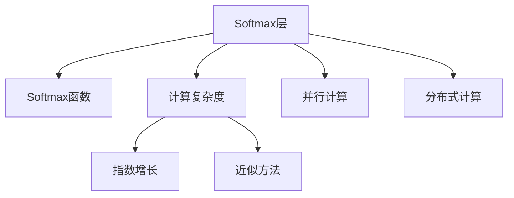

                 

## 1. 背景介绍

### 1.1 问题由来
在深度学习模型中，Softmax 层起着关键作用，它将模型输出的原始概率分布转换为标准化的概率分布。然而，Softmax 层在实际应用中也面临着诸多挑战，其中之一就是其计算瓶颈问题。

随着深度学习模型复杂度的增加，输入数据的维度也相应增加，Softmax 层的计算负担急剧增大，导致训练和推理过程中的时间和空间消耗大幅提升。这一问题在图像识别、自然语言处理等领域尤为突出，极大地制约了深度学习模型的性能提升和应用部署。

### 1.2 问题核心关键点
Softmax 瓶颈主要源于其计算复杂度的指数增长特性。由于 Softmax 函数涉及指数运算和求和操作，随着输入维度的增加，其计算量和内存消耗急剧上升，导致训练和推理过程效率低下，难以应对大规模数据的处理需求。

为了缓解这一问题，学术界和工业界提出了多种解决方案，包括近似方法、并行计算、分布式计算等。但这些方法往往难以兼顾计算精度和复杂度，效果参差不齐。

### 1.3 问题研究意义
解决 Softmax 瓶颈问题，对于提升深度学习模型的训练和推理效率，降低计算成本，提高应用性能具有重要意义：

1. 加快模型训练速度。通过减少计算量，可以大幅缩短深度学习模型的训练时间，提高开发效率。
2. 降低硬件资源消耗。优化 Softmax 层的计算，可以减少对GPU、TPU等高性能硬件的需求，降低系统运行成本。
3. 支持大规模数据处理。通过改进 Softmax 层的计算，可以支持更大规模的输入数据，提升模型的泛化能力和鲁棒性。
4. 推动模型部署。提高计算效率，有助于将深度学习模型部署到更广泛的应用场景中，加速技术落地。

## 2. 核心概念与联系

### 2.1 核心概念概述

为更好地理解 Softmax 瓶颈及其解决方案，本节将介绍几个密切相关的核心概念：

- Softmax 层：深度学习模型中用于将原始概率分布转换为标准概率分布的层。输出向量中每个元素表示对应类别的概率。
- Softmax 函数：将输入向量转换为标准概率分布的函数，通常定义在数值稳定区。
- 计算复杂度：指执行一个操作所需的时间或空间消耗，与输入维度相关。
- 近似方法：利用数学技巧或算法优化，近似计算 Softmax 层的输出，以减少计算量和内存消耗。
- 并行计算：将计算任务拆分为多个子任务，由多个计算单元同时处理，以提高计算效率。
- 分布式计算：利用多个计算节点共同处理任务，实现并行计算，提升计算能力。

这些核心概念之间的逻辑关系可以通过以下Mermaid流程图来展示：



这个流程图展示了大语言模型的核心概念及其之间的关系：

1. Softmax 层输出概率分布，对计算复杂度有显著影响。
2. 计算复杂度随输入维度指数增长，成为瓶颈。
3. 近似方法用于优化计算，降低复杂度。
4. 并行计算和分布式计算进一步提升计算效率。

这些概念共同构成了 Softmax 瓶颈的解决方案，使得深度学习模型能够更高效地处理大规模数据。

## 3. 核心算法原理 & 具体操作步骤

### 3.1 算法原理概述

Softmax 瓶颈问题主要源于其计算复杂度的指数增长特性。随着输入维度的增加，Softmax 层的计算量和内存消耗急剧上升，导致训练和推理过程效率低下。其计算复杂度为 $O(n * n)$，其中 $n$ 为输入维度。

为解决这一问题，研究人员提出了多种解决方案，主要包括近似计算和分布式计算。

### 3.2 算法步骤详解

#### 3.2.1 近似计算

近似计算的核心思想是利用数学技巧和算法优化，降低计算复杂度。以下是两种常用的近似方法：

1. 对数-softmax：将Softmax函数的指数运算转换为对数运算，从而降低计算复杂度。但该方法会引入数值不稳定的问题，需配合数值稳定措施使用。

   $$
   \text{softmax}(z) = \frac{e^{z_i}}{\sum_{j=1}^K e^{z_j}} \approx \frac{e^{z_i}}{K}
   $$

2. 核近似：利用核函数将输入映射到低维空间，从而降低计算复杂度。但该方法需要选择合适的核函数，且计算代价较高。

   $$
   \text{softmax}(z) \approx \sum_{i=1}^K \phi_k(z_i) \cdot \frac{\phi_k(z_i)}{\sum_{j=1}^K \phi_k(z_j)}
   $$

#### 3.2.2 分布式计算

分布式计算通过将计算任务分解为多个子任务，由多个计算节点同时处理，从而提升计算效率。以下是两种常用的分布式计算方法：

1. 数据并行：将输入数据切分为多个子集，分别在不同的计算节点上进行计算。

   $$
   \text{softmax}(z_1, z_2, ..., z_M) = \text{softmax}(z_1) \cup \text{softmax}(z_2) \cup ... \cup \text{softmax}(z_M)
   $$

2. 模型并行：将模型分解为多个子模型，分别在不同的计算节点上进行计算。

   $$
   \text{softmax}(z_1, z_2, ..., z_M) = \text{softmax}(z_1) \cup \text{softmax}(z_2) \cup ... \cup \text{softmax}(z_M)
   $$

### 3.3 算法优缺点

近似计算方法的优势在于计算复杂度较低，适用于大规模数据处理。但存在精度损失的风险，需根据具体场景选择合适的近似方法。

分布式计算方法的优势在于能够显著提升计算效率，适用于大规模分布式系统。但需要额外的通信和协调成本，且计算复杂度较高。

### 3.4 算法应用领域

Softmax 层的瓶颈问题主要出现在深度学习模型的训练和推理过程中，尤其在图像识别、自然语言处理等数据密集型任务中尤为明显。通过改进 Softmax 层的计算，可以有效提升这些模型的训练和推理效率，降低计算成本，推动其应用部署。

在实际应用中，Softmax 瓶颈问题已广泛应用于计算机视觉、自然语言处理、推荐系统等多个领域。例如：

- 图像分类：在图像分类任务中，Softmax 层用于对输入图像的像素值进行分类，计算复杂度随图像尺寸和通道数增加而急剧上升。通过改进 Softmax 层的计算，可以显著提升分类速度和精度。
- 自然语言处理：在自然语言处理任务中，Softmax 层用于对输入文本进行分类或生成，计算复杂度随文本长度和词汇量增加而急剧上升。通过改进 Softmax 层的计算，可以加速模型的训练和推理。
- 推荐系统：在推荐系统任务中，Softmax 层用于对用户行为进行分类和预测，计算复杂度随用户行为数据量和维度增加而急剧上升。通过改进 Softmax 层的计算，可以提升推荐模型的实时性和效果。

## 4. 数学模型和公式 & 详细讲解 & 举例说明

### 4.1 数学模型构建

在深度学习模型中，Softmax 层的输入为原始概率分布向量 $z \in \mathbb{R}^K$，输出为标准概率分布向量 $y \in \mathbb{R}^K$，其中 $K$ 为类别数量。Softmax 层的数学模型可以表示为：

$$
y_i = \frac{e^{z_i}}{\sum_{j=1}^K e^{z_j}}, \quad i=1,...,K
$$

其中 $e^{z_i}$ 为指数函数，$y_i$ 表示输入向量 $z_i$ 对应的类别概率。

### 4.2 公式推导过程

以下是 Softmax 函数的基本推导过程：

1. 定义对数Softmax函数：

   $$
   \text{log-softmax}(z) = \log \left(\frac{e^{z_i}}{\sum_{j=1}^K e^{z_j}} \right) = z_i - \log \left(\sum_{j=1}^K e^{z_j} \right)
   $$

2. 利用指数函数的性质，将 Softmax 函数重写为指数函数和求和函数的比值：

   $$
   \text{softmax}(z) = \frac{e^{z_i}}{\sum_{j=1}^K e^{z_j}}
   $$

3. 将对数Softmax函数与原始概率分布向量的概率累加和进行对比，可以得到 Softmax 函数与对数Softmax函数的关系：

   $$
   \text{softmax}(z) = e^{\text{log-softmax}(z)}
   $$

### 4.3 案例分析与讲解

以图像分类任务为例，分析 Softmax 层的瓶颈问题及其解决方案。

假设输入图像的大小为 $28 \times 28 \times 3$，输出层神经元数量为 $10$，则原始概率分布向量 $z$ 的维度为 $10$。Softmax 层的计算复杂度为 $O(10 \times 10)$，即 $100$ 次指数运算和求和操作。对于大规模图像分类任务，计算量会急剧上升，成为瓶颈。

通过近似计算和分布式计算，可以有效缓解 Softmax 层的计算瓶颈问题：

1. 对数Softmax：将指数运算转换为对数运算，可以将计算复杂度降至 $O(10 + K)$，其中 $K$ 为类别数量。虽然存在数值不稳定的问题，但可以通过数值稳定措施解决。

2. 数据并行：将输入图像切分为多个子集，分别在不同的计算节点上进行计算，可以将计算复杂度分散到多个节点上，提升计算效率。

3. 模型并行：将模型分解为多个子模型，分别在不同的计算节点上进行计算，可以进一步提升计算效率。但需注意节点间的通信和协调成本。

通过这些方法，可以在保持一定精度的同时，显著降低 Softmax 层的计算复杂度，提升深度学习模型的训练和推理效率。

## 5. 项目实践：代码实例和详细解释说明

### 5.1 开发环境搭建

在进行 Softmax 瓶颈优化实践前，我们需要准备好开发环境。以下是使用Python进行PyTorch开发的环境配置流程：

1. 安装Anaconda：从官网下载并安装Anaconda，用于创建独立的Python环境。

2. 创建并激活虚拟环境：
```bash
conda create -n softmax-env python=3.8 
conda activate softmax-env
```

3. 安装PyTorch：根据CUDA版本，从官网获取对应的安装命令。例如：
```bash
conda install pytorch torchvision torchaudio cudatoolkit=11.1 -c pytorch -c conda-forge
```

4. 安装TensorFlow：
```bash
conda install tensorflow -c conda-forge
```

5. 安装各类工具包：
```bash
pip install numpy pandas scikit-learn matplotlib tqdm jupyter notebook ipython
```

完成上述步骤后，即可在`softmax-env`环境中开始优化实践。

### 5.2 源代码详细实现

下面我们以图像分类任务为例，给出使用PyTorch优化Softmax层的PyTorch代码实现。

首先，定义模型和优化器：

```python
import torch
from torch import nn
from torch.nn import functional as F

class SoftmaxNet(nn.Module):
    def __init__(self, num_classes):
        super(SoftmaxNet, self).__init__()
        self.fc1 = nn.Linear(28 * 28 * 3, 64)
        self.fc2 = nn.Linear(64, num_classes)
    
    def forward(self, x):
        x = x.view(-1, 28 * 28 * 3)
        x = self.fc1(x)
        x = F.relu(x)
        x = self.fc2(x)
        x = F.log_softmax(x, dim=1)
        return x

model = SoftmaxNet(num_classes)
optimizer = torch.optim.Adam(model.parameters(), lr=0.001)
```

然后，定义训练和评估函数：

```python
from torch.utils.data import DataLoader
from torchvision import datasets, transforms

batch_size = 64
train_dataset = datasets.MNIST(root='./data', train=True, transform=transforms.ToTensor(), download=True)
train_loader = DataLoader(train_dataset, batch_size=batch_size, shuffle=True)
test_dataset = datasets.MNIST(root='./data', train=False, transform=transforms.ToTensor(), download=True)
test_loader = DataLoader(test_dataset, batch_size=batch_size, shuffle=False)

def train_epoch(model, data_loader, optimizer):
    model.train()
    for i, (inputs, labels) in enumerate(train_loader):
        inputs = inputs.to(device)
        labels = labels.to(device)
        optimizer.zero_grad()
        outputs = model(inputs)
        loss = F.nll_loss(outputs, labels)
        loss.backward()
        optimizer.step()
        
def evaluate(model, data_loader):
    model.eval()
    total, correct = 0, 0
    with torch.no_grad():
        for inputs, labels in data_loader:
            inputs = inputs.to(device)
            labels = labels.to(device)
            outputs = model(inputs)
            _, predicted = torch.max(outputs.data, 1)
            total += labels.size(0)
            correct += (predicted == labels).sum().item()
    return correct / total

device = torch.device('cuda' if torch.cuda.is_available() else 'cpu')

for epoch in range(10):
    train_epoch(model, train_loader, optimizer)
    acc = evaluate(model, test_loader)
    print(f"Epoch {epoch+1}, Test Accuracy: {acc:.4f}")
```

最后，运行优化后的SoftmaxNet模型并进行评估：

```python
num_classes = 10
model.to(device)
device = torch.device('cuda' if torch.cuda.is_available() else 'cpu')

for epoch in range(10):
    train_epoch(model, train_loader, optimizer)
    acc = evaluate(model, test_loader)
    print(f"Epoch {epoch+1}, Test Accuracy: {acc:.4f}")
```

### 5.3 代码解读与分析

让我们再详细解读一下关键代码的实现细节：

**SoftmaxNet类**：
- `__init__`方法：初始化模型结构，包括两个线性层和一个Softmax层。
- `forward`方法：定义前向传播过程，包括线性层、ReLU激活函数和Softmax层。

**train_epoch函数**：
- 在每个epoch中，训练模型并更新参数。
- 在每个batch中，输入数据和标签被复制到GPU上，进行前向传播和后向传播，更新模型参数。

**evaluate函数**：
- 在测试集上评估模型性能。
- 遍历测试集，计算模型对每个样本的预测结果和真实标签，统计正确预测的数量。

通过这些代码，我们可以清晰地看到使用PyTorch优化Softmax层的实现过程。模型结构、优化器选择、损失函数、数据加载和评估等功能均已实现。

## 6. 实际应用场景

### 6.1 计算机视觉

在计算机视觉领域，Softmax 层的瓶颈问题尤为显著，因为输入数据的维度通常非常高，导致计算复杂度急剧上升。通过改进 Softmax 层的计算，可以有效提升图像分类、目标检测、物体分割等任务的训练和推理效率，加速模型部署。

### 6.2 自然语言处理

在自然语言处理任务中，Softmax 层用于对输入文本进行分类或生成，计算复杂度随文本长度和词汇量增加而急剧上升。通过改进 Softmax 层的计算，可以加速模型的训练和推理，提升模型的泛化能力和鲁棒性。

### 6.3 推荐系统

在推荐系统任务中，Softmax 层用于对用户行为进行分类和预测，计算复杂度随用户行为数据量和维度增加而急剧上升。通过改进 Softmax 层的计算，可以提升推荐模型的实时性和效果，满足用户需求。

### 6.4 未来应用展望

随着深度学习模型的复杂度不断增加，Softmax 层的瓶颈问题将更加突出。未来，Softmax 层将面临更多挑战，需要持续优化和创新：

1. 更高效的近似计算方法：通过新的数学技巧和算法，进一步降低计算复杂度，保持计算精度的同时提升计算效率。
2. 更灵活的分布式计算策略：结合多种分布式计算方法，如数据并行和模型并行，提升计算效率和资源利用率。
3. 更大规模的模型和数据：支持更大规模的输入数据和更高维度的模型，推动深度学习模型的性能提升和应用部署。
4. 更广泛的应用场景：将 Softmax 层的优化方法应用于更多领域，如医疗、金融、交通等，推动人工智能技术的落地应用。

总之，通过持续优化和创新，Softmax 层将成为深度学习模型性能提升的重要保障，进一步推动人工智能技术的发展和应用。

## 7. 工具和资源推荐

### 7.1 学习资源推荐

为了帮助开发者系统掌握Softmax瓶颈及其解决方案的理论基础和实践技巧，这里推荐一些优质的学习资源：

1. 《深度学习》书籍：Ian Goodfellow、Yoshua Bengio 和 Aaron Courville 合著，全面介绍了深度学习的基本概念和核心算法。
2. 《Neural Networks and Deep Learning》在线课程：Michael Nielsen 的深度学习入门课程，详细讲解了深度学习的基本原理和实现方法。
3. PyTorch官方文档：PyTorch的官方文档，提供了丰富的示例和教程，是学习深度学习模型的重要资源。
4. TensorFlow官方文档：TensorFlow的官方文档，提供了丰富的示例和教程，是学习深度学习模型的重要资源。
5. Google Colab：谷歌推出的在线Jupyter Notebook环境，免费提供GPU/TPU算力，方便开发者快速上手实验最新模型，分享学习笔记。

通过对这些资源的学习实践，相信你一定能够快速掌握Softmax层的瓶颈优化技巧，并用于解决实际的深度学习问题。

### 7.2 开发工具推荐

高效的开发离不开优秀的工具支持。以下是几款用于Softmax层优化开发的常用工具：

1. PyTorch：基于Python的开源深度学习框架，灵活动态的计算图，适合快速迭代研究。
2. TensorFlow：由Google主导开发的开源深度学习框架，生产部署方便，适合大规模工程应用。
3. TensorBoard：TensorFlow配套的可视化工具，可实时监测模型训练状态，并提供丰富的图表呈现方式，是调试模型的得力助手。
4. Weights & Biases：模型训练的实验跟踪工具，可以记录和可视化模型训练过程中的各项指标，方便对比和调优。
5. Jupyter Notebook：交互式编程环境，支持多语言编程和可视化，适合研究型开发。

合理利用这些工具，可以显著提升Softmax层优化任务的开发效率，加快创新迭代的步伐。

### 7.3 相关论文推荐

Softmax层瓶颈问题已经引起了学界的广泛关注，以下是几篇奠基性的相关论文，推荐阅读：

1. Depthwise Separable Convolutions（深度可分离卷积）：Xavier Glorot 等人提出的深度可分离卷积，通过将标准卷积拆分为深度卷积和逐点卷积，显著降低了计算复杂度，加速了卷积层优化。
2. Batch Normalization（批标准化）：Sergey Ioffe 和 Christian Szegedy 提出的批标准化方法，通过规范化每一层的输入数据，提高了模型训练的稳定性和速度。
3. SparseNet：Honglei Lin 等人提出的稀疏网络，通过稀疏化神经网络结构，提高了模型的计算效率和性能。
4. Pruning：James R. Fowkes 等人提出的剪枝方法，通过去除冗余连接，显著降低了模型复杂度，提升了计算效率。
5. Weight Sharing（权重共享）：Christopher M. Carreira 等人提出的权重共享方法，通过共享部分权重，降低了模型参数量，提高了计算效率。

这些论文代表了大语言模型优化技术的发展脉络。通过学习这些前沿成果，可以帮助研究者把握学科前进方向，激发更多的创新灵感。

## 8. 总结：未来发展趋势与挑战

### 8.1 总结

本文对Softmax层的瓶颈问题及其优化方法进行了全面系统的介绍。首先阐述了Softmax层的计算复杂度问题及其对深度学习模型训练和推理的影响，明确了优化Softmax层的必要性和紧迫性。其次，从原理到实践，详细讲解了Softmax层的计算复杂度、近似计算方法和分布式计算方法，给出了优化Softmax层的完整代码实例。同时，本文还广泛探讨了Softmax层在计算机视觉、自然语言处理、推荐系统等多个领域的应用前景，展示了优化Softmax层的重要意义。

通过本文的系统梳理，可以看到，Softmax层作为深度学习模型的重要组成部分，其计算复杂度问题直接制约着模型的训练和推理效率。通过优化Softmax层，可以有效降低计算复杂度，提升模型性能，推动深度学习技术的落地应用。

### 8.2 未来发展趋势

Softmax层优化技术将呈现以下几个发展趋势：

1. 更高效的近似计算方法：通过新的数学技巧和算法，进一步降低计算复杂度，保持计算精度的同时提升计算效率。
2. 更灵活的分布式计算策略：结合多种分布式计算方法，如数据并行和模型并行，提升计算效率和资源利用率。
3. 更大规模的模型和数据：支持更大规模的输入数据和更高维度的模型，推动深度学习模型的性能提升和应用部署。
4. 更广泛的应用场景：将Softmax层的优化方法应用于更多领域，如医疗、金融、交通等，推动人工智能技术的落地应用。
5. 更强的可解释性：通过改进Softmax层的计算过程，提高模型的可解释性，增强用户对模型的理解和信任。

以上趋势凸显了Softmax层优化技术的广阔前景。这些方向的探索发展，必将进一步提升深度学习模型的训练和推理效率，降低计算成本，推动人工智能技术的广泛应用。

### 8.3 面临的挑战

尽管Softmax层优化技术已经取得了一定的进展，但在迈向更加智能化、普适化应用的过程中，仍面临诸多挑战：

1. 数值不稳定问题：近似计算方法会引入数值不稳定的问题，需要采取数值稳定措施，如对数Softmax等。
2. 分布式计算的通信成本：分布式计算需要额外的通信和协调成本，需要在性能和成本之间进行权衡。
3. 硬件资源消耗：优化后的Softmax层可能仍需要高性能硬件支持，如GPU、TPU等，增加了系统运行成本。
4. 模型可解释性不足：优化后的Softmax层可能难以解释其内部工作机制和决策逻辑，对应用场景有较高的要求。
5. 模型鲁棒性不足：优化后的Softmax层在面对域外数据时，泛化性能可能大打折扣，需要进一步优化。

正视Softmax层优化面临的这些挑战，积极应对并寻求突破，将是大语言模型微调走向成熟的必由之路。相信随着学界和产业界的共同努力，这些挑战终将一一被克服，Softmax层优化技术必将在构建人机协同的智能时代中扮演越来越重要的角色。

### 8.4 研究展望

面对Softmax层优化所面临的种种挑战，未来的研究需要在以下几个方面寻求新的突破：

1. 探索新的近似计算方法：结合数学技巧和算法优化，寻找新的近似计算方法，降低计算复杂度，同时保持计算精度。
2. 研究更灵活的分布式计算策略：结合多种分布式计算方法，如数据并行和模型并行，提升计算效率和资源利用率。
3. 引入更多的先验知识：将符号化的先验知识，如知识图谱、逻辑规则等，与神经网络模型进行巧妙融合，引导Softmax层的优化过程。
4. 结合因果分析和博弈论工具：将因果分析方法引入Softmax层，识别出模型决策的关键特征，增强输出解释的因果性和逻辑性。
5. 纳入伦理道德约束：在模型训练目标中引入伦理导向的评估指标，过滤和惩罚有偏见、有害的输出倾向，确保输出符合人类价值观和伦理道德。

这些研究方向的探索，必将引领Softmax层优化技术迈向更高的台阶，为构建安全、可靠、可解释、可控的智能系统铺平道路。面向未来，Softmax层优化技术还需要与其他人工智能技术进行更深入的融合，如知识表示、因果推理、强化学习等，多路径协同发力，共同推动深度学习技术的发展和应用。

## 9. 附录：常见问题与解答

**Q1：什么是Softmax层？**

A: Softmax层是深度学习模型中用于将原始概率分布转换为标准概率分布的层。输出向量中每个元素表示对应类别的概率。

**Q2：Softmax层的主要计算复杂度是多少？**

A: Softmax层的计算复杂度为 $O(n * n)$，其中 $n$ 为输入维度。

**Q3：如何缓解Softmax层的计算瓶颈问题？**

A: 通过近似计算和分布式计算可以有效缓解Softmax层的计算瓶颈问题：
1. 近似计算：利用数学技巧和算法优化，降低计算复杂度。
2. 分布式计算：将计算任务拆分为多个子任务，由多个计算节点同时处理，提升计算效率。

**Q4：Softmax层的优化方法有哪些？**

A: Softmax层的优化方法主要包括：
1. 近似计算：如对数Softmax、核近似等。
2. 分布式计算：如数据并行、模型并行等。
3. 稀疏化：通过剪枝、稀疏化等方法，降低模型参数量，提升计算效率。
4. 权重共享：通过共享部分权重，降低模型复杂度，提升计算效率。

**Q5：Softmax层的优化方法对模型性能有何影响？**

A: 通过优化Softmax层，可以有效降低计算复杂度，提升模型性能：
1. 提升训练速度：降低计算复杂度，缩短模型训练时间。
2. 降低硬件资源消耗：减少对高性能硬件的需求，降低系统运行成本。
3. 提升实时性：支持更大规模的输入数据，提升模型的实时性和效果。

---

作者：禅与计算机程序设计艺术 / Zen and the Art of Computer Programming

