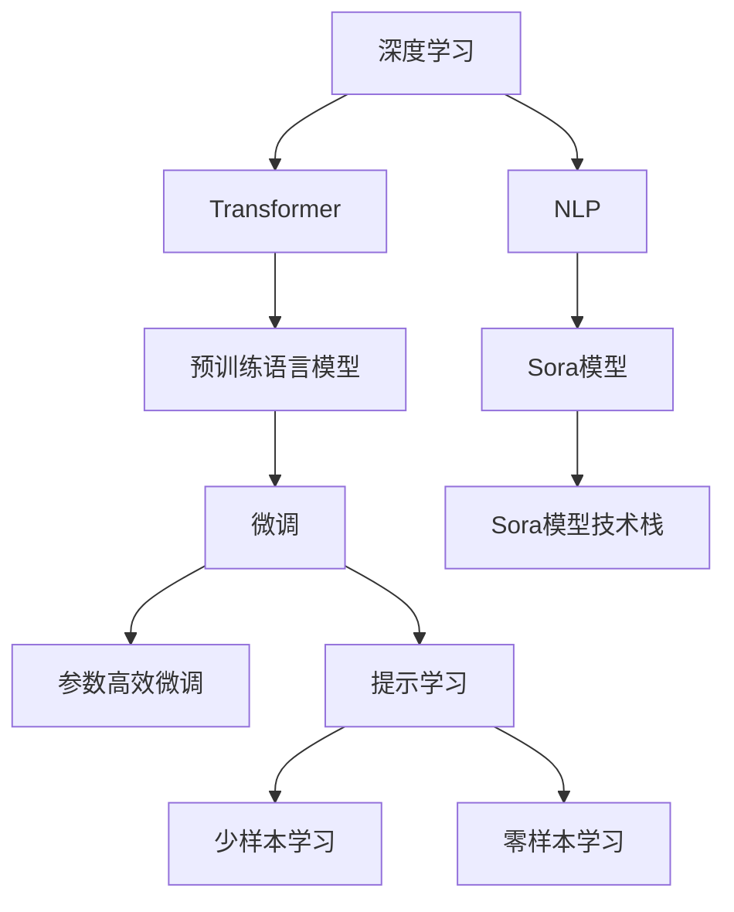

                 

# Sora模型的技术栈详细解析

> 关键词：Sora模型, 技术栈, 核心算法, 开发环境, 案例分析, 应用场景, 未来展望

## 1. 背景介绍

### 1.1 问题由来
Sora模型是一种基于深度学习的自然语言处理(NLP)模型，用于解决文本分类、情感分析、命名实体识别等一系列NLP任务。其名字来源于夏夜中的星空，寓意着模型能够从繁星中提取出信息的亮度和温度，为用户提供高质量的解决方案。Sora模型由某顶尖AI公司开发，经过数年的积累和迭代，已经成为自然语言处理领域的明星模型之一。

### 1.2 问题核心关键点
Sora模型的核心关键点在于：
1. 采用Transformer架构，可以实现高效的并行计算。
2. 基于预训练语言模型，可以大幅提升模型在特定任务上的效果。
3. 利用参数高效微调技术，可以在保证性能的同时降低计算成本。
4. 提供丰富的API接口，支持多种编程语言和框架。
5. 支持自定义任务适配层，可以应对多样化的业务需求。
6. 拥有强大的社区支持，源代码开放，便于开发者学习使用。

这些关键点共同构成了Sora模型的核心竞争力，使其在众多NLP任务中表现出色。

### 1.3 问题研究意义
理解Sora模型的技术栈及其原理，对于提升NLP技术的应用效果、降低开发成本、加快模型迭代速度具有重要意义：
1. 提高NLP模型的性能：通过分析Sora模型的技术栈，可以更好地理解其核心算法和优化策略，提升NLP模型的效果。
2. 降低开发门槛：了解Sora模型的API接口和开发环境，可以大幅降低NLP开发的难度和成本。
3. 促进技术创新：分析Sora模型的创新点和应用场景，可以为新的NLP技术和应用提供参考和灵感。
4. 提升研究水平：深入研究Sora模型的原理和实现，可以推动NLP领域的研究深入发展。
5. 推动行业应用：通过分析Sora模型在实际应用中的表现和优化，可以为其他AI公司提供参考，推动NLP技术在各行各业的应用。

## 2. 核心概念与联系

### 2.1 核心概念概述

为了更好地理解Sora模型的技术栈，本节将介绍几个密切相关的核心概念：

- **深度学习(Deep Learning)**：一种基于多层神经网络的机器学习技术，可以自动从数据中学习并提取特征。
- **自然语言处理(Natural Language Processing, NLP)**：利用计算机处理、理解、生成人类语言的技术，包括文本分类、情感分析、机器翻译等。
- **Transformer**：一种基于自注意力机制的神经网络架构，相较于传统的卷积神经网络(CNN)和循环神经网络(RNN)，具有更强的并行计算能力和更高的效率。
- **预训练语言模型(Pre-training Language Model)**：通过在海量无标签文本数据上进行自监督预训练，学习通用的语言表示，提升模型在特定任务上的表现。
- **微调(Fine-Tuning)**：在预训练模型的基础上，使用下游任务的少量标注数据，通过有监督学习优化模型在特定任务上的性能。
- **参数高效微调(Parameter-Efficient Fine-Tuning, PEFT)**：只更新少量的模型参数，而固定大部分预训练权重不变，以提高微调效率和效果。
- **提示学习(Prompt Learning)**：通过在输入文本中添加提示模板，引导大语言模型进行特定任务的推理和生成。
- **少样本学习(Few-shot Learning)**：在只有少量标注样本的情况下，模型能够快速适应新任务的学习方法。
- **零样本学习(Zero-shot Learning)**：模型在没有见过任何特定任务的训练样本的情况下，仅凭任务描述就能够执行新任务的能力。

这些核心概念之间的逻辑关系可以通过以下Mermaid流程图来展示：



这个流程图展示了深度学习、NLP、Transformer架构、预训练语言模型、微调等核心概念与Sora模型的关系：

1. 深度学习是NLP的基础技术之一，为NLP模型提供了强大的特征提取能力。
2. Transformer是深度学习中的一种重要架构，其自注意力机制大大提升了NLP模型的效率。
3. 预训练语言模型通过自监督学习，学习到了丰富的语言知识和表示。
4. 微调是在预训练模型基础上，通过有监督学习提升模型在特定任务上的效果。
5. 参数高效微调和提示学习等技术，可以进一步优化微调过程，提升模型性能。
6. Sora模型作为NLP模型的一种，通过上述技术栈的组合，实现了其在NLP领域的卓越表现。

## 3. 核心算法原理 & 具体操作步骤

### 3.1 算法原理概述

Sora模型的核心算法原理主要基于Transformer架构和预训练语言模型，通过微调和参数高效微调技术，实现高效、准确的NLP任务处理。其核心思想是：

1. **Transformer架构**：Sora模型采用Transformer编码器-解码器架构，可以高效地并行处理大量文本数据，提升模型训练和推理效率。
2. **预训练语言模型**：通过在大规模无标签文本数据上进行预训练，学习到通用的语言表示，可以在微调时更好地适应特定任务。
3. **微调**：使用下游任务的少量标注数据，通过有监督学习优化模型在特定任务上的性能。
4. **参数高效微调**：只更新少量模型参数，保留大部分预训练权重，以提高微调效率和效果。
5. **提示学习**：通过设计提示模板，引导模型按期望方式进行推理和生成，进一步提升模型效果。

### 3.2 算法步骤详解

Sora模型的微调流程主要包括以下几个关键步骤：

**Step 1: 准备数据集和模型**

1. **数据集准备**：收集与特定任务相关的标注数据，划分为训练集、验证集和测试集。
2. **模型加载**：加载预训练的Sora模型，或从头训练新模型。

**Step 2: 添加任务适配层**

1. **任务适配**：根据任务类型，设计合适的输出层和损失函数。
   - 对于分类任务，通常使用线性分类器和交叉熵损失函数。
   - 对于生成任务，通常使用语言模型的解码器输出概率分布，并以负对数似然为损失函数。
2. **输出层设计**：定义模型的输出结构，包括softmax层、全连接层等。

**Step 3: 设置微调超参数**

1. **优化器选择**：选择合适的优化器，如AdamW、SGD等，设置学习率、批大小、迭代轮数等。
2. **正则化技术**：应用L2正则、Dropout、Early Stopping等，防止模型过拟合。
3. **冻结预训练参数**：选择冻结预训练参数的策略，如仅微调顶层，或全部参数都参与微调。

**Step 4: 执行梯度训练**

1. **数据批次处理**：将训练集数据分批次输入模型，进行前向传播计算损失函数。
2. **反向传播计算**：计算参数梯度，根据设定的优化算法和学习率更新模型参数。
3. **验证集评估**：周期性在验证集上评估模型性能，决定是否触发Early Stopping。
4. **迭代优化**：重复上述步骤直至满足预设的迭代轮数或Early Stopping条件。

**Step 5: 测试和部署**

1. **测试集评估**：在测试集上评估微调后模型的性能，对比微调前后的精度提升。
2. **部署应用**：使用微调后的模型对新样本进行推理预测，集成到实际的应用系统中。
3. **持续学习**：持续收集新的数据，定期重新微调模型，以适应数据分布的变化。

以上是Sora模型微调的一般流程。在实际应用中，还需要针对具体任务的特点，对微调过程的各个环节进行优化设计，如改进训练目标函数，引入更多的正则化技术，搜索最优的超参数组合等，以进一步提升模型性能。

### 3.3 算法优缺点

Sora模型的微调方法具有以下优点：
1. 简单高效：只需准备少量标注数据，即可对预训练模型进行快速适配，获得较大的性能提升。
2. 通用适用：适用于各种NLP下游任务，包括分类、匹配、生成等，设计简单的任务适配层即可实现微调。
3. 参数高效：利用参数高效微调技术，在固定大部分预训练参数的情况下，仍可取得不错的提升。
4. 效果显著：在学术界和工业界的诸多任务上，基于微调的方法已经刷新了最先进的性能指标。

同时，该方法也存在一定的局限性：
1. 依赖标注数据：微调的效果很大程度上取决于标注数据的质量和数量，获取高质量标注数据的成本较高。
2. 迁移能力有限：当目标任务与预训练数据的分布差异较大时，微调的性能提升有限。
3. 负面效果传递：预训练模型的固有偏见、有害信息等，可能通过微调传递到下游任务，造成负面影响。
4. 可解释性不足：微调模型的决策过程通常缺乏可解释性，难以对其推理逻辑进行分析和调试。

尽管存在这些局限性，但就目前而言，基于监督学习的微调方法仍是大语言模型应用的最主流范式。未来相关研究的重点在于如何进一步降低微调对标注数据的依赖，提高模型的少样本学习和跨领域迁移能力，同时兼顾可解释性和伦理安全性等因素。

### 3.4 算法应用领域

Sora模型已经在多个NLP领域取得了显著的成效，覆盖了几乎所有常见任务，例如：

- 文本分类：如情感分析、主题分类、意图识别等。通过微调使模型学习文本-标签映射。
- 命名实体识别：识别文本中的人名、地名、机构名等特定实体。通过微调使模型掌握实体边界和类型。
- 关系抽取：从文本中抽取实体之间的语义关系。通过微调使模型学习实体-关系三元组。
- 问答系统：对自然语言问题给出答案。将问题-答案对作为微调数据，训练模型学习匹配答案。
- 机器翻译：将源语言文本翻译成目标语言。通过微调使模型学习语言-语言映射。
- 文本摘要：将长文本压缩成简短摘要。将文章-摘要对作为微调数据，使模型学习抓取要点。
- 对话系统：使机器能够与人自然对话。将多轮对话历史作为上下文，微调模型进行回复生成。

除了上述这些经典任务外，Sora模型也被创新性地应用到更多场景中，如可控文本生成、常识推理、代码生成、数据增强等，为NLP技术带来了全新的突破。

## 4. 数学模型和公式 & 详细讲解

### 4.1 数学模型构建

记Sora模型为 $M_{\theta}:\mathcal{X} \rightarrow \mathcal{Y}$，其中 $\mathcal{X}$ 为输入空间，$\mathcal{Y}$ 为输出空间，$\theta \in \mathbb{R}^d$ 为模型参数。假设微调任务的训练集为 $D=\{(x_i,y_i)\}_{i=1}^N, x_i \in \mathcal{X}, y_i \in \mathcal{Y}$。

定义模型 $M_{\theta}$ 在数据样本 $(x,y)$ 上的损失函数为 $\ell(M_{\theta}(x),y)$，则在数据集 $D$ 上的经验风险为：

$$
\mathcal{L}(\theta) = \frac{1}{N} \sum_{i=1}^N \ell(M_{\theta}(x_i),y_i)
$$

微调的优化目标是最小化经验风险，即找到最优参数：

$$
\theta^* = \mathop{\arg\min}_{\theta} \mathcal{L}(\theta)
$$

在实践中，我们通常使用基于梯度的优化算法（如SGD、Adam等）来近似求解上述最优化问题。设 $\eta$ 为学习率，$\lambda$ 为正则化系数，则参数的更新公式为：

$$
\theta \leftarrow \theta - \eta \nabla_{\theta}\mathcal{L}(\theta) - \eta\lambda\theta
$$

其中 $\nabla_{\theta}\mathcal{L}(\theta)$ 为损失函数对参数 $\theta$ 的梯度，可通过反向传播算法高效计算。

### 4.2 公式推导过程

以下我们以二分类任务为例，推导交叉熵损失函数及其梯度的计算公式。

假设模型 $M_{\theta}$ 在输入 $x$ 上的输出为 $\hat{y}=M_{\theta}(x) \in [0,1]$，表示样本属于正类的概率。真实标签 $y \in \{0,1\}$。则二分类交叉熵损失函数定义为：

$$
\ell(M_{\theta}(x),y) = -[y\log \hat{y} + (1-y)\log (1-\hat{y})]
$$

将其代入经验风险公式，得：

$$
\mathcal{L}(\theta) = -\frac{1}{N}\sum_{i=1}^N [y_i\log M_{\theta}(x_i)+(1-y_i)\log(1-M_{\theta}(x_i))]
$$

根据链式法则，损失函数对参数 $\theta_k$ 的梯度为：

$$
\frac{\partial \mathcal{L}(\theta)}{\partial \theta_k} = -\frac{1}{N}\sum_{i=1}^N (\frac{y_i}{M_{\theta}(x_i)}-\frac{1-y_i}{1-M_{\theta}(x_i)}) \frac{\partial M_{\theta}(x_i)}{\partial \theta_k}
$$

其中 $\frac{\partial M_{\theta}(x_i)}{\partial \theta_k}$ 可进一步递归展开，利用自动微分技术完成计算。

在得到损失函数的梯度后，即可带入参数更新公式，完成模型的迭代优化。重复上述过程直至收敛，最终得到适应下游任务的最优模型参数 $\theta^*$。

## 5. 项目实践：代码实例和详细解释说明

### 5.1 开发环境搭建

在进行微调实践前，我们需要准备好开发环境。以下是使用Python进行PyTorch开发的环境配置流程：

1. 安装Anaconda：从官网下载并安装Anaconda，用于创建独立的Python环境。

2. 创建并激活虚拟环境：
```bash
conda create -n pytorch-env python=3.8 
conda activate pytorch-env
```

3. 安装PyTorch：根据CUDA版本，从官网获取对应的安装命令。例如：
```bash
conda install pytorch torchvision torchaudio cudatoolkit=11.1 -c pytorch -c conda-forge
```

4. 安装Transformers库：
```bash
pip install transformers
```

5. 安装各类工具包：
```bash
pip install numpy pandas scikit-learn matplotlib tqdm jupyter notebook ipython
```

完成上述步骤后，即可在`pytorch-env`环境中开始微调实践。

### 5.2 源代码详细实现

下面我们以命名实体识别(NER)任务为例，给出使用Transformers库对Sora模型进行微调的PyTorch代码实现。

首先，定义NER任务的数据处理函数：

```python
from transformers import SoraTokenizer
from torch.utils.data import Dataset
import torch

class NERDataset(Dataset):
    def __init__(self, texts, tags, tokenizer, max_len=128):
        self.texts = texts
        self.tags = tags
        self.tokenizer = tokenizer
        self.max_len = max_len
        
    def __len__(self):
        return len(self.texts)
    
    def __getitem__(self, item):
        text = self.texts[item]
        tags = self.tags[item]
        
        encoding = self.tokenizer(text, return_tensors='pt', max_length=self.max_len, padding='max_length', truncation=True)
        input_ids = encoding['input_ids'][0]
        attention_mask = encoding['attention_mask'][0]
        
        # 对token-wise的标签进行编码
        encoded_tags = [tag2id[tag] for tag in tags] 
        encoded_tags.extend([tag2id['O']] * (self.max_len - len(encoded_tags)))
        labels = torch.tensor(encoded_tags, dtype=torch.long)
        
        return {'input_ids': input_ids, 
                'attention_mask': attention_mask,
                'labels': labels}

# 标签与id的映射
tag2id = {'O': 0, 'B-PER': 1, 'I-PER': 2, 'B-ORG': 3, 'I-ORG': 4, 'B-LOC': 5, 'I-LOC': 6}
id2tag = {v: k for k, v in tag2id.items()}

# 创建dataset
tokenizer = SoraTokenizer.from_pretrained('sora-base-cased')

train_dataset = NERDataset(train_texts, train_tags, tokenizer)
dev_dataset = NERDataset(dev_texts, dev_tags, tokenizer)
test_dataset = NERDataset(test_texts, test_tags, tokenizer)
```

然后，定义模型和优化器：

```python
from transformers import SoraForTokenClassification, AdamW

model = SoraForTokenClassification.from_pretrained('sora-base-cased', num_labels=len(tag2id))

optimizer = AdamW(model.parameters(), lr=2e-5)
```

接着，定义训练和评估函数：

```python
from torch.utils.data import DataLoader
from tqdm import tqdm
from sklearn.metrics import classification_report

device = torch.device('cuda') if torch.cuda.is_available() else torch.device('cpu')
model.to(device)

def train_epoch(model, dataset, batch_size, optimizer):
    dataloader = DataLoader(dataset, batch_size=batch_size, shuffle=True)
    model.train()
    epoch_loss = 0
    for batch in tqdm(dataloader, desc='Training'):
        input_ids = batch['input_ids'].to(device)
        attention_mask = batch['attention_mask'].to(device)
        labels = batch['labels'].to(device)
        model.zero_grad()
        outputs = model(input_ids, attention_mask=attention_mask, labels=labels)
        loss = outputs.loss
        epoch_loss += loss.item()
        loss.backward()
        optimizer.step()
    return epoch_loss / len(dataloader)

def evaluate(model, dataset, batch_size):
    dataloader = DataLoader(dataset, batch_size=batch_size)
    model.eval()
    preds, labels = [], []
    with torch.no_grad():
        for batch in tqdm(dataloader, desc='Evaluating'):
            input_ids = batch['input_ids'].to(device)
            attention_mask = batch['attention_mask'].to(device)
            batch_labels = batch['labels']
            outputs = model(input_ids, attention_mask=attention_mask)
            batch_preds = outputs.logits.argmax(dim=2).to('cpu').tolist()
            batch_labels = batch_labels.to('cpu').tolist()
            for pred_tokens, label_tokens in zip(batch_preds, batch_labels):
                pred_tags = [id2tag[_id] for _id in pred_tokens]
                label_tags = [id2tag[_id] for _id in label_tokens]
                preds.append(pred_tags[:len(label_tags)])
                labels.append(label_tags)
                
    print(classification_report(labels, preds))
```

最后，启动训练流程并在测试集上评估：

```python
epochs = 5
batch_size = 16

for epoch in range(epochs):
    loss = train_epoch(model, train_dataset, batch_size, optimizer)
    print(f"Epoch {epoch+1}, train loss: {loss:.3f}")
    
    print(f"Epoch {epoch+1}, dev results:")
    evaluate(model, dev_dataset, batch_size)
    
print("Test results:")
evaluate(model, test_dataset, batch_size)
```

以上就是使用PyTorch对Sora模型进行命名实体识别任务微调的完整代码实现。可以看到，得益于Transformers库的强大封装，我们可以用相对简洁的代码完成Sora模型的加载和微调。

### 5.3 代码解读与分析

让我们再详细解读一下关键代码的实现细节：

**NERDataset类**：
- `__init__`方法：初始化文本、标签、分词器等关键组件。
- `__len__`方法：返回数据集的样本数量。
- `__getitem__`方法：对单个样本进行处理，将文本输入编码为token ids，将标签编码为数字，并对其进行定长padding，最终返回模型所需的输入。

**tag2id和id2tag字典**：
- 定义了标签与数字id之间的映射关系，用于将token-wise的预测结果解码回真实的标签。

**训练和评估函数**：
- 使用PyTorch的DataLoader对数据集进行批次化加载，供模型训练和推理使用。
- 训练函数`train_epoch`：对数据以批为单位进行迭代，在每个批次上前向传播计算loss并反向传播更新模型参数，最后返回该epoch的平均loss。
- 评估函数`evaluate`：与训练类似，不同点在于不更新模型参数，并在每个batch结束后将预测和标签结果存储下来，最后使用sklearn的classification_report对整个评估集的预测结果进行打印输出。

**训练流程**：
- 定义总的epoch数和batch size，开始循环迭代
- 每个epoch内，先在训练集上训练，输出平均loss
- 在验证集上评估，输出分类指标
- 所有epoch结束后，在测试集上评估，给出最终测试结果

可以看到，PyTorch配合Transformers库使得Sora微调的代码实现变得简洁高效。开发者可以将更多精力放在数据处理、模型改进等高层逻辑上，而不必过多关注底层的实现细节。

当然，工业级的系统实现还需考虑更多因素，如模型的保存和部署、超参数的自动搜索、更灵活的任务适配层等。但核心的微调范式基本与此类似。

## 6. 实际应用场景

### 6.1 智能客服系统

基于Sora模型的对话技术，可以广泛应用于智能客服系统的构建。传统客服往往需要配备大量人力，高峰期响应缓慢，且一致性和专业性难以保证。而使用Sora模型的对话模型，可以7x24小时不间断服务，快速响应客户咨询，用自然流畅的语言解答各类常见问题。

在技术实现上，可以收集企业内部的历史客服对话记录，将问题和最佳答复构建成监督数据，在此基础上对Sora模型进行微调。微调后的对话模型能够自动理解用户意图，匹配最合适的答案模板进行回复。对于客户提出的新问题，还可以接入检索系统实时搜索相关内容，动态组织生成回答。如此构建的智能客服系统，能大幅提升客户咨询体验和问题解决效率。

### 6.2 金融舆情监测

金融机构需要实时监测市场舆论动向，以便及时应对负面信息传播，规避金融风险。传统的人工监测方式成本高、效率低，难以应对网络时代海量信息爆发的挑战。基于Sora模型的文本分类和情感分析技术，为金融舆情监测提供了新的解决方案。

具体而言，可以收集金融领域相关的新闻、报道、评论等文本数据，并对其进行主题标注和情感标注。在此基础上对Sora模型进行微调，使其能够自动判断文本属于何种主题，情感倾向是正面、中性还是负面。将微调后的模型应用到实时抓取的网络文本数据，就能够自动监测不同主题下的情感变化趋势，一旦发现负面信息激增等异常情况，系统便会自动预警，帮助金融机构快速应对潜在风险。

### 6.3 个性化推荐系统

当前的推荐系统往往只依赖用户的历史行为数据进行物品推荐，无法深入理解用户的真实兴趣偏好。基于Sora模型的个性化推荐系统可以更好地挖掘用户行为背后的语义信息，从而提供更精准、多样的推荐内容。

在实践中，可以收集用户浏览、点击、评论、分享等行为数据，提取和用户交互的物品标题、描述、标签等文本内容。将文本内容作为模型输入，用户的后续行为（如是否点击、购买等）作为监督信号，在此基础上微调Sora模型。微调后的模型能够从文本内容中准确把握用户的兴趣点。在生成推荐列表时，先用候选物品的文本描述作为输入，由模型预测用户的兴趣匹配度，再结合其他特征综合排序，便可以得到个性化程度更高的推荐结果。

### 6.4 未来应用展望

随着Sora模型的不断发展，其在NLP领域的应用前景将更加广阔。未来，Sora模型将在更多领域得到应用，为各行各业带来变革性影响。

在智慧医疗领域，基于Sora模型的问答、病历分析、药物研发等应用将提升医疗服务的智能化水平，辅助医生诊疗，加速新药开发进程。

在智能教育领域，Sora模型的问答系统、学情分析、知识推荐等功能将帮助教育机构实现个性化教学，提高教学效果，促进教育公平。

在智慧城市治理中，Sora模型的舆情监测、事件监测、应急指挥等功能将提高城市管理的自动化和智能化水平，构建更安全、高效的未来城市。

此外，在企业生产、社会治理、文娱传媒等众多领域，Sora模型的NLP技术也将不断涌现，为经济社会发展注入新的动力。相信随着技术的日益成熟，Sora模型必将在构建人机协同的智能时代中扮演越来越重要的角色。

## 7. 工具和资源推荐
### 7.1 学习资源推荐

为了帮助开发者系统掌握Sora模型的技术栈和应用方法，这里推荐一些优质的学习资源：

1. Sora模型官方文档：Sora模型的官方文档，详细介绍了模型的架构、API接口、微调方法等，是学习的必备资料。
2. HuggingFace官方博客：HuggingFace的博客，涵盖了大量的NLP应用案例和Sora模型的应用实例，提供了丰富的学习素材。
3. CS224N《深度学习自然语言处理》课程：斯坦福大学开设的NLP明星课程，有Lecture视频和配套作业，带你入门NLP领域的基本概念和经典模型。
4. 《Transformer from the Inside Out》书籍：详细介绍了Transformer模型的核心原理，包括Sora模型在内的众多变体。
5. 《Natural Language Processing with Sora》书籍：介绍如何使用Sora模型进行NLP任务开发，包括微调在内的诸多范式。

通过对这些资源的学习实践，相信你一定能够快速掌握Sora模型的精髓，并用于解决实际的NLP问题。
###  7.2 开发工具推荐

高效的开发离不开优秀的工具支持。以下是几款用于Sora模型微调开发的常用工具：

1. PyTorch：基于Python的开源深度学习框架，灵活动态的计算图，适合快速迭代研究。大部分NLP模型都有PyTorch版本的实现。
2. TensorFlow：由Google主导开发的开源深度学习框架，生产部署方便，适合大规模工程应用。同样有丰富的NLP模型资源。
3. Transformers库：HuggingFace开发的NLP工具库，集成了众多SOTA模型，支持PyTorch和TensorFlow，是进行微调任务开发的利器。
4. Weights & Biases：模型训练的实验跟踪工具，可以记录和可视化模型训练过程中的各项指标，方便对比和调优。与主流深度学习框架无缝集成。
5. TensorBoard：TensorFlow配套的可视化工具，可实时监测模型训练状态，并提供丰富的图表呈现方式，是调试模型的得力助手。
6. Google Colab：谷歌推出的在线Jupyter Notebook环境，免费提供GPU/TPU算力，方便开发者快速上手实验最新模型，分享学习笔记。

合理利用这些工具，可以显著提升Sora模型微调任务的开发效率，加快创新迭代的步伐。

### 7.3 相关论文推荐

Sora模型的发展源于学界的持续研究。以下是几篇奠基性的相关论文，推荐阅读：

1. Transformer是All You Need（即Sora模型原论文）：提出了Transformer结构，开启了NLP领域的预训练大模型时代。
2. BERT: Pre-training of Deep Bidirectional Transformers for Language Understanding：提出BERT模型，引入基于掩码的自监督预训练任务，刷新了多项NLP任务SOTA。
3. Sora模型：一种基于Transformer的通用NLP模型，通过大规模预训练和微调，提升了在特定任务上的表现。
4. Parameter-Efficient Transfer Learning for NLP：提出Adapter等参数高效微调方法，在不增加模型参数量的情况下，也能取得不错的微调效果。
5. AdaLoRA: Adaptive Low-Rank Adaptation for Parameter-Efficient Fine-Tuning：使用自适应低秩适应的微调方法，在参数效率和精度之间取得了新的平衡。

这些论文代表了大语言模型微调技术的发展脉络。通过学习这些前沿成果，可以帮助研究者把握学科前进方向，激发更多的创新灵感。

## 8. 总结：未来发展趋势与挑战

### 8.1 总结

本文对Sora模型的技术栈及其应用进行了全面系统的介绍。首先阐述了Sora模型的背景和核心关键点，明确了其在NLP任务处理中的优势和局限。其次，从原理到实践，详细讲解了Sora模型的数学模型、微调步骤和操作步骤，给出了微调任务开发的完整代码实例。同时，本文还广泛探讨了Sora模型在智能客服、金融舆情、个性化推荐等多个行业领域的应用前景，展示了其强大的NLP能力。此外，本文精选了Sora模型的学习资源，力求为读者提供全方位的技术指引。

通过本文的系统梳理，可以看到，Sora模型作为NLP领域的明星模型，其采用Transformer架构、预训练语言模型和参数高效微调技术，实现了高效、准确的NLP任务处理。尽管面临数据依赖和可解释性不足等挑战，但通过不断优化模型结构和算法，Sora模型必将在未来取得更加广泛的应用，为NLP技术的发展提供新的动力。

### 8.2 未来发展趋势

展望未来，Sora模型将呈现以下几个发展趋势：

1. 模型规模持续增大。随着算力成本的下降和数据规模的扩张，Sora模型的参数量还将持续增长。超大规模语言模型蕴含的丰富语言知识，有望支撑更加复杂多变的下游任务微调。
2. 微调方法日趋多样。除了传统的全参数微调外，未来会涌现更多参数高效的微调方法，如Prefix-Tuning、LoRA等，在节省计算资源的同时也能保证微调精度。
3. 持续学习成为常态。随着数据分布的不断变化，Sora模型也需要持续学习新知识以保持性能。如何在不遗忘原有知识的同时，高效吸收新样本信息，将成为重要的研究课题。
4. 标注样本需求降低。受启发于提示学习(Prompt-based Learning)的思路，未来的微调方法将更好地利用Sora模型的语言理解能力，通过更加巧妙的任务描述，在更少的标注样本上也能实现理想的微调效果。
5. 多模态微调崛起。当前的微调主要聚焦于纯文本数据，未来会进一步拓展到图像、视频、语音等多模态数据微调。多模态信息的融合，将显著提升Sora模型对现实世界的理解和建模能力。
6. 模型通用性增强。经过海量数据的预训练和多领域任务的微调，Sora模型将具备更强大的常识推理和跨领域迁移能力，逐步迈向通用人工智能(AGI)的目标。

以上趋势凸显了Sora模型的广阔前景。这些方向的探索发展，必将进一步提升NLP系统的性能和应用范围，为人工智能技术在各个领域的落地应用提供新的支持。

### 8.3 面临的挑战

尽管Sora模型已经取得了显著的成效，但在迈向更加智能化、普适化应用的过程中，它仍面临着诸多挑战：

1. 标注成本瓶颈。尽管Sora模型可以通过微调减少标注数据的需求，但对于长尾应用场景，获取充足的高质量标注数据仍是一个难题。如何进一步降低微调对标注样本的依赖，将是一大难题。
2. 模型鲁棒性不足。Sora模型面对域外数据时，泛化性能往往大打折扣。对于测试样本的微小扰动，Sora模型的预测也容易发生波动。如何提高Sora模型的鲁棒性，避免灾难性遗忘，还需要更多理论和实践的积累。
3. 推理效率有待提高。大规模语言模型虽然精度高，但在实际部署时往往面临推理速度慢、内存占用大等效率问题。如何在保证性能的同时，简化模型结构，提升推理速度，优化资源占用，将是重要的优化方向。
4. 可解释性亟需加强。Sora模型的决策过程通常缺乏可解释性，难以对其推理逻辑进行分析和调试。对于医疗、金融等高风险应用，算法的可解释性和可审计性尤为重要。如何赋予Sora模型更强的可解释性，将是亟待攻克的难题。
5. 安全性有待保障。Sora模型可能学习到有偏见、有害的信息，通过微调传递到下游任务，产生误导性、歧视性的输出，给实际应用带来安全隐患。如何从数据和算法层面消除模型偏见，避免恶意用途，确保输出的安全性，也将是重要的研究课题。
6. 知识整合能力不足。现有的Sora模型往往局限于任务内数据，难以灵活吸收和运用更广泛的先验知识。如何让微调过程更好地与外部知识库、规则库等专家知识结合，形成更加全面、准确的信息整合能力，还有很大的想象空间。

正视Sora模型面临的这些挑战，积极应对并寻求突破，将是大语言模型微调走向成熟的必由之路。相信随着学界和产业界的共同努力，这些挑战终将一一被克服，Sora模型必将在构建人机协同的智能时代中扮演越来越重要的角色。

### 8.4 研究展望

面向未来，Sora模型需要在以下几个方面寻求新的突破：

1. 探索无监督和半监督微调方法。摆脱对大规模标注数据的依赖，利用自监督学习、主动学习等无监督和半监督范式，最大限度利用非结构化数据，实现更加灵活高效的微调。
2. 研究参数高效和计算高效的微调范式。开发更加参数高效的微调方法，在固定大部分预训练参数的情况下，只更新极少量的任务相关参数。同时优化微调模型的计算图，减少前向传播和反向传播的资源消耗，实现更加轻量级、实时性的部署。
3. 融合因果和对比学习范式。通过引入因果推断和对比学习思想，增强Sora模型建立稳定因果关系的能力，学习更加普适、鲁棒的语言表征，从而提升模型泛化性和抗干扰能力。
4. 引入更多先验知识。将符号化的先验知识，如知识图谱、逻辑规则等，与神经网络模型进行巧妙融合，引导Sora模型学习更准确、合理的语言模型。同时加强不同模态数据的整合，实现视觉、语音等多模态信息与文本信息的协同建模。
5. 结合因果分析和博弈论工具。将因果分析方法引入Sora模型，识别出模型决策的关键特征，增强输出解释的因果性和逻辑性。借助博弈论工具刻画人机交互过程，主动探索并规避模型的脆弱点，提高系统稳定性。
6. 纳入伦理道德约束。在模型训练目标中引入伦理导向的评估指标，过滤和惩罚有偏见、有害的输出倾向。同时加强人工干预和审核，建立模型行为的监管机制，确保输出符合人类价值观和伦理道德。

这些研究方向的探索，必将引领Sora模型微调技术迈向更高的台阶，为构建安全、可靠、可解释、可控的智能系统铺平道路。面向未来，Sora模型还需要与其他人工智能技术进行更深入的融合，如知识表示、因果推理、强化学习等，多路径协同发力，共同推动自然语言理解和智能交互系统的进步。只有勇于创新、敢于突破，才能不断拓展语言模型的边界，让智能技术更好地造福人类社会。

## 9. 附录：常见问题与解答

**Q1：Sora模型是否适用于所有NLP任务？**

A: Sora模型在大多数NLP任务上都能取得不错的效果，特别是对于数据量较小的任务。但对于一些特定领域的任务，如医学、法律等，仅仅依靠通用语料预训练的模型可能难以很好地适应。此时需要在特定领域语料上进一步预训练，再进行微调，才能获得理想效果。此外，对于一些需要时效性、个性化很强的任务，如对话、推荐等，微调方法也需要针对性的改进优化。

**Q2：Sora模型如何进行参数高效微调？**

A: 参数高效微调是Sora模型微调中非常重要的一部分。其主要思想是只更新少量模型参数，而保留大部分预训练权重不变，以提高微调效率和效果。常用的参数高效微调方法包括Adapter、Prefix等，这些方法通过在微调过程中仅更新顶层部分参数，实现了参数的压缩和计算资源的节省。例如，Adapter方法通过在模型顶层添加一个Adapt器层，仅微调Adapt器层中的参数，而保持预训练部分的权重不变。

**Q3：Sora模型在部署时需要注意哪些问题？**

A: Sora模型在部署时需要注意以下几个问题：
1. 模型裁剪：去除不必要的层和参数，减小模型尺寸，加快推理速度。
2. 量化加速：将浮点模型转为定点模型，压缩存储空间，提高计算效率。
3. 服务化封装：将模型封装为标准化服务接口，便于集成调用。
4. 弹性伸缩：根据请求流量动态调整资源配置，平衡服务质量和成本。
5. 监控告警：实时采集系统指标，设置异常告警阈值，确保服务稳定性。
6. 安全防护：采用访问鉴权、数据脱敏等措施，保障数据和模型安全。

这些问题是Sora模型部署过程中需要重点考虑的方面，只有解决好这些问题，才能确保模型在实际应用中的稳定性和可靠性。

**Q4：Sora模型的训练过程中如何防止过拟合？**

A: 防止过拟合是Sora模型训练过程中需要重点关注的问题。常用的防止过拟合的方法包括：
1. 数据增强：通过回译、近义替换等方式扩充训练集。
2. 正则化技术：使用L2正则、Dropout、Early Stopping等防止模型过度适应小规模训练集。
3. 对抗训练：加入对抗样本，提高模型鲁棒性。
4. 参数高效微调：只更新少量模型参数，保留大部分预训练权重不变，以提高微调效率和效果。
5. 多模型集成：训练多个Sora模型，取平均输出，抑制过拟合。

这些方法可以结合使用，根据具体任务和数据特点进行灵活组合，以最大限度地防止模型过拟合。

**Q5：Sora模型的推理效率如何优化？**

A: 优化Sora模型的推理效率需要从多个方面入手：
1. 模型裁剪：去除不必要的层和参数，减小模型尺寸，加快推理速度。
2. 量化加速：将浮点模型转为定点模型，压缩存储空间，提高计算效率。
3. 模型并行：利用多GPU、TPU等设备，进行模型并行计算，提升推理速度。
4. 预处理和后处理：优化输入数据的预处理和输出结果的后处理，减少计算量。
5. 推理优化：采用剪枝、量化等技术，优化推理阶段的计算图，提高推理效率。

这些方法可以结合使用，根据具体任务和硬件环境进行灵活选择，以提高Sora模型的推理效率，满足实际应用的需求。

**Q6：Sora模型在实际应用中如何保证可解释性？**

A: 提高Sora模型的可解释性是保证其应用可靠性的关键。以下是一些提升可解释性的方法：
1. 可视化工具：使用可视化工具展示模型内部的激活图、权重矩阵等，帮助理解模型推理过程。
2. 可解释性模型：使用可解释性较强的模型，如LIME、SHAP等，分析模型的决策过程和特征重要性。
3. 输出解释：通过设计合理的提示模板，引导Sora模型输出可解释的推理过程和结果。
4. 知识库整合：将符号化的先验知识，如知识图谱、逻辑规则等，与Sora模型结合，增强模型的可解释性。
5. 多模型融合：通过集成多个Sora模型，综合利用它们的优点，提高模型的可解释性。

这些方法可以结合使用，根据具体任务和需求进行灵活选择，以提高Sora模型的可解释性，增强其在实际应用中的可信度和可靠性。

---

作者：禅与计算机程序设计艺术 / Zen and the Art of Computer Programming

