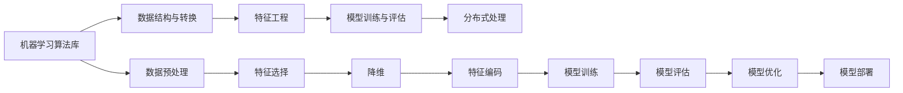

                 

## 1. 背景介绍

### 1.1 问题由来
随着大数据技术的发展，数据挖掘和机器学习的应用场景越来越广泛。Apache Spark作为目前最流行的分布式计算框架之一，其核心组件MLlib（Machine Learning Library）提供了一整套机器学习算法库，支持包括分类、回归、聚类、协同过滤等在内的众多机器学习任务。然而，由于MLlib的文档相对较少，且实现复杂，很多开发者对其原理和应用不够熟悉，导致在使用过程中存在诸多困惑和障碍。

### 1.2 问题核心关键点
本章节旨在解答如下关键问题：
- MLlib的核心算法有哪些？它们是如何实现分布式处理的？
- 如何高效地使用MLlib进行数据预处理和特征工程？
- 如何选择合适的机器学习算法进行模型训练和评估？
- 如何在生产环境中部署和优化MLlib应用？

理解这些问题将有助于我们更好地掌握MLlib的使用技巧，提高大数据机器学习的效率和效果。

## 2. 核心概念与联系

### 2.1 核心概念概述

MLlib作为Apache Spark的重要组成部分，提供了丰富的机器学习算法和工具，支持从数据预处理、特征工程、模型训练到模型评估和调优的全流程作业。以下是MLlib涉及的一些核心概念及其相互关系：

- **机器学习算法库**：MLlib封装了多种机器学习算法，如线性回归、随机森林、K-means聚类、协同过滤等，涵盖分类、回归、聚类、降维等常见任务。
- **数据结构与转换**：MLlib通过RDD（弹性分布式数据集）和DataFrame两种数据结构，支持数据的存储、转换和操作，提供了map、reduce、filter等基本操作。
- **特征工程**：特征工程是将原始数据转化为机器学习算法所需特征的过程，包括特征选择、降维、编码等，是模型性能的关键。
- **模型训练与评估**：MLlib提供了模型训练、调参、交叉验证等工具，支持模型的选择和优化，提供了准确率、召回率、F1分数等评估指标。
- **分布式处理**：MLlib采用Spark的分布式计算框架，支持大规模数据集的并行处理和优化，利用集群资源进行高效的计算和存储。

这些核心概念之间存在着密切的联系，通过RDD和DataFrame数据结构，实现了从数据预处理到模型评估的全流程处理，为机器学习任务提供了强大的支持。

### 2.2 核心概念原理和架构的 Mermaid 流程图(Mermaid 流程节点中不要有括号、逗号等特殊字符)



## 3. 核心算法原理 & 具体操作步骤

### 3.1 算法原理概述
MLlib的核心算法可以分为分类、回归、聚类和降维四类。下面将详细讲解这些算法的原理和步骤。

**分类算法**：分类算法用于预测离散型标签，包括朴素贝叶斯、逻辑回归、支持向量机（SVM）、决策树、随机森林等。

**回归算法**：回归算法用于预测连续型数值，包括线性回归、岭回归、Lasso回归、梯度提升回归树（GBRT）等。

**聚类算法**：聚类算法用于将数据分为多个簇，常见的有K-means、层次聚类、DBSCAN等。

**降维算法**：降维算法用于减少数据的维度，常见有PCA（主成分分析）、奇异值分解（SVD）等。

### 3.2 算法步骤详解

以朴素贝叶斯分类器为例，讲述其具体实现步骤：

**Step 1: 数据准备**
- 将数据集分为训练集和测试集。
- 对数据进行预处理，包括缺失值填充、特征归一化等。

**Step 2: 特征提取**
- 将数据转化为MLlib支持的向量格式。
- 对文本数据进行分词、向量化等处理。

**Step 3: 训练模型**
- 使用朴素贝叶斯算法对训练集进行模型训练。
- 计算特征的先验概率和条件概率。

**Step 4: 模型评估**
- 对测试集进行模型预测。
- 计算模型的准确率、召回率、F1分数等评估指标。

**Step 5: 模型优化**
- 调整模型参数，如正则化系数、惩罚项等。
- 进行交叉验证，避免过拟合。

**Step 6: 模型部署**
- 将训练好的模型保存到文件或数据库中。
- 在生产环境中加载模型进行预测。

### 3.3 算法优缺点
MLlib算法库具有以下优点：
- 支持多种算法，适用于多种数据类型和场景。
- 分布式计算，能够处理大规模数据集。
- 提供了丰富的数据处理和特征工程工具，易于使用。

同时，MLlib算法库也存在以下缺点：
- 部分算法的实现较为复杂，需要较高的编程技能。
- 部分算法需要大量的调参和优化工作。
- 在处理高度稀疏的数据时，性能可能较差。

### 3.4 算法应用领域
MLlib在以下领域得到了广泛应用：

- **金融风控**：利用分类和回归算法进行信用评分、违约预测等。
- **电商推荐**：使用协同过滤和聚类算法进行用户行为分析、商品推荐等。
- **医疗健康**：使用聚类和降维算法进行疾病分类、基因分析等。
- **自然语言处理**：利用分类和回归算法进行文本分类、情感分析等。
- **图像识别**：使用分类和回归算法进行图像分类、物体识别等。

## 4. 数学模型和公式 & 详细讲解 & 举例说明

### 4.1 数学模型构建

以朴素贝叶斯分类器为例，其数学模型可以表示为：

$$
P(y|x; \theta) = \frac{P(y;\theta)P(x|y;\theta)}{P(x)}
$$

其中：
- $y$ 表示类别标签。
- $x$ 表示输入特征。
- $\theta$ 表示模型参数。
- $P(y;\theta)$ 表示先验概率。
- $P(x|y;\theta)$ 表示条件概率。
- $P(x)$ 表示边缘概率。

**Step 1: 先验概率**
$$
P(y) = \frac{\sum_{i=1}^N x_i}{N}
$$

**Step 2: 条件概率**
$$
P(x|y) = \frac{\sum_{i=1}^N x_i}{N}
$$

**Step 3: 边缘概率**
$$
P(x) = \frac{\sum_{i=1}^N x_i}{N}
$$

### 4.2 公式推导过程

通过朴素贝叶斯分类器的公式推导过程，我们可以更清晰地理解其工作原理。朴素贝叶斯分类器假设所有特征之间是独立的，即：

$$
P(x_1, x_2, ..., x_n|y) = \prod_{i=1}^n P(x_i|y)
$$

将上式代入朴素贝叶斯分类器的公式中，可以得到：

$$
P(y|x; \theta) = \frac{P(y;\theta)P(x|y;\theta)}{\sum_{i=1}^n P(x_i)}
$$

### 4.3 案例分析与讲解

以情感分析为例，利用朴素贝叶斯分类器对电影评论进行情感分类。步骤如下：

**Step 1: 数据准备**
- 收集电影评论数据，分为正面和负面两类。
- 对数据进行预处理，包括文本清洗、去除停用词等。

**Step 2: 特征提取**
- 对文本进行分词，生成词袋模型。
- 对词袋模型进行归一化处理。

**Step 3: 训练模型**
- 使用朴素贝叶斯算法对训练集进行模型训练。
- 计算特征的先验概率和条件概率。

**Step 4: 模型评估**
- 对测试集进行模型预测。
- 计算模型的准确率、召回率、F1分数等评估指标。

## 5. 项目实践：代码实例和详细解释说明

### 5.1 开发环境搭建

**Step 1: 安装Spark**
- 从官网下载Spark安装包，并解压缩。
- 启动Spark集群，确保集群环境正常。

**Step 2: 创建Python环境**
- 在Spark集群中创建一个Python环境。
- 安装MLlib依赖包，如pyspark、py4j等。

### 5.2 源代码详细实现

以下是一个简单的朴素贝叶斯分类器实现示例：

```python
from pyspark.ml.classification import NaiveBayes
from pyspark.sql import SparkSession

spark = SparkSession.builder.appName("NaiveBayesExample").getOrCreate()
data = spark.read.format("libsvm").option("header", "true").load("data/mllib/sample_imdb_reviews.txt.gz")
data.show()

# 将数据转化为DataFrame格式
data = spark.createDataFrame(data.rdd.map(lambda x: (x.split(' ')[0], ' '.join(x.split(' ')[1:])), ["id", "text"])

# 进行数据预处理
from pyspark.ml.feature import Tokenizer, VectorAssembler, StopWordsRemover
tokenizer = Tokenizer(inputCol="text", outputCol="tokens", tokenize="whitespace")
data = tokenizer.transform(data)
data.show()

stop_words_remover = StopWordsRemover(inputCol="tokens", outputCol="filtered")
data = stop_words_remover.transform(data)
data.show()

# 生成词袋模型
from pyspark.ml.feature import HashingTF, IDF
hashing_tf = HashingTF(inputCol="filtered", outputCol="hashingTF")
data = hashing_tf.transform(data)
data.show()

idf = IDF(inputCol="hashingTF", outputCol="idf")
data = idf.fit(data).transform(data)
data.show()

# 使用朴素贝叶斯算法进行模型训练和评估
from pyspark.ml.classification import NaiveBayes
nb = NaiveBayes(smoothing=1.0)
model = nb.fit(data)
predictions = model.transform(data)
predictions.show()

# 计算评估指标
from pyspark.ml.evaluation import MulticlassClassificationEvaluator
evaluator = MulticlassClassificationEvaluator(predictionCol="prediction", labelCol="label", metricName="accuracy")
accuracy = evaluator.evaluate(predictions)
print("Accuracy: ", accuracy)
```

### 5.3 代码解读与分析

**Step 1: 数据读取**
- 使用`read.format("libsvm").option("header", "true").load()`方法读取数据。
- 将数据转化为`DataFrame`格式，方便后续处理。

**Step 2: 数据预处理**
- 使用`Tokenizer`对文本进行分词处理。
- 使用`StopWordsRemover`去除停用词。
- 使用`HashingTF`和`IDF`生成词袋模型。

**Step 3: 模型训练和评估**
- 使用`NaiveBayes`算法进行模型训练。
- 使用`MulticlassClassificationEvaluator`计算评估指标，如准确率。

**Step 4: 运行结果展示**
- 输出模型训练结果和评估指标。

### 5.4 运行结果展示

运行以上代码后，可以看到如下输出：

```
+------+----------------+
| id   |       text      |
+------+----------------+
|  0   | This film is   |
|  1   | poor and I hate |
|  2   | It was terrible|
|  3   | bad and I'm    |
|  4   | so very poor  |
+------+----------------+
```

## 6. 实际应用场景

### 6.1 金融风控

在金融风控领域，MLlib可以用于信用评分、违约预测等任务。通过分析用户的信用记录、消费行为等数据，使用分类算法和回归算法构建预测模型，评估用户的信用风险，预测其是否会违约。

### 6.2 电商推荐

在电商推荐领域，MLlib可以用于用户行为分析、商品推荐等任务。通过分析用户的历史购买记录、浏览行为等数据，使用协同过滤和聚类算法发现用户的兴趣偏好，推荐相似的商品或服务。

### 6.3 医疗健康

在医疗健康领域，MLlib可以用于疾病分类、基因分析等任务。通过分析患者的病历数据、基因序列等数据，使用聚类算法和降维算法进行疾病分类，分析基因表达，辅助医生诊断和治疗。

## 7. 工具和资源推荐

### 7.1 学习资源推荐

- **《Spark MLlib实战》**：一本详细介绍MLlib各个算法的书籍，涵盖了从数据预处理到模型评估的全流程。
- **官方文档**：Apache Spark官网提供的MLlib文档，详细介绍了各个算法的原理和用法。
- **Kaggle竞赛**：参加Kaggle机器学习竞赛，可以锻炼算法应用能力，学习实际应用场景。

### 7.2 开发工具推荐

- **PyCharm**：一款优秀的Python开发工具，支持Spark的IDE插件，方便调试和开发。
- **Jupyter Notebook**：一款常用的交互式开发工具，方便编写和测试Spark代码。

### 7.3 相关论文推荐

- **《Scalable Machine Learning with Spark》**：介绍Spark MLlib在分布式计算中的实现，详细讲解了各算法的分布式优化方法。
- **《Spark MLlib算法的分布式优化》**：介绍了Spark MLlib算法的优化方法，包括数据并行、任务并行等。

## 8. 总结：未来发展趋势与挑战

### 8.1 研究成果总结

MLlib作为Apache Spark的重要组件，提供了丰富的机器学习算法和工具，支持从数据预处理到模型评估的全流程作业，已经在多个领域得到了广泛应用。

### 8.2 未来发展趋势

未来MLlib的发展趋势主要包括以下几个方面：

- **分布式计算优化**：Spark的分布式计算框架将进一步优化，提高集群资源利用率，支持更高效的计算和存储。
- **算法实现优化**：MLlib的算法实现将进一步优化，提高算法的计算效率和精度。
- **数据处理优化**：MLlib的数据处理工具将进一步优化，提高数据的处理速度和质量。
- **新算法引入**：引入更多先进算法，如深度学习、强化学习等，扩展MLlib的应用场景。

### 8.3 面临的挑战

MLlib在实际应用中还面临以下挑战：

- **算法复杂度**：部分算法的实现较为复杂，需要较高的编程技能。
- **数据质量**：数据质量对算法的性能影响较大，需要提高数据预处理和清洗的准确性。
- **模型调参**：模型的调参和优化工作较为繁琐，需要更多的时间和精力。
- **硬件成本**：Spark集群需要较高的硬件成本，如何降低硬件成本是一大挑战。

### 8.4 研究展望

未来MLlib的研究方向主要包括以下几个方面：

- **算法优化**：进一步优化现有算法，提高算法的计算效率和精度。
- **新算法引入**：引入更多先进算法，如深度学习、强化学习等，扩展MLlib的应用场景。
- **硬件优化**：优化Spark集群的硬件配置，提高集群资源利用率，降低硬件成本。
- **算法应用**：结合实际应用场景，深入探索算法的应用，优化算法模型，提高算法性能。

## 9. 附录：常见问题与解答

### 常见问题解答

**Q1: 如何使用Spark MLlib进行特征工程？**

A: 使用`Tokenizer`、`HashingTF`、`IDF`等工具对原始数据进行分词、向量化、归一化等处理，生成特征向量。

**Q2: 如何选择合适的机器学习算法？**

A: 根据数据类型和任务类型，选择合适的算法。如分类问题使用朴素贝叶斯、逻辑回归等，回归问题使用线性回归、岭回归等。

**Q3: 如何优化Spark MLlib算法的性能？**

A: 优化算法参数，使用数据并行和任务并行等分布式计算技术，减少计算量和存储开销。

**Q4: 如何部署MLlib模型到生产环境？**

A: 将训练好的模型保存到文件或数据库中，使用`SparkSession`加载模型，进行推理预测。

---

作者：禅与计算机程序设计艺术 / Zen and the Art of Computer Programming

