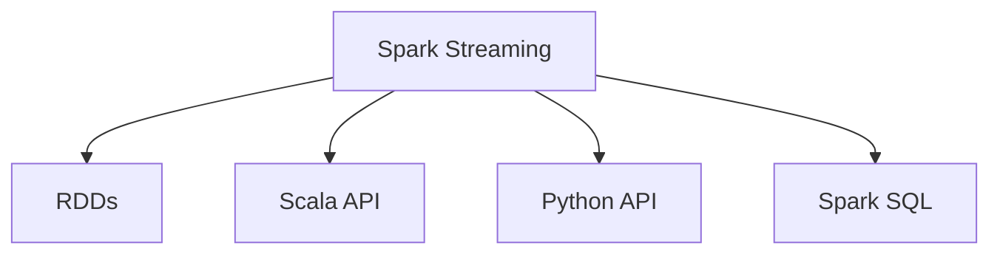

                 

# Spark大数据实时计算框架

## 1. 背景介绍

### 1.1 问题由来
在当今数据驱动的时代，数据的实时性对于决策制定变得愈发重要。无论是金融风控、智能推荐、物流调度，还是医疗健康、城市管理，实时数据的处理与分析已成为企业和机构日常运营的核心需求。传统的批处理系统如Hadoop MapReduce难以满足实时处理的需求，因而大数据实时计算框架应运而生。

Spark，作为Apache基金会推出的快速、通用、可扩展的大数据处理框架，从诞生之初就承载着大数据实时计算的使命。Spark不仅支持批处理，还具有强大的实时计算能力，包括流处理、图计算、机器学习等功能。通过本文，我们将全面解读Spark的大数据实时计算框架，介绍其核心概念、算法原理及操作步骤，并结合实际应用场景，探讨Spark的未来发展趋势与挑战。

### 1.2 问题核心关键点
Spark的大数据实时计算框架主要围绕实时数据处理进行展开，包括流处理、状态维护、窗口操作等关键技术。这些技术的实现依赖于Spark的核心组件如Resilient Distributed Datasets (RDDs)、Spark Streaming、结构化流处理等。

实时计算框架的核心在于：
- 高效实时数据处理：Spark通过实时流处理框架Spark Streaming支持流式数据处理，能够实时收集、处理、分析数据，满足实时需求。
- 可扩展性：Spark采用分布式计算框架，支持大规模数据处理，能够动态扩展计算资源。
- 多样化的API接口：Spark提供多种API接口，如Scala、Java、Python等，支持不同编程语言的使用。
- 内存计算优化：Spark通过内存管理机制和优化算法，提升数据处理速度。

## 2. 核心概念与联系

### 2.1 核心概念概述

为了更好地理解Spark的大数据实时计算框架，本节将介绍几个核心概念：

- Spark Streaming: 是Spark的流式计算组件，支持流数据的实时处理。
- RDDs: 是Spark的基本数据结构，支持多种数据源和处理方式。
- Scala API: 是Spark的核心API之一，提供Scala语言的流处理和批处理操作。
- Python API: 是Spark的Python API，提供Python语言的流处理和批处理操作。
- Spark SQL: 是Spark的SQL接口，支持SQL查询和操作。

这些核心概念之间的逻辑关系可以通过以下Mermaid流程图来展示：



这个流程图展示了Spark Streaming、RDDs、Scala API、Python API、Spark SQL之间的关系：

1. Spark Streaming对流式数据进行处理，生成RDDs。
2. Scala API和Python API提供多种API接口，支持流处理和批处理操作。
3. Spark SQL提供SQL查询和操作接口，支持与Hive等大数据工具的集成。

这些核心概念共同构成了Spark的大数据实时计算框架，使得Spark能够高效处理实时数据，同时具备良好的扩展性和多样化的接口支持。

## 3. 核心算法原理 & 具体操作步骤
### 3.1 算法原理概述

Spark的大数据实时计算框架，本质上是基于分布式计算和内存计算的实时数据处理框架。其核心算法原理主要包括：

- 分布式计算：Spark通过分布式集群计算，将大规模数据划分为多个小任务并行处理，提升数据处理效率。
- 内存计算：Spark采用内存计算，减少I/O操作，提升数据处理速度。
- 流处理：Spark Streaming支持流式数据处理，实现实时数据流与批处理数据流的融合。
- 状态维护：Spark提供状态维护机制，支持流式数据的状态更新和持续计算。

### 3.2 算法步骤详解

Spark的大数据实时计算框架主要包括以下几个关键步骤：

**Step 1: 数据源准备**
- 收集实时数据源，如Kafka、Flume等。
- 将实时数据转换为Spark可以处理的RDDs格式。

**Step 2: 数据预处理**
- 对实时数据进行清洗、去重、转换等预处理操作。
- 将数据划分为多个任务并行处理，利用分布式计算提升效率。

**Step 3: 实时处理**
- 使用Spark Streaming对实时数据进行流处理，生成实时RDDs。
- 定义流处理逻辑，如窗口操作、状态维护等。

**Step 4: 数据持久化与状态维护**
- 将流处理结果持久化，存储到HDFS、Cassandra等存储系统。
- 实现流处理的状态更新和持续计算，如窗口状态、聚合状态等。

**Step 5: 结果展示与实时反馈**
- 将实时处理结果可视化展示，如使用Kafka、ES等实时查询引擎。
- 根据实时处理结果进行实时反馈和决策。

以上是Spark大数据实时计算框架的一般流程。在实际应用中，还需要针对具体任务的特点，对各个环节进行优化设计，如改进数据源处理方式，选择合适的时间窗口，优化状态维护机制等，以进一步提升处理效率和效果。

### 3.3 算法优缺点

Spark大数据实时计算框架具有以下优点：
1. 高效处理实时数据：Spark Streaming支持流式数据处理，能够实时收集、处理、分析数据。
2. 可扩展性强：Spark采用分布式计算框架，支持大规模数据处理，能够动态扩展计算资源。
3. 多样化的API接口：Spark提供多种API接口，如Scala、Java、Python等，支持不同编程语言的使用。
4. 内存计算优化：Spark通过内存管理机制和优化算法，提升数据处理速度。

同时，该框架也存在一定的局限性：
1. 对实时数据的要求高：Spark Streaming要求数据源必须能够实时产生数据。
2. 状态维护开销大：Spark的状态维护机制会增加计算资源消耗，需要合理设计状态大小和更新频率。
3. 处理延迟较大：Spark的状态维护和数据持久化会增加处理延迟，需要优化状态更新和持久化策略。

尽管存在这些局限性，但就目前而言，Spark大数据实时计算框架仍是大数据实时处理的主流方案。未来相关研究的重点在于如何进一步降低状态维护的开销，提升实时处理的速度，同时兼顾可扩展性和处理延迟等问题。

### 3.4 算法应用领域

Spark大数据实时计算框架在多个领域得到了广泛的应用，如：

- 金融风控：实时监控交易数据，检测欺诈行为，及时调整风险控制策略。
- 电商推荐：实时分析用户行为数据，生成个性化推荐，提升用户转化率。
- 物流调度：实时处理订单数据，优化路线规划，提升物流效率。
- 智能制造：实时监控设备数据，预测设备故障，预防生产中断。
- 医疗健康：实时分析病人数据，提供诊断支持，提升医疗服务质量。

除了上述这些经典应用外，Spark大数据实时计算框架也被创新性地应用于更多场景中，如实时数据挖掘、社交网络分析、实时流媒体处理等，为大数据实时处理带来了全新的突破。随着Spark技术的不断进步，相信其在更多领域的应用也将进一步拓展，成为大数据实时处理的重要手段。

## 4. 数学模型和公式 & 详细讲解 & 举例说明
### 4.1 数学模型构建

本节将使用数学语言对Spark的大数据实时计算框架进行更加严格的刻画。

记实时数据流为 $D=\{(x_t)\}_{t=0}^{\infty}$，其中 $x_t$ 表示第 $t$ 个数据样本。定义Spark Streaming的微批处理间隔为 $\Delta t$，则每个微批处理的数据样本为 $x_{t\Delta t}$。设实时数据流的分布为 $P(x_t)$，则微批处理的数据样本 $x_{t\Delta t}$ 的分布为 $P(x_{t\Delta t})$。

定义Spark Streaming的微批处理函数为 $f$，则微批处理结果为 $y_{t\Delta t}=f(x_{t\Delta t})$。微批处理的结果被视为一个新的流，其分布为 $P(y_{t\Delta t})$。

在实际应用中，Spark Streaming通过定义多个微批处理函数 $f_1, f_2, \ldots, f_k$，对实时数据流 $D$ 进行多个微批处理，得到多个微批处理结果流 $\{y_{t\Delta t}\}_{t=0}^{\infty}$。

### 4.2 公式推导过程

以下我们以流窗口计算为例，推导Spark Streaming中窗口计算的数学公式。

假设对实时数据流 $D$ 进行滑动窗口 $w$ 的计算，定义窗口大小为 $T$，则窗口内的数据样本为 $x_{t\Delta t}, x_{(t-1)\Delta t}, \ldots, x_{t-w/T\Delta t}$。将窗口内数据样本进行微批处理，得到窗口计算结果 $y_{t\Delta t} = f_k(x_{t\Delta t}, x_{(t-1)\Delta t}, \ldots, x_{t-w/T\Delta t})$。

根据微批处理函数的定义，可以将窗口计算结果表示为：

$$
y_{t\Delta t} = f_k(x_{t\Delta t}, x_{(t-1)\Delta t}, \ldots, x_{t-w/T\Delta t}) = \sum_{i=0}^{w/T-1} x_{(t-i\Delta t)}
$$

其中 $x_{t\Delta t}, x_{(t-1)\Delta t}, \ldots, x_{t-w/T\Delta t}$ 表示窗口内的微批处理数据样本。

### 4.3 案例分析与讲解

**案例一：流窗口计算**

假设对实时数据流 $D$ 进行滑动窗口 $w$ 的计算，窗口大小为 $T=10$，微批处理间隔为 $\Delta t=1$。定义微批处理函数 $f_k$ 为求和操作，则窗口计算结果为：

$$
y_{t} = \sum_{i=0}^{9} x_{t-i}
$$

将窗口计算结果作为新的流 $D'$，进行实时处理和分析。

**案例二：流状态更新**

假设对实时数据流 $D$ 进行滑动窗口 $w$ 的计算，窗口大小为 $T=10$，微批处理间隔为 $\Delta t=1$。定义微批处理函数 $f_k$ 为求平均值操作，则窗口计算结果为：

$$
y_{t} = \frac{1}{10} \sum_{i=0}^{9} x_{t-i}
$$

将窗口计算结果作为流状态 $S$，实时维护状态 $S$，进行持续计算。

以上是Spark Streaming中窗口计算的数学公式推导及案例分析，展示了Spark Streaming如何通过微批处理和状态更新实现实时数据流的计算和分析。

## 5. 项目实践：代码实例和详细解释说明
### 5.1 开发环境搭建

在进行Spark大数据实时计算框架实践前，我们需要准备好开发环境。以下是使用Python进行PySpark开发的简单环境配置流程：

1. 安装Anaconda：从官网下载并安装Anaconda，用于创建独立的Python环境。

2. 创建并激活虚拟环境：
```bash
conda create -n spark-env python=3.8 
conda activate spark-env
```

3. 安装PySpark：从官网获取PySpark安装包，安装命令如下：
```bash
pip install pyspark
```

4. 配置Spark环境变量：
```bash
export SPARK_HOME=/path/to/spark
export PYSPARK_PYTHON=python
export PYSPARK_DRIVER_PYTHON=python
export PYSPARK_SUBMIT_ARGS="--py-files /path/to/pyspark.zip"
```

5. 启动Spark会话：
```bash
spark-shell
```

完成上述步骤后，即可在`spark-env`环境中开始Spark大数据实时计算框架的实践。

### 5.2 源代码详细实现

下面我们以实时流处理为例，给出使用PySpark进行Spark Streaming的代码实现。

```python
from pyspark import SparkConf, SparkContext, StreamingContext
from pyspark.streaming import StreamingContext

# 设置Spark配置
conf = SparkConf().setMaster('local').setAppName('Spark Streaming Example')
sc = SparkContext(conf=conf)

# 设置流处理上下文
ssc = StreamingContext(sc, 1)  # 微批处理间隔为1秒

# 定义流数据源
lines = ssc.socketTextStream('localhost', 9999)

# 定义流处理逻辑
windowed = lines.map(lambda x: x.split(' ')[0]).window(5, 1)  # 定义5秒滑动窗口
windowed.map(lambda x: (x, 1)).pairBy(lambda x: x)  # 按单词统计

# 流处理结果
windowed.pprint()  # 实时打印窗口结果

# 启动Spark流计算
ssc.start()
ssc.awaitTermination()
```

在这个代码中，我们通过PySpark的StreamingContext创建了一个Spark Streaming环境，设置微批处理间隔为1秒。通过socketTextStream方法定义了流数据源，将数据流映射成单词流，并定义了一个5秒滑动窗口进行单词统计。最后将窗口统计结果实时打印输出。

### 5.3 代码解读与分析

让我们再详细解读一下关键代码的实现细节：

**StreamingContext创建**：
- `SparkConf()`设置Spark配置，`setMaster('local')`表示在本地模式下启动Spark会话。
- `SparkContext(conf=conf)`创建Spark上下文。
- `StreamingContext(sc, 1)`创建Spark Streaming上下文，微批处理间隔为1秒。

**流数据源定义**：
- `lines = ssc.socketTextStream('localhost', 9999)` 定义了本地主机上的端口9999为流数据源。

**流处理逻辑实现**：
- `windowed = lines.map(lambda x: x.split(' ')[0]).window(5, 1)` 将单词流进行5秒滑动窗口定义，并计算每个窗口内的单词数。
- `windowed.map(lambda x: (x, 1)).pairBy(lambda x: x)` 将窗口结果统计成单词-计数对，并按单词进行分区。
- `windowed.pprint()` 实时打印窗口统计结果。

**Spark流计算启动**：
- `ssc.start()` 启动Spark流计算。
- `ssc.awaitTermination()` 等待Spark流计算结束。

通过这些代码，我们可以实现一个简单的Spark Streaming应用，实时处理流数据，并进行窗口统计。

## 6. 实际应用场景
### 6.1 智能推荐系统

Spark的大数据实时计算框架可以广泛应用于智能推荐系统。通过实时处理用户行为数据，如点击、浏览、评分等，智能推荐系统能够实时推荐个性化的商品或内容，提升用户体验和满意度。

在技术实现上，可以收集用户的行为数据，使用Spark Streaming进行实时处理和分析，生成用户画像。同时，通过Spark SQL进行实时查询，实时调整推荐算法，生成推荐结果。如此构建的智能推荐系统，能够实时响应用户需求，提升推荐效果和用户体验。

### 6.2 实时监控与告警

Spark的大数据实时计算框架可以用于实时监控系统性能和业务指标。通过实时处理日志和指标数据，系统能够及时发现异常情况，进行告警和故障定位。

在技术实现上，可以收集系统的日志和业务指标数据，使用Spark Streaming进行实时处理和分析。同时，通过Spark SQL进行实时查询，实时监控系统状态，生成告警信息。根据告警信息，系统可以自动执行故障定位、自我修复等操作，提升系统的稳定性和可靠性。

### 6.3 实时数据挖掘

Spark的大数据实时计算框架可以用于实时数据挖掘，从大量实时数据中提取有价值的信息，支持数据的深度分析与挖掘。

在技术实现上，可以收集实时数据流，使用Spark Streaming进行实时处理和分析，进行聚类、分类、关联分析等操作。同时，通过Spark SQL进行实时查询，实时展示挖掘结果。如此构建的实时数据挖掘系统，能够及时发现数据中的隐含规律和关系，提供决策支持。

### 6.4 未来应用展望

随着Spark技术的不断进步，其在大数据实时计算框架中的应用前景也将进一步拓展，为大数据实时处理提供更加强大的支持。

在智能制造、智慧城市、物联网等领域，Spark大数据实时计算框架将得到更广泛的应用，实时处理海量数据，支持高效、智能、可靠的系统建设。未来，Spark将不断探索新的应用场景，推动大数据实时计算技术的发展和普及。

## 7. 工具和资源推荐
### 7.1 学习资源推荐

为了帮助开发者系统掌握Spark大数据实时计算框架的理论基础和实践技巧，这里推荐一些优质的学习资源：

1. Spark官方文档：Spark的官方文档详细介绍了Spark的API接口、流处理、批处理、MLlib等核心组件，是系统学习Spark的必备资料。
2. Scala语言教程：Spark的核心API之一是Scala语言，掌握Scala语言是理解和应用Spark的基础。
3. PySpark教程：PySpark是Spark的Python API，掌握PySpark能够高效地进行Spark流处理和批处理操作。
4. Spark大数据与流处理技术：这是一本全面介绍Spark大数据与流处理技术的书籍，涵盖Spark的核心概念和实践技巧。
5. Spark实战：这是一本实战型的Spark教程，通过具体案例讲解Spark的实际应用，适合动手实践。

通过对这些资源的学习实践，相信你一定能够快速掌握Spark大数据实时计算框架的精髓，并用于解决实际的业务问题。

### 7.2 开发工具推荐

高效的开发离不开优秀的工具支持。以下是几款用于Spark大数据实时计算框架开发的常用工具：

1. PySpark：基于Python的Spark API，支持多种编程语言，如Scala、Java等。
2. Spark SQL：Spark的SQL接口，支持SQL查询和操作，与Hive等大数据工具兼容。
3. Spark Streaming：Spark的流处理框架，支持实时数据处理和分析。
4. Spark UI：Spark的可视化界面，实时展示流处理和批处理进程，方便监控和调试。
5. Spark Debugger：Spark的调试工具，实时监控Spark作业的执行情况，定位问题。

合理利用这些工具，可以显著提升Spark大数据实时计算框架的开发效率，加快创新迭代的步伐。

### 7.3 相关论文推荐

Spark大数据实时计算框架的研究源于学界的持续探索。以下是几篇奠基性的相关论文，推荐阅读：

1. Resilient Distributed Datasets: A Fault-Tolerant Abstraction for In-Memory Cluster Computing：提出RDDs模型，构建分布式内存计算框架，为Spark提供底层支持。
2. Spark: Cluster Computing with Working Sets：介绍Spark的内存计算优化和高效分布式计算，为Spark的核心特性提供理论支撑。
3. Spark Streaming: Fast and Scalable Data Processing：提出Spark Streaming的流处理框架，支持实时数据处理。
4. GraphX: A Library for Distributed Graph-Parallel Computation in Apache Spark：提出GraphX库，支持Spark的图计算功能，扩展Spark的应用范围。
5. Spark MLlib: Machine Learning in Spark：提出Spark的MLlib库，支持机器学习算法，丰富Spark的数据分析能力。

这些论文代表了大数据实时计算框架的研究脉络。通过学习这些前沿成果，可以帮助研究者把握Spark的发展方向，激发更多的创新灵感。

## 8. 总结：未来发展趋势与挑战
### 8.1 总结

本文对Spark大数据实时计算框架进行了全面系统的介绍。首先阐述了Spark实时计算框架的研究背景和意义，明确了Spark在实时数据处理中的独特价值。其次，从原理到实践，详细讲解了Spark实时计算框架的核心概念、算法原理及操作步骤，给出了Spark流处理应用的完整代码实例。同时，本文还广泛探讨了Spark实时计算框架在智能推荐、实时监控、数据挖掘等多个领域的应用前景，展示了Spark实时计算框架的巨大潜力。

通过本文的系统梳理，可以看到，Spark大数据实时计算框架正在成为大数据实时处理的重要范式，极大地拓展了Spark的应用边界，推动了大数据实时处理技术的发展。未来，伴随Spark技术的持续演进，Spark实时计算框架必将在大数据实时处理中发挥越来越重要的作用。

### 8.2 未来发展趋势

展望未来，Spark大数据实时计算框架将呈现以下几个发展趋势：

1. 高性能优化：Spark将不断优化内存计算、分布式计算等关键技术，提升实时数据处理的速度和效率。
2. 多样化的流处理功能：Spark将扩展流处理功能，支持更多流处理API和操作，满足更多实时数据处理需求。
3. 深度集成：Spark将与更多大数据生态系统进行深度集成，支持Spark与其他大数据工具的无缝对接。
4. 可视化与监控：Spark将进一步提升可视化与监控功能，实时展示流处理和批处理进程，提供更好的用户体验。
5. 实时机器学习：Spark将结合机器学习算法，提供实时机器学习功能，支持基于实时数据的模型训练和预测。
6. 扩展性优化：Spark将不断优化扩展性，支持更大规模数据处理，提供更灵活的资源管理。

以上趋势凸显了Spark大数据实时计算框架的广阔前景。这些方向的探索发展，必将进一步提升Spark在实时数据处理中的性能和应用范围，为大数据实时处理提供更加强大的支持。

### 8.3 面临的挑战

尽管Spark大数据实时计算框架已经取得了瞩目成就，但在迈向更加智能化、普适化应用的过程中，它仍面临着诸多挑战：

1. 流处理延迟：Spark的流处理延迟较高，难以满足实时性要求较高的应用场景。
2. 状态维护开销：Spark的状态维护机制增加了计算资源消耗，需要合理设计状态大小和更新频率。
3. 扩展性问题：Spark的扩展性在不同集群环境下的表现有所差异，需要优化资源配置。
4. 高并发控制：Spark在大规模高并发环境下容易发生任务竞争、资源争抢等问题，需要改进任务调度和资源管理。
5. 安全性问题：Spark在处理敏感数据时可能面临数据泄露、恶意操作等问题，需要加强数据保护和安全管理。

正视Spark面临的这些挑战，积极应对并寻求突破，将使得Spark实时计算框架在未来的发展中更加稳健和成熟。

### 8.4 研究展望

面对Spark实时计算框架所面临的挑战，未来的研究需要在以下几个方面寻求新的突破：

1. 优化流处理延迟：通过改进Spark的流处理算法，提升实时数据处理速度，降低处理延迟。
2. 降低状态维护开销：优化状态维护机制，减少计算资源消耗，提高流处理性能。
3. 提升扩展性：优化资源配置和管理，支持更大规模数据处理，提供更灵活的扩展机制。
4. 改进高并发控制：优化任务调度和资源管理，提升高并发环境下的性能和稳定性。
5. 增强安全性：引入数据保护和安全管理机制，保障数据安全性和系统安全性。

这些研究方向将推动Spark实时计算框架的进一步发展，使其在大数据实时处理中发挥更大的作用，为各行业的数字化转型提供有力支持。总之，Spark实时计算框架的研究与实践，需要不断探索和创新，才能实现更高性能、更广应用、更稳定安全的未来。

## 9. 附录：常见问题与解答

**Q1：Spark流处理是否适用于所有实时数据处理场景？**

A: Spark流处理适用于大多数实时数据处理场景，但针对某些高实时性、高并发性的应用场景，如高频交易、实时监控等，可能需要使用专门的流处理框架，如Apache Flink、Apache Storm等。

**Q2：Spark流处理如何避免状态维护的开销？**

A: 在Spark流处理中，状态维护开销主要来源于状态更新和存储。可以通过以下方法降低状态维护的开销：
1. 使用简洁的数据结构，如Map、Set等，减少状态大小。
2. 优化状态更新逻辑，减少状态更新频率。
3. 使用流式存储系统，如Cassandra、HDFS等，减少状态存储开销。
4. 引入外存缓存机制，将部分状态缓存到外存中，减少内存消耗。

**Q3：Spark流处理如何降低流处理延迟？**

A: 降低Spark流处理延迟需要优化以下关键环节：
1. 优化流数据源，减少数据传输延迟。
2. 优化流处理逻辑，减少中间计算开销。
3. 优化状态维护机制，减少状态更新频率。
4. 引入流式聚合算法，如流式MapReduce、流式窗口操作等，提高流处理效率。
5. 使用高效的数据分区策略，减少数据移动开销。

**Q4：Spark流处理如何处理高并发场景？**

A: 在Spark流处理中，高并发场景下容易发生任务竞争、资源争抢等问题。可以通过以下方法解决：
1. 优化任务调度策略，采用公平调度、优先级调度等策略，提高任务执行效率。
2. 引入弹性伸缩机制，动态调整计算资源，提升系统承载能力。
3. 使用流式监控工具，实时监测系统状态，及时调整任务分配和资源配置。
4. 引入分布式锁机制，避免任务竞争和数据冲突。

**Q5：Spark流处理如何保障数据安全？**

A: 在Spark流处理中，数据安全问题需要特别注意。可以通过以下方法保障数据安全：
1. 加强数据加密和传输安全，使用SSL/TLS协议进行数据传输。
2. 引入访问控制机制，限制数据的访问权限。
3. 采用数据隔离技术，将敏感数据隔离存储。
4. 定期进行数据审计和监控，发现并处理数据泄露和安全问题。

通过这些方法，可以有效地保障Spark流处理的数据安全和系统稳定性，提升系统的可靠性和安全性。

---

作者：禅与计算机程序设计艺术 / Zen and the Art of Computer Programming

