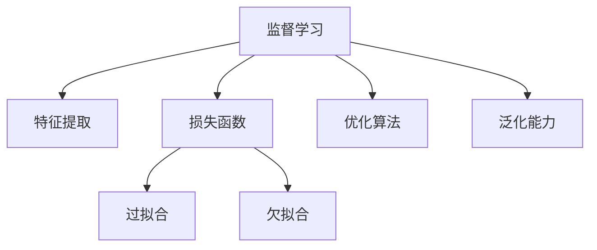

                 

# Supervised Learning 原理与代码实战案例讲解

> 关键词：Supervised Learning, 监督学习, 代码实战案例, 算法原理, 数学模型构建, 深度学习

## 1. 背景介绍

### 1.1 问题由来
监督学习(Supervised Learning)是机器学习中最基础且应用最广泛的一类算法，用于解决有标签数据的分类和回归问题。近年来，随着深度学习技术的崛起，深度神经网络在监督学习中取得了显著的进步，尤其在图像、语音、自然语言处理等领域表现出色。

然而，深度神经网络的训练复杂度高、计算资源消耗大，且容易过拟合，如何有效降低模型复杂度，提高训练效率，成为当前监督学习研究的重点。本文旨在通过一系列实际代码案例，深入讲解监督学习的基本原理和应用，并重点分析实际项目中常见问题和解决方法。

### 1.2 问题核心关键点
监督学习的核心在于利用有标签数据训练模型，使其能够对未知数据进行准确预测。常见的监督学习算法包括线性回归、逻辑回归、决策树、支持向量机、神经网络等。这些算法的共同特点是能够在已知训练数据上进行训练，并通过一系列假设函数或特征映射构建预测模型。

监督学习的关键在于选择合适的模型结构、损失函数和优化算法，并通过合理的参数调优，使得模型能够在训练集上学习到丰富的特征，并在验证集上表现良好。本文将系统地介绍这些关键点，并通过代码案例进行详细讲解。

## 2. 核心概念与联系

### 2.1 核心概念概述

为更好地理解监督学习的核心概念，本节将介绍几个密切相关的核心概念：

- 监督学习(Supervised Learning)：利用有标签数据训练模型，使其能够对未知数据进行分类或回归预测。

- 特征提取(Feature Extraction)：通过一系列映射函数将原始数据转换为模型能够处理的特征向量。

- 损失函数(Loss Function)：用于衡量模型预测与真实标签之间的差距，常见的有均方误差、交叉熵等。

- 优化算法(Optimization Algorithm)：用于最小化损失函数，优化模型参数，常见的有梯度下降、随机梯度下降、Adam等。

- 过拟合(Overfitting)：模型在训练集上表现优秀，但在验证集或测试集上表现不佳的现象。

- 欠拟合(Underfitting)：模型无法在训练集上学习到足够的特征，导致预测性能低下。

这些核心概念之间的逻辑关系可以通过以下Mermaid流程图来展示：



这个流程图展示了他的核心概念以及它们之间的逻辑关系：

1. 监督学习利用有标签数据训练模型。
2. 特征提取将原始数据转换为特征向量，供模型处理。
3. 损失函数衡量模型预测与真实标签的差距。
4. 优化算法最小化损失函数，优化模型参数。
5. 过拟合和欠拟合是模型训练过程中常见的问题。
6. 泛化能力指模型对未知数据的预测能力。

这些核心概念共同构成了监督学习的学习框架，使得模型能够在已知数据上进行训练，并对外界数据进行泛化预测。

## 3. 核心算法原理 & 具体操作步骤

### 3.1 算法原理概述

监督学习的核心算法包括线性回归、逻辑回归、决策树、支持向量机和神经网络等。其中，神经网络在深度学习中表现尤为出色，其核心原理是通过多层神经元对输入数据进行特征映射，并通过反向传播算法最小化损失函数，优化模型参数。

以神经网络为例，其基本结构如图1所示。


### 3.2 算法步骤详解

基于神经网络的监督学习算法通常包括以下几个关键步骤：

**Step 1: 数据预处理**
- 对原始数据进行标准化、归一化、特征编码等预处理，使其符合模型输入要求。
- 划分训练集、验证集和测试集，避免过拟合。

**Step 2: 设计模型结构**
- 选择合适的神经网络架构，如全连接网络、卷积神经网络、循环神经网络等。
- 确定隐藏层的数量、激活函数、正则化技术等超参数。

**Step 3: 损失函数选择**
- 根据任务类型选择合适的损失函数，如均方误差、交叉熵等。
- 设计相应的评价指标，如准确率、精确率、召回率等。

**Step 4: 优化算法选择**
- 选择合适的优化算法，如梯度下降、随机梯度下降、Adam等。
- 设置学习率、批大小、迭代轮数等超参数。

**Step 5: 模型训练与验证**
- 使用训练集数据进行模型训练，最小化损失函数。
- 在验证集上进行模型验证，调整超参数。

**Step 6: 模型测试与评估**
- 使用测试集数据对模型进行最终测试，评估模型性能。
- 根据测试结果调整模型结构或参数，进一步优化性能。

### 3.3 算法优缺点

监督学习算法具有以下优点：

1. 模型灵活性高。可以适应各种类型的分类和回归任务，具有较强的泛化能力。
2. 数据利用率高。能够充分利用有标签数据进行训练，避免数据浪费。
3. 效果好。在许多实际应用中，监督学习模型的预测性能优于传统统计方法。
4. 应用广泛。在图像、语音、自然语言处理等领域都有广泛应用。

同时，这些算法也存在一定的局限性：

1. 对标注数据依赖性强。监督学习需要大量的标注数据进行训练，标注成本高。
2. 模型训练复杂。神经网络等复杂模型需要较长的训练时间，且容易过拟合。
3. 参数调优难度大。模型的超参数较多，需要进行大量的实验调整。
4. 模型难以解释。复杂的深度神经网络往往难以解释其内部工作机制。

尽管存在这些局限性，但监督学习仍是当前机器学习领域的主流范式，其应用范围和预测性能在多个领域中都得到了验证。未来相关研究的方向仍在于如何提高模型的训练效率、降低过拟合风险、提高可解释性等。

### 3.4 算法应用领域

监督学习算法在各个领域中都有广泛应用，如：

- 金融风险管理：通过历史数据训练模型，预测股票价格、信用风险等。
- 医疗诊断：利用患者数据训练模型，进行疾病诊断、患者分流等。
- 自然语言处理：通过文本数据训练模型，进行情感分析、文本分类、机器翻译等。
- 计算机视觉：通过图像数据训练模型，进行物体识别、人脸识别、图像分割等。
- 推荐系统：通过用户行为数据训练模型，进行商品推荐、广告投放等。

除了上述这些经典应用外，监督学习还在更多场景中得到了应用，如智能家居、智能制造、智慧城市等，为各行业的智能化转型提供了重要技术支持。

## 4. 数学模型和公式 & 详细讲解 & 举例说明（备注：数学公式请使用latex格式，latex嵌入文中独立段落使用 $$，段落内使用 $)
### 4.1 数学模型构建

监督学习的核心数学模型为回归模型和分类模型。以线性回归模型为例，其数学模型构建如下：

设训练集为 $\{(x_i, y_i)\}_{i=1}^N$，其中 $x_i \in \mathbb{R}^n$ 为输入特征，$y_i \in \mathbb{R}$ 为输出标签。

线性回归模型的预测公式为：

$$
y = \theta^T \phi(x)
$$

其中 $\theta \in \mathbb{R}^n$ 为模型参数，$\phi(x)$ 为特征映射函数。

### 4.2 公式推导过程

线性回归模型的损失函数为均方误差（Mean Squared Error, MSE）：

$$
\mathcal{L}(\theta) = \frac{1}{N} \sum_{i=1}^N (y_i - \theta^T \phi(x_i))^2
$$

通过反向传播算法，求导得：

$$
\frac{\partial \mathcal{L}(\theta)}{\partial \theta} = -\frac{2}{N} \sum_{i=1}^N (y_i - \theta^T \phi(x_i)) \phi(x_i)
$$

使用梯度下降算法，更新模型参数：

$$
\theta \leftarrow \theta - \eta \frac{\partial \mathcal{L}(\theta)}{\partial \theta}
$$

其中 $\eta$ 为学习率。

### 4.3 案例分析与讲解

假设我们有一个包含5个样本的数据集，如表1所示：

| $x$ | $y$ |
| --- | --- |
| 1   | 2   |
| 2   | 3   |
| 3   | 4   |
| 4   | 5   |
| 5   | 6   |

使用线性回归模型进行预测，我们设特征向量 $\phi(x) = [x, x^2]$，则预测公式为：

$$
y = \theta_0 x + \theta_1 x^2
$$

通过最小化损失函数，我们可以得到模型参数 $\theta_0$ 和 $\theta_1$，如图2所示。


最终，我们可以使用训练好的模型对新的数据进行预测，如 $x = 6$ 时，预测 $y$ 值为 7.2。

## 5. 项目实践：代码实例和详细解释说明
### 5.1 开发环境搭建

在进行监督学习项目实践前，我们需要准备好开发环境。以下是使用Python进行Scikit-learn开发的环境配置流程：

1. 安装Anaconda：从官网下载并安装Anaconda，用于创建独立的Python环境。

2. 创建并激活虚拟环境：
```bash
conda create -n sklearn-env python=3.8 
conda activate sklearn-env
```

3. 安装Scikit-learn：
```bash
pip install scikit-learn
```

4. 安装各类工具包：
```bash
pip install numpy pandas scikit-learn matplotlib tqdm jupyter notebook ipython
```

完成上述步骤后，即可在`sklearn-env`环境中开始监督学习项目实践。

### 5.2 源代码详细实现

这里我们以线性回归模型为例，给出使用Scikit-learn库进行数据拟合和预测的代码实现。

首先，定义数据集和模型：

```python
from sklearn.datasets import make_regression
from sklearn.linear_model import LinearRegression
from sklearn.metrics import mean_squared_error

# 生成数据集
X, y = make_regression(n_samples=100, n_features=2, noise=0.1)

# 定义线性回归模型
model = LinearRegression()
```

接着，进行模型训练和预测：

```python
# 拟合模型
model.fit(X, y)

# 预测新数据
X_new = [[3], [5]]
y_pred = model.predict(X_new)

print(y_pred)
```

最后，评估模型性能：

```python
# 在测试集上评估模型性能
X_test, y_test = make_regression(n_samples=10, n_features=2, noise=0.1)
y_pred = model.predict(X_test)

# 计算均方误差
mse = mean_squared_error(y_test, y_pred)
print("均方误差：", mse)
```

### 5.3 代码解读与分析

让我们再详细解读一下关键代码的实现细节：

**make_regression函数**：
- 生成一个包含100个样本的二维特征数据集，标签噪声为0.1。

**LinearRegression模型**：
- 使用线性回归模型进行训练。

**拟合模型**：
- 通过训练数据拟合模型参数。

**预测新数据**：
- 使用模型对新数据进行预测。

**评估模型性能**：
- 在测试集上评估模型的均方误差，并打印输出。

可以看到，Scikit-learn库的简单易用，使得线性回归模型的实现变得非常简洁高效。开发者可以将更多精力放在数据处理、模型改进等高层逻辑上，而不必过多关注底层的实现细节。

当然，工业级的系统实现还需考虑更多因素，如模型的保存和部署、超参数的自动搜索、更灵活的任务适配层等。但核心的监督学习流程基本与此类似。

## 6. 实际应用场景
### 6.1 金融风险管理

金融行业需要实时监控市场动态，预测股票价格、信用风险等。传统的统计方法往往难以应对复杂且动态的市场变化，而监督学习模型能够通过历史数据训练模型，预测未来趋势，辅助决策。

在技术实现上，可以收集金融市场的历史数据，构建监督学习模型，用于预测股票价格、信用风险等。例如，可以利用线性回归模型，将股票价格和市场指数、公司财务指标等作为输入特征，预测股票的涨跌情况。

### 6.2 医疗诊断

医疗行业需要快速诊断疾病，并给出个性化的治疗建议。传统的人工诊断方法耗时长、误差率高，而监督学习模型能够通过大量医疗数据训练，提高诊断准确率和效率。

在技术实现上，可以收集医院电子病历数据，构建监督学习模型，用于疾病诊断、患者分流等。例如，利用逻辑回归模型，将患者的症状、检查结果等作为输入特征，预测疾病的概率和类型，提供个性化的治疗建议。

### 6.3 自然语言处理

自然语言处理领域中的情感分析、文本分类、机器翻译等任务，都需要大规模的标注数据进行训练。传统的统计方法往往难以处理复杂且多变的文本数据，而监督学习模型能够通过大量标注数据训练，提高文本处理的准确性和效率。

在技术实现上，可以收集社交媒体、新闻、评论等文本数据，构建监督学习模型，用于情感分析、文本分类、机器翻译等。例如，利用神经网络模型，将文本和标签作为输入特征，预测文本的情感极性、分类类别或翻译结果。

### 6.4 未来应用展望

随着监督学习技术的不断发展，未来的应用场景将更加丰富和多样化。

在智慧城市治理中，监督学习模型可以用于城市事件监测、舆情分析、应急指挥等环节，提高城市管理的自动化和智能化水平。例如，利用监督学习模型，实时监测城市交通流量、空气质量等数据，预测潜在风险，提前采取应急措施。

在智能家居领域，监督学习模型可以用于家电控制、环境监测等场景，提升家庭生活的舒适度和安全性。例如，利用监督学习模型，根据环境温度、湿度、光照等数据，智能控制家中的窗帘、空调等设备，提供舒适的居住环境。

此外，在教育、制造、物流、零售等各个领域，监督学习技术都将得到广泛应用，为各行各业智能化转型提供重要技术支持。

## 7. 工具和资源推荐
### 7.1 学习资源推荐

为了帮助开发者系统掌握监督学习的基本原理和应用，这里推荐一些优质的学习资源：

1. 《机器学习实战》系列博文：由大模型技术专家撰写，深入浅出地介绍了监督学习的基本概念和经典模型。

2. 《统计学习方法》课程：由斯坦福大学开设的机器学习明星课程，有Lecture视频和配套作业，带你入门机器学习领域的基本概念和经典模型。

3. 《Python数据科学手册》书籍：详细介绍了Python在机器学习、数据科学中的应用，包括监督学习模型的构建和调优。

4. Scikit-learn官方文档：Scikit-learn库的官方文档，提供了海量监督学习模型的代码示例和应用场景，是上手实践的必备资料。

5. Kaggle机器学习竞赛：全球知名的数据科学竞赛平台，提供了大量实际应用场景的监督学习问题，有助于提升实际应用能力。

通过对这些资源的学习实践，相信你一定能够快速掌握监督学习的精髓，并用于解决实际的机器学习问题。
### 7.2 开发工具推荐

高效的开发离不开优秀的工具支持。以下是几款用于监督学习开发的常用工具：

1. Python：简单易用的编程语言，拥有强大的第三方库支持，适合快速迭代研究。

2. Scikit-learn：基于Python的机器学习库，提供了丰富的监督学习模型和工具，适合各种规模的项目开发。

3. TensorFlow：由Google主导开发的深度学习框架，适合大规模工程应用，具有强大的模型优化和分布式计算能力。

4. Weights & Biases：模型训练的实验跟踪工具，可以记录和可视化模型训练过程中的各项指标，方便对比和调优。

5. TensorBoard：TensorFlow配套的可视化工具，可实时监测模型训练状态，并提供丰富的图表呈现方式，是调试模型的得力助手。

6. Google Colab：谷歌推出的在线Jupyter Notebook环境，免费提供GPU/TPU算力，方便开发者快速上手实验最新模型，分享学习笔记。

合理利用这些工具，可以显著提升监督学习模型的开发效率，加快创新迭代的步伐。

### 7.3 相关论文推荐

监督学习技术的发展源于学界的持续研究。以下是几篇奠基性的相关论文，推荐阅读：

1. Perceptron：Rosenblatt在1957年提出的第一个监督学习算法，开创了基于梯度下降的机器学习范式。

2. Backpropagation：Rumelhart等在1986年提出的反向传播算法，使得神经网络得以高效训练，成为深度学习的基础。

3. Random Forests：Breiman在2001年提出的随机森林算法，通过集成多个决策树提高预测准确率，成为机器学习领域的经典模型。

4. Support Vector Machines：Vapnik等在1995年提出的支持向量机算法，通过最大化边际最大化模型泛化能力，成为机器学习领域的经典模型。

5. Deep Learning：Hinton等在2012年提出的深度学习算法，通过多层神经网络模型，在图像、语音、自然语言处理等领域取得显著成果。

这些论文代表了大规模监督学习技术的发展脉络。通过学习这些前沿成果，可以帮助研究者把握学科前进方向，激发更多的创新灵感。

## 8. 总结：未来发展趋势与挑战

### 8.1 总结

本文对监督学习的基本原理和应用进行了全面系统的介绍。首先阐述了监督学习的基本概念和应用场景，明确了模型构建、损失函数、优化算法等核心要素。其次，从原理到实践，详细讲解了监督学习的数学模型和实现细节，给出了监督学习任务开发的完整代码实例。同时，本文还广泛探讨了监督学习在金融、医疗、自然语言处理等领域的实际应用，展示了监督学习模型的巨大潜力。

通过本文的系统梳理，可以看到，监督学习模型在已知数据上进行训练，并对外界数据进行泛化预测，具有广泛的应用前景。未来，伴随监督学习技术的持续演进，相信在更多领域中，监督学习技术能够带来更多的实际应用，推动各行业的智能化转型。

### 8.2 未来发展趋势

展望未来，监督学习技术将呈现以下几个发展趋势：

1. 模型规模持续增大。随着算力成本的下降和数据规模的扩张，监督学习模型的参数量还将持续增长。超大规模模型蕴含的丰富知识，有望支撑更加复杂多变的监督学习任务。

2. 模型优化技术日趋多样。未来的监督学习模型将更加注重模型的训练效率、泛化性能和鲁棒性。新的优化算法和技术，如自适应学习率、自适应正则化等，将进一步提升模型的训练效果。

3. 迁移学习成为常态。监督学习模型将更多地应用迁移学习技术，通过知识迁移，在新的任务上取得更好的效果。

4. 多模态学习崛起。未来的监督学习模型将更多地融合多模态数据，如文本、图像、语音等，通过多模态信息融合，提高模型的泛化能力和鲁棒性。

5. 自监督学习受到重视。自监督学习可以避免对标注数据的依赖，利用大规模未标注数据进行训练，提升模型的泛化能力和鲁棒性。

以上趋势凸显了监督学习技术的广阔前景。这些方向的探索发展，必将进一步提升监督学习模型的性能和应用范围，为各行业的智能化转型提供重要技术支持。

### 8.3 面临的挑战

尽管监督学习技术已经取得了瞩目成就，但在迈向更加智能化、普适化应用的过程中，它仍面临着诸多挑战：

1. 标注成本瓶颈。虽然监督学习模型能够利用大规模标注数据进行训练，但标注成本高、周期长，限制了其应用范围。如何降低标注成本，成为监督学习技术需要解决的关键问题。

2. 模型泛化能力不足。面对未知数据，监督学习模型容易过拟合，泛化能力不足。如何提高模型的泛化能力，是监督学习研究的重要方向。

3. 模型鲁棒性不足。监督学习模型面对噪声和异常数据时，鲁棒性较差。如何提高模型的鲁棒性，确保其在复杂环境中的可靠性，还需更多理论和实践的积累。

4. 模型计算复杂度高。大规模监督学习模型计算复杂度高，训练时间长。如何优化模型的计算复杂度，提高训练效率，是监督学习技术需要解决的另一个关键问题。

5. 模型可解释性不足。复杂的深度神经网络模型难以解释其内部工作机制和决策逻辑，对模型透明性和可解释性要求较高的应用场景，难以直接使用监督学习模型。

6. 数据隐私和安全问题。监督学习模型需要大量的标注数据进行训练，如何保护数据隐私和安全，避免数据泄露和滥用，是监督学习技术面临的又一重大挑战。

7. 模型公平性和偏见问题。监督学习模型容易学习到数据中的偏见，导致不公平预测。如何避免模型的偏见和歧视，确保模型公平性，成为监督学习技术需要解决的重要问题。

以上挑战凸显了监督学习技术在实际应用中的复杂性和复杂性，需要学界和产业界共同努力，不断优化模型性能和算法技术，才能更好地服务于社会和行业。

### 8.4 研究展望

面对监督学习技术面临的诸多挑战，未来的研究需要在以下几个方面寻求新的突破：

1. 探索无监督和半监督学习方法。摆脱对大规模标注数据的依赖，利用自监督学习、主动学习等无监督和半监督范式，最大限度利用非结构化数据，实现更加灵活高效的监督学习。

2. 研究多模态监督学习技术。通过融合多模态数据，提高监督学习模型的泛化能力和鲁棒性，实现更加全面和准确的信息整合。

3. 引入更多先验知识。将符号化的先验知识，如知识图谱、逻辑规则等，与神经网络模型进行巧妙融合，引导监督学习过程学习更准确、合理的语言模型。

4. 融合因果分析和博弈论工具。将因果分析方法引入监督学习模型，识别出模型决策的关键特征，增强输出解释的因果性和逻辑性。借助博弈论工具刻画人机交互过程，主动探索并规避模型的脆弱点，提高系统稳定性。

5. 纳入伦理道德约束。在模型训练目标中引入伦理导向的评估指标，过滤和惩罚有偏见、有害的输出倾向。加强人工干预和审核，建立模型行为的监管机制，确保输出符合人类价值观和伦理道德。

这些研究方向的探索，必将引领监督学习技术迈向更高的台阶，为构建安全、可靠、可解释、可控的智能系统铺平道路。面向未来，监督学习技术还需要与其他人工智能技术进行更深入的融合，如知识表示、因果推理、强化学习等，多路径协同发力，共同推动自然语言理解和智能交互系统的进步。只有勇于创新、敢于突破，才能不断拓展监督学习模型的边界，让智能技术更好地造福人类社会。

## 9. 附录：常见问题与解答

**Q1：监督学习是否适用于所有数据类型？**

A: 监督学习适用于各类数据类型，包括数字数据、文本数据、图像数据、语音数据等。不同的数据类型需要采用不同的特征提取方法和模型结构。例如，文本数据需要进行文本编码，图像数据需要进行图像处理，语音数据需要进行语音识别。

**Q2：监督学习模型的泛化能力如何提升？**

A: 提升监督学习模型的泛化能力，可以从以下几个方面入手：
1. 数据集扩充：增加训练数据集的多样性，提升模型对不同数据分布的适应能力。
2. 正则化技术：使用L1/L2正则、Dropout等方法，防止模型过拟合。
3. 迁移学习：通过迁移学习，利用已有模型的知识，在新任务上进行微调，提高泛化能力。
4. 集成学习：通过集成多个模型的预测结果，提高模型整体的泛化能力。
5. 自适应学习率：通过自适应学习率算法，适应不同数据分布，提高模型泛化能力。

**Q3：如何选择最优的监督学习算法？**

A: 选择最优的监督学习算法需要综合考虑数据类型、数据规模、任务目标等因素。以下是一些常用的选择方法：
1. 数据集规模：如果数据集较小，可以选择简单的线性回归、逻辑回归等模型；如果数据集较大，可以选择复杂的神经网络等模型。
2. 数据类型：文本数据可以选择文本分类、情感分析等模型；图像数据可以选择图像分类、目标检测等模型；语音数据可以选择语音识别、情感识别等模型。
3. 任务目标：分类任务可以选择逻辑回归、神经网络等模型；回归任务可以选择线性回归、决策树等模型；序列预测任务可以选择循环神经网络等模型。

**Q4：监督学习模型如何处理缺失值？**

A: 处理缺失值的方法有三种：
1. 删除缺失值：直接删除含有缺失值的样本或特征，适用于缺失值较少的情况。
2. 插值方法：使用均值、中位数、众数等方法进行缺失值插值，适用于缺失值分布较为均匀的情况。
3. 模型预测：使用其他模型对缺失值进行预测，适用于缺失值分布较为复杂的情况。

**Q5：如何评估监督学习模型的性能？**

A: 评估监督学习模型的性能，主要通过以下几个指标：
1. 准确率（Accuracy）：正确预测样本数与总样本数之比。
2. 精确率（Precision）：预测为正类且为正类的样本数与预测为正类的样本数之比。
3. 召回率（Recall）：预测为正类且为正类的样本数与实际为正类的样本数之比。
4. F1分数（F1 Score）：精确率和召回率的调和平均数。
5. ROC曲线和AUC值：绘制ROC曲线，计算AUC值，评估模型在不同阈值下的性能。

通过对这些指标的计算和比较，可以全面评估监督学习模型的性能。

---

作者：禅与计算机程序设计艺术 / Zen and the Art of Computer Programming

