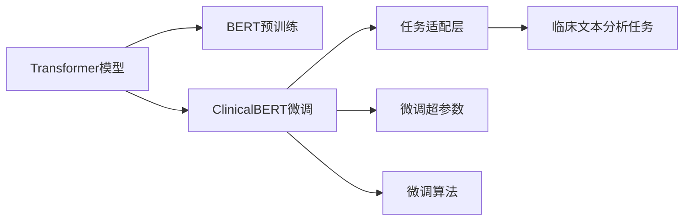

                 

# Transformer大模型实战：ClinicalBERT模型

> 关键词：Transformer, 大模型, ClinicalBERT, 临床文本分析, 深度学习, 自然语言处理(NLP)

## 1. 背景介绍

### 1.1 问题由来
随着深度学习技术的飞速发展，基于Transformer架构的大模型（如BERT、GPT等）在自然语言处理（NLP）领域取得了革命性进展。大模型通过在大规模无标签文本数据上进行自监督预训练，学习到丰富的语言知识和上下文关联能力。然而，预训练大模型通常依赖于通用的无偏数据集，对于特定的垂直领域（如医疗、法律、金融等），其泛化能力往往不足。因此，针对特定领域的大模型微调成为了当前研究的热点。

### 1.2 问题核心关键点
针对特定领域的微调方法，可以进一步提升大模型在该领域上的性能。该方法的主要思路包括：

1. **数据准备**：收集特定领域的标注数据集。
2. **模型适配**：在预训练模型的基础上，添加针对特定任务的任务层，并使用该数据集进行微调。
3. **超参数调优**：选择合适的学习率、批大小、迭代次数等超参数，防止过拟合和欠拟合。
4. **性能评估**：使用验证集和测试集评估微调后模型的性能。
5. **应用部署**：将微调后的模型集成到实际应用中，进行实时推理。

本节将重点介绍ClinicalBERT模型，这是一种针对临床文本分析任务的Transformer大模型微调方法。

### 1.3 问题研究意义
ClinicalBERT模型通过在大规模临床文本数据上进行微调，能够自动理解临床文本中的疾病、症状、药物等信息，并在疾病诊断、治疗方案推荐等医疗领域中发挥重要作用。该模型不仅提升了医疗领域的文本分析能力，还为医生的辅助诊断和治疗决策提供了重要支持，具有深远的社会和经济价值。

## 2. 核心概念与联系

### 2.1 核心概念概述

本节将介绍一些与ClinicalBERT模型相关的核心概念及其关系：

- **Transformer模型**：一种基于自注意力机制的神经网络架构，通过多头自注意力机制捕捉不同位置的上下文信息，具有强大的建模能力。

- **大模型**：指具有大量参数的预训练模型，如BERT、GPT等，能够在丰富的语料上进行自监督学习，获得通用的语言表示。

- **微调**：在预训练模型基础上，通过有监督学习优化模型在特定任务上的性能，以适应特定的领域需求。

- **临床文本分析**：使用NLP技术处理和分析临床文本数据，如病历记录、医学文献等，以辅助医生进行疾病诊断、治疗方案推荐等医疗决策。

- **ClinicalBERT**：基于BERT模型的微调模型，专门用于临床文本分析任务，能够处理结构化和半结构化临床文本，提取疾病相关特征，并用于疾病分类、药物推荐等医疗任务。

### 2.2 核心概念原理和架构的 Mermaid 流程图



## 3. 核心算法原理 & 具体操作步骤

### 3.1 算法原理概述

ClinicalBERT模型是基于BERT模型的微调方法，通过在大规模临床文本数据上进行微调，学习到临床领域的语言表示。其核心思想是在预训练模型的基础上，通过有监督学习优化模型在临床文本分析任务上的性能，从而提升模型的领域适应性。

### 3.2 算法步骤详解

1. **数据准备**：收集临床文本数据集，包括病人的病历记录、医学文献等。对数据进行清洗和标注，构建标注数据集。

2. **模型适配**：在预训练BERT模型基础上，添加针对临床文本分析任务的输出层。对于分类任务，通常使用线性分类器和交叉熵损失函数。

3. **微调**：使用标注数据集训练微调后的模型，调整模型参数，使得模型输出与标注标签一致。选择合适的学习率、批大小、迭代次数等超参数。

4. **性能评估**：在验证集上评估微调后模型的性能，使用准确率、F1-score等指标。

5. **应用部署**：将微调后的模型集成到实际医疗应用中，进行实时推理，辅助医生进行疾病诊断和治疗决策。

### 3.3 算法优缺点

#### 优点：
1. **领域适应性强**：通过微调，ClinicalBERT模型能够适应临床领域的特定需求，提升医疗文本分析能力。
2. **精度高**：基于大模型的微调方法，通常能够获得高精度的模型输出。
3. **易于部署**：微调后的模型可以方便地集成到医疗系统中，实现实时推理。

#### 缺点：
1. **数据需求高**：微调模型需要大规模的标注临床文本数据，数据获取成本高。
2. **模型复杂**：大模型的参数量较大，计算资源消耗高。
3. **泛化能力有限**：微调模型仅能在特定领域表现良好，对其他领域的泛化能力有限。

### 3.4 算法应用领域

ClinicalBERT模型主要应用于临床文本分析任务，包括但不限于：

- 疾病分类：通过微调模型，自动识别临床文本中的疾病类型，辅助医生进行疾病诊断。
- 治疗方案推荐：利用微调后的模型，根据病人症状和病史，推荐最适合的治疗方案。
- 医学文献摘要：对医学文献进行文本摘要，提取关键信息，便于医生快速浏览。
- 电子病历摘要：对病人的电子病历进行摘要，提取重要病史信息，支持医生快速查阅。

## 4. 数学模型和公式 & 详细讲解 & 举例说明

### 4.1 数学模型构建

ClinicalBERT模型的数学模型建立在BERT模型的基础上，主要包括以下几个关键组成部分：

1. **输入层**：将临床文本转换为模型可接受的向量形式。
2. **Transformer编码器**：对输入文本进行编码，捕捉文本中的上下文信息。
3. **任务适配层**：将编码器的输出映射到特定的任务，如分类或回归。
4. **输出层**：对任务适配层的输出进行解码，得到最终的预测结果。

### 4.2 公式推导过程

假设输入文本为 $x$，输出结果为 $y$。ClinicalBERT模型的计算过程可以表示为：

$$
y = f_{\theta}(x)
$$

其中 $f_{\theta}$ 表示ClinicalBERT模型的前向传播过程，$\theta$ 为模型参数。

对于分类任务，通常使用交叉熵损失函数：

$$
\mathcal{L}(\theta) = -\frac{1}{N}\sum_{i=1}^N \sum_{j=1}^C y_{ij} \log p_{ij}
$$

其中 $N$ 为样本数，$C$ 为类别数，$y_{ij}$ 为第 $i$ 个样本的第 $j$ 个类别的真实标签，$p_{ij}$ 为模型输出的第 $i$ 个样本第 $j$ 个类别的概率。

对于回归任务，通常使用均方误差损失函数：

$$
\mathcal{L}(\theta) = \frac{1}{N}\sum_{i=1}^N (y_i - f_{\theta}(x_i))^2
$$

### 4.3 案例分析与讲解

以疾病分类为例，假设有100个临床文本样本，每个样本包含一个疾病的标签。使用ClinicalBERT模型进行微调，目标是最小化交叉熵损失：

1. **数据预处理**：将100个临床文本样本转换为模型可接受的向量形式，并进行归一化处理。
2. **模型训练**：使用交叉熵损失函数，对ClinicalBERT模型进行训练，调整模型参数，最小化损失函数。
3. **性能评估**：在验证集上评估模型性能，使用准确率、F1-score等指标。
4. **应用部署**：将微调后的模型集成到实际医疗应用中，对新的临床文本进行疾病分类预测。

## 5. 项目实践：代码实例和详细解释说明

### 5.1 开发环境搭建

以下是使用PyTorch搭建ClinicalBERT模型的开发环境：

1. 安装Anaconda：
```
conda create -n pytorch-env python=3.8
conda activate pytorch-env
```

2. 安装PyTorch和Transformer库：
```
conda install pytorch torchvision torchaudio cudatoolkit=11.1 -c pytorch -c conda-forge
pip install transformers
```

3. 安装必要的Python库：
```
pip install numpy pandas scikit-learn matplotlib tqdm jupyter notebook ipython
```

### 5.2 源代码详细实现

以下是使用ClinicalBERT模型进行疾病分类的Python代码实现：

```python
import torch
import numpy as np
from transformers import BertForSequenceClassification, BertTokenizer, AdamW

# 加载预训练模型和分词器
model_name = 'bert-base-uncased'
tokenizer = BertTokenizer.from_pretrained(model_name)
model = BertForSequenceClassification.from_pretrained(model_name, num_labels=2)

# 定义数据集
class ClinicalDataset(torch.utils.data.Dataset):
    def __init__(self, texts, labels):
        self.texts = texts
        self.labels = labels

    def __len__(self):
        return len(self.texts)

    def __getitem__(self, idx):
        text = self.texts[idx]
        label = self.labels[idx]

        encoding = tokenizer(text, return_tensors='pt', max_length=128, padding='max_length', truncation=True)
        input_ids = encoding['input_ids']
        attention_mask = encoding['attention_mask']
        return {'input_ids': input_ids, 
                'attention_mask': attention_mask,
                'labels': torch.tensor(label, dtype=torch.long)}

# 加载数据集
train_data = ClinicalDataset(train_texts, train_labels)
val_data = ClinicalDataset(val_texts, val_labels)
test_data = ClinicalDataset(test_texts, test_labels)

# 设置超参数
learning_rate = 2e-5
epochs = 5
batch_size = 16
optimizer = AdamW(model.parameters(), lr=learning_rate)

# 训练模型
device = torch.device('cuda') if torch.cuda.is_available() else torch.device('cpu')
model.to(device)

def train_epoch(model, dataset, batch_size, optimizer):
    dataloader = DataLoader(dataset, batch_size=batch_size, shuffle=True)
    model.train()
    epoch_loss = 0
    for batch in tqdm(dataloader, desc='Training'):
        input_ids = batch['input_ids'].to(device)
        attention_mask = batch['attention_mask'].to(device)
        labels = batch['labels'].to(device)
        model.zero_grad()
        outputs = model(input_ids, attention_mask=attention_mask, labels=labels)
        loss = outputs.loss
        epoch_loss += loss.item()
        loss.backward()
        optimizer.step()
    return epoch_loss / len(dataloader)

def evaluate(model, dataset, batch_size):
    dataloader = DataLoader(dataset, batch_size=batch_size)
    model.eval()
    preds, labels = [], []
    with torch.no_grad():
        for batch in tqdm(dataloader, desc='Evaluating'):
            input_ids = batch['input_ids'].to(device)
            attention_mask = batch['attention_mask'].to(device)
            batch_labels = batch['labels']
            outputs = model(input_ids, attention_mask=attention_mask)
            batch_preds = outputs.logits.argmax(dim=1).to('cpu').tolist()
            batch_labels = batch_labels.to('cpu').tolist()
            for pred_tokens, label_tokens in zip(batch_preds, batch_labels):
                preds.append(pred_tokens[:len(label_tokens)])
                labels.append(label_tokens)
    return accuracy_score(labels, preds)

# 训练模型并评估
for epoch in range(epochs):
    loss = train_epoch(model, train_data, batch_size, optimizer)
    print(f"Epoch {epoch+1}, train loss: {loss:.3f}")
    
    print(f"Epoch {epoch+1}, dev results:")
    print(evaluate(model, val_data, batch_size))
    
print("Test results:")
print(evaluate(model, test_data, batch_size))
```

### 5.3 代码解读与分析

**ClinicalDataset类**：
- `__init__`方法：初始化文本和标签。
- `__len__`方法：返回数据集的样本数量。
- `__getitem__`方法：对单个样本进行处理，将文本输入转换为token ids，将标签转换为数字。

**模型训练**：
- 使用AdamW优化器进行梯度下降，设置学习率为2e-5。
- 在训练集上进行epoch迭代，计算损失并更新模型参数。
- 在验证集上进行评估，输出准确率。
- 在测试集上进行最终评估。

**模型评估**：
- 使用accuracy_score函数计算准确率，用于评估模型在测试集上的性能。

**训练流程**：
- 定义训练轮数、批大小和学习率。
- 在每个epoch内，使用模型训练函数进行训练，计算损失并更新模型参数。
- 在每个epoch后，使用模型评估函数在验证集上进行评估。
- 所有epoch结束后，在测试集上进行最终评估。

## 6. 实际应用场景

### 6.1 智能诊断系统

智能诊断系统可以利用ClinicalBERT模型对病人的临床文本进行疾病分类，辅助医生进行快速准确的诊断。该系统能够处理结构化和半结构化的临床文本，如病历记录、医学文献等，自动提取疾病相关信息，并结合医生的经验进行诊断。

### 6.2 电子病历摘要

ClinicalBERT模型可以用于电子病历摘要任务，对病人的电子病历进行自动摘要，提取关键信息，如病史、症状、诊断结果等。这有助于医生快速查阅病历，减少繁琐的手工记录和检索工作，提高诊疗效率。

### 6.3 医学文献摘要

医学文献通常包含大量的文本信息，难以快速浏览和理解。ClinicalBERT模型可以对医学文献进行自动摘要，提取关键内容，便于医生和研究人员快速获取信息，提高科研效率。

### 6.4 未来应用展望

ClinicalBERT模型在临床文本分析领域具有广泛的应用前景。未来，随着技术的不断进步，该模型将能够处理更复杂、更多样化的临床文本，提升疾病诊断和治疗方案推荐的精度。同时，结合知识图谱、逻辑推理等技术，ClinicalBERT模型有望实现更全面、更准确的医疗信息整合和推理。

## 7. 工具和资源推荐

### 7.1 学习资源推荐

为了帮助开发者系统掌握ClinicalBERT模型的理论基础和实践技巧，以下是一些推荐的学习资源：

1. **《深度学习与自然语言处理》**：斯坦福大学提供的课程，涵盖了NLP领域的核心概念和经典模型，包括BERT等预训练语言模型。
2. **HuggingFace官方文档**：提供了详细的ClinicalBERT模型使用说明和代码示例。
3. **《自然语言处理》**：清华大学出版社出版的书籍，系统介绍了NLP领域的各种技术和算法。
4. **ClinicalBERT论文**：了解ClinicalBERT模型的核心算法和应用场景。

### 7.2 开发工具推荐

以下是一些常用的开发工具，可以用于ClinicalBERT模型的开发和部署：

1. **PyTorch**：开源深度学习框架，灵活的计算图，适合快速迭代研究。
2. **Transformers库**：提供了丰富的预训练语言模型和微调接口。
3. **TensorBoard**：用于可视化训练过程中的指标，帮助调试模型。
4. **Jupyter Notebook**：交互式编程环境，适合编写和运行代码。

### 7.3 相关论文推荐

以下是几篇关于ClinicalBERT模型的相关论文，推荐阅读：

1. **ClinicalBERT: A Transformer Model for Clinical Text Classification**：介绍ClinicalBERT模型的核心算法和应用场景。
2. **Transformers: State-of-the-art NLP**：介绍Transformer模型的原理和应用。
3. **BERT: Pre-training of Deep Bidirectional Transformers for Language Understanding**：介绍BERT模型的预训练过程和微调方法。

## 8. 总结：未来发展趋势与挑战

### 8.1 研究成果总结

ClinicalBERT模型是一种基于BERT模型的微调方法，通过在大规模临床文本数据上进行微调，学习到临床领域的语言表示，提升了临床文本分析能力。该模型的应用前景广阔，能够辅助医生进行疾病诊断、治疗方案推荐、医学文献摘要等医疗任务。

### 8.2 未来发展趋势

未来，ClinicalBERT模型将在以下几个方面继续发展：

1. **数据集的多样化**：收集更多的临床文本数据集，涵盖不同的疾病类型、治疗方案等，提升模型的泛化能力。
2. **模型的轻量化**：探索参数高效微调方法，减少模型参数量，提高推理速度和效率。
3. **模型的可解释性**：开发更加可解释的微调方法，帮助医生理解模型的推理过程和决策依据。
4. **模型的实时性**：优化模型的推理速度，提升实时性，支持在线应用场景。

### 8.3 面临的挑战

尽管ClinicalBERT模型在临床文本分析领域取得了一定的成果，但在实际应用中仍面临以下挑战：

1. **数据获取的困难**：大规模临床文本数据的获取成本高，且数据质量难以保证。
2. **模型的可解释性不足**：ClinicalBERT模型的决策过程缺乏可解释性，难以进行有效调试。
3. **模型的鲁棒性不足**：模型在处理临床文本时的泛化能力有限，对于特定领域的数据集表现较好，对其他领域的数据集泛化能力有限。

### 8.4 研究展望

为了解决上述挑战，未来的研究需要在以下几个方面进行突破：

1. **数据增强**：利用数据增强技术，扩充训练集，提高模型的泛化能力。
2. **模型压缩**：采用模型压缩技术，减少模型参数量，提升推理效率。
3. **可解释性**：开发可解释的微调方法，增强模型的可解释性，帮助医生理解模型的决策过程。
4. **多模态融合**：结合视觉、语音等模态的信息，提升模型的综合能力。

总之，ClinicalBERT模型在临床文本分析领域具有广阔的应用前景，但同时也面临诸多挑战。未来的研究需要在数据、模型、算法等多个方面进行改进和优化，以实现更全面、更高效的临床文本分析能力。

## 9. 附录：常见问题与解答

**Q1：什么是ClinicalBERT模型？**

A: ClinicalBERT模型是一种基于BERT模型的微调方法，专门用于临床文本分析任务。通过在大规模临床文本数据上进行微调，ClinicalBERT模型能够自动理解临床文本中的疾病、症状、药物等信息，并用于疾病诊断、治疗方案推荐等医疗任务。

**Q2：如何训练ClinicalBERT模型？**

A: 训练ClinicalBERT模型的基本流程包括：数据准备、模型适配、微调、性能评估和应用部署。具体步骤如下：
1. 收集临床文本数据集，进行预处理和标注。
2. 在预训练BERT模型基础上，添加针对临床文本分析任务的输出层。
3. 使用标注数据集对模型进行微调，调整模型参数。
4. 在验证集上评估模型性能，选择合适的超参数。
5. 将微调后的模型集成到实际医疗应用中，进行实时推理。

**Q3：ClinicalBERT模型有哪些应用场景？**

A: ClinicalBERT模型可以应用于多个医疗场景，包括：
1. 疾病分类：对病人的临床文本进行疾病分类，辅助医生进行诊断。
2. 电子病历摘要：对病人的电子病历进行自动摘要，提取关键信息。
3. 医学文献摘要：对医学文献进行自动摘要，提取关键内容。
4. 治疗方案推荐：根据病人症状和病史，推荐最适合的治疗方案。

**Q4：ClinicalBERT模型有哪些优点和缺点？**

A: ClinicalBERT模型的优点包括：
1. 领域适应性强：能够适应临床领域的特定需求，提升医疗文本分析能力。
2. 精度高：基于大模型的微调方法，通常能够获得高精度的模型输出。
3. 易于部署：微调后的模型可以方便地集成到实际医疗应用中，进行实时推理。

缺点包括：
1. 数据需求高：需要大规模的标注临床文本数据，数据获取成本高。
2. 模型复杂：大模型的参数量较大，计算资源消耗高。
3. 泛化能力有限：仅能在特定领域表现良好，对其他领域的泛化能力有限。

---

作者：禅与计算机程序设计艺术 / Zen and the Art of Computer Programming

