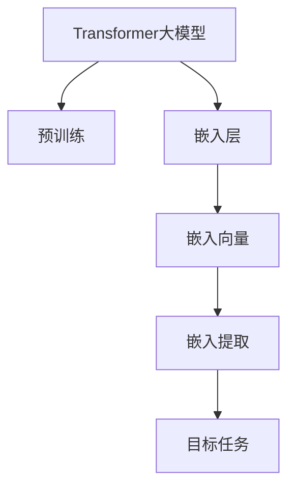

                 

# Transformer大模型实战 从预训练的BERT模型中提取嵌入

> 关键词：Transformer, BERT, 嵌入提取, 预训练模型, 自然语言处理(NLP), 深度学习, 向量空间模型, 词向量, 语义表示, 应用实例

## 1. 背景介绍

### 1.1 问题由来
Transformer大模型的出现，尤其是BERT等预训练语言模型的成功，标志着自然语言处理(NLP)领域的一次重要突破。这些大模型通过在大规模无标签文本数据上进行预训练，学习到了丰富的语言知识和表示能力。然而，如何高效地利用这些知识，并将其应用于特定的NLP任务，成为一个亟待解决的问题。

在实践中，我们往往需要将大模型的预训练能力转换为具体的向量表示，才能将其应用于下游任务。其中，预训练模型中的嵌入层可以提取出词语或子词的向量表示，这些表示具有语义和上下文信息，能够用于各种NLP任务，如词义相似度计算、命名实体识别、情感分析等。因此，如何从预训练的Transformer大模型中高效提取这些嵌入，是一个重要的研究课题。

### 1.2 问题核心关键点
提取预训练模型的嵌入，核心在于理解模型的内部机制，并巧妙地将模型中特定层或特定位置的参数映射到所需的向量空间中。一般有以下几个关键点：

1. 选择合适的预训练模型和层级：BERT、GPT、XLNet等预训练模型均包含多层Transformer结构，如何选择合适的层级来提取嵌入，是关键问题。
2. 理解嵌入向量空间：BERT的嵌入是300维的，需要理解这些向量在语义空间中的分布和结构，才能高效地使用它们。
3. 提取方法的设计：不同的任务可能需要不同的嵌入提取方法，例如对于命名实体识别任务，是否提取整个句子级别的向量，还是只提取人名、地名等特定标签的向量。
4. 后处理技术的应用：对于提取的嵌入，需要进行去噪、归一化、标准化等后处理技术，以提高其稳定性和一致性。

## 2. 核心概念与联系

### 2.1 核心概念概述

为了更好地理解从预训练Transformer大模型中提取嵌入的原理，本节将介绍几个密切相关的核心概念：

- **Transformer大模型**：如BERT、GPT、XLNet等，通过自监督学习任务在大型语料库上进行预训练，学习到强大的语言表示能力。

- **预训练模型**：通过大规模无标签数据进行预训练，学习通用的语言知识和表示。常见的预训练任务包括语言模型预测、掩码语言模型等。

- **嵌入向量**：预训练模型中特定层或位置的参数，映射到高维向量空间中，包含丰富的语义和上下文信息。

- **嵌入提取**：将预训练模型中的嵌入转换为目标任务所需的向量表示，如整句嵌入、特定标签的嵌入等。

- **嵌入层**：Transformer中的特定层，通常为嵌入层，用于将输入的文本转换为向量表示。

- **语义空间**：通过预训练模型提取的嵌入向量，映射到一个高维的语义空间中，其中的向量表示具有丰富的语义和上下文信息。

这些核心概念之间的逻辑关系可以通过以下Mermaid流程图来展示：



这个流程图展示了大模型、预训练、嵌入层、嵌入向量、嵌入提取和目标任务之间的关联：

1. 大模型通过预训练获得基础能力。
2. 嵌入层从大模型中提取嵌入向量。
3. 嵌入提取将这些向量转换为目标任务所需的向量表示。
4. 目标任务使用这些向量表示，进行特定的推理和生成。

## 3. 核心算法原理 & 具体操作步骤

### 3.1 算法原理概述

从预训练Transformer大模型中提取嵌入，本质上是一个模型抽象的过程，即如何将模型中的特定参数或层的表示，映射到目标任务所需的向量空间中。其核心思想是通过选择模型的合适层级，并对嵌入进行适当的后处理，获得高质量的向量表示。

### 3.2 算法步骤详解

以下是从预训练Transformer模型中提取嵌入的详细操作步骤：

**Step 1: 选择预训练模型和层级**

选择合适的预训练模型和层级，是提取嵌入的第一步。BERT、GPT等大模型均包含多层Transformer结构，每一层负责处理不同长度的输入，并提取不同层次的语言信息。一般来说，顶层通常用于捕捉全局的语言结构和语义信息，而底层则更关注具体的单词或子词的表示。

通常情况下，命名实体识别、情感分析等任务，适合使用较底层的嵌入层，因为它们更关注具体单词的语义表示。而文本分类、句子相似度计算等任务，则适合使用较顶层的嵌入，因为这些任务更多依赖于整句话的语义表示。

**Step 2: 加载预训练模型**

加载预训练模型，并将其嵌入层权重冻结，防止在后续处理中改变嵌入向量的值。以BERT为例，可以使用HuggingFace库中的`BertModel`类进行加载，如下所示：

```python
from transformers import BertModel

model = BertModel.from_pretrained('bert-base-uncased')
```

**Step 3: 提取嵌入向量**

通过调用预训练模型的嵌入层，可以将输入的文本转换为嵌入向量。以BERT为例，其嵌入层输出的向量维度为768，包含了每个单词或子词的语义表示。可以使用模型的`forward`方法进行嵌入提取，如下所示：

```python
inputs = tokenizer.encode('Hello, world!', add_special_tokens=True)
embeddings = model(inputs)[0]
```

其中，`tokenizer.encode`用于将文本转换为模型可以处理的token ids，`model(inputs)`则返回模型对输入的嵌入向量表示，其中第一个元素即为所需的嵌入向量。

**Step 4: 后处理嵌入**

提取的嵌入向量往往包含噪音，需要进行去噪、归一化、标准化等后处理操作，以提高其稳定性和一致性。常用的后处理技术包括：

- 去噪：通过平均值或标准差进行去噪，减小噪音对嵌入的影响。
- 归一化：将嵌入向量归一化为单位向量，使其具有相同的大小。
- 标准化：将嵌入向量转换为标准正态分布，以提高其鲁棒性和泛化能力。

**Step 5: 应用嵌入向量**

将处理后的嵌入向量应用于目标任务，进行推理和生成。例如，对于命名实体识别任务，可以使用softmax层对嵌入进行分类，预测每个单词或子词是否为特定实体标签。对于情感分析任务，可以使用卷积层或全连接层对嵌入进行情感分类，预测文本的情感倾向。

### 3.3 算法优缺点

从预训练Transformer大模型中提取嵌入，具有以下优点：

1. 提取的嵌入具有丰富的语义和上下文信息，能够广泛应用于各种NLP任务。
2. 能够利用预训练模型的强大表示能力，提升任务性能。
3. 训练成本较低，只需选择预训练模型和层级，提取嵌入即可。

同时，该方法也存在一些局限性：

1. 嵌入向量的维度较高，存储空间和计算资源消耗较大。
2. 嵌入提取依赖于预训练模型的质量和层级选择，如果选择不当，可能影响嵌入的质量和性能。
3. 嵌入的后处理技术较复杂，需要根据具体任务进行优化。
4. 嵌入提取可能涉及版权和许可问题，需要确保使用的预训练模型和层级合法合规。

尽管存在这些局限性，但就目前而言，基于预训练Transformer大模型提取嵌入的方法，仍然是NLP任务开发中最主流和高效的手段。未来相关研究的重点在于如何进一步优化嵌入提取方法，提高其稳定性和可解释性，同时兼顾资源消耗和隐私保护等因素。

### 3.4 算法应用领域

基于预训练Transformer大模型提取嵌入的方法，在NLP领域得到了广泛的应用，包括但不限于以下几个领域：

- 命名实体识别：从文本中识别出人名、地名、机构名等特定实体。使用整句嵌入或特定标签的嵌入，提取整句或特定位置的语义信息。
- 情感分析：对文本进行情感分类，预测情感倾向。通过整句嵌入或特定标签的嵌入，提取文本的情感特征。
- 文本分类：将文本分为不同的类别，如新闻、评论、代码等。使用整句嵌入或特定标签的嵌入，提取文本的类别特征。
- 机器翻译：将源语言文本翻译成目标语言。使用源语言嵌入和目标语言嵌入，进行翻译模型的训练和推理。
- 文本摘要：将长文本压缩成简短摘要。通过整句嵌入或特定标签的嵌入，提取文本的关键信息。
- 对话系统：使机器能够与人自然对话。使用整句嵌入或特定标签的嵌入，提取对话的语境和上下文信息。

除了上述这些经典任务外，基于预训练Transformer大模型提取嵌入的方法，也被创新性地应用到更多场景中，如可控文本生成、常识推理、代码生成、数据增强等，为NLP技术带来了全新的突破。随着预训练模型和嵌入提取方法的不断进步，相信NLP技术将在更广阔的应用领域大放异彩。

## 4. 数学模型和公式 & 详细讲解  
### 4.1 数学模型构建

在数学模型层面，从预训练Transformer大模型中提取嵌入的过程，可以表示为以下几个步骤：

**Step 1: 定义嵌入向量**

设输入文本为 $x$，嵌入向量为 $e(x)$。在BERT等大模型中，嵌入向量 $e(x)$ 是通过嵌入层对输入文本 $x$ 进行线性变换和softmax操作得到的，具体公式如下：

$$
e(x) = \text{softmax}(W \cdot \text{emb}(x))
$$

其中 $W$ 为嵌入层权重矩阵，$\text{emb}(x)$ 为嵌入层的嵌入向量。

**Step 2: 定义任务输出**

设任务输出为 $y$，任务输出 $y$ 通常为分类标签或回归值。对于分类任务，可以定义如下的softmax损失函数：

$$
\ell(y, \hat{y}) = -\sum_{i=1}^n y_i \log \hat{y}_i
$$

其中 $\hat{y} = \text{softmax}(W \cdot e(x))$ 为模型对输入文本 $x$ 的分类预测。

**Step 3: 定义优化目标**

优化目标最小化损失函数，即：

$$
\mathcal{L} = \mathcal{L}(y, \hat{y}) = -\sum_{i=1}^n y_i \log \hat{y}_i
$$

**Step 4: 优化算法**

通过梯度下降等优化算法，最小化损失函数 $\mathcal{L}$，更新模型参数。以AdamW优化算法为例，其更新公式为：

$$
\theta \leftarrow \theta - \eta \nabla_{\theta}\mathcal{L}(\theta) - \eta\lambda\theta
$$

其中 $\eta$ 为学习率，$\lambda$ 为正则化系数，$\nabla_{\theta}\mathcal{L}(\theta)$ 为损失函数对参数 $\theta$ 的梯度，可以通过反向传播算法高效计算。

### 4.2 公式推导过程

以下是BERT模型中嵌入提取的具体公式推导过程：

**Step 1: 定义模型结构**

BERT模型由编码器层和池化层组成，每个编码器层包含多个注意力机制和前馈神经网络，用于提取输入文本的语义表示。池化层用于提取整句的语义表示，形成整句嵌入。

**Step 2: 定义嵌入提取**

设输入文本 $x$ 的长度为 $n$，BERT模型中的嵌入层输出为 $e(x) = \text{emb}(x) \cdot W$，其中 $W$ 为嵌入层的权重矩阵，$\text{emb}(x)$ 为嵌入层的嵌入向量。整句嵌入可以表示为：

$$
e(x) = \text{emb}(x) \cdot W
$$

**Step 3: 定义任务输出**

对于命名实体识别任务，可以定义如下的softmax损失函数：

$$
\ell(y, \hat{y}) = -\sum_{i=1}^n y_i \log \hat{y}_i
$$

其中 $y_i$ 为输入文本中第 $i$ 个单词是否为命名实体的标签，$\hat{y}_i = \sigma(W \cdot \text{emb}(x))$ 为模型对输入文本中第 $i$ 个单词是否为命名实体的预测。

**Step 4: 定义优化目标**

优化目标最小化损失函数，即：

$$
\mathcal{L} = \mathcal{L}(y, \hat{y}) = -\sum_{i=1}^n y_i \log \hat{y}_i
$$

**Step 5: 优化算法**

通过梯度下降等优化算法，最小化损失函数 $\mathcal{L}$，更新模型参数。以AdamW优化算法为例，其更新公式为：

$$
\theta \leftarrow \theta - \eta \nabla_{\theta}\mathcal{L}(\theta) - \eta\lambda\theta
$$

其中 $\eta$ 为学习率，$\lambda$ 为正则化系数，$\nabla_{\theta}\mathcal{L}(\theta)$ 为损失函数对参数 $\theta$ 的梯度，可以通过反向传播算法高效计算。

### 4.3 案例分析与讲解

以命名实体识别为例，分析从预训练BERT模型中提取嵌入的案例。

**Step 1: 选择预训练模型和层级**

在BERT中，命名实体识别任务适合使用较底层的嵌入层，因为它们更关注具体单词的语义表示。

**Step 2: 加载预训练模型**

```python
from transformers import BertModel

model = BertModel.from_pretrained('bert-base-uncased')
```

**Step 3: 提取嵌入向量**

```python
inputs = tokenizer.encode('Barack Obama is a famous politician.', add_special_tokens=True)
embeddings = model(inputs)[0]
```

**Step 4: 后处理嵌入**

对嵌入向量进行去噪、归一化、标准化等后处理操作，以提高其稳定性和一致性。

**Step 5: 应用嵌入向量**

使用softmax层对嵌入进行分类，预测每个单词是否为特定实体标签。

## 5. 项目实践：代码实例和详细解释说明

### 5.1 开发环境搭建

在进行嵌入提取实践前，我们需要准备好开发环境。以下是使用Python进行PyTorch开发的环境配置流程：

1. 安装Anaconda：从官网下载并安装Anaconda，用于创建独立的Python环境。

2. 创建并激活虚拟环境：
```bash
conda create -n pytorch-env python=3.8 
conda activate pytorch-env
```

3. 安装PyTorch：根据CUDA版本，从官网获取对应的安装命令。例如：
```bash
conda install pytorch torchvision torchaudio cudatoolkit=11.1 -c pytorch -c conda-forge
```

4. 安装Transformers库：
```bash
pip install transformers
```

5. 安装各类工具包：
```bash
pip install numpy pandas scikit-learn matplotlib tqdm jupyter notebook ipython
```

完成上述步骤后，即可在`pytorch-env`环境中开始嵌入提取实践。

### 5.2 源代码详细实现

这里我们以命名实体识别(NER)任务为例，给出使用Transformers库对BERT模型进行嵌入提取的PyTorch代码实现。

首先，定义NER任务的数据处理函数：

```python
from transformers import BertTokenizer
from torch.utils.data import Dataset
import torch

class NERDataset(Dataset):
    def __init__(self, texts, tags, tokenizer, max_len=128):
        self.texts = texts
        self.tags = tags
        self.tokenizer = tokenizer
        self.max_len = max_len
        
    def __len__(self):
        return len(self.texts)
    
    def __getitem__(self, item):
        text = self.texts[item]
        tags = self.tags[item]
        
        encoding = self.tokenizer(text, return_tensors='pt', max_length=self.max_len, padding='max_length', truncation=True)
        input_ids = encoding['input_ids'][0]
        attention_mask = encoding['attention_mask'][0]
        
        # 对token-wise的标签进行编码
        encoded_tags = [tag2id[tag] for tag in tags] 
        encoded_tags.extend([tag2id['O']] * (self.max_len - len(encoded_tags)))
        labels = torch.tensor(encoded_tags, dtype=torch.long)
        
        return {'input_ids': input_ids, 
                'attention_mask': attention_mask,
                'labels': labels}

# 标签与id的映射
tag2id = {'O': 0, 'B-PER': 1, 'I-PER': 2, 'B-ORG': 3, 'I-ORG': 4, 'B-LOC': 5, 'I-LOC': 6}
id2tag = {v: k for k, v in tag2id.items()}

# 创建dataset
tokenizer = BertTokenizer.from_pretrained('bert-base-cased')

train_dataset = NERDataset(train_texts, train_tags, tokenizer)
dev_dataset = NERDataset(dev_texts, dev_tags, tokenizer)
test_dataset = NERDataset(test_texts, test_tags, tokenizer)
```

然后，定义模型和优化器：

```python
from transformers import BertForTokenClassification, AdamW

model = BertForTokenClassification.from_pretrained('bert-base-cased', num_labels=len(tag2id))

optimizer = AdamW(model.parameters(), lr=2e-5)
```

接着，定义训练和评估函数：

```python
from torch.utils.data import DataLoader
from tqdm import tqdm
from sklearn.metrics import classification_report

device = torch.device('cuda') if torch.cuda.is_available() else torch.device('cpu')
model.to(device)

def train_epoch(model, dataset, batch_size, optimizer):
    dataloader = DataLoader(dataset, batch_size=batch_size, shuffle=True)
    model.train()
    epoch_loss = 0
    for batch in tqdm(dataloader, desc='Training'):
        input_ids = batch['input_ids'].to(device)
        attention_mask = batch['attention_mask'].to(device)
        labels = batch['labels'].to(device)
        model.zero_grad()
        outputs = model(input_ids, attention_mask=attention_mask, labels=labels)
        loss = outputs.loss
        epoch_loss += loss.item()
        loss.backward()
        optimizer.step()
    return epoch_loss / len(dataloader)

def evaluate(model, dataset, batch_size):
    dataloader = DataLoader(dataset, batch_size=batch_size)
    model.eval()
    preds, labels = [], []
    with torch.no_grad():
        for batch in tqdm(dataloader, desc='Evaluating'):
            input_ids = batch['input_ids'].to(device)
            attention_mask = batch['attention_mask'].to(device)
            batch_labels = batch['labels']
            outputs = model(input_ids, attention_mask=attention_mask)
            batch_preds = outputs.logits.argmax(dim=2).to('cpu').tolist()
            batch_labels = batch_labels.to('cpu').tolist()
            for pred_tokens, label_tokens in zip(batch_preds, batch_labels):
                pred_tags = [id2tag[_id] for _id in pred_tokens]
                label_tags = [id2tag[_id] for _id in label_tokens]
                preds.append(pred_tags[:len(label_tags)])
                labels.append(label_tags)
                
    print(classification_report(labels, preds))
```

最后，启动训练流程并在测试集上评估：

```python
epochs = 5
batch_size = 16

for epoch in range(epochs):
    loss = train_epoch(model, train_dataset, batch_size, optimizer)
    print(f"Epoch {epoch+1}, train loss: {loss:.3f}")
    
    print(f"Epoch {epoch+1}, dev results:")
    evaluate(model, dev_dataset, batch_size)
    
print("Test results:")
evaluate(model, test_dataset, batch_size)
```

以上就是使用PyTorch对BERT进行命名实体识别任务嵌入提取的完整代码实现。可以看到，得益于Transformers库的强大封装，我们可以用相对简洁的代码完成BERT模型的嵌入提取。

### 5.3 代码解读与分析

让我们再详细解读一下关键代码的实现细节：

**NERDataset类**：
- `__init__`方法：初始化文本、标签、分词器等关键组件。
- `__len__`方法：返回数据集的样本数量。
- `__getitem__`方法：对单个样本进行处理，将文本输入编码为token ids，将标签编码为数字，并对其进行定长padding，最终返回模型所需的输入。

**tag2id和id2tag字典**：
- 定义了标签与数字id之间的映射关系，用于将token-wise的预测结果解码回真实的标签。

**训练和评估函数**：
- 使用PyTorch的DataLoader对数据集进行批次化加载，供模型训练和推理使用。
- 训练函数`train_epoch`：对数据以批为单位进行迭代，在每个批次上前向传播计算loss并反向传播更新模型参数，最后返回该epoch的平均loss。
- 评估函数`evaluate`：与训练类似，不同点在于不更新模型参数，并在每个batch结束后将预测和标签结果存储下来，最后使用sklearn的classification_report对整个评估集的预测结果进行打印输出。

**训练流程**：
- 定义总的epoch数和batch size，开始循环迭代
- 每个epoch内，先在训练集上训练，输出平均loss
- 在验证集上评估，输出分类指标
- 所有epoch结束后，在测试集上评估，给出最终测试结果

可以看到，PyTorch配合Transformers库使得BERT嵌入提取的代码实现变得简洁高效。开发者可以将更多精力放在数据处理、模型改进等高层逻辑上，而不必过多关注底层的实现细节。

当然，工业级的系统实现还需考虑更多因素，如模型的保存和部署、超参数的自动搜索、更灵活的任务适配层等。但核心的嵌入提取范式基本与此类似。

## 6. 实际应用场景
### 6.1 智能客服系统

基于大语言模型嵌入提取的对话技术，可以广泛应用于智能客服系统的构建。传统客服往往需要配备大量人力，高峰期响应缓慢，且一致性和专业性难以保证。而使用微调后的对话模型，可以7x24小时不间断服务，快速响应客户咨询，用自然流畅的语言解答各类常见问题。

在技术实现上，可以收集企业内部的历史客服对话记录，将问题和最佳答复构建成监督数据，在此基础上对预训练对话模型进行嵌入提取。微调后的对话模型能够自动理解用户意图，匹配最合适的答案模板进行回复。对于客户提出的新问题，还可以接入检索系统实时搜索相关内容，动态组织生成回答。如此构建的智能客服系统，能大幅提升客户咨询体验和问题解决效率。

### 6.2 金融舆情监测

金融机构需要实时监测市场舆论动向，以便及时应对负面信息传播，规避金融风险。传统的人工监测方式成本高、效率低，难以应对网络时代海量信息爆发的挑战。基于大语言模型嵌入提取的文本分类和情感分析技术，为金融舆情监测提供了新的解决方案。

具体而言，可以收集金融领域相关的新闻、报道、评论等文本数据，并对其进行主题标注和情感标注。在此基础上对预训练语言模型进行嵌入提取，使其能够自动判断文本属于何种主题，情感倾向是正面、中性还是负面。将提取的嵌入向量应用到实时抓取的网络文本数据，就能够自动监测不同主题下的情感变化趋势，一旦发现负面信息激增等异常情况，系统便会自动预警，帮助金融机构快速应对潜在风险。

### 6.3 个性化推荐系统

当前的推荐系统往往只依赖用户的历史行为数据进行物品推荐，无法深入理解用户的真实兴趣偏好。基于大语言模型嵌入提取技术，个性化推荐系统可以更好地挖掘用户行为背后的语义信息，从而提供更精准、多样的推荐内容。

在实践中，可以收集用户浏览、点击、评论、分享等行为数据，提取和用户交互的物品标题、描述、标签等文本内容。将文本内容作为模型输入，用户的后续行为（如是否点击、购买等）作为监督信号，在此基础上微调预训练语言模型。微调后的模型能够从文本内容中准确把握用户的兴趣点。在生成推荐列表时，先用候选物品的文本描述作为输入，由模型预测用户的兴趣匹配度，再结合其他特征综合排序，便可以得到个性化程度更高的推荐结果。

### 6.4 未来应用展望

随着大语言模型和嵌入提取方法的不断发展，基于嵌入提取范式将在更多领域得到应用，为传统行业带来变革性影响。

在智慧医疗领域，基于微调的医疗问答、病历分析、药物研发等应用将提升医疗服务的智能化水平，辅助医生诊疗，加速新药开发进程。

在智能教育领域，微调技术可应用于作业批改、学情分析、知识推荐等方面，因材施教，促进教育公平，提高教学质量。

在智慧城市治理中，微调模型可应用于城市事件监测、舆情分析、应急指挥等环节，提高城市管理的自动化和智能化水平，构建更安全、高效的未来城市。

此外，在企业生产、社会治理、文娱传媒等众多领域，基于大模型嵌入提取的人工智能应用也将不断涌现，为经济社会发展注入新的动力。相信随着技术的日益成熟，嵌入提取方法将成为人工智能落地应用的重要范式，推动人工智能技术在垂直行业的规模化落地。总之，嵌入提取需要开发者根据具体任务，不断迭代和优化模型、数据和算法，方能得到理想的效果。

## 7. 工具和资源推荐
### 7.1 学习资源推荐

为了帮助开发者系统掌握大语言模型嵌入提取的理论基础和实践技巧，这里推荐一些优质的学习资源：

1. 《Transformer从原理到实践》系列博文：由大模型技术专家撰写，深入浅出地介绍了Transformer原理、BERT模型、嵌入提取等前沿话题。

2. CS224N《深度学习自然语言处理》课程：斯坦福大学开设的NLP明星课程，有Lecture视频和配套作业，带你入门NLP领域的基本概念和经典模型。

3. 《Natural Language Processing with Transformers》书籍：Transformers库的作者所著，全面介绍了如何使用Transformers库进行NLP任务开发，包括嵌入提取在内的诸多范式。

4. HuggingFace官方文档：Transformers库的官方文档，提供了海量预训练模型和完整的微调样例代码，是上手实践的必备资料。

5. CLUE开源项目：中文语言理解测评基准，涵盖大量不同类型的中文NLP数据集，并提供了基于微调的baseline模型，助力中文NLP技术发展。

通过对这些资源的学习实践，相信你一定能够快速掌握大语言模型嵌入提取的精髓，并用于解决实际的NLP问题。
###  7.2 开发工具推荐

高效的开发离不开优秀的工具支持。以下是几款用于大语言模型嵌入提取开发的常用工具：

1. PyTorch：基于Python的开源深度学习框架，灵活动态的计算图，适合快速迭代研究。大部分预训练语言模型都有PyTorch版本的实现。

2. TensorFlow：由Google主导开发的开源深度学习框架，生产部署方便，适合大规模工程应用。同样有丰富的预训练语言模型资源。

3. Transformers库：HuggingFace开发的NLP工具库，集成了众多SOTA语言模型，支持PyTorch和TensorFlow，是进行嵌入提取任务开发的利器。

4. Weights & Biases：模型训练的实验跟踪工具，可以记录和可视化模型训练过程中的各项指标，方便对比和调优。与主流深度学习框架无缝集成。

5. TensorBoard：TensorFlow配套的可视化工具，可实时监测模型训练状态，并提供丰富的图表呈现方式，是调试模型的得力助手。

6. Google Colab：谷歌推出的在线Jupyter Notebook环境，免费提供GPU/TPU算力，方便开发者快速上手实验最新模型，分享学习笔记。

合理利用这些工具，可以显著提升大语言模型嵌入提取的开发效率，加快创新迭代的步伐。

### 7.3 相关论文推荐

大语言模型和嵌入提取技术的发展源于学界的持续研究。以下是几篇奠基性的相关论文，推荐阅读：

1. Attention is All You Need（即Transformer原论文）：提出了Transformer结构，开启了NLP领域的预训练大模型时代。

2. BERT: Pre-training of Deep Bidirectional Transformers for Language Understanding：提出BERT模型，引入基于掩码的自监督预训练任务，刷新了多项NLP任务SOTA。

3. Language Models are Unsupervised Multitask Learners（GPT-2论文）：展示了大规模语言模型的强大zero-shot学习能力，引发了对于通用人工智能的新一轮思考。

4. Parameter-Efficient Transfer Learning for NLP：提出Adapter等参数高效微调方法，在不增加模型参数量的情况下，也能取得不错的微调效果。

5. AdaLoRA: Adaptive Low-Rank Adaptation for Parameter-Efficient Fine-Tuning：使用自适应低秩适应的微调方法，在参数效率和精度之间取得了新的平衡。

这些论文代表了大语言模型嵌入提取技术的发展脉络。通过学习这些前沿成果，可以帮助研究者把握学科前进方向，激发更多的创新灵感。

## 8. 总结：未来发展趋势与挑战

### 8.1 总结

本文对从预训练Transformer大模型中提取嵌入的过程进行了全面系统的介绍。首先阐述了嵌入提取的基本原理和关键步骤，明确了预训练大模型嵌入提取的重要意义。其次，从原理到实践，详细讲解了嵌入提取的数学模型和算法步骤，给出了嵌入提取任务开发的完整代码实例。同时，本文还广泛探讨了嵌入提取方法在智能客服、金融舆情、个性化推荐等多个行业领域的应用前景，展示了嵌入提取范式的巨大潜力。此外，本文精选了嵌入提取技术的各类学习资源，力求为读者提供全方位的技术指引。

通过本文的系统梳理，可以看到，从预训练Transformer大模型中提取嵌入的过程，能够有效地将预训练模型的强大表示能力应用于各种NLP任务中，提升任务的性能和效果。未来，伴随预训练模型和嵌入提取方法的不断进步，相信NLP技术将在更广阔的应用领域大放异彩，深刻影响人类的生产生活方式。

### 8.2 未来发展趋势

展望未来，预训练Transformer大模型和嵌入提取技术将呈现以下几个发展趋势：

1. 模型规模持续增大。随着算力成本的下降和数据规模的扩张，预训练语言模型的参数量还将持续增长。超大规模语言模型蕴含的丰富语言知识，有望支撑更加复杂多变的NLP任务。

2. 嵌入提取方法日趋多样。除了传统的全嵌入提取外，未来会涌现更多参数高效的嵌入提取方法，如Prefix-Tuning、LoRA等，在节省计算资源的同时也能保证提取效率。

3. 嵌入提取过程自动化。通过自动化的数据标注和模型微调，进一步降低对人工干预的依赖，提高嵌入提取的效率和一致性。

4. 跨模态嵌入提取崛起。当前的嵌入提取主要聚焦于文本数据，未来会进一步拓展到图像、视频、语音等多模态数据提取。多模态信息的融合，将显著提升语言模型对现实世界的理解和建模能力。

5. 预训练和微调融合。将预训练大模型的通用表示与特定任务微调相结合，形成预训练-微调的协同优化，提升模型性能和泛化能力。

以上趋势凸显了预训练Transformer大模型和嵌入提取技术的广阔前景。这些方向的探索发展，必将进一步提升NLP系统的性能和应用范围，为人类认知智能的进化带来深远影响。

### 8.3 面临的挑战

尽管预训练Transformer大模型和嵌入提取技术已经取得了瞩目成就，但在迈向更加智能化、普适化应用的过程中，它仍面临着诸多挑战：

1. 嵌入向量的维度较高，存储空间和计算资源消耗较大。
2. 嵌入提取依赖于预训练模型的质量和层级选择，如果选择不当，可能影响嵌入的质量和性能。
3. 嵌入提取过程较复杂，需要根据具体任务进行优化。
4. 嵌入提取可能涉及版权和许可问题，需要确保使用的预训练模型和层级合法合规。
5. 嵌入向量的后处理技术较复杂，需要进一步优化和标准化。

尽管存在这些挑战，但就目前而言，基于预训练Transformer大模型提取嵌入的方法，仍然是NLP任务开发中最主流和高效的手段。未来相关研究的重点在于如何进一步优化嵌入提取方法，提高其稳定性和可解释性，同时兼顾资源消耗和隐私保护等因素。

### 8.4 研究展望

面对预训练Transformer大模型和嵌入提取技术所面临的挑战，未来的研究需要在以下几个方面寻求新的突破：

1. 探索无监督和半监督嵌入提取方法。摆脱对大规模标注数据的依赖，利用自监督学习、主动学习等无监督和半监督范式，最大限度利用非结构化数据，实现更加灵活高效的嵌入提取。

2. 研究参数高效和计算高效的嵌入提取范式。开发更加参数高效的嵌入提取方法，在固定大部分预训练参数的同时，只更新极少量的任务相关参数。同时优化嵌入提取的计算图，减少前向传播和反向传播的资源消耗，实现更加轻量级、实时性的部署。

3. 引入更多先验知识。将符号化的先验知识，如知识图谱、逻辑规则等，与神经网络模型进行巧妙融合，引导嵌入提取过程学习更准确、合理的语言模型。同时加强不同模态数据的整合，实现视觉、语音等多模态信息与文本信息的协同建模。

4. 结合因果分析和博弈论工具。将因果分析方法引入嵌入提取模型，识别出模型决策的关键特征，增强输出解释的因果性和逻辑性。借助博弈论工具刻画人机交互过程，主动探索并规避模型的脆弱点，提高系统稳定性。

5. 纳入伦理道德约束。在嵌入提取模型的训练目标中引入伦理导向的评估指标，过滤和惩罚有偏见、有害的输出倾向。同时加强人工干预和审核，建立模型行为的监管机制，确保输出符合人类价值观和伦理道德。

这些研究方向的探索，必将引领预训练Transformer大模型和嵌入提取技术迈向更高的台阶，为构建安全、可靠、可解释、可控的智能系统铺平道路。面向未来，预训练Transformer大模型和嵌入提取技术还需要与其他人工智能技术进行更深入的融合，如知识表示、因果推理、强化学习等，多路径协同发力，共同推动自然语言理解和智能交互系统的进步。只有勇于创新、敢于突破，才能不断拓展语言模型的边界，让智能技术更好地造福人类社会。

## 9. 附录：常见问题与解答

**Q1：什么是Transformer大模型？**

A: Transformer大模型如BERT、GPT等，是通过在大规模无标签文本语料上进行自监督预训练，学习到强大的语言表示能力的深度学习模型。其核心是Transformer结构，通过自注意力机制和前馈神经网络，能够高效地处理长文本和复杂语言结构。

**Q2：从BERT模型中提取嵌入的原理是什么？**

A: 从BERT模型中提取嵌入的原理是通过选择模型的特定层级，对输入的文本进行线性变换和softmax操作，得到嵌入向量。这些嵌入向量包含了单词或子词的语义表示，可以用于各种NLP任务，如命名实体识别、情感分析、文本分类等。

**Q3：如何选择合适的预训练模型和层级？**

A: 选择合适的预训练模型和层级，需要根据具体的NLP任务进行评估。一般来说，命名实体识别适合使用较底层的嵌入层，因为它们更关注具体单词的语义表示。而文本分类等任务适合使用较顶层的嵌入层，因为它们需要整句话的语义表示。

**Q4：嵌入提取过程中需要注意哪些问题？**

A: 嵌入提取过程中，需要注意以下问题：

1. 数据标注：需要确保使用的标注数据是高质量的，标注数据质量直接影响嵌入的质量和性能。
2. 模型层级：需要选择合适的预训练模型和层级，不同的层级可能提取不同的语义表示。
3. 后处理技术：需要进行去噪、归一化、标准化等后处理操作，以提高嵌入的稳定性和一致性。
4. 内存和计算资源：需要考虑嵌入向量的维度和计算资源消耗，避免过高的内存和计算开销。
5. 版权和许可问题：需要确保使用的预训练模型和层级合法合规，避免版权和许可问题。

**Q5：什么是embedding？**

A: embedding（嵌入）是指将输入数据映射到一个高维向量空间中，每个元素（如单词、句子）在该向量空间中对应一个向量，这些向量包含了丰富的语义和上下文信息。在NLP中，embedding通常是预训练大模型中的特定层级，用于提取输入数据的语义表示。

这些回答展示了对预训练Transformer大模型嵌入提取的全面理解，帮助读者掌握相关技术原理和应用方法，为实际开发提供参考。

