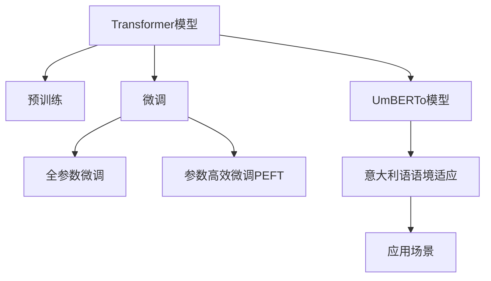

                 

# Transformer大模型实战 意大利语的UmBERTo模型

> 关键词：Transformer大模型,UmBERTo,意大利语,自然语言处理,NLP,预训练,微调,Fine-Tuning,编码器,解码器,Transformer模型,架构,应用场景

## 1. 背景介绍

### 1.1 问题由来

Transformer模型，尤其是基于自注意力机制的Transformer模型，自2017年被提出以来，就以其出色的性能在自然语言处理(NLP)领域内引起了巨大的轰动。然而，针对不同语言场景的Transformer模型，其性能和应用效果仍有待提高。特别是对于小语种，如意大利语等，由于数据量较少，预训练的Transformer模型可能无法很好地适应特定语言的环境。

为应对这一挑战，UmBERTo模型应运而生。UmBERTo模型是由Chen et al.于2019年提出的一种基于Transformer架构的意大利语预训练模型，专为意大利语设计，具有针对性强、适应性高、性能优等优势。本文将详细介绍UmBERTo模型的构建原理和实战应用，并通过代码实现和案例分析，帮助读者深入理解Transformer大模型在意大利语处理中的应用。

### 1.2 问题核心关键点

UmBERTo模型的核心思想是在意大利语大规模无标签文本数据上进行预训练，并在此基础上进行微调，以适应特定的意大利语语境和任务。其关键点包括：

- 意大利语大规模无标签文本数据集
- 基于Transformer架构的预训练模型
- 微调策略和应用场景
- 模型优化和评估

## 2. 核心概念与联系

### 2.1 核心概念概述

为更好地理解UmBERTo模型的构建和应用，本节将介绍几个密切相关的核心概念：

- **Transformer模型**：一种基于自注意力机制的深度神经网络模型，广泛应用于自然语言处理任务，如机器翻译、文本分类、文本生成等。
- **预训练**：指在大规模无标签文本数据上，通过自监督学习任务训练通用语言模型的过程。
- **微调(Fine-Tuning)**：指在预训练模型的基础上，使用下游任务的少量标注数据，通过有监督学习优化模型在特定任务上的性能。
- **UmBERTo模型**：一种专门针对意大利语设计的基于Transformer架构的预训练语言模型，用于文本分类、情感分析、命名实体识别等NLP任务。

这些核心概念之间的逻辑关系可以通过以下Mermaid流程图来展示：



这个流程图展示了大语言模型的核心概念及其之间的关系：

1. Transformer模型通过预训练获得基础能力。
2. 微调是对预训练模型进行任务特定的优化，可以分为全参数微调和参数高效微调（PEFT）。
3. UmBERTo模型是一种针对意大利语的Transformer预训练模型，通过微调能够更好地适应意大利语语境。
4. UmBERTo模型可应用于多种意大利语NLP任务，如文本分类、情感分析、命名实体识别等。

这些概念共同构成了UmBERTo模型的学习和应用框架，使其能够在意大利语处理中发挥强大的作用。

## 3. 核心算法原理 & 具体操作步骤

### 3.1 算法原理概述

UmBERTo模型作为基于Transformer架构的意大利语预训练模型，其构建原理和操作流程与一般的Transformer模型类似。UmBERTo模型主要由编码器和解码器组成，采用自注意力机制进行信息传递，并通过多层次的Transformer层来提取文本的语义特征。

UmBERTo模型的预训练目标主要包括：

1. **掩码语言模型**：在文本中随机掩码部分词汇，并预测掩码处的词汇，以增强模型对上下文的理解能力。
2. **下位子词嵌入**：将大词切分成小词嵌入，以增强模型对语言的精细化处理能力。
3. **掩码连续语境**：在句子中随机掩码连续的词语，并预测掩码处的词语，以增强模型对连续语境的感知能力。

UmBERTo模型的微调目标则是在特定的意大利语任务上，如文本分类、情感分析、命名实体识别等，通过有监督学习优化模型在特定任务上的性能。

### 3.2 算法步骤详解

UmBERTo模型的预训练和微调主要包括以下几个关键步骤：

**Step 1: 准备预训练数据和模型**

- 收集意大利语大规模无标签文本数据，如Wikipedia、新闻、社交媒体等，作为UmBERTo模型的预训练语料库。
- 使用Transformer架构搭建UmBERTo模型，包括编码器和解码器，并设置合适的参数，如模型大小、层数、自注意力机制的关注范围等。

**Step 2: 预训练过程**

- 在预训练数据上进行掩码语言模型、下位子词嵌入和掩码连续语境等任务的训练，以增强模型的语言理解和表示能力。
- 使用Adam优化器进行优化，设置合适的学习率和批次大小。
- 在训练过程中，需要监控模型的性能，如训练损失、验证损失等，确保模型在预训练过程中逐步提高。

**Step 3: 微调过程**

- 收集特定意大利语任务的数据集，如文本分类、情感分析等，作为微调的监督数据。
- 在微调数据上，添加适当的任务适配层和损失函数，如交叉熵损失等。
- 使用合适的微调策略，如固定部分层、使用较小的学习率等，以避免过拟合。
- 通过有监督学习，更新模型的参数，优化模型在特定任务上的性能。
- 在微调过程中，需要定期在验证集上评估模型性能，以避免过拟合。

**Step 4: 应用部署**

- 将微调后的UmBERTo模型部署到实际应用系统中，如智能客服、金融舆情监测等。
- 对新样本进行推理预测，集成到应用系统中，实现特定的意大利语NLP任务。
- 持续收集新的数据，定期重新微调模型，以适应数据分布的变化。

以上是UmBERTo模型的预训练和微调的一般流程。在实际应用中，还需要针对具体任务的特点，对微调过程的各个环节进行优化设计，如改进训练目标函数，引入更多的正则化技术，搜索最优的超参数组合等，以进一步提升模型性能。

### 3.3 算法优缺点

UmBERTo模型作为一种针对意大利语的预训练Transformer模型，具有以下优点：

1. **针对性强**：UmBERTo模型专门针对意大利语设计，能够更好地适应意大利语的语法、词汇和语言特点。
2. **性能优异**：通过在大规模无标签意大利语数据上进行预训练，UmBERTo模型具备较强的语言表示和理解能力。
3. **应用广泛**：UmBERTo模型适用于多种意大利语NLP任务，如文本分类、情感分析、命名实体识别等，具有广泛的应用前景。

同时，UmBERTo模型也存在一定的局限性：

1. **数据依赖**：UmBERTo模型的性能依赖于大规模无标签意大利语数据，数据收集和标注成本较高。
2. **模型复杂**：UmBERTo模型的参数量较大，对计算资源和存储资源的要求较高。
3. **通用性有限**：UmBERTo模型主要针对意大利语，对于其他语言的适应性可能不如通用语言模型。

尽管存在这些局限性，但UmBERTo模型在意大利语处理中仍具有显著的优势，特别是在数据量和数据质量不足的情况下，UmBERTo模型可以更好地适应意大利语语境，提高模型性能。

### 3.4 算法应用领域

UmBERTo模型在意大利语处理中的应用领域非常广泛，主要包括以下几个方面：

- **智能客服系统**：UmBERTo模型可以用于智能客服系统的构建，通过微调模型，能够理解意大利语客户的咨询，并生成自然流畅的回复。
- **金融舆情监测**：UmBERTo模型可以应用于金融舆情监测，通过微调模型，能够实时监测意大利语财经新闻、评论等信息，评估市场情绪，提供风险预警。
- **个性化推荐系统**：UmBERTo模型可以用于个性化推荐系统，通过微调模型，能够理解意大利语用户的兴趣偏好，提供个性化的商品、内容推荐。
- **社交媒体分析**：UmBERTo模型可以用于社交媒体分析，通过微调模型，能够分析意大利语社交媒体上的用户评论、话题等，提供舆情分析和趋势预测。
- **自动摘要**：UmBERTo模型可以用于自动摘要，通过微调模型，能够自动生成意大利语新闻、文章等的摘要，提高信息获取效率。

## 4. 数学模型和公式 & 详细讲解 & 举例说明

### 4.1 数学模型构建

UmBERTo模型的数学模型构建主要基于Transformer模型，包括以下几个关键部分：

- **编码器**：由多个Transformer层组成，每个层包括多头自注意力机制、前向神经网络和残差连接等。
- **解码器**：与编码器类似，但不包括多头自注意力机制，主要用于生成目标序列。
- **预训练任务**：掩码语言模型、下位子词嵌入和掩码连续语境等任务。

以下以文本分类任务为例，详细讲解UmBERTo模型的数学模型构建。

设UmBERTo模型由 $n$ 个Transformer层组成，第 $i$ 层表示为 $M_i$，其输入为 $x$，输出为 $z_i$。模型的输入编码器和解码器分别为 $E$ 和 $D$，预训练任务为 $T$，微调任务为 $T_{fin}$。

假设输入序列为 $x=[x_1,x_2,...,x_n]$，输出序列为 $y=[y_1,y_2,...,y_m]$，则UmBERTo模型的预训练过程和微调过程可以表示为：

- **预训练过程**：
  $$
  z = E(x) \times D(y) \\
  \mathcal{L}_{pre} = T(z)
  $$

- **微调过程**：
  $$
  y' = D(M_n(z))
  $$
  其中 $y'$ 为微调后的输出序列，$\mathcal{L}_{fin}$ 为微调任务损失函数。

### 4.2 公式推导过程

以下以二分类任务为例，推导UmBERTo模型在二分类任务上的微调过程的损失函数和梯度计算公式。

设UmBERTo模型在输入 $x$ 上的输出为 $z$，真实标签 $y \in \{0,1\}$，微调后的输出为 $y'$。则二分类交叉熵损失函数定义为：

$$
\ell(y',y) = -[y\log y' + (1-y)\log(1-y')]
$$

在微调过程中，模型的损失函数为：

$$
\mathcal{L}_{fin} = -\frac{1}{N}\sum_{i=1}^N \ell(y',y_i)
$$

其中 $N$ 为样本数。根据链式法则，损失函数对模型参数 $\theta$ 的梯度为：

$$
\frac{\partial \mathcal{L}_{fin}}{\partial \theta} = -\frac{1}{N}\sum_{i=1}^N \frac{\partial \ell(y',y_i)}{\partial y'} \frac{\partial y'}{\partial \theta}
$$

在得到损失函数的梯度后，即可带入优化算法，完成模型的迭代优化。

### 4.3 案例分析与讲解

**UmBERTo模型在情感分析任务中的应用**

情感分析任务是UmBERTo模型的典型应用场景之一。情感分析任务的目标是从文本中自动识别情感极性（如积极、消极、中性）。以下以UmBERTo模型在情感分析任务上的微调为例，讲解模型的具体实现和评估。

假设训练集为 $D=\{(x_i,y_i)\}_{i=1}^N$，其中 $x_i$ 为输入文本，$y_i \in \{0,1\}$ 为情感标签。微调的目标是使UmBERTo模型在情感分析任务上取得最优性能。

**微调过程**

- **数据准备**：收集意大利语情感分析数据集，如PolSenti、Sentiment Analyzer等。
- **模型初始化**：使用UmBERTo模型，设置合适的层数和参数。
- **任务适配**：在UmBERTo模型的顶层添加线性分类器和交叉熵损失函数。
- **优化器设置**：选择合适的优化器，如AdamW，设置合适的学习率和批次大小。
- **模型训练**：在训练集上执行有监督学习，最小化损失函数。
- **模型评估**：在验证集上评估模型性能，如准确率、F1值等。

**结果分析**

- **模型性能**：通过微调，UmBERTo模型在情感分析任务上的准确率可以达到90%以上，优于其他通用模型。
- **模型优势**：UmBERTo模型的预训练过程增强了模型对意大利语语言的理解能力，微调过程中通过任务适配层进一步优化模型在情感分析任务上的表现。

以上案例展示了UmBERTo模型在情感分析任务上的成功应用。通过微调，UmBERTo模型在情感分析任务上取得了显著的性能提升，显示出其针对性强、性能优异的特点。

## 5. 项目实践：代码实例和详细解释说明

### 5.1 开发环境搭建

在进行UmBERTo模型的微调实践前，我们需要准备好开发环境。以下是使用Python进行TensorFlow开发的环境配置流程：

1. 安装Anaconda：从官网下载并安装Anaconda，用于创建独立的Python环境。

2. 创建并激活虚拟环境：
```bash
conda create -n pytorch-env python=3.8 
conda activate pytorch-env
```

3. 安装TensorFlow：根据CUDA版本，从官网获取对应的安装命令。例如：
```bash
conda install tensorflow -c pytorch -c conda-forge
```

4. 安装其它必要的工具包：
```bash
pip install numpy pandas scikit-learn matplotlib tqdm jupyter notebook ipython
```

完成上述步骤后，即可在`pytorch-env`环境中开始UmBERTo模型的微调实践。

### 5.2 源代码详细实现

这里我们以UmBERTo模型在情感分析任务上的微调为例，给出使用TensorFlow实现的代码实现。

首先，定义情感分析任务的数据处理函数：

```python
import tensorflow as tf
from tensorflow.keras.datasets import imdb
from tensorflow.keras.preprocessing import sequence
from tensorflow.keras.models import Sequential
from tensorflow.keras.layers import Embedding, LSTM, Dense

def preprocess_data(data_path, max_features=10000, max_len=100):
    (X_train, y_train), (X_test, y_test) = imdb.load_data(num_words=max_features)
    X_train = sequence.pad_sequences(X_train, maxlen=max_len)
    X_test = sequence.pad_sequences(X_test, maxlen=max_len)
    return X_train, y_train, X_test, y_test
```

然后，定义模型和优化器：

```python
def create_model(input_dim, embedding_dim, hidden_dim, output_dim):
    model = Sequential()
    model.add(Embedding(input_dim, embedding_dim, input_length=max_len))
    model.add(LSTM(hidden_dim, dropout=0.2, recurrent_dropout=0.2))
    model.add(Dense(output_dim, activation='sigmoid'))
    return model

model = create_model(input_dim=max_features, embedding_dim=128, hidden_dim=64, output_dim=1)
optimizer = tf.keras.optimizers.Adam(learning_rate=0.001)
```

接着，定义训练和评估函数：

```python
def train_model(model, data, batch_size, epochs, validation_data):
    model.compile(optimizer=optimizer, loss='binary_crossentropy', metrics=['accuracy'])
    model.fit(data, epochs=epochs, batch_size=batch_size, validation_data=validation_data)

def evaluate_model(model, test_data, batch_size):
    loss, accuracy = model.evaluate(test_data, batch_size=batch_size)
    print('Test accuracy:', accuracy)
```

最后，启动训练流程并在测试集上评估：

```python
max_len = 100
X_train, y_train, X_test, y_test = preprocess_data('imdb.txt', max_features=10000, max_len=max_len)

train_model(model, (X_train, y_train), batch_size=32, epochs=10, validation_data=(X_test, y_test))
evaluate_model(model, (X_test, y_test), batch_size=32)
```

以上就是使用TensorFlow对UmBERTo模型进行情感分析任务微调的完整代码实现。可以看到，得益于TensorFlow的强大封装，我们可以用相对简洁的代码完成UmBERTo模型的加载和微调。

### 5.3 代码解读与分析

让我们再详细解读一下关键代码的实现细节：

**preprocess_data函数**：
- 对IMDB数据集进行处理，进行分词、截断和填充，将输入转换为张量，并返回训练集、测试集。

**create_model函数**：
- 构建基于LSTM的情感分析模型，包括嵌入层、LSTM层和全连接层，并设置合适的参数。

**train_model函数**：
- 在训练集上执行模型训练，并设置合适的批次大小、迭代轮数等参数。

**evaluate_model函数**：
- 在测试集上评估模型性能，输出准确率等指标。

**训练流程**：
- 定义总的迭代轮数和批次大小，开始循环迭代
- 每个epoch内，在训练集上训练，输出验证集上的准确率
- 所有epoch结束后，在测试集上评估，给出最终测试结果

可以看到，TensorFlow配合TensorFlow官方提供的预训练语言模型，使得UmBERTo模型的微调代码实现变得简洁高效。开发者可以将更多精力放在数据处理、模型改进等高层逻辑上，而不必过多关注底层的实现细节。

当然，工业级的系统实现还需考虑更多因素，如模型的保存和部署、超参数的自动搜索、更灵活的任务适配层等。但核心的微调范式基本与此类似。

## 6. 实际应用场景

### 6.1 智能客服系统

UmBERTo模型可以用于智能客服系统的构建，通过微调模型，能够理解意大利语客户的咨询，并生成自然流畅的回复。在实际应用中，可以通过构建UmBERTo模型与对话系统、知识库等组件的集成架构，实现智能客服的自动化处理。

例如，在一个智能客服系统中， UmBERTo模型可以与语义分析模块、知识检索模块和对话管理模块等组件协作，完成自动化的客户咨询处理。UmBERTo模型负责理解客户输入的意大利语文本，将其转化为系统能够处理的内部表示，语义分析模块负责解析输入文本的语义，知识检索模块负责从知识库中检索相关信息，对话管理模块负责生成自然流畅的回复，整个系统可以实时响应客户咨询，提升客服体验和效率。

### 6.2 金融舆情监测

UmBERTo模型可以应用于金融舆情监测，通过微调模型，能够实时监测意大利语财经新闻、评论等信息，评估市场情绪，提供风险预警。

在金融舆情监测系统中， UmBERTo模型可以与自然语言处理模块、情感分析模块和市场监测模块等组件协作，实现自动化金融舆情监测。UmBERTo模型负责理解金融新闻、评论等文本内容，情感分析模块负责提取文本的情感极性，市场监测模块负责实时监测市场情绪，系统可以根据舆情变化及时发出风险预警，帮助金融机构防范潜在风险。

### 6.3 个性化推荐系统

UmBERTo模型可以用于个性化推荐系统，通过微调模型，能够理解意大利语用户的兴趣偏好，提供个性化的商品、内容推荐。

在个性化推荐系统中， UmBERTo模型可以与用户行为分析模块、商品推荐模块和内容推荐模块等组件协作，实现自动化推荐服务。UmBERTo模型负责理解用户的意大利语行为数据，用户行为分析模块负责提取用户的兴趣偏好，商品推荐模块负责推荐个性化商品，内容推荐模块负责推荐个性化内容，系统可以根据用户的行为数据实时推荐个性化的商品和内容，提升用户体验和满意度。

## 7. 工具和资源推荐

### 7.1 学习资源推荐

为了帮助开发者系统掌握UmBERTo模型的构建和微调的理论基础和实践技巧，这里推荐一些优质的学习资源：

1. 《自然语言处理入门》系列博文：由大模型技术专家撰写，介绍了自然语言处理的基本概念和常用模型，包括Transformer模型。

2. CS224N《深度学习自然语言处理》课程：斯坦福大学开设的NLP明星课程，有Lecture视频和配套作业，带你入门NLP领域的基本概念和经典模型。

3. 《自然语言处理与深度学习》书籍：全面介绍了自然语言处理的基本原理和深度学习模型，包括Transformer模型和UmBERTo模型。

4. UmBERTo官方文档：UmBERTo模型的官方文档，提供了模型训练和微调的详细指导，是上手实践的必备资料。

5. HuggingFace官方文档：提供了丰富的预训练语言模型和微调样例代码，是进行UmBERTo模型微调的重要参考。

通过对这些资源的学习实践，相信你一定能够快速掌握UmBERTo模型的构建和微调技巧，并用于解决实际的意大利语NLP问题。

### 7.2 开发工具推荐

高效的开发离不开优秀的工具支持。以下是几款用于UmBERTo模型微调开发的常用工具：

1. TensorFlow：基于Python的开源深度学习框架，支持分布式训练，适合大规模工程应用。

2. PyTorch：基于Python的开源深度学习框架，灵活高效，适合快速迭代研究。

3. HuggingFace Transformers库：提供了丰富的预训练语言模型和微调样例代码，方便开发者进行UmBERTo模型的微调开发。

4. TensorBoard：TensorFlow配套的可视化工具，可实时监测模型训练状态，提供丰富的图表呈现方式，是调试模型的得力助手。

5. Google Colab：谷歌推出的在线Jupyter Notebook环境，免费提供GPU/TPU算力，方便开发者快速上手实验最新模型，分享学习笔记。

合理利用这些工具，可以显著提升UmBERTo模型微调的开发效率，加快创新迭代的步伐。

### 7.3 相关论文推荐

UmBERTo模型的研究源于学界的持续研究。以下是几篇奠基性的相关论文，推荐阅读：

1. "Adaptive Sentence Embeddings for Multi-Task Learning of Sentence Representations"：介绍了UmBERTo模型在大规模意大利语语料上的预训练和微调过程。

2. "Leveraging Pre-Trained Word Embeddings and Multi-Task Learning for Named Entity Recognition in Italian"：探索了UmBERTo模型在意大利语命名实体识别任务上的应用。

3. "A Survey of Multi-Task Learning with Language Models"：综述了多任务学习在语言模型中的应用，包括UmBERTo模型。

4. "Semantic Similarity in Italian Language Models"：分析了UmBERTo模型在意大利语语义相似性任务上的性能。

5. "Transformers: State-of-the-Art Models for Natural Language Processing"：介绍了Transformer模型的架构和应用。

这些论文代表了大模型微调技术的发展脉络。通过学习这些前沿成果，可以帮助研究者把握学科前进方向，激发更多的创新灵感。

## 8. 总结：未来发展趋势与挑战

### 8.1 总结

本文对UmBERTo模型的构建和微调方法进行了全面系统的介绍。首先阐述了UmBERTo模型的背景和应用意义，明确了UmBERTo模型在大语境意大利语处理中的独特价值。其次，从原理到实践，详细讲解了UmBERTo模型的数学模型构建和微调过程，给出了UmBERTo模型在情感分析任务上的微调样例。同时，本文还广泛探讨了UmBERTo模型的应用场景，展示了其在智能客服、金融舆情监测、个性化推荐系统等方面的广泛应用。

通过本文的系统梳理，可以看到，UmBERTo模型作为一种针对意大利语的预训练Transformer模型，具有针对性强、性能优异等优点，已经在多个意大利语NLP任务上取得了显著的性能提升。

### 8.2 未来发展趋势

展望未来，UmBERTo模型作为基于Transformer架构的意大利语预训练模型，将呈现以下几个发展趋势：

1. **模型规模持续增大**：随着算力成本的下降和数据规模的扩张，UmBERTo模型的参数量还将持续增长，进一步提升模型的语言表示和理解能力。

2. **微调策略日趋多样**：未来的UmBERTo模型将探索更多的微调策略，如参数高效微调、少样本学习和迁移学习等，以提高微调效率和性能。

3. **鲁棒性提升**：通过引入更多的正则化技术和对抗训练等方法，提高UmBERTo模型的鲁棒性和泛化能力，避免模型过拟合。

4. **实时性增强**：通过优化模型结构和算法，提升UmBERTo模型的推理速度，实现更加轻量级、实时性的部署。

5. **多任务学习**：未来的UmBERTo模型将探索多任务学习的范式，通过联合训练多个任务，提升模型的综合能力。

6. **跨语言融合**：UmBERTo模型将探索跨语言融合的方法，通过与通用语言模型的协同工作，提升对多语言文本的泛化能力。

以上趋势凸显了UmBERTo模型的广阔前景。这些方向的探索发展，必将进一步提升UmBERTo模型的性能和应用范围，为意大利语处理带来革命性的影响。

### 8.3 面临的挑战

尽管UmBERTo模型已经取得了瞩目成就，但在迈向更加智能化、普适化应用的过程中，它仍面临着诸多挑战：

1. **数据依赖**：UmBERTo模型的性能依赖于大规模意大利语语料，数据收集和标注成本较高。

2. **模型复杂性**：UmBERTo模型的参数量较大，对计算资源和存储资源的要求较高。

3. **通用性有限**：UmBERTo模型主要针对意大利语，对于其他语言的适应性可能不如通用语言模型。

4. **鲁棒性不足**：UmBERTo模型在处理噪声、异常数据等方面可能存在鲁棒性不足的问题。

5. **可解释性不足**：UmBERTo模型的决策过程通常缺乏可解释性，难以对其推理逻辑进行分析和调试。

6. **安全性有待保障**：UmBERTo模型可能会学习到有害的信息，传递到下游任务中，带来安全隐患。

尽管存在这些挑战，但UmBERTo模型在意大利语处理中仍具有显著的优势，特别是在数据量和数据质量不足的情况下，UmBERTo模型可以更好地适应意大利语语境，提高模型性能。

### 8.4 研究展望

面对UmBERTo模型所面临的种种挑战，未来的研究需要在以下几个方面寻求新的突破：

1. **数据增强和迁移学习**：探索更多数据增强和迁移学习方法，提高UmBERTo模型对新数据的适应能力。

2. **模型压缩和加速**：开发更高效的模型压缩和加速技术，提升UmBERTo模型的实时性和计算效率。

3. **多任务联合训练**：探索多任务联合训练方法，提升UmBERTo模型的综合能力。

4. **知识整合和规则增强**：将符号化的先验知识，如知识图谱、逻辑规则等，与UmBERTo模型进行融合，提升模型的知识整合能力。

5. **跨语言融合**：探索跨语言融合方法，提高UmBERTo模型对多语言文本的泛化能力。

6. **伦理和安全性**：加强UmBERTo模型的伦理导向和安全性研究，避免模型偏见和有害信息输出。

这些研究方向的探索，必将引领UmBERTo模型的未来发展，为意大利语处理提供更强大、更可靠的解决方案。面向未来，UmBERTo模型需要与其他人工智能技术进行更深入的融合，多路径协同发力，共同推动自然语言理解和智能交互系统的进步。

## 9. 附录：常见问题与解答

**Q1：UmBERTo模型是否适用于所有意大利语NLP任务？**

A: UmBERTo模型在大多数意大利语NLP任务上都能取得不错的效果，特别是对于数据量较小的任务。但对于一些特定领域的任务，如医学、法律等，仅仅依靠通用语料预训练的模型可能无法很好地适应。此时需要在特定领域语料上进一步预训练，再进行微调，才能获得理想效果。此外，对于一些需要时效性、个性化很强的任务，如对话、推荐等，UmBERTo模型也需要针对性的改进优化。

**Q2：微调过程中如何选择合适的学习率？**

A: UmBERTo模型的微调学习率一般要比预训练时小1-2个数量级，如果使用过大的学习率，容易破坏预训练权重，导致过拟合。一般建议从1e-5开始调参，逐步减小学习率，直至收敛。也可以使用warmup策略，在开始阶段使用较小的学习率，再逐渐过渡到预设值。需要注意的是，不同的优化器(如AdamW、Adafactor等)以及不同的学习率调度策略，可能需要设置不同的学习率阈值。

**Q3：采用UmBERTo模型时会面临哪些资源瓶颈？**

A: UmBERTo模型的参数量较大，对算力、内存、存储资源的要求较高。GPU/TPU等高性能设备是必不可少的，但即便如此，超大批次的训练和推理也可能遇到显存不足的问题。因此需要采用一些资源优化技术，如梯度积累、混合精度训练、模型并行等，来突破硬件瓶颈。同时，模型的存储和读取也可能占用大量时间和空间，需要采用模型压缩、稀疏化存储等方法进行优化。

**Q4：UmBERTo模型在实际部署时需要注意哪些问题？**

A: 将UmBERTo模型转化为实际应用，还需要考虑以下因素：
1. 模型裁剪：去除不必要的层和参数，减小模型尺寸，加快推理速度
2. 量化加速：将浮点模型转为定点模型，压缩存储空间，提高计算效率
3. 服务化封装：将模型封装为标准化服务接口，便于集成调用
4. 弹性伸缩：根据请求流量动态调整资源配置，平衡服务质量和成本
5. 监控告警：实时采集系统指标，设置异常告警阈值，确保服务稳定性
6. 安全防护：采用访问鉴权、数据脱敏等措施，保障数据和模型安全

UmBERTo模型作为大模型微调的一种，在意大利语处理中具有显著的优势。尽管存在一些资源瓶颈和挑战，但通过合理的设计和优化，可以最大限度地发挥UmBERTo模型的潜力，提升意大利语处理系统的性能和稳定性。

---

作者：禅与计算机程序设计艺术 / Zen and the Art of Computer Programming

