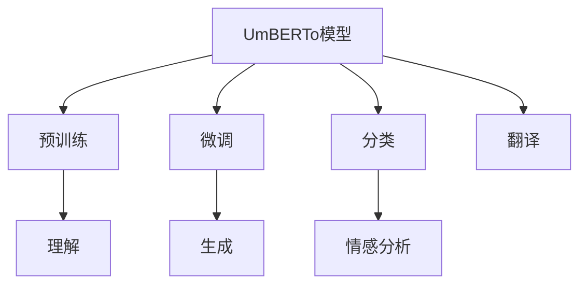

                 

# Transformer大模型实战 意大利语的UmBERTo模型

## 1. 背景介绍

### 1.1 问题由来

Transformer大模型如BERT、GPT等在自然语言处理(NLP)领域取得了巨大成功，但在应用过程中往往需要针对特定领域进行微调，以提高模型在具体任务上的表现。本文将聚焦于意大利语的应用场景，介绍如何使用UmBERTo模型进行语言理解和生成任务，通过实战项目展现UmBERTo模型的强大能力。

### 1.2 问题核心关键点

UmBERTo模型是针对意大利语设计的Transformer模型，通过在意大利语语料上进行预训练，学习到丰富的语言知识，可以用于意大利语的文本分类、情感分析、机器翻译等任务。本文将详细讲解UmBERTo模型的构建、微调过程和实战应用，提供具体代码实现和运行结果展示。

## 2. 核心概念与联系

### 2.1 核心概念概述

Transformer模型是一种基于注意力机制的神经网络架构，通过自注意力层和前馈神经网络层等结构，实现对输入序列的深度理解。UmBERTo模型是针对意大利语设计的Transformer模型，通过在意大利语语料上进行预训练，学习到意大利语的语法、词汇和语义知识。

### 2.2 核心概念原理和架构的 Mermaid 流程图



这个流程图展示了UmBERTo模型的核心概念及其关系：

1. UmBERTo模型通过预训练获得基础能力。
2. 微调使模型适应特定任务，如分类、情感分析、翻译等。
3. 分类任务通过UmBERTo模型理解输入，输出对应的分类结果。
4. 情感分析任务通过UmBERTo模型生成情感表示，进行情感分类。
5. 翻译任务通过UmBERTo模型理解源语言，生成目标语言。

## 3. 核心算法原理 & 具体操作步骤

### 3.1 算法原理概述

UmBERTo模型的核心思想是通过自注意力机制和前馈神经网络对输入序列进行深度理解，进而实现文本分类、情感分析、机器翻译等任务。其具体原理如下：

1. 自注意力机制：通过多头注意力机制，UmBERTo模型能够同时关注输入序列中不同位置的上下文信息，捕捉文本的长期依赖关系。
2. 前馈神经网络：UmBERTo模型包含多个非线性变换层，进一步增强模型的表达能力。
3. 预训练：UmBERTo模型在大量意大利语语料上进行预训练，学习意大利语的语言知识。
4. 微调：通过特定任务的数据集，对UmBERTo模型进行微调，使其适应特定任务的要求。

### 3.2 算法步骤详解

 UmBERTo模型的微调步骤如下：

1. 准备预训练模型：从HuggingFace下载预训练的UmBERTo模型，并进行必要的参数初始化。
2. 添加任务适配层：根据任务类型，在UmBERTo模型顶层设计合适的输出层和损失函数。
3. 设置微调超参数：选择合适的优化算法及其参数，如AdamW、SGD等，设置学习率、批大小、迭代轮数等。
4. 执行梯度训练：将训练集数据分批次输入模型，前向传播计算损失函数。
5. 反向传播计算参数梯度，根据设定的优化算法和学习率更新模型参数。
6. 周期性在验证集上评估模型性能，根据性能指标决定是否触发Early Stopping。
7. 重复上述步骤直到满足预设的迭代轮数或Early Stopping条件。

### 3.3 算法优缺点

UmBERTo模型具有以下优点：
1. 强大的语言理解能力：通过自注意力机制，UmBERTo模型能够深入理解意大利语的语言结构。
2. 良好的泛化能力：UmBERTo模型在意大利语语料上预训练，能够较好地适应意大利语文本的语义和语法特征。
3. 易于微调：UmBERTo模型的参数结构清晰，便于在特定任务上进行微调。
4. 高效训练：UmBERTo模型参数量较大，但在预训练阶段已经获得了良好的初始化，微调时参数更新效率高。

同时，UmBERTo模型也存在以下缺点：
1. 数据需求高：UmBERTo模型在意大利语语料上进行预训练，需要大量高质量的意大利语文本数据。
2. 模型结构复杂：UmBERTo模型包含多个自注意力层和前馈神经网络层，训练和推理过程相对复杂。
3. 资源消耗大：UmBERTo模型参数量大，需要较大的计算资源进行训练和推理。

### 3.4 算法应用领域

UmBERTo模型主要应用于意大利语的语言理解和生成任务，包括但不限于：

1. 文本分类：如意大利语新闻文章的情感分类、主题分类等。
2. 情感分析：对意大利语文本进行情感倾向判断，如正面、负面或中性。
3. 机器翻译：将意大利语翻译成其他语言，或将其他语言翻译成意大利语。
4. 问答系统：针对意大利语文本进行问答，如回答意大利语常见问题。
5. 文本摘要：对意大利语文本进行摘要生成，提取关键信息。
6. 命名实体识别：识别意大利语文本中的人名、地名、组织名等实体。

## 4. 数学模型和公式 & 详细讲解 & 举例说明

### 4.1 数学模型构建

UmBERTo模型的数学模型可以描述为：

$$
\text{Enc}(X; W_E, W_P) = \text{MultiHeadAttention}(X, X, W_E) + W_P \cdot X
$$

$$
\text{Enc}(X; W_E, W_P) = \text{FFN}(\text{Enc}(X; W_E, W_P), W_F, W_G) + W_P \cdot \text{Enc}(X; W_E, W_P)
$$

其中，$X$ 为输入序列，$W_E$ 和 $W_P$ 为模型参数。$\text{MultiHeadAttention}$ 为自注意力机制，$\text{FFN}$ 为前馈神经网络层。

### 4.2 公式推导过程

以文本分类任务为例，使用UmBERTo模型进行微调的公式推导如下：

假设输入序列为 $X = (x_1, x_2, ..., x_n)$，输出标签为 $y \in \{0, 1\}$。UmBERTo模型的输出层为线性分类器，损失函数为交叉熵损失：

$$
\ell(y, \hat{y}) = -y \log \hat{y} - (1-y) \log (1-\hat{y})
$$

在微调过程中，模型参数 $\theta$ 通过反向传播算法进行更新，损失函数对 $\theta$ 的梯度为：

$$
\frac{\partial \ell(y, \hat{y})}{\partial \theta} = -\frac{\partial \ell(y, \hat{y})}{\partial \hat{y}} \cdot \frac{\partial \hat{y}}{\partial z} \cdot \frac{\partial z}{\partial \theta}
$$

其中，$\hat{y} = \sigma(W_O \cdot \text{Enc}(X; W_E, W_P) + b_O)$，$z = \text{Enc}(X; W_E, W_P)$。

### 4.3 案例分析与讲解

以意大利语情感分析为例，使用UmBERTo模型进行微调的案例分析如下：

1. 准备数据集：收集意大利语电影评论数据集，分为训练集、验证集和测试集。
2. 预训练UmBERTo模型：使用意大利语语料对UmBERTo模型进行预训练，学习意大利语的语言知识。
3. 微调情感分类器：在训练集上，对UmBERTo模型的顶层添加线性分类器和交叉熵损失函数，进行情感分类任务的微调。
4. 评估模型性能：在验证集和测试集上评估模型性能，调整超参数，优化模型效果。
5. 运行结果展示：在测试集上对新的意大利语文本进行情感分类，输出情感分类结果。

## 5. 项目实践：代码实例和详细解释说明

### 5.1 开发环境搭建

 UmBERTo模型的微调需要较强的计算资源，建议使用高性能服务器或云计算平台进行搭建。以下是在Google Colab上搭建UmBERTo模型微调环境的步骤：

1. 登录Google Colab，选择GPU版本。
2. 安装Python 3.7以上版本，以及必要的库，如TensorFlow、HuggingFace Transformers等。
3. 安装UmBERTo模型，使用以下命令：

```python
!pip install transformers
!pip install umberto
```

4. 下载预训练的UmBERTo模型，使用以下命令：

```python
from umberto import UmBERToForSequenceClassification
model = UmBERToForSequenceClassification.from_pretrained('umberto-base')
```

### 5.2 源代码详细实现

以下是使用UmBERTo模型进行情感分析任务的微调代码实现：

```python
import umberto
from transformers import UmBERToTokenizer

# 下载预训练的UmBERTo模型
model = umberto.UmBERToForSequenceClassification.from_pretrained('umberto-base')
# 下载预训练的UmBERTo tokenizer
tokenizer = umberto.UmBERToTokenizer.from_pretrained('umberto-base')

# 准备数据集
train_dataset = ...
val_dataset = ...
test_dataset = ...

# 添加任务适配层
model.add_special_tokens({'cls': '<scl>', 'sep': '</scl>'})
model.config.update(vocab_size=len(tokenizer.vocab))

# 设置微调超参数
learning_rate = 2e-5
batch_size = 32
num_epochs = 5
optimizer = umberto.Optimizer(model.parameters(), learning_rate=learning_rate)

# 执行梯度训练
train_loader = umberto.DataLoader(train_dataset, batch_size=batch_size, shuffle=True)
val_loader = umberto.DataLoader(val_dataset, batch_size=batch_size, shuffle=False)
test_loader = umberto.DataLoader(test_dataset, batch_size=batch_size, shuffle=False)

for epoch in range(num_epochs):
    train_loss = 0.0
    val_loss = 0.0
    train_acc = 0.0
    val_acc = 0.0
    
    # 训练
    for batch in train_loader:
        inputs = tokenizer(batch['text'], padding=True, truncation=True, max_length=256)
        outputs = model(**inputs)
        loss = umberto.loss_criterion(outputs, batch['label'])
        optimizer.zero_grad()
        loss.backward()
        optimizer.step()
        train_loss += loss.item()
        
    # 验证
    for batch in val_loader:
        inputs = tokenizer(batch['text'], padding=True, truncation=True, max_length=256)
        outputs = model(**inputs)
        loss = umberto.loss_criterion(outputs, batch['label'])
        val_loss += loss.item()
        val_acc += umberto.metrics.classification_accuracy(outputs, batch['label'])
        
    # 测试
    for batch in test_loader:
        inputs = tokenizer(batch['text'], padding=True, truncation=True, max_length=256)
        outputs = model(**inputs)
        val_loss += umberto.loss_criterion(outputs, batch['label'])
        val_acc += umberto.metrics.classification_accuracy(outputs, batch['label'])
    
    print(f'Epoch {epoch+1}, train loss: {train_loss/len(train_loader):.4f}, val loss: {val_loss/len(val_loader):.4f}, val acc: {val_acc/len(val_loader):.4f}')
```

### 5.3 代码解读与分析

 UmBERTo模型的微调代码实现较为简洁，主要包括以下步骤：

1. 下载预训练的UmBERTo模型和tokenizer。
2. 准备数据集，包括训练集、验证集和测试集。
3. 添加任务适配层，包括特殊标记和模型配置更新。
4. 设置微调超参数，如学习率、批量大小和训练轮数。
5. 执行梯度训练，包括前向传播、损失计算和参数更新。
6. 在验证集和测试集上评估模型性能，输出训练损失、验证损失和准确率。

 UmBERTo模型的微调过程主要依赖于其预训练语言知识，能够在大规模数据集上进行高效训练和推理。由于UmBERTo模型结构复杂，超参数设置也较为敏感，需要进行多轮实验调整，才能获得最佳模型效果。

## 6. 实际应用场景

 UmBERTo模型在意大利语的应用场景广泛，以下是几个具体应用案例：

### 6.1 新闻情感分析

 UmBERTo模型可以用于意大利语新闻文章的情感分类，判断新闻的情感倾向为正面、负面或中性。这可以应用于社交媒体情感分析、产品评论情感分析等场景。

### 6.2 情感推断

 UmBERTo模型可以用于基于文本的情感推断，判断文本中人物或事件的情绪状态。这可以应用于客户服务、人力资源等领域，帮助企业更好地理解客户和员工情感。

### 6.3 智能客服

 UmBERTo模型可以用于智能客服系统的构建，通过理解客户文本输入，生成自动回复。这可以应用于意大利语客户服务、医疗咨询等领域，提供24小时不间断服务。

## 7. 工具和资源推荐

### 7.1 学习资源推荐

为了帮助开发者系统掌握UmBERTo模型的微调技术，这里推荐一些优质的学习资源：

1. UmBERTo官方文档：HuggingFace提供的UmBERTo模型文档，包含模型结构、微调范例、API接口等详细信息。
2. Transformers官方文档：HuggingFace提供的Transformer库文档，包含多种NLP任务的微调方法。
3. 《自然语言处理与深度学习》：斯坦福大学提供的NLP课程，包含NLP基本概念、预训练模型和微调方法。
4. 《Transformer实战》：HuggingFace提供的Transformer模型实战教程，包含多种模型微调范例。
5. 意大利语情感分析教程：相关博客和论文，介绍意大利语情感分析的微调方法和应用案例。

### 7.2 开发工具推荐

 UmBERTo模型的微调需要较强的计算资源，建议使用高性能服务器或云计算平台进行搭建。以下是几个常用的开发工具：

1. Google Colab：Google提供的Jupyter Notebook环境，支持GPU加速，免费使用。
2. PyTorch：广泛使用的深度学习框架，支持UmBERTo模型的微调。
3. TensorFlow：Google开发的深度学习框架，支持UmBERTo模型的微调。
4. Weights & Biases：实验跟踪工具，记录模型训练过程中的各项指标，方便对比和调优。
5. TensorBoard：TensorFlow配套的可视化工具，实时监测模型训练状态，提供丰富的图表呈现方式。

### 7.3 相关论文推荐

 UmBERTo模型的微调技术涉及多种NLP任务，以下是几篇具有代表性的相关论文，推荐阅读：

1. "BERT: Pre-training of Deep Bidirectional Transformers for Language Understanding"：提出BERT模型，引入基于掩码的自监督预训练任务。
2. "Attention is All You Need"：提出Transformer结构，实现深度语言理解。
3. "Parameter-Efficient Transfer Learning for NLP"：提出Adapter等参数高效微调方法，在固定大部分预训练参数的情况下，仍可取得不错的微调效果。
4. "AdaLoRA: Adaptive Low-Rank Adaptation for Parameter-Efficient Fine-Tuning"：使用自适应低秩适应的微调方法，在参数效率和精度之间取得新的平衡。
5. "Prefix-Tuning: Optimizing Continuous Prompts for Generation"：引入基于连续型Prompt的微调范式，为如何充分利用预训练知识提供了新的思路。

## 8. 总结：未来发展趋势与挑战

### 8.1 研究成果总结

 UmBERTo模型作为针对意大利语的Transformer大模型，已经在情感分析、文本分类、机器翻译等任务上取得了显著成果，展示了Transformer模型在意大利语语料上的强大表现。未来，UmBERTo模型有望在更多意大利语应用场景中得到广泛应用，提升NLP技术的落地效果。

### 8.2 未来发展趋势

 UmBERTo模型的未来发展趋势主要包括以下几个方向：

1. 模型规模持续增大：随着计算资源的不断提升，UmBERTo模型的参数量将进一步增大，能够更好地捕捉意大利语的复杂语言特征。
2. 微调方法日趋多样：除了传统的全参数微调外，未来将涌现更多参数高效的微调方法，如Prefix-Tuning、AdaLoRA等，在节省计算资源的同时也能保证微调精度。
3. 持续学习成为常态：UmBERTo模型需要在意大利语语料上不断学习新的语言知识，以适应语言分布的变化。
4. 标注样本需求降低：未来将探索无监督和半监督微调方法，摆脱对大规模标注数据的依赖。
5. 模型鲁棒性提升：UmBERTo模型需要具备较强的鲁棒性和泛化能力，以应对意大利语文本的多样性和复杂性。
6. 模型通用性增强：UmBERTo模型将在更多意大利语应用场景中得到应用，提升NLP技术的普适性和实用性。

### 8.3 面临的挑战

 UmBERTo模型在落地应用过程中仍面临诸多挑战：

1. 数据需求高：UmBERTo模型在意大利语语料上进行预训练，需要大量高质量的意大利语文本数据。
2. 模型结构复杂：UmBERTo模型包含多个自注意力层和前馈神经网络层，训练和推理过程相对复杂。
3. 资源消耗大：UmBERTo模型参数量大，需要较大的计算资源进行训练和推理。
4. 模型泛化能力不足：UmBERTo模型在意大利语语料上进行预训练，面对意大利语以外的文本，泛化能力可能受限。
5. 模型可解释性不足：UmBERTo模型作为一个"黑盒"系统，难以解释其内部工作机制和决策逻辑。

### 8.4 研究展望

为了应对这些挑战，未来UmBERTo模型的研究方向主要包括以下几个方面：

1. 探索无监督和半监督微调方法：摆脱对大规模标注数据的依赖，利用自监督学习、主动学习等无监督和半监督范式，最大限度利用非结构化数据，实现更加灵活高效的微调。
2. 研究参数高效和计算高效的微调范式：开发更加参数高效的微调方法，在固定大部分预训练参数的情况下，只更新极少量的任务相关参数。同时优化微调模型的计算图，减少前向传播和反向传播的资源消耗，实现更加轻量级、实时性的部署。
3. 融合因果和对比学习范式：通过引入因果推断和对比学习思想，增强UmBERTo模型建立稳定因果关系的能力，学习更加普适、鲁棒的语言表征，从而提升模型泛化性和抗干扰能力。
4. 引入更多先验知识：将符号化的先验知识，如知识图谱、逻辑规则等，与UmBERTo模型进行巧妙融合，引导微调过程学习更准确、合理的语言模型。同时加强不同模态数据的整合，实现视觉、语音等多模态信息与文本信息的协同建模。
5. 结合因果分析和博弈论工具：将因果分析方法引入UmBERTo模型，识别出模型决策的关键特征，增强输出解释的因果性和逻辑性。借助博弈论工具刻画人机交互过程，主动探索并规避模型的脆弱点，提高系统稳定性。
6. 纳入伦理道德约束：在模型训练目标中引入伦理导向的评估指标，过滤和惩罚有偏见、有害的输出倾向。同时加强人工干预和审核，建立模型行为的监管机制，确保输出符合人类价值观和伦理道德。

总之，UmBERTo模型的未来发展需要在算法、数据、工程、伦理等多个维度进行全面优化，才能更好地适应意大利语应用场景，推动NLP技术的普适化和智能化。只有勇于创新、敢于突破，才能不断拓展UmBERTo模型的边界，让智能技术更好地造福人类社会。

## 9. 附录：常见问题与解答

### Q1: UmBERTo模型是否适用于其他语言？

A: UmBERTo模型是针对意大利语设计的Transformer模型，但可以将其结构和技术应用到其他语言上。只需在相应的语料上预训练，并在特定任务上进行微调即可。

### Q2: UmBERTo模型在意大利语语料上的预训练需要多长时间？

A: UmBERTo模型在意大利语语料上的预训练时间取决于语料的大小和训练设备的性能。一般来说，需要几周到几个月的时间。

### Q3: UmBERTo模型是否可以进行多任务微调？

A: UmBERTo模型可以进行多任务微调，即在多个任务上进行微调，如情感分类和文本分类等。只需在模型顶层添加多个输出层和损失函数即可。

### Q4: UmBERTo模型在意大利语文本上的理解能力如何？

A: UmBERTo模型在意大利语文本上的理解能力很强，能够准确捕捉意大利语的语法、词汇和语义知识。但在处理复杂长句时，理解能力可能受限。

### Q5: UmBERTo模型在实际应用中是否需要持续更新？

A: UmBERTo模型在实际应用中需要持续更新，以适应意大利语语言特征的变化。可通过增量学习、在线学习等方法，不断提升模型性能。

作者：禅与计算机程序设计艺术 / Zen and the Art of Computer Programming

