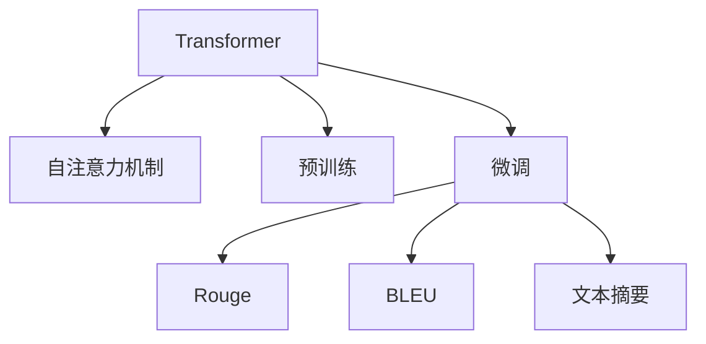

                 

# Transformer大模型实战 文本摘要任务

> 关键词：Transformer, 文本摘要, 自注意力机制, 大语言模型, 预训练, 微调, 自然语言处理(NLP)

## 1. 背景介绍

### 1.1 问题由来
文本摘要（Text Summarization）是从长文本中自动抽取关键信息，生成简洁明了的摘要文本，广泛应用于新闻报道、学术文献、法律文件等领域。传统的文本摘要方法依赖于规则或词典，难以捕捉语义和语法复杂性。近年来，基于深度学习的文本摘要方法逐步成为主流，取得了显著的进展。

Transformer大模型，如GPT-3、BERT等，通过预训练学习大量的语言知识和常识，具备强大的语言理解和生成能力。通过微调，这些大模型可以在特定任务上表现优异，为文本摘要任务的解决提供了新的可能。

### 1.2 问题核心关键点
Transformer大模型在文本摘要任务上的核心优势包括：
1. **语言理解能力**：Transformer大模型通过预训练能够学习到丰富的语言知识，可以理解复杂句子和长文本。
2. **生成能力**：大模型能够生成流畅、自然且符合语法规则的摘要文本，适合各种类型的文本摘要。
3. **泛化能力**：大模型对不同领域的文本摘要效果较好，且在少量标注数据下也能取得不错的性能。
4. **可扩展性**：大模型可以通过微调快速适应不同的摘要需求，无需从头构建模型。
5. **高效性**：微调过程可以在少量数据集上快速进行，不需要大规模计算资源。

### 1.3 问题研究意义
研究基于Transformer大模型的文本摘要方法，可以加速文本处理任务的自动化，提升信息获取的效率和质量。对于出版物、文档、新闻报道等领域，自动生成摘要将大幅降低人工阅读和整理的工作量，提高信息的传播速度和可访问性。

此外，文本摘要技术还可以辅助决策制定、知识图谱构建、问答系统优化等，推动人工智能技术在各行各业的应用。Transformer大模型在文本摘要中的应用，展示了人工智能技术在自然语言处理领域的强大潜力。

## 2. 核心概念与联系

### 2.1 核心概念概述

为了更好地理解Transformer大模型在文本摘要任务中的应用，本节将介绍几个关键概念：

- **Transformer模型**：基于自注意力机制的神经网络结构，能够高效处理序列数据，广泛应用于NLP领域。
- **预训练（Pre-training）**：在大规模无标签数据上训练模型，学习通用的语言表示。
- **微调（Fine-tuning）**：在预训练模型的基础上，使用特定任务的数据集进行有监督的训练，优化模型在该任务上的性能。
- **自注意力机制**：Transformer的核心，通过多头注意力机制捕捉不同位置间的关系，增强模型的语义理解能力。
- **文本摘要**：自动将长文本压缩成简短的摘要，保持原文本的主要信息。
- ** Rouge（Reuse-Oriented Retrieval）**：一种常用的文本摘要评估指标，用于衡量摘要与原文本的相似度。
- **BLEU（Bilingual Evaluation Understudy）**：另一常用的文本摘要评估指标，用于衡量生成文本与参考摘要之间的匹配度。

这些概念之间的逻辑关系可以通过以下Mermaid流程图来展示：



这个流程图展示了大语言模型和文本摘要任务的主要流程：

1. 使用Transformer模型进行自注意力机制学习。
2. 在大规模无标签数据上进行预训练，学习通用的语言表示。
3. 在特定任务的数据集上进行微调，优化模型在文本摘要任务上的性能。
4. 使用Rouge和BLEU评估微调后的模型表现。
5. 生成简洁、流畅的文本摘要。

## 3. 核心算法原理 & 具体操作步骤

### 3.1 算法原理概述

基于Transformer大模型的文本摘要任务，主要通过以下步骤实现：
1. **预训练**：在大规模无标签文本数据上训练预训练语言模型，学习语言结构和知识。
2. **微调**：在特定领域的文本摘要数据集上，使用有标签数据进行微调，优化模型在该任务上的性能。
3. **编码和解码**：将输入文本和摘要长度作为输入，生成摘要。

### 3.2 算法步骤详解

#### 3.2.1 预训练
预训练过程包括以下步骤：

1. **数据准备**：收集大规模无标签文本数据，如维基百科、新闻报道等。
2. **模型初始化**：使用Transformer模型作为初始化参数，如GPT-3或BERT。
3. **预训练任务**：使用自回归语言模型或掩码语言模型进行预训练，学习通用的语言表示。
4. **预训练数据处理**：将文本数据分批次输入模型，前向传播计算损失函数，反向传播更新模型参数。

#### 3.2.2 微调
微调过程包括以下步骤：

1. **数据准备**：收集特定领域的文本摘要数据集，如新闻摘要、科技文献摘要等。
2. **任务适配**：设计合适的损失函数和输出层，如使用Rouge作为损失函数，输出层为回归或分类。
3. **模型初始化**：将预训练模型作为初始化参数，保留大部分预训练权重。
4. **微调训练**：使用标注数据进行微调训练，调整模型参数以优化文本摘要性能。
5. **评估**：在验证集和测试集上评估微调后的模型表现，选择最优模型。

#### 3.2.3 编码和解码
编码和解码过程包括以下步骤：

1. **编码器**：将输入文本和摘要长度作为输入，通过Transformer模型进行编码，得到语义表示。
2. **解码器**：使用Attention机制生成摘要文本，通过Beam Search或Top-k采样策略选择最优生成路径。
3. **输出**：将解码器生成的摘要文本输出作为最终结果。

### 3.3 算法优缺点

基于Transformer大模型的文本摘要方法具有以下优点：

1. **高效性**：预训练和微调过程可以在少量数据集上快速进行，不需要大规模计算资源。
2. **广泛适用性**：适用于各种类型的文本摘要任务，如新闻、科技文献、法律文件等。
3. **灵活性**：可以通过微调适应不同的摘要需求，无需从头构建模型。
4. **性能优异**：在大规模无标签数据上进行预训练，学习通用的语言表示，在特定任务上进行微调后，表现优异。

同时，该方法也存在一定的局限性：

1. **依赖标注数据**：微调过程需要标注数据集，获取高质量标注数据的成本较高。
2. **模型复杂性**：Transformer模型参数量较大，需要较高的计算资源进行训练和推理。
3. **可解释性不足**：微调后的模型通常缺乏可解释性，难以解释其内部工作机制和决策逻辑。
4. **对抗样本敏感**：模型容易受到对抗样本的影响，生成的摘要可能包含不真实或误导性信息。

尽管存在这些局限性，基于Transformer大模型的文本摘要方法在实际应用中仍展现出显著的优势和潜力。

### 3.4 算法应用领域

基于Transformer大模型的文本摘要方法在多个领域得到了广泛应用：

- **新闻报道**：自动生成新闻摘要，提高新闻阅读效率。
- **学术论文**：提取论文关键信息，辅助学术研究和知识发现。
- **法律文件**：自动生成法律摘要，支持法律分析和案件判决。
- **技术文档**：提取技术文档的关键信息，帮助开发者快速理解文档内容。
- **电子商务**：自动生成商品描述和评论摘要，提升用户体验和购物效率。

除了这些经典应用外，文本摘要技术还被创新性地应用到更多场景中，如社交媒体分析、金融报告生成、医学文献摘要等，为信息处理和知识管理提供了新的工具。

## 4. 数学模型和公式 & 详细讲解 & 举例说明

### 4.1 数学模型构建

假设输入文本为 $x = (x_1, x_2, ..., x_n)$，摘要长度为 $k$，预训练Transformer模型为 $M_{\theta}$，其中 $\theta$ 为模型参数。

定义微调后的模型输出为 $y = (y_1, y_2, ..., y_k)$，目标为最大化Rouge分数。Rouge分数计算公式为：

$$
Rouge_{k,n} = \frac{\sum_{i=1}^{k} \sum_{j=1}^{n} \min(i, n+1-j) \cdot I(x_i, y_j)}{\sum_{i=1}^{k} \min(i, n+1-i)}
$$

其中，$I(x_i, y_j)$ 表示 $x_i$ 和 $y_j$ 的文本相似度。

### 4.2 公式推导过程

在微调过程中，我们通常使用交叉熵损失函数来优化模型。假设训练集为 $D=\{(x_i, y_i)\}_{i=1}^N$，其中 $y_i$ 为对应文本 $x_i$ 的真实摘要。微调的目标是最小化损失函数 $\mathcal{L}(\theta)$，即：

$$
\mathcal{L}(\theta) = -\frac{1}{N}\sum_{i=1}^N \sum_{j=1}^{k} \log p(y_j | x_i, \theta)
$$

其中，$p(y_j | x_i, \theta)$ 表示在给定输入文本 $x_i$ 和模型参数 $\theta$ 的情况下，生成摘要 $y_j$ 的概率。

通过反向传播算法，可以求得损失函数对参数 $\theta$ 的梯度，并使用梯度下降等优化算法更新模型参数。最终得到微调后的模型 $M_{\hat{\theta}}$，其输出为 $y = (y_1, y_2, ..., y_k)$。

### 4.3 案例分析与讲解

假设有一个新闻报道 $x = "A company reported that its profit increased by 20% this quarter. The CEO attributed the growth to new product lines and cost-cutting measures."$，希望生成一个长度为3的摘要。

1. **预训练**：使用GPT-3等Transformer模型进行预训练，学习通用的语言表示。
2. **微调**：在新闻摘要数据集上进行微调，优化模型在文本摘要任务上的性能。
3. **编码和解码**：将新闻报道和摘要长度作为输入，使用微调后的模型生成摘要。

假设微调后的模型输出为 $y = ("Company profit increases by 20%", "New product lines", "Cost-cutting measures")$，可以使用Rouge评估其与原文本的相似度，并使用BLEU评估其与参考摘要的匹配度。

## 5. 项目实践：代码实例和详细解释说明

### 5.1 开发环境搭建

在进行文本摘要实践前，我们需要准备好开发环境。以下是使用Python进行PyTorch开发的环境配置流程：

1. 安装Anaconda：从官网下载并安装Anaconda，用于创建独立的Python环境。

2. 创建并激活虚拟环境：
```bash
conda create -n pytorch-env python=3.8 
conda activate pytorch-env
```

3. 安装PyTorch：根据CUDA版本，从官网获取对应的安装命令。例如：
```bash
conda install pytorch torchvision torchaudio cudatoolkit=11.1 -c pytorch -c conda-forge
```

4. 安装其他必要的库：
```bash
pip install transformers datasets pandas matplotlib
```

5. 安装GPU驱动和CUDA：如果使用的是GPU环境，需要安装相应的GPU驱动和CUDA库，以便使用GPU加速训练。

完成上述步骤后，即可在`pytorch-env`环境中开始文本摘要实践。

### 5.2 源代码详细实现

下面是使用PyTorch和Hugging Face Transformers库实现基于Transformer大模型的文本摘要任务的代码示例。

```python
from transformers import AutoTokenizer, AutoModelForSeq2SeqLM
from datasets import load_dataset
import torch
import numpy as np

# 加载模型和分词器
model_name = 'gpt2-medium'
tokenizer = AutoTokenizer.from_pretrained(model_name)
model = AutoModelForSeq2SeqLM.from_pretrained(model_name)

# 加载数据集
dataset = load_dataset('news-article-summarization', split='train')
train_dataset = dataset['train']
train_dataset = train_dataset.shard(index=1, num_shards=4)

# 定义微调函数
def fine_tune(model, train_dataset, num_epochs, learning_rate, batch_size, optimizer):
    # 定义数据集迭代器
    train_dataloader = train_dataset.select(range(0, len(train_dataset))).shuffle(buffer_size=10000).batch(batch_size)
    device = torch.device('cuda') if torch.cuda.is_available() else torch.device('cpu')
    model.to(device)

    # 定义优化器
    optimizer = torch.optim.AdamW(model.parameters(), lr=learning_rate)

    # 训练循环
    for epoch in range(num_epochs):
        model.train()
        epoch_loss = 0
        for batch in train_dataloader:
            input_ids = batch['input_ids'].to(device)
            attention_mask = batch['attention_mask'].to(device)
            labels = batch['labels'].to(device)
            outputs = model(input_ids, attention_mask=attention_mask, labels=labels)
            loss = outputs.loss
            epoch_loss += loss.item()
            loss.backward()
            optimizer.step()
            optimizer.zero_grad()

        print(f'Epoch {epoch+1}, train loss: {epoch_loss:.3f}')

# 训练微调后的模型
num_epochs = 5
learning_rate = 1e-5
batch_size = 16
optimizer = torch.optim.AdamW(model.parameters(), lr=learning_rate)
fine_tune(model, train_dataset, num_epochs, learning_rate, batch_size, optimizer)

# 使用微调后的模型进行摘要生成
model.eval()
def generate_summary(text, max_length=100, num_beams=5):
    inputs = tokenizer.encode(text, return_tensors='pt', padding='max_length', truncation=True)
    outputs = model.generate(inputs, max_length=max_length, num_beams=num_beams)
    summary = tokenizer.decode(outputs[0], skip_special_tokens=True)
    return summary

text = "A company reported that its profit increased by 20% this quarter. The CEO attributed the growth to new product lines and cost-cutting measures."
summary = generate_summary(text)
print(summary)
```

这个代码示例展示了如何使用Hugging Face的Transformers库进行基于Transformer大模型的文本摘要任务微调。

### 5.3 代码解读与分析

代码解读：

1. **加载模型和分词器**：使用Hugging Face的`AutoTokenizer`和`AutoModelForSeq2SeqLM`加载预训练模型和分词器。
2. **加载数据集**：使用`datasets`库加载新闻摘要数据集，并按需划分训练集。
3. **定义微调函数**：定义微调过程，包括数据迭代器、优化器、训练循环等。
4. **训练微调后的模型**：设置微调参数，进行模型训练，并保存微调后的模型。
5. **生成摘要**：使用微调后的模型生成摘要文本，并进行解码输出。

代码分析：

1. **数据预处理**：使用分词器将输入文本和摘要长度编码成模型可处理的格式。
2. **模型微调**：在训练循环中，前向传播计算损失函数，反向传播更新模型参数。
3. **摘要生成**：使用微调后的模型生成摘要文本，并通过解码器输出摘要内容。

## 6. 实际应用场景

### 6.1 智能新闻聚合

基于Transformer大模型的文本摘要技术可以应用于智能新闻聚合平台，自动抓取新闻报道并生成摘要，帮助用户快速了解新闻要点。

在技术实现上，可以搭建一个数据抓取系统，定时从新闻网站爬取最新的新闻报道。然后使用微调后的模型对新闻进行自动摘要，生成简短精炼的摘要文本。最后，将摘要文本展示在用户界面中，方便用户快速浏览和阅读。

### 6.2 学术文献整理

在学术研究中，研究人员通常需要阅读大量文献并从中提取关键信息。使用Transformer大模型进行文本摘要，可以大大减少阅读和整理文献的工作量，提高研究效率。

具体而言，可以将最新的学术文献导入文本摘要系统，使用微调后的模型自动生成摘要，帮助研究人员快速把握文献的核心内容和研究方向。此外，还可以根据摘要进行文献筛选和排序，优化研究资源的配置。

### 6.3 法律文件分析

在法律领域，文本摘要技术可以帮助律师和法务人员快速阅读和理解法律文件，提高工作效率和准确性。

具体而言，可以将法律文件导入文本摘要系统，使用微调后的模型自动生成摘要，帮助律师快速定位相关法律条文和案例。此外，还可以根据摘要进行法律问题的筛选和排序，优化法律服务的质量。

### 6.4 技术文档总结

在技术开发中，开发者需要阅读大量的技术文档和代码示例，以获取所需的信息和灵感。使用Transformer大模型进行文本摘要，可以大大减少阅读和理解文档的时间，提高工作效率。

具体而言，可以将技术文档导入文本摘要系统，使用微调后的模型自动生成摘要，帮助开发者快速理解文档的主要内容和实现方法。此外，还可以根据摘要进行文档筛选和排序，优化技术资源的配置。

## 7. 工具和资源推荐

### 7.1 学习资源推荐

为了帮助开发者系统掌握Transformer大模型在文本摘要任务中的应用，这里推荐一些优质的学习资源：

1. **《Transformers from Syntax to Semantics》**：由Transformer论文的作者之一Jurafsky教授撰写的书籍，全面介绍了Transformer模型的原理和应用，包括文本摘要等NLP任务。
2. **Coursera《Natural Language Processing with Deep Learning》课程**：由斯坦福大学开设的NLP课程，讲解了深度学习在NLP中的应用，包括文本摘要任务。
3. **Kaggle《Text Summarization》竞赛**：参加Kaggle的文本摘要竞赛，实战练习并掌握先进的文本摘要技术。
4. **Hugging Face官方文档**：提供了大量预训练模型的API和样例代码，方便开发者快速上手实践。

通过对这些资源的学习实践，相信你一定能够快速掌握Transformer大模型在文本摘要任务中的应用，并用于解决实际的NLP问题。

### 7.2 开发工具推荐

高效的开发离不开优秀的工具支持。以下是几款用于Transformer大模型文本摘要开发的常用工具：

1. **PyTorch**：基于Python的开源深度学习框架，灵活动态的计算图，适合快速迭代研究。
2. **TensorFlow**：由Google主导开发的开源深度学习框架，生产部署方便，适合大规模工程应用。
3. **Hugging Face Transformers库**：集成了众多SOTA预训练模型，支持PyTorch和TensorFlow，方便微调和生成摘要。
4. **NLTK**：自然语言处理工具包，提供了丰富的文本处理功能，如分词、词性标注等。
5. **SpaCy**：另一个流行的自然语言处理工具包，提供了高效的文本处理和模型训练功能。

合理利用这些工具，可以显著提升文本摘要任务的开发效率，加快创新迭代的步伐。

### 7.3 相关论文推荐

Transformer大模型和文本摘要技术的发展源于学界的持续研究。以下是几篇奠基性的相关论文，推荐阅读：

1. **Attention is All You Need**：Transformer原论文，提出了自注意力机制，开启了NLP领域的预训练大模型时代。
2. **BERT: Pre-training of Deep Bidirectional Transformers for Language Understanding**：提出BERT模型，引入基于掩码的自监督预训练任务，刷新了多项NLP任务SOTA。
3. **A Survey on Text Summarization Technologies, Algorithms, and Models**：综述了文本摘要技术的发展历史和最新进展，提供了丰富的参考资源。
4. **Text Summarization with Transformer Models**：使用Transformer模型进行文本摘要任务的详细介绍，包括预训练和微调过程。
5. **Hierarchical Attention for Document Summarization**：提出了一种基于层次注意力的文本摘要方法，提高了摘要生成的质量和多样性。

这些论文代表了大语言模型文本摘要技术的发展脉络。通过学习这些前沿成果，可以帮助研究者把握学科前进方向，激发更多的创新灵感。

## 8. 总结：未来发展趋势与挑战

### 8.1 总结

本文对基于Transformer大模型的文本摘要方法进行了全面系统的介绍。首先阐述了文本摘要任务的背景和Transformer大模型的优势，明确了微调在拓展预训练模型应用、提升文本摘要性能方面的独特价值。其次，从原理到实践，详细讲解了微调的数学原理和关键步骤，给出了文本摘要任务开发的完整代码实例。同时，本文还广泛探讨了文本摘要方法在多个行业领域的应用前景，展示了微调范式的巨大潜力。

通过本文的系统梳理，可以看到，基于Transformer大模型的文本摘要方法正在成为NLP领域的重要范式，极大地拓展了预训练语言模型的应用边界，催生了更多的落地场景。受益于大规模语料的预训练，微调模型在文本摘要任务上表现优异，显著提高了信息获取的效率和质量。

### 8.2 未来发展趋势

展望未来，Transformer大模型文本摘要技术将呈现以下几个发展趋势：

1. **参数高效微调**：开发更加参数高效的微调方法，在固定大部分预训练参数的同时，只更新极少量的任务相关参数。
2. **多任务微调**：同时进行多个文本摘要任务的微调，提高模型的泛化能力和迁移性能。
3. **跨领域微调**：在不同领域的文本摘要任务上进行微调，增强模型的跨领域适应能力。
4. **混合微调**：结合生成式模型和提取式模型，综合利用两种方法的优势，提高摘要生成的质量和多样性。
5. **自监督微调**：使用自监督学习方法，在无标注数据上进行微调，减少对标注数据的依赖。
6. **强化学习微调**：引入强化学习机制，优化微调过程，提高模型的生成能力和表现。

以上趋势凸显了Transformer大模型文本摘要技术的广阔前景。这些方向的探索发展，必将进一步提升NLP系统的性能和应用范围，为人工智能技术在自然语言处理领域带来新的突破。

### 8.3 面临的挑战

尽管基于Transformer大模型的文本摘要技术已经取得了显著进展，但在迈向更加智能化、普适化应用的过程中，仍面临诸多挑战：

1. **数据质量和标注成本**：高质量标注数据获取成本高，标注数据质量和多样性不足。
2. **模型复杂性和资源消耗**：大规模Transformer模型参数量大，训练和推理资源消耗高。
3. **可解释性和鲁棒性**：微调后的模型通常缺乏可解释性，容易受到对抗样本的影响。
4. **泛化能力和迁移性能**：模型在不同领域的泛化能力和迁移性能有待进一步提升。
5. **实时性和计算效率**：如何提高模型的实时性和计算效率，适应实际应用场景的需求。

尽管存在这些挑战，通过不断的技术创新和优化，这些挑战终将逐步克服，Transformer大模型文本摘要技术必将在未来取得更大的突破。

### 8.4 研究展望

面对基于Transformer大模型的文本摘要技术所面临的挑战，未来的研究需要在以下几个方面寻求新的突破：

1. **数据增强和扩充**：通过数据增强和扩充技术，提高训练数据的多样性和覆盖面。
2. **模型压缩和优化**：开发更高效的模型压缩和优化技术，减小模型参数量和计算资源消耗。
3. **跨领域迁移学习**：研究跨领域迁移学习方法，提高模型在不同领域上的泛化能力和迁移性能。
4. **多任务和自监督学习**：结合多任务学习和自监督学习，提高模型的生成能力和泛化性能。
5. **对抗训练和鲁棒性提升**：引入对抗训练和鲁棒性提升技术，提高模型的鲁棒性和对抗样本的抵抗力。
6. **混合模型和多种方法融合**：结合生成式模型和提取式模型，综合利用两种方法的优势，提高摘要生成的质量和多样性。

这些研究方向将引领Transformer大模型文本摘要技术向更高的台阶迈进，为构建更智能、更高效的自然语言处理系统铺平道路。面向未来，需要不断地探索和创新，推动文本摘要技术的发展和应用。

## 9. 附录：常见问题与解答

**Q1: Transformer大模型在文本摘要任务中需要哪些步骤？**

A: 使用Transformer大模型进行文本摘要任务，需要以下步骤：
1. 预训练：在大规模无标签文本数据上训练预训练模型，学习通用的语言表示。
2. 微调：在特定领域的文本摘要数据集上，使用有标签数据进行微调，优化模型在该任务上的性能。
3. 编码和解码：将输入文本和摘要长度作为输入，生成摘要。

**Q2: 如何选择合适的学习率？**

A: 基于Transformer大模型的文本摘要微调，一般建议使用较小的学习率，以免破坏预训练权重。例如，可以使用1e-5的学习率，并在训练过程中逐步减小。

**Q3: 模型复杂性对计算资源有何影响？**

A: 由于Transformer大模型参数量较大，训练和推理过程需要较高的计算资源。可以采用以下策略来优化资源消耗：
1. 使用混合精度训练，减小计算精度要求。
2. 使用模型压缩技术，减小模型参数量和计算量。
3. 使用分布式训练，利用多GPU或多节点进行并行计算。

**Q4: 如何提高模型的鲁棒性？**

A: 提高Transformer大模型文本摘要的鲁棒性，可以采用以下方法：
1. 数据增强：通过回译、近义替换等方式扩充训练集，提高模型的泛化能力。
2. 对抗训练：引入对抗样本，训练模型对异常输入的鲁棒性。
3. 正则化：使用L2正则、Dropout等技术，避免模型过拟合。

**Q5: 模型在实际应用中需要注意哪些问题？**

A: 在实际应用中，Transformer大模型文本摘要需要注意以下问题：
1. 数据质量：确保训练数据的质量和多样性，避免模型在特定数据上出现过拟合。
2. 模型部署：使用分布式计算和模型压缩技术，提高模型的实时性和计算效率。
3. 模型更新：定期更新模型，保持其在新数据上的性能。
4. 模型监控：实时监控模型的性能和运行状态，及时发现和修复问题。

**Q6: 如何优化模型的实时性？**

A: 优化Transformer大模型文本摘要的实时性，可以采用以下方法：
1. 模型压缩：使用模型压缩技术，减小模型参数量和计算量。
2. 硬件加速：使用GPU或TPU等硬件加速器，提高计算速度。
3. 推理优化：优化推理过程，减少计算量和时间消耗。

这些问题的解答，旨在帮助开发者更好地理解和应用Transformer大模型在文本摘要任务中的应用。通过不断地实践和优化，相信你一定能够掌握这一强大的NLP技术，并应用于实际项目中。

---

作者：禅与计算机程序设计艺术 / Zen and the Art of Computer Programming

