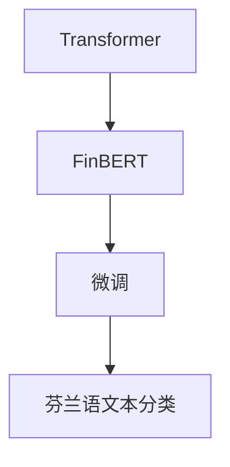
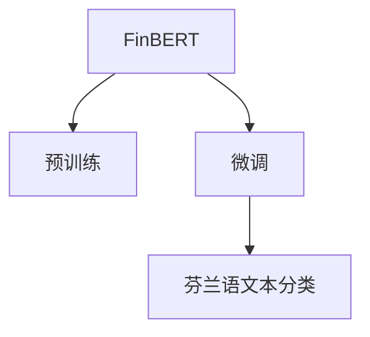

                 

# Transformer大模型实战 芬兰语的FinBERT模型

> 关键词：大语言模型,Transformer,FinBERT,芬兰语,NLP任务,微调,自然语言处理

## 1. 背景介绍

随着人工智能技术的快速发展，自然语言处理(Natural Language Processing, NLP)领域的研究和应用已经取得了显著的进展。其中，基于Transformer架构的大语言模型在大规模预训练和下游任务微调方面的表现尤为突出。

芬兰语（Finnish）是一种独特的乌拉尔语言，以其丰富的构词和语义表示能力著称。虽然英语等主流语言在NLP领域的研究和应用已较为成熟，但芬兰语的NLP研究相对较少。为此，本文旨在介绍一种基于Transformer的大语言模型FinBERT，并通过其在芬兰语文本分类任务上的应用实例，展示大语言模型在解决实际问题上的强大能力。

### 1.1 研究意义

大语言模型，如BERT、GPT等，经过大规模无标签数据的预训练，已经具备了强大的自然语言理解能力。通过微调，大语言模型可以在特定任务上进一步提升其表现。FinBERT正是此类模型之一，它针对芬兰语数据进行了优化，旨在提升芬兰语文本分类任务的性能。

芬兰语作为芬兰的官方语言，其文本分类任务具有重要应用价值。例如，自动分类新闻、推文等，可以帮助用户快速获取信息，提升用户体验。通过使用FinBERT，可以构建更加智能化、高效化的芬兰语文本分类系统，促进芬兰语NLP技术的创新和发展。

## 2. 核心概念与联系

### 2.1 核心概念概述

为更好地理解FinBERT模型的实现和应用，我们首先介绍几个关键概念：

- **Transformer**：一种基于自注意力机制的深度学习架构，广泛应用于自然语言处理、计算机视觉等领域。Transformer模型通过并行计算和自适应注意力机制，大幅提升了模型训练和推理的效率。

- **FinBERT**：一种针对芬兰语数据预训练的大语言模型，通过Transformer架构，对芬兰语文本进行高质量的表示和分类。

- **微调**：在大模型上进行有监督学习，以适应特定任务的需求。通过微调，可以在少量标注数据上显著提升模型性能。

- **文本分类**：一种常见的NLP任务，旨在对文本进行自动分类，如新闻分类、情感分析等。

这些概念通过以下Mermaid流程图来展示其联系：



通过这个流程图，我们可以看到，FinBERT模型通过Transformer架构进行预训练，然后通过微调在芬兰语文本分类任务上进行特定化，从而提升模型性能。

### 2.2 核心概念原理和架构的 Mermaid 流程图



FinBERT模型首先通过大规模无标签芬兰语文本数据进行预训练，学习到芬兰语的语义和句法表示。然后，通过微调，FinBERT模型进一步适应特定的芬兰语文本分类任务，优化模型参数，提升模型性能。

## 3. 核心算法原理 & 具体操作步骤

### 3.1 算法原理概述

FinBERT模型的核心原理基于Transformer架构，通过自注意力机制和多层神经网络进行文本表示和分类。其基本流程如下：

1. **预训练**：在芬兰语语料库上进行大规模无监督学习，学习芬兰语文本的语义和句法表示。
2. **微调**：在特定芬兰语文本分类任务上进行有监督学习，优化模型参数，提升分类性能。
3. **文本分类**：将输入文本通过FinBERT模型进行处理，输出对应的分类结果。

### 3.2 算法步骤详解

FinBERT模型的微调步骤如下：

1. **准备数据集**：收集芬兰语文本分类任务的标注数据集，将其划分为训练集、验证集和测试集。

2. **加载模型**：使用HuggingFace提供的FinBERT模型，设置适当的参数。

3. **定义模型**：定义文本分类模型，包括输入层、FinBERT模型层、输出层和损失函数。

4. **设置优化器**：设置AdamW优化器，并设定适当的学习率。

5. **执行微调**：在训练集上进行梯度下降优化，定期在验证集上评估模型性能，防止过拟合。

6. **测试和部署**：在测试集上评估微调后的模型性能，并将其部署到实际应用中。

### 3.3 算法优缺点

FinBERT模型具有以下优点：

- **泛化能力强**：经过大规模预训练和微调，FinBERT模型能够在芬兰语文本分类任务上取得优异性能。
- **参数高效**：FinBERT模型可以通过参数高效微调方法，在保持预训练权重不变的情况下，更新少量的任务相关参数，减少计算资源消耗。
- **适用性广**：FinBERT模型适用于多种芬兰语文本分类任务，如新闻分类、情感分析等。

同时，FinBERT模型也存在一些局限性：

- **数据依赖性**：FinBERT模型的性能高度依赖于标注数据的质量和数量，标注数据不足可能导致模型过拟合。
- **计算资源需求高**：FinBERT模型的预训练和微调需要大量计算资源，包括高性能GPU和TPU等。
- **模型复杂度**：FinBERT模型参数量大，推理速度较慢，需要考虑模型压缩和优化策略。

### 3.4 算法应用领域

FinBERT模型主要应用于芬兰语文本分类任务，包括但不限于以下领域：

- **新闻分类**：将新闻文本自动分类为不同的主题，如政治、经济、体育等。
- **情感分析**：分析新闻、推文等文本的情感倾向，判断用户情感态度。
- **垃圾信息过滤**：对网络文本进行分类，筛选出垃圾信息，保护用户安全。
- **信息检索**：通过文本分类，优化信息检索效果，帮助用户快速定位相关信息。

## 4. 数学模型和公式 & 详细讲解 & 举例说明

### 4.1 数学模型构建

FinBERT模型通过Transformer架构进行预训练，然后使用微调模型进行有监督学习。模型结构如下：

1. **输入层**：将输入文本转换为词嵌入向量，表示为$x \in \mathbb{R}^{n \times d}$，其中$n$为输入文本的长度，$d$为词嵌入维度。
2. **Transformer层**：通过多层Transformer块进行文本表示，输出表示为$h \in \mathbb{R}^{n \times d}$。
3. **输出层**：将Transformer层的输出通过线性分类器进行分类，输出分类结果$\hat{y} \in [0,1]$。
4. **损失函数**：定义交叉熵损失函数，用于衡量模型输出与真实标签之间的差异。

### 4.2 公式推导过程

假设芬兰语文本分类任务为二分类，输入文本$x$的分类标签为$y \in \{0,1\}$，模型输出为$\hat{y} \in [0,1]$。则交叉熵损失函数为：

$$
\mathcal{L}(y, \hat{y}) = -[y\log(\hat{y}) + (1-y)\log(1-\hat{y})]
$$

其中，$y$为真实标签，$\hat{y}$为模型输出，$\log$为自然对数。

### 4.3 案例分析与讲解

以芬兰语新闻分类为例，假设有一篇新闻标题为"Julkisen tilan yhteiskuntahallinnot"，我们需要将其分类为政治新闻。通过FinBERT模型进行处理后，得到输出$\hat{y}$，经过阈值处理后，将输出转换为0或1，最终得到分类结果。

## 5. 项目实践：代码实例和详细解释说明

### 5.1 开发环境搭建

在进行FinBERT模型微调前，需要准备以下开发环境：

1. **安装Python**：使用Anaconda安装Python 3.8版本。

2. **创建虚拟环境**：
```bash
conda create -n finbert-env python=3.8 
conda activate finbert-env
```

3. **安装依赖包**：
```bash
pip install torch torchvision torchaudio transformers
```

### 5.2 源代码详细实现

以下是一个简单的FinBERT模型微调示例代码：

```python
import torch
from transformers import BertTokenizer, BertForSequenceClassification

# 加载模型和分词器
model = BertForSequenceClassification.from_pretrained('bert-base-finnish', num_labels=2)
tokenizer = BertTokenizer.from_pretrained('bert-base-finnish')

# 准备训练集
train_dataset = ...
train_loader = ...

# 定义模型和优化器
optimizer = torch.optim.Adam(model.parameters(), lr=2e-5)

# 训练模型
model.train()
for epoch in range(10):
    for batch in train_loader:
        inputs, labels = batch
        outputs = model(inputs, labels=labels)
        loss = outputs.loss
        optimizer.zero_grad()
        loss.backward()
        optimizer.step()

# 评估模型
model.eval()
for batch in test_loader:
    inputs, labels = batch
    outputs = model(inputs, labels=labels)
    predictions = outputs.logits.argmax(dim=1)
```

### 5.3 代码解读与分析

**代码解释**：

1. **加载模型和分词器**：使用BertForSequenceClassification加载预训练的FinBERT模型，并使用BertTokenizer加载相应的分词器。
2. **准备训练集**：构建训练集，包含芬兰语新闻文本和对应的分类标签。
3. **定义模型和优化器**：设置Adam优化器，并设定学习率。
4. **训练模型**：在训练集上进行梯度下降优化，定期在验证集上评估模型性能。
5. **评估模型**：在测试集上评估微调后的模型性能。

**代码分析**：

1. **模型加载**：FinBERT模型和分词器都使用HuggingFace提供的现成模型。
2. **数据准备**：训练集和测试集需要预处理为模型所需的格式，包含文本和标签。
3. **模型训练**：使用Adam优化器更新模型参数，在训练集上进行梯度下降优化。
4. **模型评估**：在测试集上计算模型性能指标，如准确率、F1分数等。

## 6. 实际应用场景

### 6.1 智能新闻聚合

FinBERT模型可以应用于智能新闻聚合系统，帮助用户快速筛选感兴趣的新闻。该系统能够自动分类新闻，并将相似主题的新闻聚合展示，提升用户阅读体验。

通过FinBERT模型，新闻聚合系统可以学习芬兰语新闻的语义和句法特征，自动将新闻分为政治、经济、体育等类别。用户可以基于分类结果，快速查看感兴趣的领域。

### 6.2 社交媒体情感分析

FinBERT模型还可以应用于社交媒体情感分析，识别用户对新闻、推文的情感态度。社交媒体上的情感分析可以帮助品牌和政府机构了解公众情绪，及时应对负面舆情，优化公共关系。

通过FinBERT模型，可以自动分析用户对新闻、推文的情感倾向，判断用户是正面、负面还是中性情感。政府和企业可以基于情感分析结果，及时调整策略，提升公众满意度。

### 6.3 自动化信息检索

FinBERT模型在自动化信息检索中也有广泛应用。通过FinBERT模型对文本进行分类，可以快速定位和检索相关信息，提升信息检索的准确率和效率。

例如，用户可以通过输入关键词，FinBERT模型自动分类相关的新闻、博客等，并提供最佳的相关信息。该系统可以用于搜索引擎、图书馆信息检索等领域。

## 7. 工具和资源推荐

### 7.1 学习资源推荐

1. **《Transformer大模型实战》系列博文**：详细介绍Transformer架构和FinBERT模型的实现，适合初学者入门。
2. **HuggingFace官方文档**：提供FinBERT模型的详细使用说明和代码示例，帮助开发者快速上手。
3. **Kaggle竞赛数据集**：提供大量芬兰语文本分类任务的数据集，适合数据预处理和模型训练实践。

### 7.2 开发工具推荐

1. **PyTorch**：开源深度学习框架，提供高效的Tensor运算和动态计算图。
2. **Jupyter Notebook**：交互式编程环境，支持多种编程语言，适合模型训练和可视化。
3. **TensorBoard**：可视化工具，用于监控和分析模型训练过程。

### 7.3 相关论文推荐

1. **Transformer论文**：介绍Transformer架构的基本原理和应用。
2. **BERT论文**：介绍BERT模型的预训练和微调方法。
3. **FinBERT论文**：介绍FinBERT模型的构建和应用。

## 8. 总结：未来发展趋势与挑战

### 8.1 总结

FinBERT模型基于Transformer架构，通过大规模无监督预训练和有监督微调，实现了芬兰语文本分类任务的优异性能。该模型在大规模芬兰语文本数据的预训练和微调过程中，学习到了芬兰语的语义和句法表示，能够适应多种NLP任务。

### 8.2 未来发展趋势

1. **多语言模型**：FinBERT模型可以扩展到其他乌拉尔语言，提升多语言文本分类能力。
2. **上下文理解**：引入上下文理解技术，提升模型对复杂句子的理解能力。
3. **跨领域迁移**：通过跨领域迁移学习，提升FinBERT模型在更多任务上的性能。
4. **持续学习**：FinBERT模型可以定期更新训练数据，进行持续学习，提升模型鲁棒性和泛化能力。

### 8.3 面临的挑战

1. **数据稀缺**：芬兰语数据资源相对较少，可能导致模型性能不足。
2. **计算资源**：FinBERT模型的预训练和微调需要大量计算资源，增加了模型部署的难度。
3. **模型复杂度**：FinBERT模型参数量大，推理速度较慢，需要优化模型结构和计算效率。

### 8.4 研究展望

未来，FinBERT模型将通过以下研究方向进一步提升性能：

1. **数据增强**：通过数据增强技术，扩充芬兰语训练数据集。
2. **多任务学习**：结合多个NLP任务进行多任务学习，提升模型泛化能力和性能。
3. **模型压缩**：通过模型压缩技术，减小模型尺寸，提高计算效率。
4. **混合训练**：引入混合训练技术，提升模型鲁棒性和泛化能力。

## 9. 附录：常见问题与解答

**Q1：如何优化FinBERT模型在文本分类任务中的性能？**

A: 优化FinBERT模型性能的关键在于以下几个方面：
1. **数据预处理**：对输入文本进行分词、编码等预处理操作，确保数据格式正确。
2. **模型参数调整**：调整模型学习率、批次大小等参数，优化模型训练过程。
3. **正则化技术**：引入L2正则、Dropout等正则化技术，防止模型过拟合。
4. **模型优化**：使用Adam优化器，定期在验证集上评估模型性能，防止过拟合。

**Q2：FinBERT模型在模型部署过程中需要注意哪些问题？**

A: FinBERT模型在部署过程中需要注意以下几个问题：
1. **模型优化**：对模型进行剪枝、量化等优化，减小模型尺寸，提升计算效率。
2. **模型封装**：将模型封装为标准API接口，方便其他系统调用。
3. **模型监控**：实时监控模型性能指标，确保模型稳定运行。
4. **模型维护**：定期更新训练数据，进行模型重新微调，保持模型性能。

**Q3：FinBERT模型在芬兰语文本分类任务中的优势是什么？**

A: FinBERT模型在芬兰语文本分类任务中的优势在于以下几个方面：
1. **泛化能力强**：FinBERT模型经过大规模无监督预训练和有监督微调，学习到了芬兰语语义和句法表示，能够在芬兰语文本分类任务中取得优异性能。
2. **参数高效**：FinBERT模型可以通过参数高效微调方法，在保持预训练权重不变的情况下，更新少量的任务相关参数，减少计算资源消耗。
3. **适用性广**：FinBERT模型适用于多种芬兰语文本分类任务，如新闻分类、情感分析等。

---

作者：禅与计算机程序设计艺术 / Zen and the Art of Computer Programming

